# aitest · AI 测试全生命周期平台

以**项目**为业务隔离单元、以**需求文档与被测站点**为输入、以 **AI Agent** 为生产力、以 **Playwright / pytest / requests / Locust** 为执行引擎的测试平台。

它不是单点的「AI 生成用例工具」，而是把下面这条质量链路做成可追溯、可恢复、可审计的闭环：

```text
项目与环境配置
  → 需求文档上传、转换、标准化与版本化
  → AI 需求理解、澄清、可测试性检查
  → 站点探索与页面资产沉淀
  → 测试点 / 手工用例生成与评审
  → API / UI 自动化资产生成
  → 自动化与性能测试执行
  → 报告、失败诊断与自愈修复
  → 任务中心、日志与知识库持续沉淀
```

## 设计要点

| 目标 | 实现方式 |
| --- | --- |
| 统一输入 | 需求文档、站点探索结果、接口文档、知识库进入同一项目上下文 |
| 统一资产 | 需求版本、测试点、用例、自动化脚本、场景、报告全部版本化可追踪 |
| 统一智能能力 | 12 类 capability 集中注册，通过「模型分配」绑定模型，业务模块不硬编码模型 |
| 统一执行 | 后端调度，pytest / Playwright / requests / Locust 负责实际执行 |
| 统一任务视图 | 各模块运行记录投影为同一种任务模型，支持中断恢复，不会永久卡在「运行中」 |
| 统一审计 | 接口访问、业务操作、配置变更、任务生命周期进入日志体系 |
| 人机协同 | AI 输出先成为草稿、建议、差异或候选方案，再由用户确认后应用 |

## 功能模块

- **工作台**：控制台指标、硅基员工（Agent 目录）、统一任务中心
- **项目工作区**：项目管理、需求（上传转换 / 版本 / 澄清写回 / AI 评审）、站点探索（Playwright 页面遍历、元素与登录态识别）、知识库（项目级 + 全局，agentic 检索带引用）
- **测试资产**：测试用例（AI 生成 + 手动、评审、覆盖矩阵）、UI 自动化（pytest + Playwright）、接口自动化（OpenAPI 导入、用例生成、场景编排、执行与 Oracle 校验）、性能测试（Locust 脚本生成 + 执行 + 报告分析）、报告中心
- **系统管理**：模型配置与智能体模型分配、用户与权限（管理员 / 测试工程师 / 访客）、系统日志

## 界面预览

**项目**

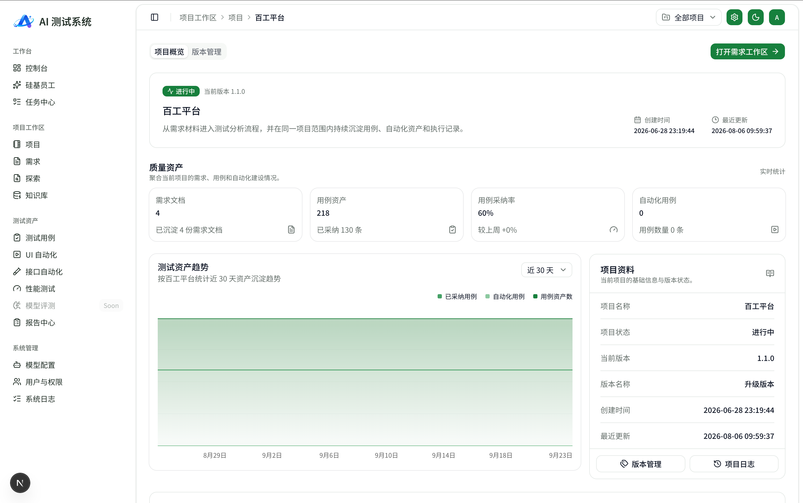

**需求**

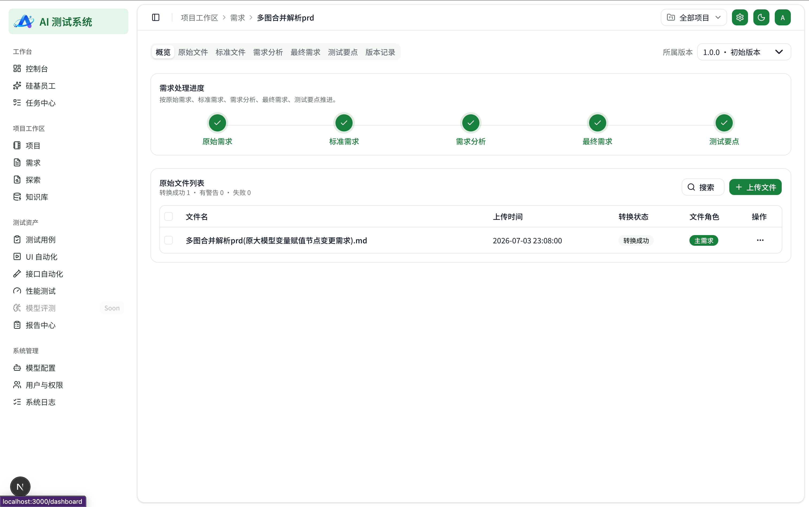

**测试点**

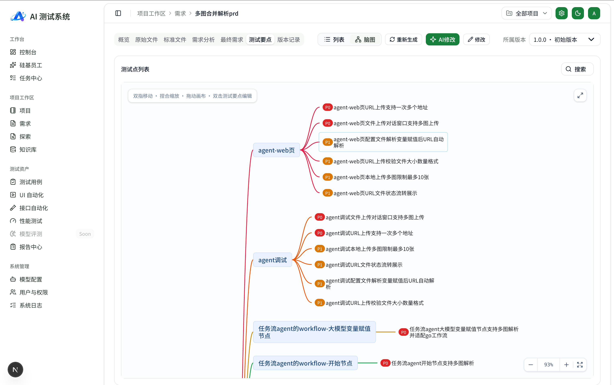

**WEB UI 探索**

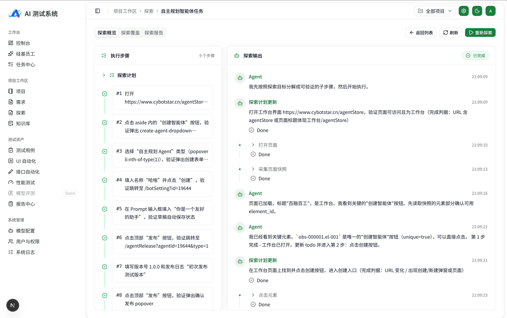

**知识库检索**

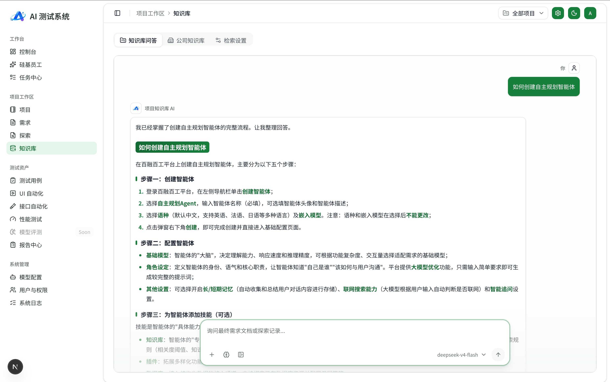

**测试用例**

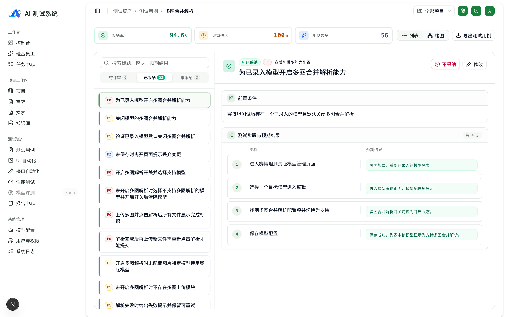

**UI 自动化**

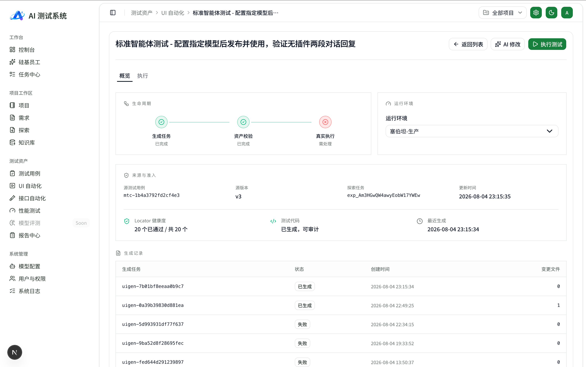

**接口自动化**

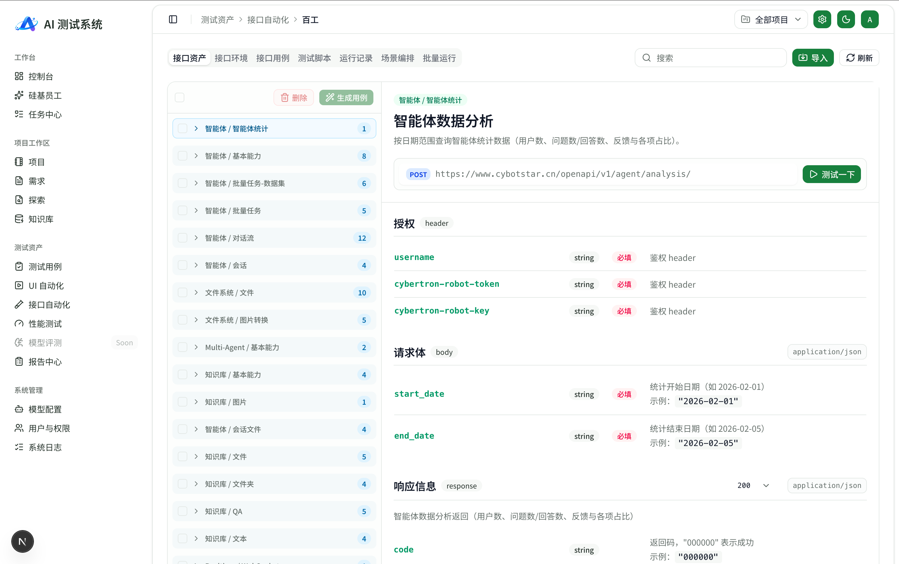

**接口编排**

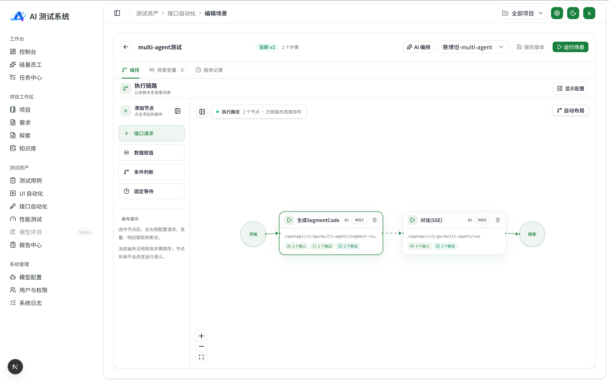

**性能自动化**

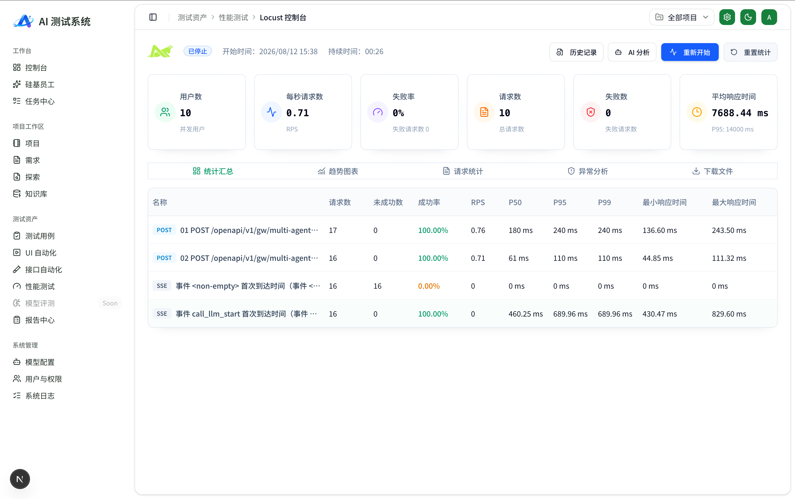

**测试报告**

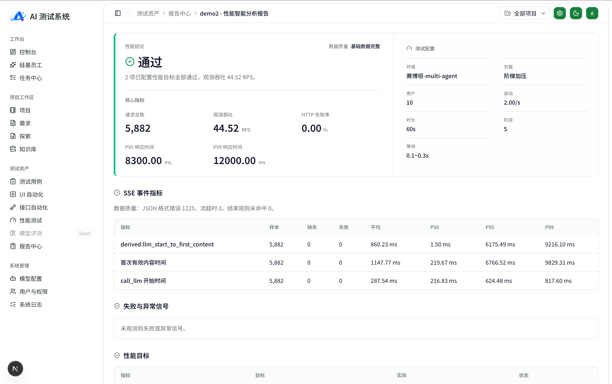

**模型分配**

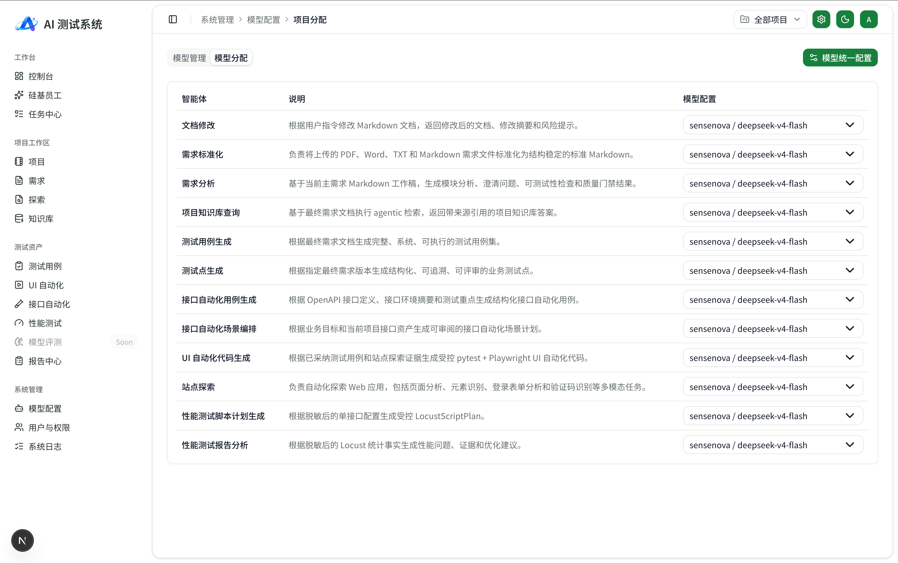

## AI 能力注册表

`requirement_standardization`、`requirement_analysis`、`document_editor`、`knowledge_query`、`test_point_generation`、`test_case_generation`、`api_test_generation`、`api_scenario_orchestration`、`ui_test_generation`、`page_exploration`、`performance_script_generation`、`performance_report_analysis`。

各业务 Agent 只声明任务与结构化输出，模型供应商由 `model_selection` 依据 capability 分配解析（OpenAI 兼容 / DeepSeek）。

## 技术栈

**前端**：Next.js 16（App Router）· React 19 · TypeScript · Tailwind CSS 4 · shadcn/ui · Zustand · SSE 实时流

**后端**：FastAPI · Python 3.12 · SQLite（原生 `sqlite3` + 仓储层）· LangChain / deepagents Agent Runtime · pytest · Playwright · requests · Locust

**架构分层**：

```text
Next.js 前端 ──Bearer Token / JSON + SSE──▶ FastAPI /api/v1
  路由层（鉴权、参数、项目作用域）
    → 领域服务层（状态机、事务、Runner 调度、任务恢复）
      → 仓储层（SQLite 元数据） + 文件制品（Markdown、脚本、截图、报告、日志）
      → Agent Runtime（capability → 模型分配 → LLM）
      → 执行引擎（pytest / Playwright / requests / Locust）
```

结构化元数据入库，大文件、脚本与运行产物落本地文件系统，避免把执行制品塞进数据库。

## 快速开始

后端（默认 `http://127.0.0.1:18000`）：

```bash
cd apps/backend
uv sync
uv run python -m app.server
```

前端（默认 `http://127.0.0.1:3000`）：

```bash
cd apps/frontend
npm install
npm run dev
```

一键启动（macOS）：

```bash
./apps/start/macos/start-macos.sh   # 另有 restart-macos.sh / stop-macos.sh
```

一键启动（Windows，PowerShell）：

```powershell
Set-ExecutionPolicy -Scope Process Bypass
.\apps\start\windows\start-windows.ps1   # 另有 restart-windows.ps1 / stop-windows.ps1
```

默认管理员账号：`admin / admin`（仅用于本地体验，部署前请修改）。

## Docker 部署

```bash
docker compose up --build   # 前端 http://localhost:3000
```

镜像里同时跑后端（`127.0.0.1:18000`，经 Next rewrite 转发）和 Next standalone，
对外只暴露 3000。环境变量写在根目录 `.env`（可选，缺失时用默认值），真正必填的只有大模型 Key：

| 变量 | 说明 |
|---|---|
| `DEEPSEEK_API_KEY` / `OPENAI_API_KEY` | 至少填一个，否则 AI 功能不可用 |
| `MODEL_PROVIDER` | `deepseek`（默认）或 `openai` |
| `MODEL_NAME` | 默认 `deepseek-chat` |
| `CORS_ALLOW_ORIGINS` | 逗号分隔的额外前端 origin |
| `FRONTEND_PORT` | 宿主机端口，默认 3000 |
| `TZ` | 默认 `Asia/Shanghai` |

其余变量（上传大小/并发限制、知识库 ID 等）保持代码内默认值即可。

## 目录结构

```text
apps/backend    FastAPI 后端：api / services / repositories / agents / runners
apps/frontend   Next.js 前端：app 路由、组件、导航、api-client
apps/start      macOS / Windows 启动与停止脚本
docs            产品 PRD、前后端方案与架构文档（事实基线）、界面截图
openspec        变更提案与规格

根目录其余文件为容器化配置：`Dockerfile`、`docker-compose.yml`、`.dockerignore`。
```

## 文档

- `docs/00-产品文档/`：各模块 PRD（需求、探索、知识库、用例、UI/接口自动化、性能、模型配置、任务、日志等）
- `docs/01-总览索引/`：PRD 确认索引、模块实现详解
- `docs/03-后端架构与数据/`、`docs/05-前端方案/`：架构与前端方案
- `apps/backend/README.md`：后端运行、种子账号与有头浏览器说明
