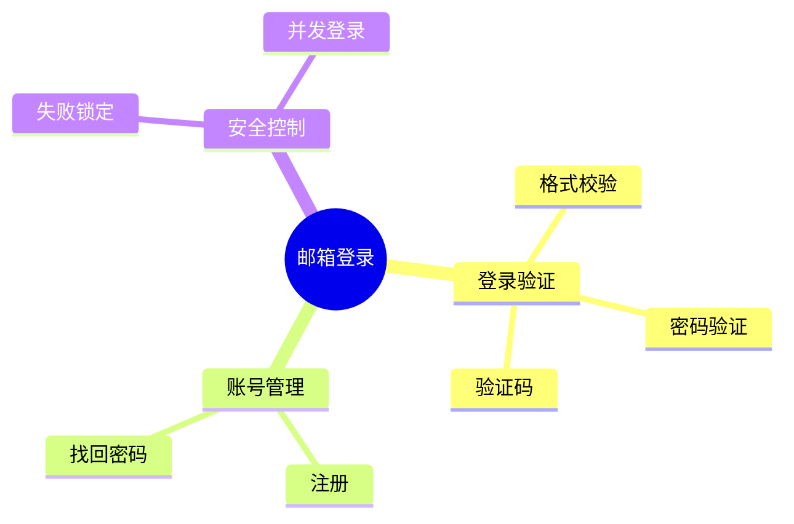
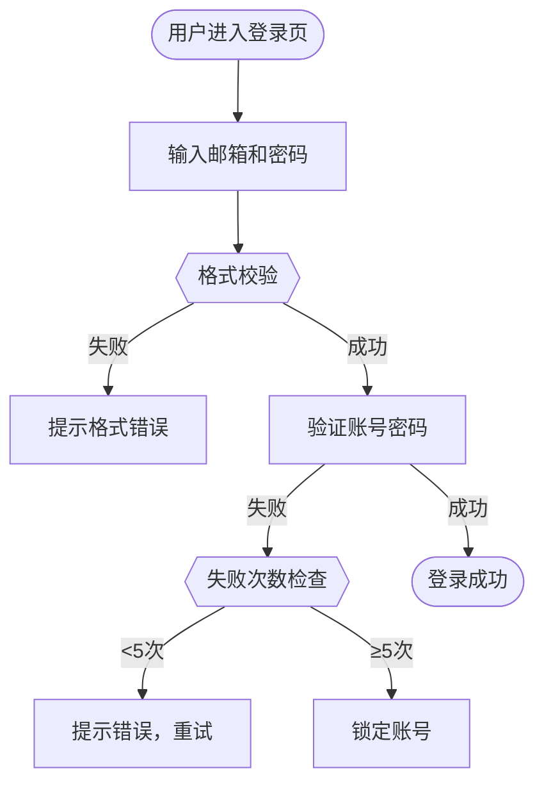

# 需求分析架构对比

## 架构演进

### 旧架构（仅测试场景提取）
```
需求文档
    ↓
测试场景提取
    ↓
可测试性评估
    ↓
QA视图
```

**问题**：
- ❌ 没有快速理解阶段，QA需要自己读完整需求才能开始
- ❌ 直接跳到测试场景提取，对复杂需求不友好
- ❌ 缺少可视化辅助（功能地图、流程图）
- ❌ 没有快速FAQ，常见问题需要反复问

---

### 新架构（快速理解 + 测试场景）
```
需求文档
    ↓
【第1步】快速理解（3-5分钟）★ 新增
  • 智能摘要
  • 功能地图（Mermaid mindmap）
  • 核心流程图（Mermaid flowchart）
  • 快速FAQ（10个常见问题）
    ↓
【第2步】测试场景提取（10-15分钟）★ 保留
  • 功能点清单
  • Given-When-Then场景
  • 数据流图（Mermaid graph）
  • 风险热点
    ↓
【第3步】可测试性评估 ★ 保留
  • 可测试性评分（0-100）
  • 阻塞项识别
    ↓
【第4步】综合QA视图 ★ 升级
  • 整合所有内容
  • 测试清单
  • 覆盖度分析
  • 所有可视化图表
```

**优势**：
- ✅ 3-5分钟快速理解，无需读完整需求
- ✅ 智能摘要突出核心和风险
- ✅ 可视化图表（功能地图、流程图、数据流图）
- ✅ 快速FAQ解答常见问题
- ✅ 保留所有原有测试场景功能
- ✅ 综合视图整合所有信息

---

## 组件对比

| 组件 | 旧架构 | 新架构 | 说明 |
|------|--------|--------|------|
| **快速理解助手** | ❌ 无 | ✅ RequirementUnderstandingAssistant | 新增，3-5分钟快速理解 |
| **测试场景提取** | ✅ TestScenarioExtractor | ✅ TestScenarioExtractor | 保留，不变 |
| **可测试性评估** | ✅ TestabilityAssessor | ✅ TestabilityAssessor | 保留，不变 |
| **QA视图生成** | ✅ QAViewGenerator | ✅ 整合到ComprehensiveQAOrchestrator | 升级，整合快速理解 |
| **编排器** | ✅ QAOrientedRequirementOrchestrator | ✅ ComprehensiveQAOrchestrator | 升级，支持完整流程 |

---

## 输出对比

### 旧架构输出
```python
QARequirementView(
    test_checklist=[...],
    risk_hotspots=[...],
    data_flow_diagram="...",
    feature_map_diagram=None,  # ❌ 没有
    state_machines=[],
    coverage_analysis={...},
    testability_assessment={...},
    summary="..."
)
```

### 新架构输出
```python
ComprehensiveQAView(
    # ========== 新增：快速理解 ==========
    quick_understanding=QuickUnderstandingView(
        summary=SmartSummary(...),           # ✅ 智能摘要
        feature_map_diagram="...",           # ✅ 功能地图
        core_flow_diagram="...",             # ✅ 核心流程图
        faq=[FAQItem(...)],                  # ✅ 快速FAQ
    ),
    
    # ========== 保留：测试场景 ==========
    test_scenarios=TestScenarioInsight(
        features=[...],
        test_scenarios=[...],
        data_flow=[...],
        data_flow_mermaid="...",
        risk_hotspots=[...],
        summary="..."
    ),
    
    # ========== 保留：可测试性 ==========
    testability=TestabilityAssessment(
        score=85,
        testable_features=[...],
        untestable_features=[...],
        blocking_issues=[...],
        summary="..."
    ),
    
    # ========== 升级：综合视图 ==========
    test_checklist=[...],
    coverage_analysis={...},
    all_diagrams=AllDiagrams(              # ✅ 所有图表集中管理
        feature_map="...",
        core_flow="...",
        data_flow="...",
        state_machines=[...]
    ),
    summary="..."
)
```

---

## 使用场景对比

### 场景1: QA刚拿到需求

**旧架构**：
1. 自己读完整需求（30分钟+）
2. 运行分析工具
3. 看测试场景
4. 看可测试性评估

**新架构**：
1. 运行分析工具
2. 先看快速理解（3-5分钟）
   - 智能摘要：知道核心是什么
   - 功能地图：知道有哪些功能
   - 核心流程图：知道怎么用
   - 快速FAQ：常见问题直接有答案
3. 再看测试场景（如果需要深入）
4. 最后看可测试性评估

⏱️ **时间节省**: 30分钟 → 5分钟（快速理解阶段）

---

### 场景2: 需求评审会议

**旧架构**：
- QA需要提前读完整需求
- 会上只能问"这个功能是干什么的？"
- 没有可视化辅助

**新架构**：
- 会前3分钟看快速理解
- 会上直接讨论关键风险和FAQ
- 功能地图和流程图投屏展示
- 讨论更高效

---

### 场景3: 复杂需求（10页+）

**旧架构**：
- QA读需求至少1小时
- 容易遗漏关键点
- 没有结构化理解

**新架构**：
- 5分钟快速理解核心
- 功能地图展示结构
- FAQ覆盖关键问题
- 需要时再深入测试场景

---

## Mermaid可视化对比

### 旧架构
- ✅ 数据流图（Data Flow）
- ✅ 状态机图（State Machine，如果有）

### 新架构
- ✅ 数据流图（Data Flow）- 保留
- ✅ 状态机图（State Machine）- 保留
- ✅ 功能地图（Feature Map）- **新增**
- ✅ 核心流程图（Core Flow）- **新增**

**示例：功能地图**


**示例：核心流程图**


---

## API对比

### 旧架构
```python
# 只有一种分析方式
orchestrator = QAOrientedRequirementOrchestrator(model)
result = await orchestrator.analyze(requirement_doc)
```

### 新架构
```python
# 方式1: 完整分析（快速理解 + 测试场景 + 可测试性）
orchestrator = ComprehensiveQAOrchestrator(model)
result = await orchestrator.analyze(requirement_doc)

# 方式2: 简化分析（长文档优化）
result = await orchestrator.analyze_simple(requirement_doc, max_doc_length=5000)

# 方式3: 只要快速理解（3-5分钟）
from app.agents.requirement_analysis.requirement_understanding_assistant import (
    RequirementUnderstandingAssistant
)
assistant = RequirementUnderstandingAssistant(model)
quick_view = await assistant.generate_quick_view(requirement_doc)
```

---

## 迁移指南

### 如果你使用旧架构
```python
# 旧代码
from app.agents.requirement_analysis.qa_orchestrator import QAOrientedRequirementOrchestrator

orchestrator = QAOrientedRequirementOrchestrator(model)
result = await orchestrator.analyze(doc)
```

### 迁移到新架构
```python
# 新代码（向后兼容）
from app.agents.requirement_analysis.comprehensive_orchestrator import ComprehensiveQAOrchestrator

orchestrator = ComprehensiveQAOrchestrator(model)
result = await orchestrator.analyze(doc)

# 使用新功能
print("快速理解:")
print(result.quick_understanding.summary.core_function)
print(result.quick_understanding.feature_map_diagram)

# 原有功能仍然可用
print("测试场景:")
for scenario in result.test_scenarios.test_scenarios:
    print(scenario.title)
```

---

## 总结

### 核心改进
1. ✅ **新增快速理解层** - 3-5分钟快速扫描，无需读完整需求
2. ✅ **智能摘要** - 突出核心功能、变更、风险
3. ✅ **可视化增强** - 功能地图、核心流程图、数据流图
4. ✅ **快速FAQ** - 自动生成10个常见问题
5. ✅ **保留所有原有功能** - 测试场景提取、可测试性评估

### 去掉的功能
- ❌ **智能推荐** - 根据用户要求去掉

### 适用场景
- ✅ 快速理解新需求（3-5分钟）
- ✅ 需求评审会议准备
- ✅ 复杂需求结构化分析
- ✅ 完整测试场景生成
- ✅ 可测试性评估
