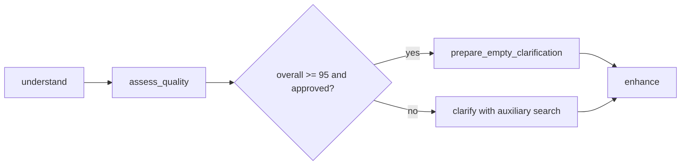

# Requirement Analysis Agent

This package is the canonical LangGraph implementation for requirement analysis.

## Layout

```text
requirement_analysis/
├── __init__.py
├── agent.py                    # legacy LangChain sub-agent helpers
├── schemas.py                  # workflow input/output and node schemas
├── service.py                  # legacy service wrapper used by tests/tools
├── workflow.py                 # LangGraph orchestration entrypoint
├── state.py                    # LangGraph state contract
├── nodes/                      # understand, quality, clarify, enhance nodes
├── services/                   # workflow support services
├── tools/                      # LangChain tools
├── search.py                   # auxiliary document search agent
└── utils/                      # report, sorting, enhancement helpers
```

## Runtime Entry Point

Use:

```python
from app.agents.requirement_analysis.workflow import run_requirement_analysis
```

The document service calls this workflow directly for requirement review runs.

## Workflow



The separate `app.agents.requirement_auxiliary_enhancement` package remains the canonical auxiliary enhancement agent.
