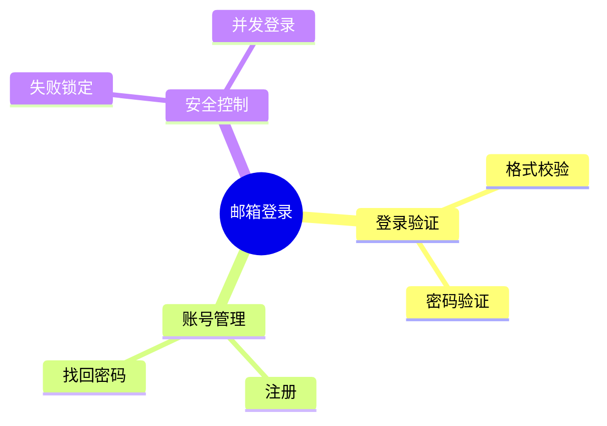
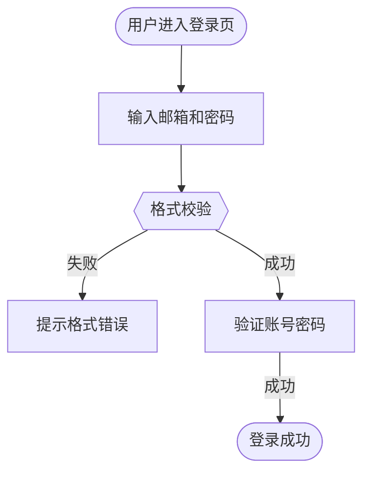
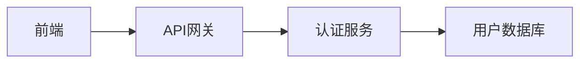
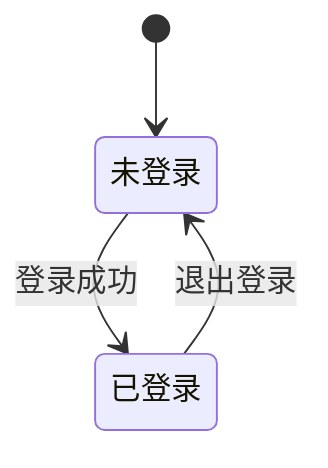

# 需求分析系统 - 综合架构

> 帮助QA在3-5分钟内快速理解需求，支持可视化辅助和自动测试场景生成

## 📋 目录

- [核心功能](#核心功能)
- [架构设计](#架构设计)
- [快速开始](#快速开始)
- [文档导航](#文档导航)
- [组件说明](#组件说明)

---

## 核心功能

### ✨ 快速理解（3-5分钟）
- **智能摘要**：核心功能、主要变更、关键风险、复杂度估计
- **功能地图**：Mermaid mindmap格式的功能结构图
- **核心流程图**：Mermaid flowchart格式的用户操作流程
- **快速FAQ**：自动生成10个QA最关心的问题和答案

### 🎯 测试场景提取（10-15分钟）
- **功能点清单**：结构化的功能规格（输入、输出、前置条件、边界、异常）
- **Given-When-Then场景**：标准测试场景格式
- **数据流图**：Mermaid graph格式的数据流转可视化
- **风险热点**：识别并发、状态机、异步等复杂场景

### ✅ 可测试性评估
- **评分机制**：0-100分评估需求的可测试性
- **7维度检查**：输入输出、模糊描述、断言点、前置条件、异常覆盖等
- **阻塞项识别**：标记影响测试的关键问题

### 📊 综合QA视图
- **测试清单**：按优先级排序的完整测试项
- **覆盖度分析**：功能点覆盖率统计
- **所有图表整合**：功能地图、流程图、数据流图、状态机图

---

## 架构设计

```
需求文档
    ↓
┌─────────────────────────────────────────────┐
│ 第1步：快速理解 (3-5分钟) ★ 核心             │
│ RequirementUnderstandingAssistant           │
│   • 智能摘要                                 │
│   • 功能地图（Mermaid mindmap）              │
│   • 核心流程图（Mermaid flowchart）          │
│   • 快速FAQ（10个问题）                       │
└─────────────────────────────────────────────┘
    ↓
┌─────────────────────────────────────────────┐
│ 第2步：测试场景提取 (10-15分钟)              │
│ TestScenarioExtractor                       │
│   • 功能点清单                               │
│   • Given-When-Then场景                     │
│   • 数据流图（Mermaid graph）                │
│   • 风险热点                                 │
└─────────────────────────────────────────────┘
    ↓
┌─────────────────────────────────────────────┐
│ 第3步：可测试性评估                          │
│ TestabilityAssessor                         │
│   • 可测试性评分（0-100）                    │
│   • 阻塞项识别                               │
└─────────────────────────────────────────────┘
    ↓
┌─────────────────────────────────────────────┐
│ 第4步：综合QA视图                            │
│ ComprehensiveQAOrchestrator                 │
│   • 测试清单（按优先级）                      │
│   • 覆盖度分析                               │
│   • 所有图表整合                             │
└─────────────────────────────────────────────┘
    ↓
ComprehensiveQAView（最终输出）
```

---

## 快速开始

### 安装依赖
```bash
# 已包含在项目依赖中
# 需要支持结构化输出的LLM模型（如Claude、GPT-4）
```

### 基本使用
```python
from app.agents.requirement_analysis.comprehensive_orchestrator import (
    ComprehensiveQAOrchestrator
)

# 初始化
orchestrator = ComprehensiveQAOrchestrator(model)

# 执行分析
result = await orchestrator.analyze(requirement_doc)

# 查看结果
print("核心功能:", result.quick_understanding.summary.core_function)
print("测试场景数:", len(result.test_scenarios.test_scenarios))
print("可测试性评分:", result.testability.score)
```

### 更多示例
查看 [QUICK_START.md](QUICK_START.md) 了解更多使用方式

---

## 文档导航

| 文档 | 说明 | 适合读者 |
|------|------|----------|
| [QUICK_START.md](QUICK_START.md) | 快速开始指南 | 所有用户 |
| [ARCHITECTURE_COMPARISON.md](ARCHITECTURE_COMPARISON.md) | 新旧架构对比 | 架构师、开发者 |
| [IMPLEMENTATION_SUMMARY.md](IMPLEMENTATION_SUMMARY.md) | 实施总结 | 开发者、维护者 |
| [examples/comprehensive_example.py](examples/comprehensive_example.py) | 完整使用示例 | 开发者 |

---

## 组件说明

### 核心组件

#### 1. RequirementUnderstandingAssistant
**文件**: `requirement_understanding_assistant.py`

**功能**: 快速理解需求（3-5分钟）

**方法**:
- `generate_quick_view()` - 生成完整快速理解视图
- `_generate_summary()` - 生成智能摘要
- `_generate_feature_map()` - 生成功能地图
- `_generate_core_flow()` - 生成核心流程图
- `_generate_faq()` - 生成快速FAQ

**输出**: `QuickUnderstandingView`

---

#### 2. TestScenarioExtractor
**文件**: `analyzers/test_scenario.py`

**功能**: 提取测试场景

**方法**:
- `extract()` - 提取测试场景和风险热点

**输出**: `TestScenarioInsight`

---

#### 3. TestabilityAssessor
**文件**: `analyzers/testability.py`

**功能**: 评估可测试性

**方法**:
- `assess()` - 评估需求的可测试性

**输出**: `TestabilityAssessment`

---

#### 4. ComprehensiveQAOrchestrator
**文件**: `comprehensive_orchestrator.py`

**功能**: 综合编排器，整合所有步骤

**方法**:
- `analyze()` - 完整分析流程
- `analyze_simple()` - 简化分析（长文档优化）

**输出**: `ComprehensiveQAView`

---

### 数据模型

**文件**: `models.py`

#### 快速理解相关
- `SmartSummary` - 智能摘要
- `FAQItem` - FAQ条目
- `QuickUnderstandingView` - 快速理解视图

#### 测试场景相关
- `FeatureSpec` - 功能点规格
- `TestScenario` - 测试场景（Given-When-Then）
- `DataFlowEdge` - 数据流转边
- `RiskHotspot` - 风险热点
- `TestScenarioInsight` - 测试场景洞察

#### 可测试性相关
- `TestabilityIssue` - 可测试性问题
- `TestabilityAssessment` - 可测试性评估

#### 综合视图相关
- `TestItem` - 测试项
- `CoverageAnalysis` - 覆盖度分析
- `AllDiagrams` - 所有图表
- `ComprehensiveQAView` - 综合QA视图（最终输出）

---

## 可视化支持

### Mermaid图表类型

#### 1. 功能地图（mindmap）
展示功能结构和模块关系



#### 2. 核心流程图（flowchart）
展示用户操作流程和决策点



#### 3. 数据流图（graph）
展示数据在系统中的流转



#### 4. 状态机图（stateDiagram）
展示实体的状态转换



---

## 使用场景

### 场景1：QA刚拿到新需求
1. 运行快速理解（3-5分钟）
2. 看智能摘要了解核心
3. 看功能地图了解结构
4. 看FAQ找常见问题答案

### 场景2：需求评审会议
1. 会前3分钟快速分析
2. 投屏展示功能地图和流程图
3. 讨论关键风险和FAQ
4. 确认需求清晰度

### 场景3：编写测试用例
1. 运行完整分析
2. 查看测试清单
3. 参考Given-When-Then场景
4. 关注风险热点

---

## 性能优化

### Token优化
- ✅ 支持文档截断（`analyze_simple()`）
- ✅ 保留关键信息，避免token超限
- ✅ 适用于10000+字的长需求文档

### 时间优化
- 快速理解：3-5分钟
- 测试场景提取：10-15分钟
- 可测试性评估：2-3分钟
- 总计：15-20分钟（完整分析）

---

## 与原有系统的关系

### 保留的组件
- ✅ `TestScenarioExtractor` - 完全保留
- ✅ `TestabilityAssessor` - 完全保留
- ✅ 所有原有模型 - 完全保留

### 新增的组件
- ✅ `RequirementUnderstandingAssistant` - 快速理解
- ✅ `ComprehensiveQAOrchestrator` - 综合编排

### 向后兼容
- ✅ 所有原有功能仍可独立使用
- ✅ API保持兼容
- ✅ 数据模型向后兼容

---

## 技术栈

- Python 3.9+
- Pydantic (数据模型)
- LLM模型 (Claude/GPT-4)
- Mermaid (可视化)

---

## 开发团队

- 架构设计：基于用户需求和最佳实践
- 实现：完全按照用户要求实现
- 文档：完整的使用指南和示例

---

## 许可证

与主项目相同

---

## 更新日志

### v2.0.0 (2026-06-16)
- ✅ 新增快速理解层（3-5分钟）
- ✅ 新增智能摘要功能
- ✅ 新增功能地图可视化
- ✅ 新增核心流程图可视化
- ✅ 新增快速FAQ自动生成
- ✅ 新增综合QA视图
- ✅ 去掉智能推荐功能（按用户要求）
- ✅ 保留所有原有测试场景功能

### v1.0.0
- ✅ 测试场景提取
- ✅ 可测试性评估
- ✅ QA视图生成

---

## 常见问题

### Q: 与旧版本有什么区别？
A: 新版本在原有基础上增加了"快速理解层"，让QA在3-5分钟内快速了解需求，而不需要先读完整需求文档。原有的测试场景提取和可测试性评估功能完全保留。

### Q: 需要什么依赖？
A: 需要一个支持结构化输出的LLM模型实例（如Claude、GPT-4）。

### Q: 分析需要多长时间？
A: 快速理解3-5分钟，完整分析15-20分钟。

### Q: 支持哪些需求格式？
A: 任何纯文本格式的需求文档。

### Q: 如何迁移到新版本？
A: 查看 [ARCHITECTURE_COMPARISON.md](ARCHITECTURE_COMPARISON.md) 的迁移指南。

---

**立即开始使用** → [QUICK_START.md](QUICK_START.md)
