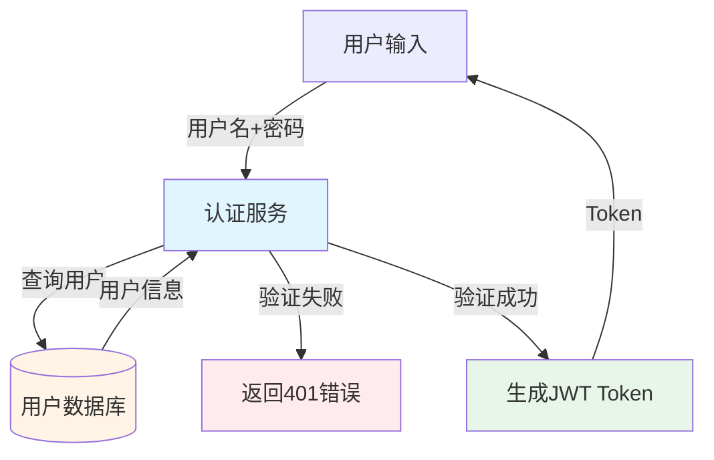
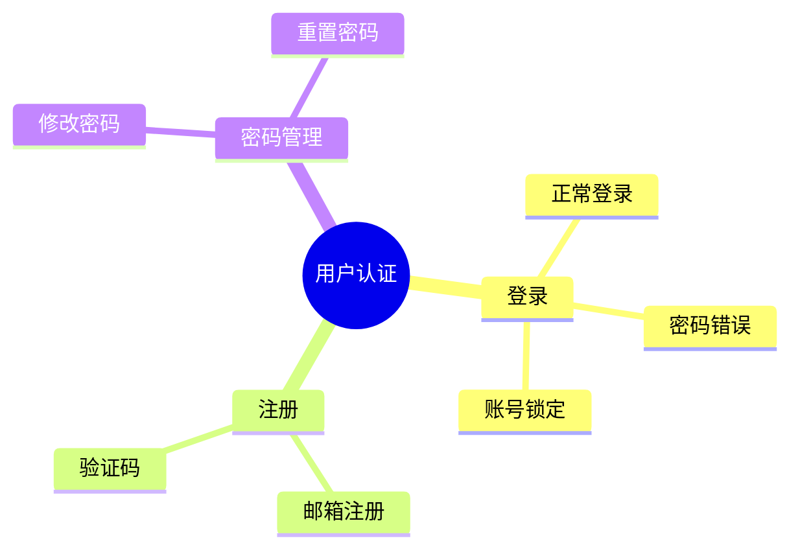

# 需求分析架构改进 - QA导向设计

## 📋 概述

本次改进将需求分析架构从**开发理解视角**转向**QA测试视角**，目标是让QA快速理解需求、不遗漏需求，并提供丰富的可视化辅助。

## 🎯 核心改进

### 1. 测试场景优先（而非业务分析优先）

**改进前**：
```
需求文档 → 业务分析（痛点、价值） → 领域建模（实体、关系） → 风险识别
```

**改进后**：
```
需求文档 → 测试场景提取（Given-When-Then） → 可测试性评估 → QA视图生成
```

### 2. 输出可执行的测试信息

**改进前**：
- 输出：业务痛点、核心价值、领域实体、不变性约束
- 问题：对QA太抽象，需要二次转化

**改进后**：
- 输出：Given-When-Then测试场景、断言点、测试数据、风险热点
- 优势：可直接转化为测试用例

### 3. Token优化（减少50%+）

**改进前**：
```
业务分析：requirement_doc (30KB)
领域建模：requirement_doc (30KB) + BusinessInsight JSON (10KB) = 40KB
风险识别：requirement_doc (30KB) + BusinessInsight (10KB) + DomainModel (15KB) = 55KB
```

**改进后**：
```
测试场景提取：requirement_doc (30KB)
领域建模：truncated_doc (5KB) + summary (1KB) = 6KB
可测试性评估：TestScenarioInsight summary (5KB)
```

### 4. 丰富的可视化支持

**改进前**：
- 只有状态机图（Mermaid）

**改进后**：
- 数据流图（Mermaid flowchart）
- 功能地图（Mermaid mindmap）
- 状态机图（继承）
- 覆盖度分析图

### 5. 统一的QA视图

**改进前**：
- QA需要跨越多个输出查找信息
- 同样概念用不同字段名

**改进后**：
- 一站式QA Dashboard
- 测试清单 + 风险热点 + 覆盖度 + 可视化

## 📦 新增组件

### 1. TestScenarioExtractor（测试场景提取器）

**职责**：
- 提取功能点清单（What to test）
- 生成Given-When-Then测试场景
- 识别数据流转和依赖
- 识别风险热点
- 生成数据流图（Mermaid）

**输出模型**：`TestScenarioInsight`

### 2. TestabilityAssessor（可测试性评估器）

**职责**：
- 检查输入输出明确性
- 识别模糊描述（"合理"、"适当"、"尽量"）
- 验证断言点
- 检查异常场景覆盖
- 生成可测试性评分（0-100）
- 识别阻塞项

**输出模型**：`TestabilityAssessment`

### 3. QAViewGenerator（QA视图生成器）

**职责**：
- 生成测试清单（按优先级排序）
- 汇总风险热点
- 生成功能地图
- 生成覆盖度分析
- 集成所有可视化图表

**输出模型**：`QARequirementView`

### 4. QAOrientedRequirementOrchestrator（QA导向编排器）

**职责**：
- 编排整个分析流程
- Token优化（截断、摘要）
- 错误处理
- 进度反馈

## 🚀 快速开始

### 基本用法

```python
from langchain_openai import ChatOpenAI
from app.agents.requirement_analysis.qa_orchestrator import QAOrientedRequirementOrchestrator

# 1. 初始化模型
model = ChatOpenAI(model="gpt-4", temperature=0)

# 2. 创建编排器
orchestrator = QAOrientedRequirementOrchestrator(model)

# 3. 执行分析
qa_view = await orchestrator.analyze(requirement_doc)

# 4. 查看结果
print(f"测试清单: {len(qa_view.test_checklist)} 项")
print(f"覆盖率: {qa_view.coverage_analysis.coverage_percentage}%")
print(f"可测试性评分: {qa_view.testability_assessment.score}/100")
```

### 简化模式

```python
# 只提取测试场景，不做领域建模和可测试性评估
test_scenarios = await orchestrator.analyze_simple(requirement_doc)
```

## 📊 输出示例

### 测试清单

```markdown
## TC-001: 正常登录 [P0]

**Given**: 用户已注册（username=test@example.com）且账号未锁定
**When**: 输入正确的用户名和密码
**Then**: 返回200和有效的JWT token

**断言点**:
- 状态码 = 200
- 响应包含 access_token 字段
- token 可解析且未过期
- token 包含正确的用户信息

**测试数据**: {"username": "test@example.com", "password": "Test123!"}
**测试类型**: functional
**风险等级**: high
```

### 数据流图



### 功能地图



### 覆盖度分析

```markdown
## 测试覆盖度分析

- **总功能点**: 10
- **可测试**: 8 (80%)
- **不可测试**: 2 (20%)

**不可测试功能（需求不清）**:
1. 密码连续错误3次后的锁定时长未明确
2. Token有效期未说明
```

## 📈 架构对比

| 维度 | 现有架构 | 改进架构 |
|------|---------|---------|
| **核心视角** | 开发理解（痛点、价值、实体） | 测试场景（Given-When-Then） |
| **输出格式** | 业务洞察 + 领域模型 + 风险画像 | 测试清单 + 风险热点 + 覆盖度 |
| **可视化** | 只有状态机 | 数据流图 + 功能地图 + 状态机 + 覆盖度图 |
| **Token使用** | 全量传递（可能80KB+） | 摘要传递（约10KB） |
| **可测试性** | 事后评估 | 前置评估 + 阻塞项识别 |
| **QA友好度** | 需要跨多个输出查找信息 | 统一QA视图，一站式 |
| **完整性保障** | 依赖人工检查 | 覆盖度分析 + 可测试性评分 |

## 📁 文件结构

```
apps/backend/app/agents/requirement_analysis/
├── analyzers/
│   ├── business.py           # 业务分析器（原有）
│   ├── domain.py             # 领域建模器（原有）
│   ├── risk.py               # 风险识别器（原有）
│   ├── test_scenario.py      # ✨ 测试场景提取器（新增）
│   ├── testability.py        # ✨ 可测试性评估器（新增）
│   └── __init__.py
├── models.py                 # 数据模型（扩展）
├── orchestrator.py           # 原有编排器
├── qa_orchestrator.py        # ✨ QA导向编排器（新增）
├── qa_view_generator.py      # ✨ QA视图生成器（新增）
└── examples/
    └── qa_oriented_example.py # ✨ 示例代码（新增）
```

## ✅ 实施状态

### Phase 1: 核心功能（已完成✅）

- [x] 创建TestScenarioExtractor类
- [x] 设计TestScenarioInsight数据模型
- [x] 编写测试场景提取Prompt
- [x] 实现数据流图生成（Mermaid）
- [x] 创建TestabilityAssessor类
- [x] 创建QAViewGenerator类
- [x] 创建QAOrientedRequirementOrchestrator类

### Phase 2: Token优化（已完成✅）

- [x] 实现文档截断函数
- [x] 实现摘要提取函数
- [x] 修改编排器，只传递摘要

### Phase 3: 文档和示例（已完成✅）

- [x] 创建README文档
- [x] 创建示例代码
- [x] 创建架构对比文档

### Phase 4: 待实施

- [ ] 单元测试
- [ ] 集成测试
- [ ] 性能测试
- [ ] 前端适配
- [ ] 用户验收测试

## 🎓 设计原则

### 1. 测试场景优先

不要问"为什么要这个功能"，要问"如何测试这个功能"

### 2. 输出可执行

输出应该可以直接转化为测试用例，而不是抽象的描述

### 3. 覆盖要全面

每个功能至少包含：正常场景、异常场景、边界场景

### 4. 可视化辅助

用Mermaid图表帮助快速理解数据流、功能结构

### 5. 统一视图

不要让QA跨越多个输出查找信息，提供一站式QA Dashboard

## 📝 使用建议

### 何时使用新架构？

✅ **推荐使用新架构**：
- QA需要快速理解需求
- 需要生成测试用例
- 需要评估需求完整性
- 需要可视化辅助
- Token预算有限

✅ **可以使用旧架构**：
- 需要深入业务理解
- 需要完整的领域建模
- 开发人员使用
- Token预算充足

### 性能优化建议

1. **使用简化模式**：如果只需要测试场景，使用`analyze_simple()`
2. **关闭领域建模**：设置`include_domain_model=False`
3. **批量处理**：多个需求文档可以并行处理
4. **缓存结果**：相同文档的分析结果可以缓存

## 🔍 质量标准

### 好的测试场景提取

✅ 测试场景具体、可执行
✅ Given-When-Then明确
✅ 断言点具体、可验证
✅ 覆盖正常/异常/边界/并发
✅ 风险评估准确
✅ 数据流图清晰完整

### 避免的问题

❌ 泛泛而谈（"系统应该稳定"）
❌ 缺少具体场景
❌ 没有断言点
❌ 忽略边界和异常
❌ 所有场景都是P0

## 🤝 贡献指南

欢迎贡献改进！主要方向：

1. **Prompt优化**：提升测试场景提取质量
2. **新的检查项**：扩展可测试性评估维度
3. **更多可视化**：添加新的Mermaid图表类型
4. **性能优化**：减少Token使用，提升速度
5. **测试用例**：补充单元测试和集成测试

## 📚 相关文档

- [完整改进方案](.claude/plans/requirement-analysis-improvement-plan.md)
- [QA视角分析](apps/backend/需求理解设计分析-QA视角.md)
- [需求分析PRD](docs/00-产品文档/00-03-AI测试系统-需求文档分析与版本管理PRD.md)

## 📧 联系方式

如有问题或建议，请通过以下方式联系：

- Issue: 在项目中提交Issue
- PR: 提交Pull Request
- 文档: 查看相关设计文档

---

**版本**: v1.0.0  
**日期**: 2026-06-15  
**状态**: Phase 1-3 已完成，Phase 4 待实施
