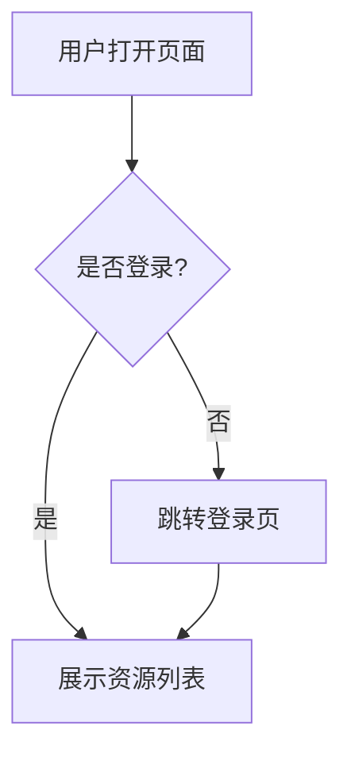
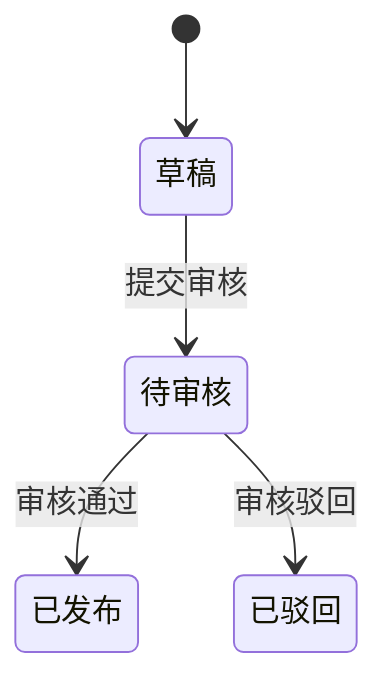

# 需求理解章节分析指南

本文档提供 9 个标准章节的详细分析方法。

---

## 1. background - 需求背景

### 分析要点
- 为什么要做这个需求？
- 当前有什么痛点或问题？
- 不做会有什么影响？
- 触发原因是什么？

### 如果原文未说明
写"原文未说明"，然后在澄清问题中添加：
- "请说明该需求的业务背景和触发原因"（P1）

---

## 2. goals - 目标与价值

### 分析要点
- 业务目标是什么？
- 用户价值是什么？
- 系统或运营价值是什么？
- 可衡量的成果是什么？

### 如果原文未说明
写"原文未说明"，然后在澄清问题中添加：
- "请明确该需求要达成的业务目标和衡量指标"（P1）

---

## 3. users - 用户角色与使用场景

### 分析要点
- 有哪些用户角色？
- 主要使用场景是什么？
- 每个角色的目标是什么？

### 输出格式
使用表格：
```markdown
| 用户角色 | 使用场景 | 用户目标 | 已知约束 |
|---------|---------|---------|---------|
| 管理员 | 后台管理 | 配置系统 | 需要管理员权限 |
```

### 如果原文未说明
写"原文未说明"，然后在澄清问题中添加：
- "请明确使用该功能的用户角色和典型使用场景"（P0）

---

## 4. scope - 功能范围

### 分析要点
- 明确包含哪些功能
- 明确不包含哪些功能（如原文有说明）
- 与现有功能的关系

### 输出格式
使用列表：
```markdown
**包含的功能**：
1. 功能A
2. 功能B

**不包含的功能**：
1. 功能X（原文明确说明暂不支持）
```

### 如果边界不清
在澄清问题中添加：
- "功能范围是否包含 XXX？边界在哪里？"（P0 或 P1）

---

## 5. flow - 业务流程

### 分析要点
- 完整的端到端流程
- 正常流程
- 异常分支

### 输出格式
**优先使用 Mermaid 流程图**（当有明确的流程、步骤、状态流转、页面跳转时）：


**或使用步骤列表**（简单流程）：
```markdown
1. 用户打开页面
2. 系统展示资源列表
3. 用户点击目标资源
4. 系统展示资源详情
```

### 如果流程不完整
在澄清问题中添加：
- "XXX 步骤之后的处理流程是什么？"（P0）

---

## 6. states - 状态流转

### 分析要点
识别核心业务对象（资源、任务、申请等）及其状态：
- 有哪些状态？
- 触发条件是什么？
- 可执行什么操作？
- 下一状态是什么？

### 输出格式
**优先使用表格**：
```markdown
| 状态 | 触发条件 | 可执行操作 | 下一状态 |
|-----|---------|-----------|---------|
| 草稿 | 创建资源 | 编辑、提交、删除 | 待审核、已删除 |
| 待审核 | 提交审核 | 通过、驳回 | 已发布、已驳回 |
```

**或使用 Mermaid 状态图**（复杂状态机）：


### 如果状态不明确
在澄清问题中添加：
- "XXX 对象的完整状态流转是什么？"（P0）

---

## 7. rules - 业务规则

### 分析要点
提取各类规则：
- **校验规则**：字段验证、格式要求
- **计算规则**：额度计算、用量统计
- **权限规则**：谁可以做什么
- **限制规则**：频率限制、数量限制
- **冲突规则**：互斥条件
- **时间规则**：有效期、超时

### 输出格式
使用表格：
```markdown
| 规则类型 | 触发条件 | 判断逻辑 | 处理结果 |
|---------|---------|---------|---------|
| 校验规则 | 提交配置 | 必填字段已填写且格式合法 | 校验失败时提示具体字段 |
| 计算规则 | 提交任务 | 预计消耗额度 = 数据量 × 单位消耗 | 显示预计消耗额度 |
| 权限规则 | 删除资源 | 用户角色 = 管理员 | 否则提示"无权限" |
```

### 如果规则不明确
在澄清问题中添加：
- "XXX 的校验/计算规则是什么？"（P0）

---

## 8. ui - 页面与交互

### 分析要点
- 需要哪些页面
- 页面元素和布局
- 交互方式（点击、输入、选择）
- 反馈机制（成功提示、错误提示、加载状态）

### 输出格式
```markdown
**资源列表页**：
- 页面元素：搜索框、资源卡片（名称、状态、更新时间）、分页
- 交互：点击资源跳转详情页，搜索实时过滤
- 反馈：加载显示骨架屏，无结果显示"暂无数据"

**资源详情页**：
- 页面元素：资源名称、状态、基础信息、操作按钮
- 交互：点击提交或发布时弹出确认框
- 反馈：操作成功后显示提示并刷新状态
```

### 如果 UI 未明确
在澄清问题中添加：
- "XXX 页面需要展示哪些信息和操作？"（P1）

---

## 9. data - 数据与系统交互

### 分析要点
- 需要存储的数据（字段、类型、约束）
- 数据来源和去向
- 对接的系统（内部系统、第三方系统）
- API 能力要求

### 输出格式
```markdown
**任务记录表**：
- task_id（主键）
- user_id（外键）
- resource_id（关联资源）
- status（状态：待处理、处理中、已完成、已失败）
- created_at（创建时间）

**系统交互**：
- 对接外部系统：发起调用，接收回调或查询结果
- 对接配额系统：查询剩余额度，记录用量消耗

**API 能力**：
- POST /tasks - 创建任务
- GET /tasks/:id - 查询任务详情
- POST /tasks/:id/cancel - 取消任务
```

### 如果数据不明确
在澄清问题中添加：
- "XXX 数据从哪里来？需要存储哪些字段？"（P0）
- "对接 XXX 系统的接口是什么？需要传递哪些参数？"（P0）

---

## 格式要求

### 列表项必须换行
❌ 错误：
```
1. 第一项 2. 第二项 3. 第三项
```

✅ 正确：
```
1. 第一项
2. 第二项
3. 第三项
```

### 段落之间空行分隔
```markdown
第一段内容。

第二段内容。
```

### 表格使用 Markdown 表格
```markdown
| 列1 | 列2 | 列3 |
|-----|-----|-----|
| 值1 | 值2 | 值3 |
```

---

## 总结

每个章节的核心原则：
1. ✅ **只记录事实**：只记录原文明确说明的内容
2. ✅ **具体而非抽象**：给出具体的内容，而非抽象描述
3. ✅ **如果原文未说明**：明确标注"原文未说明"并生成澄清问题
4. ✅ **使用合适的格式**：表格、列表、Mermaid 图
