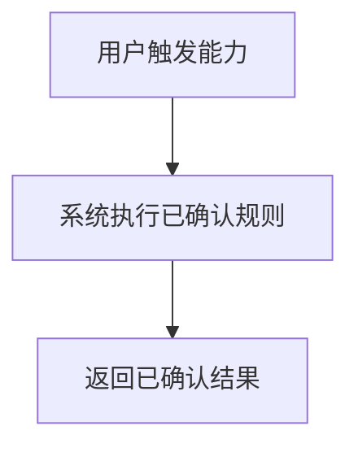
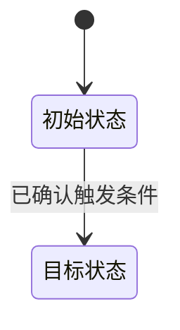

# 报告模板

本 skill 生成三份 Markdown 文档和一个 JSON 文件。模板用于保持结构稳定，但内容必须来自主需求来源，不能硬填模板。

## `output/analysis.md` 模板

```markdown
# 需求分析报告

## 分析摘要
- 需求主题：
- 当前可确认目标：
- 总体成熟度：
- 关键风险：

## 需求成熟度
- 等级：RA0/RA1/RA2/RA3/RA4/RA5
- 判断依据：
- 影响下游工作的主要缺口：

## 范围与边界
### 范围内
- ...

### 范围外
- ...

### 假设与约束
- ...

## 模块与能力
| 模块 | 主要能力 | 关键角色 | 依赖 |
| --- | --- | --- | --- |
| ... | ... | ... | ... |

## 业务规则与数据
### 业务规则
- ...

### 数据对象与字段
- ...

### 状态流转
- ...

## Mermaid 理解图
### 业务流程图


### 状态流转图


### 模块关系图


## 关键缺口分类
| 类别 | 缺口 | 影响 |
| --- | --- | --- |
| scope | ... | ... |

## 测试覆盖影响
- 可直接进入测试设计的内容：
- 存在覆盖风险的内容：
- 需进入待澄清 tab 后才能补齐的覆盖影响摘要：

## 质量门禁摘要
- 结果：
- 可测试性评分：
- 阻塞/警告摘要：

## 下一步建议
1. ...
```

## `output/clarification.md` 模板

必须保持可解析格式。每个条目以 `## CQ-001` 或 `## CF-001` 开头。

```markdown
# 待澄清

## CQ-001 模块名
- 模块Key：module_key
- 类型：clarification
- 维度：validation_rule
- 严重级别：major
- 问题：需要人工直接确认的问题？
- 影响：不确认造成的下游影响。
- 来源：主需求中的证据或缺失说明。
- 选项A：短标签|可直接写入初步需求的 Markdown
- 选项B：短标签|可直接写入初步需求的 Markdown

## CF-001 模块名
- 模块Key：module_key
- 类型：conflict
- 严重级别：blocker
- 问题：需要人工裁决的冲突是什么？
- 影响：不裁决造成的下游影响。
- 来源：冲突证据。
- 选项A：采纳规则 A|可直接写入初步需求的 Markdown
- 选项B：采纳规则 B|可直接写入初步需求的 Markdown
```

## `output/quality.md` 模板

质量保证报告是普通 Markdown 文件，前端直接展示该 Markdown。所有关键信息必须在正文中表达清楚。

```markdown
# 质量保证

## 质量摘要
- 当前需求是否足以支撑可靠测试设计：
- 最主要的阻塞或风险：
- 推荐优先处理顺序：

## 质量门禁
- 结果：passed/warning/blocked
- 可测试性评分：0-100
- 判断依据：

## 阻塞问题
- ...

## 风险警告
- ...

## 已通过检查
- ...

## 覆盖审计
| 模块 | 状态 | 原因 |
| --- | --- | --- |
| ... | analyzed/pending_clarification/not_testable/missing_detail | ... |

## 可测试性维度
| 维度 | 判断 | 说明 |
| --- | --- | --- |
| 测试目标 | passed/warning/blocked | ... |
| 角色权限 | passed/warning/blocked | ... |
| 前置条件 | passed/warning/blocked | ... |
| 测试数据 | passed/warning/blocked | ... |
| 操作路径 | passed/warning/blocked | ... |
| 预期结果 | passed/warning/blocked | ... |
| 边界异常 | passed/warning/blocked | ... |
| 非功能指标 | passed/warning/blocked | ... |

## 下一步建议
1. ...
```

## `output/analysis.json` 映射

- `analysis_report_markdown` 等于 `output/analysis.md` 正文。
- `clarification_report_markdown` 等于 `output/clarification.md` 正文。
- `quality_assurance_report_markdown` 等于 `output/quality.md` 正文。
- `clarification_questions` 和 `conflicts` 必须能从 `output/clarification.md` 解析或与其内容一致。
- `quality_gate`、`coverage_audit` 必须与 `output/quality.md` 内容一致。

## 禁止事项

- 不要把 `output/clarification.md` 的问题清单复制到 `output/analysis.md`。
- 不要在 `output/analysis.md` 设置“待确认问题”“待人工确认”“澄清问题”“待澄清内容”等章节。
- 不要把 `output/quality.md` 写成前端组件说明。
- 不要输出传统审批结论，如“批准”“拒绝”“有条件批准”。
- 不要把来源没有确认的选项写成已确认事实。
