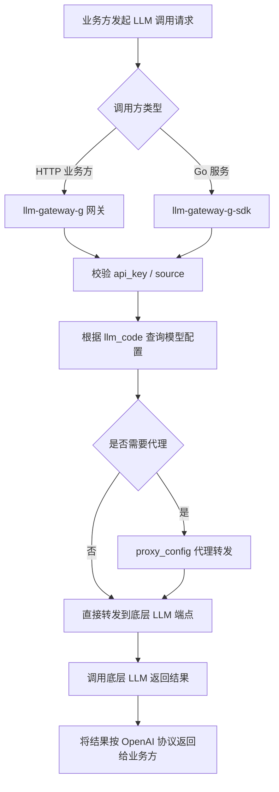

# 需求理解

## 1. 需求背景
当前模型网关服务 agent-chat-model-g 与业务耦合度高，不适合作为统一的网关层使用。本次需求将核心的与大模型 LLM 交互功能提取出来，做成通用的网关能力沉淀，以支持多种 LLM（三方和公司内部）的统一接入。

## 2. 目标与价值
1. 构建通用 LLM 网关层（llm-gateway-g），统一对外提供 OpenAI 兼容协议，让业务方无需关心底层 LLM 差异。
2. 提供 Go SDK（llm-gateway-g-sdk），让 Go 服务可直接调用 LLM 能力，减少 HTTP 交互带来的性能损耗。
3. 支持多种 LLM 来源的接入与管理，包括三方模型和公司内部模型。
4. 支持模型配置管理、API Key 管理、代理配置管理，作为后续限流、计量等管控能力的基础。

## 3. 用户角色与使用场景
| 用户角色 | 使用场景 | 用户目标 | 已知约束 |
|---------|---------|---------|---------|
| 业务服务方（Go/其他语言服务） | 通过 llm-gateway-g 的 OpenAI 兼容协议调用 LLM；或 Go 服务通过 llm-gateway-g-sdk 直接调用 | 统一接入多种 LLM，无需关心底层差异 | 需要申请 api_key 并按 source 区分 |
| 平台/运维管理员 | 配置和管理 LLM 模型、API Key、代理、模型分类 | 维护可用的 LLM 列表与接入凭证 | 需具备管理后台访问权限 |
| 切流/灰度负责人 | 按模型进行灰度切流（Cybertron 场景） | 平滑迁移业务流量到新网关 | 通过 params_config 中 UseLLMGatewaySDK 控制 |

## 4. 功能范围
**包含的功能**：
1. llm-gateway-g Web 服务，提供 OpenAI 兼容协议调用多种大模型。
2. llm-gateway-g-sdk（Go SDK），封装核心 LLM 调用能力，供 Go 服务直接调用。
3. 模型配置管理（llm_model_config）：维护 LLM 编码、名称、目标模型、端点、API Key、接口协议、版本、代理、分类等。
4. API Key 管理（api_keys / source_model_api_key）：按 source 维度管理调用方凭证与底层厂商凭证的映射。
5. 代理配置管理（proxy_config）：支持通过代理访问底层 LLM 端点。
6. LLM 厂商/分类管理（llm_info_classify）：对模型进行分类管理。
7. 自动初始化流程（依赖配置即可启动）。
8. Cybertron Agent 对话场景接入（含 FunctionCall）。
9. Go 版本对话流接入。

**不包含的功能**：
1. API_KEY 限流与管控（原文标注为 TODO）。
2. 模型 QPS 调用管控（原文标注为 TODO）。
3. Token 消耗计量（原文标注为 TODO）。
4. 模型管理（原文标注为 TODO）。

## 5. 业务流程

自动初始化流程（依赖配置即可启动获取可用模型列表），原文以架构图给出，未给出具体步骤，标注"原文未说明"。

## 6. 状态流转
原文未给出 LLM 模型配置、API Key 等对象的状态流转，仅有软删除字段（is_delete）。可识别的对象状态变化为：

| 对象 | 状态（基于字段推测） | 触发条件 | 可执行操作 | 下一状态 |
|-----|---------|---------|-----------|---------|
| llm_model_config | 启用 / 已删除（is_delete=0/1） | 新建、删除 | 编辑、软删除 | 启用 ↔ 已删除 |
| api_keys | 启用 / 已删除 | 新建、删除 | 编辑、软删除 | 启用 ↔ 已删除 |
| source_model_api_key | 启用 / 已删除 | 新建、删除 | 编辑、软删除 | 启用 ↔ 已删除 |
| proxy_config | 启用 / 已删除 | 新建、删除 | 编辑、软删除 | 启用 ↔ 已删除 |

原文未说明完整的状态机（如 API Key 过期、模型下线灰度等），需澄清。

## 7. 业务规则
| 规则类型 | 触发条件 | 判断逻辑 | 处理结果 |
|---------|---------|---------|---------|
| 存储校验 | api_keys | api_key 唯一（唯一索引 idx_api_keys_api_key） | 重复则写入失败 |
| 存储校验 | source_model_api_key | (source_api_key, llm_code) 联合索引 | 同一调用方同一模型不可重复绑定 |
| 存储校验 | llm_model_config | llm_code 唯一（uniq_index_llm_code） | 重复 llm_code 写入失败 |
| 调用鉴权 | 业务方调用网关 | 需携带有效 api_key 并匹配 source | 无效则拒绝请求 |
| 接口协议 | llm_model_config.interface_protocol | 决定调用底层 LLM 使用的协议类型 | 按协议转发 |
| 代理规则 | llm_model_config.proxy_id | 非空时使用 proxy_config.proxy_url 转发 | 走代理访问 |
| 切流规则 | Cybertron params_config.UseLLMGatewaySDK | 模型在列表内时使用 llm-gateway-g-sdk | 否则走旧链路 |
| 删除规则 | 各表 is_delete=1 | 软删除，查询时过滤 | 不影响历史调用日志（原文未说明） |

## 8. 页面与交互
原文未提供任何页面/交互设计，仅提供了后端架构图与流程图。需求侧重于后端服务与 SDK 的实现，页面与交互均标注"原文未说明"。如需管理后台进行模型/API Key/代理的配置，界面形态、交互方式均未定义。

## 9. 数据与系统交互
**核心数据表（来自 SQL）**：

| 表名 | 关键字段 | 用途 |
|-----|---------|-----|
| api_keys | id, api_key(唯一), source, creat_time, is_delete | 维护调用方 API Key |
| llm_info_classify | id, classify_name, user_name, icon, create_time, update_time, is_delete | LLM 厂商/分类 |
| llm_model_config | id, llm_code(唯一), llm_name, target_model, end_point, api_key, interface_protocol, api_version, proxy_id, classify_id, create_name, update_name, create_time, update_time, is_delete, protocol_options(json) | LLM 模型配置主表 |
| proxy_config | id, proxy_name, proxy_url, creat_time, is_delete, creat_username, update_username | 代理配置 |
| source_model_api_key | id, source_api_key, llm_code, provider_api_key, create_time, update_time, is_delete, api_version | 调用方 API Key 与底层厂商凭证映射 |

**系统交互**：
1. 对接底层 LLM（OpenAI 兼容协议）以及公司内部 LLM。
2. 对接 Cybertron 等业务方（Agent 对话、Go 对话流）。
3. 依赖 params_config 配置驱动 Cybertron 切流。

**数据库**：测试环境 MySQL 实例 10.100.123.143:3306，库名 llm_gateway。
