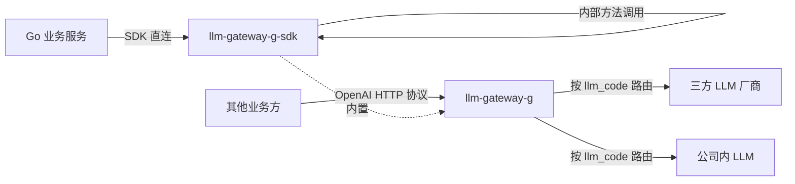
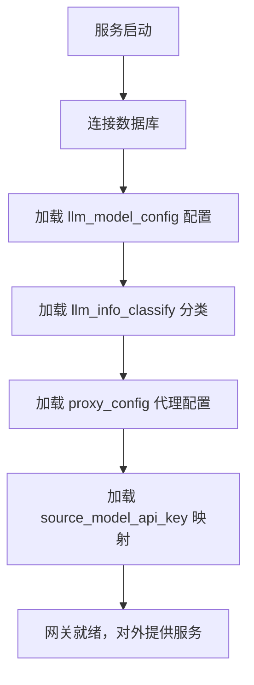
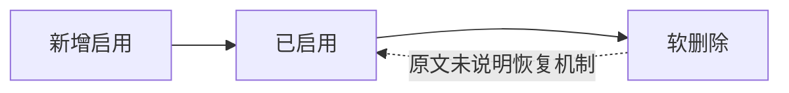
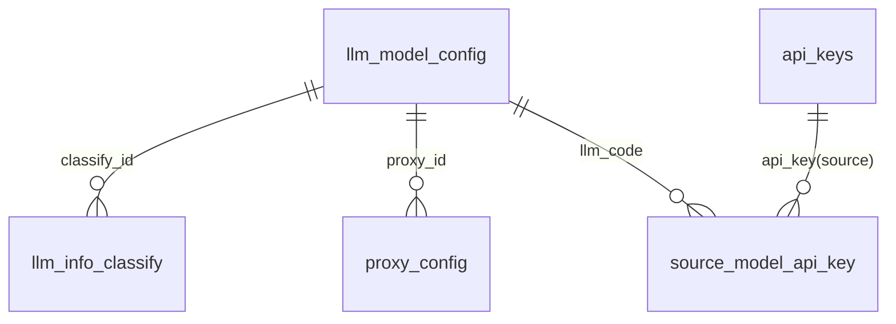

# 需求理解

## 1. 需求背景

现有 `agent-chat-model-g` 服务与业务有较大的耦合和绑定，不适合作为统一的网关层使用。

当前需要将核心的与大模型 LLM 交互功能提取出来，成为通用功能沉淀，以支撑多个业务方对多种大模型（三方及公司内）的统一接入。

拆分为两个核心组件：
- **llm-gateway-g**：Web 服务应用，提供 OpenAI 通信协议，供其他业务方调用。
- **llm-gateway-g-sdk**：Go SDK，提供 Go 服务直接调用 LLM 的能力，减少 HTTP 交互带来的性能损耗。

按照模型维度逐渐切流，当前已在 Cybertron Agent 对话和 Go 版本对话流中进行测试验证。

## 2. 目标与价值

1. **能力解耦**：将 LLM 交互核心能力从 `agent-chat-model-g` 中剥离，使其不再与具体业务绑定。
2. **统一接入**：通过网关层对外屏蔽不同 LLM 厂商的协议差异，对外暴露统一的 OpenAI 通信协议。
3. **性能优化**：为 Go 系服务提供原生 SDK 接入方式，避免 HTTP 跨进程调用的性能损耗。
4. **多模型支持**：支持三方大模型和公司内大模型的统一接入与切换。
5. **平滑迁移**：通过配置开关（`UseLLMGatewaySDK`）按模型粒度逐步切流，灰度可控。

## 3. 用户角色与使用场景

| 用户角色 | 使用场景 | 用户目标 |
|---------|---------|---------|
| 内部 Go 业务服务（如 Cybertron Agent） | 通过 `llm-gateway-g-sdk` 调用 LLM 能力 | 低损耗地完成对话/FunctionCall 调用 |
| 外部/其他业务方（非 Go 或跨语言服务） | 通过 HTTP 协议（OpenAI 格式）调用 `llm-gateway-g` | 标准化方式接入大模型能力 |
| 系统管理员/运维 | 配置模型信息、API_KEY、代理信息 | 管理可用的 LLM 资源和访问凭证 |
| LLM 厂商运营 | 维护厂商分类（`llm_info_classify`） | 对模型按厂商进行分类管理 |

## 4. 功能范围

**包含（本次实现）**：
- llm-gateway-g Web 服务（提供 OpenAI 协议接口）
- llm-gateway-g-sdk Go SDK
- 自动初始化流程（服务启动时初始化模型配置）
- 模型配置管理（`llm_model_config` 表的 CRUD）
- API_KEY 管理（`api_keys` 表的 CRUD）
- LLM 厂商分类管理（`llm_info_classify` 表的 CRUD）
- 代理配置管理（`proxy_config` 表的 CRUD）
- 源 API_KEY 与 LLM 提供商 API_KEY 映射（`source_model_api_key` 表）
- Cybertron Agent 对话 + FunctionCall 调用验证
- Go 版本对话流验证

**不包含（TODO，后续迭代）**：
- API_KEY 限流、管控
- 模型 QPS 调用管控
- Token 消耗计量
- 完整的模型管理功能（如模型上下架、版本切换、灰度策略配置界面等）

## 5. 业务流程

原文通过架构图和流程图描述，图片链接不可直接访问，以下基于文字描述推断核心流程。

**整体调用架构**：

**自动初始化流程**：

**模型配置管理流程**：

原文仅有标题"模型配置管理"，未给出具体流程描述，原文未说明增删改查的具体步骤和审批流程。

## 6. 状态流转

从数据库字段推断的核心对象状态：

| 对象 | 状态 | 说明 |
|------|------|------|
| 模型配置 (`llm_model_config`) | 启用（`is_delete=0`） | 正常提供调用能力 |
| 模型配置 (`llm_model_config`) | 软删除（`is_delete=1`） | 不再提供服务，保留记录 |
| API_KEY (`api_keys`) | 启用（`is_delete=0`） | 有效凭证 |
| API_KEY (`api_keys`) | 软删除（`is_delete=1`） | 已失效 |
| 代理配置 (`proxy_config`) | 启用（`is_delete=0`） | 生效中 |
| 代理配置 (`proxy_config`) | 软删除（`is_delete=1`） | 已失效 |
| 厂商分类 (`llm_info_classify`) | 启用（`is_delete=0`） | 正常展示 |
| 厂商分类 (`llm_info_classify`) | 软删除（`is_delete=0` 默认值） | 原文未说明删除操作流程 |

模型配置的状态流转：

## 7. 业务规则

| 规则分类 | 具体规则 | 来源 |
|---------|---------|------|
| 唯一性 | `api_keys.api_key` 全局唯一 | `UNIQUE KEY idx_api_keys_api_key` |
| 唯一性 | `llm_model_config.llm_code` 唯一（char(6)） | `uniq_index_llm_code` |
| 软删除 | 所有表均通过 `is_delete` 字段标记删除，默认值 0（`api_keys`/`proxy_config`/`llm_model_config`）/0（`llm_info_classify`）/0（`source_model_api_key`） | 表结构定义 |
| 必填字段 | `llm_model_config` 中 `llm_code`、`llm_name`、`target_model`、`end_point`、`api_key`、`interface_protocol`、`create_name`、`update_name` 均 NOT NULL | 表结构定义 |
| 必填字段 | `proxy_config` 中 `proxy_name`、`proxy_url`、`creat_username`、`update_username` 均 NOT NULL | 表结构定义 |
| 必填字段 | `api_keys` 中 `api_key`、`source` 均 NOT NULL | 表结构定义 |
| 索引 | `api_keys` 按 `source + is_delete` 建索引 | 表结构定义 |
| 索引 | `source_model_api_key` 按 `source_api_key + llm_code` 建索引 | 表结构定义 |
| 切流策略 | 仅配置在 `UseLLMGatewaySDK` 列表中的模型走 SDK，否则维持原有调用方式 | `Cybertron 相关配置` |
| 当前切流范围 | `azure-gpt-4-jp`、`Qwen2-72B-Instruct-AWQ` 两款模型走 SDK | `Cybertron 相关配置` |
| 字符集 | 数据库统一使用 `utf8mb4` / `utf8mb4_unicode_ci` 字符集 | 表结构定义 |
| 加密存储 | `api_key`、`provider_api_key` 字段使用 `text` 类型存储，原文未说明是否加密 | 字段类型推断 |

## 8. 页面与交互

原文未说明是否提供 Web 管理界面或可视化配置页面。

- **接入入口**：业务方通过 HTTP（OpenAI 协议）或 Go SDK 调用，不涉及 UI 交互。
- **管理端 UI**：原文仅涉及数据库表结构，未描述管理后台页面，原文未说明。
- **配置变更方式**：原文未说明模型/API_KEY/代理配置的变更入口（页面、接口、SQL 直改等）。

## 9. 数据与系统交互

**数据库表（共 5 张）**：

| 表名 | 用途 | 关键字段 |
|------|------|---------|
| `api_keys` | API_KEY 主表 | `id`, `api_key`（唯一）, `source`, `is_delete`, `creat_time` |
| `llm_info_classify` | LLM 厂商/分类 | `id`, `classify_name`, `user_name`, `icon`, `is_delete` |
| `llm_model_config` | 模型配置主表 | `id`, `llm_code`（6 位唯一）, `llm_name`, `target_model`, `end_point`, `api_key`, `interface_protocol`, `api_version`, `proxy_id`, `classify_id`, `protocol_options`（JSON） |
| `proxy_config` | 代理配置 | `id`, `proxy_name`, `proxy_url`, `is_delete`, `creat_username`, `update_username` |
| `source_model_api_key` | 源 API_KEY 与提供商 API_KEY 映射 | `id`, `source_api_key`, `llm_code`, `provider_api_key`, `api_version`, `is_delete` |

**表关联关系**：

**测试环境数据库**：
- 实例：`10.100.123.143:3306`
- 账号：`u_cybertron_llm_gateway`
- 库名：`llm_gateway`

**外部系统对接**：
- 三方 LLM 厂商（通过 `end_point` + `api_key` + `interface_protocol` 调用）
- 公司内 LLM 服务（同上）
- Cybertron Agent（通过 `UseLLMGatewaySDK` 配置切流消费）

**配置中心**：
- `params_config` 中的 `UseLLMGatewaySDK` 参数控制切流范围
