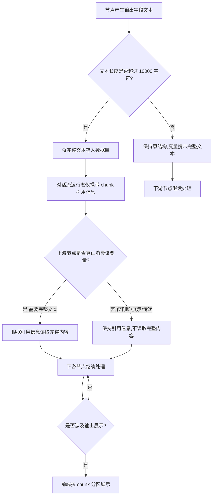
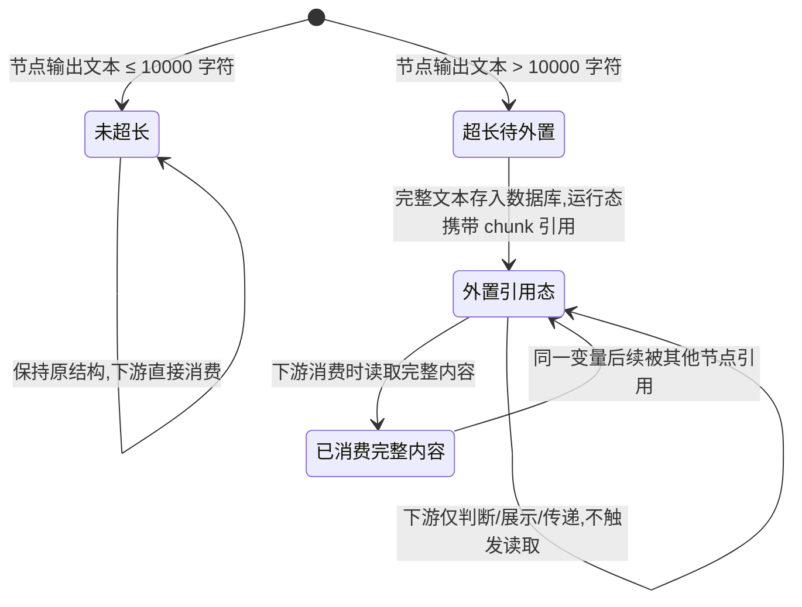
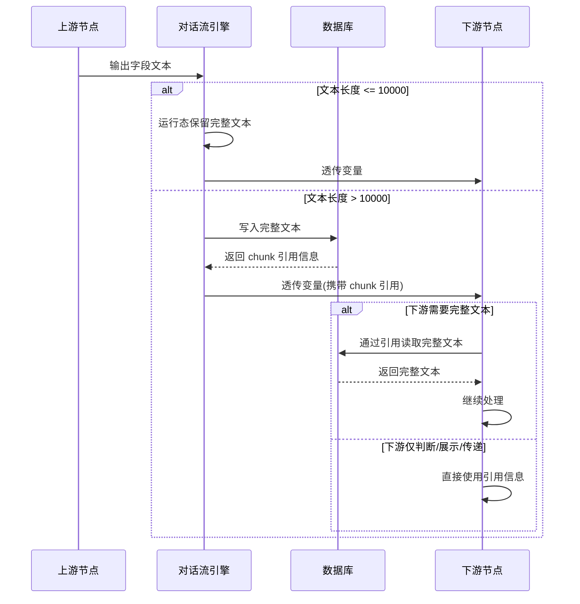

# 需求理解

## 1. 需求背景
海外项目场景下，需要将超长文档解析并存入对话流节点供下游消费。但当前对话流节点字段携带超长文本会导致对话流引擎崩溃，存在稳定性风险。

痛点：
- 对话流节点字段携带超长文本直接导致对话流引擎崩溃
- 现有实现没有针对超长文本的处理机制

触发原因：海外项目需要解析超长文档并存入对话流节点，下游消费时触发崩溃。

## 2. 目标与价值
本需求的目标与可衡量指标原文未说明。

可推测的业务目标方向（原文未明示，不作为事实记录）：
- 解决对话流引擎因超长文本崩溃的问题
- 让海外超长文档能够正常解析、存储和被下游消费
- 对下游节点尽量无感知

原文未明确列出可衡量的目标值（如：崩溃率降低到 X%、支持的文档最大长度提升到多少等）。

## 3. 用户角色与使用场景
| 用户角色 | 使用场景 | 用户目标 | 已知约束 |
|---------|---------|---------|---------|
| 海外项目最终用户 | 通过对话流节点上传/输入超长文档供后续处理 | 提交包含超长文本的文档并获得对话流下游处理结果 | 文档内容为超长文本 |
| 对话流编排者（使用自主规划 agent、写作 agent 的运营/开发者） | 配置和使用涉及超长文本变量的对话流 | 在不变更现使用方式的前提下处理超长文本 | 涉及输入节点、信息加工、触发动作&分支、输出节点 |
| 对话流调试人员 | 在 debug、预览、对话流测试、单节点调试、发布后页面、API 接口调试中观察超长文本输出 | 通过分区（chunk）方式查看超长文本 | 输出按 chunk 分区展示 |

原文未说明：是否存在其他角色（如运维、客服、配置管理员等）以及他们的具体使用场景。

## 4. 功能范围
**包含的功能（Python 版本）**：

1. 输入节点改造：
   - 收集用户回复至变量
   - 收集用户上传文件

2. 信息加工节点改造：
   - 大模型变量赋值
   - 普通变量赋值
   - 知识检索变量赋值
   - 文件检索变量赋值
   - 文件解析

3. 触发动作 & 分支节点改造：
   - 代码执行
   - 语义判断
   - 条件判断

4. 输出节点改造：
   - 大模型回复
   - 文本回复

5. 超长文本外置存储：
   - 当节点输出字段文本长度超过 10000 字符时，将完整文本存入数据库
   - 对话流运行态中只携带轻量级 chunk 引用信息

6. 变量引用透传：
   - 下游节点通过统一变量读取方法读取完整内容
   - 需要时读取、不需要时仅使用引用

7. 单字段长度上限 20000 字。

8. 调试/预览/测试/发布/接口调试页面输出按 chunk 分区展示超长文本。

**不包含或待补充的功能**：
1. Go 版本改造方案（原文明确说明"待切流后补充完善"）。
2. 具体的数据库表结构、字段、读取接口契约（原文未给）。
3. chunk 切分粒度（一个 chunk 多少字符/按什么规则切分）原文未给。
4. 历史会话中已存在超长文本（超出 10000 字符的历史数据）如何处理，原文未说明，仅说明普通文本按原逻辑读取。
5. 用户可配置的最大长度阈值（10000、20000 是否可配置）原文未说明。
6. 改造一第 4 条所述"根据节点类型决定是否读取完整内容"的判断规则原文未给出。
7. 大模型变量赋值、代码执行等节点在内部对变量赋值时，超长文本是否同样外置处理，原文未明确断言（虽然方案一提到"输出字段"）。

## 5. 业务流程
**核心流程：超长文本产生 → 外置存储 → 引用透传 → 消费节点按需还原 → 分区展示**

1. 任意节点（输入/信息加工/触发动作/输出）产生输出字段文本。
2. 系统判断该字段文本长度是否超过 10000 字符。
3. 若未超过：保持原结构，变量在运行态中携带完整文本。
4. 若超过 10000：进入外置存储与引用透传流程（见下方分支）。
5. 下游节点通过统一变量读取方法获取该变量内容。
6. 下游节点根据自身节点类型判断：是否需要读取完整内容、是否仅使用引用。
7. 若下游节点仅做判断、展示、传递，可能不读取完整内容。
8. 输出环节（包括调试、预览、对话流测试、单节点调试、发布后页面、API 接口调试）按 chunk 分区展示超长文本。

**外置存储与引用透传分支**：

**图后补充说明**：
- 节点类型判定（哪些消费场景属于"仅判断/展示/传递"，哪些属于"需要读取完整内容"）的判定规则原文未给出。
- 是否所有节点赋值时均统一执行"超过 10000 即外置"，还是仅在特定节点（如输出节点）执行，原文未明确。
- 对调试页面输出的 chunk 切分粒度和组装方式原文未说明。

**辅助事实**：
- 兼容性：未超过 10000 字符的现有变量保持原结构，不影响现有流程。
- 兼容性：下游节点通过统一变量读取方法获取内容，不需要每个节点单独感知存储细节。
- 兼容性：调试页面输出分区展示完整超长文本。
- 兼容性：历史会话中已经存储的普通文本仍按原逻辑读取。
- 兼容性：对话流日志展示变量的所有字段。

**未覆盖/原文未说明**：
- 节点类型判定"是否需要读取完整内容"的具体规则。
- 写入与读取失败的异常分支（数据库写入失败、引用信息丢失、读取超时）。
- 多个 chunk 引用之间的拼接顺序如何保证。
- chunk 引用信息丢失或数据库读取失败时，对话流的回退/降级策略。
- 若同一变量被多个下游节点同时消费，并发读取是否安全。
- 单字段文本长度超过 20000 字时如何处理（截断、拒绝、外置、报错）。

## 6. 状态流转
**核心业务对象：对话流变量中的字段文本（含超长文本场景）**

| 当前状态 | 触发条件/动作 | 执行角色 | 下一状态 | 可观察结果 |
|---|---|---|---|---|
| 原始未超长（≤10000 字符） | 节点输出文本 | 任意节点 | 保持原结构 | 运行态携带完整文本，下游正常消费 |
| 超过 10000 字符的输出 | 节点输出文本长度检测 | 系统判定 | 外置存储引用态 | 完整文本存入数据库，运行态只携带 chunk 引用 |
| 外置存储引用态 | 下游节点需要完整内容 | 下游节点 | 已消费完整内容 | 节点拿到完整文本继续处理 |
| 外置存储引用态 | 下游节点仅判断/展示/传递 | 下游节点 | 保持引用态 | 节点未触发数据库读取 |
| 单字段超过 20000 字符 | 字段写入 | 任意节点 | 原文未说明 | 原文未明确处理方式（拒绝/截断/外置+二次切分） |

**状态流转示意**：

**图后补充说明**：
- 原文未定义字段超长后是否需要"审批/治理"环节。
- 原文未定义"外置存储引用态"是否可以转换为"未超长"（例如 chunk 后续被人工/系统压缩回 ≤10000）。
- 原文未定义字段超长且写入数据库失败时的状态。
- "已消费完整内容"与"外置引用态"是否等价、是否需要区分，原文未给出。
- 单字段 20000 字上限被违反时的状态机迁移原文未说明。

## 7. 业务规则
| 规则类型 | 触发条件 | 判断逻辑 | 处理结果 |
|---------|---------|---------|---------|
| 阈值规则 | 节点输出字段文本长度 | 文本长度 > 10000 字符 | 触发外置存储与引用透传 |
| 阈值规则 | 节点输出字段文本长度 | 文本长度 ≤ 10000 字符 | 保持原结构，变量携带完整文本 |
| 限制规则 | 写入任何字段 | 单字段长度 ≤ 20000 字 | 原文未明确违反时的处理（截断/拒绝/外置） |
| 消费规则 | 下游节点读取变量 | 节点仅做判断/展示/传递 | 不触发完整内容读取 |
| 消费规则 | 下游节点读取变量 | 节点需要完整文本 | 通过引用信息读取完整内容 |
| 兼容性规则 | 读取任意变量 | 下游使用统一变量读取方法 | 屏蔽底层存储差异，节点无需单独感知 |
| 兼容性规则 | 历史会话中的普通文本 | 字段 ≤ 10000 字符 | 按原逻辑读取 |
| 展示规则 | 调试/预览/测试/发布/接口调试页输出 | 字段为超长文本 | 按 chunk 分区展示 |
| 日志规则 | 写入对话流日志 | 输出变量 | 日志展示变量的所有字段 |

**原文未明确的关键规则**：
- 单字段超 20000 字的具体处理（截断/拒绝/再次外置/报错文案）。
- "下游节点仅做判断/展示/传递"如何准确判定——是节点配置静态标注，还是系统按节点类型推断。
- chunk 引用信息中是否包含顺序、回溯、版本信息。
- 同一变量在多次写入时，是否需要保留历史版本。
- "运行时携带轻量级 chunk 引用信息"中"轻量级"的具体字段定义。
- 10000 / 20000 是否可由运营/开发者配置。

## 8. 页面与交互
**调试与展示相关页面**：

1. **debug 页面**：
   - 输出按 chunk 分区展示完整超长文本。

2. **预览页面**：
   - 输出按 chunk 分区展示完整超长文本。

3. **对话流测试页面**：
   - 输出按 chunk 分区展示完整超长文本。

4. **单节点调试页面**：
   - 输出按 chunk 分区展示完整超长文本。

5. **发布后页面**：
   - 输出按 chunk 分区展示完整超长文本。

6. **API 接口调试页面**：
   - 输出按 chunk 分区展示完整超长文本。

**对话流日志**：
- 展示变量的所有字段（未说明具体视图控件）。

**未明确**：
- chunk 切分粒度（如每 1000 字符一片还是其他粒度）。
- 各页面分区之间的导航/翻页/搜索/复制交互。
- 是否需要支持"折叠/展开"或"加载更多 chunk"。
- 调试页与生产页面的展示差异。
- 各页面是否需要高亮/标注超长文本字段。
- 节点配置页是否需要字段长度提示或拦截（原文未说明业务侧交互）。

## 9. 数据与系统交互
**已知数据**：
- 变量字段文本：长度阈值 10000（外置判定）、20000（单字段上限）。
- 轻量级 chunk 引用信息：替代完整文本存于对话流运行态。
- 完整文本：外置存储于数据库。
- 对话流日志：包含变量的所有字段。

**已知系统交互**：
- 节点 → 数据库：超长文本外置写入。
- 下游节点 → 数据库：按 chunk 引用读取完整文本。
- 下游节点 ↔ 上游节点：通过统一变量读取方法交互，屏蔽存储差异。

**原文未说明**：
- 外置存储使用的数据库、表结构、字段、主键、索引。
- 统一变量读取方法的具体接口契约（入参/出参/错误码）。
- chunk 引用信息的数据结构。
- 多副本/分布式场景下数据库读写一致性策略。
- 是否需要异步写、是否需要缓存层。
- 失败重试、回退、降级路径。
- API 接口调试返回的 JSON 结构与分页协议。
- 是否有数据保留策略（外置文本保留多久、如何清理）。

**多参与方交互示意**：

**图后补充说明**：
- DB 写入失败时，上游节点是否回滚（依然向运行态写完整文本或报错），原文未说明。
- DB 读取失败时，下游节点是否降级为引用信息继续推进，原文未说明。
- 同一变量被多个下游节点并发读取时，是否安全，原文未说明。
- 多个上游节点同时写入同一变量（并发覆盖）如何处理，原文未说明。
