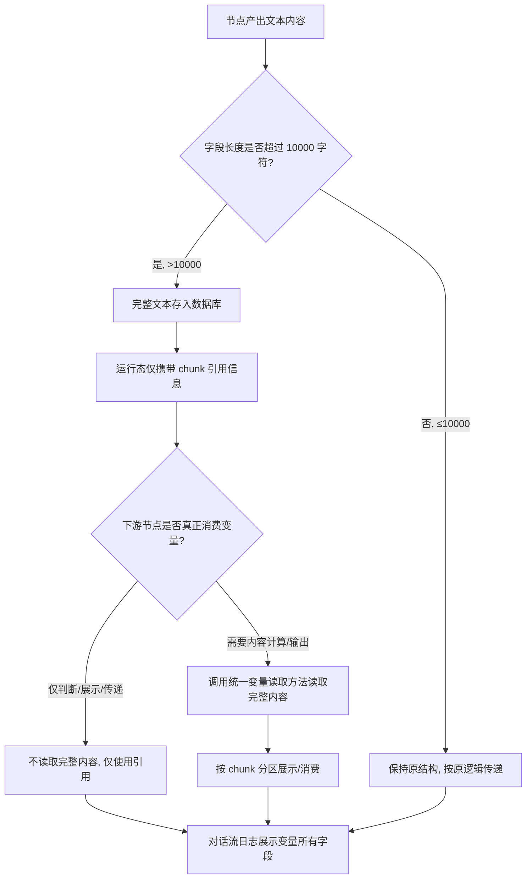
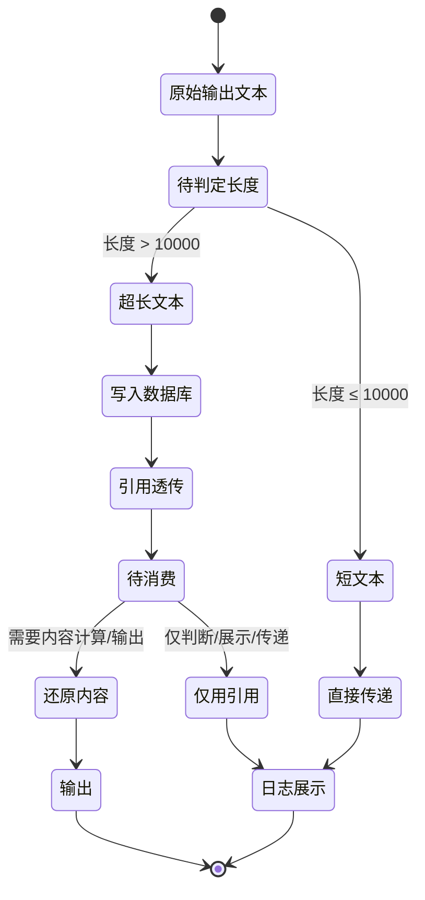

# 需求理解

## 1. 需求背景
海外项目需要将超长文档进行解析并存入对话流节点供下游消费。当前对话流节点字段携带超长文本会导致对话流引擎崩溃，属于性能/稳定性问题。本次需求针对 Python 版本的对话流（包括自主规划 agent 和写作 agent）中所有涉及系统变量、对话流变量读取、使用、写入的节点进行改造。Go 版本待切流后补充完善。

## 2. 目标与价值
1. 解决超长文本在对话流节点字段中传递时导致对话流引擎崩溃的问题。\n2. 通过外置存储 + 变量引用透传 + 消费节点自动还原的方式，使对话流运行态不再携带完整超长文本，提升稳定性。\n3. 单个字段长度限制 20000 字，超长部分走外置存储方案（10000 字符为拆分阈值）。\n4. 兼容已有短文本变量、历史会话、调试页面和下游节点消费逻辑。

## 3. 用户角色与使用场景
| 用户角色 | 使用场景 | 用户目标 | 已知约束 |
|---------|---------|---------|---------|
| 对话流搭建者（运营/开发） | 在自主规划 agent 或写作 agent 中配置包含超长文档解析的对话流 | 让超长文本能稳定进入对话流并被下游消费 | 需在 Python 版本改造范围内 |
| 对话流下游消费者（节点） | 真正使用变量内容时（如判断、展示、传递、解析） | 自动还原为完整文本 | 通过统一变量读取方法消费 |
| 前端调试用户 | 在 debug、预览、对话流测试、单节点调试、发布后页面、API 接口调试中查看超长文本输出 | 按 chunk 分区查看完整内容 | 不感知存储细节，按需展示 |

## 4. 功能范围
**包含的功能**：

1. Python 版本对话流改造，覆盖输入节点（收集用户回复至变量、收集用户上传文件）。
2. 信息加工节点改造：大模型变量赋值、普通变量赋值、知识检索变量赋值、文件检索变量赋值、文件解析。
3. 触发动作与分支节点改造：代码执行、语义判断、条件判断。
4. 输出节点改造：大模型回复、文本回复。
5. 超长文本外置存储到数据库，节点间透传 chunk 引用信息。
6. 下游消费节点根据节点类型决定是否读取完整内容。
7. 超长文本输出按 chunk 分区展示（debug、预览、对话流测试、单节点调试、发布后页面、API 接口调试）。
8. 单个字段长度限制 20000 字。
9. 兼容已有短文本（≤10000 字符）变量、历史会话中的普通文本、调试页面分区展示、对话流日志展示变量所有字段。

**不包含的功能**：

1. Go 版本对话流改造（待切流后补充完善，原文未给出具体方案）。
2. 超过 20000 字字段的继续拆分或截断策略（原文未说明）。

## 5. 业务流程
**端到端改造流程**：

1. **前置阶段（节点产出文本）**：用户回复、文件上传、大模型、知识检索、文件检索、文件解析等节点产出文本内容。
2. **长度判定**：系统检查节点输出字段文本长度。
3. **分支处理**：
   - 长度 ≤ 10000 字符：保持原结构，按原逻辑存储与传递（兼容性设计 1）。
   - 长度 > 10000 字符：进入超长文本处理流程。
4. **超长文本处理（>10000 字符）**：
   - 系统将完整文本内容存入数据库。
   - 对话流运行态中只携带轻量级 chunk 引用信息。
5. **下游节点透传**：下游节点在运行态中只持有 chunk 引用，不读取完整内容。
6. **消费节点还原**：当下游节点真正需要使用变量内容时，根据节点类型判断是否调用统一变量读取方法读取完整内容。
7. **输出展示**：输出节点（大模型回复、文本回复）按 chunk 分区展示完整内容；调试页面（debug、预览、对话流测试、单节点调试、API 接口调试）同样分区展示。

**关键分支**：

- 是否需要真正消费变量内容 → 决定是否读取完整文本。
- 文本长度 ≤10000 vs >10000 → 决定走原结构还是外置存储。

**图中未覆盖/原文未说明**：

- 10000 字符阈值的判定时机（写入时、传递时还是每节点判定时）。
- 外置存储数据库的表结构和引用信息的具体字段格式。
- 历史会话中已存普通文本的迁移策略（兼容性设计 4 仅描述读取逻辑，未说明是否迁移）。
- 单字段长度上限 20000 字与外置存储触发阈值 10000 字符之间的逻辑关系（何时走截断/超限提示）。

## 6. 状态流转
**核心对象：超长文本字段**

| 当前状态 | 触发条件/动作 | 执行角色 | 下一状态 | 可观察结果 |
|---|---|---|---|---|
| 原始输出文本 | 节点产出文本内容 | 输入/加工节点 | 待判定长度 | 节点输出字段已生成 |
| 待判定长度 | 字段长度检测 | 系统 | 短文本 or 超长文本 | 按阈值（10000）区分 |
| 短文本（≤10000） | 按原结构传递 | 系统 | 直接传递 | 运行态携带完整文本（兼容性 1） |
| 超长文本（>10000） | 写入数据库 + 生成引用 | 系统 | 引用透传 | 运行态仅携带 chunk 引用 |
| 引用透传（运行态） | 下游节点接收 | 系统 | 待消费 | 下游仅持引用 |
| 待消费 | 节点按类型判断是否读取 | 下游节点 | 还原内容 / 仅用引用 | 根据节点类型分支 |
| 还原内容 | 读取完整文本 | 消费节点 | 输出/计算/展示 | 按 chunk 分区输出 |

**图中未覆盖/原文未说明**：

- 单字段长度上限 20000 字对应状态（是否进入截断/拒绝状态未明示）。
- 外置存储失败时的状态转换未说明。
- chunk 引用过期或数据库外文本不可达时的状态未说明。

## 7. 业务规则
| 规则类型 | 触发条件 | 判断逻辑 | 处理结果 |
|---------|---------|---------|---------|
| 长度阈值规则 | 节点产出文本 | 字段文本长度 > 10000 字符 | 启用外置存储 + chunk 引用 |
| 长度阈值规则 | 节点产出文本 | 字段文本长度 ≤ 10000 字符 | 保持原结构，不走外置存储 |
| 单字段上限规则 | 字段写入 | 单字段长度限制 20000 字 | 原文未说明超出时的处理 |
| 兼容性规则 | 已存在短文本变量 | 长度未超过 10000 字符 | 保持原结构，不影响现有流程 |
| 兼容性规则 | 历史会话中已存普通文本 | 按原逻辑读取 | 历史会话兼容性 4 |
| 消费规则 | 下游节点真正消费变量 | 调用统一变量读取方法 | 自动还原为完整文本 |
| 消费规则 | 下游节点仅判断/展示/传递 | 按节点类型决定是否读取 | 不读取完整内容 |
| 调试规则 | 调试页面输出 | 按 chunk 分区展示 | 完整超长文本可查看 |
| 日志规则 | 对话流日志 | 展示变量的所有字段 | 日志包含完整字段信息 |

**规则未覆盖/原文未说明**：

- 单字段长度上限 20000 字符与外置存储阈值 10000 字符之间的具体衔接逻辑（是否在 >10000 但 ≤20000 时仍走外置存储，>20000 时截断/报错/拒绝写入）。
- 哪些下游节点类型属于"仅判断/展示/传递"，哪些属于"需要内容计算/输出"的判定标准。
- chunk 切分粒度与分块大小（原文仅提分区展示，未给出单块字节/字符数）。
- 引用信息（chunk 引用）的失效条件与生命周期。

## 8. 页面与交互
**以下为原文涉及的页面与交互**：

**调试相关页面**：

- debug 页面：超长文本输出按 chunk 分区展示，可查看完整内容。
- 预览页面：按 chunk 分区展示超长文本。
- 对话流测试页：按 chunk 分区展示超长文本。
- 单节点调试页：按 chunk 分区展示超长文本。
- 发布后页面：超长文本输出按 chunk 分区展示。
- API 接口调试页：超长文本输出按 chunk 分区展示。

**对话流搭建界面（涉及节点配置）**：

- 输入节点配置：收集用户回复至变量、收集用户上传文件。
- 信息加工节点配置：大模型变量赋值、普通变量赋值、知识检索变量赋值、文件检索变量赋值、文件解析。
- 触发动作与分支节点配置：代码执行、语义判断、条件判断。
- 输出节点配置：大模型回复、文本回复。

**对话流日志界面**：

- 展示变量的所有字段。

**原文未说明**：

- 各页面 chunk 分区展示的具体交互形式（折叠/分页/虚拟滚动/分块切换）。
- 调试页面查看完整文本时的输入/操作控件。
- 节点配置界面是否需要暴露外置存储或长度阈值配置项。
- 错误状态下的 UI 反馈（如外置存储失败、引用失效）。

## 9. 数据与系统交互
**已知数据**：

- 超长文本完整内容（存入数据库，原文未指定数据库类型与表结构）。
- chunk 引用信息（轻量级，运行态传递，原文未说明字段组成）。
- 节点输出字段文本内容（受 20000 字上限约束）。
- 历史会话中的普通文本（按原逻辑读取）。

**系统交互（基于原文可推断）**：

- 对话流运行态 → 外置存储数据库：写入 >10000 字符的完整文本。
- 对话流运行态 → 下游节点：仅透传 chunk 引用。
- 下游消费节点 → 外置存储数据库：根据引用信息读取完整内容。
- 对话流日志系统：展示变量所有字段。

**API 能力（原文未定义具体接口契约，仅描述业务能力）**：

- 统一变量读取方法（供下游节点调用，自动决定是否读取完整内容）。
- 对话流引擎与外置存储之间的读写能力。
- 调试页面与对话流运行态之间的变量展示能力。

**原文未说明**：

- 外置存储数据库的类型、连接方式与表结构。
- chunk 引用的具体字段组成（如 chunk_id、total_chunks、offset、length 等）。
- 统一变量读取方法的具体形式（接口名、参数、返回值结构）。
- 对话流日志系统获取变量完整字段的实现细节。
- 10000 字符阈值与 20000 字上限的具体触发位置（写入时一次性检测，还是每节点产出时检测）。
