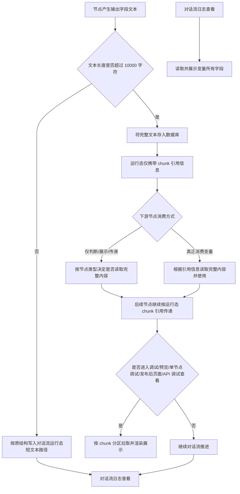
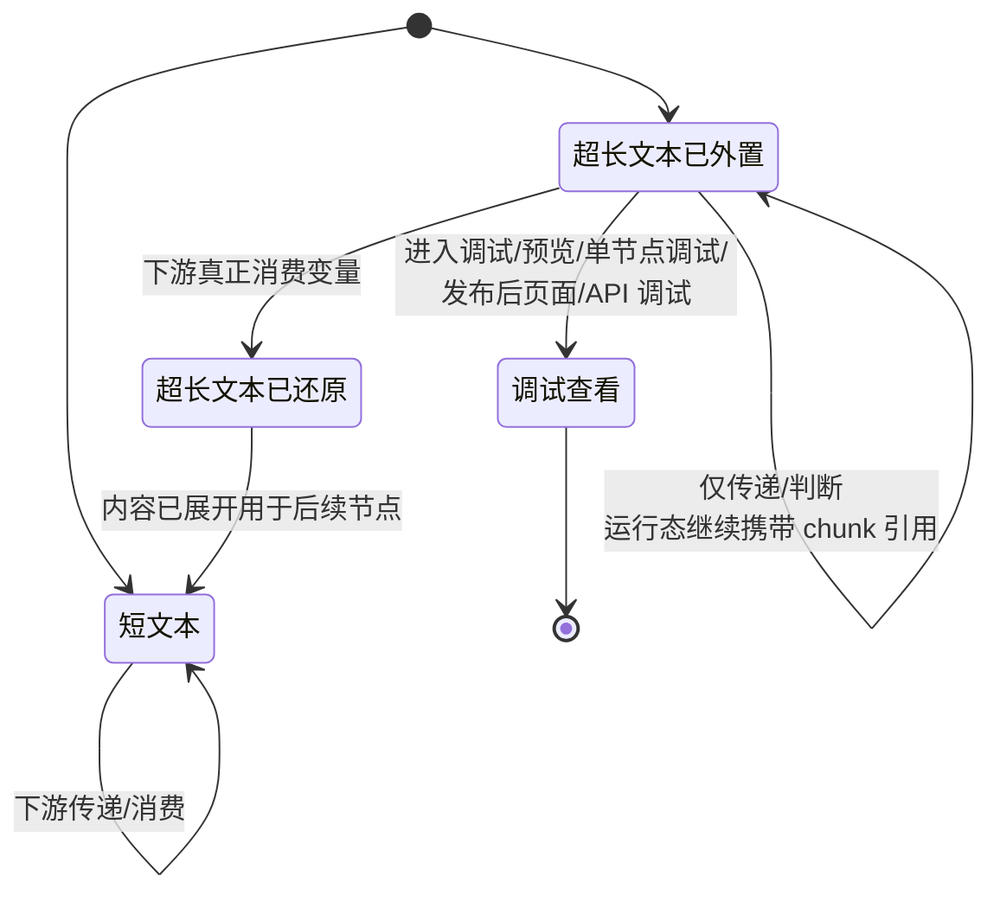
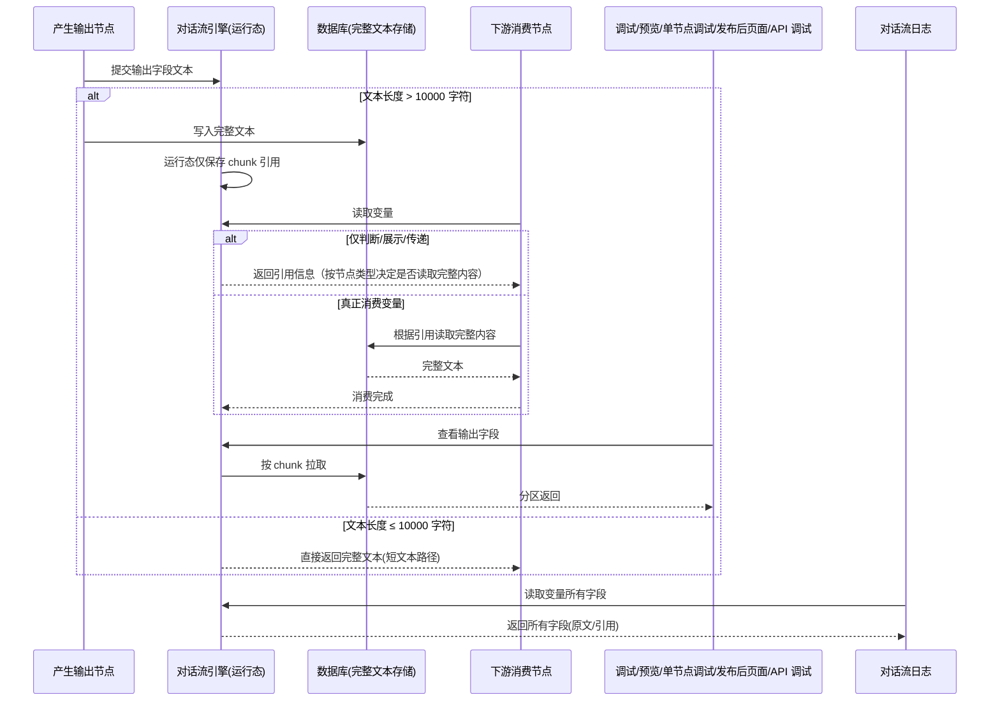

# 需求理解

## 1. 需求背景
海外项目存在将超长文档解析后存入对话流节点供下游消费的诉求。当对话流节点字段携带超长文本时，会导致对话流引擎崩溃，因此需要从存储、传输、消费三个环节对超长文本进行改造以解决稳定性问题。

痛点集中在两点：
1. 超长文本直接写入对话流运行态会引发引擎崩溃，影响海外业务可用性。
2. 调试、预览、API 调试等场景下无法稳定查看和消费超长文本。

## 2. 目标与价值
1. 解决对话流节点字段携带超长文本导致对话流引擎崩溃的问题，保障海外业务稳定运行。
2. 在不破坏现有短文本处理逻辑的前提下，支持超长文档解析后存入对话流并供下游节点消费。
3. 保证下游节点、调试页面、历史会话、日志等场景对超长文本改造的兼容性或最小感知。

## 3. 用户角色与使用场景
| 用户角色 | 使用场景 | 用户目标 | 已知约束 |
|---------|---------|---------|---------|
| 海外业务方（最终用户/运营） | 将超长文档解析后送入对话流节点并由下游消费 | 让下游节点能够基于超长文档正常完成业务 | 文档可能超过 10000 字符上限 |
| 对话流编排者 | 配置包含输入、加工、判断、输出等节点的对话流 | 编排可承载超长文本的对话流 | 涉及自主规划 agent 和写作 agent |
| 调试/开发人员 | 在 debug、预览、对话流测试、单节点调试、API 调试中查看和验证 | 定位超长文本处理结果是否正确 | 期望分区展示，不被截断隐藏 |
| QA 人员 | 验证超长文本在不同节点的存储、传递、消费与展示 | 验证兼容性与边界 | 需明确长度阈值与判定方式 |

## 4. 功能范围
**包含的功能**：
1. Python 版本对话流中所有涉及系统变量、对话流变量读取、使用、写入的节点改造：
   - 输入节点：收集用户回复至变量、收集用户上传文件
   - 信息加工：大模型变量赋值、普通变量赋值、知识检索变量赋值、文件检索变量赋值、文件解析
   - 触发动作 & 分支：代码执行、语义判断、条件判断
   - 输出：大模型回复、文本回复
2. 超长文本外置存储（数据库）+ 运行态携带 chunk 引用信息。
3. 下游节点在真正消费变量时根据引用信息自动还原完整内容。
4. 节点类型相关的“只判断/展示/传递”场景对完整内容的按需读取策略。
5. 超长文本在前端（debug、预览、对话流测试、单节点调试、发布后页面、API 接口调试）按 chunk 分区展示。
6. 单个字段长度限制 20000 字。
7. 对已有短文本变量、历史会话、对话流日志的兼容性处理。

**不包含的功能**：
1. Go 版本对话流的改造（原文说明“待切流后补充完善”）。

## 5. 业务流程
**主流程（超长文本输出节点的写入与下游消费）**：

1. 节点产生输出字段文本。
2. 系统判断文本长度是否超过 10000 字符。
3. 若未超过：保持原结构直接写入对话流运行态（短文本路径，不感知外置存储）。
4. 若超过：
   4.1 将完整文本内容存入数据库；
   4.2 在对话流运行态中仅携带轻量级 chunk 引用信息，不携带完整文本；
   4.3 下游节点按需消费：
     - 仅判断/展示/传递时，按节点类型决定是否读取完整内容；
     - 真正消费变量时，根据引用信息读取完整内容；
   4.4 调试/预览/对话流测试/单节点调试/发布后页面/API 接口调试按 chunk 分区展示完整内容。

**主流程（单节点调试与发布后页面查看）**：

1. 用户在调试入口发起查看。
2. 系统按字段读取输出；若为引用类型则按 chunk 分区拉取。
3. 前端分区渲染展示。

**主流程（对话流日志查看）**：

1. 用户打开日志。
2. 系统读取变量所有字段并展示，不做超长文本特殊隐藏。

图中未覆盖/原文未说明的内容：
- “按节点类型决定是否读取完整内容”的具体节点类型清单与判定策略原文未列出。
- “真正消费变量”与“仅判断/展示/传递”的边界规则原文未给出统一判定口径。
- chunk 的切分规则、chunk 引用信息字段结构、引用过期与失效处理原文未说明。
- 单字段 20000 字限制与 10000 字符外置阈值的衔接关系（覆盖、叠加、哪个先生效）原文未明确。
- “收集用户上传文件”“文件检索变量赋值”等节点在产生超长文本时，写入路径与下游消费规则未细化。

## 6. 状态流转
**核心对象：对话流节点输出字段（变量值）**

| 当前状态 | 触发条件/动作 | 执行角色 | 下一状态 | 可观察结果 |
|---|---|---|---|---|
| 短文本（≤10000 字符） | 节点输出完成 | 产生输出的节点 | 短文本（保持运行态原文） | 运行态直接可见，下游无需外置存储读取 |
| 超长文本（>10000 字符，已外置） | 节点输出完成，长度超阈值 | 产生输出的节点 | 运行态仅持 chunk 引用，完整文本存数据库 | 下游消费时按需读取完整内容 |
| 超长文本被下游消费（已还原） | 下游节点真正消费变量 | 下游消费节点 | 用于判断/展示/继续加工 | 节点按完整内容执行；运行态引用关系解除 |
| 超长文本仅传递/判断 | 下游节点仅做判断、展示或传递 | 下游节点 | 引用信息继续向下游传递 | 节点在不读取完整内容时仍能完成判定或展示 |
| 调试查看 | 用户在调试/预览/单节点调试/发布后页面/API 调试打开 | 调试用户 | 按 chunk 分区展示完整文本 | 用户可见完整超长文本 |

图中未覆盖/原文未说明：
- chunk 引用是否有过期、失效或清理状态，原文未说明。
- 节点输出字段在多轮编辑/重跑中的状态变化（如何与新一次输出衔接）原文未说明。
- “短文本（≤10000 字符）”与“单字段 20000 字限制”的状态归属未明示。

## 7. 业务规则
| 规则类型 | 触发条件 | 判断逻辑 | 处理结果 |
|---------|---------|---------|---------|
| 长度阈值 | 节点输出字段文本完成 | 文本长度 > 10000 字符 | 完整文本存入数据库；运行态改为 chunk 引用 |
| 长度阈值 | 节点输出字段文本完成 | 文本长度 ≤ 10000 字符 | 保持原结构，运行态直接携带完整文本 |
| 单字段长度限制 | 任意写入/输出动作 | 字段长度 > 20000 字 | 原文未说明限制后的处理（截断/报错/拒绝） |
| 消费判定 | 下游节点读取变量 | 是否真正消费变量（用于加工/回复等） | 根据 chunk 引用读取完整内容 |
| 消费判定 | 下游节点读取变量 | 仅判断/展示/传递 | 按节点类型决定是否读取完整内容 |
| 展示规则 | 调试/预览/对话流测试/单节点调试/发布后页面/API 接口调试 | 输出为超长文本 | 按 chunk 分区展示 |
| 日志规则 | 查看对话流日志 | 任意变量 | 展示变量所有字段 |
| 兼容性 | 历史会话中已存的普通文本 | 历史会话仍按原逻辑读取 | 不感知外置存储 |
| 兼容性 | 短文本变量 | 未超过 10000 字符 | 保持原结构，不影响现有流程 |

## 8. 页面与交互
**单节点调试 / debug / 预览 / 对话流测试 / 发布后页面 / API 接口调试**：
- 页面元素：超长文本输出字段分区块（chunk）展示。
- 交互：滚动/翻页/分页查看各 chunk 内容（具体交互控件原文未说明）。
- 反馈：超长文本完整可见，不被单页截断隐藏。

**对话流日志**：
- 页面元素：变量所有字段（不做超长文本分区特殊化处理）。
- 交互：原文未说明。
- 反馈：可看到字段的完整内容/引用信息。

**输入与加工节点侧**：
- 涉及“收集用户回复至变量”“收集用户上传文件”“大模型变量赋值”“普通变量赋值”“知识检索变量赋值”“文件检索变量赋值”“文件解析”等节点，原文未说明其页面与交互细节。

## 9. 数据与系统交互
**已知数据**：
- 节点输出字段的文本内容。
- 是否触发外置存储的阈值：10000 字符。
- 单个字段长度上限：20000 字。
- chunk 引用信息（原文未给出具体字段结构）。
- 完整文本内容存储于数据库（原文未给出表/字段）。
- 变量所有字段信息需在日志中展示。

**系统交互**：
- 节点产出超长文本 → 数据库写入完整内容（参与方：对话流引擎 ↔ 数据库）。
- 下游消费节点 → 根据 chunk 引用读取完整内容（参与方：对话流引擎 ↔ 数据库）。
- 调试/预览/单节点调试/发布后页面/API 接口调试 → 按 chunk 分区获取并展示（参与方：对话流引擎/前端 ↔ 数据库/网关）。
- 对话流日志 → 读取并展示变量所有字段（参与方：日志服务 ↔ 对话流引擎）。

**API 能力**：
- 原文未定义具体接口契约、错误码、限流或鉴权细节。

图中未覆盖/原文未说明：
- 数据库写入的表结构、chunk 切分粒度、引用信息过期/清理机制。
- 调试侧调用链（前端如何按 chunk 拉取，是否分页/懒加载、失败重试）原文未说明。
- 对外 API 调试的鉴权、限流、超长文本返回体裁剪策略原文未说明。
