# 亦庄登录sso

## 需求概述

- 本文档由需求归并智能体按业务模块、相似语义和来源块覆盖关系归并生成。

## cluster-0002-project background

## 一、背景

新版官网统一认证中心（br-auth-center）已完成首期核心能力建设，支持手机号/邮箱注册登录、统一 UID 管理、SSO 票据颁发与校验、业务上下文透传、限流防重放等安全能力。

本文档旨在帮助各百系产品团队了解：接入范围是什么、产品侧需要做什么、认证中心提供什么、不提供什么。


## cluster-0003-project goals

## 二、首期目标

| 目标 | 说明 |
| --- | --- |
| 官网统一身份入口 | 用户在新版官网完成注册/登录后，可跳转进入任意百系产品 |
| 统一 UID | 每个官网用户拥有全局唯一 unified_uid，作为跨产品身份锚点 |
| SSO 票据链路 | 官网颁发 login_ticket，产品后端校验换取 UserInfo |
| biz_context 透传 | 产品预注册业务上下文（邀请码/推荐码/场景标记），用户登录后原样回传 |
| 安全加固 | 限流、nonce 防重放、审计脱敏 |


## cluster-0004-sso scope included

本期认证中心 SSO 能力主要承接以下场景：

- 用户从新版官网入口点击进入百系产品
- 用户在官网完成注册/登录后，由官网引导跳转到产品
- 产品通过新增导流入口（落地页、推广链接、活动页）接入官网统一登录（可选）
- 产品通过预注册邀请链接/推荐链接业务上下文（可选）
- 产品的深链场景（面试任务、项目协作、专家入驻等）选择通过官网认证中心完成身份核验（可选）

## 三、接入范围

本期认证中心 SSO 能力主要承接以下场景：

用户从新版官网入口点击进入百系产品

用户在官网完成注册/登录后，由官网引导跳转到产品

产品希望通过新增导流入口（落地页、推广链接、活动页）接入官网统一登录也可支持（可选）

产品通过预注册邀请链接/推荐链接业务上下文（可选）

产品的深链场景（面试任务、项目协作、专家入驻等）选择通过官网认证中心完成身份核验（可选）


## cluster-0005-sso scope excluded

首期不接入官网统一认证中心的场景包括：已有企业客户正在使用的产品后台登录入口；小程序、App、PC客户端等既有登录入口；企业管理员分发账号后员工使用的内部入口；有复杂租户审批、邀请码校验、企业邮箱校验的现有入口；存量客户已收藏的产品后台地址。原入口可保留，认证中心仅提供新增链路能力。

## 四、不接入范围（首期）

以下场景首期不要求迁移到官网统一认证中心：

已有企业客户正在使用的产品后台登录入口

小程序、App、PC 客户端等既有登录入口

企业管理员分发账号后员工使用的内部入口

有复杂租户审批、邀请码校验、企业邮箱校验的现有入口

存量客户已收藏的产品后台地址

重要原则：首期不要求产品将原有登录入口全部迁移到官网。原入口可继续保留，认证中心提供的是新增链路能力。


## cluster-0006-sso core flow diagram

SSO核心链路流程图，描述了用户访问官网、登录、预注册context_id、生成login_ticket、跳转产品SSO入口、调用verify接口、获取用户信息和产品侧处理的全过程。

## 五、核心链路

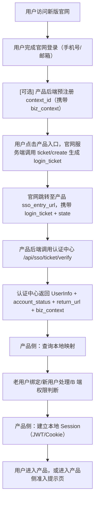


## cluster-0007-product responsibilities

## 六、产品侧要做什么

| 任务 | 说明 | 是否必须 |
| --- | --- | --- |
| 提供 sso_entry_url | 接收 login_ticket + state 的 HTTP GET 回调地址 | 必须 |
| 调用 ticket/verify | 后端调用认证中心校验 ticket，换取 UserInfo | 必须 |
| 维护 unified_uid ↔ local_user_id 映射 | 产品自己的账号映射表 | 必须 |
| 建立产品本地 Session | 产品自己颁发和管理 JWT/Cookie | 必须 |
| 处理 return_url 跳转 | 登录成功后跳转到正确页面 | 必须 |
| 处理 biz_context | 从 verify 响应中读取并处理业务上下文 | 视产品需求 |
| 处理 B 端权限判断 | 查询本地账号是否有 B 端准入权限 | 端产品必须 |
| 处理老用户绑定 | unified_uid 与已有账号的关联策略 | 视产品情况 |
| 调用 context/register | 预注册 biz_context | 有业务上下文时使用 |
| 保护 product_access_key | 只存后端，不入前端、不入日志 | 必须 |


## cluster-0008-auth center capabilities

## 七、认证中心提供什么

| 能力 | 说明 |
| --- | --- |
| 注册/登录 | 手机号、邮箱注册与登录 |
| 统一 UID | 全局唯一 unified_uid |
| login_ticket | 一次性、短时效（5 分钟）的 SSO 票据 |
| ticket 校验 | 产品后端用 product_access_key 换取 UserInfo |
| UserInfo | unified_uid、user_type、脱敏手机号/邮箱、account_status、注册来源 |
| biz_context 透传 | 预注册的业务上下文原样透传，不解析 |
| account_status | ACTIVE / DISABLED / CANCELLED |
| context/register | 支持产品预注册业务上下文，返回 context_id |
| 限流保护 | 5 类接口按分钟桶限流（HTTP 429） |
| nonce 防重放 | ticket verify 防止重放攻击 |
| 审计日志 | 认证侧事件审计，敏感字段脱敏 |


## cluster-0009-auth center non responsibilities

## 八、认证中心不做什么

| 不做的事 | 说明 | 谁来做 |
| --- | --- | --- |
| 创建产品本地账号 | 不在认证中心建产品账号表 | 产品侧 |
| 维护 UID ↔ 本地账号映射 | 不存 local_user_id | 产品侧 |
| 建立产品 Session | 不颁发产品 JWT/Cookie | 产品侧 |
| 校验邀请码/推荐码有效性 | 只透传，不校验业务含义 | 产品侧 |
| 校验企业邮箱/企业代码 | 不验证企业身份 | 产品侧 |
| 维护租户/组织/角色/权限 | 认证中心无此模型 | 产品侧 |
| 判断是否有产品使用权限 | 只返回身份信息 | 产品侧 |
| 实现 OAuth2/OIDC | 首期不实现 | 后续增强 |
| 全局登出 | 首期不强制 | 后续增强 |
| 第三方登录 | 首期不实现 | 后续增强 |

以上清单明确了认证中心不在其职责范围内的各项能力，产品侧需自行或通过其他系统实现相关功能。


## cluster-0010-product user mode classification

## 九、产品接入模式分类

product_user_mode 枚举说明：

| 接口枚举值 | 业务展示值 | 说明 |
| --- | --- | --- |
| C | C | 面向个人用户 |
| B | B | 面向企业用户 |
| B_PLUS_C | B+C | 同时支持个人和企业 |
| INVITE_ONLY | 邀请制 | 邀请码 / 灰度准入 |

接口响应中 product_context.product_user_mode 返回接口枚举值（如 B_PLUS_C）。本文档中的"B+C"为业务展示值，代码判断请使用枚举值。

user_type 说明

user_type 表示认证中心侧识别到的身份线索，取值为：

UNKNOWN：未知或暂未识别；

PERSONAL：个人身份线索；

ENTERPRISE_MEMBER：企业成员身份线索。

注意：user_type 不代表用户拥有某产品的 B 端权限。产品是否允许用户进入 B 端后台，由产品侧根据本地账号、企业租户、角色权限自行判断。产品用户模式（C/B/B+C/邀请制）由 product_context.product_user_mode 表示，与 user_type 是不同维度。

### 9.1 C 端产品

典型产品：百智个人场景（部分）

特点：

官网注册用户可尝试进入

产品侧按 unified_uid 查映射，无映射可自动创建本地账号

原登录入口首期可继续保留

推荐策略：

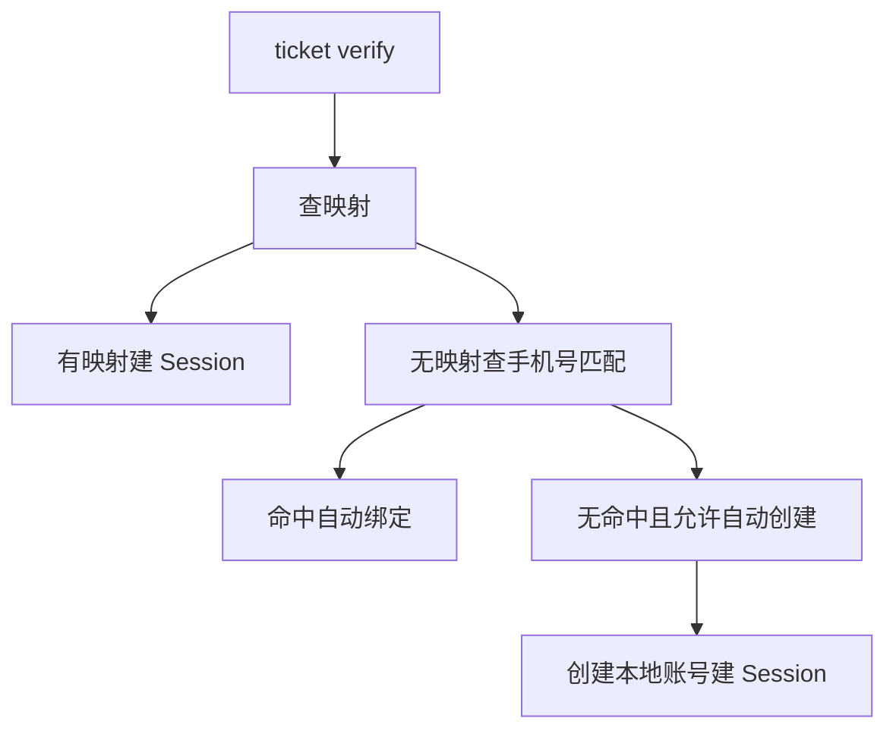

### 9.2 B 端产品

典型产品：百才（HR 后台）、百察、百灵

核心原则：官网注册登录 ≠ 自动开通 B 端产品权限

特点：

ticket verify 成功后，还需查询本地是否有账号和 B 端权限

无账号用户不应直接进入产品后台

应引导至留资/申请试用/联系管理员

推荐策略：

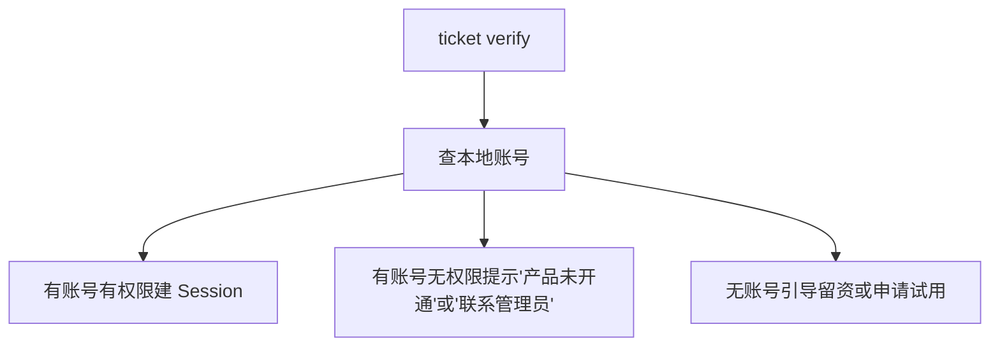

### 9.3 B+C 混合产品

典型产品：百智、百工（B+C 场景）

特点：

同一产品同时支持个人用户和企业用户

产品根据 UID 和 biz_context 决定走个人空间还是企业空间

可通过 biz_context 传递用户的进入场景标记

推荐策略：

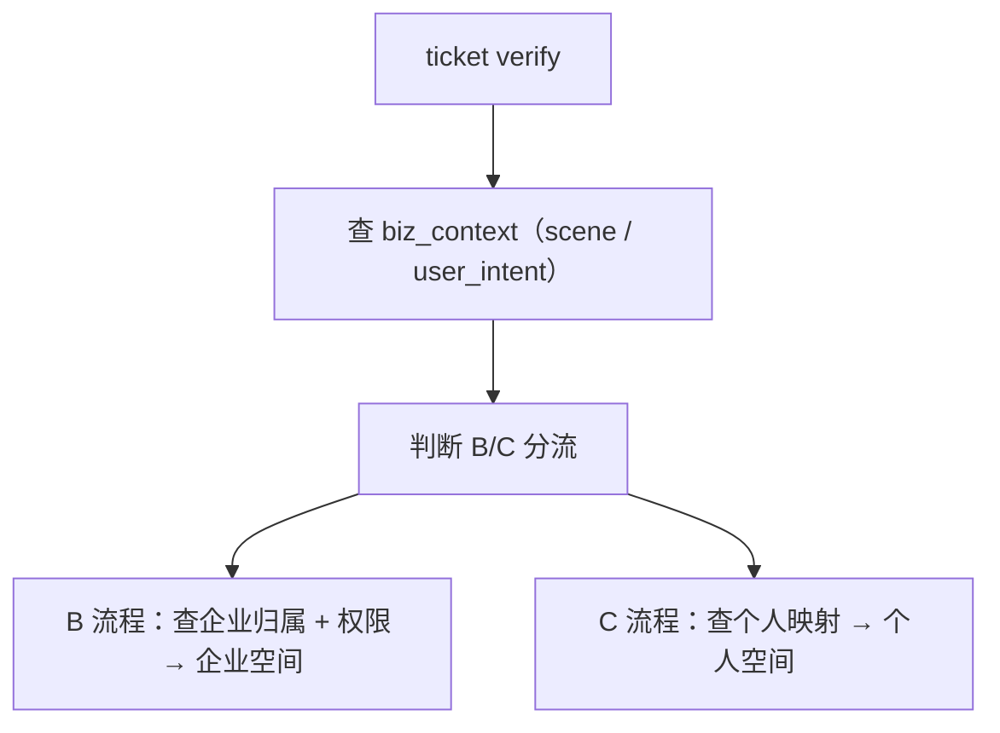

### 9.4 INVITE_ONLY（邀请制/灰度产品）

典型场景：百工邀请制灰度开放

特点：

通过 biz_context 携带邀请码（invite_code）

认证中心只透传邀请码，不校验邀请码有效性

产品后端收到邀请码后，自行校验是否有效

推荐策略：

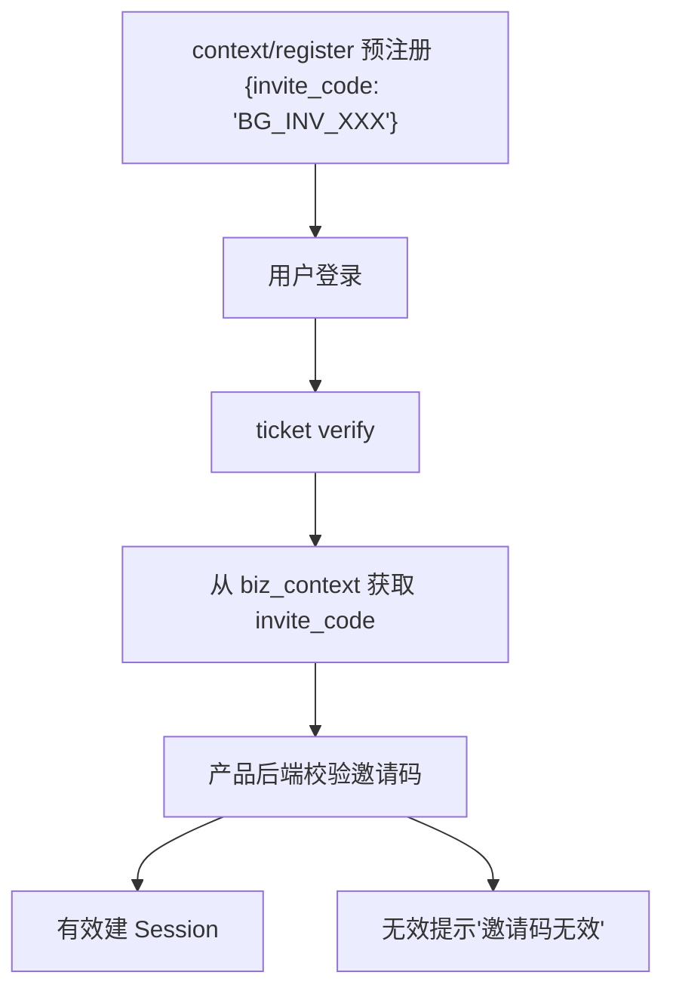


## cluster-0011-original login retention

首期不要求迁移原产品登录入口，原入口可继续保留。认证中心主要承接新增链路（官网导流、活动、邀请、深链）；存量用户使用的产品后台登录入口首期无需改动。产品完成联调验收后可按自身节奏逐步扩大接入范围，认证中心不强制任何产品立即迁移全量登录入口。

## 十、原产品登录入口保留原则

首期不要求迁移，原入口可继续保留。

官网统一认证中心主要承接新增链路（官网导流、活动、邀请、深链）

存量用户正在使用的产品后台登录入口，首期无需改动

产品完成联调验收后，可按自身节奏逐步扩大接入范围

认证中心不强制要求任何产品立即迁移全量登录入口


## cluster-0012-onboarding steps

产品接入认证中心需依次完成7个步骤：填写登记表、认证中心配置参数、获取联调密钥、实现接收逻辑、联调验证、验收、生产上线。

## 十一、接入路径选择

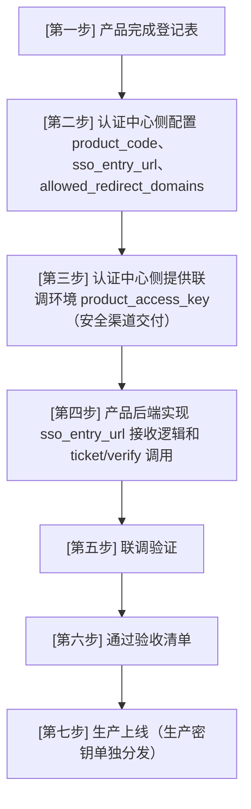


## cluster-0013-joint debugging process

- 待澄清：联调流程要点的具体判定标准、通过条件和数据要求需补充。

## 十二、联调流程

联调流程要点：

双方确认联调环境地址和 product_access_key

先验证 context/register → ticket/create → ticket/verify 正向链路

验证 B 端/邀请制等特殊场景

验证异常场景（票据已用、state 不符、nonce 重放等）

验证审计日志不含明文敏感信息


## cluster-0014-security requirements

安全要求包括：product_access_key 仅后端使用，login_ticket 不作登录态，nonce 每次唯一，HTTPS 调用认证中心，产品建立本地 Session。

## 十三、安全要求

| 要求 | 说明 |
| --- | --- |
| product_access_key 仅后端 | 不入前端代码、不入 URL、不入日志 |
| login_ticket 不作登录态 | 只用于换取 UserInfo，不存长期 |
| nonce 每次唯一 | 每次 ticket/verify 生成新的随机 nonce |
| HTTPS 调用认证中心 | 生产环境禁止 HTTP |
| 产品建立本地 Session | 不依赖 login_ticket 作为登录凭证 |


## cluster-0015-acceptance criteria

## 十四、验收标准

核心验收项：

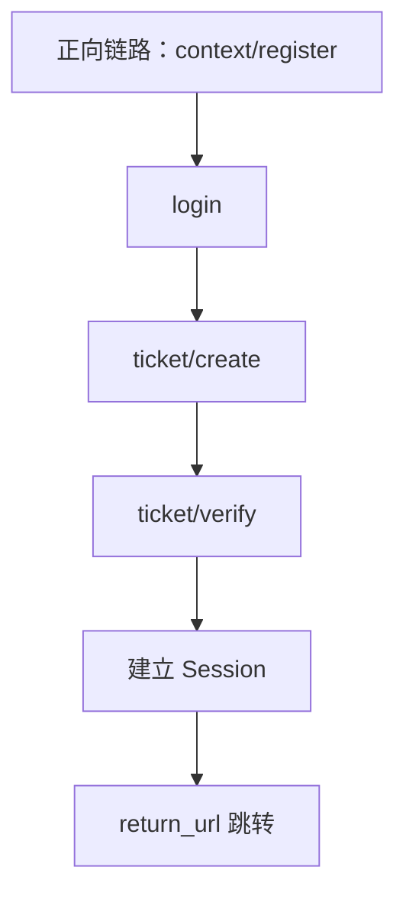

异常链路：票据重用、state 不符、nonce 重放、product_access_key 无效

审计日志无敏感明文


## cluster-0016-self verified capabilities

当前统一认证中心已自测验证的能力包括：手机号/邮箱注册登录、context/register、ticket/create（带context_id）、ticket/verify（返回UserInfo+biz_context）、mock-product-server完整E2E链路、nonce防重放、限流（5类接口）、审计日志脱敏、Actuator最小暴露、product_access_key认证，以上能力均已通过验证。

## 十五、当前统一认证中心已自测验证了的能力

| 能力 | 状态 |
| --- | --- |
| 手机号/邮箱注册登录 | 已验证 |
| context/register | 已验证 |
| ticket/create（带 context_id） | 已验证 |
| ticket/verify（返回 UserInfo + biz_context） | 已验证 |
| mock-product-server 完整 E2E 链路 | 已验证 |
| nonce 防重放 | 已验证 |
| 限流（5 类接口） | 已验证 |
| 审计日志脱敏 | 已验证 |
| Actuator 最小暴露 | 已验证 |
| product_access_key 认证 | 已验证 |


## cluster-0018-product entry status query api

提供查询产品进入状态的GET接口，路径为 /api/sso/product-entry/status，需使用 Bearer token 认证，必须传入 product_code 作为 query string 参数。

## 二、接口一：查询产品进入状态 $\color{#0089FF}{@刘凯(刘凯(前端研发部/前端二组))}$ 

### 请求

| 字段 | 值 |
| --- | --- |
| 方法 | GET |
| 路径 | `/api/sso/product-entry/status` |
| 认证 | `Authorization: Bearer {session_token}`（官网登录用户） |
| 参数 | `product_code`（query string，必填） |

### 业务逻辑

1.  校验 session\_token，获取 unified\_uid
    
2.  查询产品配置（不存在 → PRODUCT\_INVALID，禁用 → PRODUCT\_DISABLED）
    
3.  如果 `require_invite_code = false`：action = CREATE\_TICKET\_DIRECTLY
    
4.  如果 `require_invite_code = true`：
    
    *   查询 `auth_product_user_access` 是否存在 CONNECTED 记录
        
    *   存在 → action = CREATE\_TICKET\_DIRECTLY
        
    *   不存在 → action = SHOW\_INVITE\_DIALOG
        

### 成功响应：需要弹邀请码

```json
{
  "code": "SUCCESS",
  "data": {
    "product_code": "baigong",
    "product_name": "百工",
    "require_invite_code": true,
    "invite_required_for_current_user": true,
    "access_status": "NOT_CONNECTED",
    "action": "SHOW_INVITE_DIALOG",
    "sso_entry_url": "https://saibotan-pre.100credit.cn/login"
  }
}

```

### 成功响应：不需要弹邀请码

```json
{
  "code": "SUCCESS",
  "data": {
    "product_code": "baigong",
    "product_name": "百工",
    "require_invite_code": true,
    "invite_required_for_current_user": false,
    "access_status": "CONNECTED",
    "action": "CREATE_TICKET_DIRECTLY",
    "sso_entry_url": "https://saibotan-pre.100credit.cn/login"
  }
}

```

### 错误码

| 错误码 | 说明 |
| --- | --- |
| SESSION\_INVALID | 未登录或 session 过期 |
| PRODUCT\_INVALID | 产品不存在 |
| PRODUCT\_DISABLED | 产品已禁用 |
| PARAM\_INVALID | product\_code 为空 |

---


## cluster-0019-product entry confirm api

确认产品首次接入接口用于产品方确认用户首次接入。接口采用 POST 方法，路径为 /api/sso/product-entry/confirm。鉴权使用 Authorization: Bearer {product_access_key}，且 product_access_key 必须属于请求体中的 product_code，产品必须处于 ENABLED 状态。业务逻辑：校验 unified_uid 对应用户存在，校验 access_status = CONNECTED，然后执行 Upsert 操作 auth_product_user_access；若不存在则插入，first_connected_at = now、last_connected_at = now；若已存在则更新 access_status = CONNECTED、last_connected_at = now（不覆盖 first_connected_at）。成功返回 code SUCCESS 及产品信息。

## 三、接口二：确认产品首次接入 $\color{#0089FF}{@刘辉}$ 

### 请求

| 字段 | 值 |
| --- | --- |
| 方法 | POST |
| 路径 | `/api/sso/product-entry/confirm` |
| 认证 | `Authorization: Bearer {product_access_key}`（产品后端） |
| Content-Type | `application/json` |

### 请求体

```json
{
  "product_code": "baigong",
  "unified_uid": "{unified_uid}",
  "access_status": "CONNECTED",
  "bind_source": "INVITE_CODE"
}

```

| 字段 | 类型 | 必须 | 说明 |
| --- | --- | --- | --- |
| `product_code` | string | ✅ | 产品编码 |
| `unified_uid` | string | ✅ | 统一用户 ID |
| `access_status` | string | ✅ | P0 仅支持 `CONNECTED` |
| `bind_source` | string | ❌ | 接入来源：INVITE\_CODE / ADMIN / IMPORT / UNKNOWN |

### 鉴权逻辑

1.  校验 Authorization: Bearer {product\_access\_key}
    
2.  product\_access\_key 必须属于请求体中的 product\_code
    
3.  产品必须 ENABLED
    
4.  鉴权失败 → PRODUCT\_ACCESS\_DENIED
    

### 业务逻辑

1.  校验 unified\_uid 对应用户存在
    
2.  校验 access\_status = CONNECTED
    
3.  Upsert `auth_product_user_access`：
    
    *   不存在：插入，first\_connected\_at = now，last\_connected\_at = now
        
    *   已存在：更新 access\_status = CONNECTED，last\_connected\_at = now（不覆盖 first\_connected\_at）
        

### 成功响应

```json
{
  "code": "SUCCESS",
  "data": {
    "product_code": "baigong",
    "unified_uid": "{unified_uid}",
    "access_status": "CONNECTED"
  }
}

```

### 错误码

| 错误码 | 说明 |
| --- | --- |
| PRODUCT\_ACCESS\_DENIED | product\_access\_key 错误 |
| PRODUCT\_INVALID | 产品不存在 |
| PRODUCT\_DISABLED | 产品已禁用 |
| USER\_NOT\_FOUND | unified\_uid 不存在 |
| PARAM\_INVALID | 参数错误或 access\_status 非 CONNECTED |

---


## cluster-0020-product entry db table

## 四、数据库表

```sql
CREATE TABLE auth_product_user_access (
  id BIGINT UNSIGNED NOT NULL AUTO_INCREMENT,
  product_code VARCHAR(64) NOT NULL,
  unified_uid VARCHAR(64) NOT NULL,
  access_status VARCHAR(32) NOT NULL COMMENT 'CONNECTED / REVOKED',
  bind_source VARCHAR(32) DEFAULT NULL,
  first_connected_at DATETIME(3),
  last_connected_at DATETIME(3),
  created_at DATETIME(3) NOT NULL DEFAULT CURRENT_TIMESTAMP(3),
  updated_at DATETIME(3) NOT NULL DEFAULT CURRENT_TIMESTAMP(3) ON UPDATE CURRENT_TIMESTAMP(3),
  is_deleted TINYINT NOT NULL DEFAULT 0,
  PRIMARY KEY (id),
  UNIQUE KEY uk_product_uid (product_code, unified_uid)
);

```

**不存储**：邀请码、local\_user\_id、local\_tenant\_id、权限

---

auth_product_user_access 表不存储邀请码、local_user_id、local_tenant_id、权限字段。


## cluster-0021-frontend recommended flow

## 五、前端推荐流程

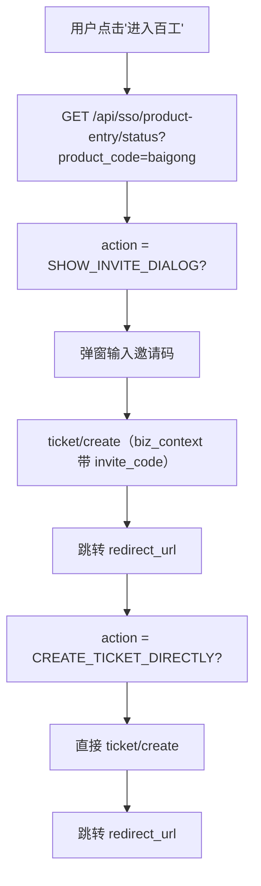
---


## cluster-0022-backend recommended flow baigong

百工后端推荐流程：百工收到 login_ticket 和 state 后，先 POST /api/sso/ticket/verify 获取 unified_uid 和 biz_context.invite_code，然后查询百工本地映射。若存在映射则建立百工 Session；若无映射则校验 invite_code，有效则创建本地用户、建立 Session 并 POST /api/sso/product-entry/confirm，无效则拒绝进入。

## 六、百工后端推荐流程

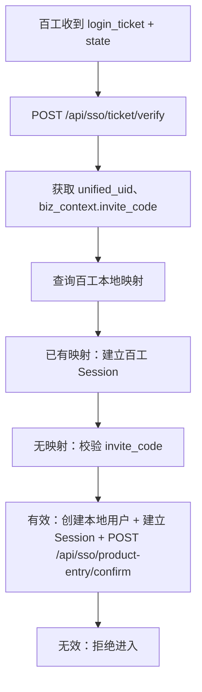
---


## cluster-0023-product entry security

## 七、安全说明

*   status 接口使用官网 session\_token 鉴权，只返回当前用户自己的状态
    
*   confirm 接口使用 product\_access\_key 鉴权，只有合法产品后端才能调用
    
*   日志中不打印 session\_token、product\_access\_key、邀请码
    
*   不存储邀请码明文
    
*   不存储 local\_user\_id / local\_tenant\_id


## cluster-0024-project background and goals

新版百融官网升级后，将承担百系产品统一入口职能。官网不仅作为品牌展示与产品导航入口，同时需逐步承接百系产品统一注册、统一登录、统一认证与统一身份识别能力。当前百系产品存在独立登录入口、独立账号体系、独立认证方式，用户从官网进入不同产品时存在重复登录、身份割裂、状态不统一等问题，官网无法形成统一用户承接链路。因此需建设统一登录认证授权中心，作为官网统一身份基础设施，对内输出标准化认证能力，对外形成统一登录入口。

建设统一登录认证授权中心，实现：统一注册、统一登录、统一认证、统一授权、统一身份标识、单点登录（SSO）、单点登出（SLO）、官网统一入口能力。

## 1. 项目概述

### 1.1 项目背景

新版百融官网升级后，将承担百系产品统一入口职能。官网不仅作为品牌展示与产品导航入口，同时需逐步承接百系产品统一注册、统一登录、统一认证与统一身份识别能力。

当前百系产品存在独立登录入口、独立账号体系、独立认证方式，用户从官网进入不同产品时存在重复登录、身份割裂、状态不统一等问题，官网无法形成统一用户承接链路

因此需建设统一登录认证授权中心，作为官网统一身份基础设施，对内输出标准化认证能力，对外形成统一登录入口。

### 1.2 项目目标

建设统一登录认证授权中心，实现：统一注册、统一登录、统一认证、统一授权、统一身份标识、单点登录（SSO）、单点登出（SLO）、官网统一入口能力。


## cluster-0025-auth center responsibilities

## 2. 产品定位

### 2.1 核心职责

统一登录认证授权中心负责：用户注册、用户登录、统一登录认证授权、统一 UID 管理、票据签发、UserInfo 服务、SSO、SLO、登录审计。

### 2.2 职责边界

统一认证中心负责身份层统一，不替代各产品业务系统。

各产品继续负责：本地账号、本地 Session、租户、角色、菜单、数据权限、业务权限。


## cluster-0026-construction principles

统一登录认证授权中心负责统一身份识别与认证授权，各产品保留自身账号体系及权限体系。

允许各产品保留现有登录方式作为过渡入口，但统一认证中心逐步成为官网主登录链路。

## 3. 建设原则

### 3.1 统一认证，产品自治

统一登录认证授权中心负责统一身份识别与认证授权，各产品保留自身账号体系及权限体系。

### 3.2 渐进式推进

允许各产品保留现有登录方式作为过渡入口，但统一认证中心逐步成为官网主登录链路。


## cluster-0027-user model

用户模型包含三类用户：C端个人用户（统一注册登录）、B端用户（企业管理员、企业成员）、B+C混合身份用户（同一用户可承载多身份）。

## 4. 用户模型

### 4.1 C端用户

个人用户统一注册与登录。

### 4.2 B端用户

企业管理员、企业成员。

### 4.3 B+C混合身份用户

支持同一用户在统一身份下承载多身份场景。


## cluster-0028-overall architecture

统一登录认证授权中心作为官网统一入口与百系产品之间的桥梁，官网入口通过中心访问百系产品，百系产品再对接本地账号映射和产品权限体系。

## 5. 总体架构

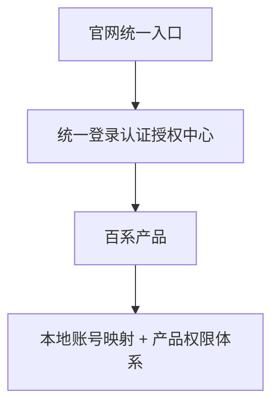


## cluster-0029-core mechanisms

所有用户在统一认证中心内拥有唯一身份标识（Unified UID）。统一认证中心不直接替代各产品本地账号体系，各产品通过Unified UID与本地账号建立映射关系。用户首次通过官网进入产品时：已存在本地账号则绑定本地账号；不存在本地账号则创建本地账号；存在冲突则进入冲突处理流程。

## 6. 核心机制设计

### 6.1 Unified UID

所有用户在统一认证中心内拥有唯一身份标识（Unified UID）。

### 6.2 本地账号映射

统一认证中心不直接替代各产品本地账号体系，各产品通过 Unified UID 与本地账号建立映射关系。

映射关系：Unified UID ↔ Local User ID

### 6.3 首次绑定机制

用户首次通过官网进入产品时：已存在本地账号则绑定本地账号；不存在本地账号则创建本地账号；存在冲突则进入冲突处理流程。


## cluster-0030-core business flow

核心业务流程包括官网登录建立统一身份状态、官网进入产品免二次登录（流程为官网→统一认证中心→产品侧→本地Session）、以及产品直接访问时需通过统一认证中心登录后回跳产品。

- **官网登录**：用户在官网完成统一注册或登录后，建立统一身份状态。
- **官网进入产品**：目标为官网登录后进入产品免二次登录。流程：官网 → 统一认证中心 → 产品侧 → 本地 Session。
- **产品直接访问**：用户直接访问产品时，需经统一认证中心登录，完成后回跳至产品。流程：产品 → 统一认证中心 → 登录 → 回跳产品。

## 7. 核心业务流程

### 7.1 官网登录

用户在官网完成统一注册或登录后，建立统一身份状态。

### 7.2 官网进入产品

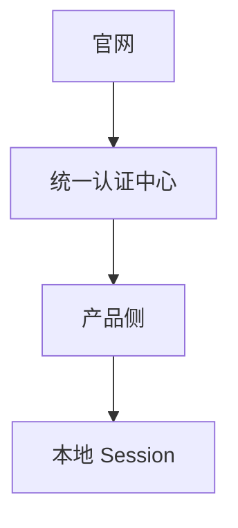

目标：官网登录后进入产品免二次登录。

### 7.3 产品直接访问

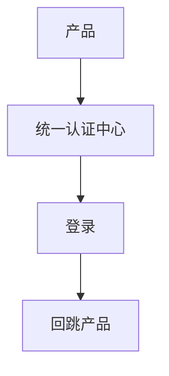


## cluster-0031-login experience requirements

## 8. 登录体验要求

用户登录一次后，可访问已接入产品；官网进入产品无需重复登录；登录状态统一；首次绑定标准化；登录异常可控。


## cluster-0032-logout mechanism

登出机制包括本地登出和全局登出。

- 本地登出：仅退出当前产品，不影响官网及其他产品登录状态。
- 全局登出：退出统一认证中心，同时清理官网及接入产品登录状态。

## 9. 登出机制

### 9.1 本地登出

仅退出当前产品，不影响官网及其他产品登录状态。

### 9.2 全局登出

退出统一认证中心，同时清理官网及接入产品登录状态。


## cluster-0033-security standards

所有 redirect_uri 必须统一白名单管理。

所有授权请求必须校验 state，防止 CSRF。

access_token / refresh_token 禁止暴露于前端或 URL。

client_secret 仅允许服务端保存。

生产环境必须全链路 HTTPS。

日志必须脱敏处理，不记录敏感信息。

## 10. 安全规范

### 10.1 redirect_uri

所有 redirect_uri 必须统一白名单管理。

### 10.2 state

所有授权请求必须校验 state，防止 CSRF。

### 10.3 Token 安全

access_token / refresh_token 禁止暴露于前端或 URL。

### 10.4 client_secret

仅允许服务端保存。

### 10.5 HTTPS

生产环境必须全链路 HTTPS。

### 10.6 日志安全

日志必须脱敏处理，不记录敏感信息。


## cluster-0034-standard capabilities output

统一登录认证授权中心需向各产品提供 client_id、client_secret、redirect_uri 配置、logout_uri 配置、访问的票据、UserInfo、SSO、SLO、登录审计能力。

## 11. 标准输出能力

统一登录认证授权中心需向各产品提供：client_id、client_secret、redirect_uri 配置、logout_uri 配置、访问的票据、UserInfo、SSO、SLO、登录审计能力。


## cluster-0035-product onboarding requirements

## 12. 产品接入要求

接入产品需满足：支持统一认证中心登录、支持官网免二次登录、支持 Unified UID 映射、支持首次绑定、支持本地登出、支持全局登出、满足统一安全规范。


## cluster-0036-non construction scope

本项目不包含：统一产品业务权限、统一租户体系、统一角色体系、统一菜单体系、统一账号库合并。

## 13. 非建设范围

本项目不包含：统一产品业务权限、统一租户体系、统一角色体系、统一菜单体系、统一账号库合并。


## cluster-0037-acceptance criteria

## 14. 验收标准

### 15.1 功能验收

官网统一注册登录完成；官网进入产品免二次登录；Unified UID 生效；首次绑定流程可用；SSO 生效；SLO 生效。

### 15.2 安全验收

redirect_uri 白名单；state 校验；token安全；client_secret 安全；HTTPS；日志脱敏。


## cluster-0039-overall onboarding principles

官网统一认证中心负责注册、登录、找回密码、统一UID、登录态、login_ticket签发与校验、UserInfo、account_status、biz_context、产品接入配置、登录审计；各产品继续负责本地账号、本地session、租户、组织架构、角色权限、菜单权限、数据权限、套餐/功能开通、邀请码/推荐码、企业代码/企业邮箱、产品内审批、原登录入口、产品内审计。首期采用login_ticket + UserInfo + 本地session的最小接入模式。

## 2. 总体接入原则

### 2.1 官网统一认证中心负责

| 能力 | 说明 |
| --- | --- |
| 官网注册 | 手机号 / 邮箱注册 |
| 官网登录 | 手机号 / 邮箱登录 |
| 找回密码 | 手机号 / 邮箱找回 |
| 统一 UID | 为官网用户生成 `unified_uid` |
| 登录态 | 维护官网侧登录态 |
| login\_ticket | 签发一次性短效产品登录票据 |
| ticket 校验 | 产品后端通过 ticket 换取可信身份信息 |
| UserInfo | 返回统一身份基础信息 |
| account\_status | 返回官网统一账号状态 |
| biz\_context | 绑定并透传业务上下文 |
| 产品接入配置 | 管理产品编码、接入地址、白名单、密钥等 |
| 登录审计 | 记录官网侧认证和产品跳转审计 |

### 2.2 各产品继续负责

| 能力 | 说明 |
| --- | --- |
| 本地账号 | 产品自己的用户表、账号体系 |
| 本地 session | 产品自己的登录态 |
| 租户 | 企业租户、组织空间、个人空间 |
| 组织架构 | 部门、员工、企业成员 |
| 角色权限 | 管理员、普通用户、HR、专家、候选人等 |
| 菜单权限 | 产品内可见菜单 |
| 数据权限 | 产品内数据隔离 |
| 套餐/功能开通 | 企业购买了哪些模块 |
| 邀请码/推荐码 | 产品自己的准入和运营机制 |
| 企业代码/企业邮箱 | 产品自己的企业识别机制 |
| 产品内审批 | 申请试用、企业开通、管理员邀请 |
| 原登录入口 | 可按产品策略继续保留 |
| 产品内审计 | 业务操作日志和产品内安全审计 |


为降低百系产品接入成本，首期采用 **login\_ticket + UserInfo + 本地 session** 的最小接入模式。


## cluster-0040-standard flow and product mode

各产品在接入标准链路前需确认自己的产品用户模式。

## 3.1 标准链路


各产品需要在接入前确认自己的产品用户模式。


## cluster-0041-product user mode definition

产品用户模式包括五种模式：C（个人用户）、B（企业客户）、B+C（同时支持）、INVITE_ONLY（邀请制/灰度开放）、UNKNOWN（待确认），每种模式均有说明及典型产品示例。

## 4.1 产品用户模式

| 模式 | 说明 | 典型产品 |
| --- | --- | --- |
| C | 面向个人用户，可自助注册或使用 | 百工 C端、部分百智个人场景 |
| B | 面向企业客户，通常需企业租户、管理员开通、商务签约 | 百才、百察、百灵 |
| B+C | 同时支持个人和企业用户 | 百智、百工 |
| INVITE\_ONLY | 邀请制或灰度开放 | 百工当前 C 端邀请码场景 |
| UNKNOWN | 待确认 | 暂未完成摸底产品 |

---


## cluster-0042-product onboarding access rules and interfaces

产品接入需遵循不同产品模式的准入原则，并填写接入配置信息，同时通过12个接口完成与认证中心的集成。

## 4.2 不同模式的准入原则

| 产品模式 | 官网注册后是否可直接进入 | 推荐处理 |
| --- | --- | --- |
| C | 可以，若产品允许自动创建 | 自动创建或绑定本地账号 |
| B | 不建议直接进入 | 有本地账号和权限则进；否则留资/申请试用/联系管理员 |
| B+C | 视用户意图和产品策略分流 | 个人空间 / 企业空间 / 企业代码 / 企业邮箱 |
| INVITE\_ONLY | 不允许无邀请码直接进入 | 校验产品侧邀请码 |
| UNKNOWN | 不开放自动进入 | 默认引导留资或人工确认 |

---


各产品接入前需填写以下信息。

| 字段 | 是否必填 | 示例 | 说明 |
| --- | --- | --- | --- |
| product\_code | 是 | baicai | 产品编码，全局唯一 |
| product\_name | 是 | 百才 | 产品中文名称 |
| product\_owner | 是 | 胡佩延 | 产品负责人 |
| tech\_owner | 是 | xxx | 技术负责人 |
| product\_user\_mode | 是 | B / C / B+C / INVITE\_ONLY | 产品用户模式 |
| product\_domain | 是 | [https://baicai.xxx.com](https://baicai.xxx.com) | 产品域名 |
| sso\_entry\_url | 是 | [https://baicai.xxx.com/sso/login](https://baicai.xxx.com/sso/login) | 产品接收 ticket 的入口 |
| allowed\_redirect\_domains | 是 | baicai.xxx.com | 允许回跳域名 |
| logout\_callback\_url | 否 | [https://baicai.xxx.com/sso/logout](https://baicai.xxx.com/sso/logout) | 登出回调 |
| legacy\_login\_keep | 是 | true | 是否保留原登录入口 |
| allow\_auto\_create\_user | 是 | false | 是否允许自动创建本地用户 |
| require\_enterprise\_email | 否 | true | 是否要求企业邮箱 |
| require\_enterprise\_code | 否 | true | 是否要求企业代码 |
| require\_invite\_code | 否 | true | 是否要求邀请码 |
| support\_default\_role | 是 | true / false | 是否支持默认角色 |
| default\_role | 否 | pending\_user | 默认角色 |
| no\_account\_action | 是 | lead\_form | 无本地账号时处理方式枚举：\[AUTO\_CREATE("AUTO\_CREATE", "自动创建本地账号（C 端推荐）"),<br>    GUIDE\_APPLY("GUIDE\_APPLY", "引导用户申请开通"),<br>    LEAD\_FORM("LEAD\_FORM", "跳转留资表单（B 端推荐）"),<br>    CONTACT\_ADMIN("CONTACT\_ADMIN", "提示联系企业管理员"),<br>    NEED\_INVITE\_CODE("NEED\_INVITE\_CODE", "邀请制产品，无邀请码不放行"),<br>    SELECT\_PERSONAL\_OR\_ENTERPRISE("SELECT\_PERSONAL\_OR\_ENTERPRISE", "B+C 产品，引导用户选择个人或企业身份");\] |
| support\_context\_register | 否 | true | 是否需要产品深链上下文预注册 |
| support\_third\_party\_bind | 否 | true | 是否需要微信/小程序身份绑定 |
| local\_user\_key | 是 | user\_id | 本地用户主键 |
| local\_tenant\_key | 否 | tenant\_id | 本地租户主键 |
| remark | 否 |  | 备注 |

---


| 序号 | 接口 | 方向 | 是否必须 | 说明 |
| --- | --- | --- | --- | --- |
| 1 | 产品接入配置登记 | 产品 → 官网团队 | 必须 | 产品提供接入配置 |
| 2 | 上下文预注册接口 | 产品 → 认证中心 | 按需 | 产品深链、小程序、邀请链接场景 |
| 3 | login\_ticket 生成接口 | 官网 → 认证中心 | 必须 | 官网申请产品登录票据 |
| 4 | 官网跳转产品入口 | 官网 → 产品 | 必须 | 携带 login\_ticket + state |
| 5 | login\_ticket 校验接口 | 产品后端 → 认证中心 | 必须 | 产品后端校验 ticket |
| 6 | UserInfo 返回结构 | 认证中心 → 产品 | 必须 | 返回统一身份信息 |
| 7 | 产品本地映射 | 产品内部 | 必须 | 维护 unified\_uid ↔ local\_user\_id |
| 8 | 产品本地 session | 产品内部 | 必须 | 产品自行创建登录态 |
| 9 | 产品准入结果枚举 | 产品内部 / 对前端 | 建议 | 统一处理 B/C 差异 |
| 10 | 第三方身份绑定接口 | 产品 → 认证中心 | 二期/按需 | 微信小程序等场景 |
| 11 | 登出回调接口 | 认证中心 → 产品 | 可选 | 后续全局登出 |
| 12 | 用户状态同步接口 | 认证中心 → 产品 | 二期 | 冻结/注销/禁用同步 |


## cluster-0043-context register interface description

上下文预注册接口用于产品深链、面试链接、专家邀请、小程序跳转等场景；产品先将业务上下文注册到统一认证中心，认证中心返回context_id，后续官网使用context_id申请login_ticket。

## 7.1 接口说明

用于产品深链、面试链接、专家邀请、小程序跳转等场景。

当用户不是从官网普通入口进入，而是先访问产品业务链接时，产品可先把业务上下文注册到统一认证中心，认证中心返回 `context_id`，后续官网使用 `context_id` 申请 `login_ticket`。

适用场景：

| 场景 | 示例 |
| --- | --- |
| 百才面试链接 | job\_id、company\_id、hr\_id |
| 百鉴专家邀请 | invite\_code、expert\_scene |
| 百工邀请码 | invite\_code、private\_beta |
| 小程序跳转 | scene、target\_path |
| 活动落地页 | campaign、channel |

---


## cluster-0044-context register http request

上下文预注册接口使用 POST 请求方式。

## 7.2 请求方式

```http
POST /api/sso/context/register
Content-Type: application/json
Authorization: Bearer {product_access_key}

```
---


## cluster-0045-context register request example

## 7.3 请求示例

```json
{
  "product_code": "baicai",
  "scene": "interview_invite",
  "return_url": "/interview/detail",
  "biz_context": {
    "job_id": "J001",
    "company_id": "C001",
    "hr_id": "H001"
  },
  "expire_minutes": 30
}

```
---


## cluster-0046-context register request fields

## 7.4 请求字段说明

| 字段 | 是否必填 | 说明 |
| --- | --- | --- |
| product\_code | 是 | 产品编码 |
| scene | 是 | 业务场景 |
| return\_url | 是 | 登录后目标页 |
| biz\_context | 否 | 业务上下文 |
| expire\_minutes | 否 | 上下文有效期，默认 30 分钟 |

---


## cluster-0047-context register response example

## 7.5 响应示例

```json
{
  "code": "SUCCESS",
  "message": "success",
  "data": {
    "context_id": "CTX_abc123",
    "login_url": "https://www.brgroup.com/login?product\_code=baicai&context\_id=CTX\_abc123",
    "expires_at": "2026-05-06T10:30:00+08:00"
  }
}

```
---


## cluster-0048-context register design constraints

- context_id 短时有效
- context_id 绑定 product_code
- context_id 不能跨产品复用
- biz_context 不承载敏感明文
- 复杂上下文建议用 context_id，不要全部放 URL
- 认证中心只保存和返回上下文，不解释产品业务含义

## 7.6 设计约束

1.  `context_id` 短时有效；
    
2.  `context_id` 绑定 `product_code`；
    
3.  `context_id` 不能跨产品复用；
    
4.  `biz_context` 不承载敏感明文；
    
5.  复杂上下文建议用 `context_id`，不要全部放 URL；
    
6.  认证中心只保存和返回上下文，不解释产品业务含义。
    

---


## cluster-0049-ticket create interface description

## 8.1 接口说明

用户在官网已登录后，官网向统一认证中心申请产品登录票据。

该接口通常由官网服务端调用，不直接暴露给产品前端。

---


## cluster-0050-ticket create http request

## 8.2 请求方式

```http
POST /api/sso/ticket/create
Content-Type: application/json
Authorization: Bearer {website_access_key}

```
---


## cluster-0051-ticket create request example official website

## 8.3 请求示例：普通官网产品入口

```json
{
  "product_code": "baigong",
  "state": "STATE_xxx",
  "return_url": "/",
  "source": "official_website",
  "biz_context": {
    "scene": "homepage_product_card",
    "campaign": "homepage_baigong_card"
  }
}

```
---


## cluster-0052-ticket create request example invite code

## 8.4 请求示例：邀请码场景

```json
{
  "product_code": "baigong",
  "state": "STATE_xxx",
  "return_url": "/",
  "source": "official_website",
  "biz_context": {
    "scene": "baigong_invite",
    "invite_code": "BG202604001",
    "invite_source": "baigong"
  }
}

```
---


## cluster-0053-ticket create request example context id

票据生成接口在 context_id 场景下的请求示例参数包含 product_code、state、context_id、source 字段。

## 8.5 请求示例：使用 context\_id

```json
{
  "product_code": "baicai",
  "state": "STATE_xxx",
  "context_id": "CTX_abc123",
  "source": "official_website"
}

```
---


## cluster-0054-ticket create request fields

| 字段 | 是否必填 | 说明 |
| --- | --- | --- |
| product_code | 是 | 目标产品编码 |
| state | 是 | 防 CSRF / 防串流程 |
| return_url | 否 | 登录后产品内目标地址 |
| source | 否 | 来源 |
| campaign | 否 | 营销活动 |
| biz_context | 否 | 简单上下文 |
| context_id | 否 | 已预注册上下文 ID |

说明：biz_context 与 context_id 可二选一。复杂业务场景推荐使用 context_id。

## 8.6 请求字段说明

| 字段 | 是否必填 | 说明 |
| --- | --- | --- |
| product\_code | 是 | 目标产品编码 |
| state | 是 | 防 CSRF / 防串流程 |
| return\_url | 否 | 登录后产品内目标地址 |
| source | 否 | 来源 |
| campaign | 否 | 营销活动 |
| biz\_context | 否 | 简单上下文 |
| context\_id | 否 | 已预注册上下文 ID |

说明：

`biz_context` 与 `context_id` 可二选一。复杂业务场景推荐使用 `context_id`。

---


## cluster-0055-ticket create response example

## 8.7 响应示例

```json
{
  "code": "SUCCESS",
  "message": "success",
  "data": {
    "login_ticket": "LTK_8f7a9c1e2b3d",
    "state": "STATE_xxx",
    "sso_entry_url": "https://baigong.xxx.com/sso/login",
    "expires_at": "2026-05-06T10:05:00+08:00"
  }
}

```
---

票据创建成功时，响应体包含 code、message、data 三层结构。data 字段中固定返回 login_ticket、state、sso_entry_url、expires_at。expires_at 为 ISO 8601 格式的过期时间戳。


## cluster-0056-ticket binding rules

login_ticket 生成时，必须绑定 product_code、unified_uid、state、return_url、biz_context/context_id、expires_at、used_status 等字段。

## 8.8 票据绑定规则

`login_ticket` 生成时必须绑定：

| 绑定项 | 说明 |
| --- | --- |
| product\_code | 指定产品 |
| unified\_uid | 当前官网登录用户 |
| state | 当前跳转流程 |
| return\_url | 登录后目标地址 |
| biz\_context/context\_id | 业务上下文 |
| expires\_at | 过期时间 |
| used\_status | 是否已使用 |

---


## cluster-0057-redirect to product description

## 9.1 接口说明

官网拿到 `login_ticket` 后，跳转至产品提供的 `sso_entry_url`。

---


## cluster-0058-redirect http get format

官网跳转统一认证中心时，请求方式为 HTTP GET，URL 格式为 {sso_entry_url}?login_ticket={login_ticket}&state={state}&source=official_website

## 9.2 请求方式

```http
GET {sso_entry_url}?login_ticket={login_ticket}&state={state}&source=official_website

```
---


## cluster-0059-redirect url example

## 9.3 示例

```http
GET https://baigong.xxx.com/sso/login?login\_ticket=LTK\_8f7a9c1e2b3d&state=STATE\_xxx&source=official\_website

```
---


## cluster-0060-redirect query parameters

## 9.4 请求参数

| 参数 | 是否必填 | 说明 |
| --- | --- | --- |
| login\_ticket | 是 | 一次性登录票据 |
| state | 是 | 防 CSRF / 防串流程 |
| source | 否 | 来源标识 |

注意：

不建议在 URL 中直接携带完整 `biz_context`。 `return_url` 和 `biz_context` 应在 `login_ticket` 生成阶段绑定，产品校验 ticket 后由认证中心返回。

---


## cluster-0061-product side request processing requirements

## 9.5 产品侧处理要求

产品收到请求后必须：

1.  不直接信任 `login_ticket`；
    
2.  将 `login_ticket` 发送到产品后端；
    
3.  产品后端调用 ticket 校验接口；
    
4.  校验成功后获取 `UserInfo + account_status + biz_context`；
    
5.  产品按本地策略判断是否允许进入；
    
6.  产品创建本地 session；
    
7.  清理 URL 中的 `login_ticket`，避免泄露。
    

---


## cluster-0062-ticket verify interface description

## 10.1 接口说明

产品后端使用 `login_ticket` 调用官网统一认证中心，换取可信用户身份信息。

该接口必须由产品后端调用，不允许产品前端直接调用。

---


## cluster-0063-ticket verify http request

## 10.2 请求方式

```http
POST /api/sso/ticket/verify
Content-Type: application/json
Authorization: Bearer {product_access_key}

```
---


## cluster-0064-ticket verify request example

## 10.3 请求示例

```json
{
  "product_code": "baigong",
  "login_ticket": "LTK_8f7a9c1e2b3d",
  "state": "STATE_xxx",
  "nonce": "N_xxx",
  "timestamp": 1770000000000
}

```
---


## cluster-0065-ticket verify request fields

## 10.4 请求字段说明

| 字段 | 是否必填 | 说明 |
| --- | --- | --- |
| product\_code | 是 | 产品编码 |
| login\_ticket | 是 | 一次性登录票据 |
| state | 是 | 与跳转时一致 |
| nonce | 建议 | 防重放随机串 |
| timestamp | 建议 | 请求时间戳 |

---


## cluster-0066-ticket verify fields not recommended

## 10.5 不建议由产品在校验时提交的字段

| 字段 | 原因 |
| --- | --- |
| return\_url | 应在 ticket 生成阶段绑定 |
| biz\_context | 应在 ticket 生成阶段绑定 |
| invite\_code | 应作为 biz\_context 绑定或通过 context\_id 保存 |
| job\_id/company\_id/hr\_id | 应通过 context\_id 保存 |
| product\_user\_mode | 来自产品配置，不应由前端临时传 |

---


## cluster-0067-ticket verify success response example

票据校验成功后返回的 JSON 响应包含 code、message、data 结构，data 中包括 verified、ticket_status、account_status、user_info、product_context、return_url、biz_context、issued_at、expires_at 等字段，各字段的示例值如下：

## 10.6 响应示例：成功

```json
{
  "code": "SUCCESS",
  "message": "success",
  "data": {
    "verified": true,
    "ticket_status": "used",
    "account_status": "ACTIVE",
    "user_info": {
      "unified_uid": "U10000001",
      "user_type": "UNKNOWN",
      "phone": "138****8888",
      "phone_verified": true,
      "email": "user@example.com",
      "email_verified": true,
      "nickname": "张三",
      "avatar": "https://static.brgroup.com/avatar/default.png",
      "register_source": "official_website",
      "identity_contexts": [
        {
          "type": "personal",
          "default": true
        }
      ]
    },
    "product_context": {
      "product_code": "baigong",
      "product_user_mode": "INVITE_ONLY",
      "entry_scene": "homepage_product_entry"
    },
    "return_url": "/",
    "biz_context": {
      "scene": "baigong_invite",
      "invite_code": "BG202604001",
      "invite_source": "baigong"
    },
    "issued_at": "2026-05-06T10:00:00+08:00",
    "expires_at": "2026-05-06T10:05:00+08:00"
  }
}

```
---


## cluster-0068-ticket verify failure response example

票据验证失败时返回 JSON 格式的失败响应，包含 code、message 和 data 字段。

## 10.7 响应示例：失败

```json
{
  "code": "TICKET_EXPIRED",
  "message": "login_ticket 已过期",
  "data": {
    "verified": false
  }
}

```
---


## cluster-0069-ticket rules

## 10.8 票据规则

| 规则 | 要求 |
| --- | --- |
| 一次性 | 只能使用一次 |
| 短时效 | 建议 3～5 分钟 |
| 产品绑定 | 只能被指定 product\_code 使用 |
| 用户绑定 | 绑定生成时的 unified\_uid |
| 上下文绑定 | 绑定 return\_url / biz\_context / context\_id |
| 后端校验 | 只能由产品后端调用 |
| 不可复用 | 校验成功后立即置为 used |
| 不可长期保存 | 产品侧不应长期保存 |
| 不可作为 session | 产品必须自行创建本地 session |

---


## cluster-0070-userinfo field definitions

用户信息返回字段结构定义如下。

## 11.1 字段定义

```json
{
  "unified_uid": "U10000001",
  "user_type": "UNKNOWN",
  "phone": "138****8888",
  "phone_verified": true,
  "email": "user@example.com",
  "email_verified": true,
  "nickname": "张三",
  "avatar": "https://static.brgroup.com/avatar/default.png",
  "register_source": "official_website",
  "identity_contexts": [
    {
      "type": "personal",
      "default": true
    }
  ]
}

```
---


## cluster-0071-userinfo field description

用户信息字段说明如下表所示，包含字段名、是否必返及含义。

## 11.2 字段说明

| 字段 | 是否必返 | 说明 |
| --- | --- | --- |
| unified\_uid | 是 | 官网统一认证中心全局用户 ID |
| user\_type | 是 | UNKNOWN / C / B / B+C，仅作参考，不作为产品权限判断 |
| phone | 否 | 脱敏手机号 |
| phone\_verified | 否 | 手机号是否已验证 |
| email | 否 | 邮箱 |
| email\_verified | 否 | 邮箱是否已验证 |
| nickname | 否 | 昵称 |
| avatar | 否 | 头像 |
| register\_source | 是 | 注册来源 |
| identity\_contexts | 否 | 身份上下文 |

---


## cluster-0072-user type explanation

user_type 只是统一认证中心侧的基础判断或参考值，不代表用户在某产品内一定拥有 B 端或 C 端权限。

## 11.3 关于 user\_type

`user_type` 只是统一认证中心侧的基础判断或参考值，不代表用户在某产品内一定拥有 B 端或 C 端权限。

例如：

```text
官网注册用户 user_type = UNKNOWN 或 C
点击百才后，不代表他可以使用百才 B 端后台。
百才仍需根据本地租户、企业邮箱、企业账号、功能开通判断。

```
---


## cluster-0073-phone email security rules

默认返回脱敏手机号；产品如需完整手机号/邮箱用于绑定，需在接入配置中申请；完整手机号和邮箱按最小必要原则返回；产品侧日志不得打印完整手机号、邮箱；对百才这类要求企业邮箱的产品，是否企业邮箱由产品侧判断。

## 11.4 关于手机号与邮箱

1.  默认返回脱敏手机号；
    
2.  产品如需完整手机号/邮箱用于绑定，需在接入配置中申请；
    
3.  完整手机号和邮箱按最小必要原则返回；
    
4.  产品侧日志不得打印完整手机号、邮箱；
    
5.  对百才这类要求企业邮箱的产品，是否企业邮箱由产品侧判断。
    

---


## cluster-0074-biz context design purpose

biz_context 设计目的：解决邀请码、推荐码、专家邀请、百工灰度准入、百才面试链接、小程序场景、活动来源、登录后目标页恢复、产品深链参数防丢等场景下的参数传递问题。

## 12.1 设计目的

`biz_context` 用于解决：

*   邀请码；
    
*   推荐码；
    
*   专家邀请；
    
*   百工灰度准入；
    
*   百才面试链接；
    
*   小程序场景；
    
*   活动来源；
    
*   登录后目标页恢复；
    
*   产品深链参数防丢。
    

---


## cluster-0075-biz context example baigong invite

示例：百工邀请码场景下，邀请码由百工生成并校验，统一认证中心仅负责保存和透传，不判断邀请码有效性。

## 12.2 示例：百工邀请码

```json
{
  "scene": "baigong_invite",
  "invite_code": "BG202604001",
  "invite_source": "baigong",
  "campaign": "private_beta"
}

```

说明：

邀请码由百工生成，百工校验。 统一认证中心只负责保存和透传，不判断邀请码有效性。

---

| 字段 | 值 |
|------|-----|
| scene | baigong_invite |
| invite_code | BG202604001 |
| invite_source | baigong |
| campaign | private_beta |


## cluster-0076-biz context example expert invite

示例：百鉴专家推荐码

## 12.3 示例：百鉴专家推荐码

```json
{
  "scene": "expert_invite",
  "invite_code": "EXP123",
  "referrer_id": "R001"
}

```
---


## cluster-0077-biz context example interview invite

- 待澄清：biz_context_example_clarify_1


## cluster-0078-biz context security principles

- 简单上下文可放 `biz_context`；
- 复杂上下文建议通过 `context_id` 预注册；
- 上下文应在 `login_ticket` 生成阶段绑定；
- 产品校验 ticket 时不应重新提交上下文作为可信来源；
- 认证中心不解释产品业务含义；
- 产品负责最终业务校验。

## 12.5 安全原则

1.  简单上下文可放 `biz_context`；
    
2.  复杂上下文建议通过 `context_id` 预注册；
    
3.  上下文应在 `login_ticket` 生成阶段绑定；
    
4.  产品校验 ticket 时不应重新提交上下文作为可信来源；
    
5.  认证中心不解释产品业务含义；
    
6.  产品负责最终业务校验。
    

---


## cluster-0079-local mapping necessity

通过官网统一认证中心进入产品的用户，建议都建立或复用 unified_uid 与 local_user_id 的映射，以支持免二次登录、用户识别、老用户绑定、多登录方式统一、产品侧审计及账号状态治理。

- - 支持免二次登录
- 避免每次用手机号/邮箱重新猜测用户
- 支持老用户绑定
- 支持手机号、邮箱、微信等多登录方式未来统一
- 支持产品侧审计
- 支持后续账号状态治理

## 13.1 是否必须建立映射

通过官网统一认证中心进入产品的用户，建议都建立或复用映射：

```text
unified_uid ↔ local_user_id

```

原因：

1.  支持免二次登录；
    
2.  避免每次用手机号/邮箱重新猜测用户；
    
3.  支持老用户绑定；
    
4.  支持手机号、邮箱、微信等多登录方式未来统一；
    
5.  支持产品侧审计；
    
6.  支持后续账号状态治理。
    

---


## cluster-0080-local mapping recommended fields

## 13.2 推荐映射字段

| 字段 | 是否建议 | 说明 |
| --- | --- | --- |
| id | 是 | 主键 |
| product\_code | 是 | 产品编码 |
| unified\_uid | 是 | 统一 UID |
| local\_user\_id | 是 | 产品本地用户 ID |
| local\_tenant\_id | 可选 | 产品本地租户 ID |
| bind\_type | 是 | auto / manual / created / invite / enterprise |
| bind\_status | 是 | bound / pending / conflict / disabled |
| bind\_source | 是 | official\_website\_sso |
| first\_bind\_time | 是 | 首次绑定时间 |
| last\_login\_time | 是 | 最近登录时间 |
| created\_at | 是 | 创建时间 |
| updated\_at | 是 | 更新时间 |

---


## cluster-0081-first enter processing rule

首次进入时，产品需根据用户信息（unified_uid/手机号/邮箱/企业标识等）判断处理方式：已映射则直接建立本地会话；未映射则按不同场景执行自动创建、自动绑定、确认绑定、人工处理或邀请码校验等规则。

## 13.3 首次进入处理规则

产品拿到 UserInfo 后建议：

```text
1. 按 unified_uid 查本地映射
2. 若已有映射：直接建立本地 session
3. 若无映射：按手机号 / 邮箱 / 企业标识 / openid / unionid 查询本地用户
4. 若唯一命中：自动绑定或提示确认绑定
5. 若未命中：按产品策略创建本地账号或提示申请开通
6. 若多账号冲突：进入人工处理

```
---


适用于可面向个人开放使用的产品。

| 场景 | 建议 |
| --- | --- |
| 新用户首次进入 | 可自动创建本地账号 |
| 老用户手机号唯一命中 | 可自动绑定 |
| 老用户邮箱唯一命中 | 可自动绑定或确认绑定 |
| 多账号命中 | 人工处理 |
| 邀请制产品 | 必须校验邀请码 |
| 无权限 | 提示申请开通或联系支持 |

---


适用于百才、百察、百灵等强 To B 产品。


## cluster-0082-core principle auth

官网注册/登录只代表完成统一身份认证，不代表自动开通 B 端产品权限。

B 端产品必须继续由产品侧判断：

## 15.1 核心原则

官网注册/登录只代表完成统一身份认证，不代表自动开通 B 端产品权限。

B 端产品必须继续由产品侧判断：

*   是否已有本地账号；
    
*   是否属于企业租户；
    
*   是否有产品权限；
    
*   是否开通对应功能模块；
    
*   是否需要企业管理员邀请；
    
*   是否需要企业邮箱；
    
*   是否需要企业代码；
    
*   是否需要商务开通。
    

---


## cluster-0083-recommended processing rule

系统根据推荐处理规则表判断用户场景并执行对应的建议操作：已有本地账号和权限则进入产品，有账号但无租户则提示选择企业或联系管理员，有租户但无产品授权则提示产品未开通，新企业客户走申请试用/留资/商务开通，企业成员由企业管理员邀请或产品侧授权，多企业身份进入产品侧身份选择页，个人邮箱访问可进入留资页，企业邮箱命中由产品侧判断是否属于已开通企业，原后台登录入口首期可保留。

## 15.2 推荐处理规则

| 场景 | 建议 |
| --- | --- |
| 已有本地账号和权限 | 进入产品 |
| 有账号但无租户 | 提示选择企业或联系管理员 |
| 有租户但无产品授权 | 提示产品未开通 |
| 新企业客户 | 走申请试用 / 留资 / 商务开通 |
| 企业成员 | 由企业管理员邀请或产品侧授权 |
| 多企业身份 | 进入产品侧身份选择页 |
| 个人邮箱访问 | 可进入留资页 |
| 企业邮箱命中 | 产品侧判断是否属于已开通企业 |
| 原后台登录入口 | 首期可保留 |

---


## cluster-0084-baicai config strategy

百才产品建议配置：product_code=baicai, product_user_mode=B, legacy_login_keep=true, allow_auto_create_user=false, require_enterprise_email=true, no_account_action=lead_form, default_role=pending_user。

## 15.3 百才示例策略

百才建议配置：

```json
{
  "product_code": "baicai",
  "product_user_mode": "B",
  "legacy_login_keep": true,
  "allow_auto_create_user": false,
  "require_enterprise_email": true,
  "no_account_action": "lead_form",
  "default_role": "pending_user"
}

```

处理逻辑：

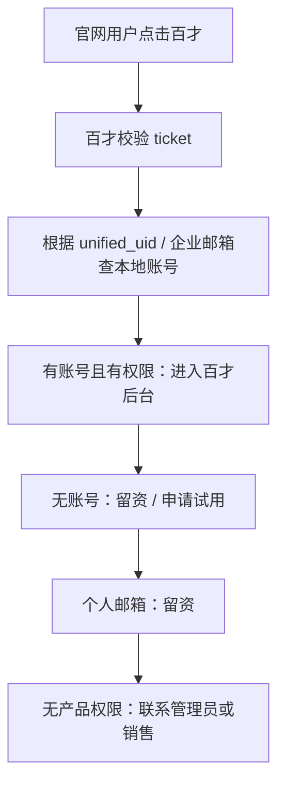
---


适用于百智、百工等产品。

流程：官网用户点击百才→百才校验ticket→根据unified_uid/企业邮箱查本地账号→有账号且有权限进入百才后台，无账号留资/申请试用，个人邮箱留资，无权限联系管理员或销售。适用于百智、百工等产品。

## 15.3 百才示例策略

百才建议配置：

```json
{
  "product_code": "baicai",
  "product_user_mode": "B",
  "legacy_login_keep": true,
  "allow_auto_create_user": false,
  "require_enterprise_email": true,
  "no_account_action": "lead_form",
  "default_role": "pending_user"
}

```

处理逻辑：


---


适用于百智、百工等产品。


## cluster-0085-personal enterprise processing

根据用户意图（个人/企业/已有企业账号/未开通企业/邀请制C端）对用户推荐不同的处理流程。

## 16.1 推荐处理

| 用户意图 | 处理 |
| --- | --- |
| 个人使用 | 可创建/绑定个人空间 |
| 企业使用 | 需要企业代码 / 企业邮箱 / 企业微信 |
| 已有企业账号 | 绑定 unified\_uid 后进入 |
| 未开通企业 | 留资 / 申请试用 |
| 邀请制 C 端 | 校验产品邀请码 |

---


## cluster-0086-baizhi config strategy

百智产品按照以下JSON键值对配置准入策略，控制产品行为。

## 16.2 百智示例策略

```json
{
  "product_code": "baizhi",
  "product_user_mode": "B+C",
  "legacy_login_keep": true,
  "allow_auto_create_user": true,
  "require_enterprise_code": true,
  "require_enterprise_email": true,
  "no_account_action": "select_personal_or_enterprise"
}

```
---


## cluster-0087-invite code principle

邀请码、推荐码属于产品业务准入机制，由产品生成和校验。统一认证中心只负责接收、保存、绑定到 login_ticket、返回给产品，不判断业务有效性。

## 17.1 原则

邀请码、推荐码属于产品业务准入机制，由产品生成和校验。

统一认证中心只负责：

1.  接收；
    
2.  保存；
    
3.  绑定到 login\_ticket；
    
4.  返回给产品；
    
5.  不判断业务有效性。
    

---


## cluster-0088-baigong invite code flow

## 17.2 百工邀请码场景

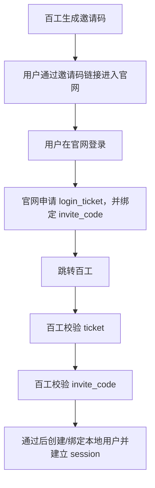
---


## cluster-0089-no invite code access

用户从官网普通入口点击百工进入邀请制产品但无邀请码时，根据百工策略分别处理：必须邀请码则提示需要邀请码，可申请邀请码则展示申请入口，可排队则加入候补名单，可体验则分配受限角色，不开放则提示暂未开放。

## 17.3 无邀请码访问邀请制产品

如果用户从官网普通入口点击百工，但没有邀请码：

| 百工策略 | 处理 |
| --- | --- |
| 必须邀请码 | 提示需要邀请码 |
| 可申请邀请码 | 展示申请入口 |
| 可排队 | 加入候补名单 |
| 可体验 | 分配受限角色 |
| 不开放 | 提示暂未开放 |

---


首期不强制各产品关闭原登录入口。

适用场景：

| 场景 | 是否可保留 |
| --- | --- |
| 企业管理员已分配账号密码 | 可保留 |
| 企业用户已收藏后台链接 | 可保留 |
| 产品自有 App / 小程序登录 | 可保留 |
| 邀请码登录 | 可保留 |
| 企业微信扫码 | 可保留 |
| 存量客户后台登录 | 可保留 |

说明：

官网统一认证中心首期主要承接：

*   官网入口；
    
*   品牌导流；
    
*   统一身份；
    
*   新增访问链路；
    
*   跨产品长期治理基础。
    

不强制一次性替代所有产品既有入口。

---

首期不强制各产品关闭原登录入口，允许保留企业管理员分配账号密码、企业用户收藏链接、产品自有App/小程序登录、邀请码登录、企业微信扫码、存量客户后台登录等原有入口。


## cluster-0090-third party bind interface

用于微信小程序、企业微信、支付宝等第三方身份与 unified_uid 的绑定或解析，请求方式为 POST /api/sso/identity/third-party/bind-or-resolve，携带 Bearer token 鉴权。v1.2 中为按需接口，不作为所有产品首期必接。

## 19.2 请求方式

```http
POST /api/sso/identity/third-party/bind-or-resolve
Content-Type: application/json
Authorization: Bearer {product_access_key}

```
---


## cluster-0091-third party bind interface

第三方身份绑定接口请求包含 provider、app_id、openid、unionid、phone、product_code、scene 等字段。

## 19.3 请求示例

```json
{
  "provider": "wechat",
  "app_id": "wx_xxx",
  "openid": "openid_xxx",
  "unionid": "unionid_xxx",
  "phone": "138xxxx8888",
  "product_code": "baicai",
  "scene": "mini_program_login"
}

```
---

响应返回 code、message、data（含 unified_uid、bind_status、is_new_unified_user）。

## 19.4 响应示例

```json
{
  "code": "SUCCESS",
  "message": "success",
  "data": {
    "unified_uid": "U10001",
    "bind_status": "bound",
    "is_new_unified_user": false
  }
}

```
---


## cluster-0092-identity match and session

身份匹配推荐使用组合判断，唯一命中时自动绑定，多命中时进入确认或人工处理流程。

产品不能直接将 login_ticket 作为登录态。产品必须在校验成功后自行创建本地 session。

推荐 session 内容包含以下字段：

## 19.5 身份匹配优先级

推荐顺序：

```text
1. unionid
2. openid + app_id
3. phone
4. email

```

不是简单四选一。 建议组合判断，唯一命中自动绑定，多命中进入确认或人工处理。

---


产品不能直接把 `login_ticket` 当作登录态。

产品必须在校验成功后自行创建本地 session。

推荐 session 内容：

| 字段 | 说明 |
| --- | --- |
| local\_user\_id | 产品本地用户 ID |
| unified\_uid | 官网统一 UID |
| local\_tenant\_id | 产品本地租户 |
| role | 产品内角色 |
| permissions | 产品内权限 |
| login\_source | official\_website\_sso |
| login\_time | 登录时间 |
| session\_expire\_time | 产品本地 session 过期时间 |

---


产品侧建议统一定义准入结果，方便前端提示、测试验收和跨团队沟通。

| code | 说明 | 建议提示 |
| --- | --- | --- |
| ACCESS\_GRANTED | 允许进入 | 正常进入产品 |
| NEED\_BINDING\_CONFIRM | 需要确认绑定 | 检测到已有账号，请确认绑定 |
| NEED\_ENTERPRISE\_EMAIL | 需要企业邮箱 | 请补充企业邮箱 |
| NEED\_ENTERPRISE\_CODE | 需要企业编码 | 请输入企业编码 |
| NEED\_INVITE\_CODE | 需要邀请码 | 当前产品需邀请码访问 |
| NEED\_TRIAL\_APPLY | 需要申请试用 | 请提交试用申请 |
| NEED\_CONTACT\_ADMIN | 需要联系企业管理员 | 请联系企业管理员开通 |
| NO\_PRODUCT\_PERMISSION | 无产品权限 | 当前账号暂无该产品权限 |
| ACCOUNT\_CONFLICT | 账号冲突 | 请联系客服处理 |
| LEGACY\_LOGIN\_REQUIRED | 请使用原入口 | 请使用企业管理员提供的产品入口 |
| PRODUCT\_NOT\_OPEN\_TO\_PUBLIC | 暂不开放 | 当前产品暂不开放自助注册 |
| ACCOUNT\_DISABLED | 账号禁用 | 当前账号不可用 |
| INTERNAL\_ERROR | 系统异常 | 请稍后重试 |

---

产品侧应统一定义准入结果 code、说明及建议提示，以方便前端提示、测试验收和跨团队沟通。

## 19.5 身份匹配优先级

推荐顺序：

```text
1. unionid
2. openid + app_id
3. phone
4. email

```

不是简单四选一。 建议组合判断，唯一命中自动绑定，多命中进入确认或人工处理。

---


产品不能直接把 `login_ticket` 当作登录态。

产品必须在校验成功后自行创建本地 session。

推荐 session 内容：

| 字段 | 说明 |
| --- | --- |
| local\_user\_id | 产品本地用户 ID |
| unified\_uid | 官网统一 UID |
| local\_tenant\_id | 产品本地租户 |
| role | 产品内角色 |
| permissions | 产品内权限 |
| login\_source | official\_website\_sso |
| login\_time | 登录时间 |
| session\_expire\_time | 产品本地 session 过期时间 |

---


产品侧建议统一定义准入结果，方便前端提示、测试验收和跨团队沟通。

| code | 说明 | 建议提示 |
| --- | --- | --- |
| ACCESS\_GRANTED | 允许进入 | 正常进入产品 |
| NEED\_BINDING\_CONFIRM | 需要确认绑定 | 检测到已有账号，请确认绑定 |
| NEED\_ENTERPRISE\_EMAIL | 需要企业邮箱 | 请补充企业邮箱 |
| NEED\_ENTERPRISE\_CODE | 需要企业编码 | 请输入企业编码 |
| NEED\_INVITE\_CODE | 需要邀请码 | 当前产品需邀请码访问 |
| NEED\_TRIAL\_APPLY | 需要申请试用 | 请提交试用申请 |
| NEED\_CONTACT\_ADMIN | 需要联系企业管理员 | 请联系企业管理员开通 |
| NO\_PRODUCT\_PERMISSION | 无产品权限 | 当前账号暂无该产品权限 |
| ACCOUNT\_CONFLICT | 账号冲突 | 请联系客服处理 |
| LEGACY\_LOGIN\_REQUIRED | 请使用原入口 | 请使用企业管理员提供的产品入口 |
| PRODUCT\_NOT\_OPEN\_TO\_PUBLIC | 暂不开放 | 当前产品暂不开放自助注册 |
| ACCOUNT\_DISABLED | 账号禁用 | 当前账号不可用 |
| INTERNAL\_ERROR | 系统异常 | 请稍后重试 |

---


## cluster-0093-logout notification

当用户从官网统一认证中心退出时，认证中心可通知已接入产品清理本地 session。首期不强制实现。

## 22.1 接口说明

当用户从官网统一认证中心退出时，认证中心可通知已接入产品清理本地 session。

首期不强制实现。

---


## cluster-0094-logout notification

用户登出时，统一认证中心向产品侧发送登出通知回调请求，产品侧必须处理该回调。请求方式为 POST。

## 22.2 请求方式

```http
POST {logout_callback_url}
Content-Type: application/json

```
---

## 22.3 请求示例

```json
{
  "product_code": "baigong",
  "unified_uid": "U10000001",
  "session_id": "S10000001",
  "logout_time": "2026-05-06T12:00:00+08:00",
  "reason": "user_logout"
}

```
---

## 22.4 产品侧处理

1.  根据 `unified_uid` 查询本地 session；
    
2.  清理当前用户本地登录态；
    
3.  记录登出日志；
    
4.  返回处理结果。
    

---

产品侧收到登出通知后，按以下步骤处理：根据 unified_uid 查询本地 session；清理当前用户本地登录态；记录登出日志；返回处理结果。


## cluster-0095-common error codes

认证中心定义了一套通用错误码，涵盖成功、票据无效/过期/已使用、产品配置无效/禁用、state不匹配、上下文无效/过期、用户冻结/不存在、限流、系统异常等场景，并给出对应的产品侧建议处理方式。

## 23.1 认证中心错误码

| 错误码 | 说明 | 产品侧建议处理 |
| --- | --- | --- |
| SUCCESS | 成功 | 正常处理 |
| TICKET\_INVALID | ticket 无效 | 重新发起登录 |
| TICKET\_EXPIRED | ticket 过期 | 重新发起登录 |
| TICKET\_USED | ticket 已使用 | 重新发起登录 |
| PRODUCT\_INVALID | product\_code 无效 | 检查接入配置 |
| PRODUCT\_DISABLED | 产品接入禁用 | 联系官网团队 |
| STATE\_INVALID | state 不匹配 | 重新发起登录 |
| CONTEXT\_INVALID | context\_id 无效 | 重新发起流程 |
| CONTEXT\_EXPIRED | context\_id 过期 | 重新生成上下文 |
| USER\_DISABLED | 用户被冻结 | 提示用户联系支持 |
| USER\_NOT\_FOUND | 用户不存在 | 重新登录或注册 |
| RATE\_LIMITED | 请求过于频繁 | 稍后重试 |
| INTERNAL\_ERROR | 系统异常 | 记录日志，稍后重试 |

---


## cluster-0096-product access error tips

## 23.2 产品侧准入错误建议

| 场景 | 建议提示 |
| --- | --- |
| 无本地账号且不允许创建 | 当前账号尚未开通该产品，请申请试用 |
| 多账号冲突 | 当前身份存在多个候选账号，请联系客服处理 |
| 无租户权限 | 当前账号未加入企业或企业未开通该产品 |
| 无角色权限 | 当前账号暂无访问权限，请联系管理员 |
| 缺少企业邮箱 | 请补充企业邮箱 |
| 缺少企业代码 | 请输入企业编码 |
| 邀请码无效 | 邀请码无效或已过期 |
| session 创建失败 | 登录异常，请稍后重试 |
| ticket 校验失败 | 登录态已失效，请重新登录 |

---


## cluster-0097-login ticket security

## 24.1 login\_ticket 安全要求

| 项目 | 要求 |
| --- | --- |
| 一次性 | 必须 |
| 短时效 | 3～5分钟 |
| 产品绑定 | 必须 |
| 用户绑定 | 必须 |
| 上下文绑定 | 必须 |
| 后端校验 | 必须 |
| 日志脱敏 | 必须 |
| URL 清理 | 建议 |
| HTTPS | 生产必须 |

---


## cluster-0098-biz context security

biz_context 安全要求：不建议在 URL 明文传递复杂上下文；邀请码等简单字段可作为上下文透传；复杂上下文使用 context_id；上下文应绑定 product_code；不允许跨产品使用；不允许产品校验 ticket 时临时提交上下文作为可信来源；认证中心只透传，不解释产品业务规则。

## 24.2 biz\_context 安全要求

1.  不建议在 URL 明文传递复杂上下文；
    
2.  邀请码等简单字段可作为上下文透传；
    
3.  复杂上下文使用 `context_id`；
    
4.  上下文应绑定 product\_code；
    
5.  不允许跨产品使用；
    
6.  不允许产品校验 ticket 时临时提交上下文作为可信来源；
    
7.  认证中心只透传，不解释产品业务规则。
    

---


## cluster-0099-key security

产品密钥不得写入前端代码、不得提交 Git、不得打印日志、按环境分开存储、泄露后必须支持轮换。

## 24.3 密钥安全要求

1.  产品密钥不得写入前端代码；
    
2.  不得提交 Git；
    
3.  不得打印日志；
    
4.  按环境分开；
    
5.  泄露后必须支持轮换。
    

---


## cluster-0100-integration prerequisites

## 25.1 联调前置条件

| 条件 | 责任方 |
| --- | --- |
| 产品接入配置表已填写 | 产品团队 |
| sso\_entry\_url 已提供 | 产品团队 |
| 产品后端可调用 ticket verify | 产品团队 |
| 产品本地映射逻辑已准备 | 产品团队 |
| 产品准入策略已确定 | 产品团队 |
| 官网认证中心配置 product\_code | 官网团队 |
| 测试账号已准备 | 双方 |
| 测试环境可访问 | 双方 |

---


## cluster-0101-integration steps

## 25.2 联调步骤

```text
1. 官网侧配置产品接入信息
2. 产品侧配置接入密钥
3. 用户在官网测试环境登录
4. 用户点击产品入口
5. 官网生成 login_ticket
6. 官网跳转产品 sso_entry_url
7. 产品接收 login_ticket
8. 产品后端校验 login_ticket
9. 产品拿到 UserInfo + account_status + biz_context
10. 产品查本地映射
11. 产品按准入策略处理
12. 产品创建本地 session
13. 用户进入产品或进入准入提示页
14. 双方确认日志、异常处理和安全要求

```
---


## cluster-0102-common acceptance

## 26.1 通用验收

| 验收项 | 标准 |
| --- | --- |
| 官网登录 | 用户可通过手机号 / 邮箱登录官网 |
| 官网跳产品 | 点击产品入口可跳转 |
| ticket 校验 | 产品后端可校验 ticket |
| UserInfo 获取 | 产品可获取 unified\_uid |
| account\_status | 产品能识别账号状态 |
| biz\_context | 产品可获取绑定上下文 |
| 本地映射 | 产品可建立 unified\_uid ↔ local\_user\_id |
| 本地 session | 产品可创建自己的登录态 |
| 免二次登录 | 用户无需再次输入产品账号密码 |
| 异常处理 | ticket 过期、无权限、冲突有提示 |

---


## cluster-0103-c product acceptance

C端产品验收标准：新用户可自动创建或进入产品指定流程；老用户可自动绑定或确认绑定；邀请制下无邀请码不可进入；用户可进入个人默认空间。

## 26.2 C 端产品验收

| 验收项 | 标准 |
| --- | --- |
| 新用户 | 可自动创建或进入产品指定流程 |
| 老用户 | 可自动绑定或确认绑定 |
| 邀请制 | 无邀请码不可进入 |
| 个人空间 | 可进入个人默认空间 |

---


## cluster-0104-b product acceptance

## 26.3 B 端产品验收

| 验收项 | 标准 |
| --- | --- |
| 已有账号 | 可绑定后进入 |
| 无账号 | 不自动开通，进入留资或申请 |
| 企业邮箱 | 可按产品策略校验 |
| 企业代码 | 可按产品策略校验 |
| 企业权限 | 由产品本地判断 |
| 原登录入口 | 可继续使用 |

---
