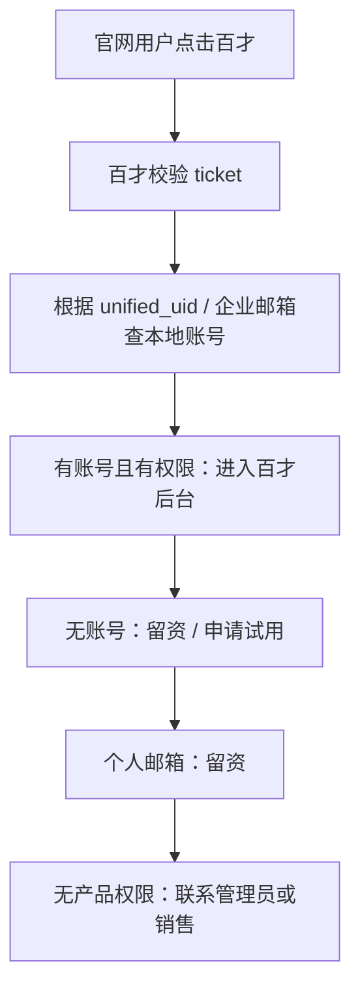
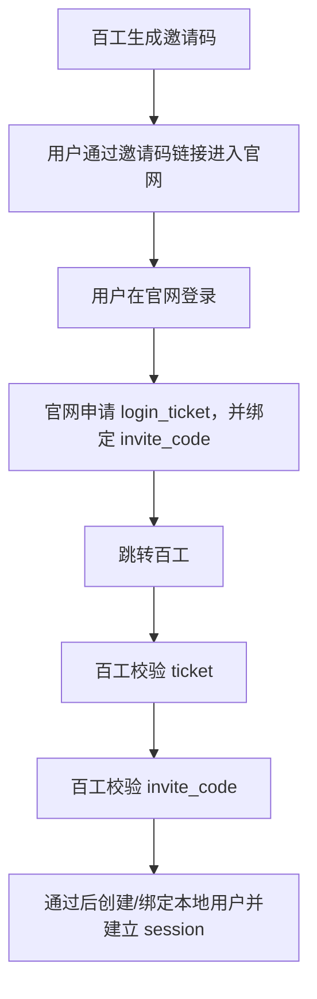

# 百系产品接入官网统一认证中心接口契约 v1.2

**版本**：v1.2 **适用范围**：新版百融官网统一认证中心与各百系产品系统接入 **定位**：对外给各百系产品研发、产品负责人、测试联调用的接口契约 **核心原则**：官网统一认证中心负责用户是谁，各产品负责用户进入产品后能做什么。

## 1. 文档目标

用于规范各百系产品接入新版官网统一认证中心的方式

## 2. 总体接入原则

### 2.1 官网统一认证中心负责

| 能力 | 说明 |
| --- | --- |
| 官网注册 | 手机号 / 邮箱注册 |
| 官网登录 | 手机号 / 邮箱登录 |
| 找回密码 | 手机号 / 邮箱找回 |
| 统一 UID | 为官网用户生成 `unified_uid` |
| 登录态 | 维护官网侧登录态 |
| login\_ticket | 签发一次性短效产品登录票据 |
| ticket 校验 | 产品后端通过 ticket 换取可信身份信息 |
| UserInfo | 返回统一身份基础信息 |
| account\_status | 返回官网统一账号状态 |
| biz\_context | 绑定并透传业务上下文 |
| 产品接入配置 | 管理产品编码、接入地址、白名单、密钥等 |
| 登录审计 | 记录官网侧认证和产品跳转审计 |

### 2.2 各产品继续负责

| 能力 | 说明 |
| --- | --- |
| 本地账号 | 产品自己的用户表、账号体系 |
| 本地 session | 产品自己的登录态 |
| 租户 | 企业租户、组织空间、个人空间 |
| 组织架构 | 部门、员工、企业成员 |
| 角色权限 | 管理员、普通用户、HR、专家、候选人等 |
| 菜单权限 | 产品内可见菜单 |
| 数据权限 | 产品内数据隔离 |
| 套餐/功能开通 | 企业购买了哪些模块 |
| 邀请码/推荐码 | 产品自己的准入和运营机制 |
| 企业代码/企业邮箱 | 产品自己的企业识别机制 |
| 产品内审批 | 申请试用、企业开通、管理员邀请 |
| 原登录入口 | 可按产品策略继续保留 |
| 产品内审计 | 业务操作日志和产品内安全审计 |

# 3. 首期推荐最小接入链路

为降低百系产品接入成本，首期采用 **login\_ticket + UserInfo + 本地 session** 的最小接入模式。

## 3.1 标准链路


# 4. 产品接入模式分类

各产品需要在接入前确认自己的产品用户模式。

## 4.1 产品用户模式

| 模式 | 说明 | 典型产品 |
| --- | --- | --- |
| C | 面向个人用户，可自助注册或使用 | 百工 C端、部分百智个人场景 |
| B | 面向企业客户，通常需企业租户、管理员开通、商务签约 | 百才、百察、百灵 |
| B+C | 同时支持个人和企业用户 | 百智、百工 |
| INVITE\_ONLY | 邀请制或灰度开放 | 百工当前 C 端邀请码场景 |
| UNKNOWN | 待确认 | 暂未完成摸底产品 |

---

## 4.2 不同模式的准入原则

| 产品模式 | 官网注册后是否可直接进入 | 推荐处理 |
| --- | --- | --- |
| C | 可以，若产品允许自动创建 | 自动创建或绑定本地账号 |
| B | 不建议直接进入 | 有本地账号和权限则进；否则留资/申请试用/联系管理员 |
| B+C | 视用户意图和产品策略分流 | 个人空间 / 企业空间 / 企业代码 / 企业邮箱 |
| INVITE\_ONLY | 不允许无邀请码直接进入 | 校验产品侧邀请码 |
| UNKNOWN | 不开放自动进入 | 默认引导留资或人工确认 |

---

# 5. 产品接入配置表

各产品接入前需填写以下信息。

| 字段 | 是否必填 | 示例 | 说明 |
| --- | --- | --- | --- |
| product\_code | 是 | baicai | 产品编码，全局唯一 |
| product\_name | 是 | 百才 | 产品中文名称 |
| product\_owner | 是 | 胡佩延 | 产品负责人 |
| tech\_owner | 是 | xxx | 技术负责人 |
| product\_user\_mode | 是 | B / C / B+C / INVITE\_ONLY | 产品用户模式 |
| product\_domain | 是 | [https://baicai.xxx.com](https://baicai.xxx.com) | 产品域名 |
| sso\_entry\_url | 是 | [https://baicai.xxx.com/sso/login](https://baicai.xxx.com/sso/login) | 产品接收 ticket 的入口 |
| allowed\_redirect\_domains | 是 | baicai.xxx.com | 允许回跳域名 |
| logout\_callback\_url | 否 | [https://baicai.xxx.com/sso/logout](https://baicai.xxx.com/sso/logout) | 登出回调 |
| legacy\_login\_keep | 是 | true | 是否保留原登录入口 |
| allow\_auto\_create\_user | 是 | false | 是否允许自动创建本地用户 |
| require\_enterprise\_email | 否 | true | 是否要求企业邮箱 |
| require\_enterprise\_code | 否 | true | 是否要求企业代码 |
| require\_invite\_code | 否 | true | 是否要求邀请码 |
| support\_default\_role | 是 | true / false | 是否支持默认角色 |
| default\_role | 否 | pending\_user | 默认角色 |
| no\_account\_action | 是 | lead\_form | 无本地账号时处理方式枚举：\[AUTO\_CREATE("AUTO\_CREATE", "自动创建本地账号（C 端推荐）"),<br>    GUIDE\_APPLY("GUIDE\_APPLY", "引导用户申请开通"),<br>    LEAD\_FORM("LEAD\_FORM", "跳转留资表单（B 端推荐）"),<br>    CONTACT\_ADMIN("CONTACT\_ADMIN", "提示联系企业管理员"),<br>    NEED\_INVITE\_CODE("NEED\_INVITE\_CODE", "邀请制产品，无邀请码不放行"),<br>    SELECT\_PERSONAL\_OR\_ENTERPRISE("SELECT\_PERSONAL\_OR\_ENTERPRISE", "B+C 产品，引导用户选择个人或企业身份");\] |
| support\_context\_register | 否 | true | 是否需要产品深链上下文预注册 |
| support\_third\_party\_bind | 否 | true | 是否需要微信/小程序身份绑定 |
| local\_user\_key | 是 | user\_id | 本地用户主键 |
| local\_tenant\_key | 否 | tenant\_id | 本地租户主键 |
| remark | 否 |  | 备注 |

---

# 6. 接口总览

| 序号 | 接口 | 方向 | 是否必须 | 说明 |
| --- | --- | --- | --- | --- |
| 1 | 产品接入配置登记 | 产品 → 官网团队 | 必须 | 产品提供接入配置 |
| 2 | 上下文预注册接口 | 产品 → 认证中心 | 按需 | 产品深链、小程序、邀请链接场景 |
| 3 | login\_ticket 生成接口 | 官网 → 认证中心 | 必须 | 官网申请产品登录票据 |
| 4 | 官网跳转产品入口 | 官网 → 产品 | 必须 | 携带 login\_ticket + state |
| 5 | login\_ticket 校验接口 | 产品后端 → 认证中心 | 必须 | 产品后端校验 ticket |
| 6 | UserInfo 返回结构 | 认证中心 → 产品 | 必须 | 返回统一身份信息 |
| 7 | 产品本地映射 | 产品内部 | 必须 | 维护 unified\_uid ↔ local\_user\_id |
| 8 | 产品本地 session | 产品内部 | 必须 | 产品自行创建登录态 |
| 9 | 产品准入结果枚举 | 产品内部 / 对前端 | 建议 | 统一处理 B/C 差异 |
| 10 | 第三方身份绑定接口 | 产品 → 认证中心 | 二期/按需 | 微信小程序等场景 |
| 11 | 登出回调接口 | 认证中心 → 产品 | 可选 | 后续全局登出 |
| 12 | 用户状态同步接口 | 认证中心 → 产品 | 二期 | 冻结/注销/禁用同步 |

# 7. 接口一：上下文预注册接口

## 7.1 接口说明

用于产品深链、面试链接、专家邀请、小程序跳转等场景。

当用户不是从官网普通入口进入，而是先访问产品业务链接时，产品可先把业务上下文注册到统一认证中心，认证中心返回 `context_id`，后续官网使用 `context_id` 申请 `login_ticket`。

适用场景：

| 场景 | 示例 |
| --- | --- |
| 百才面试链接 | job\_id、company\_id、hr\_id |
| 百鉴专家邀请 | invite\_code、expert\_scene |
| 百工邀请码 | invite\_code、private\_beta |
| 小程序跳转 | scene、target\_path |
| 活动落地页 | campaign、channel |

---

## 7.2 请求方式

```http
POST /api/sso/context/register
Content-Type: application/json
Authorization: Bearer {product_access_key}

```
---

## 7.3 请求示例

```json
{
  "product_code": "baicai",
  "scene": "interview_invite",
  "return_url": "/interview/detail",
  "biz_context": {
    "job_id": "J001",
    "company_id": "C001",
    "hr_id": "H001"
  },
  "expire_minutes": 30
}

```
---

## 7.4 请求字段说明

| 字段 | 是否必填 | 说明 |
| --- | --- | --- |
| product\_code | 是 | 产品编码 |
| scene | 是 | 业务场景 |
| return\_url | 是 | 登录后目标页 |
| biz\_context | 否 | 业务上下文 |
| expire\_minutes | 否 | 上下文有效期，默认 30 分钟 |

---

## 7.5 响应示例

```json
{
  "code": "SUCCESS",
  "message": "success",
  "data": {
    "context_id": "CTX_abc123",
    "login_url": "https://www.brgroup.com/login?product\_code=baicai&context\_id=CTX\_abc123",
    "expires_at": "2026-05-06T10:30:00+08:00"
  }
}

```
---

## 7.6 设计约束

1.  `context_id` 短时有效；
    
2.  `context_id` 绑定 `product_code`；
    
3.  `context_id` 不能跨产品复用；
    
4.  `biz_context` 不承载敏感明文；
    
5.  复杂上下文建议用 `context_id`，不要全部放 URL；
    
6.  认证中心只保存和返回上下文，不解释产品业务含义。
    

---

# 8. 接口二：login\_ticket 生成接口

## 8.1 接口说明

用户在官网已登录后，官网向统一认证中心申请产品登录票据。

该接口通常由官网服务端调用，不直接暴露给产品前端。

---

## 8.2 请求方式

```http
POST /api/sso/ticket/create
Content-Type: application/json
Authorization: Bearer {website_access_key}

```
---

## 8.3 请求示例：普通官网产品入口

```json
{
  "product_code": "baigong",
  "state": "STATE_xxx",
  "return_url": "/",
  "source": "official_website",
  "biz_context": {
    "scene": "homepage_product_card",
    "campaign": "homepage_baigong_card"
  }
}

```
---

## 8.4 请求示例：邀请码场景

```json
{
  "product_code": "baigong",
  "state": "STATE_xxx",
  "return_url": "/",
  "source": "official_website",
  "biz_context": {
    "scene": "baigong_invite",
    "invite_code": "BG202604001",
    "invite_source": "baigong"
  }
}

```
---

## 8.5 请求示例：使用 context\_id

```json
{
  "product_code": "baicai",
  "state": "STATE_xxx",
  "context_id": "CTX_abc123",
  "source": "official_website"
}

```
---

## 8.6 请求字段说明

| 字段 | 是否必填 | 说明 |
| --- | --- | --- |
| product\_code | 是 | 目标产品编码 |
| state | 是 | 防 CSRF / 防串流程 |
| return\_url | 否 | 登录后产品内目标地址 |
| source | 否 | 来源 |
| campaign | 否 | 营销活动 |
| biz\_context | 否 | 简单上下文 |
| context\_id | 否 | 已预注册上下文 ID |

说明：

`biz_context` 与 `context_id` 可二选一。复杂业务场景推荐使用 `context_id`。

---

## 8.7 响应示例

```json
{
  "code": "SUCCESS",
  "message": "success",
  "data": {
    "login_ticket": "LTK_8f7a9c1e2b3d",
    "state": "STATE_xxx",
    "sso_entry_url": "https://baigong.xxx.com/sso/login",
    "expires_at": "2026-05-06T10:05:00+08:00"
  }
}

```
---

## 8.8 票据绑定规则

`login_ticket` 生成时必须绑定：

| 绑定项 | 说明 |
| --- | --- |
| product\_code | 指定产品 |
| unified\_uid | 当前官网登录用户 |
| state | 当前跳转流程 |
| return\_url | 登录后目标地址 |
| biz\_context/context\_id | 业务上下文 |
| expires\_at | 过期时间 |
| used\_status | 是否已使用 |

---

# 9. 接口三：官网跳转产品入口

## 9.1 接口说明

官网拿到 `login_ticket` 后，跳转至产品提供的 `sso_entry_url`。

---

## 9.2 请求方式

```http
GET {sso_entry_url}?login_ticket={login_ticket}&state={state}&source=official_website

```
---

## 9.3 示例

```http
GET https://baigong.xxx.com/sso/login?login\_ticket=LTK\_8f7a9c1e2b3d&state=STATE\_xxx&source=official\_website

```
---

## 9.4 请求参数

| 参数 | 是否必填 | 说明 |
| --- | --- | --- |
| login\_ticket | 是 | 一次性登录票据 |
| state | 是 | 防 CSRF / 防串流程 |
| source | 否 | 来源标识 |

注意：

不建议在 URL 中直接携带完整 `biz_context`。 `return_url` 和 `biz_context` 应在 `login_ticket` 生成阶段绑定，产品校验 ticket 后由认证中心返回。

---

## 9.5 产品侧处理要求

产品收到请求后必须：

1.  不直接信任 `login_ticket`；
    
2.  将 `login_ticket` 发送到产品后端；
    
3.  产品后端调用 ticket 校验接口；
    
4.  校验成功后获取 `UserInfo + account_status + biz_context`；
    
5.  产品按本地策略判断是否允许进入；
    
6.  产品创建本地 session；
    
7.  清理 URL 中的 `login_ticket`，避免泄露。
    

---

# 10. 接口四：login\_ticket 校验接口

## 10.1 接口说明

产品后端使用 `login_ticket` 调用官网统一认证中心，换取可信用户身份信息。

该接口必须由产品后端调用，不允许产品前端直接调用。

---

## 10.2 请求方式

```http
POST /api/sso/ticket/verify
Content-Type: application/json
Authorization: Bearer {product_access_key}

```
---

## 10.3 请求示例

```json
{
  "product_code": "baigong",
  "login_ticket": "LTK_8f7a9c1e2b3d",
  "state": "STATE_xxx",
  "nonce": "N_xxx",
  "timestamp": 1770000000000
}

```
---

## 10.4 请求字段说明

| 字段 | 是否必填 | 说明 |
| --- | --- | --- |
| product\_code | 是 | 产品编码 |
| login\_ticket | 是 | 一次性登录票据 |
| state | 是 | 与跳转时一致 |
| nonce | 建议 | 防重放随机串 |
| timestamp | 建议 | 请求时间戳 |

---

## 10.5 不建议由产品在校验时提交的字段

| 字段 | 原因 |
| --- | --- |
| return\_url | 应在 ticket 生成阶段绑定 |
| biz\_context | 应在 ticket 生成阶段绑定 |
| invite\_code | 应作为 biz\_context 绑定或通过 context\_id 保存 |
| job\_id/company\_id/hr\_id | 应通过 context\_id 保存 |
| product\_user\_mode | 来自产品配置，不应由前端临时传 |

---

## 10.6 响应示例：成功

```json
{
  "code": "SUCCESS",
  "message": "success",
  "data": {
    "verified": true,
    "ticket_status": "used",
    "account_status": "ACTIVE",
    "user_info": {
      "unified_uid": "U10000001",
      "user_type": "UNKNOWN",
      "phone": "138****8888",
      "phone_verified": true,
      "email": "user@example.com",
      "email_verified": true,
      "nickname": "张三",
      "avatar": "https://static.brgroup.com/avatar/default.png",
      "register_source": "official_website",
      "identity_contexts": [
        {
          "type": "personal",
          "default": true
        }
      ]
    },
    "product_context": {
      "product_code": "baigong",
      "product_user_mode": "INVITE_ONLY",
      "entry_scene": "homepage_product_entry"
    },
    "return_url": "/",
    "biz_context": {
      "scene": "baigong_invite",
      "invite_code": "BG202604001",
      "invite_source": "baigong"
    },
    "issued_at": "2026-05-06T10:00:00+08:00",
    "expires_at": "2026-05-06T10:05:00+08:00"
  }
}

```
---

## 10.7 响应示例：失败

```json
{
  "code": "TICKET_EXPIRED",
  "message": "login_ticket 已过期",
  "data": {
    "verified": false
  }
}

```
---

## 10.8 票据规则

| 规则 | 要求 |
| --- | --- |
| 一次性 | 只能使用一次 |
| 短时效 | 建议 3～5 分钟 |
| 产品绑定 | 只能被指定 product\_code 使用 |
| 用户绑定 | 绑定生成时的 unified\_uid |
| 上下文绑定 | 绑定 return\_url / biz\_context / context\_id |
| 后端校验 | 只能由产品后端调用 |
| 不可复用 | 校验成功后立即置为 used |
| 不可长期保存 | 产品侧不应长期保存 |
| 不可作为 session | 产品必须自行创建本地 session |

---

# 11. UserInfo 用户信息结构

## 11.1 字段定义

```json
{
  "unified_uid": "U10000001",
  "user_type": "UNKNOWN",
  "phone": "138****8888",
  "phone_verified": true,
  "email": "user@example.com",
  "email_verified": true,
  "nickname": "张三",
  "avatar": "https://static.brgroup.com/avatar/default.png",
  "register_source": "official_website",
  "identity_contexts": [
    {
      "type": "personal",
      "default": true
    }
  ]
}

```
---

## 11.2 字段说明

| 字段 | 是否必返 | 说明 |
| --- | --- | --- |
| unified\_uid | 是 | 官网统一认证中心全局用户 ID |
| user\_type | 是 | UNKNOWN / C / B / B+C，仅作参考，不作为产品权限判断 |
| phone | 否 | 脱敏手机号 |
| phone\_verified | 否 | 手机号是否已验证 |
| email | 否 | 邮箱 |
| email\_verified | 否 | 邮箱是否已验证 |
| nickname | 否 | 昵称 |
| avatar | 否 | 头像 |
| register\_source | 是 | 注册来源 |
| identity\_contexts | 否 | 身份上下文 |

---

## 11.3 关于 user\_type

`user_type` 只是统一认证中心侧的基础判断或参考值，不代表用户在某产品内一定拥有 B 端或 C 端权限。

例如：

```text
官网注册用户 user_type = UNKNOWN 或 C
点击百才后，不代表他可以使用百才 B 端后台。
百才仍需根据本地租户、企业邮箱、企业账号、功能开通判断。

```
---

## 11.4 关于手机号与邮箱

1.  默认返回脱敏手机号；
    
2.  产品如需完整手机号/邮箱用于绑定，需在接入配置中申请；
    
3.  完整手机号和邮箱按最小必要原则返回；
    
4.  产品侧日志不得打印完整手机号、邮箱；
    
5.  对百才这类要求企业邮箱的产品，是否企业邮箱由产品侧判断。
    

---

# 12. biz\_context 业务上下文

## 12.1 设计目的

`biz_context` 用于解决：

*   邀请码；
    
*   推荐码；
    
*   专家邀请；
    
*   百工灰度准入；
    
*   百才面试链接；
    
*   小程序场景；
    
*   活动来源；
    
*   登录后目标页恢复；
    
*   产品深链参数防丢。
    

---

## 12.2 示例：百工邀请码

```json
{
  "scene": "baigong_invite",
  "invite_code": "BG202604001",
  "invite_source": "baigong",
  "campaign": "private_beta"
}

```

说明：

邀请码由百工生成，百工校验。 统一认证中心只负责保存和透传，不判断邀请码有效性。

---

## 12.3 示例：百鉴专家推荐码

```json
{
  "scene": "expert_invite",
  "invite_code": "EXP123",
  "referrer_id": "R001"
}

```
---

## 12.4 示例：百才面试链接

```json
{
  "scene": "interview_invite",
  "job_id": "J001",
  "company_id": "C001",
  "hr_id": "H001"
}

```
---

## 12.5 安全原则

1.  简单上下文可放 `biz_context`；
    
2.  复杂上下文建议通过 `context_id` 预注册；
    
3.  上下文应在 `login_ticket` 生成阶段绑定；
    
4.  产品校验 ticket 时不应重新提交上下文作为可信来源；
    
5.  认证中心不解释产品业务含义；
    
6.  产品负责最终业务校验。
    

---

# 13. 产品本地账号映射要求

## 13.1 是否必须建立映射

通过官网统一认证中心进入产品的用户，建议都建立或复用映射：

```text
unified_uid ↔ local_user_id

```

原因：

1.  支持免二次登录；
    
2.  避免每次用手机号/邮箱重新猜测用户；
    
3.  支持老用户绑定；
    
4.  支持手机号、邮箱、微信等多登录方式未来统一；
    
5.  支持产品侧审计；
    
6.  支持后续账号状态治理。
    

---

## 13.2 推荐映射字段

| 字段 | 是否建议 | 说明 |
| --- | --- | --- |
| id | 是 | 主键 |
| product\_code | 是 | 产品编码 |
| unified\_uid | 是 | 统一 UID |
| local\_user\_id | 是 | 产品本地用户 ID |
| local\_tenant\_id | 可选 | 产品本地租户 ID |
| bind\_type | 是 | auto / manual / created / invite / enterprise |
| bind\_status | 是 | bound / pending / conflict / disabled |
| bind\_source | 是 | official\_website\_sso |
| first\_bind\_time | 是 | 首次绑定时间 |
| last\_login\_time | 是 | 最近登录时间 |
| created\_at | 是 | 创建时间 |
| updated\_at | 是 | 更新时间 |

---

## 13.3 首次进入处理规则

产品拿到 UserInfo 后建议：

```text
1. 按 unified_uid 查本地映射
2. 若已有映射：直接建立本地 session
3. 若无映射：按手机号 / 邮箱 / 企业标识 / openid / unionid 查询本地用户
4. 若唯一命中：自动绑定或提示确认绑定
5. 若未命中：按产品策略创建本地账号或提示申请开通
6. 若多账号冲突：进入人工处理

```
---

# 14. C 端产品处理建议

适用于可面向个人开放使用的产品。

| 场景 | 建议 |
| --- | --- |
| 新用户首次进入 | 可自动创建本地账号 |
| 老用户手机号唯一命中 | 可自动绑定 |
| 老用户邮箱唯一命中 | 可自动绑定或确认绑定 |
| 多账号命中 | 人工处理 |
| 邀请制产品 | 必须校验邀请码 |
| 无权限 | 提示申请开通或联系支持 |

---

# 15. B 端产品处理建议

适用于百才、百察、百灵等强 To B 产品。

## 15.1 核心原则

官网注册/登录只代表完成统一身份认证，不代表自动开通 B 端产品权限。

B 端产品必须继续由产品侧判断：

*   是否已有本地账号；
    
*   是否属于企业租户；
    
*   是否有产品权限；
    
*   是否开通对应功能模块；
    
*   是否需要企业管理员邀请；
    
*   是否需要企业邮箱；
    
*   是否需要企业代码；
    
*   是否需要商务开通。
    

---

## 15.2 推荐处理规则

| 场景 | 建议 |
| --- | --- |
| 已有本地账号和权限 | 进入产品 |
| 有账号但无租户 | 提示选择企业或联系管理员 |
| 有租户但无产品授权 | 提示产品未开通 |
| 新企业客户 | 走申请试用 / 留资 / 商务开通 |
| 企业成员 | 由企业管理员邀请或产品侧授权 |
| 多企业身份 | 进入产品侧身份选择页 |
| 个人邮箱访问 | 可进入留资页 |
| 企业邮箱命中 | 产品侧判断是否属于已开通企业 |
| 原后台登录入口 | 首期可保留 |

---

## 15.3 百才示例策略

百才建议配置：

```json
{
  "product_code": "baicai",
  "product_user_mode": "B",
  "legacy_login_keep": true,
  "allow_auto_create_user": false,
  "require_enterprise_email": true,
  "no_account_action": "lead_form",
  "default_role": "pending_user"
}

```

处理逻辑：


---

# 16. B+C 产品处理建议

适用于百智、百工等产品。

## 16.1 推荐处理

| 用户意图 | 处理 |
| --- | --- |
| 个人使用 | 可创建/绑定个人空间 |
| 企业使用 | 需要企业代码 / 企业邮箱 / 企业微信 |
| 已有企业账号 | 绑定 unified\_uid 后进入 |
| 未开通企业 | 留资 / 申请试用 |
| 邀请制 C 端 | 校验产品邀请码 |

---

## 16.2 百智示例策略

```json
{
  "product_code": "baizhi",
  "product_user_mode": "B+C",
  "legacy_login_keep": true,
  "allow_auto_create_user": true,
  "require_enterprise_code": true,
  "require_enterprise_email": true,
  "no_account_action": "select_personal_or_enterprise"
}

```
---

# 17. 邀请码 / 推荐码处理规则

## 17.1 原则

邀请码、推荐码属于产品业务准入机制，由产品生成和校验。

统一认证中心只负责：

1.  接收；
    
2.  保存；
    
3.  绑定到 login\_ticket；
    
4.  返回给产品；
    
5.  不判断业务有效性。
    

---

## 17.2 百工邀请码场景


---

## 17.3 无邀请码访问邀请制产品

如果用户从官网普通入口点击百工，但没有邀请码：

| 百工策略 | 处理 |
| --- | --- |
| 必须邀请码 | 提示需要邀请码 |
| 可申请邀请码 | 展示申请入口 |
| 可排队 | 加入候补名单 |
| 可体验 | 分配受限角色 |
| 不开放 | 提示暂未开放 |

---

# 18. 原产品登录入口保留策略

首期不强制各产品关闭原登录入口。

适用场景：

| 场景 | 是否可保留 |
| --- | --- |
| 企业管理员已分配账号密码 | 可保留 |
| 企业用户已收藏后台链接 | 可保留 |
| 产品自有 App / 小程序登录 | 可保留 |
| 邀请码登录 | 可保留 |
| 企业微信扫码 | 可保留 |
| 存量客户后台登录 | 可保留 |

说明：

官网统一认证中心首期主要承接：

*   官网入口；
    
*   品牌导流；
    
*   统一身份；
    
*   新增访问链路；
    
*   跨产品长期治理基础。
    

不强制一次性替代所有产品既有入口。

---

# 19. 第三方身份绑定接口（二期 / 按需）

## 19.1 接口说明

用于微信小程序、企业微信、支付宝等第三方身份与 `unified_uid` 的绑定或解析。

v1.2 中定义为按需接口，不作为所有产品首期必接。

---

## 19.2 请求方式

```http
POST /api/sso/identity/third-party/bind-or-resolve
Content-Type: application/json
Authorization: Bearer {product_access_key}

```
---

## 19.3 请求示例

```json
{
  "provider": "wechat",
  "app_id": "wx_xxx",
  "openid": "openid_xxx",
  "unionid": "unionid_xxx",
  "phone": "138xxxx8888",
  "product_code": "baicai",
  "scene": "mini_program_login"
}

```
---

## 19.4 响应示例

```json
{
  "code": "SUCCESS",
  "message": "success",
  "data": {
    "unified_uid": "U10001",
    "bind_status": "bound",
    "is_new_unified_user": false
  }
}

```
---

## 19.5 身份匹配优先级

推荐顺序：

```text
1. unionid
2. openid + app_id
3. phone
4. email

```

不是简单四选一。 建议组合判断，唯一命中自动绑定，多命中进入确认或人工处理。

---

# 20. 产品侧本地 Session 建立要求

产品不能直接把 `login_ticket` 当作登录态。

产品必须在校验成功后自行创建本地 session。

推荐 session 内容：

| 字段 | 说明 |
| --- | --- |
| local\_user\_id | 产品本地用户 ID |
| unified\_uid | 官网统一 UID |
| local\_tenant\_id | 产品本地租户 |
| role | 产品内角色 |
| permissions | 产品内权限 |
| login\_source | official\_website\_sso |
| login\_time | 登录时间 |
| session\_expire\_time | 产品本地 session 过期时间 |

---

# 21. 产品准入结果枚举

产品侧建议统一定义准入结果，方便前端提示、测试验收和跨团队沟通。

| code | 说明 | 建议提示 |
| --- | --- | --- |
| ACCESS\_GRANTED | 允许进入 | 正常进入产品 |
| NEED\_BINDING\_CONFIRM | 需要确认绑定 | 检测到已有账号，请确认绑定 |
| NEED\_ENTERPRISE\_EMAIL | 需要企业邮箱 | 请补充企业邮箱 |
| NEED\_ENTERPRISE\_CODE | 需要企业编码 | 请输入企业编码 |
| NEED\_INVITE\_CODE | 需要邀请码 | 当前产品需邀请码访问 |
| NEED\_TRIAL\_APPLY | 需要申请试用 | 请提交试用申请 |
| NEED\_CONTACT\_ADMIN | 需要联系企业管理员 | 请联系企业管理员开通 |
| NO\_PRODUCT\_PERMISSION | 无产品权限 | 当前账号暂无该产品权限 |
| ACCOUNT\_CONFLICT | 账号冲突 | 请联系客服处理 |
| LEGACY\_LOGIN\_REQUIRED | 请使用原入口 | 请使用企业管理员提供的产品入口 |
| PRODUCT\_NOT\_OPEN\_TO\_PUBLIC | 暂不开放 | 当前产品暂不开放自助注册 |
| ACCOUNT\_DISABLED | 账号禁用 | 当前账号不可用 |
| INTERNAL\_ERROR | 系统异常 | 请稍后重试 |

---

# 22. 登出回调接口（可选 / 二期）

## 22.1 接口说明

当用户从官网统一认证中心退出时，认证中心可通知已接入产品清理本地 session。

首期不强制实现。

---

## 22.2 请求方式

```http
POST {logout_callback_url}
Content-Type: application/json

```
---

## 22.3 请求示例

```json
{
  "product_code": "baigong",
  "unified_uid": "U10000001",
  "session_id": "S10000001",
  "logout_time": "2026-05-06T12:00:00+08:00",
  "reason": "user_logout"
}

```
---

## 22.4 产品侧处理

1.  根据 `unified_uid` 查询本地 session；
    
2.  清理当前用户本地登录态；
    
3.  记录登出日志；
    
4.  返回处理结果。
    

---

# 23. 错误码规范

## 23.1 认证中心错误码

| 错误码 | 说明 | 产品侧建议处理 |
| --- | --- | --- |
| SUCCESS | 成功 | 正常处理 |
| TICKET\_INVALID | ticket 无效 | 重新发起登录 |
| TICKET\_EXPIRED | ticket 过期 | 重新发起登录 |
| TICKET\_USED | ticket 已使用 | 重新发起登录 |
| PRODUCT\_INVALID | product\_code 无效 | 检查接入配置 |
| PRODUCT\_DISABLED | 产品接入禁用 | 联系官网团队 |
| STATE\_INVALID | state 不匹配 | 重新发起登录 |
| CONTEXT\_INVALID | context\_id 无效 | 重新发起流程 |
| CONTEXT\_EXPIRED | context\_id 过期 | 重新生成上下文 |
| USER\_DISABLED | 用户被冻结 | 提示用户联系支持 |
| USER\_NOT\_FOUND | 用户不存在 | 重新登录或注册 |
| RATE\_LIMITED | 请求过于频繁 | 稍后重试 |
| INTERNAL\_ERROR | 系统异常 | 记录日志，稍后重试 |

---

## 23.2 产品侧准入错误建议

| 场景 | 建议提示 |
| --- | --- |
| 无本地账号且不允许创建 | 当前账号尚未开通该产品，请申请试用 |
| 多账号冲突 | 当前身份存在多个候选账号，请联系客服处理 |
| 无租户权限 | 当前账号未加入企业或企业未开通该产品 |
| 无角色权限 | 当前账号暂无访问权限，请联系管理员 |
| 缺少企业邮箱 | 请补充企业邮箱 |
| 缺少企业代码 | 请输入企业编码 |
| 邀请码无效 | 邀请码无效或已过期 |
| session 创建失败 | 登录异常，请稍后重试 |
| ticket 校验失败 | 登录态已失效，请重新登录 |

---

# 24. 安全要求

## 24.1 login\_ticket 安全要求

| 项目 | 要求 |
| --- | --- |
| 一次性 | 必须 |
| 短时效 | 3～5分钟 |
| 产品绑定 | 必须 |
| 用户绑定 | 必须 |
| 上下文绑定 | 必须 |
| 后端校验 | 必须 |
| 日志脱敏 | 必须 |
| URL 清理 | 建议 |
| HTTPS | 生产必须 |

---

## 24.2 biz\_context 安全要求

1.  不建议在 URL 明文传递复杂上下文；
    
2.  邀请码等简单字段可作为上下文透传；
    
3.  复杂上下文使用 `context_id`；
    
4.  上下文应绑定 product\_code；
    
5.  不允许跨产品使用；
    
6.  不允许产品校验 ticket 时临时提交上下文作为可信来源；
    
7.  认证中心只透传，不解释产品业务规则。
    

---

## 24.3 密钥安全要求

1.  产品密钥不得写入前端代码；
    
2.  不得提交 Git；
    
3.  不得打印日志；
    
4.  按环境分开；
    
5.  泄露后必须支持轮换。
    

---

# 25. 联调流程

## 25.1 联调前置条件

| 条件 | 责任方 |
| --- | --- |
| 产品接入配置表已填写 | 产品团队 |
| sso\_entry\_url 已提供 | 产品团队 |
| 产品后端可调用 ticket verify | 产品团队 |
| 产品本地映射逻辑已准备 | 产品团队 |
| 产品准入策略已确定 | 产品团队 |
| 官网认证中心配置 product\_code | 官网团队 |
| 测试账号已准备 | 双方 |
| 测试环境可访问 | 双方 |

---

## 25.2 联调步骤

```text
1. 官网侧配置产品接入信息
2. 产品侧配置接入密钥
3. 用户在官网测试环境登录
4. 用户点击产品入口
5. 官网生成 login_ticket
6. 官网跳转产品 sso_entry_url
7. 产品接收 login_ticket
8. 产品后端校验 login_ticket
9. 产品拿到 UserInfo + account_status + biz_context
10. 产品查本地映射
11. 产品按准入策略处理
12. 产品创建本地 session
13. 用户进入产品或进入准入提示页
14. 双方确认日志、异常处理和安全要求

```
---

# 26. 验收标准

## 26.1 通用验收

| 验收项 | 标准 |
| --- | --- |
| 官网登录 | 用户可通过手机号 / 邮箱登录官网 |
| 官网跳产品 | 点击产品入口可跳转 |
| ticket 校验 | 产品后端可校验 ticket |
| UserInfo 获取 | 产品可获取 unified\_uid |
| account\_status | 产品能识别账号状态 |
| biz\_context | 产品可获取绑定上下文 |
| 本地映射 | 产品可建立 unified\_uid ↔ local\_user\_id |
| 本地 session | 产品可创建自己的登录态 |
| 免二次登录 | 用户无需再次输入产品账号密码 |
| 异常处理 | ticket 过期、无权限、冲突有提示 |

---

## 26.2 C 端产品验收

| 验收项 | 标准 |
| --- | --- |
| 新用户 | 可自动创建或进入产品指定流程 |
| 老用户 | 可自动绑定或确认绑定 |
| 邀请制 | 无邀请码不可进入 |
| 个人空间 | 可进入个人默认空间 |

---

## 26.3 B 端产品验收

| 验收项 | 标准 |
| --- | --- |
| 已有账号 | 可绑定后进入 |
| 无账号 | 不自动开通，进入留资或申请 |
| 企业邮箱 | 可按产品策略校验 |
| 企业代码 | 可按产品策略校验 |
| 企业权限 | 由产品本地判断 |
| 原登录入口 | 可继续使用 |

---
