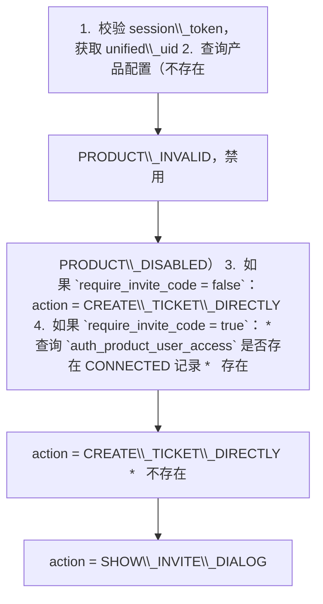
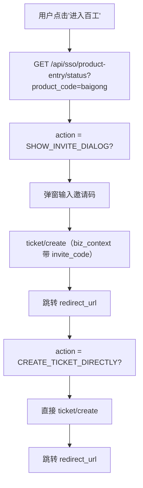
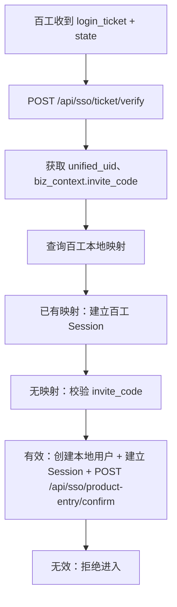

# SSO 产品进入状态接口 v1.0

> **说明**：为前端判断是否弹邀请码，为产品后端回写首次接入状态

---

## 一、背景

百工等邀请制产品需要前端在用户点击"进入产品"时判断是否弹出邀请码弹窗。认证中心维护轻量状态：某个 unified\_uid 是否已完成某个 product\_code 的首次接入。

**职责边界**：

*   认证中心：维护首次接入状态（CONNECTED / NOT\_CONNECTED）
    
*   产品侧：校验邀请码有效性、维护本地账号、角色、权限
    

---

## 二、接口一：查询产品进入状态 $\color{#0089FF}{@刘凯(刘凯(前端研发部/前端二组))}$ 

### 请求

| 字段 | 值 |
| --- | --- |
| 方法 | GET |
| 路径 | `/api/sso/product-entry/status` |
| 认证 | `Authorization: Bearer {session_token}`（官网登录用户） |
| 参数 | `product_code`（query string，必填） |

### 业务逻辑



### 成功响应：需要弹邀请码

```json
{
  "code": "SUCCESS",
  "data": {
    "product_code": "baigong",
    "product_name": "百工",
    "require_invite_code": true,
    "invite_required_for_current_user": true,
    "access_status": "NOT_CONNECTED",
    "action": "SHOW_INVITE_DIALOG",
    "sso_entry_url": "https://saibotan-pre.100credit.cn/login"
  }
}

```

### 成功响应：不需要弹邀请码

```json
{
  "code": "SUCCESS",
  "data": {
    "product_code": "baigong",
    "product_name": "百工",
    "require_invite_code": true,
    "invite_required_for_current_user": false,
    "access_status": "CONNECTED",
    "action": "CREATE_TICKET_DIRECTLY",
    "sso_entry_url": "https://saibotan-pre.100credit.cn/login"
  }
}

```

### 错误码

| 错误码 | 说明 |
| --- | --- |
| SESSION\_INVALID | 未登录或 session 过期 |
| PRODUCT\_INVALID | 产品不存在 |
| PRODUCT\_DISABLED | 产品已禁用 |
| PARAM\_INVALID | product\_code 为空 |

---

## 三、接口二：确认产品首次接入 $\color{#0089FF}{@刘辉}$ 

### 请求

| 字段 | 值 |
| --- | --- |
| 方法 | POST |
| 路径 | `/api/sso/product-entry/confirm` |
| 认证 | `Authorization: Bearer {product_access_key}`（产品后端） |
| Content-Type | `application/json` |

### 请求体

```json
{
  "product_code": "baigong",
  "unified_uid": "{unified_uid}",
  "access_status": "CONNECTED",
  "bind_source": "INVITE_CODE"
}

```

| 字段 | 类型 | 必须 | 说明 |
| --- | --- | --- | --- |
| `product_code` | string | ✅ | 产品编码 |
| `unified_uid` | string | ✅ | 统一用户 ID |
| `access_status` | string | ✅ | P0 仅支持 `CONNECTED` |
| `bind_source` | string | ❌ | 接入来源：INVITE\_CODE / ADMIN / IMPORT / UNKNOWN |

### 鉴权逻辑

1.  校验 Authorization: Bearer {product\_access\_key}
    
2.  product\_access\_key 必须属于请求体中的 product\_code
    
3.  产品必须 ENABLED
    
4.  鉴权失败 → PRODUCT\_ACCESS\_DENIED
    

### 业务逻辑

1.  校验 unified\_uid 对应用户存在
    
2.  校验 access\_status = CONNECTED
    
3.  Upsert `auth_product_user_access`：
    
    *   不存在：插入，first\_connected\_at = now，last\_connected\_at = now
        
    *   已存在：更新 access\_status = CONNECTED，last\_connected\_at = now（不覆盖 first\_connected\_at）
        

### 成功响应

```json
{
  "code": "SUCCESS",
  "data": {
    "product_code": "baigong",
    "unified_uid": "{unified_uid}",
    "access_status": "CONNECTED"
  }
}

```

### 错误码

| 错误码 | 说明 |
| --- | --- |
| PRODUCT\_ACCESS\_DENIED | product\_access\_key 错误 |
| PRODUCT\_INVALID | 产品不存在 |
| PRODUCT\_DISABLED | 产品已禁用 |
| USER\_NOT\_FOUND | unified\_uid 不存在 |
| PARAM\_INVALID | 参数错误或 access\_status 非 CONNECTED |

---

## 四、数据库表

```sql
CREATE TABLE auth_product_user_access (
  id BIGINT UNSIGNED NOT NULL AUTO_INCREMENT,
  product_code VARCHAR(64) NOT NULL,
  unified_uid VARCHAR(64) NOT NULL,
  access_status VARCHAR(32) NOT NULL COMMENT 'CONNECTED / REVOKED',
  bind_source VARCHAR(32) DEFAULT NULL,
  first_connected_at DATETIME(3),
  last_connected_at DATETIME(3),
  created_at DATETIME(3) NOT NULL DEFAULT CURRENT_TIMESTAMP(3),
  updated_at DATETIME(3) NOT NULL DEFAULT CURRENT_TIMESTAMP(3) ON UPDATE CURRENT_TIMESTAMP(3),
  is_deleted TINYINT NOT NULL DEFAULT 0,
  PRIMARY KEY (id),
  UNIQUE KEY uk_product_uid (product_code, unified_uid)
);

```

**不存储**：邀请码、local\_user\_id、local\_tenant\_id、权限

---

## 五、前端推荐流程


---

## 六、百工后端推荐流程


---

## 七、安全说明

*   status 接口使用官网 session\_token 鉴权，只返回当前用户自己的状态
    
*   confirm 接口使用 product\_access\_key 鉴权，只有合法产品后端才能调用
    
*   日志中不打印 session\_token、product\_access\_key、邀请码
    
*   不存储邀请码明文
    
*   不存储 local\_user\_id / local\_tenant\_id
