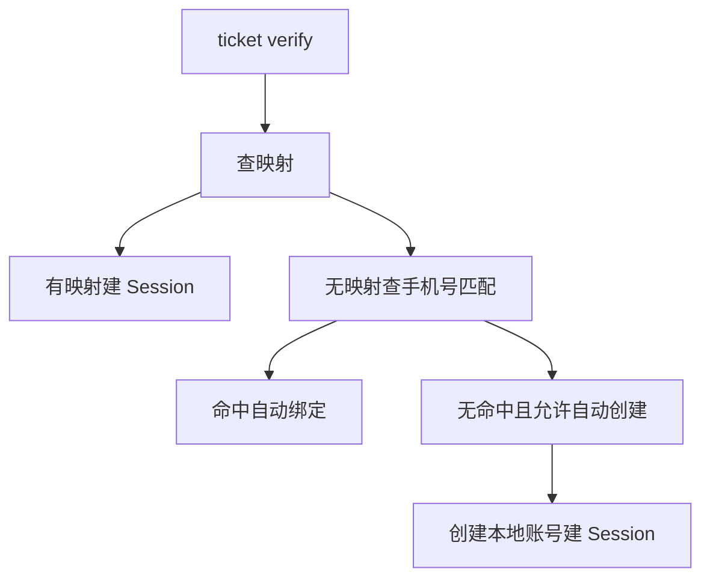
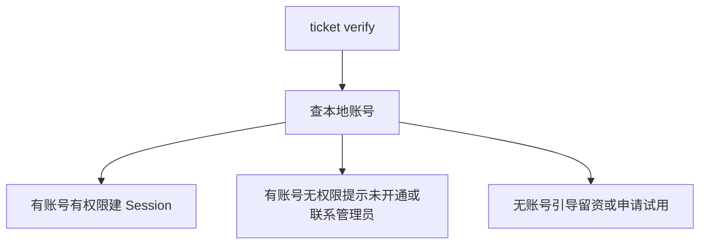
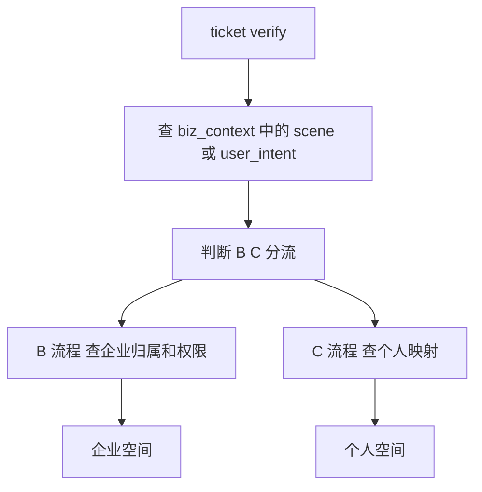
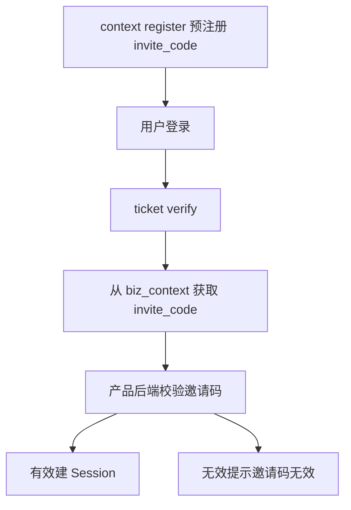
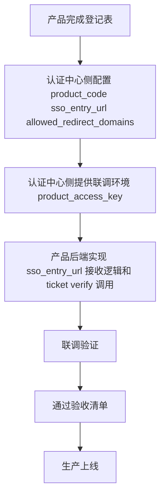
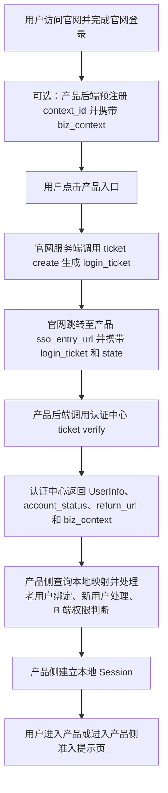
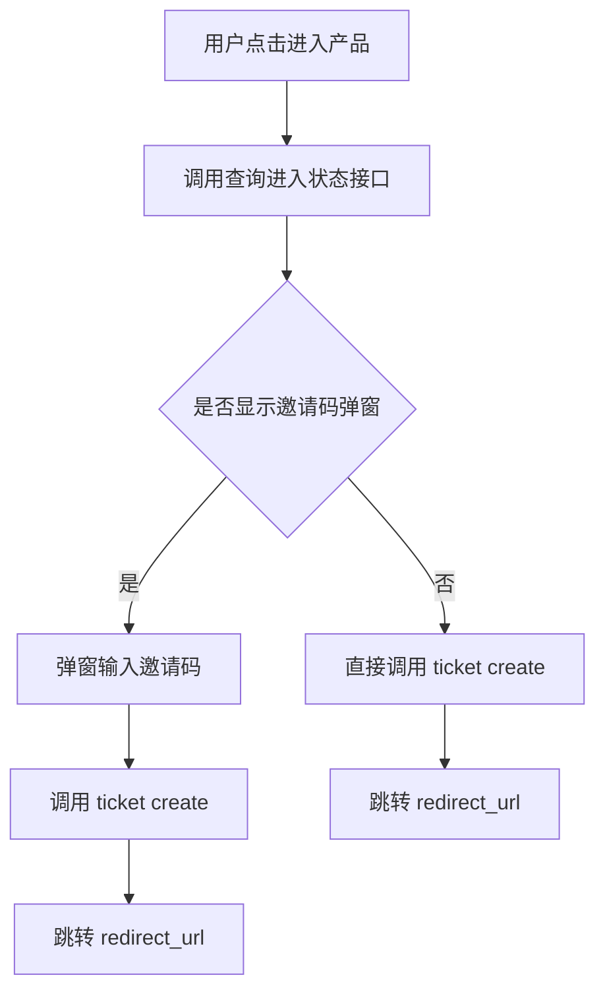
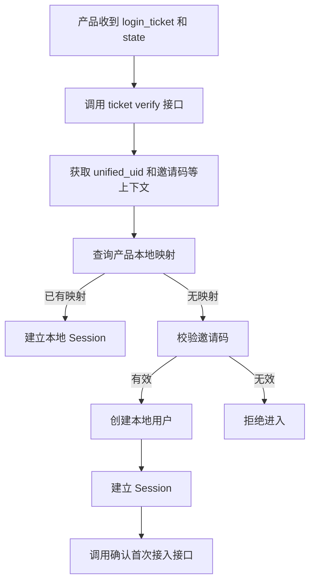

# 亦庄登录sso

## 项目背景与建设范围

### 1.1 项目背景

新版官网升级后，应作为百系产品统一入口，承担品牌展示、产品导航以及统一身份接入能力承接职能。官网需逐步承接百系产品的统一注册、统一登录、统一认证、统一授权、统一身份识别能力，形成统一用户承接链路。

当前各百系产品普遍存在独立登录入口、独立账号体系、独立认证方式，导致用户从官网进入不同产品时出现重复登录、身份割裂、登录状态不统一等问题。为解决上述问题，应建设统一登录认证授权中心，作为官网统一身份基础设施，对内输出标准化认证能力，对外形成统一登录入口。

首期统一认证中心已建设的核心能力应包括：

- 支持手机号注册与登录
- 支持邮箱注册与登录
- 支持统一 UID 管理
- 支持 SSO 票据颁发与校验
- 支持业务上下文透传
- 支持限流、防重放、审计脱敏等安全能力

### 1.2 建设目标

本项目应建设统一登录认证授权中心，首期目标至少包括以下内容：

| 目标 | 说明 |
| --- | --- |
| 官网统一身份入口 | 用户在新版官网完成注册或登录后，可跳转进入任意已接入的百系产品 |
| 统一注册 | 为官网统一入口提供统一注册能力，支持手机号、邮箱等标准注册方式 |
| 统一登录 | 为官网统一入口提供统一登录能力，减少跨产品重复登录 |
| 统一认证 | 由认证中心统一完成身份认证并输出标准认证结果 |
| 统一授权 | 提供统一登录认证授权链路中的标准授权能力，但不替代产品自身业务权限体系 |
| 统一身份标识 | 每个官网用户应拥有全局唯一的 `unified_uid`，作为跨产品身份锚点 |
| SSO 票据链路 | 官网应颁发 `login_ticket`，产品后端校验票据后换取用户信息，实现单点登录（SSO） |
| 单点登出 | 支持统一登出链路（SLO），用于官网统一身份会话退出 |
| 业务上下文透传 | 产品可预注册业务上下文，用户登录后由认证中心原样回传 |
| 官网统一入口能力 | 支持用户从官网统一进入不同百系产品 |
| 安全加固 | 提供限流、`nonce` 防重放、审计脱敏等安全能力 |

### 1.3 建设原则与职责边界

本项目建设范围应遵循以下原则：

- **统一认证，产品自治**：统一登录认证授权中心负责统一身份识别、认证与标准授权能力输出；各产品保留自身账号体系及权限体系。
- **渐进式推进**：允许各产品在过渡期内保留现有登录方式作为入口，统一认证中心逐步成为官网主登录链路。
- **新增链路优先**：首期重点承接官网导流进入产品的新链路，不强制要求产品一次性迁移全部既有登录入口。

认证中心与产品侧的职责边界应明确如下：

- 认证中心负责：统一身份识别、认证结果输出、SSO 票据链路、统一 UID 管理、业务上下文透传，以及必要的轻量接入状态维护。
- 产品侧负责：本地账号维护、角色与权限管理、业务规则校验，以及产品内的业务身份落库与使用。

对于邀请制或需要首次接入判断的产品，认证中心可维护某个 `unified_uid` 针对某个 `product_code` 的首次接入轻量状态，用于标识是否已完成首次接入。该状态范围为：

- `CONNECTED`：已完成该产品首次接入
- `NOT_CONNECTED`：未完成该产品首次接入

该轻量状态仅用于统一接入链路中的状态判断，不替代产品侧的邀请码有效性校验、账号创建、角色分配及权限控制。

### 1.4 建设范围

本期统一认证中心的接入范围应包括以下场景：

- 用户从新版官网入口点击进入百系产品。
- 用户在官网完成注册或登录后，由官网引导跳转进入产品。
- 产品新增导流入口接入官网统一登录，例如落地页、推广链接、活动页等场景；该类接入为可选能力。
- 产品通过预注册邀请链接、推荐链接传递业务上下文；该类业务上下文透传为可选能力。
- 产品深链场景接入官网认证中心完成身份核验，例如面试任务、项目协作、专家入驻等；该类接入为可选能力。

对于接入产品，认证中心应支持产品预注册业务上下文并在用户完成登录后原样回传，业务上下文可包括但不限于邀请码、推荐码、场景标记等信息。

### 1.5 非建设范围

本项目首期不纳入统一建设或不要求接入的范围包括：

- 统一产品业务权限
- 统一租户体系
- 统一角色体系
- 统一菜单体系
- 统一账号库合并
- 已有企业客户正在使用的产品后台登录入口迁移
- 小程序、App、PC 客户端等既有登录入口迁移
- 企业管理员分发账号后员工使用的内部入口迁移
- 存在复杂租户审批、邀请码校验、企业邮箱校验等规则的现有入口迁移
- 存量客户已收藏的产品后台地址迁移

首期实施原则如下：

- 不要求产品将原有登录入口全部迁移到官网统一认证中心。
- 原有入口可继续保留。
- 认证中心首期提供的是官网统一入口及新增链路能力，不替代所有既有登录体系。

## 用户与接入模式

### 2.1 用户类型与身份识别

系统应支持在统一身份体系下承载以下用户类型：

- **C 端用户**：个人用户，支持统一注册与登录。
- **B 端用户**：企业管理员、企业成员。
- **B+C 混合身份用户**：支持同一用户在统一身份下承载多身份场景，并可在不同业务场景中以不同身份进入对应空间。

`user_type` 表示认证中心侧识别到的身份线索，取值如下：

- `UNKNOWN`：未知或暂未识别；
- `PERSONAL`：个人身份线索；
- `ENTERPRISE_MEMBER`：企业成员身份线索。

系统应满足以下约束：

- `user_type` 仅表示认证中心识别到的身份线索，不代表用户已拥有某产品的 B 端权限。
- 产品是否允许用户进入 B 端后台，必须由产品侧基于本地账号、企业租户归属及角色权限自行判定。
- 同一统一身份可同时承载个人与企业相关身份，但进入哪个业务空间，应由产品侧结合业务上下文进行分流与授权控制。

### 2.2 产品接入模式定义

产品接入时应通过 `product_context.product_user_mode` 标识产品用户模式。接口返回值必须使用接口枚举值，业务展示可使用展示值；代码判断时必须使用接口枚举值。

| 接口枚举值 | 业务展示值 | 说明 |
| --- | --- | --- |
| `C` | C | 面向个人用户 |
| `B` | B | 面向企业用户 |
| `B_PLUS_C` | B+C | 同时支持个人和企业 |
| `INVITE_ONLY` | 邀请制 | 邀请码 / 灰度准入 |

系统应满足以下规则：

- 接口响应中的 `product_context.product_user_mode` 返回接口枚举值，例如 `B_PLUS_C`。
- 文档、页面或业务展示中可使用“B+C”作为展示值，但程序逻辑不得以展示值替代接口枚举值。
- `product_user_mode` 与 `user_type` 属于不同维度：前者表示产品的接入模式，后者表示认证中心识别到的用户身份线索，二者不得混用。

### 2.3 各接入模式的处理规则

### 2.3.1 C 端产品

C 端产品面向个人用户。官网注册用户可尝试进入产品。产品侧应按 `unified_uid` 查询本地映射；无映射时，在满足产品策略的前提下可自动创建本地账号。原有登录入口首期可继续保留。

推荐处理流程：



接入要求：

- `ticket verify` 成功后，产品侧应优先按 `unified_uid` 查询本地账号映射。
- 无映射时，可继续按手机号进行匹配；命中后可执行自动绑定。
- 未命中手机号且产品允许自动创建时，可创建本地账号并建立会话。
- 若产品不允许自动创建，则应由产品侧返回明确提示或引导后续注册/开通动作。

### 2.3.2 B 端产品

B 端产品面向企业用户。官网注册登录不等于自动开通 B 端产品权限。

接入要求：

- `ticket verify` 成功后，产品侧仍必须查询本地账号及 B 端权限。
- 无本地账号的用户不得直接进入产品后台。
- 有本地账号但无权限时，应提示未开通或引导联系管理员。
- 无账号用户应引导至留资、申请试用或联系管理员等流程。

推荐处理流程：



### 2.3.3 B+C 混合产品

B+C 混合产品同时支持个人用户和企业用户。同一产品内，产品侧应根据用户身份及业务上下文决定进入个人空间还是企业空间。

接入要求：

- 产品应支持同一统一身份在不同场景下进入不同空间。
- 产品应根据 `UID` 与 `biz_context` 共同判断路由目标。
- 可通过 `biz_context` 传递进入场景标记，例如 `scene` 或 `user_intent`。
- B 端路径必须校验企业归属和权限；C 端路径应执行个人映射或个人账号识别逻辑。

推荐处理流程：



### 2.3.4 邀请制/灰度产品

邀请制产品用于邀请码准入或灰度开放场景。此类产品应通过 `biz_context` 携带邀请码 `invite_code`。认证中心仅透传邀请码，不负责校验邀请码有效性。

接入要求：

- 产品接入前可通过 `context register` 预注册 `invite_code`。
- 用户完成登录并通过 `ticket verify` 后，产品后端应从 `biz_context` 中获取 `invite_code`。
- 邀请码有效性必须由产品后端自行校验。
- 邀请码有效时方可建立会话；无效时应提示邀请码无效。

推荐处理流程：



### 2.4 原登录入口保留原则

首期接入阶段应遵循以下原则：

- 不要求产品在首期完成全量登录入口迁移，原有登录入口可继续保留。
- 统一认证中心主要承接新增链路，包括官网导流、活动、邀请及深链等场景。
- 存量用户正在使用的产品后台登录入口，首期无需改动。
- 产品完成联调验收后，可按自身节奏逐步扩大接入范围。
- 认证中心不强制要求任何产品立即迁移全部登录入口。

### 2.5 接入实施路径与交付要求

产品接入实施应按以下路径推进：



实施要求：

- 产品接入前应完成登记，并由认证中心侧完成 `product_code`、`sso_entry_url`、`allowed_redirect_domains` 等配置。
- 认证中心侧应为联调环境提供 `product_access_key`。
- 产品后端必须实现 `sso_entry_url` 接收逻辑以及 `ticket verify` 调用能力。
- 联调验证通过并完成验收清单后，方可进入生产上线。

安全要求：

- `product_access_key` 必须通过安全渠道交付。
- 生产环境密钥必须单独分发，不得与联调环境混用。

## 总体架构与职责分工

### 3.1 总体架构

统一登录认证授权中心的总体架构应满足以下链路：

```text
官网统一入口 → 统一登录认证授权中心 → 各产品系统 → 本地账号映射 + 产品权限体系
```

系统采用“身份统一、业务分治”的架构原则：统一登录认证授权中心负责统一身份认证与登录链路，各产品系统继续负责本地账号、业务会话与权限控制。

统一登录认证授权中心在整体架构中的核心职责包括：

- 用户注册
- 用户登录
- 统一登录认证授权
- 统一 UID 管理
- 票据签发
- UserInfo 服务
- 单点登录（SSO）
- 单点登出（SLO）能力输出
- 登录审计

### 3.2 认证中心标准输出能力

统一登录认证授权中心应向各产品提供以下标准能力与接入要素：

| 能力/要素 | 说明 |
| --- | --- |
| `client_id` | 产品接入认证中心所需的客户端标识 |
| `client_secret` | 客户端密钥，用于受信调用场景 |
| `redirect_uri` 配置 | 登录成功后的回调地址配置 |
| `logout_uri` 配置 | 登出后的回调地址配置 |
| `login_ticket` | 一次性、短时效的 SSO 票据，时效为 5 分钟 |
| ticket 校验能力 | 产品后端使用 `product_access_key` 对票据进行校验并换取用户信息 |
| UserInfo | 返回 `unified_uid`、`user_type`、脱敏手机号/邮箱、`account_status`、注册来源等信息 |
| `biz_context` 透传 | 对预注册业务上下文进行原样透传，不解析其业务含义 |
| `context/register` | 支持产品预注册业务上下文，并返回 `context_id` |
| SSO | 提供统一单点登录能力 |
| SLO | 提供统一单点登出能力输出 |
| 登录审计能力 | 提供认证侧事件审计，敏感字段需脱敏 |
| 限流保护 | 对 5 类接口按分钟桶进行限流，超限返回 HTTP `429` |
| nonce 防重放 | 在 ticket 校验过程中提供防重放保护 |

认证中心输出的账户状态至少包括：

| 状态值 | 说明 |
| --- | --- |
| `ACTIVE` | 账号正常可用 |
| `DISABLED` | 账号被禁用 |
| `CANCELLED` | 账号已注销 |

### 3.3 产品侧职责与接入要求

各产品系统在接入统一登录认证授权中心时，应承担以下职责：

| 任务 | 说明 | 是否必须 |
| --- | --- | --- |
| 提供 `sso_entry_url` | 作为接收 `login_ticket` + `state` 的 HTTP GET 回调地址 | 必须 |
| 调用 `ticket/verify` | 产品后端调用认证中心校验 ticket，换取 UserInfo | 必须 |
| 维护 `unified_uid ↔ local_user_id` 映射 | 维护产品自己的账号映射表 | 必须 |
| 建立产品本地 Session | 产品自行颁发和管理 JWT/Cookie | 必须 |
| 处理 `return_url` 跳转 | 登录成功后跳转到正确页面 | 必须 |
| 处理 `biz_context` | 从 verify 响应中读取并处理业务上下文 | 视产品需求 |
| 处理 B 端权限判断 | 查询本地账号是否具备 B 端准入权限 | B 端产品必须 |
| 处理老用户绑定 | 处理 `unified_uid` 与已有账号的关联策略 | 视产品情况 |
| 调用 `context/register` | 在存在业务上下文时预注册 `biz_context` | 有业务上下文时使用 |
| 保护 `product_access_key` | 仅允许存储于后端，不得进入前端，不得写入日志 | 必须 |

产品系统应以认证中心返回的统一身份信息为认证基础，并在本地完成账号识别、权限校验、会话建立、业务准入判断与页面跳转。

### 3.4 职责边界与非目标范围

统一登录认证授权中心负责身份层统一，不替代各产品业务系统。除统一身份认证相关能力外，以下能力应由产品侧负责，认证中心不承担：

| 事项 | 边界说明 | 责任方 |
| --- | --- | --- |
| 创建产品本地账号 | 不在认证中心建立产品账号表 | 产品侧 |
| 维护 UID 与本地账号映射 | 不存储 `local_user_id` | 产品侧 |
| 建立产品 Session | 不颁发产品 JWT/Cookie | 产品侧 |
| 维护租户/组织/角色/菜单/数据权限/业务权限 | 认证中心不维护相关业务权限模型 | 产品侧 |
| 判断用户是否具有产品使用权限 | 认证中心仅返回身份信息，不做产品准入判定 | 产品侧 |
| 校验邀请码/推荐码有效性 | 仅透传，不校验业务含义 | 产品侧 |
| 校验企业邮箱/企业代码 | 不验证企业身份 | 产品侧 |

首期范围内，以下能力不作为统一登录认证授权中心的必选实现内容：

| 能力 | 说明 |
| --- | --- |
| OAuth2 / OIDC | 首期不实现，作为后续增强方向 |
| 全局登出 | 首期不强制，作为后续增强方向 |
| 第三方登录 | 首期不实现，作为后续增强方向 |

## 账号打通与首次接入机制

### 4.1 统一身份标识与本地账号映射

所有用户在统一认证中心内必须拥有唯一身份标识 `Unified UID`，用于作为跨产品账号打通的统一用户主键。

统一认证中心不直接替代各产品已有的本地账号体系。各产品必须基于 `Unified UID` 与本地账号建立映射关系，映射模型如下：

`Unified UID ↔ Local User ID`

各产品在账号打通时，必须保证同一 `Unified UID` 在本产品内能够关联到可识别的本地账号实体，以支持统一登录后的产品内用户识别、权限承接和接入状态记录。

### 4.2 首次绑定机制

用户首次通过官网进入产品时，系统必须按照以下规则处理首次接入与绑定：

1. 若用户已存在本地账号，则必须将该本地账号与 `Unified UID` 建立绑定关系。
2. 若用户不存在本地账号，则必须创建本地账号，并与 `Unified UID` 建立绑定关系。
3. 若发现账号归属冲突、重复绑定或无法确定应绑定的本地账号，则不得直接完成绑定，必须进入冲突处理流程。

首次绑定机制应与产品接入状态记录配合使用，以确保用户首次进入产品时能够完成身份识别、账号映射与接入确认。

### 4.3 产品首次接入确认接口

### 请求

| 字段 | 值 |
| --- | --- |
| 方法 | POST |
| 路径 | `/api/sso/product-entry/confirm` |
| 认证 | `Authorization: Bearer {product_access_key}`（产品后端） |
| Content-Type | `application/json` |

### 请求体

```json
{
  "product_code": "baigong",
  "unified_uid": "{unified_uid}",
  "access_status": "CONNECTED",
  "bind_source": "INVITE_CODE"
}
```

| 字段 | 类型 | 必须 | 说明 |
| --- | --- | --- | --- |
| `product_code` | string | ✅ | 产品编码 |
| `unified_uid` | string | ✅ | 统一用户 ID |
| `access_status` | string | ✅ | 当前阶段仅支持 `CONNECTED` |
| `bind_source` | string | ❌ | 接入来源：`INVITE_CODE` / `ADMIN` / `IMPORT` / `UNKNOWN` |

### 鉴权与校验规则

1. 服务端必须校验 `Authorization: Bearer {product_access_key}`。
2. `product_access_key` 必须属于请求体中的 `product_code`。
3. 对应产品状态必须为 `ENABLED`。
4. 必须校验 `unified_uid` 对应用户存在。
5. 必须校验 `access_status = CONNECTED`；当传入其他值时，必须按参数错误处理。
6. 任一鉴权或校验失败时，接口必须返回对应错误码，不得写入或更新接入记录。

### 业务处理规则

接口用于确认用户在产品中的首次接入或再次接入状态。服务端必须对 `auth_product_user_access` 执行 Upsert：

- 若记录不存在：插入记录，并写入 `first_connected_at = now`、`last_connected_at = now`；
- 若记录已存在：更新 `access_status = CONNECTED`、`last_connected_at = now`，且不得覆盖 `first_connected_at`。

### 成功响应

```json
{
  "code": "SUCCESS",
  "data": {
    "product_code": "baigong",
    "unified_uid": "{unified_uid}",
    "access_status": "CONNECTED"
  }
}
```

### 错误码

| 错误码 | 说明 |
| --- | --- |
| `PRODUCT_ACCESS_DENIED` | `product_access_key` 错误或无权访问产品 |
| `PRODUCT_INVALID` | 产品不存在 |
| `PRODUCT_DISABLED` | 产品已禁用 |
| `USER_NOT_FOUND` | `unified_uid` 不存在 |
| `PARAM_INVALID` | 参数错误，或 `access_status` 非 `CONNECTED` |

### 验收要点

- 使用合法的 `product_access_key`、有效的 `product_code` 与存在的 `unified_uid` 调用接口时，必须返回 `SUCCESS`。
- 首次写入时，必须同时生成 `first_connected_at` 和 `last_connected_at`。
- 再次调用时，必须更新 `last_connected_at`，且 `first_connected_at` 保持不变。
- 当 `access_status` 不是 `CONNECTED` 时，必须返回 `PARAM_INVALID`。
- 当产品未启用、产品不存在、访问凭证错误或用户不存在时，必须返回对应错误码。

## 核心登录与进入流程

### 5.1 统一登录与进入目标

用户在官网完成统一注册或登录后，系统应建立统一身份状态，并作为后续进入各产品的统一认证基础。

当用户已在官网处于已登录状态时，从官网进入产品应实现免二次登录。产品直接访问场景下，若用户未持有可用的产品本地登录状态，系统应引导用户进入统一认证登录流程，登录完成后回跳至目标产品。

官网登录后进入产品的基础链路如下：

```text
官网 → 统一认证中心 → 产品侧 → 本地 Session
```

产品直接访问的基础链路如下：

```text
产品 → 统一认证中心 → 登录 → 回跳产品
```

### 5.2 官网进入产品的单点登录流程

用户从官网进入产品时，系统应按以下流程完成单点登录接入：



具体要求如下：

- 官网侧应负责调用 `ticket create` 生成 `login_ticket`；产品侧通常不直接调用该接口。
- 官网跳转至产品入口地址 `sso_entry_url` 时，应携带 `login_ticket` 和 `state` 参数。
- 产品后端收到 `login_ticket` 和 `state` 后，应调用认证中心的 `ticket verify` 接口完成票据校验。
- `ticket verify` 返回信息中，应至少支持产品侧获取 `UserInfo`、`account_status`、`return_url` 和 `biz_context`，以供后续用户映射、准入判断和页面跳转使用。
- 产品侧在票据校验成功后，应查询本地用户映射，并区分已有关联用户与首次进入用户的处理逻辑。
- 对于需要进行 B 端权限或准入判断的场景，产品侧应在建立本地 Session 前完成校验；校验不通过时，不得直接放行进入产品主界面，应进入产品侧准入提示页或拒绝进入。
- 产品侧在完成映射处理及准入判断后，应建立本地 Session，作为用户进入产品的本地登录态。

### 5.3 业务上下文与预注册

当产品入口存在邀请码、推荐码、活动标识或其他业务上下文时，产品后端建议在用户点击进入产品前先调用 `context/register` 进行上下文预注册，并生成 `context_id` 或对应 `biz_context` 信息。

上下文处理要求如下：

- 有邀请码、推荐码、活动业务上下文等信息时，应支持通过预注册方式将相关上下文传递给统一认证链路。
- 从官网标准入口进入，且不存在产品侧业务上下文时，可跳过预注册流程。
- 通过 `ticket verify` 返回的 `biz_context`，产品侧应能够恢复进入链路中的业务上下文，用于邀请码处理、推荐归因、活动准入或落地页展示。

### 5.4 前端进入前判断与跳转

前端发起进入产品时，应先判断用户是否需要补充邀请码等准入信息，再执行跳转。推荐流程如下：



前端处理要求如下：

- 用户点击进入产品后，前端应先调用进入状态查询接口，用于判断是否需要展示邀请码弹窗或执行其他准入前提示。
- 当返回结果要求输入邀请码时，前端应弹出邀请码输入窗口，并在用户提交有效输入后再继续登录跳转流程。
- 当无需邀请码时，前端应直接发起后续登录票据生成与跳转。
- 前端在调用 `ticket create` 成功后，应按返回的 `redirect_url` 执行页面跳转。

### 5.5 产品侧票据校验、映射与首次接入

产品侧接收到官网回跳携带的 `login_ticket` 和 `state` 后，应执行以下后端处理流程：



后端处理要求如下：

- 产品侧必须对收到的 `login_ticket` 调用 `ticket verify` 接口进行校验，未经校验的票据不得用于建立本地登录态。
- 票据校验成功后，产品侧应获取统一身份标识，例如 `unified_uid`，以及邀请码、推荐信息或其他业务上下文。
- 产品侧应基于统一身份标识查询本地用户映射关系。
- 若本地映射已存在，产品侧应直接建立本地 Session。
- 若本地映射不存在，产品侧应进入首次接入流程，并对邀请码执行有效性校验；存在准入要求时，邀请码校验应作为创建本地用户前置条件。
- 邀请码校验有效时，产品侧应创建本地用户并建立 Session。
- 首次成功建立 Session 后，产品侧应调用确认首次接入接口，完成首登确认或接入状态回写。
- 邀请码无效或准入不满足时，产品侧应拒绝进入，不得创建本地用户，不得建立 Session。

## 登录体验、登出与接口能力

### 6.1 登录体验与单点登录要求

用户完成一次有效登录后，应可在统一认证体系下访问已接入产品，无需在官网与已接入产品之间重复登录。

系统应满足以下登录体验要求：

- 官网已登录用户进入已接入产品时，应复用统一登录状态，不得再次要求用户重复登录。
- 已接入产品之间的登录状态应保持统一，符合单点登录体验。
- 首次进入需要建立用户与产品访问关系的场景，应提供标准化的首次绑定流程。
- 登录异常场景应可控，能够通过明确的接口结果或状态反馈引导前端处理。

### 6.2 登出机制

系统应支持本地登出与全局登出两种机制，并满足以下要求：

- 本地登出：仅退出当前产品登录状态，不影响官网及其他产品的登录状态。
- 全局登出：退出统一认证中心，同时清理官网及所有已接入产品的登录状态。

### 6.3 产品进入状态查询接口

系统应提供“查询产品进入状态”接口，用于官网在用户进入目标产品前判断是否可直接创建单点登录票据，或是否需要弹出邀请码输入流程。

### 6.4 接口请求与处理逻辑

| 字段 | 值 |
| --- | --- |
| 方法 | GET |
| 路径 | `/api/sso/product-entry/status` |
| 认证 | `Authorization: Bearer {session_token}`（官网登录用户） |
| 参数 | `product_code`（query string，必填） |

接口处理逻辑应按以下顺序执行：

1. 校验 `session_token`，并获取 `unified_uid`。
2. 查询产品配置：
   - 产品不存在时，返回 `PRODUCT_INVALID`；
   - 产品已禁用时，返回 `PRODUCT_DISABLED`。
3. 当产品配置 `require_invite_code = false` 时，接口应返回 `action = CREATE_TICKET_DIRECTLY`。
4. 当产品配置 `require_invite_code = true` 时：
   - 查询 `auth_product_user_access` 中是否存在当前用户对应产品的 `CONNECTED` 记录；
   - 若存在 `CONNECTED` 记录，返回 `action = CREATE_TICKET_DIRECTLY`；
   - 若不存在 `CONNECTED` 记录，返回 `action = SHOW_INVITE_DIALOG`。

### 6.5 成功响应示例

当接口判断当前用户进入目标产品前需要输入邀请码时，应返回如下成功响应：

```json
{
  "code": "SUCCESS",
  "data": {
    "product_code": "baigong",
    "product_name": "百工",
    "require_invite_code": true,
    "invite_required_for_current_user": true,
    "access_status": "NOT_CONNECTED",
    "action": "SHOW_INVITE_DIALOG",
    "sso_entry_url": "https://saibotan-pre.100credit.cn/login"
  }
}
```

当接口判断当前用户可直接进入目标产品、无需输入邀请码时，应返回如下成功响应：

```json
{
  "code": "SUCCESS",
  "data": {
    "product_code": "baigong",
    "product_name": "百工",
    "require_invite_code": true,
    "invite_required_for_current_user": false,
    "access_status": "CONNECTED",
    "action": "CREATE_TICKET_DIRECTLY",
    "sso_entry_url": "https://saibotan-pre.100credit.cn/login"
  }
}
```

### 6.6 错误码

| 错误码 | 说明 |
| --- | --- |
| SESSION_INVALID | 未登录或 session 过期 |
| PRODUCT_INVALID | 产品不存在 |
| PRODUCT_DISABLED | 产品已禁用 |
| PARAM_INVALID | `product_code` 为空 |

## 数据模型设计

## 四、数据库表

```sql
CREATE TABLE auth_product_user_access (
  id BIGINT UNSIGNED NOT NULL AUTO_INCREMENT,
  product_code VARCHAR(64) NOT NULL,
  unified_uid VARCHAR(64) NOT NULL,
  access_status VARCHAR(32) NOT NULL COMMENT 'CONNECTED / REVOKED',
  bind_source VARCHAR(32) DEFAULT NULL,
  first_connected_at DATETIME(3),
  last_connected_at DATETIME(3),
  created_at DATETIME(3) NOT NULL DEFAULT CURRENT_TIMESTAMP(3),
  updated_at DATETIME(3) NOT NULL DEFAULT CURRENT_TIMESTAMP(3) ON UPDATE CURRENT_TIMESTAMP(3),
  is_deleted TINYINT NOT NULL DEFAULT 0,
  PRIMARY KEY (id),
  UNIQUE KEY uk_product_uid (product_code, unified_uid)
);
```

**不存储**：邀请码、local_user_id、local_tenant_id、权限

---

## 安全要求与风险控制

### 8.1 安全控制总则

系统应对白名单、鉴权凭证、会话、日志与敏感数据处理实施统一安全控制，所有相关实现均应满足以下要求：

- 生产环境必须使用全链路 HTTPS，禁止通过 HTTP 调用认证中心及相关接口。
- 所有认证、授权、换票、状态查询、确认等安全相关接口，均不得将敏感凭证暴露于前端代码、URL 查询参数或可被客户端直接读取的位置。
- 产品侧应建立独立的本地 Session 机制维护登录态，不得将一次性票据或中间凭证直接作为长期登录凭证使用。
- 仅允许已授权的服务端组件持有和使用平台分配的密钥类凭证，前端、第三方脚本及非受控环境不得保存或使用此类凭证。

### 8.2 回调地址与请求防伪要求

所有 OAuth 或类似授权回调地址必须统一纳入白名单管理，并满足以下要求：

- 所有 `redirect_uri` 必须进行白名单校验，只有已登记的回调地址才允许发起或完成授权流程。
- 所有授权请求必须携带并校验 `state` 参数，用于防止 CSRF 攻击；服务端在处理授权回调时必须校验 `state` 与发起授权时保存的值一致。
- 用于票据生成、校验或验证流程的 `nonce` 必须保证每次请求唯一，禁止复用历史 `nonce`。

### 8.3 凭证、密钥与票据保护

系统涉及的访问令牌、刷新令牌、产品密钥及票据类凭证必须按最小暴露原则管理：

- `access_token`、`refresh_token` 禁止暴露于前端或 URL。
- `client_secret` 仅允许保存在服务端。
- `product_access_key` 仅允许由后端保存和使用，不得出现在前端代码、URL 或日志中。
- `login_ticket` 仅用于换取 `UserInfo` 或完成规定的短链路认证步骤，不得作为登录态长期保存或直接充当登录凭证。
- 任何密钥类或票据类信息均不得以可逆明文方式缓存、持久化到非受控终端，或写入无保护的调试输出。

### 8.4 接口鉴权与会话控制

不同接口应采用与其用途匹配的鉴权方式，并限制调用范围：

- `status` 接口必须使用官网 `session_token` 进行鉴权，且仅允许返回当前登录用户自身的状态信息，不得返回其他用户的数据。
- `confirm` 接口必须使用 `product_access_key` 进行鉴权，且仅允许合法产品后端调用，前端或未授权调用方不得直接访问。
- 产品侧必须建立本地 Session 维护用户登录态，不依赖 `login_ticket` 作为登录凭证。
- 对外暴露的接口应基于调用主体身份实施权限校验，确保用户态接口只能访问本人数据，服务态接口只能由受信任后端调用。

### 8.5 日志与敏感数据存储要求

日志记录与数据存储必须满足脱敏和最小留存要求：

- 日志必须进行脱敏处理，不得记录敏感信息。
- 日志中不得打印 `session_token`、`product_access_key`、邀请码，以及其他等效敏感凭证。
- 邀请码不得以明文形式存储。
- 不得存储 `local_user_id`、`local_tenant_id`。
- 如因审计、排障需要记录安全事件，记录内容应避免包含可直接用于认证、授权或还原用户身份映射关系的原始敏感字段。

## 联调、验收与交付

### 9.1 接入能力与安全要求

接入产品在联调、验收与交付前，应满足以下接入能力要求：

- 支持统一认证中心登录。
- 支持官网进入产品免二次登录。
- 支持 Unified UID 映射。
- 支持首次绑定流程。
- 支持本地登出。
- 支持全局登出。
- 满足统一安全规范。

接入实现应至少覆盖以下能力链路：

- 官网统一注册登录完成。
- 官网进入产品免二次登录生效。
- Unified UID 映射生效。
- 首次绑定流程可用。
- 单点登录（SSO）生效。
- 单点登出（SLO）生效。

安全接入要求至少包括：

- `redirect_uri` 必须进行白名单校验。
- 必须校验 `state` 参数，防止请求伪造与回调串改。
- Token 必须安全存储、传输与使用。
- `client_secret` 必须安全保管，不得明文泄露。
- 所有相关接口与回调必须使用 HTTPS。
- 日志必须进行脱敏处理，不得记录敏感明文。

### 9.2 联调流程与验证范围

联调开始前，双方应完成以下准备：

- 确认联调环境地址。
- 确认 `product_access_key` 配置正确且可用。

联调过程应优先验证正向主链路，至少包括以下步骤：

- `context/register`
- `ticket/create`
- `ticket/verify`

在完整业务联调中，应进一步验证以下端到端流程：

- `context/register → login → ticket/create → ticket/verify → 建立 Session → return_url 跳转`

联调除正向链路外，还应覆盖以下场景：

- B 端场景。
- 邀请制等特殊业务场景。
- 异常场景验证，包括但不限于：
  - 票据已用或票据重用。
  - `state` 不符。
  - `nonce` 重放。
  - `product_access_key` 无效。

联调期间，审计与安全校验要求如下：

- 审计日志不得包含敏感信息明文。
- 需验证日志脱敏能力已生效。

### 9.3 验收标准

验收应覆盖功能、安全、异常链路及审计要求，至少包括以下内容。

功能验收：

- 官网统一注册登录完成。
- 官网进入产品免二次登录。
- Unified UID 生效。
- 首次绑定流程可用。
- SSO 生效。
- SLO 生效。
- 正向链路完整可用：`context/register → login → ticket/create → ticket/verify → 建立 Session → return_url 跳转`。

安全验收：

- `redirect_uri` 白名单校验生效。
- `state` 校验生效。
- Token 安全符合要求。
- `client_secret` 安全符合要求。
- HTTPS 生效。
- 日志脱敏生效。

异常链路验收：

- 票据重用场景能够被识别并拒绝。
- `state` 不符场景能够被识别并拒绝。
- `nonce` 重放场景能够被识别并拒绝。
- `product_access_key` 无效场景能够被识别并拒绝。

审计验收：

- 审计日志无敏感明文。

### 9.4 交付物与自测覆盖情况

交付时应提供统一认证中心相关能力的自测覆盖情况，以支持联调结论与验收判断。当前已验证能力如下：

| 能力 | 状态 |
| --- | --- |
| 手机号/邮箱注册登录 | 已验证 |
| context/register | 已验证 |
| ticket/create（带 context_id） | 已验证 |
| ticket/verify（返回 UserInfo + biz_context） | 已验证 |
| mock-product-server 完整 E2E 链路 | 已验证 |
| nonce 防重放 | 已验证 |
| 限流（5 类接口） | 已验证 |
| 审计日志脱敏 | 已验证 |
| Actuator 最小暴露 | 已验证 |
| product_access_key 认证 | 已验证 |

交付材料中的自测结果应能够支撑以下判断：

- 核心接口能力已完成基本验证。
- 正向 E2E 链路已具备可联调条件。
- 关键安全控制项已覆盖，包括防重放、日志脱敏、访问认证与最小暴露。
