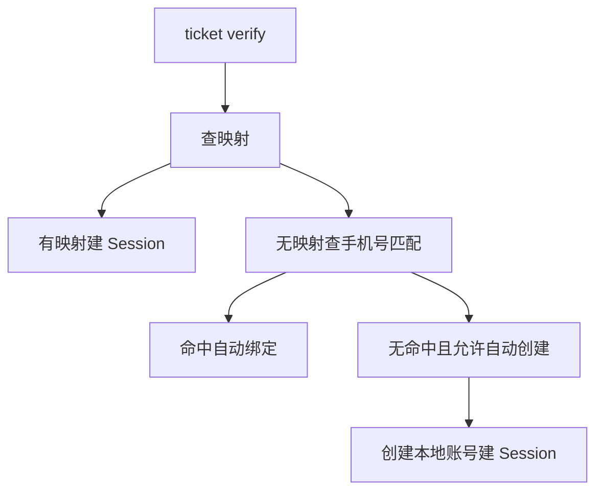
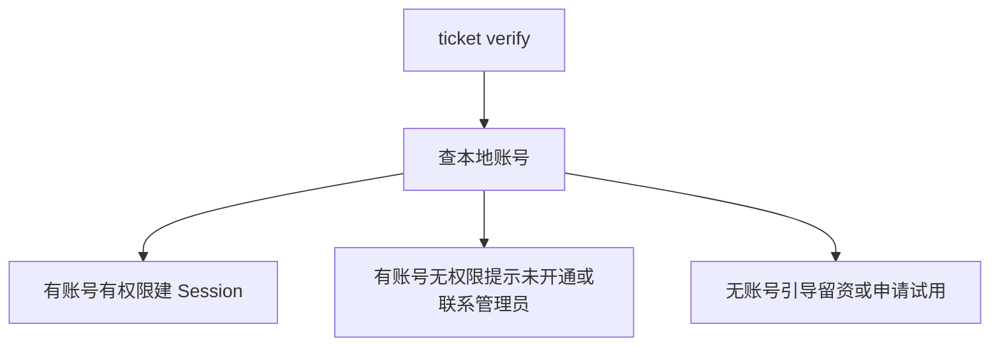
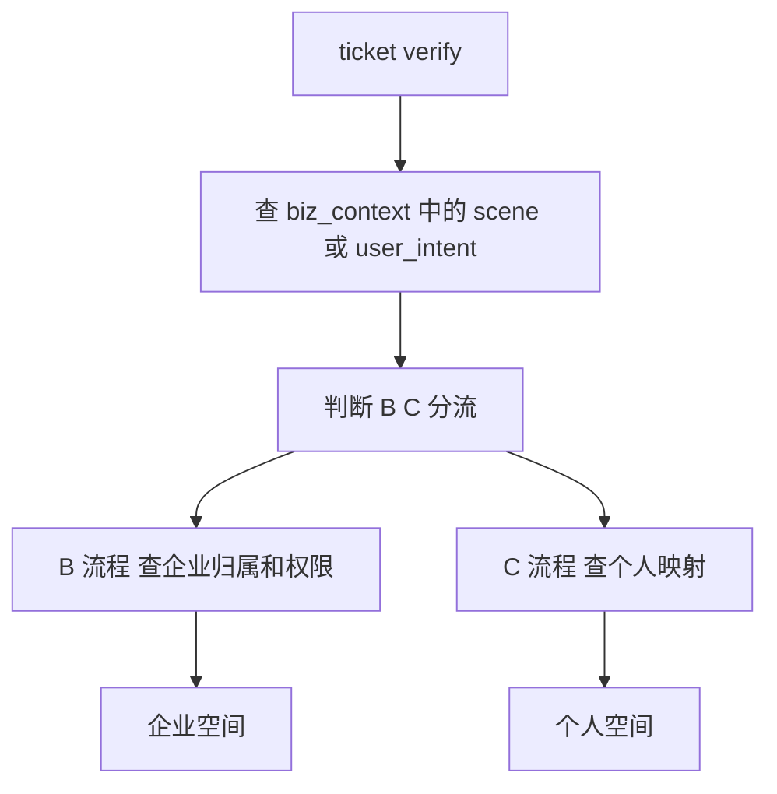
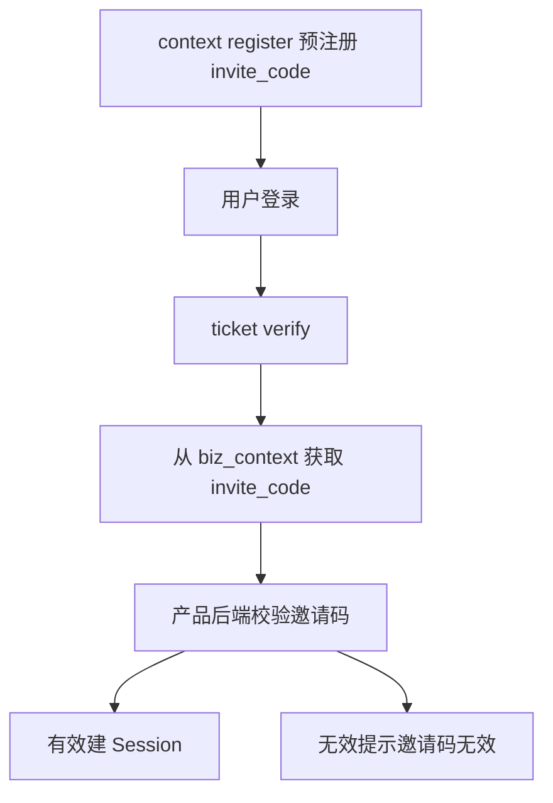
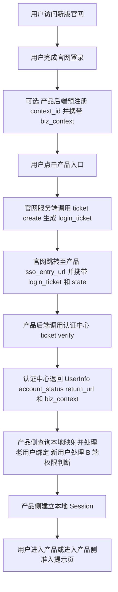
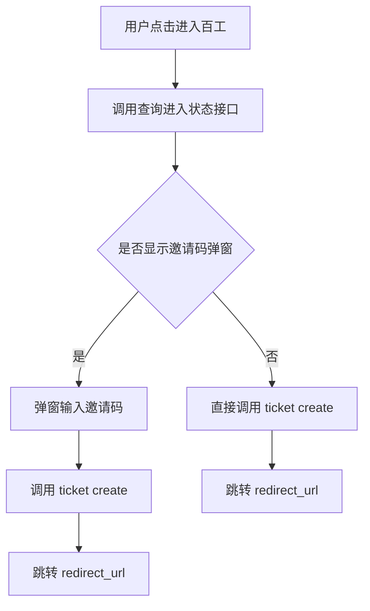
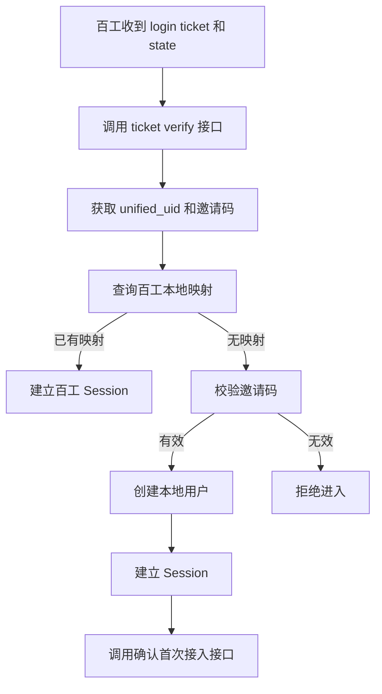
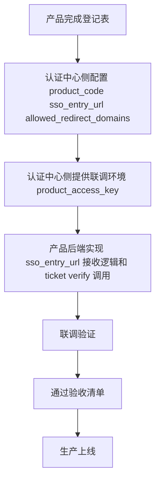

# 亦庄登录sso

## 项目背景与建设范围

### 建设背景

新版百融官网升级后，将承担百系产品统一入口职能。官网不仅作为品牌展示与产品导航入口，同时需逐步承接百系产品统一注册、统一登录、统一认证与统一身份识别能力。

当前百系产品普遍存在独立登录入口、独立账号体系、独立认证方式，导致用户从官网进入不同产品时存在重复登录、身份割裂、状态不统一等问题，官网无法形成统一用户承接链路。

因此需建设统一登录认证授权中心，作为官网统一身份基础设施，对内输出标准化认证能力，对外形成统一登录入口。

首期建设基于新版官网统一认证中心开展，已纳入的核心能力包括：手机号/邮箱注册登录、统一 UID 管理、SSO 票据颁发与校验、业务上下文透传、限流防重放等安全能力。

### 建设目标

本项目建设统一登录认证授权中心，实现以下目标：

| 目标 | 说明 |

| --- | --- |

| 官网统一身份入口 | 用户在新版官网完成注册/登录后，可跳转进入任意百系产品 |

| 统一注册与统一登录 | 为官网侧提供统一注册、统一登录入口能力 |

| 统一认证与统一授权 | 对内输出标准化认证授权能力，支撑产品接入 |

| 统一身份标识 | 每个官网用户拥有全局唯一 `unified_uid`，作为跨产品身份锚点 |

| SSO / SLO | 支持单点登录（SSO）与单点登出（SLO）能力 |

| SSO 票据链路 | 官网颁发 `login_ticket`，产品后端校验并换取 `UserInfo` |

| 业务上下文透传 | 产品可预注册业务上下文（如邀请码、推荐码、场景标记），用户登录后原样回传 |

| 安全加固 | 提供限流、`nonce` 防重放、审计脱敏等安全能力 |

### 建设范围

本期认证中心 SSO 能力主要承接以下场景：

- 用户从新版官网入口点击进入百系产品。

- 用户在官网完成注册/登录后，由官网引导跳转到产品。

- 产品通过新增导流入口（如落地页、推广链接、活动页）接入官网统一登录。

- 产品通过预注册邀请链接、推荐链接传递业务上下文。

- 产品的深链场景（如面试任务、项目协作、专家入驻等）可选择通过官网认证中心完成身份核验。

对于邀请制或首次接入需补充校验的产品，认证中心可维护轻量首次接入状态，用于标识某个 `unified_uid` 是否已完成某个 `product_code` 的首次接入。

### 建设原则

本项目遵循以下建设原则：

- 统一认证，产品自治：统一登录认证授权中心负责统一身份识别与认证授权；各产品保留自身账号体系及权限体系。

- 渐进式推进：允许各产品保留现有登录方式作为过渡入口，统一认证中心逐步成为官网主登录链路。

- 首期新增链路优先：首期不要求产品将原有登录入口全部迁移到官网，原入口可继续保留，认证中心提供的是新增链路能力。

### 职责边界

认证中心与产品侧职责边界如下：

- 认证中心负责：统一身份识别、认证授权、SSO 票据链路、统一 `unified_uid` 管理、业务上下文透传，以及在特定场景下维护首次接入状态（`CONNECTED` / `NOT_CONNECTED`）。

- 产品侧负责：本地账号维护、本地角色与权限体系维护，以及邀请码有效性、租户审批、企业邮箱校验等业务规则校验。

### 非建设范围

以下场景或能力不属于本项目建设范围，或首期不要求接入：

- 统一产品业务权限

- 统一租户体系

- 统一角色体系

- 统一菜单体系

- 统一账号库合并

- 已有企业客户正在使用的产品后台登录入口

- 小程序、App、PC 客户端等既有登录入口

- 企业管理员分发账号后员工使用的内部入口

- 有复杂租户审批、邀请码校验、企业邮箱校验的现有入口

- 存量客户已收藏的产品后台地址

## 用户模型与接入模式

### 用户身份模型

系统应支持以下用户身份模型：

- **C 端用户**：个人用户，支持统一注册与登录。
- **B 端用户**：企业管理员、企业成员。
- **B+C 混合身份用户**：支持同一用户在统一身份下承载多身份场景。

### 产品接入模式

`product_context.product_user_mode` 表示产品接入模式，接口响应中返回接口枚举值；文档中如出现“B+C”为业务展示值，代码判断应使用接口枚举值。

| 接口枚举值 | 业务展示值 | 说明 |
| --- | --- | --- |
| C | C | 面向个人用户 |
| B | B | 面向企业用户 |
| B_PLUS_C | B+C | 同时支持个人和企业 |
| INVITE_ONLY | 邀请制 | 邀请码 / 灰度准入 |

### 身份识别与权限判断原则

`user_type` 表示认证中心侧识别到的身份线索，取值如下：

- `UNKNOWN`：未知或暂未识别；
- `PERSONAL`：个人身份线索；
- `ENTERPRISE_MEMBER`：企业成员身份线索。

约束如下：

- `user_type` 不代表用户已拥有某产品的 B 端权限。
- 产品是否允许用户进入 B 端后台，应由产品侧根据本地账号、企业租户、角色权限自行判断。
- 产品用户模式（`C` / `B` / `B_PLUS_C` / `INVITE_ONLY`）由 `product_context.product_user_mode` 表示，与 `user_type` 属于不同维度。

### 典型接入流程

#### C 端产品

特点：

- 官网注册用户可尝试进入。
- 产品侧按 `unified_uid` 查询映射；无映射时可自动创建本地账号。
- 原登录入口首期可继续保留。

推荐策略：



#### B 端产品

核心原则：官网注册登录 ≠ 自动开通 B 端产品权限。

特点：

- `ticket verify` 成功后，还需查询本地是否有账号和 B 端权限。
- 无账号用户不应直接进入产品后台。
- 应引导至留资、申请试用或联系管理员。

推荐策略：



#### B+C 混合产品

特点：

- 同一产品同时支持个人用户和企业用户。
- 产品根据 UID 和 `biz_context` 决定走个人空间还是企业空间。
- 可通过 `biz_context` 传递用户的进入场景标记。

推荐策略：



#### 邀请制 / 灰度产品

特点：

- 通过 `biz_context` 携带邀请码（`invite_code`）。
- 认证中心只透传邀请码，不校验邀请码有效性。
- 产品后端收到邀请码后，应自行校验是否有效。

推荐策略：



## 总体架构与职责边界

### 架构定位

统一登录认证授权中心作为统一身份层，面向官网统一入口与各产品提供统一的身份认证与授权相关能力。系统总体链路如下：

```
官网统一入口 → 统一登录认证授权中心 → 百系产品 → 本地账号映射 + 产品权限体系
```

### 认证中心核心职责

统一登录认证授权中心负责以下能力：

- 用户注册
- 用户登录
- 统一登录认证授权
- 统一 UID 管理
- 票据签发
- UserInfo 服务
- SSO
- SLO
- 登录审计

### 职责边界

统一登录认证授权中心仅负责身份层统一，不替代各产品业务系统。各产品继续负责本地业务身份与权限体系，包括但不限于：

- 本地账号
- 本地 Session
- 租户
- 角色
- 菜单
- 数据权限
- 业务权限
- 产品本地账号与统一 UID 的映射关系
- 产品使用权限判断

### 非职责范围与阶段性约束

以下能力不属于统一登录认证授权中心职责范围，或在首期不纳入实现范围：

| 项目 | 约束说明 | 责任方/阶段 |
| --- | --- | --- |
| 创建产品本地账号 | 认证中心不建立产品账号表 | 产品侧 |
| 维护 UID ↔ 本地账号映射 | 认证中心不存储 `local_user_id` | 产品侧 |
| 建立产品 Session | 认证中心不颁发产品 JWT/Cookie | 产品侧 |
| 校验邀请码/推荐码有效性 | 认证中心仅透传，不校验业务含义 | 产品侧 |
| 校验企业邮箱/企业代码 | 认证中心不验证企业身份 | 产品侧 |
| 维护租户/组织/角色/权限 | 认证中心不建立相关业务模型 | 产品侧 |
| 判断是否有产品使用权限 | 认证中心仅返回身份信息，不判断产品可用性 | 产品侧 |
| OAuth2/OIDC | 首期不实现 | 后续增强 |
| 全局登出 | 首期不强制 | 后续增强 |
| 第三方登录 | 首期不实现 | 后续增强 |

## 核心机制设计

## 6. 核心机制设计

### 6.1 Unified UID

所有用户在统一认证中心内拥有唯一身份标识（Unified UID）。

### 6.2 本地账号映射

统一认证中心不直接替代各产品本地账号体系，各产品通过 Unified UID 与本地账号建立映射关系。

映射关系：`Unified UID ↔ Local User ID`

### 6.3 首次绑定机制

用户首次通过官网进入产品时：

- 已存在本地账号则绑定本地账号；
- 不存在本地账号则创建本地账号；
- 存在冲突则进入冲突处理流程。

## 核心业务流程与交互链路

### 统一登录与接入场景

系统应支持统一身份登录与单点进入产品的核心链路，覆盖官网登录、从官网进入产品、以及直接访问产品三类场景。

用户在官网完成统一注册或登录后，应建立统一身份状态。

### 官网登录后进入产品

官网已登录用户进入产品时，应支持免二次登录。

从官网标准入口进入产品的主链路如下：



官网进入产品的交互关系可表示为：

```text
官网 → 统一认证中心 → 产品侧 → 本地 Session
```

当存在邀请码、推荐码、活动业务上下文等信息时，建议产品后端先调用 context/register 进行预注册。

若用户从官网标准入口进入，且不存在产品侧业务上下文，则可跳过预注册。

ticket/create 应由官网侧发起，产品侧通常不直接调用。

官网跳转至产品侧时，应携带 login_ticket 和 state。

产品后端收到跳转请求后，应调用认证中心的 ticket verify 接口完成票据校验。

认证中心校验通过后，应返回至少包括 UserInfo、account_status、return_url 和 biz_context 在内的信息。

产品侧在完成票据校验后，应查询本地用户映射，并根据映射结果处理老用户绑定、新用户准入或权限判断。

产品侧在校验通过且准入通过后，应建立本地 Session。

建立本地 Session 后，用户应进入产品；如不满足准入条件，应进入产品侧准入提示页。

### 产品直接访问链路

用户直接访问产品时，系统应将用户引导至统一认证中心完成登录，并在登录后回跳至产品。

直接访问产品的交互关系可表示为：

```text
产品 → 统一认证中心 → 登录 → 回跳产品
```

### 前端进入产品的推荐与邀请交互

当前端承接官网进入产品的推荐或邀请场景时，应先查询用户进入状态，再决定是否要求输入邀请码。

前端推荐流程如下：



当查询结果要求展示邀请码弹窗时，前端应弹出邀请码输入界面，并在用户提交后调用 ticket create。

当查询结果无需展示邀请码弹窗时，前端应直接调用 ticket create。

前端在成功获取跳转信息后，应跳转至 redirect_url。

### 产品后端票据校验、建户与准入处理

产品后端收到 login_ticket 和 state 后，应调用 ticket verify 接口进行校验。

产品后端推荐接入流程如下：



ticket verify 成功后，产品后端应获取 unified_uid 及相关邀请码信息。

产品后端应基于 unified_uid 查询本地用户映射。

若已存在本地映射，产品后端应直接建立本地 Session。

若不存在本地映射，产品后端应先校验邀请码有效性。

当邀请码有效时，产品后端应创建本地用户并建立 Session。

首次完成本地创建并建立 Session 后，产品后端应调用确认首次接入接口。

当邀请码无效时，产品后端应拒绝用户进入产品。

## 登录接入体验与会话规则

### 统一登录体验要求

- 用户完成一次登录后，在登录状态有效期间，可访问已接入产品，无需在各已接入产品中重复登录。
- 用户从官网进入已接入产品时，应直接复用统一认证状态，不得要求再次登录。
- 官网与各已接入产品之间的登录状态应保持统一。
- 首次账号绑定流程应标准化，确保首次接入时的绑定动作具备一致的处理方式。
- 登录异常应可控，系统应具备可识别、可处理的异常处置能力。

### 登出规则

#### 本地登出

仅退出当前产品，不影响官网及其他产品的登录状态。

#### 全局登出

退出统一认证中心，同时清理官网及所有接入产品的登录状态。

### 登录入口保留与迁移原则

- 首期接入不要求各产品立即迁移原有登录入口，原产品登录入口可继续保留。
- 官网统一认证中心主要承接新增登录链路，包括但不限于官网导流、活动、邀请及深链场景。
- 存量用户正在使用的产品后台登录入口，首期无需改动。
- 产品在完成联调与验收后，可按自身节奏逐步扩大统一认证接入范围。
- 统一认证中心不强制要求任何产品立即迁移全量登录入口。

### 接入实施路径与交付物



- 接入实施应按以下路径完成：产品完成登记表、认证中心完成配置、提供联调环境凭据、产品后端完成接收与校验逻辑、完成联调验证、通过验收清单后生产上线。
- 认证中心侧应配置以下接入参数：`product_code`、`sso_entry_url`、`allowed_redirect_domains`。
- 产品后端应实现 `sso_entry_url` 的接收逻辑，并完成 `ticket verify` 调用。
- `product_access_key` 应通过安全渠道交付。
- 生产环境密钥应单独分发。

## 接口能力与产品接入要求

### 认证中心提供的标准能力

统一登录认证授权中心应向接入产品提供以下标准能力：

- 为接入产品分配 `client_id`
- 为接入产品分配 `client_secret`
- 支持 `redirect_uri` 配置
- 支持 `logout_uri` 配置
- 提供访问票据能力
- 提供 `UserInfo`
- 提供单点登录（SSO）能力
- 提供单点登出（SLO）能力
- 提供登录审计能力

认证中心还应提供以下接入与账户基础能力：

| 能力 | 说明 |
| --- | --- |
| 注册/登录 | 手机号、邮箱注册与登录 |
| 统一 UID | 全局唯一 `unified_uid` |
| `login_ticket` | 一次性、短时效（5 分钟）的 SSO 票据 |
| ticket 校验 | 产品后端用 `product_access_key` 换取 `UserInfo` |
| `UserInfo` | `unified_uid`、`user_type`、脱敏手机号/邮箱、`account_status`、注册来源 |
| `biz_context` 透传 | 预注册的业务上下文原样透传，不解析 |
| `account_status` | `ACTIVE` / `DISABLED` / `CANCELLED` |
| `context/register` | 支持产品预注册业务上下文，返回 `context_id` |
| 限流保护 | 5 类接口按分钟桶限流，超限返回 HTTP `429` |
| `nonce` 防重放 | `ticket verify` 需具备防重放攻击能力 |
| 审计日志 | 认证侧事件审计，敏感字段脱敏 |

### 产品接入要求

接入产品必须满足以下要求：

- 支持统一认证中心登录
- 支持官网免二次登录
- 支持 Unified UID 映射
- 支持首次绑定
- 支持本地登出
- 支持全局登出
- 满足统一安全规范

产品侧接入实施要求如下：

| 任务 | 说明 | 是否必须 |
| --- | --- | --- |
| 提供 `sso_entry_url` | 接收 `login_ticket` + `state` 的 HTTP GET 回调地址 | 必须 |
| 调用 `ticket/verify` | 后端调用认证中心校验 `ticket`，换取 `UserInfo` | 必须 |
| 维护 `unified_uid ↔ local_user_id` 映射 | 产品侧维护本地账号映射表 | 必须 |
| 建立产品本地 Session | 产品自行颁发和管理 JWT/Cookie | 必须 |
| 处理 `return_url` 跳转 | 登录成功后跳转到正确页面 | 必须 |
| 处理 `biz_context` | 从 verify 响应中读取并处理业务上下文 | 视产品需求 |
| 处理 B 端权限判断 | 查询本地账号是否有 B 端准入权限 | B 端产品必须 |
| 处理老用户绑定 | 处理 `unified_uid` 与已有账号的关联策略 | 视产品情况 |
| 调用 `context/register` | 预注册 `biz_context` | 有业务上下文时使用 |
| 保护 `product_access_key` | 仅存放于后端，不得进入前端或日志 | 必须 |

### 安全与会话要求

产品在接入过程中应满足以下安全与会话处理要求：

- `ticket/verify` 必须由产品后端调用，不得由前端直接调用。
- `product_access_key` 必须仅保存在后端，不得下发到前端，也不得写入日志。
- 产品必须在认证通过后建立并维护自身本地 Session，可采用 JWT 或 Cookie。
- 产品必须支持本地登出，并支持全局登出联动。
- 认证中心侧 `ticket verify` 应具备 `nonce` 防重放能力。
- 认证中心审计日志应记录认证相关事件，并对敏感字段进行脱敏处理。
- 接入产品必须满足统一安全规范。

## 接口与数据模型设计

### 产品进入状态查询接口

| 字段 | 值 |
| --- | --- |
| 方法 | GET |
| 路径 | `/api/sso/product-entry/status` |
| 认证 | `Authorization: Bearer {session_token}`（官网登录用户） |
| 参数 | `product_code`（query string，必填） |

1. 校验 `session_token`，获取 `unified_uid`。
2. 查询产品配置：
   - 产品不存在：返回 `PRODUCT_INVALID`
   - 产品已禁用：返回 `PRODUCT_DISABLED`
3. 若 `require_invite_code = false`，则返回 `action = CREATE_TICKET_DIRECTLY`。
4. 若 `require_invite_code = true`：
   - 查询 `auth_product_user_access` 是否存在 `CONNECTED` 记录。
   - 若存在，则返回 `action = CREATE_TICKET_DIRECTLY`。
   - 若不存在，则返回 `action = SHOW_INVITE_DIALOG`。

成功响应示例：需要弹邀请码
```json
{
  "code": "SUCCESS",
  "data": {
    "product_code": "baigong",
    "product_name": "百工",
    "require_invite_code": true,
    "invite_required_for_current_user": true,
    "access_status": "NOT_CONNECTED",
    "action": "SHOW_INVITE_DIALOG",
    "sso_entry_url": "https://saibotan-pre.100credit.cn/login"
  }
}
```

成功响应示例：不需要弹邀请码
```json
{
  "code": "SUCCESS",
  "data": {
    "product_code": "baigong",
    "product_name": "百工",
    "require_invite_code": true,
    "invite_required_for_current_user": false,
    "access_status": "CONNECTED",
    "action": "CREATE_TICKET_DIRECTLY",
    "sso_entry_url": "https://saibotan-pre.100credit.cn/login"
  }
}
```

| 错误码 | 说明 |
| --- | --- |
| SESSION_INVALID | 未登录或 session 过期 |
| PRODUCT_INVALID | 产品不存在 |
| PRODUCT_DISABLED | 产品已禁用 |
| PARAM_INVALID | `product_code` 为空 |

### 产品首次接入确认接口

| 字段 | 值 |
| --- | --- |
| 方法 | POST |
| 路径 | `/api/sso/product-entry/confirm` |
| 认证 | `Authorization: Bearer {product_access_key}`（产品后端） |
| Content-Type | `application/json` |

请求体示例
```json
{
  "product_code": "baigong",
  "unified_uid": "{unified_uid}",
  "access_status": "CONNECTED",
  "bind_source": "INVITE_CODE"
}
```

| 字段 | 类型 | 必须 | 说明 |
| --- | --- | --- | --- |
| `product_code` | string | ✅ | 产品编码 |
| `unified_uid` | string | ✅ | 统一用户 ID |
| `access_status` | string | ✅ | P0 仅支持 `CONNECTED` |
| `bind_source` | string | ❌ | 接入来源：`INVITE_CODE` / `ADMIN` / `IMPORT` / `UNKNOWN` |

鉴权逻辑：
1. 校验 `Authorization: Bearer {product_access_key}`。
2. `product_access_key` 必须属于请求体中的 `product_code`。
3. 产品必须为 `ENABLED`。
4. 鉴权失败时返回 `PRODUCT_ACCESS_DENIED`。

业务逻辑：
1. 校验 `unified_uid` 对应用户存在。
2. 校验 `access_status = CONNECTED`。
3. Upsert `auth_product_user_access`：
   - 不存在：插入记录，`first_connected_at = now`，`last_connected_at = now`
   - 已存在：更新 `access_status = CONNECTED`，`last_connected_at = now`，且**不得覆盖** `first_connected_at`

成功响应示例
```json
{
  "code": "SUCCESS",
  "data": {
    "product_code": "baigong",
    "unified_uid": "{unified_uid}",
    "access_status": "CONNECTED"
  }
}
```

| 错误码 | 说明 |
| --- | --- |
| PRODUCT_ACCESS_DENIED | `product_access_key` 错误 |
| PRODUCT_INVALID | 产品不存在 |
| PRODUCT_DISABLED | 产品已禁用 |
| USER_NOT_FOUND | `unified_uid` 不存在 |
| PARAM_INVALID | 参数错误或 `access_status` 非 `CONNECTED` |

### 数据模型

```sql
CREATE TABLE auth_product_user_access (
  id BIGINT UNSIGNED NOT NULL AUTO_INCREMENT,
  product_code VARCHAR(64) NOT NULL,
  unified_uid VARCHAR(64) NOT NULL,
  access_status VARCHAR(32) NOT NULL COMMENT 'CONNECTED / REVOKED',
  bind_source VARCHAR(32) DEFAULT NULL,
  first_connected_at DATETIME(3),
  last_connected_at DATETIME(3),
  created_at DATETIME(3) NOT NULL DEFAULT CURRENT_TIMESTAMP(3),
  updated_at DATETIME(3) NOT NULL DEFAULT CURRENT_TIMESTAMP(3) ON UPDATE CURRENT_TIMESTAMP(3),
  is_deleted TINYINT NOT NULL DEFAULT 0,
  PRIMARY KEY (id),
  UNIQUE KEY uk_product_uid (product_code, unified_uid)
);
```

不存储字段与信息范围约束：
- 不存储邀请码
- 不存储 `local_user_id`
- 不存储 `local_tenant_id`
- 不存储权限

## 安全要求与约束

### 授权与回调安全

- 所有 `redirect_uri` 必须实行统一白名单管理。

- 所有授权请求必须校验 `state` 参数，以防止 CSRF。

- 每次发起 `ticket`/`verify` 相关请求时，`nonce` 必须重新生成，且保证唯一、随机。

### 凭证、鉴权与会话安全

- `access_token`、`refresh_token`、`session_token`、`product_access_key`、`client_secret`、邀请码等敏感凭证或敏感信息不得暴露于前端代码、URL 或日志中。

- `client_secret` 与 `product_access_key` 仅允许由服务端保存和使用，只有合法产品后端可以调用受其保护的接口。

- `login_ticket` 仅可用于换取 `UserInfo`，不得作为长期登录态或登录凭证保存。

- 产品侧必须建立本地 Session，不得依赖 `login_ticket` 作为登录凭证。

- `confirm` 接口必须使用 `product_access_key` 鉴权。

- `status` 接口必须使用官网 `session_token` 鉴权，且只返回当前用户自己的状态。

### 传输安全

- 生产环境必须全链路使用 HTTPS。

- 调用认证中心时，生产环境禁止使用 HTTP。

### 日志与数据存储安全

- 日志必须进行脱敏处理，不得记录 `session_token`、`product_access_key`、邀请码以及其他敏感信息。

- 系统不得存储邀请码明文。

- 系统不得存储 `local_user_id` 与 `local_tenant_id`。

## 联调、自测与验收

### 联调准备与范围

- 联调前应由对接双方确认联调环境地址及 `product_access_key` 配置正确可用。
- 联调、自测与验收应覆盖正向链路、特殊业务场景、异常场景及安全控制项。
- 联调过程中应验证审计日志不包含明文敏感信息。

### 功能联调与验收要求

- 应优先验证正向链路：`context/register` → `ticket/create` → `ticket/verify`。
- 完整验收链路应覆盖：`context/register` → `login` → `ticket/create` → `ticket/verify` → 建立 Session → `return_url` 跳转。
- 官网统一注册登录应可正常完成。
- 用户从官网进入产品时应免二次登录。
- Unified UID 应生效。
- 首次绑定流程应可用。
- SSO 应生效。
- SLO 应生效。
- 应验证 B 端、邀请制等特殊场景。

### 异常场景验证要求

- 应验证以下异常场景：
  - 票据已用或票据重用；
  - `state` 不符；
  - `nonce` 重放；
  - `product_access_key` 无效。
- 对于异常场景，系统应能够拒绝非法或失效请求，且不得建立有效会话。

### 安全验收要求

- 安全验收应至少覆盖以下检查项：
  - `redirect_uri` 白名单；
  - `state` 校验；
  - Token 安全；
  - `client_secret` 安全；
  - HTTPS；
  - 日志脱敏。
- 审计日志中不得出现敏感信息明文。

### 当前已完成自测能力

以下能力已完成自测验证，可作为当前联调与验收的已知基础能力：

| 能力 | 状态 |
| --- | --- |
| 手机号/邮箱注册登录 | 已验证 |
| context/register | 已验证 |
| ticket/create（带 context_id） | 已验证 |
| ticket/verify（返回 UserInfo + biz_context） | 已验证 |
| mock-product-server 完整 E2E 链路 | 已验证 |
| nonce 防重放 | 已验证 |
| 限流（5 类接口） | 已验证 |
| 审计日志脱敏 | 已验证 |
| Actuator 最小暴露 | 已验证 |
| product_access_key 认证 | 已验证 |
