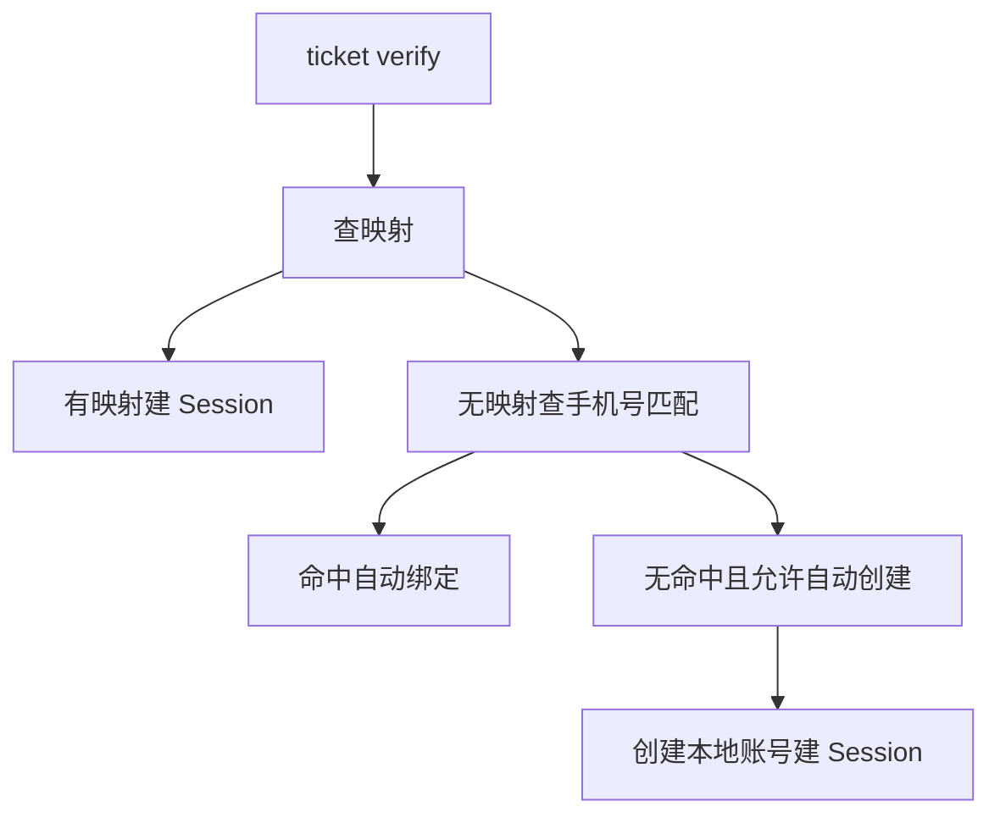
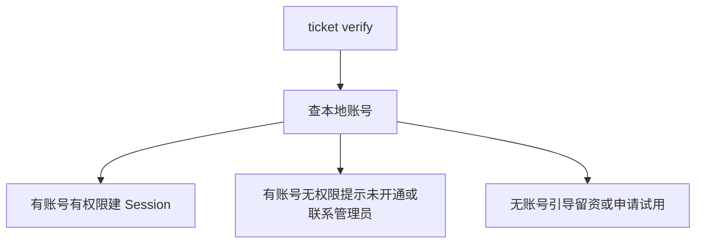
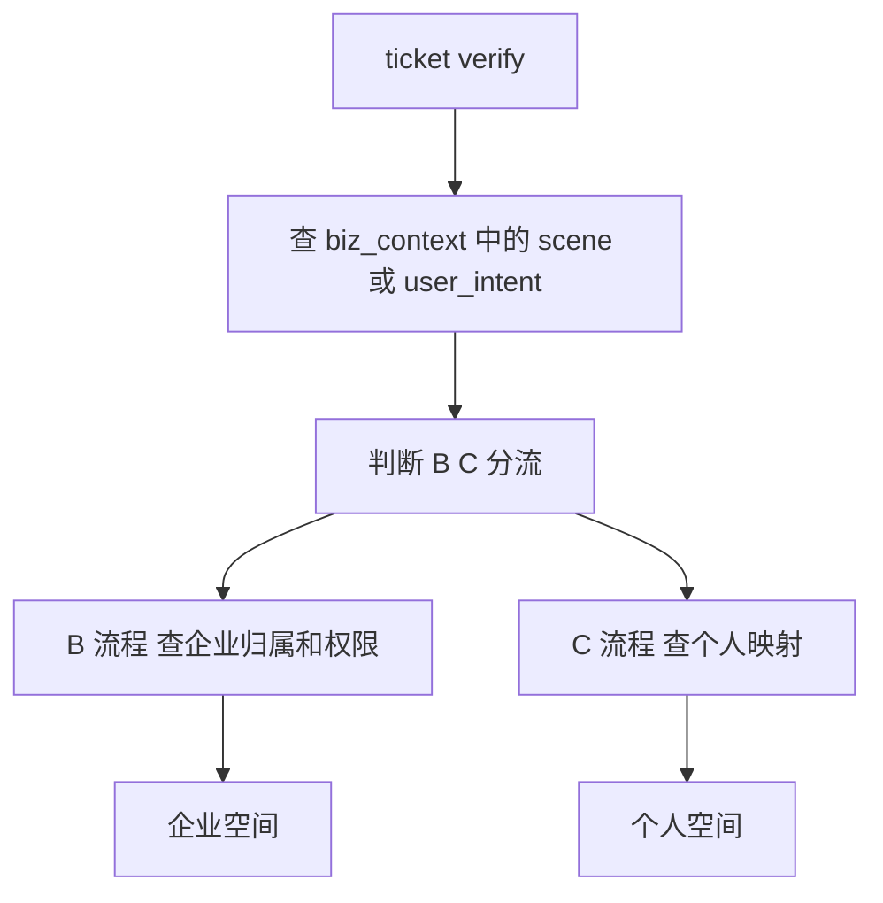
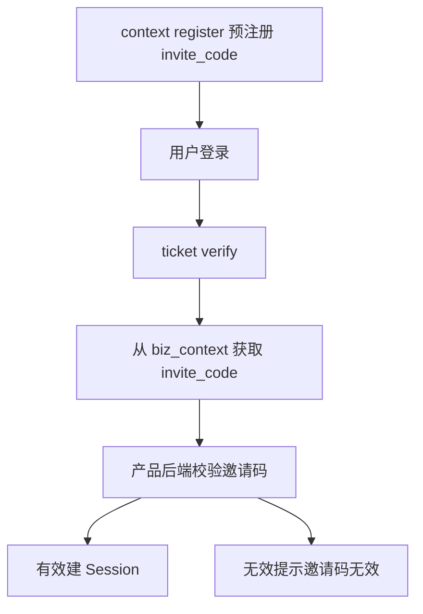
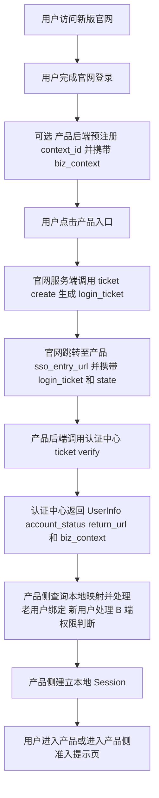
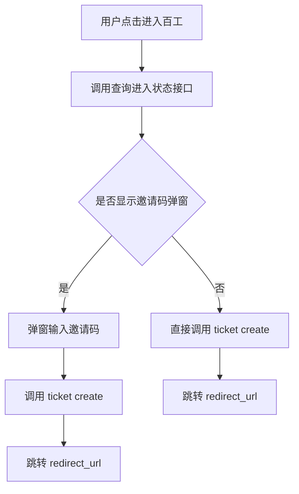
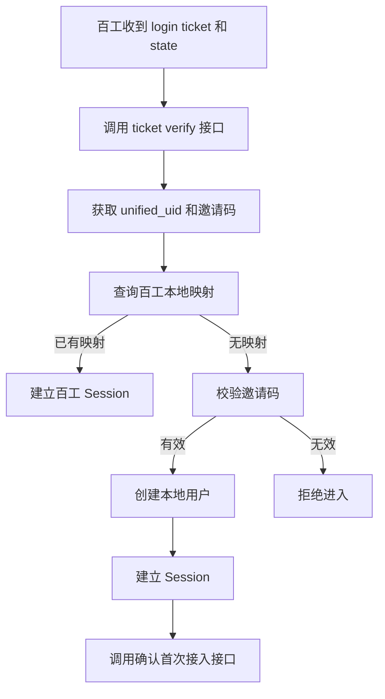

# 亦庄登录sso

## 项目背景与建设范围

### 建设背景

新版百融官网升级后，将承担百系产品统一入口职能。官网不仅用于品牌展示与产品导航，还需逐步承接百系产品的统一注册、统一登录、统一认证与统一身份识别能力。

当前百系产品普遍存在独立登录入口、独立账号体系、独立认证方式等现状，导致用户从官网进入不同产品时存在重复登录、身份割裂、状态不统一等问题，官网无法形成统一用户承接链路。

为解决上述问题，需建设统一登录认证授权中心，作为官网统一身份基础设施，对内输出标准化认证能力，对外形成统一登录入口。

当前新版官网统一认证中心（br-auth-center）已完成首期核心能力建设，支持手机号/邮箱注册登录、统一 UID 管理、SSO 票据颁发与校验、业务上下文透传、限流、防重放及审计脱敏等安全能力。

### 建设目标

本项目建设目标为建设统一登录认证授权中心，实现以下能力：

| 目标 | 说明 |
| --- | --- |
| 官网统一身份入口 | 用户在新版官网完成注册/登录后，可跳转进入任意百系产品 |
| 统一注册与统一登录 | 形成官网统一注册、统一登录入口能力 |
| 统一认证与统一授权 | 对内输出标准化认证与授权能力 |
| 统一身份标识 | 每个官网用户拥有全局唯一 `unified_uid`，作为跨产品身份锚点 |
| SSO / SLO | 支持单点登录（SSO）与单点登出（SLO）能力 |
| SSO 票据链路 | 官网颁发 `login_ticket`，产品后端校验后换取 UserInfo |
| biz_context 透传 | 产品预注册的业务上下文（如邀请码、推荐码、场景标记）在用户登录后原样回传 |
| 安全加固 | 提供限流、`nonce` 防重放、审计脱敏等安全能力 |

### 首期接入范围

本期认证中心 SSO 能力承接以下场景：

- 用户从新版官网入口点击进入百系产品。

- 用户在官网完成注册或登录后，由官网引导跳转至产品。

- 产品新增导流入口（如落地页、推广链接、活动页）接入官网统一登录。

- 产品通过预注册邀请链接、推荐链接传递业务上下文。

- 产品的深链场景（如面试任务、项目协作、专家入驻等）通过官网认证中心完成身份核验。

对于邀请制或需要首次接入识别的产品，认证中心可维护轻量首次接入状态，用于标识某个 `unified_uid` 是否已完成某个 `product_code` 的首次接入，状态包括：

- `CONNECTED`

- `NOT_CONNECTED`

### 首期不接入范围

首期建设遵循“新增链路接入、原入口可保留”的范围原则。首期不要求产品将原有登录入口全部迁移到官网，认证中心提供的是新增链路能力。

以下场景首期不要求接入或迁移至官网统一认证中心：

- 已有企业客户正在使用的产品后台登录入口。

- 小程序、App、PC 客户端等既有登录入口。

- 企业管理员分发账号后员工使用的内部入口。

- 存在复杂租户审批、邀请码校验、企业邮箱校验的现有入口。

- 存量客户已收藏的产品后台地址。

### 非建设范围与职责边界

本项目不包含以下建设内容：

- 统一产品业务权限。

- 统一租户体系。

- 统一角色体系。

- 统一菜单体系。

- 统一账号库合并。

职责边界如下：

- 认证中心负责维护统一身份认证能力及必要的轻量状态，包括首次接入状态（`CONNECTED` / `NOT_CONNECTED`）。

- 产品侧负责邀请码有效性校验、产品本地账号维护，以及角色、权限等业务能力维护。

## 建设原则与职责边界

### 建设原则

统一登录认证授权中心的建设应遵循以下原则：

1. **统一认证，产品自治**：统一登录认证授权中心负责统一身份识别、登录认证与授权能力建设；各产品保留自身账号体系及权限体系，不因接入统一认证中心而失去业务自治能力。
2. **渐进式推进**：允许各产品在过渡阶段保留现有登录方式作为入口；统一登录认证授权中心应逐步演进为官网主登录链路。

### 认证中心职责

统一登录认证授权中心负责以下身份层能力：

- 用户注册
- 用户登录
- 统一登录认证授权
- 统一 UID 管理
- 票据签发
- UserInfo 服务
- 单点登录（SSO）
- 登录审计

统一认证中心负责身份层统一，不替代各产品业务系统。

### 职责边界与非职责范围

各产品继续负责以下本地业务与权限能力：

- 本地账号
- 本地 Session
- 租户
- 角色
- 菜单
- 数据权限
- 业务权限

认证中心不负责以下事项，相关能力应由产品侧承担或作为后续增强项处理：

| 不做的事 | 约束说明 | 责任归属 |
| --- | --- | --- |
| 创建产品本地账号 | 认证中心不得建设产品账号表 | 产品侧 |
| 维护 UID ↔ 本地账号映射 | 认证中心不存储 `local_user_id` | 产品侧 |
| 建立产品 Session | 认证中心不颁发产品 JWT/Cookie | 产品侧 |
| 校验邀请码/推荐码有效性 | 认证中心仅透传，不校验业务含义 | 产品侧 |
| 校验企业邮箱/企业代码 | 认证中心不验证企业身份 | 产品侧 |
| 维护租户/组织/角色/权限 | 认证中心不建设相关业务模型 | 产品侧 |
| 判断是否有产品使用权限 | 认证中心仅返回身份信息，不负责产品准入判定 | 产品侧 |
| 实现 OAuth2/OIDC | 首期不实现，作为后续增强项处理 | 后续增强 |
| 全局登出 | 首期不强制，作为后续增强项处理 | 后续增强 |
| 第三方登录 | 首期不实现，作为后续增强项处理 | 后续增强 |

除统一身份识别与认证相关能力外，凡属于产品业务语义、产品资源访问控制、产品会话管理的事项，均不应由统一认证中心承担。

## 用户与接入模式

### 用户身份模型

系统应支持以下用户身份形态：

- C 端用户：个人用户，支持统一注册与登录。
- B 端用户：企业管理员、企业成员。
- B+C 混合身份用户：支持同一用户在统一身份下承载多身份场景。

`user_type` 用于表示认证中心侧识别到的身份线索，取值如下：

- `UNKNOWN`：未知或暂未识别；
- `PERSONAL`：个人身份线索；
- `ENTERPRISE_MEMBER`：企业成员身份线索。

约束：

- `user_type` 不代表用户已经拥有某产品的 B 端权限。
- 用户是否允许进入 B 端后台，必须由产品侧基于本地账号、企业租户及角色权限自行判断。

### 产品接入模式定义

`product_context.product_user_mode` 表示产品用户模式，接口响应中返回接口枚举值，代码判断必须使用接口枚举值。

| 接口枚举值 | 业务展示值 | 说明 |
| --- | --- | --- |
| C | C | 面向个人用户 |
| B | B | 面向企业用户 |
| B_PLUS_C | B+C | 同时支持个人和企业 |
| INVITE_ONLY | 邀请制 | 邀请码 / 灰度准入 |

`product_user_mode` 与 `user_type` 属于不同维度：

- `product_user_mode` 表示产品支持的用户接入模式；
- `user_type` 表示认证中心识别到的身份线索；
- 不得以 `user_type` 直接替代产品侧权限判断。

### 各接入模式的准入原则与处理流程

#### C 端产品

适用特征：

- 面向个人用户；
- 官网注册用户可尝试进入；
- 产品侧按 `unified_uid` 查询映射；
- 无映射时可按产品策略自动创建本地账号；
- 原登录入口首期可继续保留。

推荐接入策略：



#### B 端产品

核心原则：官网注册登录 ≠ 自动开通 B 端产品权限

适用特征：

- 面向企业用户；
- `ticket verify` 成功后，仍需查询本地账号及 B 端权限；
- 无账号用户不得直接进入产品后台；
- 应引导用户执行留资、申请试用或联系管理员。

推荐接入策略：



#### B+C 混合产品

适用特征：

- 同一产品同时支持个人用户和企业用户；
- 产品根据 UID 和 `biz_context` 决定进入个人空间或企业空间；
- 可通过 `biz_context` 传递用户进入场景标记。

推荐接入策略：



#### INVITE_ONLY（邀请制/灰度产品）

适用特征：

- 通过 `biz_context` 携带邀请码 `invite_code`；
- 认证中心只透传邀请码，不校验邀请码有效性；
- 产品后端收到邀请码后，必须自行校验其有效性。

推荐接入策略：



## 总体架构与核心能力设计

### 总体架构

系统应采用如下统一接入架构：

```text
官网统一入口 → 统一登录认证授权中心 → 百系产品 → 本地账号映射 + 产品权限体系
```

在该架构下，统一认证中心负责统一身份认证与票据签发，各产品保留本地账号体系、会话体系及产品权限体系。统一认证中心不直接替代产品本地账号。

### 统一身份与本地账号映射

所有用户在统一认证中心内应拥有全局唯一身份标识 `Unified UID`。

各产品应通过映射关系 `Unified UID ↔ Local User ID` 将统一身份与产品本地账号关联。

统一认证中心与产品本地账号体系的职责边界如下：
- 统一认证中心负责用户统一身份标识与认证结果输出；
- 产品负责维护本地账号、产品权限、会话状态及准入判断；
- 产品不得假定统一认证中心中的身份标识可直接替代本地账号主键。

### 首次绑定机制

用户首次通过官网进入产品时，产品侧应按照以下规则处理账号绑定：
- 已存在本地账号则绑定本地账号；
- 不存在本地账号则创建本地账号；
- 存在冲突则进入冲突处理流程。

首次绑定机制应适用于产品处理老用户绑定场景，即产品需要定义 `unified_uid` 与已有账号的关联策略。该策略可根据产品情况实现，但不得绕过冲突处理。

### 产品侧接入职责

产品侧必须完成以下接入能力：

| 任务 | 说明 | 是否必须 |
| --- | --- | --- |
| 提供 `sso_entry_url` | 接收 `login_ticket` + `state` 的 HTTP GET 回调地址 | 必须 |
| 调用 `ticket/verify` | 后端调用认证中心校验 `ticket`，换取 `UserInfo` | 必须 |
| 维护 `unified_uid ↔ local_user_id` 映射 | 产品自己的账号映射表 | 必须 |
| 建立产品本地 Session | 产品自己颁发和管理 JWT/Cookie | 必须 |
| 处理 `return_url` 跳转 | 登录成功后跳转到正确页面 | 必须 |
| 处理 `biz_context` | 从 verify 响应中读取并处理业务上下文 | 视产品需求 |
| 处理 B 端权限判断 | 查询本地账号是否有 B 端准入权限 | B 端产品必须 |
| 处理老用户绑定 | `unified_uid` 与已有账号的关联策略 | 视产品情况 |
| 调用 `context/register` | 预注册 `biz_context` | 有业务上下文时使用 |
| 保护 `product_access_key` | 只存后端，不入前端、不入日志 | 必须 |

产品侧会话管理要求如下：
- 产品应自行颁发和管理本地 Session；
- 本地 Session 可采用 JWT 或 Cookie；
- 统一认证中心完成认证后，产品仍需基于本地账号建立自身登录态。

产品侧安全要求如下：
- `product_access_key` 只允许存储在后端；
- `product_access_key` 不得进入前端；
- `product_access_key` 不得写入日志；
- `ticket/verify` 必须由产品后端发起，不得由前端直接调用。

### 认证中心能力设计

统一认证中心应提供以下能力：

| 能力 | 说明 |
| --- | --- |
| 注册/登录 | 手机号、邮箱注册与登录 |
| 统一 UID | 全局唯一 `unified_uid` |
| `login_ticket` | 一次性、短时效（5 分钟）的 SSO 票据 |
| ticket 校验 | 产品后端用 `product_access_key` 换取 `UserInfo` |
| `UserInfo` | `unified_uid`、`user_type`、脱敏手机号/邮箱、`account_status`、注册来源 |
| `biz_context` 透传 | 预注册的业务上下文原样透传，不解析 |
| `account_status` | `ACTIVE` / `DISABLED` / `CANCELLED` |
| `context/register` | 支持产品预注册业务上下文，返回 `context_id` |
| 限流保护 | 5 类接口按分钟桶限流（HTTP 429） |
| nonce 防重放 | `ticket verify` 防止重放攻击 |
| 审计日志 | 认证侧事件审计，敏感字段脱敏 |

关于 `login_ticket`，系统应满足以下约束：
- `login_ticket` 必须为一次性票据；
- `login_ticket` 时效必须为 5 分钟；
- 产品仅可通过后端校验票据并换取用户信息。

关于 `UserInfo`，认证中心至少应返回以下信息：
- `unified_uid`
- `user_type`
- 脱敏手机号或邮箱
- `account_status`
- 注册来源

关于业务上下文处理，系统应满足以下要求：
- 产品在存在业务上下文时可调用 `context/register` 进行预注册；
- 认证中心返回 `context_id`；
- 已预注册的 `biz_context` 在后续流程中应原样透传；
- 认证中心不得解析业务上下文内容。

关于安全与治理能力，认证中心应满足以下要求：
- 对 5 类接口实施按分钟桶限流；
- 超出限流时返回 HTTP 429；
- `ticket verify` 应支持基于 nonce 的防重放机制；
- 认证侧应记录事件审计日志；
- 审计日志中的敏感字段必须脱敏。

## 核心业务流程与接入链路

### 业务目标与适用场景

用户在官网完成统一注册或登录后，系统应建立统一身份状态。

目标：用户在官网完成登录后，从官网进入产品时应免二次登录。

当用户直接访问产品且不存在有效产品本地会话时，产品应引导用户进入统一认证流程，认证完成后回跳产品并继续后续接入处理。

### 官网进入产品的单点登录链路

官网登录后进入产品的标准单点登录链路如下：



链路约束：

- `ticket/create` 由官网侧发起，产品侧通常不直接调用。

- 官网跳转至产品时，应携带 `login_ticket` 和 `state`。

- 产品后端收到 `login_ticket` 后，应调用统一认证中心的 `ticket verify` 接口完成票据校验。

- 认证中心校验成功后，应向产品侧返回用户信息，以及 `account_status`、`return_url`、`biz_context` 等接入处理所需数据。

- 产品侧应根据本地映射关系区分已存在用户与新用户，并完成老用户绑定处理、新用户处理及 B 端权限判断。

- 产品侧在完成准入判断后，应建立本地 Session；若满足准入条件则允许进入产品，否则进入产品侧准入提示页。

官网进入产品的简化链路可表示为：

```text
官网 → 统一认证中心 → 产品侧 → 本地 Session
```

### 业务上下文与前端进入前置流程

当存在邀请码、推荐码或活动业务上下文时，产品后端建议在用户点击产品入口前先调用 `context/register` 进行预注册，并生成可关联的 `context_id` 或业务上下文。

从官网标准入口进入且无产品侧业务上下文时，可跳过预注册。

涉及业务上下文的前端引导流程如下：



前置交互要求：

- 前端在用户点击进入产品后，应先调用进入状态查询接口，以判断是否需要显示邀请码弹窗。

- 若需要邀请码，前端应弹窗收集邀请码后再发起后续登录票据创建。

- 若不需要邀请码，前端可直接发起 `ticket create`。

- 前端在获取 `redirect_url` 后，应跳转至对应地址以继续单点登录流程。

### 产品后端接入处理与准入分支

产品接收到官网跳转携带的 `login_ticket` 和 `state` 后，应执行以下后端接入处理流程：



后端处理要求：

- 产品后端应接收并解析 `login_ticket` 与 `state`。

- 产品后端应调用 `ticket verify` 接口校验登录票据，并获取统一身份标识（如 `unified_uid`）以及邀请码等上下文信息。

- 产品后端应查询本地用户映射关系。

- 若已存在本地映射，应直接建立本地 Session。

- 若不存在本地映射，应校验邀请码。

- 邀请码有效时，产品侧应创建本地用户并建立 Session。

- 新用户首次完成接入后，产品侧应调用首次接入确认接口。

- 邀请码无效时，产品侧应拒绝进入。

### 产品直接访问回跳流程

产品直接访问的回跳链路如下：

```text
产品 → 统一认证中心 → 登录 → 回跳产品
```

处理要求：

- 用户直接访问产品时，若产品侧不存在有效本地 Session，应跳转统一认证中心。

- 用户在统一认证中心完成登录后，应回跳产品入口。

- 产品在接收回跳参数后，应继续执行票据校验、本地映射查询、准入判断及 Session 建立流程。

## 接口能力与数据模型

### 对外接口能力

统一登录认证授权中心需向各产品提供以下能力与配置：

- `client_id`
- `client_secret`
- `redirect_uri` 配置
- `logout_uri` 配置
- 访问票据
- UserInfo
- SSO
- SLO
- 登录审计能力

### 接口定义

### 查询产品进入状态

| 字段 | 值 |
| --- | --- |
| 方法 | GET |
| 路径 | `/api/sso/product-entry/status` |
| 认证 | `Authorization: Bearer {session_token}`（官网登录用户） |
| 参数 | `product_code`（query string，必填） |

#### 业务逻辑

1. 校验 `session_token`，获取 `unified_uid`。
2. 查询产品配置：
   - 不存在：返回 `PRODUCT_INVALID`
   - 已禁用：返回 `PRODUCT_DISABLED`
3. 如果 `require_invite_code = false`：`action = CREATE_TICKET_DIRECTLY`
4. 如果 `require_invite_code = true`：
   - 查询 `auth_product_user_access` 是否存在 `CONNECTED` 记录
   - 存在：`action = CREATE_TICKET_DIRECTLY`
   - 不存在：`action = SHOW_INVITE_DIALOG`

#### 成功响应：需要弹邀请码

```json
{
  "code": "SUCCESS",
  "data": {
    "product_code": "baigong",
    "product_name": "百工",
    "require_invite_code": true,
    "invite_required_for_current_user": true,
    "access_status": "NOT_CONNECTED",
    "action": "SHOW_INVITE_DIALOG",
    "sso_entry_url": "https://saibotan-pre.100credit.cn/login"
  }
}
```

#### 成功响应：不需要弹邀请码

```json
{
  "code": "SUCCESS",
  "data": {
    "product_code": "baigong",
    "product_name": "百工",
    "require_invite_code": true,
    "invite_required_for_current_user": false,
    "access_status": "CONNECTED",
    "action": "CREATE_TICKET_DIRECTLY",
    "sso_entry_url": "https://saibotan-pre.100credit.cn/login"
  }
}
```

#### 错误码

| 错误码 | 说明 |
| --- | --- |
| SESSION_INVALID | 未登录或 session 过期 |
| PRODUCT_INVALID | 产品不存在 |
| PRODUCT_DISABLED | 产品已禁用 |
| PARAM_INVALID | `product_code` 为空 |

### 确认产品首次接入

| 字段 | 值 |
| --- | --- |
| 方法 | POST |
| 路径 | `/api/sso/product-entry/confirm` |
| 认证 | `Authorization: Bearer {product_access_key}`（产品后端） |
| Content-Type | `application/json` |

#### 请求体

```json
{
  "product_code": "baigong",
  "unified_uid": "{unified_uid}",
  "access_status": "CONNECTED",
  "bind_source": "INVITE_CODE"
}
```

| 字段 | 类型 | 必须 | 说明 |
| --- | --- | --- | --- |
| `product_code` | string | ✅ | 产品编码 |
| `unified_uid` | string | ✅ | 统一用户 ID |
| `access_status` | string | ✅ | P0 仅支持 `CONNECTED` |
| `bind_source` | string | ❌ | 接入来源：`INVITE_CODE` / `ADMIN` / `IMPORT` / `UNKNOWN` |

#### 鉴权逻辑

1. 校验 `Authorization: Bearer {product_access_key}`。
2. `product_access_key` 必须属于请求体中的 `product_code`。
3. 产品必须处于 `ENABLED` 状态。
4. 鉴权失败时返回 `PRODUCT_ACCESS_DENIED`。

#### 业务逻辑

1. 校验 `unified_uid` 对应用户存在。
2. 校验 `access_status = CONNECTED`。
3. Upsert `auth_product_user_access`：
   - 不存在：插入，`first_connected_at = now`，`last_connected_at = now`
   - 已存在：更新 `access_status = CONNECTED`，`last_connected_at = now`，不覆盖 `first_connected_at`

#### 成功响应

```json
{
  "code": "SUCCESS",
  "data": {
    "product_code": "baigong",
    "unified_uid": "{unified_uid}",
    "access_status": "CONNECTED"
  }
}
```

#### 错误码

| 错误码 | 说明 |
| --- | --- |
| PRODUCT_ACCESS_DENIED | `product_access_key` 错误 |
| PRODUCT_INVALID | 产品不存在 |
| PRODUCT_DISABLED | 产品已禁用 |
| USER_NOT_FOUND | `unified_uid` 不存在 |
| PARAM_INVALID | 参数错误或 `access_status` 非 `CONNECTED` |

### 数据模型与存储约束

```sql
CREATE TABLE auth_product_user_access (
  id BIGINT UNSIGNED NOT NULL AUTO_INCREMENT,
  product_code VARCHAR(64) NOT NULL,
  unified_uid VARCHAR(64) NOT NULL,
  access_status VARCHAR(32) NOT NULL COMMENT 'CONNECTED / REVOKED',
  bind_source VARCHAR(32) DEFAULT NULL,
  first_connected_at DATETIME(3),
  last_connected_at DATETIME(3),
  created_at DATETIME(3) NOT NULL DEFAULT CURRENT_TIMESTAMP(3),
  updated_at DATETIME(3) NOT NULL DEFAULT CURRENT_TIMESTAMP(3) ON UPDATE CURRENT_TIMESTAMP(3),
  is_deleted TINYINT NOT NULL DEFAULT 0,
  PRIMARY KEY (id),
  UNIQUE KEY uk_product_uid (product_code, unified_uid)
);
```

不存储以下信息：

- 邀请码
- `local_user_id`
- `local_tenant_id`
- 权限

## 登录体验与接入要求

### 登录体验要求

- 用户完成一次登录后，应可访问已接入产品，无需在各接入产品中重复登录。
- 用户从官网进入已接入产品时，应支持免二次登录。
- 官网、统一认证中心及各接入产品之间的登录状态应保持统一。
- 首次账号绑定流程应标准化，接入产品应支持首次绑定能力。
- 登录异常应可控，相关异常处理需纳入统一认证接入方案。

### 登出机制

### 本地登出

仅退出当前产品，不影响官网及其他产品的登录状态。

### 全局登出

退出统一认证中心，同时清理官网及接入产品的登录状态。

### 产品接入能力要求

接入产品应满足以下能力要求：

- 支持统一认证中心登录。
- 支持官网免二次登录。
- 支持 Unified UID 映射。
- 支持首次绑定。
- 支持本地登出。
- 支持全局登出。
- 满足统一安全规范。

### 接入迁移与登录入口保留要求

- 首期不要求产品迁移现有登录入口，原有登录入口可继续保留。
- 官网统一认证中心主要承接新增登录链路，包括官网导流、活动、邀请、深链等场景。
- 存量用户当前使用的产品后台登录入口，首期无需改动。
- 产品完成联调验收后，可按自身节奏逐步扩大接入范围。
- 统一认证中心不强制要求任何产品立即迁移全量登录入口。

## 安全规范与控制要求

### 授权请求与回调安全

所有 `redirect_uri` 必须实行统一白名单管理，仅允许预先登记的回调地址参与授权或认证跳转。

所有授权请求必须校验 `state` 参数，以防止 CSRF 攻击。

涉及 ticket 或验证请求的 `nonce` 必须每次唯一，并使用新的随机值生成，不得复用。

### 凭证、令牌与密钥保护

`access_token`、`refresh_token`、`session_token`、`product_access_key`、`client_secret` 等敏感凭证禁止暴露于前端代码、浏览器可见 URL 或日志中。

`client_secret` 仅允许由服务端保存。

`product_access_key` 仅允许后端持有和使用，不得进入前端代码、不入 URL、不入日志。

`login_ticket` 仅用于换取 `UserInfo`，不得作为长期登录态或登录凭证使用。

产品侧必须建立本地 Session，不得依赖 `login_ticket` 作为登录凭证。

### 传输安全

生产环境必须全链路使用 HTTPS。

调用认证中心时，生产环境禁止使用 HTTP。

### 接口鉴权与访问控制

`status` 接口必须使用官网 `session_token` 进行鉴权，且只允许返回当前用户自己的状态信息。

`confirm` 接口必须使用 `product_access_key` 进行鉴权，且仅允许合法产品后端调用。

### 日志与数据存储安全

日志必须进行脱敏处理，不得记录敏感信息。

日志中不得打印 `session_token`、`product_access_key`、邀请码。

不得存储邀请码明文。

不得存储 `local_user_id`、`local_tenant_id`。

## 联调验证与验收要求

### 联调验证要求

- 联调开始前，双方应确认联调环境地址与 `product_access_key` 配置正确可用。

- 联调应优先验证正向链路：`context/register` → `ticket/create` → `ticket/verify`。

- 联调过程中应覆盖特殊业务场景验证，包括 B 端场景、邀请制场景等。

- 联调过程中应覆盖异常场景验证，至少包括：
  - 票据已使用或重复使用；
  - `state` 不一致；
  - `nonce` 重放；
  - `product_access_key` 无效。

- 联调过程中应验证审计日志不包含明文敏感信息。

### 验收要求

#### 功能验收

- 官网统一注册登录应完成并可正常使用。
- 用户从官网进入产品时应免二次登录。
- Unified UID 应生效。
- 首次绑定流程应可正常完成。
- SSO 应生效。
- SLO 应生效。
- 正向链路验收应至少覆盖以下步骤并全部成功：
  - `context/register`
  - `login`
  - `ticket/create`
  - `ticket/verify`
  - 建立 Session
  - `return_url` 跳转

#### 安全验收

- `redirect_uri` 应实施白名单校验。
- 应执行 `state` 校验。
- Token 应满足安全要求。
- `client_secret` 应安全存储与使用。
- 系统应使用 HTTPS。
- 日志应进行脱敏处理。
- 异常链路验收应至少覆盖以下场景：
  - 票据重用；
  - `state` 不符；
  - `nonce` 重放；
  - `product_access_key` 无效。
- 审计日志中不得出现敏感信息明文。

### 已验证能力基线

| 能力 | 状态 |
| --- | --- |
| 手机号/邮箱注册登录 | 已验证 |
| context/register | 已验证 |
| ticket/create（带 context_id） | 已验证 |
| ticket/verify（返回 UserInfo + biz_context） | 已验证 |
| mock-product-server 完整 E2E 链路 | 已验证 |
| nonce 防重放 | 已验证 |
| 限流（5 类接口） | 已验证 |
| 审计日志脱敏 | 已验证 |
| Actuator 最小暴露 | 已验证 |
| product_access_key 认证 | 已验证 |
