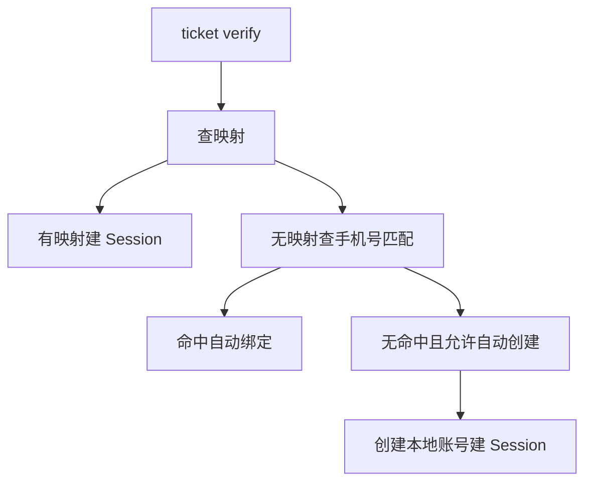
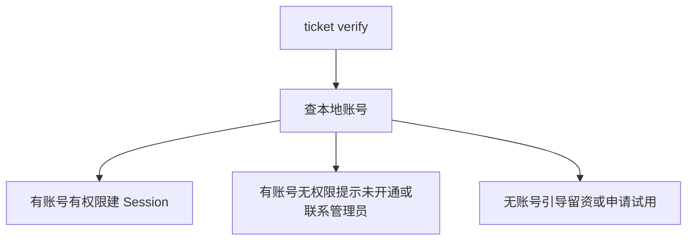
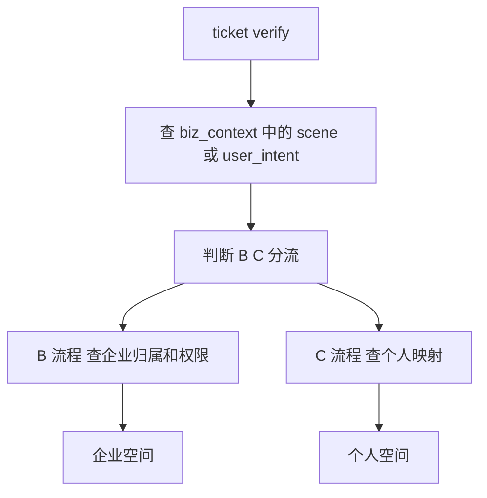
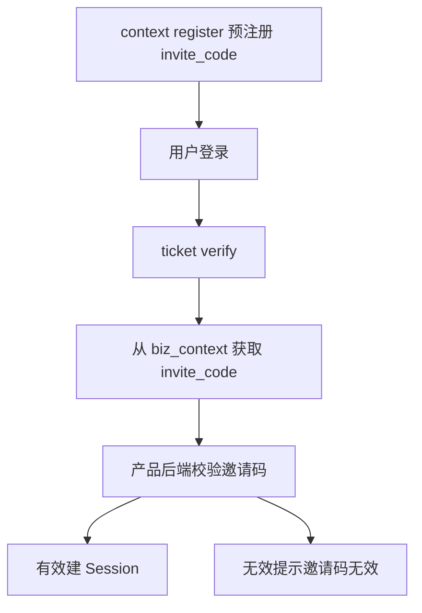
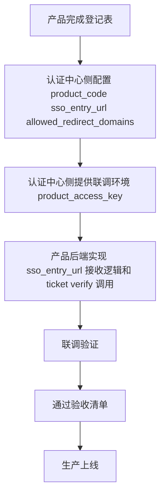
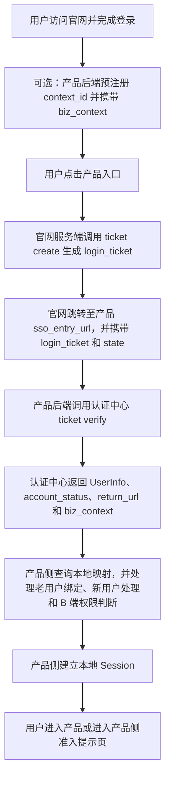
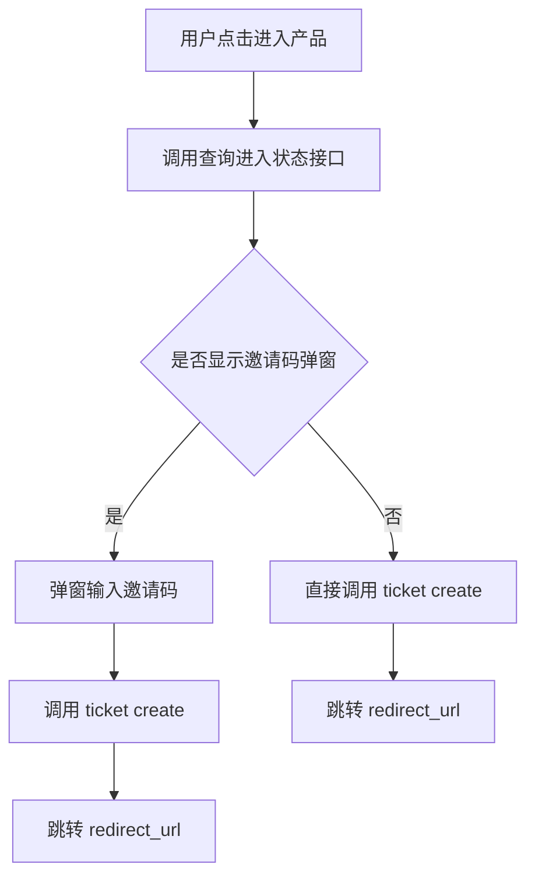
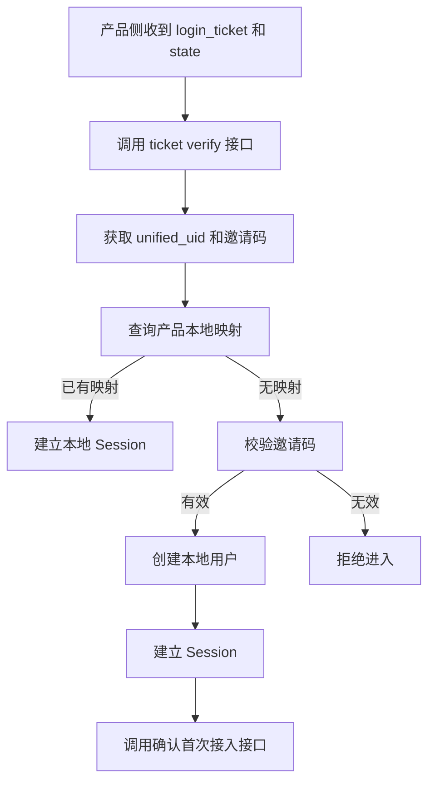

# 亦庄登录sso

## 项目背景、目标与范围边界

### 项目背景与建设必要性

新版官网将作为百系产品统一入口，承担品牌展示、产品导航以及统一身份承接能力。当前各产品存在独立登录入口、独立账号体系和独立认证方式，导致用户从官网进入不同产品时出现重复登录、身份割裂和登录状态不统一等问题，官网无法形成统一用户承接链路。

为解决上述问题，需建设统一登录认证授权中心，作为官网统一身份基础设施，对内输出标准化认证能力，对外形成统一登录入口。

首期能力建设已覆盖以下统一身份基础能力：

- 支持手机号/邮箱注册登录
- 统一 UID 管理
- SSO 票据颁发与校验
- 业务上下文透传
- 限流、防重放、审计脱敏等安全能力

### 建设目标

本项目建设目标如下：

| 目标 | 说明 |
| --- | --- |
| 官网统一身份入口 | 用户在新版官网完成注册/登录后，可跳转进入任意百系产品 |
| 统一 UID | 每个官网用户拥有全局唯一 `unified_uid`，作为跨产品身份锚点 |
| SSO 票据链路 | 官网颁发 `login_ticket`，产品后端校验后换取 `UserInfo` |
| biz_context 透传 | 产品可预注册业务上下文（如邀请码、推荐码、场景标记），用户登录后原样回传 |
| 安全加固 | 提供限流、`nonce` 防重放、审计脱敏等安全能力 |

项目总体目标包括：统一注册、统一登录、统一认证、统一授权、统一身份标识、单点登录（SSO）、单点登出（SLO）以及官网统一入口能力。

### 本期建设范围

本期统一认证中心能力纳入以下场景：

- 用户从新版官网入口点击进入百系产品
- 用户在官网完成注册或登录后，由官网引导跳转到产品
- 产品通过新增导流入口接入官网统一登录，例如落地页、推广链接、活动页（可选）
- 产品通过预注册邀请链接或推荐链接透传业务上下文（可选）
- 产品的深链场景可选择通过官网认证中心完成身份核验，例如面试任务、项目协作、专家入驻等（可选）

针对邀请制或准入控制类产品，认证中心可维护轻量首次接入状态，用于标识某个 `unified_uid` 是否已完成某个 `product_code` 的首次接入。

### 非建设范围与迁移边界

本项目及首期接入不包含以下内容：

- 统一产品业务权限
- 统一租户体系
- 统一角色体系
- 统一菜单体系
- 统一账号库合并

以下场景首期不要求迁移到官网统一认证中心：

- 已有企业客户正在使用的产品后台登录入口
- 小程序、App、PC 客户端等既有登录入口
- 企业管理员分发账号后员工使用的内部入口
- 有复杂租户审批、邀请码校验、企业邮箱校验的现有入口
- 存量客户已收藏的产品后台地址

重要原则：首期不要求产品将原有登录入口全部迁移到官网，原入口可继续保留；统一认证中心提供的是新增链路能力，而非对所有既有入口的替代。

### 职责边界

认证中心与产品侧职责边界如下：

| 责任方 | 职责 |
| --- | --- |
| 认证中心 | 提供统一注册、统一登录、统一认证、统一身份标识、SSO/SLO、业务上下文透传、安全能力，并可维护首次接入状态（`CONNECTED` / `NOT_CONNECTED`） |
| 产品侧 | 负责校验邀请码有效性，维护本地账号、角色、权限，以及处理产品自身业务准入逻辑 |

认证中心不负责统一各产品业务权限、角色、菜单、租户及本地账号体系治理。

## 方案定位与职责边界

### 核心定位与职责范围

统一登录认证授权中心定位为统一身份层基础能力，负责跨产品的统一身份识别、认证与基础票据能力建设，不替代各产品业务系统本身的账号、权限和会话体系。

统一登录认证授权中心负责以下能力范围：

- 用户注册
- 用户登录
- 统一登录认证授权
- 统一 UID 管理
- 票据签发
- UserInfo 服务
- SSO（单点登录）
- SLO（单点登出）
- 登录审计

### 产品侧职责与保留能力

方案遵循“统一认证，产品自治”原则：统一登录认证授权中心负责统一身份识别与认证授权，各产品继续保留并负责自身账号体系及权限体系。

各产品继续负责的能力包括但不限于：

- 本地账号
- 本地 Session
- 租户
- 角色
- 菜单
- 数据权限
- 业务权限

### 认证中心不承担的职责

以下事项不属于统一登录认证授权中心的职责范围：

| 不做的事 | 说明 | 责任方 |
| --- | --- | --- |
| 创建产品本地账号 | 不在认证中心建设产品账号表 | 产品侧 |
| 维护 UID 与本地账号映射 | 不存储 `local_user_id` | 产品侧 |
| 建立产品 Session | 不颁发产品侧 JWT 或 Cookie | 产品侧 |
| 校验邀请码或推荐码有效性 | 仅透传相关信息，不校验其业务含义 | 产品侧 |
| 校验企业邮箱或企业代码 | 不验证企业身份 | 产品侧 |
| 维护租户、组织、角色、权限模型 | 认证中心不建设上述业务模型 | 产品侧 |
| 判断是否具备产品使用权限 | 认证中心仅返回身份信息，不做产品准入判断 | 产品侧 |
| 实现 OAuth2/OIDC | 首期不实现，作为后续增强能力 | 后续增强 |
| 全局登出 | 首期不强制，作为后续增强能力 | 后续增强 |
| 第三方登录 | 首期不实现，作为后续增强能力 | 后续增强 |

## 用户与接入模式

### 用户身份模型

系统应支持统一身份体系下的多类用户与多身份场景，用户身份模型如下：

- C 端用户：个人用户，统一注册与登录。
- B 端用户：企业管理员、企业成员。
- B+C 混合身份用户：支持同一用户在统一身份下承载多身份场景。

`user_type` 用于表示认证中心侧识别到的身份线索，取值如下：

- `UNKNOWN`：未知或暂未识别；
- `PERSONAL`：个人身份线索；
- `ENTERPRISE_MEMBER`：企业成员身份线索。

约束如下：

- `user_type` 不代表用户已拥有某产品的 B 端权限。
- 产品是否允许用户进入 B 端后台，应由产品侧根据本地账号、企业租户、角色权限自行判断。
- 产品用户模式与 `user_type` 属于不同维度，不得混用。

### 产品接入模式枚举

`product_user_mode` 为产品接入模式枚举，定义如下：

| 接口枚举值 | 业务展示值 | 说明 |
| --- | --- | --- |
| C | C | 面向个人用户 |
| B | B | 面向企业用户 |
| B_PLUS_C | B+C | 同时支持个人和企业 |
| INVITE_ONLY | 邀请制 | 邀请码 / 灰度准入 |

接口响应中 `product_context.product_user_mode` 应返回接口枚举值（如 `B_PLUS_C`）。业务展示可使用“B+C”等展示值，但代码判断必须使用接口枚举值。

### 各接入模式的处理要求

### C 端产品

适用特征：

- 官网注册用户可尝试进入。
- 产品侧按 `unified_uid` 查询本地映射；无映射时可自动创建本地账号。
- 原登录入口首期可继续保留。

推荐接入策略：



### B 端产品

核心原则：官网注册登录 ≠ 自动开通 B 端产品权限。

适用特征：

- `ticket verify` 成功后，还需查询本地是否有账号和 B 端权限。
- 无账号用户不应直接进入产品后台。
- 应引导至留资、申请试用或联系管理员。

推荐接入策略：



### B+C 混合产品

适用特征：

- 同一产品同时支持个人用户和企业用户。
- 产品根据 UID 和 `biz_context` 决定进入个人空间或企业空间。
- 可通过 `biz_context` 传递用户进入场景标记。

推荐接入策略：



### 邀请制 / 灰度产品

适用特征：

- 通过 `biz_context` 携带邀请码 `invite_code`。
- 认证中心只透传邀请码，不校验邀请码有效性。
- 产品后端收到邀请码后，应自行校验是否有效。

推荐接入策略：



### 登录入口保留与迁移原则

原产品登录入口保留与迁移约束如下：

- 首期不要求迁移，原入口可继续保留。
- 官网统一认证中心主要承接新增链路，包括官网导流、活动、邀请、深链等。
- 存量用户正在使用的产品后台登录入口，首期无需改动。
- 产品完成联调验收后，可按自身节奏逐步扩大接入范围。
- 认证中心不强制要求任何产品立即迁移全量登录入口。

### 接入实施路径与配置要求

产品接入实施路径如下：



接入准备要求：

- 认证中心侧应配置 `product_code`、`sso_entry_url`、`allowed_redirect_domains`。
- 产品后端应实现 `sso_entry_url` 接收逻辑和 `ticket verify` 调用。
- `product_access_key` 应通过安全渠道交付。
- 生产密钥应单独分发。

## 总体架构与核心能力设计

### 总体架构

系统总体架构应采用如下接入链路：

```text
官网统一入口 → 统一登录认证授权中心 → 各产品系统 → 本地账号映射 + 产品权限体系
```

统一登录认证授权中心负责统一认证与授权能力输出；各产品系统保留自身本地账号体系和产品权限体系，通过统一身份与本地账号映射完成接入。

### 统一身份与账号映射

所有用户在统一认证中心内必须拥有全局唯一身份标识 `unified_uid`（Unified UID）。

统一认证中心不得直接替代各产品本地账号体系；各产品必须通过如下映射关系建立统一身份与本地账号的关联：

```text
Unified UID ↔ Local User ID
```

各产品的权限判定仍基于自身产品权限体系执行，统一认证中心提供统一身份基础，不直接定义产品内权限。

### 首次绑定机制

用户首次通过官网统一入口进入某产品时，系统应按以下规则处理：

- 若该用户已存在对应产品本地账号，则将 `unified_uid` 与该本地账号绑定；
- 若该用户不存在对应产品本地账号，则为其创建本地账号，并建立 `unified_uid` 与本地账号的映射关系；
- 若绑定过程中出现账号冲突，则不得自动完成绑定，必须进入冲突处理流程。

首次绑定机制应确保每个产品内的本地账号映射关系可被一致识别，并可支持后续单点登录后的本地身份恢复。

### 接入配置与会话能力

统一登录认证授权中心应向各产品提供以下标准接入配置与能力：

- `client_id`
- `client_secret`
- `redirect_uri` 配置
- `logout_uri` 配置
- 单点登录（SSO）
- 单点登出（SLO）
- 登录审计能力

产品接入时应基于上述配置完成认证回调、退出回调及应用身份识别。

### 标准认证输出能力

统一登录认证授权中心应提供以下标准认证与用户信息输出能力：

| 能力 | 说明 |
| --- | --- |
| 注册/登录 | 支持手机号、邮箱注册与登录 |
| 统一 UID | 提供全局唯一 `unified_uid` |
| `login_ticket` | 一次性、短时效（5 分钟）的 SSO 票据 |
| ticket 校验 | 产品后端使用 `product_access_key` 换取 UserInfo |
| UserInfo | 包含 `unified_uid`、`user_type`、脱敏手机号/邮箱、`account_status`、注册来源 |
| `biz_context` 透传 | 对预注册的业务上下文原样透传，不解析 |
| `account_status` | 支持 `ACTIVE` / `DISABLED` / `CANCELLED` |
| `context/register` | 支持产品预注册业务上下文，并返回 `context_id` |
| 限流保护 | 5 类接口按分钟桶限流，超限返回 HTTP 429 |
| `nonce` 防重放 | ticket verify 必须防止重放攻击 |
| 审计日志 | 认证侧事件审计，敏感字段需脱敏 |

其中，访问票据与 UserInfo 输出能力应作为各产品完成登录态建立、用户识别与会话校验的标准依赖。

## 核心业务流程与进入链路

### 统一登录前置条件

用户在官网完成统一注册或登录后，应建立统一身份状态。产品接入官网入口时，应基于统一认证状态完成免二次登录进入产品。

### 官网进入产品链路

官网登录后进入产品的标准链路如下：



标准目标：官网登录后进入产品时，用户不应再次登录。

链路约束：
- `ticket/create` 应由官网侧发起，产品侧通常不直接调用。
- 当存在邀请码、推荐码、活动业务上下文等信息时，建议产品后端先调用 `context/register` 预注册 `context_id` 并携带 `biz_context`。
- 从官网标准入口进入且无产品侧业务上下文时，可跳过预注册步骤。
- 产品侧在完成 `ticket verify` 后，应基于认证中心返回的信息完成本地身份映射、准入判断和 Session 建立。

### 产品直接访问链路

当用户直接访问产品时，应跳转至统一认证中心完成登录，登录成功后再回跳至产品。

直接访问产品的基础链路如下：

```text
产品 → 统一认证中心 → 登录 → 回跳产品
```

回跳后，产品侧应继续执行票据校验、本地映射查询、准入判断和本地 Session 建立，直至用户进入产品或进入准入提示页。

### 前端进入与邀请码分支

当产品入口存在邀请码或推荐码相关准入逻辑时，前端进入链路可按以下流程处理：



前端要求：
- 用户点击进入产品后，应先调用进入状态查询接口，用于判断是否需要展示邀请码弹窗。
- 当需要邀请码时，应在弹窗中采集邀请码后再发起 `ticket create`。
- 当前端获得 `redirect_url` 后，应跳转至该地址完成后续单点登录链路。

### 产品侧票据校验与准入处理

产品侧收到 `login_ticket` 和 `state` 后，应执行后端接入处理流程：



后端要求：
- 产品侧收到官网跳转参数后，应调用 `ticket verify` 校验票据有效性。
- 校验通过后，应至少获取统一身份标识（如 `unified_uid`）以及与当前业务相关的邀请码等上下文。
- 产品侧应先查询本地用户映射；已有映射时，直接建立本地 Session。
- 无本地映射时，应校验邀请码；邀请码有效时创建本地用户并建立 Session。
- 新用户首次完成接入后，应调用首次接入确认接口。
- 邀请码无效时，应拒绝进入产品。

准入结果：
- 通过准入校验的用户可进入产品。
- 未通过准入校验的用户应进入拒绝进入或准入提示处理结果，不得直接进入产品。

## 接口与数据模型设计

### 产品进入状态查询接口

| 字段 | 值 |
| --- | --- |
| 方法 | GET |
| 路径 | `/api/sso/product-entry/status` |
| 认证 | `Authorization: Bearer {session_token}`（官网登录用户） |
| 参数 | `product_code`（query string，必填） |

#### 处理逻辑

1. 校验 `session_token`，获取 `unified_uid`。
2. 查询产品配置：
   - 产品不存在时返回 `PRODUCT_INVALID`；
   - 产品已禁用时返回 `PRODUCT_DISABLED`。
3. 当 `require_invite_code = false` 时，返回 `action = CREATE_TICKET_DIRECTLY`。
4. 当 `require_invite_code = true` 时：
   - 查询 `auth_product_user_access` 是否存在该用户与该产品的 `CONNECTED` 记录；
   - 若存在，返回 `action = CREATE_TICKET_DIRECTLY`；
   - 若不存在，返回 `action = SHOW_INVITE_DIALOG`。

#### 成功响应示例：需要弹邀请码

```json
{
  "code": "SUCCESS",
  "data": {
    "product_code": "baigong",
    "product_name": "百工",
    "require_invite_code": true,
    "invite_required_for_current_user": true,
    "access_status": "NOT_CONNECTED",
    "action": "SHOW_INVITE_DIALOG",
    "sso_entry_url": "https://saibotan-pre.100credit.cn/login"
  }
}
```

#### 成功响应示例：不需要弹邀请码

```json
{
  "code": "SUCCESS",
  "data": {
    "product_code": "baigong",
    "product_name": "百工",
    "require_invite_code": true,
    "invite_required_for_current_user": false,
    "access_status": "CONNECTED",
    "action": "CREATE_TICKET_DIRECTLY",
    "sso_entry_url": "https://saibotan-pre.100credit.cn/login"
  }
}
```

#### 错误码

| 错误码 | 说明 |
| --- | --- |
| SESSION_INVALID | 未登录或 session 过期 |
| PRODUCT_INVALID | 产品不存在 |
| PRODUCT_DISABLED | 产品已禁用 |
| PARAM_INVALID | `product_code` 为空 |

### 产品首次接入确认接口

| 字段 | 值 |
| --- | --- |
| 方法 | POST |
| 路径 | `/api/sso/product-entry/confirm` |
| 认证 | `Authorization: Bearer {product_access_key}`（产品后端） |
| Content-Type | `application/json` |

#### 请求体

```json
{
  "product_code": "baigong",
  "unified_uid": "{unified_uid}",
  "access_status": "CONNECTED",
  "bind_source": "INVITE_CODE"
}
```

| 字段 | 类型 | 必须 | 说明 |
| --- | --- | --- | --- |
| `product_code` | string | ✅ | 产品编码 |
| `unified_uid` | string | ✅ | 统一用户 ID |
| `access_status` | string | ✅ | 仅支持 `CONNECTED` |
| `bind_source` | string | ❌ | 接入来源：`INVITE_CODE` / `ADMIN` / `IMPORT` / `UNKNOWN` |

#### 鉴权逻辑

1. 校验 `Authorization: Bearer {product_access_key}`。
2. `product_access_key` 必须属于请求体中的 `product_code`。
3. 产品状态必须为 `ENABLED`。
4. 鉴权失败时返回 `PRODUCT_ACCESS_DENIED`。

#### 业务逻辑

1. 校验 `unified_uid` 对应用户存在。
2. 校验 `access_status = CONNECTED`。
3. 对 `auth_product_user_access` 执行 Upsert：
   - 记录不存在：插入记录，`first_connected_at = now`，`last_connected_at = now`；
   - 记录已存在：更新 `access_status = CONNECTED`，`last_connected_at = now`，且不得覆盖 `first_connected_at`。

#### 成功响应

```json
{
  "code": "SUCCESS",
  "data": {
    "product_code": "baigong",
    "unified_uid": "{unified_uid}",
    "access_status": "CONNECTED"
  }
}
```

#### 错误码

| 错误码 | 说明 |
| --- | --- |
| PRODUCT_ACCESS_DENIED | `product_access_key` 错误 |
| PRODUCT_INVALID | 产品不存在 |
| PRODUCT_DISABLED | 产品已禁用 |
| USER_NOT_FOUND | `unified_uid` 不存在 |
| PARAM_INVALID | 参数错误或 `access_status` 非 `CONNECTED` |

### 数据模型

```sql
CREATE TABLE auth_product_user_access (
  id BIGINT UNSIGNED NOT NULL AUTO_INCREMENT,
  product_code VARCHAR(64) NOT NULL,
  unified_uid VARCHAR(64) NOT NULL,
  access_status VARCHAR(32) NOT NULL COMMENT 'CONNECTED / REVOKED',
  bind_source VARCHAR(32) DEFAULT NULL,
  first_connected_at DATETIME(3),
  last_connected_at DATETIME(3),
  created_at DATETIME(3) NOT NULL DEFAULT CURRENT_TIMESTAMP(3),
  updated_at DATETIME(3) NOT NULL DEFAULT CURRENT_TIMESTAMP(3) ON UPDATE CURRENT_TIMESTAMP(3),
  is_deleted TINYINT NOT NULL DEFAULT 0,
  PRIMARY KEY (id),
  UNIQUE KEY uk_product_uid (product_code, unified_uid)
);
```

#### 存储约束

- 不存储邀请码。
- 不存储 `local_user_id`。
- 不存储 `local_tenant_id`。
- 不存储权限信息。

## 功能要求与接入实施

### 登录体验与单点登录要求

- 用户完成一次登录后，应可访问已接入产品，无需在各接入产品间重复登录。
- 从官网进入已接入产品时，应支持免二次登录。
- 官网、统一认证中心及各接入产品之间的登录状态应保持一致。
- 产品应支持首次登录时的账号绑定流程，且绑定流程应标准化。
- 产品应具备登录异常处理能力，确保异常场景可控。

### 产品接入能力与登录实施要求

- 产品应支持统一认证中心登录。
- 产品必须提供 `sso_entry_url`，作为接收 `login_ticket` 与 `state` 的 HTTP GET 回调地址。
- 产品后端必须调用 `ticket/verify` 接口校验 `ticket`，并换取 `UserInfo`。
- 产品必须维护 `unified_uid` 与 `local_user_id` 的映射关系，用于本地账号关联。
- 产品必须在登录成功后建立并管理产品本地 Session，可采用 JWT 或 Cookie 机制。
- 产品必须处理 `return_url` 跳转，确保登录成功后能够跳转到正确页面。
- 产品应支持 Unified UID 映射。
- 产品应支持首次绑定能力。
- 当存在业务上下文需求时，产品可调用 `context/register` 预注册 `biz_context`。
- 产品在收到 `ticket/verify` 响应后，可按业务需要读取并处理 `biz_context`。

### 登出机制要求

- 产品应支持本地登出：仅退出当前产品，不影响官网及其他产品的登录状态。
- 产品应支持全局登出：退出统一认证中心，同时清理官网及所有接入产品的登录状态。

### 权限、绑定与安全要求

- 涉及 B 端准入控制的产品，必须在本地查询账号是否具备 B 端权限，并据此执行访问控制。
- 产品应根据自身情况处理老用户绑定，明确 `unified_uid` 与既有账号的关联策略。
- 产品必须满足统一安全规范。
- `product_access_key` 必须仅存储于后端，禁止进入前端，禁止写入日志。

## 安全要求与控制规范

### 认证请求与重放防护

- 所有 `redirect_uri` 必须纳入统一白名单管理，未经登记的回调地址不得使用。
- 所有授权请求必须校验 `state`，用于防止 CSRF。
- `nonce` 必须为一次性随机值；每次发起 `ticket`/`verify` 相关请求时都必须生成新的随机 `nonce`，不得复用。

### 凭证、密钥与令牌保护

- `access_token`、`refresh_token`、`session_token`、`product_access_key`、`client_secret` 禁止暴露于前端代码、浏览器可见 URL 或日志中。
- `client_secret` 仅允许由服务端保存和使用。
- `product_access_key` 仅允许产品后端保存和调用使用，不得进入前端代码，不得出现在 URL 中，不得写入日志。
- `login_ticket` 仅用于换取 `UserInfo`，不得作为长期登录态凭证使用，也不得替代本地会话机制。

### 传输安全

- 生产环境必须全链路使用 HTTPS。
- 调用认证中心时，生产环境禁止使用 HTTP。

### 接口鉴权与会话控制

- `status` 接口必须使用官网 `session_token` 进行鉴权。
- `status` 接口只允许返回当前用户本人的状态，不得返回其他用户信息。
- `confirm` 接口必须使用 `product_access_key` 进行鉴权，且仅允许合法产品后端调用。
- 产品侧必须建立本地 Session，业务登录态不得依赖 `login_ticket` 作为登录凭证。

### 日志与敏感数据存储控制

- 日志必须进行脱敏处理，不得记录敏感信息。
- 日志中不得打印 `session_token`、`product_access_key`、邀请码。
- 系统不得存储邀请码明文。
- 系统不得存储 `local_user_id`、`local_tenant_id`。

## 联调、验收与交付要求

### 联调准备要求

- 联调开始前，双方应确认联调环境地址及 `product_access_key` 配置正确可用。
- 联调应优先验证正向链路的可达性与完整性，再覆盖特殊场景与异常场景。
- 联调过程中应核查审计日志与安全机制是否满足要求，且不得在日志中记录明文敏感信息。

### x

- 应验证以下正向业务链路完整可用：
  - `context/register`
  - `login`
  - `ticket/create`
  - `ticket/verify`
  - 建立 Session
  - 按 `return_url` 完成跳转
- 对接实现应确保以下能力可正常生效：
  - 官网统一注册登录完成
  - 官网进入产品免二次登录
  - Unified UID 生效
  - 首次绑定流程可用
  - SSO 生效
  - SLO 生效
- 联调时应重点验证 `context/register → ticket/create → ticket/verify` 正向链路；如涉及登录态建立与回跳，需继续验证至 Session 建立及 `return_url` 跳转完成。

title":"联调范围与正向链路验证"},{

content=[
