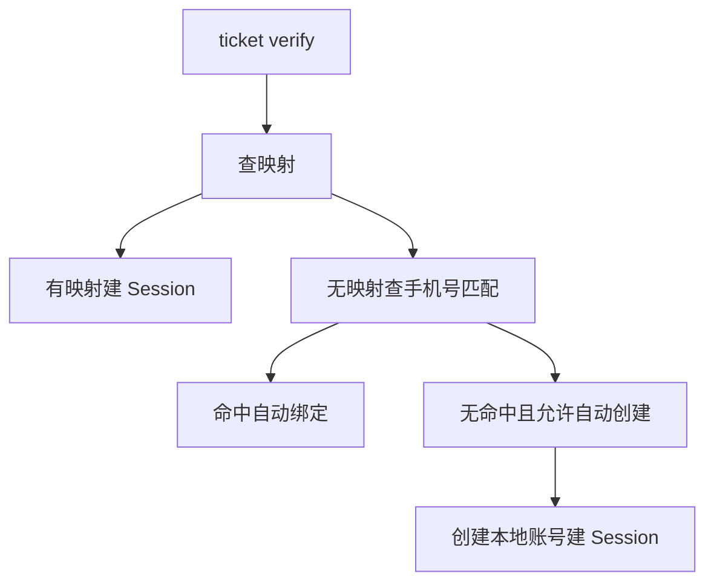
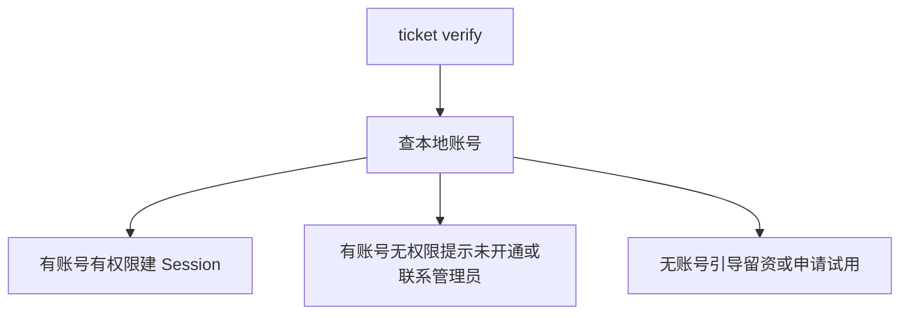
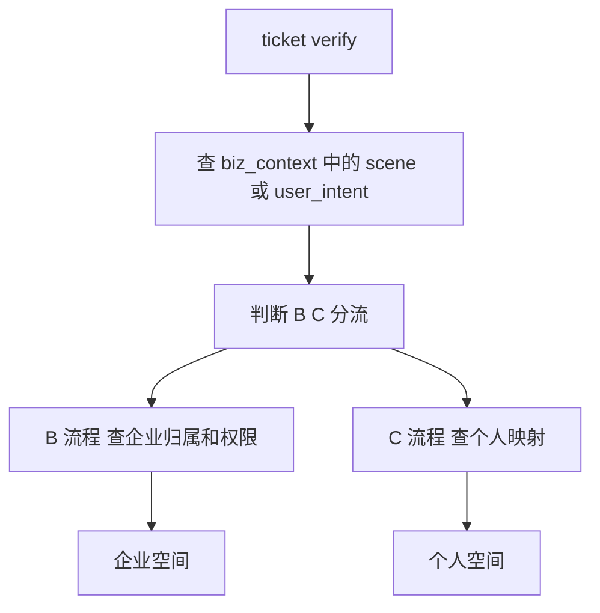
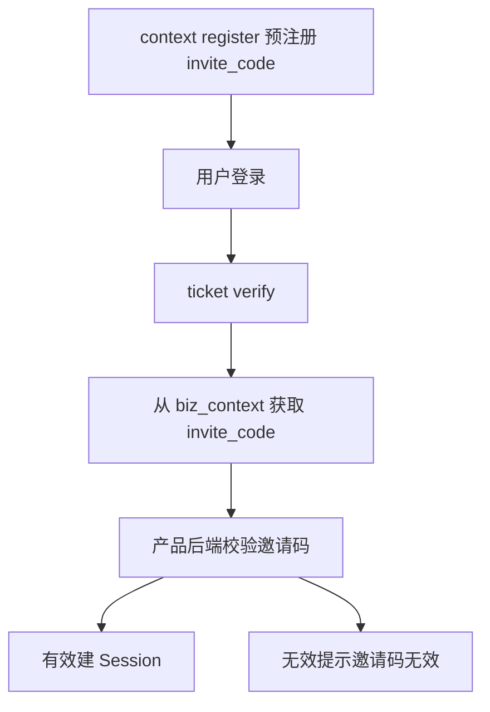
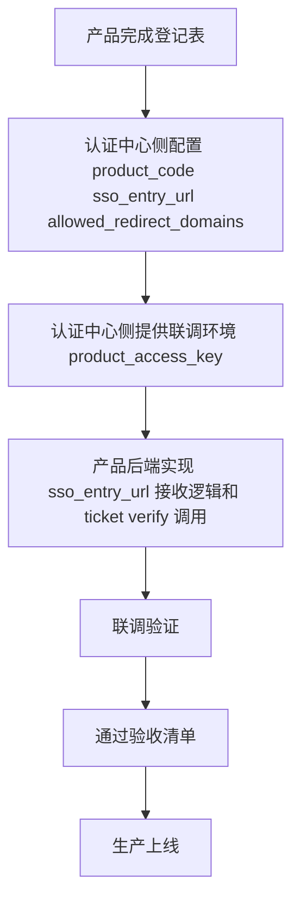
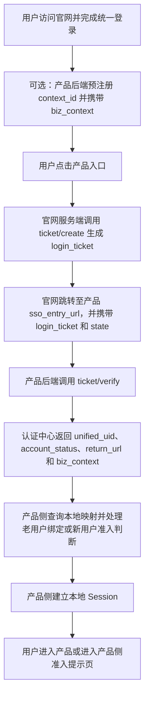
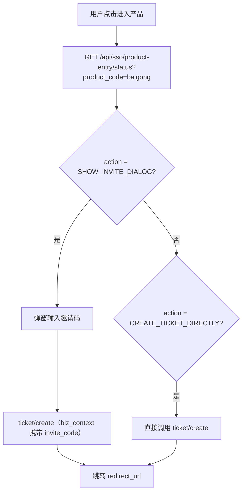
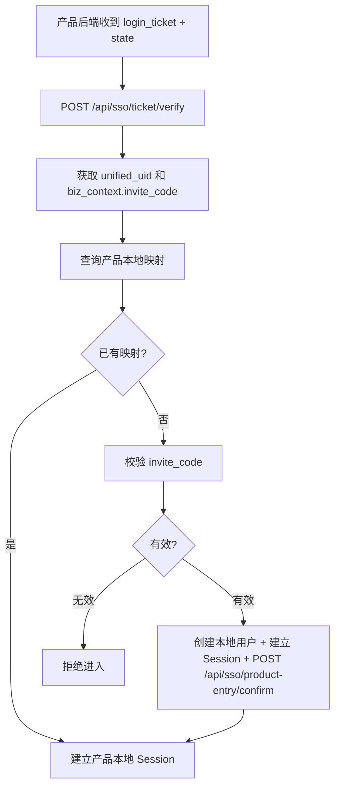

# 亦庄登录sso

## 项目背景与建设范围

### 1. 项目背景与建设目标

本项目围绕新版官网统一入口能力建设统一登录认证授权中心，作为百系产品的统一身份基础设施。目标是解决各产品独立登录入口、独立账号体系、独立认证方式带来的重复登录、身份割裂、状态不统一等问题，形成官网统一用户承接链路。

首期能力基础上，认证中心已具备并持续提供以下统一能力：

- 统一注册
- 统一登录
- 统一认证
- 统一授权
- 统一身份标识
- 统一 UID 管理
- SSO（单点登录）
- SLO（单点登出）能力目标
- 票据签发与校验
- UserInfo 服务
- 登录审计
- 业务上下文透传
- 限流、防重放等安全能力

在邀请制产品场景下，前端需支持在用户点击“进入产品”时判断是否弹出邀请码弹窗。认证中心仅维护轻量首次接入状态，用于标识某个 `unified_uid` 是否已完成某个 `product_code` 的首次接入，状态包括：

- `CONNECTED`
- `NOT_CONNECTED`

### 2. 建设范围

本期建设范围主要覆盖官网统一身份入口及相关接入链路，支持以下场景：

- 用户从新版官网入口点击进入百系产品
- 用户在官网完成注册/登录后，由官网引导跳转到产品
- 产品新增导流入口（如落地页、推广链接、活动页）接入官网统一登录
- 产品通过预注册邀请链接、推荐链接透传业务上下文
- 产品深链场景（如面试任务、项目协作、专家入驻等）选择通过官网认证中心完成身份核验

首期建设目标如下：

| 目标 | 说明 |
| --- | --- |
| 官网统一身份入口 | 用户在新版官网完成注册/登录后，可跳转进入任意百系产品 |
| 统一 UID | 每个官网用户拥有全局唯一 `unified_uid`，作为跨产品身份锚点 |
| SSO 票据链路 | 官网颁发 `login_ticket`，产品后端校验并换取 UserInfo |
| biz_context 透传 | 产品预注册业务上下文（邀请码、推荐码、场景标记）在用户登录后原样回传 |
| 安全加固 | 提供限流、`nonce` 防重放、审计脱敏等能力 |

### 3. 职责边界

认证中心负责统一身份层能力，不替代各产品业务系统。职责边界如下。

认证中心负责：

- 用户注册
- 用户登录
- 统一登录认证授权
- 统一 UID 管理
- 票据签发
- UserInfo 服务
- SSO
- SLO 目标能力
- 登录审计
- 首次接入状态维护（`CONNECTED` / `NOT_CONNECTED`）

产品侧继续负责：

- 本地账号维护
- 本地 Session 建立与维护
- 租户体系
- 角色体系
- 菜单体系
- 数据权限
- 业务权限
- 产品使用权限判断
- 邀请码/推荐码有效性校验
- 企业邮箱/企业代码校验
- `UID` 与本地账号映射维护
- 产品 JWT/Cookie 颁发
- 本地业务身份及业务规则校验

### 4. 建设原则

本项目遵循“统一认证、产品自治、渐进式推进”的原则。统一认证中心负责统一身份识别与认证授权，各产品保留自身账号体系及权限体系。

首期不要求产品将原有登录入口全部迁移到官网。原有入口可继续保留，认证中心提供的是新增链路能力，并逐步成为官网主登录链路。

### 5. 非建设范围

以下内容不属于本项目首期建设范围：

- 统一产品业务权限
- 统一租户体系
- 统一角色体系
- 统一菜单体系
- 统一账号库合并
- 在认证中心创建产品本地账号
- 在认证中心维护 `UID` 与本地账号映射
- 在认证中心建立产品 Session 或颁发产品 JWT/Cookie
- 在认证中心校验邀请码、推荐码的业务有效性
- 在认证中心校验企业邮箱、企业代码或企业身份
- 在认证中心判断用户是否具备产品使用权限
- OAuth2/OIDC 首期实现
- 全局登出首期强制实现
- 第三方登录首期实现

以下场景首期不要求接入或迁移到官网统一认证中心：

- 既有企业客户正在使用的产品后台登录入口
- 小程序、App、PC 客户端等既有登录入口
- 企业管理员分发账号后员工使用的内部入口
- 带有复杂租户审批、邀请码校验、企业邮箱校验的现有入口
- 存量客户已收藏的产品后台地址

## 接入模式与产品接入要求

### 用户身份与模式定义

## 用户身份与模式定义

### 用户身份模型

平台应支持以下用户身份模型：

- **C 端用户**：个人用户，支持统一注册与登录。
- **B 端用户**：企业用户，包括企业管理员、企业成员。
- **B+C 混合身份用户**：支持同一用户在统一身份下承载多身份场景。

### 产品用户模式枚举

产品接入时，`product_user_mode` 应使用以下接口枚举值：

| 接口枚举值 | 业务展示值 | 说明 |
| --- | --- | --- |
| `C` | C | 面向个人用户 |
| `B` | B | 面向企业用户 |
| `B_PLUS_C` | B+C | 同时支持个人和企业 |
| `INVITE_ONLY` | 邀请制 | 邀请码 / 灰度准入 |

接口响应中的 `product_context.product_user_mode` 返回接口枚举值；产品代码判断必须使用接口枚举值（如 `B_PLUS_C`），不能使用展示文案替代。

### user_type 识别说明

`user_type` 表示认证中心侧识别到的身份线索，取值如下：

- `UNKNOWN`：未知或暂未识别；
- `PERSONAL`：个人身份线索；
- `ENTERPRISE_MEMBER`：企业成员身份线索。

约束要求：

- `user_type` 仅表示认证中心识别到的身份线索，不代表用户已具备某产品的 B 端权限。
- 产品是否允许用户进入 B 端后台，必须由产品侧根据本地账号、企业租户、角色权限自行判断。
- `product_context.product_user_mode` 与 `user_type` 属于不同维度，产品侧不得将二者混用。

### 接入能力要求

## 接入能力要求

### 必备接入能力

接入产品必须满足以下要求：

- 支持统一认证中心登录。
- 支持官网免二次登录。
- 支持 `unified_uid` 映射。
- 支持首次绑定。
- 支持本地登出。
- 支持全局登出。
- 满足统一安全规范。

### 产品侧对接任务

| 任务 | 说明 | 是否必须 |
| --- | --- | --- |
| 提供 `sso_entry_url` | 接收 `login_ticket` + `state` 的 HTTP GET 回调地址 | 必须 |
| 调用 `ticket/verify` | 后端调用认证中心校验 `ticket`，换取 `UserInfo` | 必须 |
| 维护 `unified_uid ↔ local_user_id` 映射 | 产品自己的账号映射表 | 必须 |
| 建立产品本地 Session | 产品自己颁发和管理 JWT/Cookie | 必须 |
| 处理 `return_url` 跳转 | 登录成功后跳转到正确页面 | 必须 |
| 处理 `biz_context` | 从 `verify` 响应中读取并处理业务上下文 | 视产品需求 |
| 处理 B 端权限判断 | 查询本地账号是否有 B 端准入权限 | B 端产品必须 |
| 处理老用户绑定 | `unified_uid` 与已有账号的关联策略 | 视产品情况 |
| 调用 `context/register` | 预注册 `biz_context` | 有业务上下文时使用 |
| 保护 `product_access_key` | 只存后端，不入前端、不入日志 | 必须 |

### 产品侧处理要求

#### 登录回调与票据校验

- 产品必须提供可被认证中心回调的 `sso_entry_url`。
- `sso_entry_url` 必须能够接收 `login_ticket` 和 `state` 参数的 HTTP GET 请求。
- 产品后端必须调用 `ticket/verify` 对 `ticket` 进行校验，并以校验结果作为建立本地登录态的前提。

#### 账号映射与首次接入

- 产品必须维护 `unified_uid` 与本地账号标识 `local_user_id` 的映射关系。
- 产品应支持首次绑定能力，用于将统一身份与已有本地账号建立关联。
- 对于老用户绑定策略，产品可根据自身业务决定是否启用及采用何种关联规则。

#### 本地会话与跳转处理

- `ticket/verify` 成功后，产品必须在本地建立和管理 Session。
- 产品本地 Session 可采用 JWT、Cookie 或其他产品自管会话机制。
- 登录成功后，产品必须正确处理 `return_url` 跳转，确保用户进入目标页面。

#### 业务上下文处理

- 当认证结果中包含 `biz_context` 时，产品应按业务需求读取并处理。
- 当接入流程依赖业务上下文预注册时，产品应调用 `context/register` 预注册 `biz_context`。

#### 登出要求

- 产品必须支持本地登出。
- 产品必须支持全局登出能力，并与统一认证体系配合生效。

### 接入模式分类与处理要求

## 接入模式分类与处理要求

### C 端产品

适用特征：

- 面向个人用户。
- 官网注册用户可尝试进入。
- 产品侧按 `unified_uid` 查询映射；无映射时可自动创建本地账号。
- 原登录入口首期可继续保留。

推荐处理流程：



处理要求：

- C 端产品应优先基于 `unified_uid` 查找本地映射。
- 无映射时，可根据产品策略执行自动绑定或自动创建本地账号。
- 若产品允许自动创建账号，则创建后应立即建立本地 Session。

### B 端产品

适用特征：

- 面向企业用户后台场景。
- 官网注册登录不等于自动开通 B 端产品权限。

推荐处理流程：



处理要求：

- B 端产品在 `ticket/verify` 成功后，必须继续校验本地账号及 B 端权限。
- 无本地账号的用户不得直接进入产品后台。
- 有账号但无权限时，产品应提示未开通，或引导联系管理员。
- 无账号时，产品应引导用户留资、申请试用或进入相应准入流程。

### B+C 混合产品

适用特征：

- 同一产品同时支持个人用户和企业用户。
- 产品根据 UID 和 `biz_context` 决定进入个人空间或企业空间。
- 可通过 `biz_context` 传递用户进入场景标记。

推荐处理流程：



处理要求：

- B+C 混合产品必须支持在统一身份下承载多身份场景。
- 产品应结合 `unified_uid`、`biz_context.scene`、`biz_context.user_intent` 或等价场景标识进行 B/C 分流。
- 进入 B 端空间前，仍必须完成企业归属和权限校验。
- 进入 C 端空间时，应执行个人账号映射或账号创建逻辑。

### 邀请制 / 灰度产品

适用特征：

- 通过 `biz_context` 携带邀请码 `invite_code`。
- 认证中心仅透传邀请码，不校验邀请码有效性。
- 邀请码有效性由产品后端自行校验。

推荐处理流程：



处理要求：

- 邀请制或灰度产品在需要传递邀请码时，应先通过 `context/register` 预注册 `invite_code`。
- 产品后端在 `ticket/verify` 后，必须从 `biz_context` 中读取 `invite_code` 并自行校验其有效性。
- 认证中心不承担邀请码有效性判断。
- 仅当邀请码校验通过后，产品才可建立本地 Session。

### 安全与密钥要求

## 安全与密钥要求

### 密钥保护要求

- `product_access_key` 必须通过安全渠道交付。
- 联调环境与生产环境的密钥必须分开管理；生产密钥应单独分发。
- 产品必须仅在后端存储和使用 `product_access_key`。
- `product_access_key` 不得进入前端代码。
- `product_access_key` 不得写入日志。

### 安全规范要求

- 接入产品必须满足统一安全规范。
- 涉及票据校验、会话建立、上下文传递、权限判断的实现，均应符合产品统一安全要求。

### 接入实施路径

## 接入实施路径

产品接入实施应按以下路径推进：



阶段要求：

- 产品接入前应完成接入登记信息提交。
- 接入配置阶段应完成 `product_code`、`sso_entry_url`、`allowed_redirect_domains` 等必要配置。
- 联调前应获取联调环境 `product_access_key`。
- 产品后端应完成 `sso_entry_url` 接收逻辑及 `ticket/verify` 调用实现后再进入联调。
- 联调完成后，应通过验收清单后方可生产上线。

## 总体架构与核心能力设计

### 总体架构

系统整体访问链路如下：

```text
官网统一入口 → 统一登录认证授权中心 → 百系产品 → 本地账号映射 + 产品权限体系
```

统一登录认证授权中心作为官网统一入口与各产品之间的身份中枢，负责统一登录、认证与授权能力输出。

统一认证中心内的身份体系与各产品本地账号体系解耦：认证中心负责统一身份标识与认证结果，各产品保留本地账号与产品权限体系。

### 统一身份与本地账号映射

所有用户在统一认证中心内必须拥有全局唯一身份标识 `Unified UID`。

各产品不得以统一认证中心直接替代本地账号体系；产品侧必须通过映射关系将统一身份接入本地账号体系。

映射关系如下：

```text
Unified UID ↔ Local User ID
```

### 首次绑定机制

用户首次通过官网进入产品时，产品必须执行首次绑定流程：

1. 若已存在可对应的本地账号，则绑定该本地账号；
2. 若不存在本地账号，则创建本地账号；
3. 若存在账号冲突，则进入冲突处理流程。

首次绑定流程必须基于 `Unified UID` 与产品本地账号建立映射关系。

### 标准输出与集成能力

统一登录认证授权中心需向各产品提供以下标准集成配置与能力：

- `client_id`
- `client_secret`
- `redirect_uri` 配置
- `logout_uri` 配置
- 访问票据
- `UserInfo`
- SSO
- SLO
- 登录审计能力

认证中心应提供注册/登录能力，支持手机号、邮箱注册与登录。

认证中心应提供一次性、短时效的 `login_ticket` 作为 SSO 票据，票据有效期为 5 分钟。

产品后端应支持使用 `product_access_key` 对票据进行校验，并换取 `UserInfo`。

`UserInfo` 至少应包含以下字段：

| 字段 | 说明 |
| --- | --- |
| `unified_uid` | 全局唯一身份标识 |
| `user_type` | 用户类型 |
| 脱敏手机号/邮箱 | 用户联系信息的脱敏值 |
| `account_status` | 账号状态 |
| 注册来源 | 用户注册来源 |

账号状态至少应支持以下枚举值：

| 状态值 | 说明 |
| --- | --- |
| `ACTIVE` | 正常 |
| `DISABLED` | 禁用 |
| `CANCELLED` | 注销 |

认证中心应支持 `biz_context` 业务上下文透传；对于预注册的业务上下文，系统必须原样透传，不进行解析。

认证中心应提供 `context/register` 能力，支持产品预注册业务上下文，并返回 `context_id`。

认证中心应对 5 类接口提供按分钟桶限流保护；超出限制时应返回 HTTP `429`。

认证中心在 ticket 校验过程中应支持 `nonce` 防重放机制，以防止重放攻击。

认证中心应提供认证侧事件审计能力；审计日志中的敏感字段必须脱敏。

## 核心业务流程与接口设计

### 核心业务流程

系统应支持官网登录后的统一身份状态建立，作为进入各产品的前置条件。

官网进入产品的目标为：用户在官网完成登录后，可进入目标产品且无需二次登录。

产品直接访问场景下，系统应支持由产品侧引导至统一认证中心完成登录后再回跳产品。

标准官网进入产品链路应包含以下步骤：



存在邀请码、推荐码、活动等业务上下文时，产品后端宜先调用 context/register 预注册上下文；若从官网标准入口进入且无产品侧业务上下文，可跳过预注册。

ticket/create 应由官网侧发起，产品侧通常不直接调用。

### 接口一：查询产品进入状态

接口定义：

| 字段 | 值 |
| --- | --- |
| 方法 | GET |
| 路径 | `/api/sso/product-entry/status` |
| 认证 | `Authorization: Bearer {session_token}`（官网登录用户） |
| 参数 | `product_code`（query string，必填） |

处理逻辑应满足：
1. 校验 `session_token`，获取 `unified_uid`。
2. 查询产品配置；产品不存在时返回 `PRODUCT_INVALID`，产品已禁用时返回 `PRODUCT_DISABLED`。
3. 若产品配置 `require_invite_code = false`，则返回 `action = CREATE_TICKET_DIRECTLY`。
4. 若产品配置 `require_invite_code = true`，则查询 `auth_product_user_access` 是否存在该用户对应的 `CONNECTED` 记录：
   - 存在时，返回 `action = CREATE_TICKET_DIRECTLY`；
   - 不存在时，返回 `action = SHOW_INVITE_DIALOG`。

当用户当前需要输入邀请码时，成功响应可为：

```json
{
  "code": "SUCCESS",
  "data": {
    "product_code": "baigong",
    "product_name": "百工",
    "require_invite_code": true,
    "invite_required_for_current_user": true,
    "access_status": "NOT_CONNECTED",
    "action": "SHOW_INVITE_DIALOG",
    "sso_entry_url": "https://saibotan-pre.100credit.cn/login"
  }
}
```

当用户当前无需输入邀请码时，成功响应可为：

```json
{
  "code": "SUCCESS",
  "data": {
    "product_code": "baigong",
    "product_name": "百工",
    "require_invite_code": true,
    "invite_required_for_current_user": false,
    "access_status": "CONNECTED",
    "action": "CREATE_TICKET_DIRECTLY",
    "sso_entry_url": "https://saibotan-pre.100credit.cn/login"
  }
}
```

错误码：

| 错误码 | 说明 |
| --- | --- |
| SESSION_INVALID | 未登录或 session 过期 |
| PRODUCT_INVALID | 产品不存在 |
| PRODUCT_DISABLED | 产品已禁用 |
| PARAM_INVALID | `product_code` 为空 |

### 官网进入产品的前端推荐流程

官网前端进入产品流程建议如下：



当 `action = SHOW_INVITE_DIALOG` 时，前端应展示邀请码输入弹窗，并在后续 `ticket/create` 请求的 `biz_context` 中携带 `invite_code`。

当 `action = CREATE_TICKET_DIRECTLY` 时，前端应直接发起 `ticket/create` 并跳转至返回的 `redirect_url`。

### 接口二：确认产品首次接入

接口定义：

| 字段 | 值 |
| --- | --- |
| 方法 | POST |
| 路径 | `/api/sso/product-entry/confirm` |
| 认证 | `Authorization: Bearer {product_access_key}`（产品后端） |
| Content-Type | `application/json` |

请求体示例：

```json
{
  "product_code": "baigong",
  "unified_uid": "{unified_uid}",
  "access_status": "CONNECTED",
  "bind_source": "INVITE_CODE"
}
```

请求字段要求：

| 字段 | 类型 | 必须 | 说明 |
| --- | --- | --- | --- |
| `product_code` | string | ✅ | 产品编码 |
| `unified_uid` | string | ✅ | 统一用户 ID |
| `access_status` | string | ✅ | 仅支持 `CONNECTED` |
| `bind_source` | string | ❌ | 接入来源：`INVITE_CODE` / `ADMIN` / `IMPORT` / `UNKNOWN` |

鉴权逻辑应满足：
1. 校验 `Authorization: Bearer {product_access_key}`。
2. `product_access_key` 必须属于请求体中的 `product_code`。
3. 产品状态必须为 `ENABLED`。
4. 鉴权失败时返回 `PRODUCT_ACCESS_DENIED`。

业务逻辑应满足：
1. 校验 `unified_uid` 对应用户存在。
2. 校验 `access_status = CONNECTED`。
3. 对 `auth_product_user_access` 执行 Upsert：
   - 不存在时插入，并写入 `first_connected_at = now`、`last_connected_at = now`；
   - 已存在时更新 `access_status = CONNECTED`、`last_connected_at = now`，且不得覆盖 `first_connected_at`。

成功响应：

```json
{
  "code": "SUCCESS",
  "data": {
    "product_code": "baigong",
    "unified_uid": "{unified_uid}",
    "access_status": "CONNECTED"
  }
}
```

错误码：

| 错误码 | 说明 |
| --- | --- |
| PRODUCT_ACCESS_DENIED | `product_access_key` 错误 |
| PRODUCT_INVALID | 产品不存在 |
| PRODUCT_DISABLED | 产品已禁用 |
| USER_NOT_FOUND | `unified_uid` 不存在 |
| PARAM_INVALID | 参数错误或 `access_status` 非 `CONNECTED` |

### 产品侧首次接入后的后端处理流程

产品后端在收到 `login_ticket` 和 `state` 后，推荐按如下流程处理：



当产品侧尚无本地映射时，应基于 `ticket/verify` 返回的 `biz_context.invite_code` 执行邀请码校验；邀请码有效后，创建本地用户并建立本地 Session，随后调用 `/api/sso/product-entry/confirm` 回写接入结果。

当邀请码无效时，产品侧应拒绝用户进入产品。

## 登录体验与会话机制

### 统一登录与单点访问

- 用户完成一次登录后，应可访问所有已接入统一认证体系的产品，无需在产品间重复登录。
- 用户从官网进入已接入产品时，不应被要求再次登录。
- 官网、统一认证中心及各已接入产品之间的登录状态应保持统一。

### 首次绑定与登录异常处理

- 应提供首次账号绑定的标准化处理机制，确保用户首次进入接入产品时可按统一流程完成绑定。
- 登录异常应可控，异常场景应具备可处理性，避免造成用户无法恢复的登录阻断。

### 登出与会话退出机制

### 本地登出
- 本地登出仅退出当前产品。
- 执行本地登出后，不应影响官网及其他产品的登录状态。

### 全局登出
- 全局登出应退出统一认证中心。
- 执行全局登出后，应同步清理官网及所有已接入产品的登录状态。

### 接入与迁移原则

- 首期不要求产品迁移现有登录入口，原有登录入口可继续保留。
- 统一认证中心在首期主要承接新增登录链路，包括官网导流、活动、邀请及深链等场景。
- 存量用户正在使用的产品后台登录入口，首期无需改动。
- 产品在完成联调验收后，可按自身节奏逐步扩大统一认证接入范围。
- 统一认证中心不强制要求任何产品立即迁移全部登录入口。

## 数据模型与存储设计

## 四、数据库表

```sql
CREATE TABLE auth_product_user_access (
  id BIGINT UNSIGNED NOT NULL AUTO_INCREMENT,
  product_code VARCHAR(64) NOT NULL,
  unified_uid VARCHAR(64) NOT NULL,
  access_status VARCHAR(32) NOT NULL COMMENT 'CONNECTED / REVOKED',
  bind_source VARCHAR(32) DEFAULT NULL,
  first_connected_at DATETIME(3),
  last_connected_at DATETIME(3),
  created_at DATETIME(3) NOT NULL DEFAULT CURRENT_TIMESTAMP(3),
  updated_at DATETIME(3) NOT NULL DEFAULT CURRENT_TIMESTAMP(3) ON UPDATE CURRENT_TIMESTAMP(3),
  is_deleted TINYINT NOT NULL DEFAULT 0,
  PRIMARY KEY (id),
  UNIQUE KEY uk_product_uid (product_code, unified_uid)
);
```

**不存储**：邀请码、local_user_id、local_tenant_id、权限

## 安全规范

### 接口鉴权与凭证使用要求

- `status` 接口必须使用官网 `session_token` 进行鉴权，且仅返回当前登录用户自身的状态信息。
- `confirm` 接口必须使用 `product_access_key` 进行鉴权，且仅允许合法的产品后端调用。
- `product_access_key` 仅允许后端持有和使用，不得出现在前端代码、URL 或日志中。
- `client_secret` 仅允许由服务端保存。
- `login_ticket` 不得作为登录态或长期凭证使用，仅可用于换取 `UserInfo`；产品侧必须建立本地 Session，不得依赖 `login_ticket` 作为登录凭证。

### 授权流程与令牌安全

- 所有 `redirect_uri` 必须统一纳入白名单管理。
- 所有授权请求必须校验 `state`，以防止 CSRF。
- `access_token`、`refresh_token` 不得暴露给前端，也不得出现在 URL 中。
- 每次生成 `ticket` 或执行 `verify` 时，必须生成新的随机 `nonce`，且保证每次唯一。

### 传输、日志与数据存储安全

- 生产环境必须全链路使用 HTTPS；调用认证中心时禁止使用 HTTP。
- 日志必须进行脱敏处理，不得记录以下敏感信息：`session_token`、`product_access_key`、邀请码，以及其他敏感凭证。
- 系统不得以明文形式存储邀请码。
- 系统不得存储 `local_user_id` 或 `local_tenant_id`。

## 联调验证与验收

### 联调准备与范围

- 联调前应由双方确认联调环境地址以及 `product_access_key` 可用性。

- 联调范围应覆盖标准正向链路、特殊业务场景、异常场景以及安全与审计要求。

- 特殊业务场景至少应包含 B 端场景、邀请制场景等非标准注册登录路径。

### 联调验证项

- 应优先验证正向链路可用性，至少覆盖 `context/register → ticket/create → ticket/verify`。

- 完整正向验收链路应覆盖 `context/register → login → ticket/create → ticket/verify → 建立 Session → return_url 跳转`。

- 官网统一注册登录应可正常完成。

- 用户从官网进入产品时应支持免二次登录。

- Unified UID 应已生效并可用于链路识别或账户关联。

- 首次绑定流程应可正常完成。

- 单点登录（SSO）应生效。

- 单点登出（SLO）应生效。

- `ticket/verify` 验证成功后应能返回 `UserInfo` 与 `biz_context`。

- 应验证携带 `context_id` 的 `ticket/create` 调用链路。

### 异常与安全验收

- 异常链路至少应验证以下场景：票据已用或重用、`state` 不符、`nonce` 重放、`product_access_key` 无效。

- `redirect_uri` 必须实施白名单校验。

- 必须对 `state` 进行校验。

- 必须具备 `nonce` 防重放能力。

- Token 必须满足安全要求。

- `client_secret` 必须安全存储与使用，不得泄露。

- 所有相关接口与跳转过程应使用 HTTPS。

- 审计日志不得包含明文敏感信息，日志输出应满足脱敏要求。

- Actuator 端点应满足最小暴露原则。

- 限流能力应覆盖 5 类接口。

### 已验证能力与验收依据

| 能力 | 验证状态 |

| --- | --- |

| 手机号/邮箱注册登录 | 已验证 |

| `context/register` | 已验证 |

| `ticket/create`（带 `context_id`） | 已验证 |

| `ticket/verify`（返回 `UserInfo + biz_context`） | 已验证 |

| 完整 E2E 链路 | 已验证 |

| `nonce` 防重放 | 已验证 |

| 限流（5 类接口） | 已验证 |

| 审计日志脱敏 | 已验证 |

| Actuator 最小暴露 | 已验证 |

| `product_access_key` 认证 | 已验证 |
