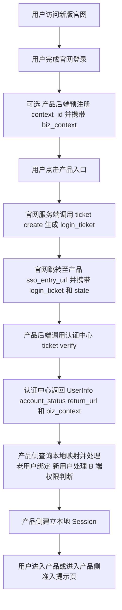
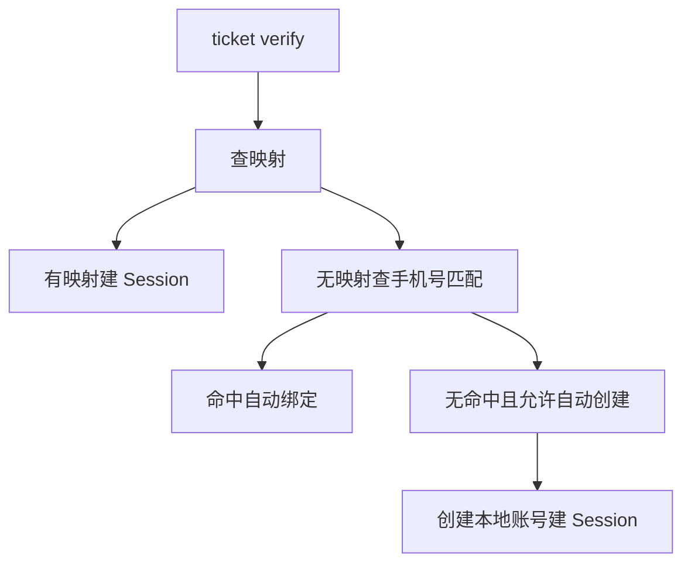
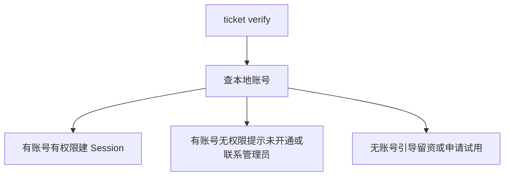
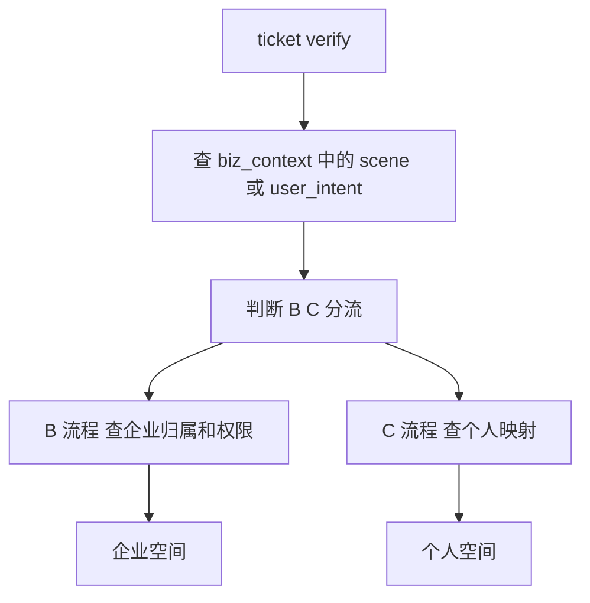
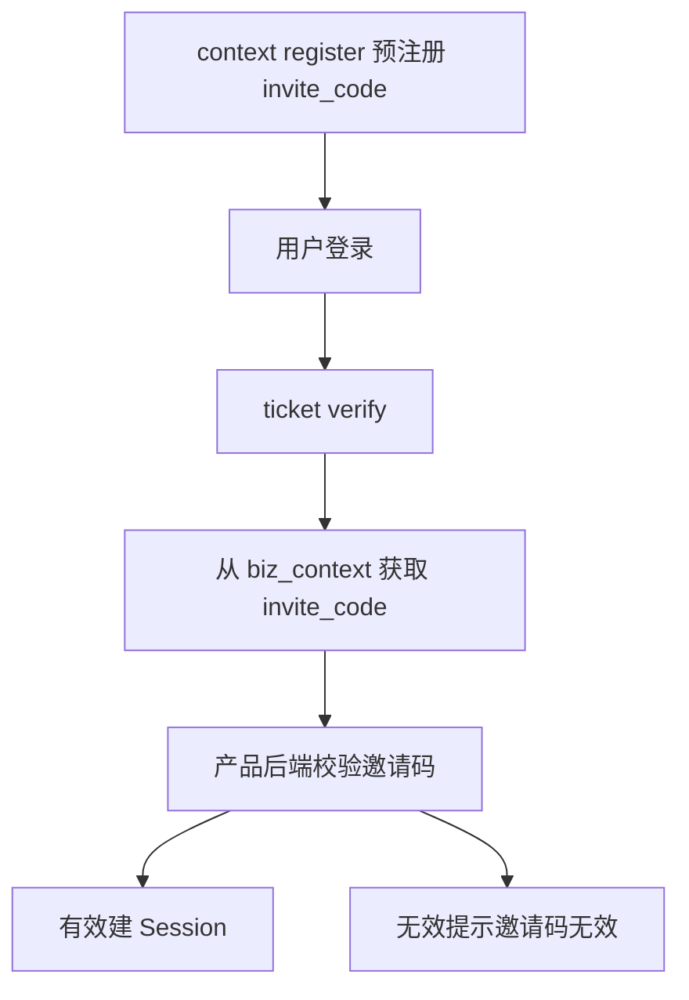
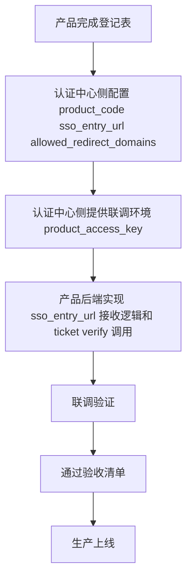

# 百系产品接入官网统一认证中心总说明v1.1

适用对象：百系产品研发团队、产品负责人

文档定位：本文档是总览 / 首读材料。本文档不替代接口契约，也不替代产品侧开发指南。正式开发接入时，请继续阅读后续专项文档。

## 阅读建议

如果你是产品后端研发，请务必继续阅读：

- [请至钉钉文档查看附件《产品接入配置表》。](https://alidocs.dingtalk.com/i/nodes/dxXB52LJqwOlvPGaTMwmBMPOWqjMp697?doc_type=wiki_doc&iframeQuery=anchorId%3DX02mpb8c7yftiyum1g5pnc&rnd=0.46687305236416)（接入前需要填写）
- [《SSO 接口文档（对外发布版）v1.0》](https://alidocs.dingtalk.com/i/nodes/0eMKjyp81MqNm07lT4zgNoXv8xAZB1Gv)— 接口规范
- [《百系产品接入官网统一认证中心接口契约 v1.2》](https://alidocs.dingtalk.com/i/nodes/Amq4vjg89Z9qyj61CP6kP1woW3kdP0wQ?utm_scene=team_space&sideCollapsed=true&iframeQuery=utm_source%253Dportal%2526utm_medium%253Dportal_new_tab_open&corpId=ding6edcd346b15043ddffe93478753d9884)

## 一、背景

新版官网统一认证中心（br-auth-center）已完成首期核心能力建设，支持手机号/邮箱注册登录、统一 UID 管理、SSO 票据颁发与校验、业务上下文透传、限流防重放等安全能力。

本文档旨在帮助各百系产品团队了解：接入范围是什么、产品侧需要做什么、认证中心提供什么、不提供什么。

## 二、首期目标

| 目标 | 说明 |
| --- | --- |
| 官网统一身份入口 | 用户在新版官网完成注册/登录后，可跳转进入任意百系产品 |
| 统一 UID | 每个官网用户拥有全局唯一 unified_uid，作为跨产品身份锚点 |
| SSO 票据链路 | 官网颁发 login_ticket，产品后端校验换取 UserInfo |
| biz_context 透传 | 产品预注册业务上下文（邀请码/推荐码/场景标记），用户登录后原样回传 |
| 安全加固 | 限流、nonce 防重放、审计脱敏 |

## 三、接入范围

本期认证中心 SSO 能力主要承接以下场景：

- 用户从新版官网入口点击进入百系产品
- 用户在官网完成注册/登录后，由官网引导跳转到产品
- 产品希望通过新增导流入口（落地页、推广链接、活动页）接入官网统一登录也可支持（可选）
- 产品通过预注册邀请链接/推荐链接业务上下文（可选）
- 产品的深链场景（面试任务、项目协作、专家入驻等）选择通过官网认证中心完成身份核验（可选）

## 四、不接入范围（首期）

以下场景首期不要求迁移到官网统一认证中心：

- 已有企业客户正在使用的产品后台登录入口
- 小程序、App、PC 客户端等既有登录入口
- 企业管理员分发账号后员工使用的内部入口
- 有复杂租户审批、邀请码校验、企业邮箱校验的现有入口
- 存量客户已收藏的产品后台地址

重要原则：首期不要求产品将原有登录入口全部迁移到官网。原入口可继续保留，认证中心提供的是新增链路能力。

## 五、核心链路

补充说明：

- 有邀请码、推荐码、活动业务上下文时，建议产品后端先调用 context/register。
- 从官网标准入口进入且无产品侧业务上下文则可跳过预注册。
- ticket/create 由官网侧发起，产品侧通常不直接调用。

## 六、产品侧要做什么

| 任务 | 说明 | 是否必须 |
| --- | --- | --- |
| 提供 sso_entry_url | 接收 login_ticket + state 的 HTTP GET 回调地址 | 必须 |
| 调用 ticket/verify | 后端调用认证中心校验 ticket，换取 UserInfo | 必须 |
| 维护 unified_uid ↔ local_user_id 映射 | 产品自己的账号映射表 | 必须 |
| 建立产品本地 Session | 产品自己颁发和管理 JWT/Cookie | 必须 |
| 处理 return_url 跳转 | 登录成功后跳转到正确页面 | 必须 |
| 处理 biz_context | 从 verify 响应中读取并处理业务上下文 | 视产品需求 |
| 处理 B 端权限判断 | 查询本地账号是否有 B 端准入权限 | 端产品必须 |
| 处理老用户绑定 | unified_uid 与已有账号的关联策略 | 视产品情况 |
| 调用 context/register | 预注册 biz_context | 有业务上下文时使用 |
| 保护 product_access_key | 只存后端，不入前端、不入日志 | 必须 |

## 七、认证中心提供什么

| 能力 | 说明 |
| --- | --- |
| 注册/登录 | 手机号、邮箱注册与登录 |
| 统一 UID | 全局唯一 unified_uid |
| login_ticket | 一次性、短时效（5 分钟）的 SSO 票据 |
| ticket 校验 | 产品后端用 product_access_key 换取 UserInfo |
| UserInfo | unified_uid、user_type、脱敏手机号/邮箱、account_status、注册来源 |
| biz_context 透传 | 预注册的业务上下文原样透传，不解析 |
| account_status | ACTIVE / DISABLED / CANCELLED |
| context/register | 支持产品预注册业务上下文，返回 context_id |
| 限流保护 | 5 类接口按分钟桶限流（HTTP 429） |
| nonce 防重放 | ticket verify 防止重放攻击 |
| 审计日志 | 认证侧事件审计，敏感字段脱敏 |

## 八、认证中心不做什么

| 不做的事 | 说明 | 谁来做 |
| --- | --- | --- |
| 创建产品本地账号 | 不在认证中心建产品账号表 | 产品侧 |
| 维护 UID ↔ 本地账号映射 | 不存 local_user_id | 产品侧 |
| 建立产品 Session | 不颁发产品 JWT/Cookie | 产品侧 |
| 校验邀请码/推荐码有效性 | 只透传，不校验业务含义 | 产品侧 |
| 校验企业邮箱/企业代码 | 不验证企业身份 | 产品侧 |
| 维护租户/组织/角色/权限 | 认证中心无此模型 | 产品侧 |
| 判断是否有产品使用权限 | 只返回身份信息 | 产品侧 |
| 实现 OAuth2/OIDC | 首期不实现 | 后续增强 |
| 全局登出 | 首期不强制 | 后续增强 |
| 第三方登录 | 首期不实现 | 后续增强 |

## 九、产品接入模式分类

product_user_mode 枚举说明：

| 接口枚举值 | 业务展示值 | 说明 |
| --- | --- | --- |
| C | C | 面向个人用户 |
| B | B | 面向企业用户 |
| B_PLUS_C | B+C | 同时支持个人和企业 |
| INVITE_ONLY | 邀请制 | 邀请码 / 灰度准入 |

接口响应中 product_context.product_user_mode 返回接口枚举值（如 B_PLUS_C）。本文档中的"B+C"为业务展示值，代码判断请使用枚举值。

user_type 说明

user_type 表示认证中心侧识别到的身份线索，取值为：

- UNKNOWN：未知或暂未识别；
- PERSONAL：个人身份线索；
- ENTERPRISE_MEMBER：企业成员身份线索。

注意：

- user_type 不代表用户拥有某产品的 B 端权限。
- 产品是否允许用户进入 B 端后台，由产品侧根据本地账号、企业租户、角色权限自行判断。
- 产品用户模式（C/B/B+C/邀请制）由 product_context.product_user_mode 表示，与 user_type 是不同维度。

### 9.1 C 端产品

典型产品：百智个人场景（部分）

特点：

- 官网注册用户可尝试进入
- 产品侧按 unified_uid 查映射，无映射可自动创建本地账号
- 原登录入口首期可继续保留

推荐策略：

### 9.2 B 端产品

典型产品：百才（HR 后台）、百察、百灵

核心原则：官网注册登录 ≠ 自动开通 B 端产品权限

特点：

- ticket verify 成功后，还需查询本地是否有账号和 B 端权限
- 无账号用户不应直接进入产品后台
- 应引导至留资/申请试用/联系管理员

推荐策略：

### 9.3 B+C 混合产品

典型产品：百智、百工（B+C 场景）

特点：

- 同一产品同时支持个人用户和企业用户
- 产品根据 UID 和 biz_context 决定走个人空间还是企业空间
- 可通过 biz_context 传递用户的进入场景标记

推荐策略：

### 9.4 INVITE_ONLY（邀请制/灰度产品）

典型场景：百工邀请制灰度开放

特点：

- 通过 biz_context 携带邀请码（invite_code）
- 认证中心只透传邀请码，不校验邀请码有效性
- 产品后端收到邀请码后，自行校验是否有效

推荐策略：

## 十、原产品登录入口保留原则

- 首期不要求迁移，原入口可继续保留。
- 官网统一认证中心主要承接新增链路（官网导流、活动、邀请、深链）。
- 存量用户正在使用的产品后台登录入口，首期无需改动。
- 产品完成联调验收后，可按自身节奏逐步扩大接入范围。
- 认证中心不强制要求任何产品立即迁移全量登录入口。

## 十一、接入路径选择

补充说明：

- product_access_key 通过安全渠道交付。
- 生产密钥单独分发。

## 十二、联调流程

联调流程要点：

- 双方确认联调环境地址和 product_access_key
- 先验证 context/register → ticket/create → ticket/verify 正向链路
- 验证 B 端/邀请制等特殊场景
- 验证异常场景（票据已用、state 不符、nonce 重放等）
- 验证审计日志不含明文敏感信息

## 十三、安全要求

| 要求 | 说明 |
| --- | --- |
| product_access_key 仅后端 | 不入前端代码、不入 URL、不入日志 |
| login_ticket 不作登录态 | 只用于换取 UserInfo，不存长期 |
| nonce 每次唯一 | 每次 ticket/verify 生成新的随机 nonce |
| HTTPS 调用认证中心 | 生产环境禁止 HTTP |
| 产品建立本地 Session | 不依赖 login_ticket 作为登录凭证 |

## 十四、验收标准

核心验收项：

- 正向链路：context/register → login → ticket/create → ticket/verify → 建立 Session → return_url 跳转
- 异常链路：票据重用、state 不符、nonce 重放、product_access_key 无效
- 审计日志无敏感明文

## 十五、当前统一认证中心已自测验证了的能力

| 能力 | 状态 |
| --- | --- |
| 手机号/邮箱注册登录 | 已验证 |
| context/register | 已验证 |
| ticket/create（带 context_id） | 已验证 |
| ticket/verify（返回 UserInfo + biz_context） | 已验证 |
| mock-product-server 完整 E2E 链路 | 已验证 |
| nonce 防重放 | 已验证 |
| 限流（5 类接口） | 已验证 |
| 审计日志脱敏 | 已验证 |
| Actuator 最小暴露 | 已验证 |
| product_access_key 认证 | 已验证 |
