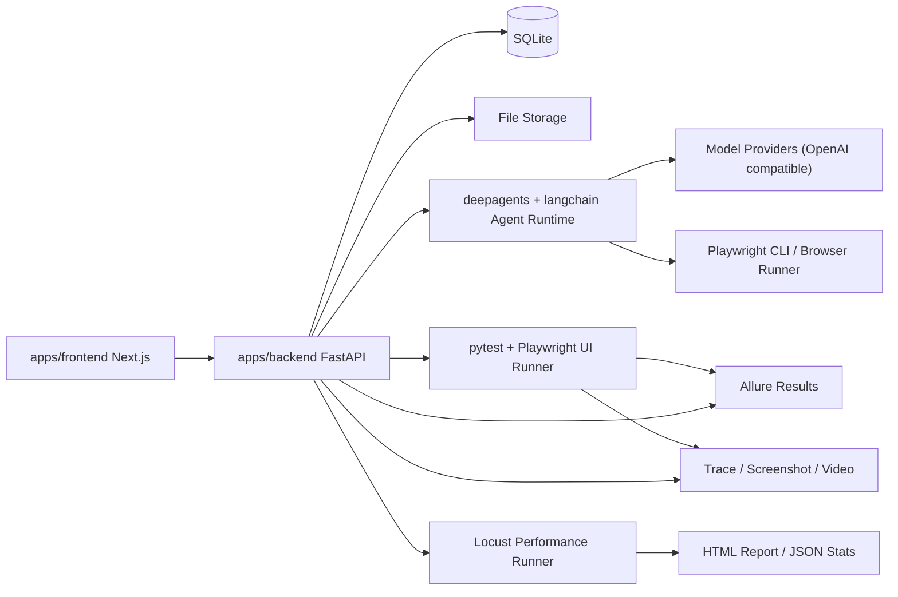

# 00-01 AI测试系统 - PRD

> **基线日期**：2026-07-25
> **事实源**：`apps/frontend/src/`（Next.js App Router）、`apps/backend/app/`（FastAPI + SQLAlchemy + deepagents + langchain）、`apps/backend/pyproject.toml`、`apps/backend/tests/`
> **状态标签**：`已实现`（核心闭环）、`部分实现`（部分模块）、`占位`（系统设置）

---

## 1. 需求概述（5W2H）

### 1.1 What - 是什么

构建一套面向软件测试团队、测试工程师和质量管理人员的 AI 测试系统。系统以"项目"为主业务边界，围绕需求文档、站点探索、项目知识库、测试用例、自动化测试代码和执行报告形成闭环。

核心能力包括：

- 用户登录、管理员创建账号、账号配置和个人偏好管理；**第一版不开放用户自助注册**
- 控制台面板，展示项目数、用例资产数、测试用例采纳率、UI 自动化测试用例数、UI 自动化覆盖率、发现缺陷数量、待处理事项和任务信息概览
- 项目管理，按项目隔离需求、站点、知识库、测试用例、自动化代码、运行记录和模型配置
- 需求/功能分析，支持上传一个或多个文档，系统将多个来源文件汇总归并为一份项目级 Markdown 需求工作稿；识别需求不清楚点、状态流转、依赖关系、异常路径和待确认问题
- 澄清问答闭环，用户回答系统提出的问题后，系统将结论写回需求文档 Markdown 工作稿的新版本
- 站点探索，基于 Playwright CLI 登录并遍历站点，按模块生成页面、表单、操作、状态流转、依赖关系和风险点文档
- 项目知识库，在知识库界面基于已确认的需求文档版本、需求分析、澄清写回记录、站点探索结果生成知识库文档；支持项目知识问答（跨项目或指定项目）和公司知识库管理
- 测试用例生成，根据项目知识库、需求分析结果和站点探索结果生成结构化测试用例，支持人工评审、补充和版本化
- 测试计划，围绕版本、迭代、变更、回归或上线前验证组织测试范围、负责人、环境、执行批次和计划结论
- 测试集，组合多条可执行 UI 自动化用例形成可复用执行集合，支持批量执行、运行记录追踪和报告跳转
- UI 自动化测试用例生成，基于 pytest + Playwright 本地执行；UI 自动化首版不接入 Allure，由 pytest 原生日志、Playwright trace、截图、视频作为执行证据
- 接口自动化，支持 OpenAPI 文档导入、接口端点管理、测试用例生成、场景编排、脚本执行和修复会话
- 性能测试，支持 Locust 脚本生成、本地执行、运行监控、AI 分析和质量门禁
- 模型配置，为不同能力（capability）分别配置模型 Provider、温度等参数
- Agent 框架，使用 `deepagents` SDK（`deepagents>=0.6.7`）和 `langchain`（`langchain>=1.3.13`）构建 Agent，采用"统一 Agent Runtime + 模块专用 Agent + Skill + 后端领域服务"三层分工

### 1.2 Why - 为什么

当前测试资产生产链路通常存在以下问题：

- 需求文档和测试用例之间缺少可追踪关系，测试遗漏难以及时发现
- 需求不清楚时依赖人工经验追问，问题列表不系统，澄清结果也难回灌
- 站点真实交互、页面状态、字段约束和业务文档经常不一致
- 测试用例生成后缺少项目知识约束，容易泛化、重复、覆盖不足
- 自动化代码生成缺少真实定位信息、真实登录流程和页面状态，落地成本高
- 自动化失败后经常混淆产品 Bug、测试脚本问题、环境问题和数据问题
- 项目知识散落在文档、测试代码、Allure 报告、聊天记录和人工经验里，无法持续复用

本系统的目标是把"需求理解、站点探索、知识沉淀、用例设计、自动化生成、执行诊断、自愈修复"串成可审计闭环，让测试资产随着项目迭代持续变厚，而不是每次从零开始。

### 1.3 Who - 谁

核心用户角色：

| 角色 | 职责 | 关键诉求 |
| --- | --- | --- |
| 管理员 | 拥有系统和项目的所有权限，包括用户、模型、全局配置、项目、项目分配、需求、知识库、用例、自动化、报告和自愈管理 | 统一承担系统管理和项目管理职责，减少第一版权限复杂度 |
| 测试工程师 | 只能查看和操作分配给自己的项目，可进行需求分析、站点探索、知识确认、测试用例生成/维护、自动化生成/执行、失败诊断和自愈确认 | 聚焦具体项目的测试资产建设和自动化落地 |
| 访客 | 管理员能看的内容都能看，包括全部项目信息、需求分析、知识库、测试用例、自动化执行报告和缺陷诊断结果 | 全局只读查看，不能新增、编辑、删除、执行、确认或配置 |

基础权限边界：

| 权限项 | 管理员 | 测试工程师 | 访客 |
| --- | --- | --- | --- |
| 查看全部项目 | 是 | 否，仅分配项目 | 是 |
| 创建项目 | 是 | 否 | 否 |
| 编辑项目配置 | 是 | 否 | 否 |
| 管理用户与项目分配 | 是 | 否 | 否 |
| 配置模型和系统资源 | 是 | 否 | 否 |
| 查看需求、知识库、用例、自动化、报告 | 是 | 仅分配项目 | 是 |
| 上传需求文档 | 是 | 仅分配项目 | 否 |
| 发起需求分析 | 是 | 仅分配项目 | 否 |
| 回答澄清问题 | 是 | 仅分配项目 | 否 |
| 确认知识条目 | 是 | 仅分配项目 | 否 |
| 生成和编辑测试用例 | 是 | 仅分配项目 | 否 |
| 评审和采纳测试用例 | 是 | 仅分配项目 | 否 |
| 生成自动化测试代码 | 是 | 仅分配项目 | 否 |
| 执行自动化测试 | 是 | 仅分配项目 | 否 |
| 确认自愈补丁 | 是 | 仅分配项目 | 否 |
| 查看缺陷诊断 | 是 | 仅分配项目 | 是 |

### 1.4 When - 何时使用

典型使用时机：

- 新项目启动，需要从需求文档建立测试资产
- 需求变更，需要重新分析影响范围和测试回归范围
- Web 系统已有页面，需要通过站点探索生成页面和流程知识
- 测试工程师需要检查用例覆盖是否完整
- 测试工程师需要根据稳定用例生成 pytest + Playwright UI 自动化代码
- 需要对 API 接口进行自动化测试（导入 OpenAPI 文档、生成用例、编排场景）
- 需要进行性能负载测试（生成 Locust 脚本、执行、查看统计和 AI 分析）
- 自动化执行失败，需要判断是 Bug、环境问题、数据问题还是代码问题
- 项目长期迭代，需要持续沉淀知识库并复用历史测试经验

### 1.5 Where - 使用环境

系统由三类运行面组成：

- Web 管理端：用户登录、项目管理、需求分析、站点探索、知识库（含公司知识库和项目知识问答）、测试用例、UI 自动化、接口自动化、性能测试、报告和配置管理
- 后端 API 与任务运行时：FastAPI 提供业务 API，后台任务执行文档解析、Agent 分析、站点探索调度、用例生成和自动化执行
- 自动化执行环境：本地运行，支持 UI 自动化（pytest + Playwright + Allure）和性能测试（Locust）；接口自动化 pytest + requests + Allure 完整实现

### 1.6 How - 如何工作

核心闭环如下：

```mermaid
flowchart LR
    Project["创建项目"] --> Inputs["导入需求/站点/接口资料"]
    Inputs --> Analysis["需求与功能分析"]
    Analysis --> Questions["生成澄清问题"]
    Questions --> Answers["用户回答并确认"]
    Answers --> SourceVersion["更新需求文档版本/分析结论"]
    Project --> Explore["站点探索"]
    Explore --> SourceVersion
    SourceVersion --> KnowledgeAction["知识库界面：生成/更新知识库"]
    KnowledgeAction --> Knowledge["模块化项目知识库"]
    Knowledge --> Cases["生成测试用例"]
    Cases --> Review["人工评审与版本化"]
    Review --> AutoCode["生成自动化测试代码"]
    AutoCode --> Run["执行 pytest + Playwright UI 自动化"]
    Run --> Report["执行报告与运行记录（pytest 日志、Playwright trace、Locust 报告）"]
    Report --> Diagnose["失败诊断"]
    Diagnose --> Bug["产品 Bug"]
    Diagnose --> ManualHeal["人工启用接口自动化修复会话"]
    ManualHeal --> Fix["测试代码修复建议"]
    Fix --> AutoCode
    Diagnose --> Knowledge
```

系统必须坚持以下规则：

- 项目是第一业务隔离边界，需求、探索、知识库、用例、自动化和报告都必须归属于项目。
- 原始需求文档、站点探索文档和澄清写回记录是上游事实源，不能用生成后的测试用例反向替代原始需求。
- 上传文档或文件后不能直接落入正式知识库，必须先经过需求分析、澄清、编辑、确认等迭代；只有在知识库界面显式点击"生成知识库"或"更新知识库"后，才生成或刷新正式知识库文档。
- 原始 Word/PDF、探索 Markdown、截图、trace、video、Locust 报告等大文件保存在文件系统；SQLite 保存元数据、状态、索引、正文或路径、覆盖矩阵、评审状态和来源引用。
- 知识库第一版只保留三类业务状态：构建中、阻塞、已发布；只有已发布知识库可用于正式测试用例生成。
- 知识库进入阻塞后必须展示阻塞清单、来源位置、影响范围、建议动作和 AI 协助处理入口；AI 只能生成建议或草稿，用户确认并形成新来源后才能重新生成知识库。
- 测试代码生成需要区分页面定位、业务步骤、测试数据、断言、Allure 展示和清理逻辑。

### 1.7 How much - MVP 范围

第一阶段建议覆盖单机或小团队使用场景：

- 支持 1 个系统实例、多个项目、多个用户
- 支持本地文件上传和本地任务执行
- 第一版统一使用 SQLite 作为主数据库
- 支持 OpenAI 兼容 Provider 配置（含 deepseek 等）
- 支持 Playwright 对 Web 站点探索和 pytest 测试执行
- 支持 Locust 报告（性能测试）、pytest 原生报告（接口自动化）归档和跳转；UI 自动化首版不接 Allure
- 支持 Locust 性能测试（本地执行、运行监控、AI 分析、质量门禁）
- 支持接口自动化（OpenAPI 导入、端点管理、测试用例、场景编排、脚本执行、Oracle 提案、修复会话）
- 暂不做多租户商业化计费、分布式 Runner 集群、复杂审批流和企业级 SSO
- 系统设置页当前为占位，尚未实现

---

## 1.8 已确认产品口径

| 主题 | 已确认口径 |
| --- | --- |
| 需求评审与澄清 | 先评审发现问题，再进入澄清；澄清答案写回需求文档新版本后，对受影响模块重新评审或重新验证 |
| 知识库阻塞 | 阻塞页必须展示阻塞清单、来源位置、影响范围、建议动作和 AI 协助入口；AI 只能输出建议、草稿、差异预览或待确认补充记录，不能直接写入已发布知识库 |
| UI 自动化 locator | 生成 UI 自动化前先自动探索补齐 locator；如果单条用例补齐失败，不中断整个批次，继续处理其他可完成用例，最后汇总失败项给人工处理 |
| 知识库状态 | 第一版只保留构建中、阻塞、已发布三态；只有已发布知识库可用于正式测试用例生成 |
| Agent SDK | 当前使用 `deepagents>=0.6.7` 和 `langchain>=1.3.13`，不使用 OpenAI Agents SDK |
| 性能测试 | 完整实现：Locust 脚本生成、本地执行、实时监控、运行统计图表、AI 分析报告、质量门禁 |
| 接口自动化 | 完整实现：OpenAPI 导入、端点 CRUD、测试用例生成（含 Oracle 提案）、场景编排、脚本执行、修复会话 |

---

## 1.9 总览 PRD 与拆分 PRD 的关系

`00-01-AI测试系统-PRD.md` 是产品总览和统一口径文档，负责定义系统目标、业务闭环、第一版范围、角色权限总边界、技术选型和已确认决策。

拆分 PRD 是各功能模块的详细需求说明，负责把总览中的功能拆到可评审、可设计、可开发、可验收的粒度。

当前拆分关系：

| 文档 | 模块 | 与总览 PRD 的关系 |
| --- | --- | --- |
| `00-02-AI测试系统-权限管理PRD.md` | 权限管理 | 细化三类角色、登录、管理员创建账号、项目可见性 |
| `00-03-AI测试系统-需求文档分析与版本管理PRD.md` | 需求文档分析 | 细化文档上传、Markdown 预览编辑、版本、分析、澄清 |
| `00-04-AI测试系统-站点探索PRD.md` | 站点探索 | 细化 Playwright CLI 探索、验证码登录、探索文档、与需求融合 |
| `00-05-AI测试系统-知识库生成与更新PRD.md` | 项目知识库 | 细化 llm-wiki 知识库生成、更新、非向量检索、来源追踪 |
| `00-06-AI测试系统-项目管理PRD.md` | 项目管理 | 细化项目基础信息、成员、环境、资产归属 |
| `00-07-AI测试系统-控制台PRD.md` | 控制台 | 细化项目数、用例资产、采纳率、自动化、缺陷和任务概览 |
| `00-08-AI测试系统-测试用例生成PRD.md` | 测试用例 | 细化用例生成、评审、采纳、覆盖矩阵和版本 |
| `00-21-AI测试系统-测试计划PRD.md` | 测试计划 | 细化版本、迭代、变更和回归场景下的一次测试活动编排、执行批次和计划结论 |
| `00-20-AI测试系统-测试集管理PRD.md` | 测试集 | 细化多条 UI 自动化用例的可复用组合、批量执行、运行记录和报告跳转 |
| `00-09-AI测试系统-自动化测试与Allure报告PRD.md` | UI 自动化与报告 | 细化本地 pytest + Playwright UI 自动化执行、Allure 报告 |
| `00-10-AI测试系统-失败诊断与自愈PRD.md` | 失败诊断与自愈 | 细化人工启用自愈、失败分类、修复建议和内部 Bug 记录 |
| `00-11-AI测试系统-模型配置与AgentRuntimePRD.md` | 模型与 Agent | 细化模型用途、deepagents/langchain Skill 接入和任务运行时 |
| `00-12-AI测试系统-任务中心PRD.md` | 任务中心 | 细化异步任务状态、进度、结果和批量任务部分成功场景 |

---

## 2. 真实需求与边界

### 2.1 真实需求

真实需求不是"AI 帮我写几条测试用例"，而是：

**围绕项目建立一套可追溯、可补充、可执行、可诊断、可持续进化的测试资产生产系统。**

系统必须解决五个核心问题：

- 需求是否被充分理解
- 页面和业务流是否被真实探索
- 测试用例是否覆盖关键路径、异常路径、状态流转和依赖关系
- 自动化代码是否能在真实站点上稳定运行
- 执行失败是否能被准确分类并反馈到知识库或代码

### 2.2 不做什么

MVP 不做：

- 不做通用低代码测试平台
- 不做完全无人工审核的自动上线测试代码
- 不做移动 App 自动化
- 不做复杂多租户计费
- 不把 LLM 当成唯一事实源
- 不允许自愈逻辑自动放宽断言、跳过失败步骤或吞掉产品 Bug
- 系统设置页当前为占位页，不具备配置能力

### 2.3 质量门禁

任一需求分析、站点探索或测试生成任务进入"可用于生成自动化代码"状态前，必须具备：

- 明确的来源文档或来源页面
- 模块归属
- 业务对象和关键字段说明
- 主流程、异常流程、状态流转
- 依赖关系，如登录态、角色、数据前置、外部服务、接口依赖
- 待确认问题处理状态
- 覆盖矩阵，说明哪些需求点已有测试用例覆盖
- 人工确认记录

---

## 3. 信息架构与导航设计

### 3.1 导航总原则

前端基于 Next.js App Router（`apps/frontend/src/app`），落地到 `apps/frontend`。当前模板支持 `NavGroup -> NavMainItem -> NavSubItem`，但 AI 测试系统第一版左侧导航只使用"组名称 + 高频一级模块"，二级功能进入页面后由 Tabs、子导航、卡片入口或面包屑承载。

导航设计原则：

- 左侧侧边栏使用分组导航，不把所有能力平铺成一组。
- 组名称表达工作上下文，一级模块表达高频用户任务。
- 二级功能不在左侧常驻展示，避免一级和二级同时展开造成信息过载。
- 项目是业务隔离边界，但不在左侧展开项目树；项目上下文通过页面右上角项目切换器、页面标题和面包屑表达。
- 项目切换器提供"全部项目"和"指定项目"两类工作分区；控制台、任务中心、报告中心的数据也必须受当前分区约束，需求、探索、知识库、用例和自动化必须在指定项目下工作。
- 详情页、编辑页、版本页、任务日志页、失败诊断详情页用页面内 Tabs、面包屑和详情布局承载，不继续塞进侧边栏。
- 访客可看到管理员可见的导航，但写操作入口禁用；测试工程师只看到分配项目相关入口。

### 3.2 分组导航设计

| 组名称 | 左侧一级模块 | 路由 | 状态 |
| --- | --- | --- | --- |
| 工作台 | 控制台 | `/dashboard` | 已实现 |
| 工作台 | 任务中心 | `/tasks` | 已实现 |
| 项目工作区 | 项目 | `/projects` | 已实现 |
| 项目工作区 | 需求 | `/requirements`（跨项目）、`/projects/:projectId/requirements`（项目级） | 已实现 |
| 项目工作区 | 探索 | `/exploration`、`/projects/:projectId/exploration` | 已实现 |
| 项目工作区 | 知识库 | `/knowledge`（项目知识问答 + 公司知识库 + 检索设置） | 已实现 |
| 测试资产 | 测试用例 | `/test-cases`、`/projects/:projectId/test-cases` | 已实现 |
| 测试资产 | 测试计划 | `/projects/:projectId/test-plans` | 部分实现（数据模型存在，页面路由已配置） |
| 测试资产 | 测试集 | `/projects/:projectId/test-cases/[setId]` | 已实现 |
| 测试资产 | UI 自动化 | `/automation/ui`（跨项目）、`/projects/:projectId/automation/ui` | 已实现 |
| 测试资产 | 接口自动化 | `/automation/api`（跨项目）、`/projects/:projectId/automation/api` | 已实现 |
| 测试资产 | 报告中心 | `/reports` | 已实现 |
| 测试资产 | 性能测试 | `/performance-tests`（跨项目）、`/projects/:projectId/performance-tests` | 已实现 |
| 系统管理 | 模型配置 | `/settings/models`、`/settings/models/assignments` | 已实现 |
| 系统管理 | 用户与权限 | `/settings/users` | 已实现 |
| 系统管理 | 系统日志 | `/settings/logs` | 已实现 |
| 系统管理 | 系统设置 | `/settings/system` | **占位**（SoonPage，内容为"系统设置暂不开放"） |

### 3.3 导航交互规则

- 左侧组名称固定展示，例如"工作台""项目工作区""测试资产""系统管理"。
- 左侧只展示一级模块，不常驻展示二级模块。
- 二级功能进入页面后，通过页面内 Tabs、子导航、卡片入口或面包屑展示。
- 当前路由命中某个二级功能时，左侧只高亮所属一级模块。
- 项目相关页面右上角需要展示项目切换器和当前项目名称。
- 项目内一级模块必须带 `projectId` 或通过当前项目上下文解析；没有选择项目时点击项目内模块，应先进入项目列表或项目选择页。
- 在"全部项目"分区下，只允许查看控制台、任务中心、报告中心等跨项目信息；生成知识库、上传需求、发起探索、生成用例、生成或执行 UI 自动化等写操作必须先选择指定项目。
- 如果模板处于 collapsed 状态，一级模块用图标展示。
- 移动端侧边栏使用抽屉，点击一级模块后进入对应页面并收起。

### 3.4 控制台面板内容

控制台不是普通统计面板，而是项目测试资产健康驾驶舱。它必须回答三个问题：

- 当前测试资产建设是否健康
- 哪些事项需要人工处理
- 哪些任务、失败或缺陷需要优先跟进

核心概览指标：

| 指标 | 口径 | 说明 |
| --- | --- | --- |
| 项目数 | 未归档项目总数 | 衡量系统内活跃测试项目规模 |
| 用例资产数 | 待评审、已采纳、不采纳测试用例总数 | 衡量项目测试资产沉淀规模 |
| 测试用例采纳率 | 已采纳用例数 / AI 生成用例总数 | 衡量 AI 生成用例质量和人工可用性 |
| UI 自动化测试用例数 | 已生成 pytest + Playwright UI 自动化代码且可执行的用例数 | 衡量 UI 自动化资产规模 |
| UI 自动化覆盖率 | UI 自动化测试用例数 / 已采纳测试用例数 | 衡量已确认用例中有多少进入 UI 自动化回归 |
| 发现缺陷数量 | 失败诊断中分类为产品 Bug 的缺陷数 | 衡量自动化和 AI 诊断发现的真实产品问题 |
| 待处理事项数 | 待澄清、待评审、待诊断、自愈待确认的总数 | 驱动用户下一步动作 |

---

## 4. 核心业务对象

| 对象 | 说明 | 关键关系 |
| --- | --- | --- |
| User | 系统用户 | 可加入多个项目（通过 project_scope 文本字段关联） |
| Role | 角色 | 控制系统和项目权限：admin/tester/guest |
| Project | 测试项目 | 所有测试资产的根边界 |
| ProjectEnvironment | 项目环境 | dev/test/pre/prod、本地地址、登录配置 |
| ModelProvider | 模型供应商 | OpenAI 兼容 Provider（deepseek/openai 等）、Base URL、API Key |
| ModelAssignment | 模型分配 | capability_id 映射到 model_provider_id |
| AiCapability | AI 能力 | 14 种能力定义（见模型配置 PRD） |
| SourceDocument | 原始文档 | 需求文档；上传后只作为来源材料 |
| SourceDocumentVersion | 文档版本 | 保存每次上传、转换、在线编辑后的 Markdown 内容和变更记录 |
| RequirementAnalysis | 需求分析版本 | 从文档中提取业务对象、流程、疑点和覆盖点 |
| RequirementAnalysisRun | 需求分析任务 | queued/running/stopping/cancelled/completed/needs_clarification/failed |
| ClarificationQuestion | 澄清问题 | 用户回答后回灌需求分析和文档版本记录 |
| SiteProfile | 被测站点配置 | URL、登录方式、账号、角色、探索范围 |
| ExplorationRun | 站点探索任务 | pending/queued/running/stopping/cancelled/completed/blocked/failed |
| ExplorationPage | 探索页面 | 按业务模块组织页面事实 |
| UiAutomationGenerationRun | UI 自动化生成任务 | 关联测试用例和环境，生成 pytest 代码 |
| UiAutomationAsset | UI 自动化资产 | pytest 套件、测试文件、测试用例节点 |
| UiAutomationExecutionRun | UI 自动化执行记录 | passed/failed/cancelled/interrupted，包含 stdout 和 trace |
| ApiDocument | OpenAPI 文档 | 导入、端点数量、状态 |
| ApiEndpoint | 接口端点 | method/path/parameters/responses JSON |
| ApiTestEnvironment | 接口测试环境 | base_url、auth_type（none/account_password/cybertron_agent） |
| ApiTestCase | 接口自动化用例 | 关联端点、标题、Oracle 状态、覆盖率 |
| ApiTestScript | 接口自动化脚本 | pytest + requests 代码 |
| ApiAutomationRun | 接口自动化执行记录 | queued/running/passed/failed |
| ApiScenario | 接口场景 | 端点编排、变量、场景步骤 |
| ApiOracleProposal | Oracle 提案 | 端点断言建议，需人工批准/拒绝 |
| ApiRepairSession | 修复会话 | 关联源运行、当前运行、诊断结论 |
| PerformanceTest | 性能测试 | 目标类型、负载配置、成功规则 |
| PerformanceTestScript | Locust 脚本 | 版本、代码、验证状态 |
| PerformanceTestRun | 性能测试运行 | created/starting/running/stopping/completed/stopped/failed |
| PerformanceAnalysisSession | 性能 AI 分析会话 | 运行后分析、总结、根因、置信度、证据 |
| PerformanceScenario | 性能场景 | 场景定义、负载配置 |
| KnowledgeConversation | 知识问答对话 | 项目级或跨项目级对话历史 |
| GlobalKnowledgeBase | 公司知识库 | 全局 Markdown 文档管理，与项目无关 |
| GlobalKnowledgeFolder | 知识库文件夹 | 树形结构 |
| GlobalKnowledgeVaultFile | 知识库文档 | Markdown 文档内容 |
| KnowledgeSearchSourceSettings | 检索来源设置 | scope_key/source_type/enabled |
| TestCaseSet | 测试用例集 | 对应一次生成或人工整理版本 |
| TestCase | 测试用例 | 业务路径、前置条件、步骤、数据、预期结果 |
| ManualTestCase | 手工用例 | 独立于自动化用例集的纯手工测试用例 |
| TestPoint | 测试点 | 从需求版本提取的业务测试点 |
| TestPointGenerationRun | 测试点生成任务 | 关联需求文档和版本 |
| OperationLog | 操作日志 | audit/config/task/agent 四类，模块化记录 |
| TaskRun | 任务记录 | 通用任务状态入口 |

---

## 5. 功能需求

### 5.1 用户登录与账号管理

**当前实现状态**：已实现（管理员创建账号、无自助注册、登录校验、禁用账号）

用户故事：

1. 作为管理员，我希望创建用户账号并分配角色，以便控制系统成员来源。
2. 作为已有用户，我希望通过账号密码登录，以便访问我的项目和测试资产。
3. 作为管理员，我希望启用、禁用、重置用户账号，以便管理离职、临时访客或权限变化。
4. 作为用户，我希望能修改密码、头像、显示名称和默认项目，以便管理个人配置。（当前由管理员在用户管理页代为维护）

验收标准：

- 系统不提供公开注册入口，账号只能由管理员创建
- 创建账号字段至少包含用户名（唯一）、邮箱（唯一）、初始密码、角色、状态、项目范围（文本字段）
- 登录支持用户名或邮箱
- 密码必须加密存储，不允许明文
- 登录失败给出明确但不泄露账号存在性的提示
- 登录成功后进入控制台
- 未登录访问项目页面时跳转登录页
- 支持退出登录
- **当前实现**：用户名、邮箱在用户管理页列表中均可见（邮箱在新增/编辑弹窗内可编辑）
- **当前未实现**：个人用户自行修改个人资料、头像、默认项目

### 5.2 控制台面板

**当前实现状态**：已实现（核心指标、待处理事项、最近任务流、质量风险区）

验收标准：

- 控制台展示受右上角项目切换器约束的概览卡片、待处理事项、最近任务流、质量趋势和最近失败记录
- 在"全部项目"分区下，概览卡片至少包含：项目数、用例资产数、测试用例采纳率、UI 自动化测试用例数、UI 自动化覆盖率、发现缺陷数量、待处理事项数
- 在"指定项目"分区下，项目数卡片替换为项目资产摘要，其余指标只统计当前项目
- 测试用例采纳率必须按"已采纳用例数 / AI 生成用例总数"计算
- UI 自动化覆盖率必须按"UI 自动化测试用例数 / 已采纳测试用例数"计算
- 发现缺陷数量必须来自失败诊断中分类为"产品 Bug"的记录
- 最近任务流必须展示任务名称、所属项目、任务类型、状态、当前阶段、触发人、开始时间、耗时、结果入口和下一步动作
- 控制台、任务中心和报告中心通过右上角项目切换器控制数据范围

### 5.3 项目管理

**当前实现状态**：已实现

验收标准：

- 项目字段至少包含名称、编码、描述、默认站点地址、状态（active/archived）；无独立成员关系表，通过用户的 project_scope 文本字段表达
- 项目列表展示描述、状态、最近更新时间
- 项目支持创建、编辑、删除（管理员专属）
- 项目下资产不能跨项目误用
- 项目详情能跳转到需求、探索、知识库、测试用例、UI 自动化、接口自动化、性能测试和项目设置

### 5.4 需求/功能分析模块

**当前实现状态**：已实现（文档上传、版本管理、分析运行、澄清问题）

### 5.5 站点探索模块

**当前实现状态**：已实现（Playwright CLI 探索、运行管理、页面管理、产物管理）

### 5.6 项目知识库

**当前实现状态**：已实现（项目知识问答、公司知识库、检索设置）

知识库功能分为三大区域：

- **项目知识问答**：基于最终需求文档、探索记录、测试用例、API 信息、公司知识库进行 RAG 问答；支持流式响应、思维链展示、对话历史；可跨项目查询或指定项目查询
- **公司知识库**：独立于项目的全局 Markdown 文档管理；支持创建知识库、上传 Markdown 文件、新建文件夹、树形浏览；支持搜索
- **检索设置**：配置项目知识问答的来源开关（最终需求文档、探索记录、测试用例、API 信息、公司知识库）

### 5.7 测试用例模块

**当前实现状态**：已实现（测试用例集、手工用例、评审、测试点生成）

测试用例模块包含两类用例：

- **测试用例集（TestCaseSet）**：关联需求文档和探索记录，可 AI 生成，可导出 XMind，可评审（采纳/不采纳）
- **手工用例（ManualTestCase）**：纯手工测试用例，不依赖 AI 生成

### 5.8 UI 自动化

**当前实现状态**：已实现（生成任务、资产、执行、报告）

### 5.9 接口自动化

**当前实现状态**：已实现（完整功能）

接口自动化完整实现以下能力：

- OpenAPI 文档导入（YAML/JSON）
- 接口端点 CRUD
- 接口测试环境管理（支持 account_password 和 cybertron_agent 两种认证类型）
- 测试用例生成（关联端点、Oracle 提案管理：批准/拒绝）
- 脚本生成（pytest + requests）
- 场景编排（端点顺序、变量、断言）
- 脚本执行与运行记录
- 修复会话（诊断结论、修复尝试）

### 5.10 性能测试

**当前实现状态**：已实现（完整功能）

性能测试完整实现以下能力：

- 性能测试创建（目标类型：endpoint/api_environment、负载配置：fixed/gradient/stress/spike/endurance、成功规则配置）
- Locust 脚本生成与 AI 计划生成
- 脚本确认与配置管理
- 本地执行（Locust headless worker）
- 实时运行监控（stats、charts、failures、exceptions、stream）
- AI 分析报告（根因分析、置信度、证据）
- 质量门禁（响应时间/P95/失败率/RPS 阈值）
- 性能场景（scenario 独立编排）

### 5.11 用户配置

**当前实现状态**：占位（个人资料页未实现）

当前实现说明：

- 用户无独立个人资料页
- 管理员可在"用户与权限"页维护用户邮箱、昵称、角色、状态、项目范围、描述和密码
- 用户自己修改个人资料、密码、偏好等功能尚未实现

### 5.12 模型配置

**当前实现状态**：已实现（Provider 管理、capability 模型分配）

### 5.13 智能体框架

**当前实现状态**：已实现（deepagents SDK）

Agent SDK 说明：

- 不使用 OpenAI Agents SDK
- 使用 `deepagents>=0.6.7` SDK（基于 `FilesystemBackend` 和 `StateBackend`）
- 使用 `langchain>=1.3.13` 构建 Agent
- `langchain-openai>=1.3.5` 和 `langchain-deepseek>=1.1.0` 提供模型 provider
- 采用"统一 Agent Runtime + 模块专用 Agent + Skill + 后端领域服务"三层分工
- 支持 14 种 AI capability，每种 capability 可独立分配模型
- LangChain Skill Middleware 和 Executable Skill Loader 实现 Skill 可插拔加载

---

## 6. 前端方案约束

### 6.1 基础工程

前端落地在 `apps/frontend`，基于 Next.js App Router。

技术栈：

- Next.js App Router
- TypeScript
- shadcn/ui
- Tailwind CSS
- TanStack Query
- Zustand（auth store、project context store）

### 6.2 页面布局

- 认证布局：登录页 `/auth/v1/login`、注册页 `/auth/v1/register`
- 后台主布局：左侧导航、页面右上角项目切换、右侧内容区
- 项目切换器：项目相关页面右上角，支持全部项目和指定项目分区

### 6.3 侧边栏权限过滤

侧边栏通过 `requiredRole` 属性过滤写操作按钮。当前实现为前端层面隐藏按钮，后端接口已对管理员写操作做权限校验。`GET /users` 当前只要求登录，未限制为管理员。

---

## 7. 后端与数据库选型

### 7.1 后端技术栈

后端落地在 `apps/backend`。

技术栈：

- Python 3.12+
- FastAPI（`fastapi==0.124.2`）
- SQLAlchemy 2.x
- Pydantic v2
- pytest
- Playwright（`pytest-playwright>=0.7.0`）
- Allure（`allure-pytest`）
- deepagents SDK（`deepagents>=0.6.7`）
- LangChain（`langchain>=1.3.13`）
- Locust（`locust==2.45.0`）
- 文档转换：`pymupdf`（PDF）、`python-docx`（Word）
- 验证码识别：`ddddocr`
- 后台任务：FastAPI BackgroundTasks + 启动恢复逻辑
- 文件存储：本地文件系统

### 7.2 数据库选型：第一版使用 SQLite

第一版统一使用 SQLite。

### 7.3 推荐架构

---

## 8. 关键状态流转

### 8.1 需求分析任务状态

| 状态 | 说明 |
| --- | --- |
| queued | 排队中 |
| running | 运行中 |
| stopping | 停止中 |
| cancelled | 已取消 |
| completed | 已完成 |
| needs_clarification | 需要澄清 |
| failed | 失败 |

### 8.2 站点探索任务状态

| 状态 | 说明 |
| --- | --- |
| pending | 待启动 |
| queued | 排队中 |
| running | 运行中 |
| stopping | 停止中 |
| cancelled | 已取消 |
| interrupted | 中断（启动恢复） |
| completed | 已完成 |
| blocked | 阻塞（等待人工） |
| failed | 失败 |

### 8.3 UI 自动化执行状态

| 状态 | 说明 |
| --- | --- |
| queued | 排队中 |
| running | 运行中 |
| passed | 通过 |
| failed | 失败 |
| cancelled | 已取消 |
| interrupted | 中断 |

### 8.4 性能测试运行状态

| 状态 | 说明 |
| --- | --- |
| created | 已创建 |
| starting | 启动中 |
| running | 运行中 |
| stopping | 停止中 |
| completed | 已完成 |
| stopped | 已停止 |
| failed | 失败 |
| cancelled | 已取消 |

### 8.5 接口自动化运行状态

| 状态 | 说明 |
| --- | --- |
| queued | 排队中 |
| running | 运行中 |
| passed | 通过 |
| failed | 失败 |
| cancelled | 已取消 |
| interrupted | 中断 |

---

## 9. 非功能需求

### 9.1 安全

- 密码加密存储（bcrypt）
- 模型 API Key 哈希存储（仅做校验，不适合真实调用时还原明文）
- 项目数据按成员权限隔离（前端按钮隐藏 + 后端管理员写操作校验）
- 自动化执行凭据不能明文展示
- 文件上传限制类型和大小
- Agent 调用外部工具必须记录审计
- 自愈补丁应用必须可追溯

### 9.2 可观测性

- 所有任务必须有 trace_id
- Agent 调用记录输入摘要、输出摘要、模型、耗时、失败原因
- Playwright 探索和测试执行保留截图、trace、video 可选
- Allure 报告可从系统执行记录跳转
- 失败诊断必须保留证据链
- 操作日志记录（audit/config/task/agent 四类）

### 9.3 性能

MVP 目标：

- 普通列表页面 2 秒内返回
- 单文档需求分析支持 5MB Markdown
- 站点探索任务异步执行，不阻塞页面
- 测试执行任务异步执行
- 大模型任务必须可取消

---

## 10. 已确认的第一版范围决策

| 编号 | 决策项 | 第一版结论 |
| --- | --- | --- |
| D1 | 用户账号来源 | 不开放公众注册，仅管理员创建账号 |
| D2 | 自动化 Runner | UI 自动化和性能测试均支持本地运行 |
| D3 | 项目知识库检索 | 不使用向量检索，采用 LangChain Agentic RAG |
| D4 | 自愈触发 | 自动化失败后不自动自愈，由人工对失败启用自愈 |
| D5 | 代码管理 | 暂不连接 Git 仓库管理生成代码 |
| D6 | 缺陷管理 | 暂不对接缺陷管理系统，只在系统内部记录产品 Bug 诊断结论和证据 |
| D7 | 验证码登录 | 站点探索支持验证码登录，ddddocr 自动识别或人工输入 |
| D8 | Agent SDK | 使用 `deepagents>=0.6.7` 和 `langchain>=1.3.13`，不使用 OpenAI Agents SDK |
| D9 | 性能测试 | 完整实现：Locust 脚本生成、本地执行、AI 分析、质量门禁 |
| D10 | 接口自动化 | 完整实现：OpenAPI 导入、端点管理、用例生成、场景编排、脚本执行、修复会话 |
| D11 | 系统设置 | 当前为占位页，内容为"系统设置暂不开放" |
