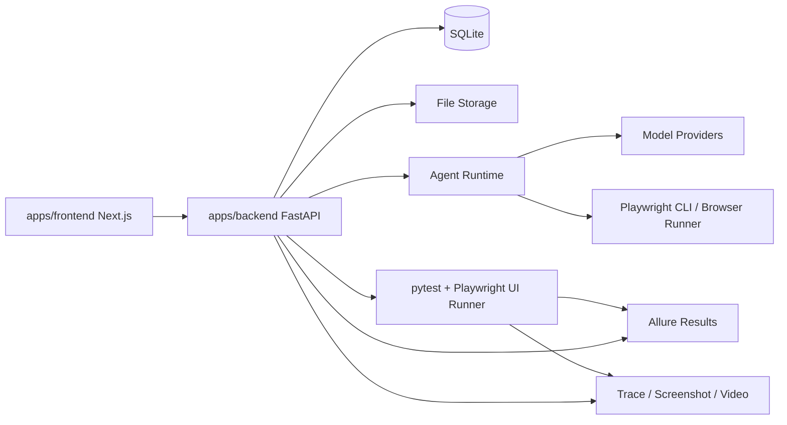
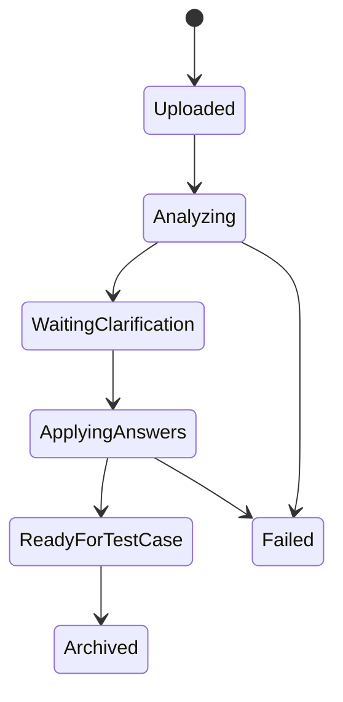
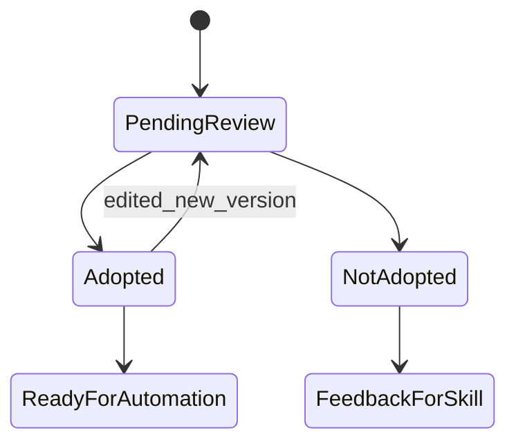
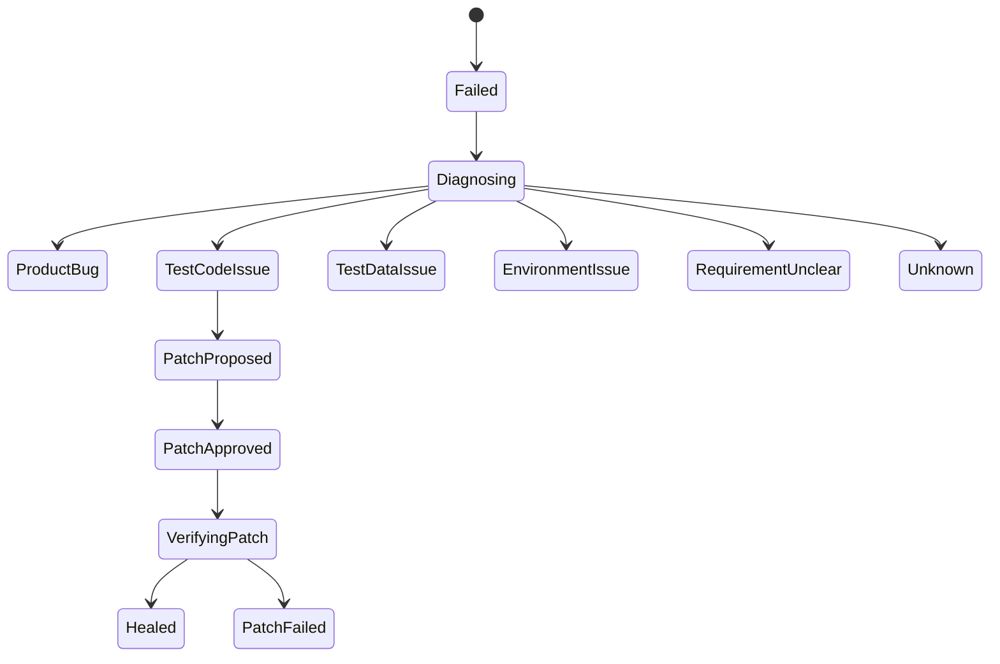

# 00-01 AI测试系统 - PRD

## 1. 需求概述（5W2H）

### 1.1 What - 是什么

构建一套面向软件测试团队、测试工程师和质量管理人员的 AI 测试系统。系统以“项目”为主业务边界，围绕需求文档、站点探索结果、项目知识库、测试用例、自动化测试代码和执行报告形成闭环。

系统不是单纯的“测试用例生成器”，而是一套可沉淀项目知识、可解释需求疑点、可探索被测站点、可生成测试资产、可运行自动化测试、可诊断失败原因并在安全边界内自修复测试代码的测试工作台。

核心能力包括：

- 用户登录、管理员创建账号、账号配置和个人偏好管理；第一版不开放用户自助注册
- 控制台面板，展示项目数、用例资产数、测试用例采纳率、UI 自动化测试用例数、UI 自动化覆盖率、发现缺陷数量、待处理事项和任务信息概览；接口自动化第一期不纳入统计
- 项目管理，按项目隔离需求、站点、知识库、测试用例、自动化代码、运行记录和模型配置
- 需求/功能分析，支持上传一个或多个 PRD、FSD、BRD、接口说明，系统将多个来源文件汇总归并为一份项目级 Markdown 需求工作稿；识别需求不清楚点、状态流转、依赖关系、异常路径和待确认问题；需求文档不按文件拆分，评审时按模块对同一份需求工作稿进行评审
- 澄清问答闭环，用户回答系统提出的问题后，系统将结论写回需求文档 Markdown 工作稿的新版本，等待知识库界面显式生成或更新
- 站点探索，基于 Playwright CLI、`playwright-cli` skill、探索 skill 和探索 Agent 登录并遍历站点，按模块生成页面、表单、操作、状态流转、依赖关系和风险点文档；探索文档同样先作为来源材料，不自动进入正式知识库
- 项目知识库，在知识库界面由用户点击“生成知识库”或“更新知识库”后，基于已确认的需求文档版本、需求分析、澄清写回记录、站点探索结果和文档版本记录生成类似 `llm-wiki` 的模块化知识库文档
- 测试用例生成，根据项目知识库、需求分析结果和站点探索结果生成结构化测试用例，支持人工评审、补充和版本化
- UI 自动化测试用例生成，第一期基于 pytest + Playwright + Allure 生成可执行 UI 测试代码、页面对象、测试数据和报告挂接
- 接口自动化预留，后续可基于 pytest + requests + Allure 生成和执行接口自动化；第一期只在导航中展示 Soon 状态，不可选择、不可创建任务
- 元素定位补充和自愈，自动调用探索 Agent 补充定位信息；执行失败时先记录失败和证据，人工对失败功能启用自愈后，再区分产品 Bug、环境问题、测试数据问题和自动化代码问题；对明确属于测试代码的问题生成修复建议，由人工确认后应用
- 模型配置，为需求分析、站点探索、测试用例生成、测试代码生成、失败诊断分别配置模型、Provider、温度、上下文限制和安全策略
- 智能体框架，优先使用 OpenAI Agents SDK 作为 Agent 编排基础，采用“Agent 负责编排与判断、Skill 负责可复用能力、后端 Service 负责校验、状态流转和落库”的三层分工，并通过 Skill 接入需求分析、站点探索、知识库构建、用例生成、代码生成、自愈诊断等能力

### 1.2 Why - 为什么

当前测试资产生产链路通常存在以下问题：

- 需求文档和测试用例之间缺少可追踪关系，测试遗漏难以及时发现
- 需求不清楚时依赖人工经验追问，问题列表不系统，澄清结果也难回灌
- 站点真实交互、页面状态、字段约束和业务文档经常不一致
- 测试用例生成后缺少项目知识约束，容易泛化、重复、覆盖不足
- 自动化代码生成缺少真实定位信息、真实登录流程和页面状态，落地成本高
- 自动化失败后经常混淆产品 Bug、测试脚本问题、环境问题和数据问题
- 项目知识散落在文档、测试代码、Allure 报告、聊天记录和人工经验里，无法持续复用

本系统的目标是把“需求理解、站点探索、知识沉淀、用例设计、自动化生成、执行诊断、自愈修复”串成可审计闭环，让测试资产随着项目迭代持续变厚，而不是每次从零开始。

### 1.3 Who - 谁

核心用户角色：

| 角色 | 职责 | 关键诉求 |
| --- | --- | --- |
| 管理员 | 拥有系统和项目的所有权限，包括用户、模型、全局配置、项目、项目分配、需求、知识库、用例、自动化、报告和自愈管理 | 统一承担系统管理和项目管理职责，减少第一版权限复杂度 |
| 测试工程师 | 只能查看和操作分配给自己的项目，可进行需求分析、站点探索、知识确认、测试用例生成/维护、自动化生成/执行、失败诊断和自愈确认 | 聚焦具体项目的测试资产建设和自动化落地 |
| 访客 | 管理员能看的内容都能看，包括全部项目信息、需求分析、知识库、测试用例、自动化执行报告和缺陷诊断结果 | 全局只读查看，不能新增、编辑、删除、执行、确认或配置 |

MVP 默认角色建议：

- 管理员
- 测试工程师
- 访客

MVP 阶段只保留三类权限，不再区分系统管理员和项目管理员，也不拆测试负责人、自动化工程师、业务确认人等细分角色。后续如果出现明确的审批、合规或职责隔离要求，再从管理员或测试工程师中拆出更细角色。

基础权限边界：

| 权限项 | 管理员 | 测试工程师 | 访客 |
| --- | --- | --- | --- |
| 查看全部项目 | 是 | 否，仅分配项目 | 是 |
| 创建项目 | 是 | 否 | 否 |
| 编辑项目配置 | 是 | 否 | 否 |
| 管理用户与项目分配 | 是 | 否 | 否 |
| 配置模型和系统资源 | 是 | 否 | 否 |
| 查看需求、知识库、用例、自动化、报告 | 是 | 仅分配项目 | 是 |
| 上传需求文档 | 是 | 仅分配项目 | 否 |
| 发起需求分析 | 是 | 仅分配项目 | 否 |
| 回答澄清问题 | 是 | 仅分配项目 | 否 |
| 确认知识条目 | 是 | 仅分配项目 | 否 |
| 生成和编辑测试用例 | 是 | 仅分配项目 | 否 |
| 评审和采纳测试用例 | 是 | 仅分配项目 | 否 |
| 生成自动化测试代码 | 是 | 仅分配项目 | 否 |
| 执行自动化测试 | 是 | 仅分配项目 | 否 |
| 确认自愈补丁 | 是 | 仅分配项目 | 否 |
| 查看缺陷诊断 | 是 | 仅分配项目 | 是 |

### 1.4 When - 何时使用

典型使用时机：

- 新项目启动，需要从需求文档建立测试资产
- 需求变更，需要重新分析影响范围和测试回归范围
- Web 系统已有页面，需要通过站点探索生成页面和流程知识
- 测试工程师需要检查用例覆盖是否完整
- 测试工程师需要根据稳定用例生成 pytest + Playwright UI 自动化代码
- 自动化执行失败，需要判断是 Bug、环境问题、数据问题还是代码问题
- 项目长期迭代，需要持续沉淀知识库并复用历史测试经验

### 1.5 Where - 使用环境

系统由三类运行面组成：

- Web 管理端：用户登录、项目管理、需求分析、站点探索、知识库、测试用例、自动化运行和配置管理
- 后端 API 与任务运行时：FastAPI 提供业务 API，后台任务执行文档解析、Agent 分析、站点探索调度、用例生成和自动化执行
- 自动化执行环境：第一版固定为本地运行，仅支持 UI 自动化，使用 pytest + Playwright + Allure 执行测试并归档报告；接口自动化 pytest + requests + Allure 只预留模块入口，不进入第一版实现范围；容器 Runner、CI Runner 不进入第一版范围

### 1.6 How - 如何工作

核心闭环如下：

```mermaid
flowchart LR
    Project["创建项目"] --> Inputs["导入需求/站点/接口资料"]
    Inputs --> Analysis["需求与功能分析"]
    Analysis --> Questions["生成澄清问题"]
    Questions --> Answers["用户回答并确认"]
    Answers --> SourceVersion["更新需求文档版本/分析结论"]
    Project --> Explore["站点探索"]
    Explore --> SourceVersion
    SourceVersion --> KnowledgeAction["知识库界面：生成/更新知识库"]
    KnowledgeAction --> Knowledge["模块化项目知识库"]
    Knowledge --> Cases["生成测试用例"]
    Cases --> Review["人工评审与版本化"]
    Review --> AutoCode["生成自动化测试代码"]
    AutoCode --> Run["执行 pytest + Playwright UI 自动化"]
    Run --> Report["Allure 报告与运行记录"]
    Report --> Diagnose["失败诊断"]
    Diagnose --> Bug["产品 Bug"]
    Diagnose --> ManualHeal["人工启用自愈"]
    ManualHeal --> Fix["测试代码修复建议"]
    Fix --> AutoCode
    Diagnose --> Knowledge
```

系统必须坚持以下规则：

- 项目是第一业务隔离边界，需求、探索、知识库、用例、自动化和报告都必须归属于项目。
- 原始需求文档、站点探索文档和澄清写回记录是上游事实源，不能用生成后的测试用例反向替代原始需求。
- 上传文档或文件后不能直接落入正式知识库，必须先经过需求分析、澄清、编辑、确认等迭代；只有在知识库界面显式点击“生成知识库”或“更新知识库”后，才生成或刷新正式知识库文档。
- 原始 Word/PDF、探索 Markdown、截图、trace、video、Allure 报告等大文件保存在文件系统；SQLite 保存元数据、状态、索引、正文或路径、覆盖矩阵、评审状态和来源引用。
- 需求评审必须通过原文覆盖矩阵和模块评审验证，确保没有漏掉原始文档内容。
- 站点探索必须通过模块探索覆盖矩阵验证，确保探索范围内每个模块都有完成标记；无法探索的模块必须有情况说明和证据。
- 需求文档和探索文档都提供 AI 对话修改入口；用户可以用自然语言提出修改要求，但系统必须先生成 diff 或结构化补丁，人工确认后才生成新版本或补充记录。
- 需求文档和探索文档每次更新都必须生成版本变化日志，记录变化原因、影响模块和是否触发知识库更新。
- 后续新增需求材料必须先进入来源材料区，系统生成增量归并差异预览，用户确认后形成新的需求文档版本，再进入模块评审、澄清和知识库更新流程。
- 知识库界面采用类 Obsidian 的 Markdown vault 查看方式，并支持知识图谱查看知识库模块、页面、规则和来源之间的关系；知识图谱不展示测试用例和自动化脚本关系。
- 知识库第一版只保留三类业务状态：构建中、阻塞、已发布；只有已发布知识库可用于正式测试用例生成。
- 知识库进入阻塞后必须展示阻塞清单、来源位置、影响范围、建议动作和 AI 协助处理入口；AI 只能生成建议或草稿，用户确认并形成新来源后才能重新生成知识库。
- 测试用例生成不强制依赖 locator；locator 是 UI 自动化生成的准入条件。
- UI 自动化生成可以自动触发定向探索定位补充，但不能绕过 locator 准入，也不能凭空编造 locator。
- AI 生成内容必须带来源引用、置信度、待确认项和人工确认状态。
- 前端页面必须遵守统一布局模板和统一组件规范，列表页、详情页、编辑评审页、任务运行页不能各自使用不同风格；后端接口、状态、任务、错误码、文件访问和审计必须遵守统一详细设计规范。
- 自动化自愈不能默认自动触发。自动化运行失败后，系统先记录失败证据和初步分类，用户在失败功能、失败用例或失败运行中手动点击“启用自愈”后，才进入诊断和修复建议流程。
- 自动化自愈必须先诊断分类，再修复；不能为了让测试通过而放宽断言或兼容错误行为。
- 测试代码生成需要区分页面定位、业务步骤、测试数据、断言、Allure 展示和清理逻辑。

### 1.7 How much - MVP 范围

第一阶段建议覆盖单机或小团队使用场景：

- 支持 1 个系统实例、多个项目、多个用户
- 支持本地文件上传和本地任务执行
- 第一版统一使用 SQLite 作为主数据库
- 支持 OpenAI 兼容 Provider 配置
- 支持 Playwright 对 Web 站点探索和 pytest 测试执行
- 支持 Allure 报告产物归档和跳转
- 接口自动化第一期只预留导航入口和数据模型扩展点，不支持生成、执行和报告归档
- 暂不做多租户商业化计费、分布式 Runner 集群、复杂审批流和企业级 SSO

---

## 1.8 已确认产品口径

以下口径为当前 PRD 的统一决策，后续拆分 PRD 必须保持一致。

| 主题 | 已确认口径 |
| --- | --- |
| 需求评审与澄清 | 先评审发现问题，再进入澄清；澄清答案写回需求文档新版本后，对受影响模块重新评审或重新验证 |
| 知识库阻塞 | 阻塞页必须展示阻塞清单、来源位置、影响范围、建议动作和 AI 协助入口；AI 只能输出建议、草稿、差异预览或待确认补充记录，不能直接写入已发布知识库 |
| UI 自动化 locator | 生成 UI 自动化前先自动探索补齐 locator；如果单条用例补齐失败，不中断整个批次，继续处理其他可完成用例，最后汇总失败项给人工处理 |
| 新增需求归并 | 新增需求材料先进入来源材料区，系统自动判断归属已有模块、新模块、冲突修改、废弃旧规则或待澄清内容，并生成差异预览；用户确认后形成新需求文档版本 |
| 多文件需求汇总 | 同一项目下可上传多个需求文件，系统汇总为一份项目级 Markdown 需求工作稿，按模块组织，不按文件拆分 |
| 知识库状态 | 第一版只保留构建中、阻塞、已发布三态；只有已发布知识库可用于正式测试用例生成 |

---

## 1.9 总览 PRD 与拆分 PRD 的关系

`00-01-AI测试系统-PRD.md` 是产品总览和统一口径文档，负责定义系统目标、业务闭环、第一版范围、角色权限总边界、技术选型和已确认决策。

拆分 PRD 是各功能模块的详细需求说明，负责把总览中的功能拆到可评审、可设计、可开发、可验收的粒度。后续逐个功能确认时，以拆分 PRD 为主要讨论对象；如果拆分 PRD 与总览 PRD 出现冲突，以用户最新确认的决策为准，并同步回总览 PRD。

当前拆分关系：

| 文档 | 模块 | 与总览 PRD 的关系 |
| --- | --- | --- |
| `00-02-AI测试系统-权限管理PRD.md` | 权限管理 | 细化三类角色、登录、管理员创建账号、项目可见性 |
| `00-03-AI测试系统-需求文档分析与版本管理PRD.md` | 需求文档分析 | 细化文档上传、Markdown 预览编辑、版本、分析、澄清 |
| `00-04-AI测试系统-站点探索PRD.md` | 站点探索 | 细化 Playwright CLI 探索、验证码登录、探索文档、与需求融合 |
| `00-05-AI测试系统-知识库生成与更新PRD.md` | 项目知识库 | 细化 llm-wiki 知识库生成、更新、非向量检索、来源追踪 |
| `00-06-AI测试系统-项目管理PRD.md` | 项目管理 | 细化项目基础信息、成员、环境、资产归属 |
| `00-07-AI测试系统-控制台PRD.md` | 控制台 | 细化项目数、用例资产、采纳率、自动化、缺陷和任务概览 |
| `00-08-AI测试系统-测试用例生成PRD.md` | 测试用例 | 细化用例生成、评审、采纳、覆盖矩阵和版本 |
| `00-09-AI测试系统-自动化测试与Allure报告PRD.md` | UI 自动化与报告 | 细化本地 pytest + Playwright UI 自动化执行、Allure 报告和系统报告中心关系；接口自动化仅预留入口 |
| `00-10-AI测试系统-失败诊断与自愈PRD.md` | 失败诊断与自愈 | 细化人工启用自愈、失败分类、修复建议和内部 Bug 记录 |
| `00-11-AI测试系统-模型配置与AgentRuntimePRD.md` | 模型与 Agent | 细化模型用途、OpenAI Agents SDK、Skill 接入和任务运行时 |

---

## 2. 真实需求与边界

### 2.1 真实需求

真实需求不是“AI 帮我写几条测试用例”，而是：

**围绕项目建立一套可追溯、可补充、可执行、可诊断、可持续进化的测试资产生产系统。**

系统必须解决五个核心问题：

- 需求是否被充分理解
- 页面和业务流是否被真实探索
- 测试用例是否覆盖关键路径、异常路径、状态流转和依赖关系
- 自动化代码是否能在真实站点上稳定运行
- 执行失败是否能被准确分类并反馈到知识库或代码

### 2.2 不做什么

MVP 不做：

- 不做通用低代码测试平台
- 不做完全无人工审核的自动上线测试代码
- 不做移动 App 自动化
- 不做性能测试、压测、安全扫描全套能力
- 不做复杂多租户计费
- 不把 LLM 当成唯一事实源
- 不允许自愈逻辑自动放宽断言、跳过失败步骤或吞掉产品 Bug

### 2.3 质量门禁

任一需求分析、站点探索或测试生成任务进入“可用于生成自动化代码”状态前，必须具备：

- 明确的来源文档或来源页面
- 模块归属
- 业务对象和关键字段说明
- 主流程、异常流程、状态流转
- 依赖关系，如登录态、角色、数据前置、外部服务、接口依赖
- 待确认问题处理状态
- 覆盖矩阵，说明哪些需求点已有测试用例覆盖
- 人工确认记录

---

## 3. 信息架构与导航设计

### 3.1 导航总原则

前端基于 `next-shadcn-admin-dashboard-main` 的后台壳层设计，落地到 `apps/frontend`。当前模板支持 `NavGroup -> NavMainItem -> NavSubItem`，但 AI 测试系统第一版左侧导航只使用“组名称 + 高频一级模块”，二级功能进入页面后由 Tabs、子导航、卡片入口或面包屑承载。

导航设计原则：

- 左侧侧边栏使用分组导航，不把所有能力平铺成一组。
- 组名称表达工作上下文，一级模块表达高频用户任务。
- 二级功能不在左侧常驻展示，避免一级和二级同时展开造成信息过载。
- 项目是业务隔离边界，但不在左侧展开项目树；项目上下文通过页面右上角项目切换器、页面标题和面包屑表达。
- 项目切换器提供“全部项目”和“指定项目”两类工作分区；控制台、任务中心、报告中心的数据也必须受当前分区约束，需求、探索、知识库、用例和自动化必须在指定项目下工作。
- 详情页、编辑页、版本页、任务日志页、失败诊断详情页用页面内 Tabs、面包屑和详情布局承载，不继续塞进侧边栏。
- `接口自动化` 第一期开启导航占位，但标记 `Soon`，不可选择，不创建任务。
- 访客可看到管理员可见的导航，但写操作入口禁用；测试工程师只看到分配项目相关入口。

详细导航映射见：`docs/05-前端方案/05-02-AI测试系统-导航与页面映射清单.md`。

### 3.2 分组导航设计

| 组名称 | 左侧一级模块 | 路由建议 | 状态 |
| --- | --- | --- | --- |
| 工作台 | 控制台 | `/dashboard` | 可用 |
| 工作台 | 任务中心 | `/tasks` | 可用 |
| 项目工作区 | 项目 | `/projects` | 可用 |
| 项目工作区 | 需求 | `/projects/:projectId/requirements` | 可用 |
| 项目工作区 | 探索 | `/projects/:projectId/exploration` | 可用 |
| 项目工作区 | 知识库 | `/projects/:projectId/knowledge` | 可用 |
| 测试资产 | 测试用例 | `/projects/:projectId/test-cases` | 可用 |
| 测试资产 | UI 自动化 | `/projects/:projectId/automation/ui` | 可用 |
| 测试资产 | 接口自动化 | `/projects/:projectId/automation/api` | Soon，不可选择 |
| 测试资产 | 报告中心 | `/reports` | 可用 |
| 系统管理 | 模型配置 | `/settings/models` | 管理员可写 |
| 系统管理 | 用户与权限 | `/settings/users` | 管理员可写 |
| 系统管理 | 系统设置 | `/settings/system` | 管理员可写 |

### 3.3 导航交互规则

- 左侧组名称固定展示，例如“工作台”“项目工作区”“测试资产”“系统管理”。
- 左侧只展示一级模块，不常驻展示二级模块。
- 二级功能进入页面后，通过页面内 Tabs、子导航、卡片入口或面包屑展示。
- 当前路由命中某个二级功能时，左侧只高亮所属一级模块。
- 项目相关页面右上角需要展示项目切换器和当前项目名称。
- 项目内一级模块必须带 `projectId` 或通过当前项目上下文解析；没有选择项目时点击项目内模块，应先进入项目列表或项目选择页。
- 在“全部项目”分区下，只允许查看控制台、任务中心、报告中心等跨项目信息；生成知识库、上传需求、发起探索、生成用例、生成或执行 UI 自动化等写操作必须先选择指定项目。
- `Soon` 菜单使用灰色状态和 `Soon` Badge；不可触发创建、生成、执行动作。
- 如果模板处于 collapsed 状态，一级模块用图标展示。
- 移动端侧边栏使用抽屉，点击一级模块后进入对应页面并收起。

### 3.4 控制台面板内容

控制台不是普通统计面板，而是项目测试资产健康驾驶舱。它必须回答三个问题：

- 当前测试资产建设是否健康
- 哪些事项需要人工处理
- 哪些任务、失败或缺陷需要优先跟进

核心概览指标：

| 指标 | 口径 | 说明 |
| --- | --- | --- |
| 项目数 | 未归档项目总数，可展示本周新增 | 衡量系统内活跃测试项目规模 |
| 用例资产数 | 测试用例总数，包含待评审、已采纳、不采纳 | 衡量项目测试资产沉淀规模 |
| 测试用例采纳率 | 已采纳用例数 / AI 生成用例总数 | 衡量 AI 生成用例质量和人工可用性 |
| UI 自动化测试用例数 | 已生成 pytest + Playwright UI 自动化代码且可执行的用例数 | 衡量第一期 UI 自动化资产规模 |
| UI 自动化覆盖率 | UI 自动化测试用例数 / 已采纳测试用例数 | 衡量已确认用例中有多少进入 UI 自动化回归 |
| 发现缺陷数量 | 失败诊断中分类为产品 Bug 的缺陷数 | 衡量自动化和 AI 诊断发现的真实产品问题 |
| 待处理事项数 | 待澄清、待评审、待诊断、自愈待确认的总数 | 驱动用户下一步动作 |

待处理事项必须按类型拆分展示：

| 待处理类型 | 说明 | 默认动作 |
| --- | --- | --- |
| 待回答澄清问题 | 需求分析中仍需用户补充的问题 | 进入澄清问题工作台 |
| 待评审测试用例 | AI 已生成但未被人工确认的用例 | 进入用例评审页 |
| 失败待诊断 | 自动化执行失败但尚未完成分类 | 进入失败诊断页 |
| 自愈补丁待确认 | 已生成修复建议但未确认应用 | 进入自愈补丁详情 |
| 知识库构建阻塞 | 待确认问题、未解决冲突、无法探索模块等阻塞正式知识库发布的问题 | 进入知识库更新检查页 |

任务信息必须采用“最近任务流 + 可执行下一步”的形式，不只展示任务名称：

| 字段 | 说明 |
| --- | --- |
| 任务名称 | 例如“CRM系统-用户管理用例生成” |
| 所属项目 | 可点击进入项目概览 |
| 任务类型 | 需求分析、知识库构建、用例生成、自动化生成、自动化执行、失败诊断、自愈验证 |
| 状态 | 排队中、运行中、等待人工、成功、失败、已取消 |
| 当前阶段 | 例如“正在生成覆盖矩阵”“等待确认自愈补丁” |
| 触发人 | 发起任务的用户 |
| 开始时间 | 任务开始时间 |
| 耗时 | 已运行时长或最终耗时 |
| 结果入口 | 查看分析、查看用例、查看报告、查看失败原因 |
| 下一步动作 | 回答问题、评审用例、查看报告、确认自愈、重新运行 |

---

## 4. 核心业务对象

| 对象                    | 说明         | 关键关系                                        |
| --------------------- | ---------- | ------------------------------------------- |
| User                  | 系统用户       | 可加入多个项目                                     |
| Role                  | 角色         | 控制系统和项目权限                                   |
| Project               | 测试项目       | 所有测试资产的根边界                                  |
| ProjectEnvironment    | 项目环境       | dev/test/pre/prod、本地地址、登录配置                 |
| ModelProvider         | 模型供应商      | OpenAI、兼容 OpenAI API 的 Provider、本地模型服务      |
| ModelProfile          | 模型配置       | 按用途绑定模型，如需求分析、代码生成                          |
| SourceDocument        | 原始文档       | PRD、FSD、BRD、接口说明、探索文档；上传后只作为来源材料，不直接进入正式知识库 |
| SourceDocumentVersion | 文档版本       | 保存每次上传、转换、在线编辑、澄清应用后的 Markdown 内容和变更记录      |
| RequirementAnalysis   | 需求分析版本     | 从文档中提取业务对象、流程、疑点和覆盖点                        |
| ClarificationQuestion | 澄清问题       | 用户回答后回灌需求分析和文档版本记录，作为后续知识库生成/更新输入           |
| SiteProfile           | 被测站点配置     | URL、登录方式、账号、角色、探索范围                         |
| ExplorationRun        | 站点探索任务     | Playwright 探索过程和结果                          |
| PageModule            | 页面模块       | 按业务模块组织页面事实                                 |
| PageStateFlow         | 页面状态流转     | 页面、动作、状态、依赖关系                               |
| SourceFusionMap       | 来源融合映射     | 记录需求模块、探索模块、页面事实和知识库模块之间的映射关系               |
| SourceConflictItem    | 来源冲突项      | 记录需求文档和探索文档之间的不一致、待确认问题和处理结论                |
| KnowledgeItem         | 知识条目       | 需求事实、页面事实、业务规则、接口事实、测试关注点                   |
| KnowledgeBuild        | 知识库生成/更新记录 | 记录从哪些文档版本、分析版本、澄清写回记录和探索结果生成了哪一版模块化知识库      |
| TestCaseSet           | 测试用例集      | 对应一次生成或人工整理版本                               |
| TestCase              | 测试用例       | 业务路径、前置条件、步骤、数据、预期结果                        |
| AutomationSuite       | 自动化套件      | pytest 代码集和配置                               |
| LocatorRecord         | 元素定位记录     | 页面、元素语义、多定位策略、稳定性评分                         |
| TestRun               | 测试执行       | 命令、环境、报告、结果                                 |
| FailureDiagnosis      | 失败诊断       | Bug/代码/环境/数据/未知分类和证据                        |
| SelfHealingPatch      | 自愈补丁       | 修复建议、差异、验证结果和审批状态                           |

---

## 5. 功能需求

### 5.1 用户登录与账号管理

用户故事：

1. 作为管理员，我希望创建用户账号并分配角色，以便控制系统成员来源。
2. 作为已有用户，我希望通过账号密码登录，以便访问我的项目和测试资产。
3. 作为管理员，我希望启用、禁用、重置用户账号，以便管理离职、临时访客或权限变化。
4. 作为用户，我希望能修改密码、头像、显示名称和默认项目，以便管理个人配置。

验收标准：

- 系统不提供公开注册入口，账号只能由管理员创建
- 创建账号字段至少包含用户名、邮箱、初始密码、角色、状态
- 登录支持账号或邮箱
- 密码必须加密存储，不允许明文
- 登录失败给出明确但不泄露账号存在性的提示
- 登录成功后进入控制台
- 未登录访问项目页面时跳转登录页
- 支持退出登录

### 5.2 控制台面板

用户故事：

1. 作为测试工程师，我希望打开系统后看到所有项目的测试资产和风险概览，以便快速判断工作重点。
2. 作为测试工程师，我希望看到分配给我的待处理澄清、待评审用例和失败诊断，以便继续处理。
3. 作为测试工程师，我希望看到最近失败、自愈建议和执行报告，以便优先修复高影响问题。
4. 作为管理员，我希望看到项目数、用例资产数、采纳率、UI 自动化覆盖率和发现缺陷数量，以便判断测试资产建设是否健康。

验收标准：

- 控制台展示受右上角项目切换器约束的概览卡片、待处理事项、最近任务流、质量趋势和最近失败记录
- 在“全部项目”分区下，概览卡片至少包含：项目数、用例资产数、测试用例采纳率、UI 自动化测试用例数、UI 自动化覆盖率、发现缺陷数量、待处理事项数
- 在“指定项目”分区下，项目数卡片替换为项目资产摘要，例如需求文档数量、知识库版本、测试用例数量和 UI 自动化用例数量，其余指标只统计当前项目
- 控制台不把“站点探索次数”作为核心概览指标；站点探索只作为任务类型、项目模块和任务详情展示
- 测试用例采纳率必须按“已采纳用例数 / AI 生成用例总数”计算
- UI 自动化覆盖率必须按“UI 自动化测试用例数 / 已采纳测试用例数”计算
- 发现缺陷数量必须来自失败诊断中分类为“产品 Bug”的记录
- 待处理事项至少包含：待回答澄清问题、待评审测试用例、失败待诊断、自愈补丁待确认、知识库构建阻塞
- 最近任务流必须展示任务名称、所属项目、任务类型、状态、当前阶段、触发人、开始时间、耗时、结果入口和下一步动作
- 控制台、任务中心和报告中心通过右上角项目切换器控制数据范围，不再单独设计弱项目筛选
- 点击指标可跳转到对应列表
- 任务状态至少包含：排队中、运行中、等待人工、成功、失败、已取消

### 5.3 项目管理

用户故事：

1. 作为管理员，我希望创建测试项目，以便隔离某个被测系统的需求、知识和测试资产。
2. 作为管理员，我希望配置项目环境、站点地址、登录方式和默认模型策略，以便后续探索和执行复用。
3. 作为管理员，我希望邀请成员并分配角色，以便多人协作。
4. 作为测试工程师，我希望查看项目资产健康度，以便判断项目是否具备生成自动化的条件。

验收标准：

- 项目字段至少包含名称、编码、描述、默认站点地址、默认环境、负责人、创建时间、更新时间和归档时间；第一版不设计复杂项目状态，只保留正常和已归档生命周期
- 项目列表只支持按项目名称搜索，不提供状态、负责人、是否有知识库、是否有待处理事项等筛选条件
- 项目列表展示描述、测试工程师数量、需求文档数量、知识库版本、测试用例数量、UI 自动化用例数量和操作列
- 项目编码唯一，用于目录、报告和任务归属
- 项目支持启用、归档
- 项目下资产不能跨项目误用，除非用户显式复制或导入
- 项目设置中可以配置站点环境、登录凭据引用、Runner 策略和模型策略

### 5.4 需求/功能分析模块

用户故事：

1. 作为测试工程师，我希望上传需求文档，以便系统提取业务模块、功能点、流程和风险。
2. 作为测试工程师，我希望可以上传多个需求文件，并由系统汇总成一份按模块组织的需求工作稿，以便统一评审。
3. 作为测试工程师，我希望后续新增需求材料能归并到已有需求工作稿，并看到差异预览，以便确认影响范围。
4. 作为测试工程师，我希望在没有需求文档时，可以基于站点探索文档生成候选需求文档，以便先进入需求评审。
5. 作为测试工程师，我希望在需求评审中提出疑问后进入澄清流程，以便把回答写回需求工作稿新版本。
6. 作为测试工程师，我希望看到系统整理出的不清楚点，以便逐条回答。
7. 作为测试工程师，我希望预览 Markdown 格式的需求文档，并能在线编辑，以便在系统内完成需求修订。
8. 作为测试工程师，我希望每次上传、转换、编辑、澄清应用都有版本记录，以便后续知识库更新能知道变化来源。
9. 作为管理员，我希望用户回答澄清问题后，系统先写回需求文档工作稿并生成新版本，而不是直接写入正式知识库，以便知识库生成仍由人工显式触发。

输入范围：

- Markdown
- Word 文档转换后的 Markdown
- PDF 转文本后的 Markdown
- 站点探索 Markdown，仅用于生成候选需求文档或补充页面事实
- OpenAPI 或接口说明文档

文档处理规则：

- 上传文件后先创建 `SourceDocument` 和首个 `SourceDocumentVersion`。
- 多个需求文件先作为来源材料保存，系统汇总归并为一份项目级 Markdown 需求工作稿。
- 项目级需求工作稿按模块组织，不按上传文件拆分；每条规则、字段、流程和状态必须保留来源文件引用。
- 后续新增需求材料先进入来源材料区，系统判断属于已有模块、新模块、冲突修改、废弃旧规则或待澄清内容。
- 新增需求归并必须生成差异预览，用户确认后才生成新的需求文档版本。
- Word、PDF 等非 Markdown 文件必须先由文档转换 Agent 转换为 Markdown，转换后的 Markdown 作为可预览、可编辑的工作稿。
- 文档转换 Agent 只负责高保真转换和质量检查，不生成业务结论。
- 转换质量检查必须覆盖标题层级、段落、表格、图片/流程图、编号列表、页眉页脚和无法识别项。
- 存在关键无法识别内容时，转换结果状态为“需人工处理”，不能进入正式需求分析。
- 原始文件必须保留，Markdown 工作稿可以迭代编辑。
- 需求分析不是摘要生成，必须覆盖原始文档的章节、段落、表格、图片说明、流程和字段。
- 系统必须生成原文覆盖矩阵，标明每块原文内容已覆盖、待归类、待澄清、无需测试或已废弃。
- 文档预览区默认展示 Markdown 渲染结果，并支持切换到 Markdown 源码视图。
- 在线编辑保存后必须生成新的文档版本，不允许直接覆盖旧版本。
- 文档详情页提供 AI 对话修改区域，支持根据用户自然语言要求生成 Markdown diff。
- AI 对话修改不能直接覆盖文档，必须由用户在 diff 预览中确认。
- AI 对话修改完成后必须记录用户指令、修改原因、来源引用、影响范围和版本记录。
- 需求文档版本变化必须写入版本变化日志，供知识库判断是否需要更新。
- 每个文档版本必须记录版本号、来源动作、编辑人、编辑时间、变更摘要和差异。
- 澄清答案应用后，必须写回 Markdown 工作稿并生成新的文档版本，同时生成新的分析版本并记录关联的澄清问题。
- 需求评审负责发现问题和提出澄清；澄清流程负责回答问题并写回需求文档新版本。写回后，受影响模块必须重新评审或重新验证。
- 没有需求文档时，探索文档可生成候选需求文档；候选需求文档必须评审确认后才能作为正式需求来源。
- 上传文档、编辑文档、应用澄清答案、生成候选需求文档都不会直接生成正式知识库，只会成为后续知识库生成/更新的输入。

分析输出：

- 模块列表
- 功能点列表
- 业务对象和字段
- 主流程
- 分支流程
- 异常流程
- 状态流转
- 依赖关系
- 权限和角色差异
- 数据前置和数据清理要求
- 不清楚点和追问
- 测试关注点
- 覆盖矩阵初稿
- 原文覆盖矩阵

模块评审规则：

- 需求评审按模块进行，不一次性确认整份文档。
- 每个模块展示原文引用、功能点、业务规则、流程、字段、状态、权限、数据依赖、测试关注点和澄清问题。
- 每个模块可独立进入待评审、评审中、有澄清、已完成、已废弃状态。
- 每评审完一个模块，模块状态变为已完成。
- 所有模块已完成或已废弃，且无关键待澄清问题后，整份需求才可标记已确认。
- 原文覆盖矩阵中待归类或关键待澄清内容未处理前，需求不能进入知识库生成。

澄清表单规则：

- 不清楚点必须生成结构化澄清表单，不只保留聊天记录。
- 澄清表单至少包含所属模块、问题标题、原文引用、问题说明、问题类型、影响范围、当前假设、测试影响、用户回答、写回位置和状态。
- 澄清问题类型包括缺规则、冲突、边界不清、异常不清、权限不清、数据不清、提示语不清。
- 澄清回答应用后必须写回 Markdown 工作稿并生成新版本。

评审策略：

- 完整性评审：原文每一段、表格、流程图是否有归属或处理结论。
- 可测试性评审：每个规则是否能生成明确测试步骤和预期结果。
- 边界值评审：字段长度、必填、格式、上下限、重复值、空值是否清楚。
- 异常路径评审：校验失败、无权限、依赖缺失、网络失败、数据不存在是否清楚。
- 状态流转评审：状态来源、触发动作、目标状态和回退规则是否清楚。
- 权限评审：不同角色能看什么、能操作什么、禁止后如何提示。
- 数据依赖评审：前置数据、测试数据构造、清理规则是否明确。
- 冲突评审：同一规则在不同段落是否矛盾。
- 探索补充评审：已有探索文档时，用字段、按钮、提示语、真实流转补充测试视角，但不能直接覆盖需求。
- 风险评审：核心业务路径、高风险路径、不可自动化路径是否标记。

澄清问题状态：

| 状态 | 说明 |
| --- | --- |
| 待回答 | 系统提出，等待用户补充 |
| 已回答 | 用户已回答，等待应用 |
| 已应用 | 已写回需求文档新版本，等待知识库生成/更新时引用 |
| 无需确认 | 经用户判断不需要补充 |
| 已废弃 | 问题不再适用 |

验收标准：

- 每个分析结果必须保留来源引用
- 需求分析必须生成原文覆盖矩阵，证明原始文档内容没有被漏掉
- 每个不清楚点必须说明原因、影响范围和建议提问对象
- 不清楚点必须形成结构化澄清表单，方便测试工程师补充并写回需求文档
- 用户回答后不能覆盖原始上传文件，必须写回 Markdown 工作稿并生成新版本
- 需求文档不拆分为多个需求文件，但评审界面必须支持按模块评审
- 每个模块评审完成后标记已完成，所有模块完成且无关键待澄清问题后，整份需求才算已确认
- 没有需求文档时，必须先基于探索文档生成候选需求文档并评审确认，不能直接把探索文档当正式需求
- 需求分析版本必须可回看和对比
- 分析结果进入“可生成用例”前，必须没有未处理的关键澄清问题
- 需求文档详情页必须支持 Markdown 预览、Markdown 源码查看和在线编辑
- 每次文档上传、转换、编辑、澄清应用必须生成版本记录
- 文档版本必须支持查看历史版本、查看差异、回看变更摘要
- 知识库更新时必须能选择或自动识别参与更新的文档版本和变更范围

### 5.5 站点探索模块

用户故事：

1. 作为测试工程师，我希望配置被测站点地址和登录账号，以便系统自动进入站点探索。
2. 作为测试工程师，我希望站点探索结果按业务模块组织，以便直接用于生成测试用例。
3. 作为测试工程师，我希望探索结果包含页面元素定位、动作、状态和依赖关系，以便生成可运行的 Playwright 测试。
4. 作为测试工程师，我希望探索 Agent 能记录失败和不可访问页面，以便人工补充。

探索方式：

- 使用 Playwright CLI、`playwright-cli` skill、探索 skill 或 Agent Browser 进入网站
- 探索 Agent 负责读取站点配置、调用浏览器工具、登录站点、遍历菜单和页面、记录页面事实
- 支持有头模式调试和无头模式任务执行
- 支持保存登录态
- 支持按 URL 白名单、菜单范围、模块范围限制探索
- 支持人工补充路径和禁止路径
- 探索范围内每个模块必须生成探索覆盖记录和完成标记
- 无法探索的模块必须记录失败原因、证据附件、影响范围和建议动作

探索文档必须包含：

- 站点基本信息：URL、环境、登录用户、角色、探索时间
- 模块目录：菜单、路由、页面标题
- 页面结构：列表、表单、弹窗、详情、Tab、筛选、分页、操作按钮
- 关键字段：字段名、输入类型、必填、默认值、校验规则、展示格式
- 操作路径：新增、编辑、删除、查询、导入、导出、启用、禁用、审批等
- 状态流转：状态值、触发动作、前置条件、结果状态
- 依赖关系：登录态、角色权限、前置数据、接口依赖、外部服务
- 元素定位：语义名称、推荐 locator、备用 locator、稳定性说明
- 风险点：不可访问、无权限、弹窗异常、接口错误、页面空状态

探索功能产物分为两类正式资产：

| 产物 | 内容 | 主要用途 |
| --- | --- | --- |
| 探索文档 | 页面、模块、业务路径、字段、按钮、弹窗、状态流转、真实操作路径 | 补齐页面事实，参与知识库构建、需求评审补充和测试用例生成 |
| 元素定位信息 | 关键元素 locator、备用 locator、稳定性说明、页面截图、trace、页面快照、可访问名称和来源引用 | 支撑 Playwright UI 自动化代码生成，减少代码生成阶段重复探索页面和因元素不足导致的生成失败 |

Playwright UI 自动化代码生成时，系统优先复用探索文档和元素定位信息；只有缺失关键 locator 或页面事实不足时，才触发定向探索定位补充。

验收标准：

- 探索结果按模块生成文档
- 文档内部必须包含状态流转和依赖关系
- 探索任务产生的页面事实先作为来源材料保存，不能自动进入正式知识库
- 元素定位信息可被自动化测试生成模块引用
- 对探索失败页面必须记录失败原因、截图或 trace 引用
- 探索文档详情页提供 AI 对话修改区域，支持补充说明、调整模块归类、整理页面事实、生成候选需求片段
- AI 对话修改探索文档必须生成 diff 或结构化补丁，人工确认后才生成新版本或补充记录
- 探索文档版本变化必须写入版本变化日志，供知识库判断是否需要更新
- 探索任务必须生成模块探索覆盖矩阵，模块状态包括待探索、探索中、已完成、部分完成、无法探索、已跳过
- 存在无法探索模块时，任务不能标记为完全成功，只能标记为部分完成或完成但有阻塞
- 若项目没有需求文档，探索文档可生成候选需求文档；候选需求文档评审确认后才能作为知识库业务来源
- 若项目已有需求文档，探索文档必须与需求分析结果进行模块映射、事实补齐和冲突识别，作为需求评审补充和用例生成补充，不能直接覆盖需求事实

### 5.6 项目知识库

用户故事：

1. 作为管理员，我希望存储项目知识库，以便后续生成测试用例和自动化代码时充分理解业务。
2. 作为测试工程师，我希望知识库区分需求事实、页面事实、接口事实和测试关注点，以便审查来源和可信度。
3. 作为测试工程师，我希望澄清写回记录、探索结果和人工确认补充能沉淀为知识，以便减少重复分析。
4. 作为测试工程师，我希望在知识库界面点击“生成知识库”后，系统再基于已确认材料生成类似 `llm-wiki` 的模块化知识库文档，以便避免上传材料未经确认就污染知识库。
5. 作为测试工程师，我希望需求文档修改后，可以在知识库界面点击“更新知识库”，让系统基于文档变更和分析结论增量更新知识库。

知识类型：

| 类型 | 来源 | 用途 |
| --- | --- | --- |
| 需求事实 | 写回澄清后的需求文档版本、已确认候选需求文档 | 生成测试点和测试用例 |
| 页面事实 | 站点探索 | 生成页面步骤和定位策略 |
| 业务规则 | 人工维护、需求分析 | 生成断言和边界场景 |
| 接口事实 | OpenAPI、接口文档、抓包 | 生成 API 前置和校验 |
| 测试关注点 | 风险路径、边界条件、异常路径、权限差异、状态流转测试建议 | 指导用例生成和回归设计 |
| 缺陷知识 | 人工确认的 Bug 分类和修复结论 | 回归测试和风险分析 |

知识状态：

- 草稿
- 待确认
- 已确认
- 已废弃

知识库生成规则：

- 上传文档、上传文件、站点探索、澄清回答、在线编辑都只是知识库输入来源，不直接生成正式知识库。
- 澄清回答必须先写回需求文档 Markdown 工作稿的新版本；知识库以写回后的需求文档版本作为业务口径。
- 只有探索文档且没有需求文档时，必须先生成候选需求文档并完成评审确认，不能直接把探索文档提升为正式知识库业务来源。
- 正式知识库只能通过知识库界面的“生成知识库”动作创建。
- 当需求文档、分析结果、澄清写回记录、候选需求确认记录或站点探索结果发生变化后，知识库界面必须提示“存在可更新来源”。
- 用户点击“更新知识库”后，系统根据变更范围生成更新计划，展示将新增、修改、废弃的模块和知识条目。
- 更新知识库不能静默覆盖旧知识库，必须生成新的 `KnowledgeBuild` 记录。
- 旧版知识库必须可回看，用于解释历史测试用例和历史自动化代码的来源。
- 知识库生成和更新必须保留来源引用，能追踪到具体文档版本、分析版本、澄清写回记录或探索文档。
- 知识库必须读取需求文档和探索文档的版本变化日志，判断是否存在可更新来源。
- 知识库界面支持类 Obsidian 的目录树、Markdown 阅读、双向链接预览和知识库模块间关系图谱。

知识库来源整合策略：

| 场景 | 主来源 | 辅助来源 | 生成策略 |
| --- | --- | --- | --- |
| 只有探索文档，没有需求文档 | 已确认候选需求文档 | 站点探索文档、人工补充说明 | 先由探索文档反推候选需求文档，评审确认后再生成知识库；页面事实来自探索文档，未确认业务规则作为构建阻塞处理 |
| 有需求文档，没有探索文档 | 写回澄清后的需求文档版本、需求分析 | 人工补充说明 | 按需求模块生成业务知识库，页面、定位、真实交互字段标记为待探索 |
| 同时有需求文档和探索文档 | 需求文档负责业务意图和规则，探索文档负责页面事实和真实交互 | 澄清写回记录、人工修订、人工补充说明 | 先做模块映射，再做事实补齐和冲突识别；需改业务口径的结论写回需求文档新版本后，再生成融合知识库 |

有需求文档时的融合规则：

- 需求文档是业务意图、业务规则、流程预期和验收口径的主来源。
- 探索文档是页面结构、真实字段、按钮操作、路由、弹窗、状态回显、locator 和实际交互路径的主来源。
- 探索结果能补齐需求未写清的页面事实，但不能直接改写需求规则。
- 如果探索结果和需求文档冲突，必须生成差异项，状态为“待确认”，不能静默选择其中一个。
- 差异项至少包含：需求来源、探索来源、冲突描述、影响模块、影响用例、建议确认问题。
- 用户确认差异后，系统通过澄清写回或在线编辑生成新的需求文档版本，再触发知识库更新。
- 知识库文档中每条关键事实必须标注来源类型：需求事实、页面事实、融合事实或测试关注点；待确认内容不能作为正式知识条目。

后续更新规则：

- 需求文档更新后，知识库界面提示“需求来源有更新”，更新计划优先评估业务规则、流程、字段约束、验收口径和测试关注点变化。
- 探索文档更新后，知识库界面提示“页面来源有更新”，更新计划优先评估页面结构、操作路径、locator、状态回显和依赖关系变化。
- 同一模块同时存在需求更新和探索更新时，必须先重新执行模块映射，再生成融合更新计划。
- 更新计划必须展示三类变更：新增事实、修改事实、废弃事实。
- 若更新影响已生成测试用例，必须在知识库更新预览或下游任务中提示受影响用例，但不写入知识库内容。
- 若更新影响已生成自动化用例，必须在知识库更新预览或下游任务中提示受影响脚本、locator 和断言，但不写入知识库内容。

模块化知识库文档建议结构：

| 文档类型 | 说明 |
| --- | --- |
| 项目总览 | 项目目标、业务范围、系统边界、角色权限 |
| 模块知识文档 | 按业务模块拆分，每个模块包含功能点、页面、字段、流程、状态和规则 |
| 业务对象与字段 | 核心对象、字段含义、校验规则、枚举、唯一性、默认值 |
| 状态流转与依赖关系 | 状态机、前置条件、跨模块依赖、数据依赖 |
| 测试关注点 | 主流程、异常流程、权限差异、边界数据、回归风险 |
| 变更记录 | 本次知识库生成或更新来源、变化摘要、影响模块 |

验收标准：

- 知识条目必须有项目归属、来源、类型、状态、更新时间
- AI 生成知识默认不能直接作为已确认事实
- 生成测试用例时必须记录引用了哪些知识条目
- 支持按模块、来源、状态、关键词筛选
- 可对接智能体 + `llm-wiki` 方案，按项目构建结构化、模块化知识文档；知识库必须覆盖已确认需求文档和已完成探索文档中的全部可测试内容，但原始 PRD、文档版本、澄清写回记录和探索文档仍是上游事实源
- 知识库界面必须提供“生成知识库”和“更新知识库”入口
- 首次生成知识库前，上传文档和探索结果只能显示为可选来源材料，不能显示为已确认正式知识
- 知识库状态只保留构建中、阻塞、已发布三类；构建中和阻塞都不能用于正式用例生成
- 知识库阻塞时必须输出阻塞摘要、阻塞清单、来源位置、影响范围、建议动作和 AI 协助处理入口
- AI 协助处理可以定位关键来源、解释冲突、生成澄清问题、建议重新探索范围或生成修改草稿，但不能直接把未确认事实写入已发布知识库
- 阻塞处理完成后，用户通过“重新生成知识库”创建新的构建任务
- 更新知识库时必须展示来源变更摘要、影响模块和更新预览
- 知识库每次生成和更新必须保留版本记录，支持回看历史版本

### 5.7 测试用例模块

用户故事：

1. 作为测试工程师，我希望根据知识库生成测试用例，以便覆盖需求、页面和业务规则。
2. 作为测试工程师，我希望测试用例按业务路径分组，而不是零散动作堆叠，以便评审和执行。
3. 作为管理员，我希望看到需求点到测试用例的覆盖矩阵，以便发现遗漏。
4. 作为测试工程师，我希望人工编辑和评审测试用例，以便修正 AI 生成偏差。
5. 作为测试工程师，我希望 AI 能辅助修改已生成用例，并在确认后保存新版本，以便提高用例维护效率。

测试用例字段：

| 字段 | 说明 |
| --- | --- |
| 用例编号 | 项目内唯一 |
| 用例标题 | 行为/规则导向，避免只写“成功” |
| 所属模块 | 来源模块 |
| 优先级 | P0/P1/P2/P3 |
| 类型 | 功能、异常、权限、数据、兼容、回归 |
| 前置条件 | 登录、角色、数据、环境 |
| 测试数据 | 输入数据和数据构造方式 |
| 测试步骤 | 用户操作步骤 |
| 预期结果 | 可断言结果 |
| 覆盖来源 | 需求点、页面事实、知识条目 |
| 自动化可行性 | 可自动化、待探索、需补充 locator、需人工判断、不建议自动化 |
| 评审状态 | 待评审、已采纳、不采纳 |
| 不采纳原因 | 不采纳时必填，可用于后续改进用例生成 Skill |

验收标准：

- 用例生成必须覆盖主流程、异常流程、权限差异、状态流转、边界数据和依赖失败
- 支持按模块生成、按变更增量生成、按知识库全量生成
- 支持人工编辑、AI 辅助修改和版本记录
- 支持覆盖矩阵，不允许只统计数量，必须能追踪到具体需求点
- 测试用例生成不要求 locator 完整，但必须正确标记自动化可行性
- 测试用例通过评审后才允许进入自动化生成
- 自动化可行性为“待探索”或“需补充 locator”的用例不能绕过探索定位直接生成 UI 自动化代码
- UI 自动化生成可以从单条用例详情触发，也可以在用例列表批量选择后触发

### 5.8 UI 自动化测试用例模块

用户故事：

1. 作为测试工程师，我希望从已评审测试用例生成 pytest + Playwright UI 自动化代码，以便快速建立 UI 自动化回归集。
2. 作为测试工程师，我希望自动化报告能跳回对应测试用例和项目知识，以便定位失败原因。
3. 作为测试工程师，我希望元素定位缺失时系统自动调用探索 Agent 补充定位，以便减少手工维护。
4. 作为测试工程师，我希望失败后系统能先判断是 Bug 还是测试代码问题，以便避免错误自愈掩盖产品缺陷。
5. 作为测试工程师，我希望在确认某个失败值得排查后手动启用自愈，以便避免系统对所有失败自动改代码。
6. 作为测试工程师，我希望在任务中心看到每条用例的自动化生成和执行进度，以便定位失败或卡住的用例。

代码生成范围：

- pytest 测试函数
- Playwright 页面对象
- 测试数据构造
- 登录态复用
- Allure feature/story/title/step/attachment
- 断言预期和实际结果
- 清理逻辑
- 运行配置

UI 自动化 locator 准入规则：

- 生成 UI 自动化代码前必须先完成 locator 准入检查。
- 页面入口、前置操作、关键输入控件、提交/确认按钮和结果断言目标必须具备稳定 locator 或可替代定位策略。
- 缺少关键 locator 时，系统自动创建定向探索定位任务，由探索 Agent 针对缺失页面、步骤和元素补充定位来源。
- 自动探索成功后，必须把 locator、页面快照、截图、trace、操作路径或可访问名称写回探索结果，并记录来源引用。
- 自动探索完成后重新执行 locator 准入检查；通过后继续生成 UI 自动化代码。
- 单条用例自动探索失败时，该用例进入“等待人工处理”，不能生成可执行自动化代码。
- 批量 UI 自动化生成时，单条用例 locator 补齐失败不应中断整个批次；系统继续处理其他可通过准入的用例，任务结束时汇总失败用例、缺失 locator、失败原因、候选元素、来源证据和建议动作，由人工统一处理。

失败诊断分类：

| 分类 | 说明 | 允许动作 |
| --- | --- | --- |
| 产品 Bug | 页面行为与需求/知识库/断言不一致 | 记录缺陷，不能自愈通过 |
| 测试代码问题 | locator 失效、等待条件错误、步骤实现不符 | 生成修复补丁，可人工确认后应用 |
| 测试数据问题 | 前置数据缺失、重复、状态不满足 | 给出数据修复建议 |
| 环境问题 | 服务不可用、网络错误、登录失败、权限异常 | 标记环境失败，建议重试 |
| 需求不清楚 | 预期和实际无法基于知识库判断 | 生成澄清问题 |
| 未知 | 证据不足 | 保留 trace、截图、日志，等待人工判断 |

自愈规则：

- 自动化失败后默认只生成失败记录、证据和初步诊断，不自动进入修复
- 用户必须在失败功能、失败用例或失败运行详情中手动点击“启用自愈”，系统才启动深入排查
- 必须先诊断分类，再生成修复建议
- 只允许修复测试代码、定位策略、等待策略和测试数据准备逻辑
- 不允许自动修改业务预期
- 不允许把严格断言改成宽松兼容，除非用户确认需求变更
- 自愈补丁必须保留 diff、原因、验证命令和结果
- 失败诊断结果和自愈记录不写入项目知识库，也不作为知识库更新来源；如果失败暴露出需求不清、页面事实不一致或 locator 变化，必须回到需求澄清、探索补充或定位来源更新流程

验收标准：

- 自动化代码第一版必须可在本地 Runner 中执行
- Allure 报告必须包含用例标题、步骤、预期、实际、截图或 trace 引用
- 执行记录必须能跳转到 Allure 报告
- 每个失败必须有诊断结论或未知原因说明
- 自愈必须由人工对具体失败启用，生成补丁后仍需要人工确认，第一版不自动应用补丁
- UI 自动化任务必须展示每条用例的生成进度和执行进度
- UI 自动化任务只有在执行通过，或失败后确认是产品 Bug 并完成诊断后，才算完成

接口自动化预留规则：

- 项目导航必须展示“接口自动化”入口，但标记 `Soon`，不可点击或点击后只展示“暂未开放”说明。
- 第一期不支持接口用例生成、pytest + requests 代码生成、接口自动化执行、接口自动化 Allure 报告归档。
- 数据模型和路由命名应预留自动化类型字段，例如 `automation_type = ui | api`，第一期只允许创建 `ui` 类型资产。
- 后续接口自动化默认技术栈为 pytest + requests + Allure。

### 5.9 用户配置

用户故事：

1. 作为用户，我希望配置个人资料、密码和默认项目，以便提升日常使用效率。
2. 作为测试工程师，我希望保存个人偏好的列表筛选、主题和显示密度，以便快速进入工作状态。

验收标准：

- 支持个人资料编辑
- 支持密码修改
- 支持默认项目
- 支持 UI 偏好，如主题、语言、表格密度
- 用户偏好不影响项目事实

### 5.10 模型配置

用户故事：

1. 作为管理员，我希望配置多个模型 Provider，以便不同任务使用不同模型。
2. 作为管理员，我希望为站点探索、用例生成和代码生成选择不同模型，以便平衡质量、速度和成本。
3. 作为测试工程师，我希望测试代码生成使用 coding 能力强的模型，以便减少不可运行代码。

模型用途：

| 用途 | 推荐模型特征 |
| --- | --- |
| 需求分析 | 长上下文、结构化输出稳定 |
| 澄清问题生成 | 逻辑推理强、问题表达清楚 |
| 站点探索总结 | 多模态或页面理解强、结构化能力强 |
| 知识库构建 | 长文档处理、引用稳定 |
| 测试用例生成 | 业务推理和覆盖设计能力强 |
| 测试代码生成 | coding 能力强、Playwright/Python 熟悉 |
| 失败诊断 | 代码理解、日志分析、因果判断强 |
| 自愈补丁 | coding 能力强、保守修复 |

验收标准：

- 支持 OpenAI 兼容 Provider
- 模型密钥加密存储
- 可按项目覆盖全局默认模型
- 可按任务选择模型
- 记录模型调用日志、耗时、token、失败原因
- 支持禁用某个模型配置

### 5.11 智能体框架

用户故事：

1. 作为管理员，我希望系统通过统一 Agent Runtime 调用不同 Skill，以便能力可扩展。
2. 作为管理员，我希望不同任务使用不同 Agent，以便需求分析、站点探索、用例生成、代码生成职责清晰。

架构口径：

- 第一版采用“统一 Agent Runtime + 模块专用 Agent + Skill + 后端领域服务”的组合架构。
- 不使用单一通用智能体承接所有业务任务，避免提示词复杂、输出不稳定和审计困难。
- 也不为每个模块重复实现独立运行时；模型调用、Skill 调度、日志、任务状态、权限和人工确认点统一由 Agent Runtime 承担。
- 模块专用 Agent 负责明确业务目标和结构化输出，例如需求评审、站点探索、知识库生成、用例生成、代码生成、失败诊断。
- Skill 是可复用能力边界，例如 Playwright CLI、需求覆盖分析、llm-wiki 生成、pytest 代码生成、自愈诊断。
- 后端领域服务负责业务校验、状态流转确认、版本化、落库和高风险动作人工确认，不直接承担 AI 推理编排。

建议 Agent 划分：

| Agent | 职责 | 输出 |
| --- | --- | --- |
| DocumentConversionAgent | 将 Word/PDF 转换为 Markdown 工作稿并进行质量检查 | Markdown 工作稿、转换质量报告、无法识别项 |
| RequirementAnalysisAgent | 分析需求、生成原文覆盖矩阵、识别模块和疑点 | 分析报告、原文覆盖矩阵、模块清单 |
| RequirementReviewAgent | 按模块执行完整性、可测试性、边界、异常、权限、状态流转和风险评审 | 模块评审建议、澄清表单、风险项 |
| DocumentChatEditAgent | 根据用户自然语言要求生成需求文档或探索文档的 Markdown diff | 修改建议、diff、影响范围 |
| ClarificationApplyAgent | 将用户回答写回需求文档工作稿 | Markdown diff、文档新版本建议、变更摘要 |
| CandidateRequirementAgent | 没有需求文档时，基于探索文档生成候选需求文档 | 候选需求文档、待确认问题 |
| SiteExplorationAgent | 调用 Playwright CLI、`playwright-cli` skill、探索 skill 或 Agent Browser 探索网站 | 探索文档、页面事实、状态流转、依赖关系、locator |
| KnowledgeBuilderAgent | 构建或更新项目知识库 | 模块化知识库文档、来源映射、冲突清单、知识条目、引用关系、生成记录 |
| TestCaseDesignAgent | 生成测试用例 | 用例集、覆盖矩阵 |
| AutomationCodeAgent | 第一期生成 pytest + Playwright UI 自动化代码；后续预留 pytest + requests 接口自动化 | 测试代码、页面对象、后续接口请求对象 |
| FailureDiagnosisAgent | 分析失败原因 | 分类、证据、建议 |
| SelfHealingAgent | 生成测试代码修复 | 补丁、验证计划 |

运行规则：

- Agent 只产出结构化计划和建议，关键业务状态由后端领域服务落库
- Skill 必须有输入输出合同，可被多个 Agent 复用
- 每个 Agent 调用必须有 trace_id、项目 ID、任务 ID
- 高风险动作，如应用自愈补丁、删除测试资产、覆盖知识库确认事实，必须人工确认

---

## 6. 前端方案约束

### 6.1 基础工程

前端落地在 `apps/frontend`，基于 `next-shadcn-admin-dashboard-main` 迁移或重建后台壳层。

建议技术栈：

- Next.js App Router
- TypeScript
- shadcn/ui
- Tailwind CSS
- TanStack Query 或等价请求状态管理
- Zustand 或轻量 store 管理登录态和偏好

### 6.2 页面布局

推荐三类布局：

- 认证布局：登录、找回密码或管理员重置密码
- 后台主布局：左侧导航、页面右上角项目切换、右侧内容区
- 项目切换器：项目相关页面右上角，支持全部项目和指定项目分区
- 项目工作区布局：项目上下文固定，二级导航聚焦项目资产

### 6.3 关键页面

- 登录页
- 用户管理页
- 控制台
- 项目列表
- 项目概览
- 需求分析列表和详情
- 澄清问题工作台
- 站点探索任务和探索文档查看
- 知识库列表和知识详情
- 测试用例列表、详情、覆盖矩阵
- UI 自动化套件和代码查看
- 接口自动化 Soon 占位页
- 执行记录和 Allure 跳转
- 失败诊断和自愈补丁确认
- 模型配置
- 用户配置

---

## 7. 后端与数据库选型

### 7.1 后端技术栈建议

后端落地在 `apps/backend`。

推荐：

- Python 3.11+
- FastAPI
- SQLAlchemy 2.x
- Alembic
- Pydantic v2
- pytest
- Playwright
- Allure
- 后台任务：MVP 可先使用 FastAPI BackgroundTasks 或 APScheduler；正式任务队列建议 Celery/RQ/Arq 之一
- 文件存储：MVP 本地文件系统；后续兼容 S3/MinIO

### 7.2 数据库选型：第一版使用 SQLite

结论：

**第一版统一使用 SQLite。**

选择 SQLite 的原因：

- 本地开发
- Demo
- 单机试用
- 早期 PRD 验证
- 低并发文档和配置管理
- 部署简单，不需要额外数据库服务
- 方便先把需求、知识库、测试用例、自动化闭环跑通

第一版约束：

- 不做高并发多人写入优化
- 不做分布式 Runner 并发写入
- 不做企业级全文检索和向量检索
- 大文件、Allure 报告、trace、截图、视频不直接写入 SQLite，只保存文件路径、元数据和索引
- 长任务状态更新要控制写入频率，避免把任务日志逐行写入数据库

推荐策略：

- 使用 SQLite + SQLAlchemy + Alembic 管理数据模型和迁移
- 使用本地文件系统保存上传文件、Markdown 文档、知识库 Markdown、Allure 报告和自动化产物
- 数据库表只保存结构化索引、状态、引用关系、版本记录和产物路径
- 项目知识库检索不使用向量检索。第一版采用 Karpathy `llm-wiki` 理论：把知识组织成可导航的模块化 Markdown、模块索引、来源引用矩阵、结构化 SQLite 索引，由模型先定位相关模块和来源，再读取对应文档生成答案或测试资产
- 如果后续需要多人高并发或集中部署，再单独立项评估其他数据库迁移，不作为第一版范围

### 7.3 推荐架构

### 7.4 后端模块建议

| 模块 | 职责 |
| --- | --- |
| auth | 登录、管理员创建账号、会话、密码 |
| users | 用户、角色、测试工程师 |
| projects | 项目、环境、站点配置 |
| documents | 文件上传、原始文档、版本 |
| requirements | 需求分析、澄清问题、应用记录 |
| exploration | 站点探索任务、页面事实、locator |
| knowledge | 项目知识库、引用、确认状态 |
| testcases | 测试用例、用例集、覆盖矩阵 |
| automation | 自动化套件、代码资产、执行配置 |
| runs | 执行记录、报告、产物 |
| diagnosis | 失败诊断、自愈补丁 |
| models | Provider、模型配置、调用日志 |
| agents | Agent Runtime、Skill 调度、任务 trace |
| audit | 审计日志 |

---

## 8. 数据模型初稿

MVP 关键表建议：

- `users`
- `roles`
- `user_roles`
- `projects`
- `project_members`
- `project_environments`
- `model_providers`
- `model_profiles`
- `model_usage_logs`
- `source_documents`
- `source_document_versions`
- `requirement_analyses`
- `requirement_items`
- `clarification_questions`
- `clarification_answers`
- `site_profiles`
- `exploration_runs`
- `page_modules`
- `page_facts`
- `page_state_flows`
- `source_fusion_maps`
- `source_conflict_items`
- `locator_records`
- `knowledge_items`
- `knowledge_references`
- `knowledge_builds`
- `test_case_sets`
- `test_cases`
- `test_case_steps`
- `coverage_links`
- `automation_suites`
- `automation_files`
- `test_runs`
- `test_run_cases`
- `run_artifacts`
- `failure_diagnoses`
- `self_healing_patches`
- `agent_tasks`
- `audit_logs`

自然键建议：

| 表 | 自然键 |
| --- | --- |
| projects | `project_code` |
| source_documents | `project_id + document_hash + version` |
| source_document_versions | `document_id + version_no` |
| requirement_items | `analysis_id + requirement_code` |
| page_modules | `project_id + module_path` |
| source_fusion_maps | `project_id + source_version_id + target_module_key` |
| source_conflict_items | `project_id + conflict_code` |
| locator_records | `project_id + page_key + element_key` |
| knowledge_items | `project_id + knowledge_type + source_ref + content_hash` |
| knowledge_builds | `project_id + build_no` |
| test_cases | `project_id + case_code` |
| automation_suites | `project_id + suite_code` |
| test_runs | `project_id + run_no` |

---

## 9. 关键状态流转

### 9.1 状态流转总原则

- 状态变化必须由明确动作触发，不能由前端单独改状态。
- 每次状态变化必须记录操作人、操作时间、触发来源和原因摘要。
- 异步任务相关状态必须同步写入任务中心，业务对象状态和任务状态不能互相替代。
- 进入下游环节前必须满足上游完成条件；如果存在阻塞项，状态应停留在待处理或阻塞，不能静默跳过。
- 已发布、已采纳、已应用、已归档类状态原则上不可原地覆盖，只能通过新版本、新任务或补充记录继续演进。
- 状态字段在数据库中使用英文枚举，前端展示中文文案；业务判断只能依赖枚举，不能依赖中文展示文本。
- 失败、阻塞、取消、废弃、过期都不是同一类状态：失败表示执行异常，阻塞表示前置条件不满足，取消表示用户或系统主动停止，废弃表示人工不再使用，过期表示被新版本替代。
- 任一对象进入下游前，系统必须再次校验当前版本是否仍有效，避免用户在多个页面同时操作导致旧版本继续流转。

### 9.2 跨对象准入门禁

| 下游动作 | 必须满足的上游状态 | 不满足时系统行为 |
| --- | --- | --- |
| 生成知识库 | 需求文档状态为可进入知识库；探索结果如被选入来源，状态必须为可作为知识库来源 | 阻止发布正式知识库，返回阻塞清单和处理入口 |
| 更新知识库 | 已有知识库版本为已发布；来源版本未废弃；来源变更有版本变化日志 | 允许生成检查结果，但不得覆盖当前已发布版本 |
| 生成正式测试用例 | 知识库版本为已发布；不存在关键阻塞、未确认冲突或关键待澄清问题 | 阻止生成正式用例，只能返回阻塞说明或生成草稿检查结果 |
| 采纳测试用例 | 用例状态为待评审；来源知识库版本仍可追溯 | 阻止采纳，并提示重新生成或重新评审 |
| 生成 UI 自动化代码 | 用例状态为已采纳或可生成自动化；用例包含明确步骤、预期、前置条件和来源引用 | 阻止生成代码，返回不可自动化原因或 locator 补充建议 |
| 执行 UI 自动化 | 自动化代码状态为可执行；Runner、Playwright、Allure、项目环境检查通过 | 阻止执行，返回环境检查失败项 |
| 启用失败诊断 | 自动化运行状态为失败待诊断或执行异常；失败证据文件可读取 | 阻止诊断，提示补充证据或重新执行 |
| 生成自愈补丁 | 失败诊断分类为测试代码问题；失败仍未关闭；没有同一失败的运行中自愈任务 | 阻止生成补丁，提示当前分类或并发任务原因 |
| 应用自愈补丁 | 补丁状态为待审核；补丁只修改允许范围内的自动化代码；具备回滚快照 | 阻止应用，提示越权修改、缺少快照或补丁已过期 |

### 9.3 异常状态处理规则

| 异常状态 | 适用对象                                | 处理规则                                   |
| ---- | ----------------------------------- | -------------------------------------- |
| 失败   | 需求分析、探索、知识库构建、用例生成、代码生成、自动化执行、诊断、自愈 | 必须保留错误摘要、日志路径和可重试建议；可重试时创建新任务，不覆盖失败任务  |
| 阻塞   | 需求评审、探索覆盖、知识库构建、用例生成、代码生成           | 必须给出阻塞原因、关联对象和处理入口；阻塞解除后由用户重新触发或系统继续任务 |
| 等待人工 | 探索、澄清、冲突确认、自愈补丁审核                   | 必须展示等待原因、等待时长、处理入口和可取消操作               |
| 已取消  | 所有异步任务                              | 已产生的中间产物保留为草稿、失败或已取消，不允许静默删除           |

### 9.4 需求文档状态

| 当前状态 | 触发动作 | 下一状态 | 允许角色 | 关键条件和产物 |
| --- | --- | --- | --- | --- |
| 未上传 | 上传原始需求文档 | 已上传 | 管理员、测试工程师 | 生成 SourceDocument 和原始文件路径 |
| 已上传 | 文档转换成功 | Markdown 工作稿 | 系统 | 生成 SourceDocumentVersion、转换质量报告 |
| 已上传 | 文档转换失败或存在无法识别项 | 转换异常 | 系统 | 生成失败原因、无法识别项和处理建议 |
| Markdown 工作稿 | 发起需求分析 | 分析中 | 管理员、测试工程师 | 创建需求分析任务 |
| 分析中 | 分析成功且存在待澄清问题 | 待澄清 | 系统 | 生成 RequirementAnalysis、SourceCoverageItem、ClarificationQuestion |
| 分析中 | 分析成功且无关键待澄清问题 | 待模块评审 | 系统 | 生成模块评审清单和覆盖矩阵 |
| 分析中 | 分析失败 | 分析失败 | 系统 | 记录失败原因和日志 |
| 待澄清 | 回答澄清问题 | 澄清待应用 | 管理员、测试工程师 | 保存结构化回答 |
| 澄清待应用 | 确认写回工作稿 | 待模块评审 | 管理员、测试工程师 | 生成新文档版本、变更日志 |
| 待模块评审 | 模块评审全部通过 | 可进入知识库 | 管理员、测试工程师 | 模块评审完成、关键澄清关闭、覆盖矩阵无阻塞 |
| 待模块评审 | 存在关键缺口或冲突 | 评审阻塞 | 管理员、测试工程师、系统 | 生成阻塞项、澄清问题或冲突项 |
| 可进入知识库 | 文档再次编辑或澄清写回 | 待重新评审 | 管理员、测试工程师 | 生成新版本和影响范围 |
| 任意非运行状态 | 废弃文档版本 | 已废弃 | 管理员 | 保留历史版本，不能作为正式知识库来源 |

### 9.5 探索任务状态

| 当前状态 | 触发动作 | 下一状态 | 允许角色 | 关键条件和产物 |
| --- | --- | --- | --- | --- |
| 未创建 | 创建探索任务 | 排队中 | 管理员、测试工程师 | 选择项目、站点地址、登录方式、探索范围 |
| 排队中 | 本地 Runner 开始执行 | 探索中 | 系统 | 创建 ExplorationRun、TaskRun |
| 探索中 | 需要验证码、登录确认或人工操作 | 等待人工 | 系统 | 记录阻塞原因、截图或 trace |
| 等待人工 | 用户完成处理并继续 | 探索中 | 管理员、测试工程师 | 记录人工处理结果 |
| 探索中 | 探索范围完成且无关键阻塞 | 待确认 | 系统 | 生成探索文档、页面事实、locator、模块覆盖矩阵 |
| 探索中 | 部分模块无法探索 | 部分完成 | 系统 | 生成 ExplorationBlocker、证据和后续建议 |
| 探索中 | 探索失败 | 探索失败 | 系统 | 记录失败原因、日志、截图或 trace |
| 待确认 | 用户确认探索结果 | 可作为知识库来源 | 管理员、测试工程师 | 探索版本进入可选来源，但不自动进入正式知识库 |
| 待确认 | 用户要求 AI 修改探索文档 | 修改待确认 | 管理员、测试工程师 | 生成 diff 或结构化补丁 |
| 修改待确认 | 应用修改 | 待确认 | 管理员、测试工程师 | 生成新探索文档版本和变更日志 |
| 可作为知识库来源 | 重新探索或补充探索 | 待更新确认 | 管理员、测试工程师 | 生成新 ExplorationRun 和影响范围 |
| 任意非运行状态 | 废弃探索结果 | 已废弃 | 管理员 | 不再作为知识库来源 |

### 9.6 知识库版本状态

| 当前状态 | 触发动作 | 下一状态 | 允许角色 | 关键条件和产物 |
| --- | --- | --- | --- | --- |
| 未生成 | 点击生成知识库 | 构建中 | 管理员、测试工程师 | 选择已确认需求版本、探索版本和来源范围 |
| 已发布 | 点击更新知识库 | 构建中 | 管理员、测试工程师 | 存在来源变更或用户手动触发更新 |
| 构建中 | 来源检查存在关键阻塞或构建过程异常 | 阻塞 | 系统 | 生成阻塞报告、冲突项、待确认问题、失败摘要和建议动作 |
| 构建中 | 构建成功且门禁通过 | 已发布 | 系统 | 生成 WikiPage、KnowledgeItem、SourceReference、知识库模块图谱索引，可用于正式用例生成 |
| 阻塞 | 处理冲突、补充澄清、补充探索或确认建议后重新构建 | 构建中 | 管理员、测试工程师 | 关联新的来源版本或处理记录 |
| 已发布 | 来源材料发生变化 | 已发布 | 系统 | 不新增“已过期”状态，仅提示存在来源更新，用户可触发更新后进入构建中 |

### 9.7 测试用例状态

| 当前状态 | 触发动作 | 下一状态 | 允许角色 | 关键条件和产物 |
| --- | --- | --- | --- | --- |
| 未生成 | 发起用例生成 | 生成中 | 管理员、测试工程师 | 知识库版本必须已发布 |
| 生成中 | 生成成功 | 待评审 | 系统 | 生成 TestCase、TestCaseVersion、覆盖矩阵 |
| 生成中 | 生成失败 | 生成失败 | 系统 | 记录失败原因和日志 |
| 待评审 | 采纳用例 | 已采纳 | 管理员、测试工程师 | 记录评审人、采纳时间、来源知识库版本 |
| 待评审 | 不采纳用例 | 不采纳 | 管理员、测试工程师 | 必填不采纳原因，可反哺 Skill |
| 待评审 | 编辑用例 | 待评审 | 管理员、测试工程师 | 生成新 TestCaseVersion |
| 已采纳 | 判断适合 UI 自动化 | 可生成自动化 | 管理员、测试工程师、系统 | 前置条件、步骤、预期、来源引用满足要求 |
| 已采纳 | 知识库更新影响该用例 | 待复核 | 系统 | 生成影响提示，不直接改原状态 |
| 待复核 | 用户确认仍有效 | 已采纳 | 管理员、测试工程师 | 记录复核结论 |
| 待复核 | 用户修改用例 | 待评审 | 管理员、测试工程师 | 生成新版本 |
| 任意非运行状态 | 废弃用例 | 已废弃 | 管理员、测试工程师 | 保留历史，不参与新自动化生成 |

### 9.8 自动化运行状态

| 当前状态 | 触发动作 | 下一状态 | 允许角色 | 关键条件和产物 |
| --- | --- | --- | --- | --- |
| 未生成 | 发起 UI 自动化代码生成 | 代码生成中 | 管理员、测试工程师 | 用例必须已采纳，且开始执行 locator 准入检查 |
| 代码生成中 | 缺少关键 locator | 探索定位中 | 系统 | 自动创建定向探索定位任务，补齐缺失页面、步骤和元素定位 |
| 探索定位中 | 定位补充完成 | 代码生成中 | 系统 | 写回 locator 来源和探索证据，重新执行 locator 准入检查 |
| 探索定位中 | 单条用例定位补充失败或元素歧义 | 等待人工 | 系统 | 该用例暂停生成并进入失败汇总；批量任务继续处理其他可生成用例 |
| 等待人工 | 用户完成处理并继续 | 代码生成中 | 管理员、测试工程师 | 记录人工处理结果，重新执行 locator 准入检查 |
| 代码生成中 | 生成成功 | 可执行 | 系统 | 生成 pytest、Playwright、Page Object、Allure 标注 |
| 代码生成中 | 生成失败 | 生成失败 | 系统 | 记录失败原因和日志 |
| 可执行 | 发起本地执行 | 执行中 | 管理员、测试工程师 | 创建 AutomationRun 和 TaskRun |
| 执行中 | 执行通过 | 通过 | 系统 | 归档 Allure results、Allure report、运行摘要 |
| 执行中 | 存在失败用例 | 失败待诊断 | 系统 | 保存失败证据、截图、trace、Allure 跳转 |
| 执行中 | Runner、环境或配置异常 | 执行异常 | 系统 | 记录环境错误和重试建议 |
| 失败待诊断 | 人工启用诊断或自愈 | 诊断中 | 管理员、测试工程师 | 创建 FailureDiagnosis |
| 通过或失败待诊断 | 重新执行 | 执行中 | 管理员、测试工程师 | 生成新的 AutomationRun，不覆盖旧运行 |
| 任意非运行状态 | 归档套件或运行 | 已归档 | 管理员 | 保留报告和历史记录 |

### 9.9 失败诊断状态

| 当前状态 | 触发动作 | 下一状态 | 允许角色 | 关键条件和产物 |
| --- | --- | --- | --- | --- |
| 未诊断 | 自动化失败后创建失败记录 | 待处理 | 系统 | 保存失败证据和初步分类 |
| 待处理 | 启用失败诊断 | 诊断中 | 管理员、测试工程师 | 读取堆栈、trace、截图、Allure、用例、知识库、locator |
| 诊断中 | 判断为产品 Bug | 产品 Bug 待确认 | 系统 | 生成内部 Bug 记录建议和证据 |
| 诊断中 | 判断为测试代码问题 | 代码问题待修复 | 系统 | 允许进入自愈补丁建议 |
| 诊断中 | 判断为测试数据问题 | 数据问题待处理 | 系统 | 生成数据准备或清理建议 |
| 诊断中 | 判断为环境问题 | 环境问题待处理 | 系统 | 生成重试或环境检查建议 |
| 诊断中 | 判断为需求不清楚 | 待澄清 | 系统 | 生成 ClarificationQuestion 或冲突项 |
| 诊断中 | 证据不足 | 未知待人工判断 | 系统 | 保留证据，等待人工分类 |
| 产品 Bug 待确认 | 人工确认 Bug | 产品 Bug 已确认 | 管理员、测试工程师 | 记录确认人和处理结论 |
| 任意待处理状态 | 人工改判分类 | 对应分类状态 | 管理员、测试工程师 | 必填改判原因 |
| 任意终态 | 关闭诊断 | 已关闭 | 管理员、测试工程师 | 记录关闭原因 |

### 9.10 自愈补丁状态

| 当前状态 | 触发动作 | 下一状态 | 允许角色 | 关键条件和产物 |
| --- | --- | --- | --- | --- |
| 未创建 | 失败诊断确认为代码问题 | 生成中 | 管理员、测试工程师 | 同一失败只能有一个当前自愈任务 |
| 生成中 | 补丁生成成功 | 待审核 | 系统 | 生成 diff、风险说明、验证命令 |
| 生成中 | 补丁生成失败 | 生成失败 | 系统 | 记录失败原因和日志 |
| 待审核 | 人工拒绝 | 已拒绝 | 管理员、测试工程师 | 必填拒绝原因 |
| 待审核 | 人工确认应用 | 已应用待验证 | 管理员、测试工程师 | 应用到允许范围内的本地自动化代码 |
| 已应用待验证 | 执行验证通过 | 已修复 | 系统 | 保存验证运行和 Allure 报告 |
| 已应用待验证 | 执行验证失败 | 验证失败 | 系统 | 保存失败证据，可重新诊断 |
| 验证失败 | 重新生成补丁 | 生成中 | 管理员、测试工程师 | 保留旧补丁记录，生成新补丁版本 |
| 已应用待验证或已修复 | 回滚补丁 | 已回滚 | 管理员 | 恢复应用前文件版本，记录回滚原因 |
| 任意非运行状态 | 废弃补丁 | 已废弃 | 管理员、测试工程师 | 不再允许应用或验证 |

### 9.11 需求分析状态示意图

### 9.12 测试用例状态示意图

### 9.13 自动化失败诊断状态示意图

---

## 10. 非功能需求

### 10.1 安全

- 密码加密存储
- 模型 API Key 加密存储
- 项目数据按成员权限隔离
- 自动化执行凭据不能明文展示
- 文件上传限制类型和大小
- Agent 调用外部工具必须记录审计
- 自愈补丁应用必须可追溯

### 10.2 可观测性

- 所有任务必须有 trace_id
- Agent 调用记录输入摘要、输出摘要、模型、耗时、失败原因
- Playwright 探索和测试执行保留截图、trace、video 可选
- Allure 报告可从系统执行记录跳转
- 失败诊断必须保留证据链

### 10.3 性能

MVP 目标：

- 普通列表页面 2 秒内返回
- 单文档需求分析支持 5MB Markdown
- 站点探索任务异步执行，不阻塞页面
- 测试执行任务异步执行
- 大模型任务必须可取消

### 10.4 可维护性

- 前后端 API 合同必须文档化
- 数据库迁移通过 Alembic 管理
- Agent 输入输出使用 Pydantic Schema
- 测试代码生成必须按项目目录隔离
- 知识库和测试用例必须版本化

---

## 11. MVP 迭代建议

### 11.1 第一阶段：项目与需求分析闭环

目标：

- 登录与管理员创建账号
- 项目管理
- 文档上传
- Markdown 预览和在线编辑
- 文档版本记录
- 需求分析
- 澄清问题
- 知识库界面手动生成知识库

验收：

- 能创建项目并上传需求文档
- 能预览转换后的 Markdown 需求文档
- 能在线编辑需求文档并生成版本记录
- 能生成需求分析和澄清问题
- 用户回答后能生成分析补充和文档版本记录
- 能在知识库界面点击“生成知识库”，基于已确认材料生成模块化知识库文档

### 11.2 第二阶段：站点探索与知识融合

目标：

- 站点配置
- Playwright 探索任务
- 模块化探索文档
- 页面事实沉淀为来源材料
- Locator 记录
- 知识库更新入口

验收：

- 能探索一个登录后的 Web 系统
- 能按模块生成页面事实和状态流转
- 页面事实先作为知识库来源材料，点击“更新知识库”后才能进入新版本模块化知识库

### 11.3 第三阶段：测试用例生成

目标：

- 基于知识库生成测试用例
- 覆盖矩阵
- 人工评审
- 用例版本

验收：

- 能从需求和探索结果生成可评审测试用例
- 能追踪每条用例覆盖哪些需求和知识

### 11.4 第四阶段：UI 自动化生成与执行

目标：

- 生成 pytest + Playwright UI 自动化代码
- 执行 UI 自动化测试
- Allure 报告归档
- 报告跳转
- 接口自动化只展示 Soon 入口，不进入本阶段实现范围

验收：

- 能选择已评审用例生成 UI 自动化代码
- 支持单条用例触发和批量触发 UI 自动化生成
- 能在任务中心查看每条用例生成进度和执行进度
- 能运行并查看 Allure 报告
- 自动化任务需执行通过，或失败后确认产品 Bug 并完成诊断后才算完成
- 接口自动化入口存在但不可选择

### 11.5 第五阶段：失败诊断与自愈

目标：

- 失败分类
- 代码问题自愈建议
- 自愈补丁确认
- 回归验证

验收：

- 能基于失败证据判断 Bug/代码/环境/数据问题
- 对 locator 失效等代码问题能生成修复补丁
- 自愈结果可追溯，但不进入项目知识库，也不作为知识库更新来源

---

## 12. 验收指标

| 指标 | MVP 目标 |
| --- | --- |
| 需求分析可用率 | 人工评审后 80% 以上分析项可进入知识库 |
| 文档版本可追溯率 | 100% 上传、转换、在线编辑、澄清应用都有版本记录 |
| 知识库生成可控率 | 100% 正式知识库生成和更新都由知识库界面显式触发 |
| 关键澄清问题有效率 | 70% 以上问题能帮助补齐测试前置 |
| 探索文档结构化完整度 | 页面、动作、字段、状态、依赖五类信息齐备 |
| 测试用例覆盖可追踪率 | 100% 用例有来源链接 |
| 自动化代码首次可运行率 | 60% 以上生成后只需少量调整 |
| 失败诊断可分类率 | 80% 以上失败能给出明确分类或证据不足说明 |
| 自愈补丁有效率 | locator/等待类问题 60% 以上可修复 |

---

## 13. 已确认的第一版范围决策

| 编号 | 决策项 | 第一版结论 |
| --- | --- | --- |
| D1 | 用户账号来源 | 不开放公众注册，仅管理员创建账号 |
| D2 | 自动化 Runner | 第一版只支持本地运行，不做容器 Runner 和 CI Runner |
| D3 | 项目知识库检索 | 不使用向量检索，采用 Karpathy `llm-wiki` 理论组织和检索模块化 Markdown 知识 |
| D4 | 自愈触发 | 自动化失败后不自动自愈，由人工对失败功能、失败用例或失败运行启用自愈 |
| D5 | 代码管理 | 暂不连接 Git 仓库管理生成代码，代码和产物先落本地项目目录 |
| D6 | 缺陷管理 | 暂不对接缺陷管理系统，只在系统内部记录产品 Bug 诊断结论和证据 |
| D7 | 验证码登录 | 站点探索支持验证码登录，Playwright CLI 探索时可自动截图并识别验证码完成登录 |
| D8 | 自动化类型范围 | 第一期只做 UI 自动化；接口自动化预留 pytest + requests + Allure 能力，导航显示 Soon 且不可选择 |

---

## 14. 第一批配套文档建议

参考 `zhiliao-platform-main` 的文档体系，当前项目建议后续补齐：

- `docs/01-总览索引/01-01-AI测试系统-技术方案总览.md`
- `docs/03-后端架构与数据/03-01-AI测试系统-后端总体架构与模块分层设计.md`
- `docs/03-后端架构与数据/03-02-AI测试系统-数据模型与ER图.md`
- `docs/04-接口协议与字典/04-01-AI测试系统-API协议总表.md`
- `docs/05-前端方案/05-01-AI测试系统-前端实现技术方案.md`
- `docs/05-前端方案/05-02-AI测试系统-导航与页面映射清单.md`
- `docs/06-测试与评审/06-01-AI测试系统-需求质量门禁.md`
- `docs/06-测试与评审/06-02-AI测试系统-MVP验收测试用例.md`
