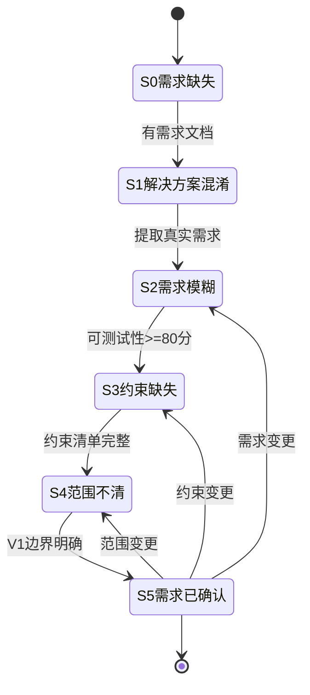
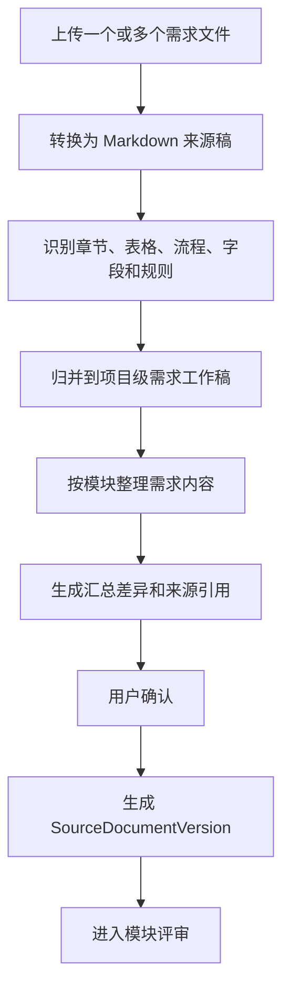
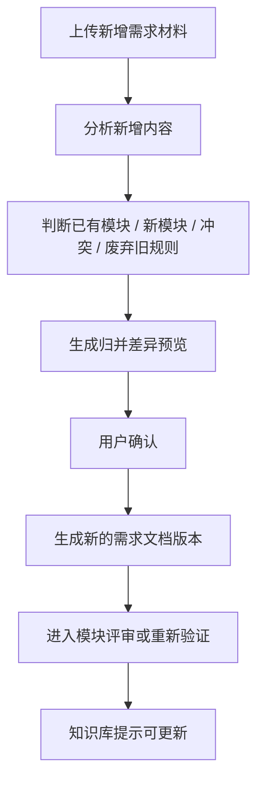
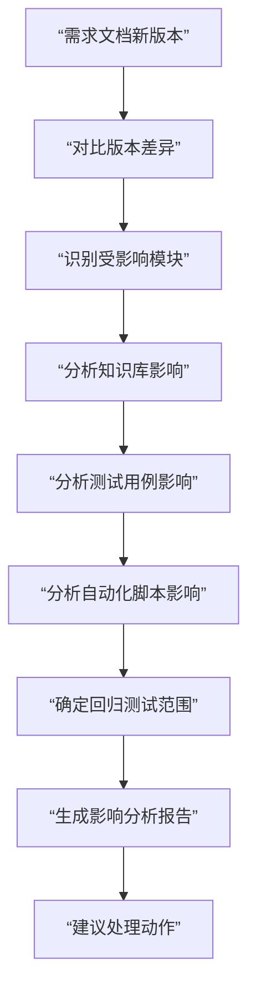
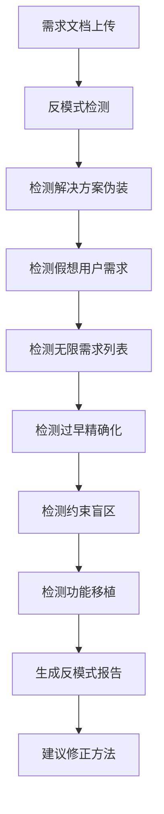
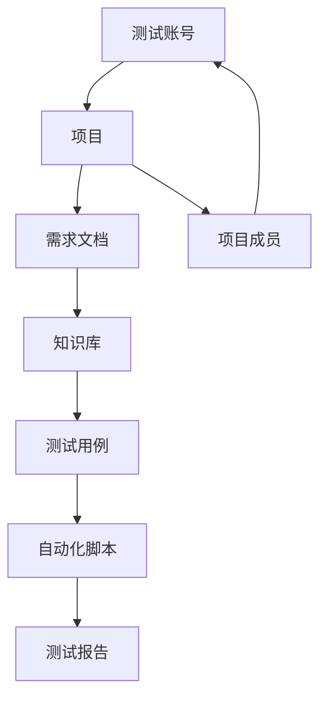
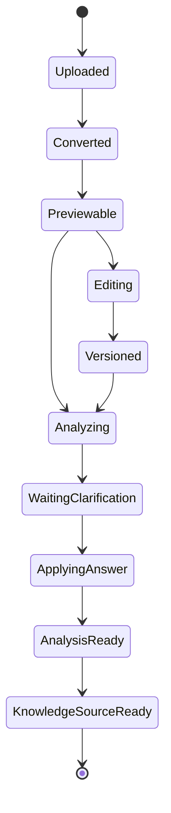

# 00-03 AI测试系统 - 需求文档、分析与版本管理 PRD

## 1. 这份文档解决什么问题

本文细化需求文档从上传到分析、编辑、澄清、版本记录的完整流程。

## 1.1 需求分析核心原则

### 原则1：需求是假设，不是事实

**核心观点：**
需求不是关于"系统应该做什么"的事实陈述，而是关于"什么能解决问题"的假设。需求分析的目标不是记录需求，而是验证需求是否真正解决了实际问题。

**需求验证三问：**
1. **这个需求解决什么问题？**（问题识别）
   - 如果没有这个功能会发生什么？
   - 谁会受到影响？
   
2. **为什么这个需求能解决这个问题？**（因果关系）
   - 这个需求和问题之间的逻辑关系是什么？
   - 有没有其他方式也能解决这个问题？
   
3. **如何验证需求确实解决了问题？**（验证方法）
   - 用什么指标衡量问题是否被解决？
   - 如何测试验证？

### 原则2：区分需求类型

| 类型 | 说明 | 处理方式 | 示例 |
| --- | --- | --- | --- |
| 已验证需求 | 有证据支持的需求 | 直接进入需求文档 | "5个用户反馈登录超时，需要优化性能" |
| 假设需求 | 未验证的需求 | 标记为"待验证"，补充验证计划 | "用户可能需要暗黑模式" |
| 伪需求 | 实际是解决方案的需求 | 追溯真实问题，重新表达 | "需要用Redis缓存"→"需要1秒内返回查询结果" |

### 原则3：问题优先，解决方案其次

**错误示例：**
- ❌ "系统需要使用PostgreSQL数据库"（这是解决方案）
- ❌ "需要用React实现前端"（这是技术选型）
- ❌ "需要集成Redis缓存"（这是实现方式）

**正确示例：**
- ✅ "系统需要持久化存储用户数据，服务器重启后数据不丢失"（这是需求）
- ✅ "页面需要在2秒内完成首屏渲染"（这是需求）
- ✅ "查询结果需要在500ms内返回"（这是需求）

### 原则4：需求必须可测试

不可测试的需求不是真正的需求，而是愿望。

**不可测试的需求：**
- ❌ "系统应该快"
- ❌ "用户体验应该好"
- ❌ "界面应该美观"
- ❌ "系统应该稳定"

**可测试的需求：**
- ✅ "页面加载时间 < 2秒"
- ✅ "核心操作 <= 3步完成"
- ✅ "所有操作有明确的成功/失败提示"
- ✅ "系统7×24小时可用率 >= 99.9%"

---

## 1.2 核心规则

- 上传文档后不直接进入正式知识库。
- 用户可以上传多个需求文件；多个文件先作为来源材料，系统汇总归并成一份项目级 Markdown 需求工作稿。
- 后续新增需求材料和首次上传材料一样，统一走“标准文件合并为最终需求稿”的归并流程；合并质量通过后必须直接形成新的需求文档版本，并显示在“最终需求”Tab。
- “增量合并”和“全部合并”只表示参与归并的来源范围不同，不改变产物位置：最终产物永远是 `SourceDocumentVersion` 对应的 Markdown 工作稿。系统不得把成功合并的内容只保存在预览稿、质量报告、待确认文档或其他临时文档中。
- 预览稿只用于质量失败、智能体失败或冲突排查，不能作为成功合并结果；质量失败的预览稿不得标记为最终需求版本。
- Word、PDF 等原始需求文档保存在文件系统；SQLite 保存文档元数据、版本、Markdown 正文或路径、覆盖矩阵、评审状态和来源引用。

### 上传模式规则

- 上传入口提供两种模式：**新建需求** 和 **追加到已有需求**，默认为新建需求。
- **新建需求模式**：一次上传的一个或多个文件，统一归属到同一个需求实体（`SourceDocument`），不按文件分别创建需求。需求名称**必填**，不可省略。
- **需求名称在同一项目内不可重复**；提交时后端校验唯一性，重复则返回错误，前端在输入框下方实时提示（可在失焦时调接口检查）。
- **追加到已有需求模式**：用户从当前项目的已有需求中选择目标需求（下拉列表只展示需求名称），将新文件追加为该需求的来源材料。
- **多文件上传后的初始状态**：无论新建还是追加，每个上传的文件单独转换为 Markdown，转换完成后状态均为**待归并**；系统不自动生成或修改工作稿，工作稿由用户在来源文件列表中手动发起归并后生成。
- **转换 Markdown 的文件命名**：每个原始文件对应一个转换稿，文件名取原始文件名去掉扩展名后加 `.md`，存储于该需求目录的 `standard/` 子目录下（例如 `产品需求说明v2.md`）。工作稿版本文件（归并后生成）存于 `versions/` 目录，按版本号命名（`v1.md`、`v2.md`）。
- 所有来源文件（原始文件）统一存储在该需求实体对应的文件夹下（`raw/` 子目录），文件夹以需求 ID 命名，不按上传批次分散。
- 上传界面**不暴露文档类型字段**，文档类型由系统根据文件扩展名自动识别，或统一默认为 PRD；如需修改，在需求详情页编辑。
- 需求分析不是摘要生成，必须覆盖原始文档的章节、段落、表格、图片说明、流程和字段。
- 系统必须生成原文覆盖矩阵，证明原始文档每块内容已被纳入模块、标记待澄清、标记无需测试或标记废弃。
- 需求文档不按文件拆分，评审时按模块对同一份需求文档进行分段评审。
- 需求评审负责发现问题和提出澄清；澄清负责回答问题并写回需求文档新版本，二者构成闭环而不是互斥流程。
- 当前确认流程为：先按模块评审发现问题，再进入澄清；澄清答案写回需求文档新版本后，受影响模块必须重新评审或重新验证。
- 新增需求材料由系统自动归并到最终需求稿，生成新的需求版本和版本变化日志；冲突、质量失败或无法证明覆盖完整时，系统生成排查稿和待确认项，但不得写入最终需求版本。
- 最终需求稿不能为空。任何人工编辑、AI 编辑、合并确认或版本写入流程，如果 Markdown 正文为空或仅包含空白，必须拒绝保存。
- 每个模块独立评审，评审完成后模块状态变为“已完成”；所有模块完成且无关键待澄清问题后，整份需求才算评审完成。
- 项目没有需求文档时，可以基于站点探索文档生成“候选需求文档”，候选需求文档必须评审确认后才能作为正式需求来源。
- Markdown 工作稿支持预览、源码查看和在线编辑。
- 需求文档详情提供 AI 对话修改入口，用户可以用自然语言提出修改要求，系统生成 Markdown diff，人工确认后才写入新版本。
- 每次上传、转换、编辑、澄清写回、候选需求生成都生成版本记录。
- 每个需求文档版本变化都必须生成版本变化日志，供知识库判断是否需要增量更新。
- 澄清内容必须写回 Markdown 工作稿的新版本；原始上传文件不被覆盖。
- 需求分析、探索文档和澄清应用记录只是知识库生成/更新的来源证据，不直接进入正式知识库。

---

## 2. 业务边界

### 2.1 本模块负责

- 上传需求文档和相关文件
- 转换为 Markdown 工作稿
- 将多个需求文件归并为一份项目级需求工作稿
- 将新增需求材料归并到已有需求工作稿并生成差异预览
- 预览 Markdown 渲染结果
- 在线编辑 Markdown
- 通过 AI 对话生成 Markdown 修改建议
- 保存文档版本和差异记录
- 保存版本变化日志，供知识库更新判断
- 发起需求/功能分析
- 生成原文覆盖矩阵
- 按模块生成需求评审清单
- 生成澄清问题
- 生成澄清表单并支持用户补充
- 应用澄清答案到需求文档 Markdown 工作稿
- 在没有需求文档时，基于探索文档生成候选需求文档
- 按模块组织需求评审结果和待确认问题

### 2.2 本模块不负责

- 不直接生成正式知识库
- 不直接生成测试用例
- 不直接生成自动化测试代码
- 不直接修改已发布知识库

---

## 3. 文档类型

| 类型 | 说明 | 第一版处理方式 |
| --- | --- | --- |
| Markdown | 直接作为工作稿 | 保留原文，支持在线编辑 |
| Word | PRD、BRD、FSD 等 | 转换为 Markdown 工作稿，保留原文件 |
| PDF | 需求说明、接口说明 | 转换为 Markdown 或文本化 Markdown，保留原文件 |
| 站点探索 Markdown | 探索 Agent 输出 | 可作为候选需求文档生成来源，不直接入知识库 |
| OpenAPI/接口文档 | API 说明 | 第一版仅可上传和预览，不进入需求分析和知识库；后续单独规划分析能力 |

---

## 4. 核心对象

### 4.1 SourceDocument

表示一个需求实体，可包含一个或多个来源文件。

| 字段 | 说明 |
| --- | --- |
| 项目 ID | 归属项目 |
| 文档名称 | 用户填写的需求名称；**同一项目内唯一**，不可重复 |
| 文档类型 | PRD、FSD、BRD、探索文档、接口文档、其他；上传界面不暴露，由系统自动识别或默认 PRD |
| 当前版本 ID | 当前工作稿版本；新建时为空（尚无工作稿），首次归并后设置 |
| 状态 | 草稿、分析中、待澄清、已确认、已归档 |
| 创建人 | 上传人 |
| 创建时间 | 系统生成 |

说明：
- 一个 `SourceDocument` 对应一个需求实体，其 `raw/` 目录下可存放多个原始文件。
- `original_file_path` 字段已废弃并从数据库表中移除，原始文件路径改由 `SourceDocumentFileMapping.original_file_path` 统一管理。
- `SourceDocumentFileMapping` 记录每个原始文件的路径、转换稿路径、归并状态和转换质量。
- 原始文件不可被覆盖；追加文件时，新文件写入同一 `raw/` 目录，并新建对应的 `FileMapping` 记录。

### 4.1.1 SourceDocumentFileMapping

表示一个原始文件与其所属需求实体之间的映射关系，记录该文件从上传到归并的完整生命周期。

| 字段 | 说明 |
| --- | --- |
| 映射 ID | 系统唯一 |
| 需求 ID | 所属 `SourceDocument` |
| 原始文件路径 | 原始文件在 `raw/` 目录下的完整路径 |
| 原始文件名 | 上传时的文件名 |
| 转换稿路径 | 转换后 Markdown 存于 `standard/` 下，文件名为原始文件名去掉扩展名加 `.md` |
| 转换状态 | `pending`（转换中）、`success`（转换成功）、`warning`（有警告）、`failed`（转换失败） |
| 归并状态（mapping_status） | `pending_merge`（待归并）、`merged`（已归并） |
| 归并到的版本 ID（version_id） | **可空**；待归并时为 `NULL`，归并完成后指向生成的 `SourceDocumentVersion` |
| 转换质量评分 | 系统评估的转换质量（0-100），供用户参考 |
| 上传人 | 操作人 |
| 上传时间 | 系统生成 |

`mapping_status` 枚举值说明：

| 值 | 含义 |
| --- | --- |
| `pending_merge` | 文件已上传并完成转换，尚未归并到任何工作稿版本 |
| `merged` | 文件已归并，`version_id` 指向对应的工作稿版本 |

### 4.2 SourceDocumentVersion

表示每次上传、转换、编辑、澄清应用后的文档版本。

| 字段 | 说明 |
| --- | --- |
| 文档 ID | 所属 SourceDocument |
| 版本号 | v1、v2、v3 |
| Markdown 内容 | 当前版本 Markdown |
| 来源动作 | 上传、转换、多文件汇总、增量需求归并、在线编辑、澄清写回、候选需求生成、人工补充 |
| 变更摘要 | 用户或系统生成的简要说明 |
| 差异摘要 | 与上一版本的差异 |
| 输入来源清单 | 本版本归并了哪些上传文件、补充材料或澄清记录 |
| 创建人 | 操作人 |
| 创建时间 | 系统生成 |

### 4.3 DocumentChatEditSession

表示一次围绕需求文档的 AI 对话修改会话。

| 字段 | 说明 |
| --- | --- |
| 会话 ID | 系统唯一 |
| 文档版本 ID | 当前编辑基于哪个 SourceDocumentVersion |
| 会话类型 | 需求文档修改、候选需求修改、探索补充写回 |
| 用户指令 | 用户提出的修改要求 |
| Agent 输出 | 修改建议摘要 |
| Diff 路径 | 生成的 Markdown diff 文件路径 |
| 状态 | 草稿、待确认、已应用、已取消、失败 |
| 创建人 | 操作人 |
| 创建时间 | 系统生成 |

### 4.4 DocumentChatEditPatch

表示 AI 对话生成的一次修改补丁。

| 字段 | 说明 |
| --- | --- |
| 补丁 ID | 系统唯一 |
| 会话 ID | 所属对话会话 |
| 目标标题 | Markdown 中的目标章节 |
| 修改类型 | 新增、修改、删除、移动、重写 |
| 修改原因 | 用户要求或系统解释 |
| 原文片段 | 修改前内容 |
| 建议片段 | 修改后内容 |
| 来源引用 | 需求原文、探索文档、澄清记录或人工输入 |
| 状态 | 待确认、已接受、已拒绝 |

### 4.5 RequirementAnalysis

表示一次需求分析结果。

| 字段 | 说明 |
| --- | --- |
| 分析版本 | 需求分析版本号 |
| 输入文档版本 | 关联 SourceDocumentVersion |
| 分析状态 | 排队中、运行中、待澄清、已完成、失败 |
| 分析摘要 | 模块、功能点、风险摘要 |
| 输出路径 | 分析 Markdown 或结构化 JSON 路径 |

### 4.6 DocumentVersionChangeLog

表示需求文档版本变化日志，供知识库更新判断。

| 字段 | 说明 |
| --- | --- |
| 变化 ID | 系统唯一 |
| 文档 ID | 所属 SourceDocument |
| 旧版本号 | 变化前版本 |
| 新版本号 | 变化后版本 |
| 变化类型 | 上传、转换、多文件汇总、增量需求归并、在线编辑、澄清写回、AI 对话修改、候选需求生成 |
| 变化原因 | 用户操作或系统处理原因 |
| 影响模块 | 一个或多个模块 key |
| 影响范围 | 规则、流程、字段、状态、权限、风险 |
| 是否触发知识库更新 | 是或否 |
| 变更摘要 | 简要说明 |
| 创建时间 | 系统生成 |

### 4.7 DocumentConversionJob

表示 Word/PDF 到 Markdown 工作稿的转换任务。

| 字段 | 说明 |
| --- | --- |
| 转换任务 ID | 系统唯一 |
| 文档 ID | 所属 SourceDocument |
| 输入文件路径 | 原始 Word/PDF 文件路径 |
| 输出 Markdown 路径 | 转换后的 Markdown 工作稿路径 |
| 转换状态 | 排队中、运行中、成功、失败、需人工处理 |
| 质量检查状态 | 通过、有警告、失败 |
| 无法识别项数量 | 表格、图片、扫描页、流程图等问题数量 |
| 转换摘要 | 标题、表格、图片、页数等转换摘要 |

### 4.8 SourceCoverageItem

表示原始文档内容到分析结果的覆盖关系。

| 字段 | 说明 |
| --- | --- |
| 覆盖项 ID | 系统唯一 |
| 文档版本 ID | 关联 SourceDocumentVersion |
| 原文位置 | 章节、段落、表格、图片、流程图、附录等位置 |
| 原文摘要 | 原始内容简要摘要 |
| 原文类型 | 标题、段落、表格、图片说明、流程、字段、规则、附录 |
| 归属模块 | 已归属的需求模块，可为空 |
| 分析结果引用 | 对应模块、功能点、规则、流程或字段 |
| 覆盖状态 | 已覆盖、待归类、待澄清、无需测试、已废弃 |
| 处理说明 | 为什么这样处理 |

### 4.9 RequirementReviewModule

表示模块评审状态。

| 字段 | 说明 |
| --- | --- |
| 模块 ID | 系统唯一 |
| 文档版本 ID | 所属需求文档版本 |
| 模块名称 | 例如登录、项目管理、知识库 |
| 模块范围 | 来源章节、页面或业务范围 |
| 原文覆盖数 | 该模块覆盖的原文项数量 |
| 待澄清数 | 该模块未处理澄清问题数量 |
| 评审状态 | 待评审、评审中、有澄清、已完成、已废弃 |
| 评审人 | 操作人 |
| 完成时间 | 模块完成时间 |

### 4.10 RequirementReviewVerification

表示需求评审验证结果，防止模块或原文内容漏评。

| 字段 | 说明 |
| --- | --- |
| 验证 ID | 系统唯一 |
| 文档版本 ID | 所属需求文档版本 |
| 模块总数 | 系统识别出的模块数量 |
| 已完成模块数 | 状态为已完成或已废弃的模块数量 |
| 未完成模块数 | 仍需评审的模块数量 |
| 原文覆盖总数 | SourceCoverageItem 总数 |
| 未处理覆盖项数 | 待归类、关键待澄清数量 |
| 关键澄清未处理数 | 待回答或待写回的关键澄清数量 |
| 验证状态 | 通过、不通过 |
| 验证说明 | 未通过原因 |

---

## 5. 页面与交互

### 5.0 上传页交互设计

上传页顶部提供上传模式切换，页面结构如下：

```
┌──────────────────────────────────────────────────────┐
│ 区域一：选择归属                                       │
│                                                       │
│  ● 新建需求                                           │
│    需求名称：[__________________________]             │
│    说明：需求是一组需求文件的集合，一次上传的所有文件     │
│         将归属同一个需求，后续还可以追加更多文件          │
│                                                       │
│  ○ 追加到已有需求                                      │
│    选择需求：[▼ 搜索或选择已有需求 · 共 N 个]          │
│    当前已有来源文件：N 个                              │
└──────────────────────────────────────────────────────┘

┌──────────────────────────────────────────────────────┐
│ 区域二：文件选择                                       │
│                                                       │
│  [拖拽区 / 点击选择文件]                               │
│  支持 PDF、Word（doc/docx）、TXT、MD，最多 10 个文件   │
│                                                       │
│  ✓ 产品需求说明v2.docx                       3.2 MB   │
│  ✓ 接口文档补充.md                           18 KB    │
└──────────────────────────────────────────────────────┘
```

**新建需求模式规则：**

- 需求名称**必填**，不可省略，不支持从文件名自动推断。
- 需求名称在同一项目内**不可重复**：前端在输入框失焦时调接口实时校验，重复时在输入框下方显示红色提示"该需求名称已存在"；提交时后端再次校验，重复则返回 `422` 错误。
- 提交后为这批文件创建一个 `SourceDocument`，所有文件均存入该需求的 `raw/` 目录。
- 每个文件各自生成独立的 `SourceDocumentFileMapping` 记录，转换稿存于 `standard/`，文件名为原始文件名（去掉扩展名后加 `.md`）。
- 所有文件转换完成后状态为**待归并**；系统不自动生成工作稿，需用户在来源文件列表中手动发起归并。
- 新建成功后跳转到该需求详情页的"来源文件"Tab，方便用户查看转换状态。

**追加到已有需求模式规则：**

- 下拉列表仅展示当前项目下所有需求的**需求名称**，不显示已有文件数量。
- 选择需求后，在下拉框下方提示"当前已有来源文件：N 个"，帮助用户确认选对目标（此提示仅为辅助信息，非下拉选项内容）。
- 提交后新文件追加到目标需求的 `raw/` 目录，各自生成 `SourceDocumentFileMapping`，初始归并状态为**待归并**。
- 上传成功后提示："文件已添加，当前工作稿未变更，请在来源文件列表中发起归并。"
- 追加操作**不改变当前需求工作稿版本**，也不触发知识库更新标记。

**字段说明：**

| 字段 | 新建需求 | 追加到已有需求 |
| --- | --- | --- |
| 需求名称 | 必填，项目内唯一 | 不显示（目标已有名称） |
| 需求选择 | 不显示 | 必选 |
| 已有文件数提示 | 不显示 | 选择需求后显示，仅供参考 |
| 文档类型 | 不暴露，系统自动识别 | 不暴露，系统自动识别 |
| 上传文件 | 必选，1～10 个 | 必选，1～10 个 |

---

### 5.1 文档列表

字段：

- 文档名称
- 来源文件数量（展示真实数量，点击跳转来源文件 Tab）
- 当前版本
- 状态
- 最近更新时间
- 最近操作人
- 是否影响知识库
- 操作：预览、编辑、分析、查看版本、归档

### 5.2 文档详情

布局建议：

- 顶部：文档名称、类型、状态、当前版本、操作按钮
- 左侧：Markdown 目录
- 中间：Markdown 预览
- 右侧：来源文件、版本、分析结果、澄清问题、AI 对话修改、知识库影响提示

### 5.3 来源文件 Tab 与增量需求入口

需求文档详情页包含"来源文件"Tab，展示该需求下所有原始文件的状态与操作。

**来源文件列表字段：**

| 字段 | 说明 |
| --- | --- |
| 文件名 | 原始上传文件名 |
| 格式 | PDF / Word / MD / TXT |
| 上传时间 | 系统记录 |
| 转换状态 | 转换中 / 转换成功 / 有警告 / 转换失败 |
| 归并状态 | 待归并 / 已归并（显示归并到的版本号） |
| 操作 | 预览原文件、查看转换稿、发起归并（仅待归并显示） |

**操作说明：**

- **预览原文件**：在侧抽屉中展示原始上传文件内容。PDF 使用内嵌预览，MD/TXT 使用文本渲染，Word 展示转换后的 HTML 或提供下载。
- **查看转换稿**：在侧抽屉中展示该文件单独转换后的 Markdown 内容，与原文件左右对比显示，便于用户核查转换质量。
- **发起归并**：仅对"待归并"文件显示。点击后系统分析新材料与当前工作稿的关系（属于已有模块、新模块、冲突修改、废弃旧规则或待澄清内容），质量通过后直接生成新的 `SourceDocumentVersion`，来源动作记录为"需求归并"；如存在冲突或质量阻断，仅生成排查稿、质量检测和待确认项。

**增量需求入口：**

- 来源文件列表顶部提供"+ 追加更多文件"按钮，点击进入上传页（预设为追加到当前需求的模式）。
- 追加的文件上传后进入"待归并"状态，不自动修改当前工作稿，也不触发知识库更新标记。
- 用户手动发起归并后，质量通过即生成新版本并可触发知识库更新；冲突或质量阻断时不生成新版本。

### 5.4 在线编辑

编辑规则：

- 编辑 Markdown 源码。
- 保存时必须填写或自动生成变更摘要。
- 保存后生成新版本，旧版本不可覆盖。
- 保存后标记“存在可用于知识库更新的来源变化”。

### 5.5 AI 对话修改

需求文档详情页提供 AI 对话区域，用户可以用自然语言要求系统修改当前 Markdown 工作稿。

示例指令：

- “把登录失败的错误提示补充到登录模块。”
- “根据刚才澄清的内容，补充项目归档后的限制。”
- “把这个表格整理成字段、校验、提示语三列。”
- “把探索文档中发现的新增按钮作为待确认点加入需求评审。”

处理规则：

- AI 对话修改不能直接覆盖当前文档。
- Agent 必须生成修改建议、目标章节、修改原因和 Markdown diff。
- 用户必须在 diff 预览中逐项接受或拒绝。
- 接受后生成新的 `SourceDocumentVersion`。
- 新版本来源动作记录为“AI 对话修改”。
- 修改必须保留来源引用，说明来自用户指令、原始文档、探索文档、澄清记录或人工补充。
- 如果用户要求删除内容，系统必须提示影响范围，并保留被删除内容的历史版本。
- AI 对话修改完成后，必须标记知识库存在可更新来源。

### 5.6 版本对比

必须支持：

- 查看历史版本列表
- 查看某一版本 Markdown
- 对比任意两个版本
- 查看变更摘要和编辑人
- 查看该版本是否已参与知识库生成

---

## 6. 需求分析

### 6.0 需求分析状态机

需求分析不是一次性活动，而是一个渐进式的状态流转过程。系统必须识别当前需求所处的状态，并引导用户完成该状态的必要工作后才能进入下一状态。

#### 6.0.1 状态定义

| 状态 | 说明 | 典型症状 | 关键问题 | 退出条件 |
| --- | --- | --- | --- | --- |
| S0-需求缺失 | 没有明确的需求来源 | 只有想法，没有需求文档或探索文档 | 这个想法解决什么问题？谁有这个问题？ | 有需求文档或探索文档 |
| S1-解决方案混淆 | 需求中混入实现细节 | 需求包含"需要用Redis"、"需要用React"等技术实现 | 如果这个技术不存在，你需要什么？ | 需求不包含技术实现细节 |
| S2-需求模糊 | 需求不可测试 | 需求包含"系统应该快"、"用户体验好"等模糊描述 | 如何验证这个需求已满足？ | 可测试性评分 >= 80分 |
| S3-约束缺失 | 缺少明确的约束条件 | 没有性能指标、兼容性要求、安全要求 | 什么是确定的约束？什么是假设？ | 约束清单完整 |
| S4-范围不清 | 没有明确的边界 | 所有功能都是P0，没有分期计划 | 如果只能实现3个功能，是哪3个？ | 有明确的V1边界和优先级 |
| S5-需求已确认 | 需求可测试、有约束、有边界 | 通过质量门禁，所有模块评审完成 | - | 可进入知识库生成 |

#### 6.0.2 状态流转规则



**流转规则：**
1. **顺序流转**：必须按 S0→S1→S2→S3→S4→S5 顺序流转
2. **不可跳跃**：不能跳过中间状态（如从S1直接到S3）
3. **可回退**：需求变更时可回退到前面状态
4. **门禁检查**：每个状态有明确的退出条件，不满足不能进入下一状态

#### 6.0.3 状态诊断方法

系统在需求分析时自动诊断当前状态：

**诊断算法：**
```python
def diagnose_requirement_state(requirement_doc):
    # S0: 需求缺失
    if not requirement_doc.has_source():
        return {
            "state": "S0-需求缺失",
            "symptoms": ["没有需求文档", "没有探索文档"],
            "actions": ["上传需求文档", "发起站点探索"],
            "blocking": True
        }
    
    # S1: 解决方案混淆
    if requirement_doc.contains_implementation():
        return {
            "state": "S1-解决方案混淆",
            "symptoms": requirement_doc.get_implementation_keywords(),
            "actions": ["提取真实需求", "去除技术细节"],
            "blocking": True
        }
    
    # S2: 需求模糊
    if requirement_doc.testability_score < 80:
        return {
            "state": "S2-需求模糊",
            "symptoms": requirement_doc.get_vague_requirements(),
            "actions": ["补充澄清问题", "具体化需求"],
            "blocking": True
        }
    
    # S3: 约束缺失
    if not requirement_doc.has_complete_constraints():
        return {
            "state": "S3-约束缺失",
            "symptoms": requirement_doc.get_missing_constraints(),
            "actions": ["补充约束清单", "区分事实和假设"],
            "blocking": True
        }
    
    # S4: 范围不清
    if not requirement_doc.has_scope_boundary():
        return {
            "state": "S4-范围不清",
            "symptoms": ["没有优先级", "没有分期计划"],
            "actions": ["划分优先级", "定义V1边界"],
            "blocking": True
        }
    
    # S5: 需求已确认
    return {
        "state": "S5-需求已确认",
        "symptoms": [],
        "actions": ["进入知识库生成"],
        "blocking": False
    }
```

**诊断触发时机：**
- 需求文档上传后
- 需求文档版本变化后
- 需求评审前
- 知识库生成前

#### 6.0.4 状态干预措施

| 状态 | 干预措施 | 产出 |
| --- | --- | --- |
| S0-需求缺失 | 引导上传需求文档或发起站点探索 | 需求文档或探索文档 |
| S1-解决方案混淆 | 自动识别技术关键词，生成"提取真实需求"任务 | 去除技术细节的需求描述 |
| S2-需求模糊 | 执行可测试性评审，生成澄清问题 | 可测试性评分报告、澄清问题清单 |
| S3-约束缺失 | 生成约束检查清单，引导补充 | 完整的约束清单 |
| S4-范围不清 | 引导MoSCoW优先级划分 | V1边界定义、优先级清单 |
| S5-需求已确认 | 执行质量门禁检查 | 质量门禁报告 |

#### 6.0.5 状态展示

需求文档详情页必须显示当前状态：

```markdown
## 需求状态：S2-需求模糊 ⚠️

### 当前问题
- 可测试性评分：72分（低于80分阈值）
- 模糊需求：5处
- 缺少断言点：3处

### 建议动作
1. 处理澄清问题 Q-015, Q-016, Q-018
2. 补充具体的验收标准
3. 重新执行可测试性评审

### 阻塞说明
当前状态阻塞知识库生成，必须达到S5状态才能继续。
```

---

### 6.1 需求文档来源路径

| 场景 | 处理方式 | 结果状态 |
| --- | --- | --- |
| 有单个需求文档 | 上传或转换为 Markdown 工作稿后进入需求分析和模块评审 | 待评审或已确认 |
| 有多个需求文档 | 多个文件先转换为来源稿，再汇总归并为一份项目级 Markdown 需求工作稿 | 待评审或已确认 |
| 已有需求文档后新增需求材料 | 先进入来源材料区，系统生成增量归并差异预览，用户确认后形成新版本 | 待评审或待澄清 |
| 没有需求文档，有探索文档 | 基于探索文档生成候选需求文档，再进入需求分析和模块评审 | 候选待确认 |
| 没有需求文档，也没有探索文档 | 不能生成正式需求分析，只能提示先上传文档或发起站点探索 | 缺少来源 |

### 6.2 多文件汇总规则

用户可以在同一项目下上传多个需求文件。系统不把每个文件当成一份独立正式需求，而是将它们作为来源材料，汇总为一份项目级 Markdown 需求工作稿。

汇总流程：



汇总规则：

- 多个上传文件必须保留原始文件和转换稿，不能被合并过程覆盖。
- 项目级需求工作稿按模块组织，不按上传文件拆分。
- 系统必须记录每个模块、规则、字段和流程来自哪些源文件、章节、段落、表格或图片说明。
- 多文件之间存在重复内容时，系统生成重复项提示，由用户确认保留口径。
- 多文件之间存在冲突时，系统生成冲突项或澄清问题，不能自动选择其中一个作为正式结论。
- 多文件中存在无法归属模块的内容时，进入原文覆盖矩阵的“待归类”状态。
- 汇总后的需求工作稿必须进入同一套模块评审流程。

候选需求文档生成规则：

- 候选需求文档是一份完整 Markdown 工作稿，不拆成多个需求文件。
- 候选需求文档按模块组织内容，模块来自探索文档中的菜单、页面、业务操作和状态流转。
- 候选需求文档必须明确标记“由探索结果反推”，不能声称是业务方原始需求。
- 每条候选需求必须带探索来源引用，例如探索任务、页面、操作、截图或字段。
- 系统必须区分“明确观察”“流程推断”“待确认”三类内容。
- 候选需求文档进入同一套需求评审流程，评审确认后才能作为正式需求文档版本。
- 未评审确认的候选需求文档不能用于生成正式知识库，只能用于草稿分析和待确认问题整理。

### 6.3 输入

- 当前文档版本
- 可选：已有探索文档
- 可选：已有澄清答案
- 可选：人工补充说明
- 可选：新增需求材料
- 可选：多个来源文件转换稿

### 6.4 文档转换

Word、PDF、扫描 PDF 不能直接进入需求分析，必须先转换为 Markdown 工作稿。

转换规则：

- 原始 Word/PDF 文件保存在文件系统，不覆盖、不改写。
- 转换后的 Markdown 工作稿生成 `SourceDocumentVersion`。
- SQLite 保存文档元数据、版本、Markdown 正文或文件路径、转换状态和质量检查结果。
- 大文件、图片、附件、扫描页截图保存在文件系统，SQLite 只保存路径和索引。
- 转换 Agent 不生成业务结论，只负责高保真转换和质量检查。

转换质量检查：

| 检查项 | 说明 |
| --- | --- |
| 标题层级 | Word/PDF 标题是否正确转为 Markdown 标题 |
| 段落完整性 | 是否存在丢段、乱码、空段 |
| 表格完整性 | 表格行列、合并单元格、表头是否保留 |
| 图片和流程图 | 是否提取图片说明或保存附件路径 |
| 编号和列表 | 编号、项目符号、层级是否保留 |
| 页眉页脚 | 是否清理无业务意义的页眉页脚 |
| 无法识别项 | 扫描页、复杂图表、损坏表格是否生成待处理项 |

转换结果状态：

| 状态 | 说明 |
| --- | --- |
| 转换成功 | 可直接预览和进入需求分析 |
| 有警告 | 可进入预览，但需用户检查无法识别项 |
| 需人工处理 | 存在关键无法识别内容，不能进入正式需求分析 |
| 转换失败 | 无 Markdown 工作稿，需要重新上传或人工处理 |

### 6.5 输出

- 模块列表
- 功能点列表
- 业务对象和字段
- 主流程、分支流程、异常流程
- 状态流转
- 依赖关系
- 权限差异
- 数据前置
- 测试关注点
- 澄清问题
- 原文覆盖矩阵

### 6.6 原文覆盖矩阵

需求分析必须先证明“没有漏读原始文档”。系统需要把原始文档中的章节、段落、表格、图片说明、流程图、字段规则、附录逐项映射到分析结果。

覆盖状态：

| 状态 | 说明 |
| --- | --- |
| 已覆盖 | 原文内容已进入模块、功能点、规则、流程、字段或测试关注点 |
| 待归类 | 原文存在，但暂时无法判断归属模块 |
| 待澄清 | 原文含义不清或影响测试结论 |
| 无需测试 | 用户确认该内容不进入测试范围 |
| 已废弃 | 用户确认该内容不适用 |

覆盖矩阵字段：

| 字段 | 说明 |
| --- | --- |
| 原文位置 | 章节号、段落号、表格、图片、附录 |
| 来源文件 | 该覆盖项来自哪个上传文件或补充材料 |
| 原文摘要 | 原始内容简述 |
| 原文类型 | 标题、段落、表格、图片说明、流程、字段、规则 |
| 归属模块 | 对应评审模块 |
| 分析结果 | 对应功能点、规则、流程、字段或测试关注点 |
| 覆盖状态 | 已覆盖、待归类、待澄清、无需测试、已废弃 |
| 处理说明 | 系统或用户的处理原因 |

覆盖规则：

- 不允许只输出摘要后跳过原文覆盖矩阵。
- 原文表格必须按行或按规则项进入覆盖矩阵。
- 原文图片、流程图无法结构化时，必须形成图片说明项，并标记是否需要人工补充。
- 覆盖状态为“待归类”或“待澄清”的内容，不能被静默忽略。
- 覆盖状态为“无需测试”或“已废弃”的内容必须有用户确认记录。

### 6.7 按模块评审

需求文档不拆分为多个独立文件。系统在评审时按模块切分视图，帮助用户逐模块确认同一份需求文档中的内容。

需求评审和澄清不是两个互斥入口。模块评审负责发现疑问、冲突和缺口；澄清流程负责回答这些问题并写回需求文档新版本。写回后，对应模块必须重新进入评审或至少重新验证。

模块评审内容：

- 模块范围是否准确。
- 原文覆盖项是否完整，没有漏掉归属本模块的章节、段落、表格和规则。
- 功能点是否完整。
- 主流程、分支流程、异常流程是否清楚。
- 字段、状态、权限、依赖是否有缺口。
- 探索文档补充的页面事实是否需要写回需求文档。
- 候选需求文档中的推断内容是否可以转为正式需求。
- 新增需求材料是否已正确归并到已有模块或新模块。

评审状态：

| 状态 | 说明 |
| --- | --- |
| 待评审 | 模块尚未确认 |
| 评审中 | 用户正在处理澄清或差异 |
| 有澄清 | 模块存在待回答或待写回澄清问题 |
| 已完成 | 模块内容已确认，可作为知识库来源 |
| 已废弃 | 模块不再适用 |

模块完成条件：

- 模块内所有原文覆盖项状态为已覆盖、无需测试或已废弃。
- 模块内不存在关键待归类内容。
- 模块内不存在未回答的关键澄清问题。
- 模块内已回答的澄清问题已经写回需求文档或明确标记无需写回。
- 模块的功能点、流程、字段、状态、权限、依赖和测试关注点已完成确认。

整份需求完成条件：

- 所有模块状态均为已完成或已废弃。
- 文档级原文覆盖矩阵中不存在待归类、关键待澄清项。
- 所有必须写回的澄清内容已生成新的需求文档版本。
- 用户确认当前需求版本可进入知识库生成。

### 6.8 需求评审验证

需求评审必须有验证步骤，防止漏掉模块或原文内容。

验证规则：

- 系统必须统计模块总数、已完成模块数、未完成模块数。
- 每个模块必须有评审状态，不能存在无状态模块。
- 每个原文覆盖项必须有处理状态，不能存在未处理状态。
- 待归类、关键待澄清、关键冲突未处理时，验证不通过。
- 验证不通过时，系统必须列出未完成模块、未处理原文位置和待处理澄清问题。
- 只有验证通过后，需求文档版本才能标记为已确认。

验证输出：

| 输出 | 说明 |
| --- | --- |
| 模块完成清单 | 每个模块的状态、评审人、完成时间 |
| 未完成模块清单 | 未完成原因和跳转入口 |
| 原文覆盖验证 | 已覆盖、待归类、待澄清、无需测试、已废弃统计 |
| 关键澄清清单 | 待回答、待写回问题 |
| 是否可确认 | 通过或不通过 |

### 6.9 澄清问题与表单

澄清问题不应只是一段聊天记录。系统需要生成结构化澄清表单，方便测试工程师补充，也方便后续写回需求文档。

| 字段 | 说明 |
| --- | --- |
| 所属模块 | 关联评审模块 |
| 问题标题 | 简短问题 |
| 问题说明 | 为什么要问 |
| 原文引用 | 来源章节、段落、表格、图片或流程 |
| 影响范围 | 规则、流程、字段、权限、状态、测试用例、自动化 |
| 当前假设 | 系统当前理解，可为“无” |
| 问题类型 | 缺规则、冲突、边界不清、异常不清、权限不清、数据不清、提示语不清 |
| 测试影响 | 不确认会漏掉或误判哪些测试 |
| 建议回答格式 | 文本、单选、多选、表格、字段补充、状态流转补充 |
| 用户回答 | 用户填写 |
| 写回位置 | 写回需求文档的模块和标题 |
| 写回建议 | 系统生成的 Markdown 变更建议 |
| 状态 | 待回答、已回答、已应用、无需确认、已废弃 |

澄清来源：

- 需求分析自动发现的不清楚点。
- 模块评审中用户提出的问题。
- 多文件汇总时发现的冲突或重复口径。
- 新增需求归并时发现的变更影响或不兼容规则。
- 探索补充与需求描述不一致时产生的差异项。

澄清表单类型：

| 类型 | 适用场景 |
| --- | --- |
| 文本补充 | 规则说明、业务背景、异常说明 |
| 单选确认 | 多个理解中选择一个 |
| 多选确认 | 多个适用条件同时存在 |
| 表格补充 | 字段规则、权限矩阵、错误码、状态列表 |
| 状态流转补充 | 状态、动作、前置条件、目标状态 |
| 用例影响确认 | 确认是否纳入测试范围或风险路径 |

### 6.10 需求分析关键问题清单

需求分析过程中，系统必须引导用户回答以下关键问题。这些问题按需求分析的四个阶段组织。

#### 6.10.1 问题发现阶段

在需求文档上传或候选需求生成后，必须回答：

| 关键问题 | 目的 | 不回答的后果 |
| --- | --- | --- |
| 这个需求解决什么问题？ | 识别真实问题 | 可能构建无人需要的功能 |
| 谁有这个问题？（具体的用户角色） | 明确目标用户 | 假想用户需求 |
| 如果没有这个功能会发生什么？ | 评估需求优先级 | 无法区分核心和锦上添花 |
| 用户现在如何解决这个问题？ | 了解现状和痛点 | 不理解用户真实场景 |
| 为什么现有方案不够好？ | 识别改进点 | 重复造轮子 |
| 是什么触发了这个需求？ | 追溯需求来源 | 需求缺少证据支持 |

**问题发现检查清单：**
- [ ] 能用一句话说清楚这个需求解决什么问题
- [ ] 能说出至少3个具体的用户（即使其中一个是自己）
- [ ] 能说出如果没有这个功能的具体影响
- [ ] 能说出用户现在的替代方案
- [ ] 能说出为什么要做这个需求（触发事件）

#### 6.10.2 需求澄清阶段

在需求评审时，必须回答：

| 关键问题 | 目的 | 不回答的后果 |
| --- | --- | --- |
| 这个需求必须实现什么？ | 明确核心功能 | 范围不清 |
| 如何验证需求已满足？ | 确保可测试 | 需求无法验证 |
| 最小可用版本是什么？ | 定义V1边界 | 范围蔓延 |
| 什么样的实现会让你失望？ | 识别质量底线 | 验收标准不明确 |
| 这个需求能用其他方式满足吗？ | 区分需求和解决方案 | 解决方案伪装成需求 |

**需求澄清检查清单：**
- [ ] 每个需求都有明确的验收标准
- [ ] 每个需求都能写出测试用例
- [ ] 能说出最小可用版本包含什么
- [ ] 能说出什么样的实现不可接受
- [ ] 需求描述中不包含技术实现细节

#### 6.10.3 约束发现阶段

在需求确认前，必须回答：

| 关键问题 | 目的 | 不回答的后果 |
| --- | --- | --- |
| 实际的时间预算是多少？ | 明确时间约束 | 实现中途发现时间不够 |
| 需要哪些技能？ | 明确技能约束 | 实现中途发现技能不足 |
| 必须集成哪些系统？ | 明确集成约束 | 实现中途发现集成困难 |
| 有哪些假设尚未验证？ | 识别风险 | 假设错误导致返工 |
| 什么会导致项目失败？ | 风险预判 | 未预见的失败原因 |
| 性能要求是什么？ | 明确性能约束 | 实现后发现性能不满足 |
| 兼容性要求是什么？ | 明确兼容性约束 | 实现后发现兼容性问题 |
| 安全要求是什么？ | 明确安全约束 | 实现后发现安全漏洞 |

**约束发现检查清单：**
- [ ] 有明确的时间预算和里程碑
- [ ] 有明确的技能清单和技能缺口
- [ ] 有明确的集成系统清单
- [ ] 区分了事实约束和假设约束
- [ ] 有明确的性能、兼容性、安全要求
- [ ] 识别了可能导致失败的风险

#### 6.10.4 范围定义阶段

在进入知识库生成前，必须回答：

| 关键问题 | 目的 | 不回答的后果 |
| --- | --- | --- |
| V1包含什么？后续版本包含什么？ | 定义分期计划 | 范围不清 |
| 如果必须削减，会削减什么？ | 识别真实优先级 | 所有功能都重要 |
| 什么触发重新考虑延期项？ | 定义重新评估条件 | 延期项永远不做 |
| 什么明确不在范围内？ | 定义边界 | 范围蔓延 |
| 如果只能实现3个功能，是哪3个？ | 强制排序 | 优先级不明确 |

**范围定义检查清单：**
- [ ] 有明确的V1功能清单
- [ ] 有明确的延期功能清单
- [ ] 有明确的不做功能清单
- [ ] 能说出如果只能做3个功能是哪3个
- [ ] 有明确的优先级（P0/P1/P2）

---

### 6.11 澄清维度检查表

系统在生成澄清问题时，必须覆盖以下测试关键维度：

| 澄清维度 | 检查点 | 示例问题 |
| --- | --- | --- |
| 边界值 | 字段长度上下限、空值、特殊字符、重复值、负数、零值、最大值+1 | 用户名长度范围？是否允许空格？是否允许中文？ |
| 异常路径 | 网络失败、权限不足、依赖缺失、并发冲突、超时、服务降级 | 网络中断时如何提示？保存失败后数据是否回滚？ |
| 状态流转 | 每个状态的来源、触发条件、目标状态、是否可回退、中间状态 | 项目归档后能否恢复？归档中能否取消？ |
| 权限差异 | 不同角色的可见性、可操作性、数据隔离、越权提示 | 访客能看到项目成员列表吗？测试工程师能删除项目吗？ |
| 数据依赖 | 前置数据、测试数据构造、清理规则、数据关联、级联删除 | 删除项目时关联的用例如何处理？测试数据如何清理？ |
| 提示语 | 成功提示、失败提示、警告提示、确认提示、帮助文案 | 删除项目的二次确认文案是什么？ |
| 校验规则 | 前端校验、后端校验、实时校验、提交校验、校验时机 | 用户名重复是实时提示还是提交时提示？ |
| 并发场景 | 多人同时编辑、重复提交、乐观锁、悲观锁、冲突处理 | 两人同时编辑需求文档如何处理？ |
| 时间相关 | 时区、日期格式、时间范围、过期处理、定时任务 | 任务超时时间是多久？时间显示用户本地时区还是服务器时区？ |
| 数据一致性 | 事务边界、回滚策略、最终一致性、数据同步 | 生成用例失败后知识库状态如何处理？ |

### 6.12 评审策略

系统在需求评审时必须按以下策略检查模块质量：

| 策略 | 检查内容 |
| --- | --- |
| 完整性评审 | 原始文档每一段、表格、流程图是否都有归属或处理结论 |
| 可测试性评审 | 每个规则是否能生成明确步骤和预期结果 |
| 边界值评审 | 字段长度、必填、格式、上下限、重复值、空值是否清楚 |
| 异常路径评审 | 校验失败、无权限、依赖缺失、网络失败、数据不存在是否清楚 |
| 状态流转评审 | 每个状态来源、触发动作、目标状态、是否可回退是否清楚 |
| 权限评审 | 不同角色能看什么、能操作什么、禁止后如何提示 |
| 数据依赖评审 | 前置数据、测试数据构造、清理规则是否明确 |
| 冲突评审 | 同一规则在不同段落是否矛盾 |
| 探索补充评审 | 已有探索文档时，用页面字段、按钮、提示语、真实流转补充测试视角 |
| 风险评审 | 核心业务路径、高风险路径、不可自动化路径是否标记 |

### 6.13 可测试性评审增强

在需求评审时，必须对每个需求进行可测试性检查，不合格的需求不能进入知识库生成。

| 检查项 | 通过标准 | 不通过示例 | 处理方式 |
| --- | --- | --- | --- |
| 输入输出明确性 | 每个规则有明确的输入条件和预期输出 | "系统应合理处理异常情况" | 生成澄清问题：具体哪些异常？如何处理？预期结果是什么？ |
| 模糊描述检查 | 不存在"合理"、"适当"、"尽量"、"酌情"等模糊词 | "密码强度应适当" | 澄清：密码最小长度？必须包含哪些字符类型？ |
| 断言点验证 | 每个功能有可验证的断言点（UI元素、数据库、接口返回） | "用户体验良好" | 澄清：如何量化？页面加载时间？操作步骤数？ |
| 提示语明确性 | 所有成功、失败、警告提示语都有明确文案 | "提示用户操作失败" | 澄清：具体提示文案是什么？ |
| 前置条件完整性 | 测试前置条件可构造、可验证 | "在有数据的情况下测试查询" | 澄清：需要哪些数据？数据量级？数据关系？ |
| 异常场景覆盖 | 至少覆盖校验失败、权限不足、依赖缺失、网络异常 | 只描述正常流程 | 补充：各类异常场景的预期行为 |
| 状态机完整性 | 状态流转图闭环，无孤立状态 | 存在"处理中"状态但无法进入或退出 | 补充：该状态的触发条件和目标状态 |

可测试性评审输出：

- 可测试性评分（0-100分）
- 不合格项清单
- 建议澄清问题
- 是否允许进入知识库生成

评审输出：

- 模块评审结论。
- 澄清问题清单。
- 原文覆盖矩阵更新。
- 测试关注点。
- 风险点。
- 可测试性评分。
- 是否可进入知识库的判断。

### 6.14 澄清写回

应用规则：

- 回答不会覆盖原始上传文件。
- 用户可先预览澄清内容写回后的 Markdown diff。
- 应用澄清后，系统必须把确认内容写回需求文档 Markdown 工作稿，并生成新的 `SourceDocumentVersion`。
- 新版本来源动作记录为”澄清写回”，并记录关联澄清问题、目标模块、目标标题、写入方式和变更摘要。
- 澄清答案记录保留为审计证据，最终业务口径以写回后的需求文档版本为准。
- 应用后生成新的分析版本，分析输入指向写回后的需求文档版本。
- 应用后可标记知识库存在可更新来源。
- 应用后仍需在知识库界面手动点击生成或更新知识库。

### 6.15 需求质量门禁

需求文档只有通过质量门禁后，才能标记为”已确认”并进入知识库生成。

#### 6.15.1 门禁检查项

| 门禁项 | 检查标准 | 阻塞级别 |
| --- | --- | --- |
| 原文覆盖率 | 所有章节、段落、表格、流程图、字段规则都有覆盖状态 | 阻塞 |
| 字段规则完整性 | 所有字段有明确的类型、长度、必填、格式、默认值、校验规则 | 阻塞 |
| 状态流转完整性 | 所有状态有明确的触发条件、目标状态、是否可回退 | 阻塞 |
| 异常场景覆盖 | 每个功能至少覆盖校验失败、权限不足、依赖缺失、网络异常 | 阻塞 |
| 提示语明确性 | 所有成功、失败、警告、确认提示有明确文案 | 警告 |
| 权限差异明确性 | 不同角色的可见性、可操作性、数据隔离有明确说明 | 阻塞 |
| 边界值明确性 | 字段上下限、空值、特殊字符、重复值处理规则明确 | 警告 |
| 可测试性评分 | 可测试性评分 >= 80分 | 阻塞 |
| 关键澄清处理 | 所有关键澄清问题已回答并写回 | 阻塞 |
| 模块评审完成 | 所有模块状态为”已完成”或”已废弃” | 阻塞 |

#### 6.15.2 门禁结果

| 结果 | 说明 | 后续动作 |
| --- | --- | --- |
| 通过 | 所有阻塞项通过，警告项可接受 | 允许标记”已确认”，可进入知识库生成 |
| 有警告 | 阻塞项通过，存在警告项 | 允许标记”已确认”，但需记录风险点 |
| 阻塞 | 存在未通过的阻塞项 | 不允许标记”已确认”，必须处理阻塞项 |

#### 6.15.3 门禁报告

门禁检查必须生成结构化报告：

```markdown
# 需求质量门禁报告

## 检查摘要
- 文档版本：v3
- 检查时间：2026-05-21 10:30
- 检查结果：阻塞
- 阻塞项数量：3
- 警告项数量：5

## 阻塞项清单
1. [字段规则] 用户名字段缺少长度上限和格式校验规则
   - 位置：需求文档 v3 第2.3节
   - 影响：无法生成明确的测试用例和校验断言
   - 建议：补充澄清问题 Q-015

2. [状态流转] “审批中”状态缺少触发条件和目标状态
   - 位置：需求文档 v3 第3.1节
   - 影响：状态流转测试无法设计
   - 建议：补充状态流转图

3. [可测试性] 可测试性评分 72分，低于80分阈值
   - 主要问题：5处模糊描述、3处缺少断言点
   - 建议：处理澄清问题 Q-016, Q-018, Q-020

## 警告项清单
1. [提示语] 删除项目的二次确认文案未明确
2. [边界值] 项目名称是否允许特殊字符未说明
...

## 建议动作
1. 处理3个阻塞项对应的澄清问题
2. 补充状态流转图
3. 重新执行门禁检查
```

#### 6.15.4 门禁与评审的关系

- 模块评审负责发现问题和生成澄清问题
- 门禁检查负责验证问题是否已解决
- 只有门禁通过后，需求文档才能进入知识库生成

### 6.16 新增需求归并

后续添加新需求时，不直接覆盖当前需求文档，也不直接进入知识库。新增材料必须先作为来源材料进入项目，再通过增量归并生成新的需求文档版本。

新增需求归并流程：



归并差异预览必须包含：

- 新增了哪些需求点。
- 修改了哪些已有规则、流程、字段、权限或状态。
- 是否建议创建新模块。
- 是否与已有需求冲突。
- 是否废弃或替换旧规则。
- 影响哪些模块。
- 是否影响已有测试用例和 UI 自动化。
- 需要澄清的问题。

归并规则：

- 属于已有模块的新增内容，写入对应模块并保留来源引用。
- 不属于已有模块的新增内容，生成新模块建议，用户确认后创建模块。
- 与已有规则冲突的内容，进入冲突项或澄清问题，不能直接覆盖旧规则。
- 归并确认后生成新的 `SourceDocumentVersion`，来源动作记录为”增量需求归并”。
- 新版本生成后，对受影响模块进入待评审或重新验证状态。
- 模块评审完成后，知识库界面提示存在可更新来源，由用户点击”更新知识库”。

### 6.17 需求变更影响分析

需求文档产生新版本后，必须进行变更影响分析，评估对下游测试资产的影响。

#### 6.17.1 影响分析维度

| 分析维度 | 检查内容 | 输出 |
| --- | --- | --- |
| 测试用例影响 | 哪些已采纳用例需要修改、废弃或补充 | 受影响用例清单、修改建议 |
| 自动化脚本影响 | 哪些 UI 自动化脚本需要重新生成 | 受影响脚本清单、重新生成计划 |
| 知识库影响 | 哪些知识库模块需要更新 | 受影响模块清单、更新计划 |
| 回归测试范围 | 需要回归测试的模块和用例范围 | 回归测试清单、优先级 |
| 新增测试场景 | 变更引入的新测试场景 | 新场景清单、用例生成建议 |
| 废弃测试场景 | 不再适用的测试场景 | 废弃场景清单、用例废弃建议 |

#### 6.17.2 影响分析流程



#### 6.17.3 影响分析报告

变更影响分析必须生成结构化报告：

```markdown
# 需求变更影响分析报告

## 变更摘要
- 需求文档：v2 → v3
- 变更时间：2026-05-21 14:30
- 变更类型：增量需求归并
- 影响模块：项目管理、权限管理

## 受影响测试用例
### 需要修改的用例（5条）
1. TC-PROJECT-001 创建项目
   - 影响原因：新增”项目类型”必填字段
   - 修改建议：补充项目类型选择步骤和断言
   - 优先级：P0

2. TC-PROJECT-003 编辑项目
   - 影响原因：项目名称长度上限从50改为100
   - 修改建议：更新边界值测试用例
   - 优先级：P1

### 需要废弃的用例（2条）
1. TC-PROJECT-015 项目暂停
   - 废弃原因：需求删除了”暂停”状态
   - 建议动作：标记废弃，保留历史记录

### 需要新增的用例（3条）
1. 项目类型切换
   - 新增原因：支持项目类型修改
   - 场景：正常切换、切换后数据迁移、切换失败回滚

## 受影响自动化脚本
### 需要重新生成（3个）
1. test_create_project.py
   - 影响原因：新增必填字段
   - 建议：重新生成并执行

2. test_edit_project.py
   - 影响原因：字段规则变更
   - 建议：重新生成并执行

## 知识库影响
- 受影响模块：项目管理
- 更新类型：规则修改、字段新增
- 建议动作：更新知识库

## 回归测试范围
### 高优先级回归（P0）
- 项目创建流程
- 项目编辑流程
- 项目权限验证

### 中优先级回归（P1）
- 项目列表查询
- 项目成员管理

## 建议处理动作
1. 更新知识库（预计30分钟）
2. 修改5条测试用例（预计2小时）
3. 废弃2条测试用例（预计30分钟）
4. 生成3条新测试用例（预计1小时）
5. 重新生成3个自动化脚本（预计1小时）
6. 执行回归测试（预计4小时）

## 风险评估
- 变更风险：中
- 回归风险：中
- 建议：完成回归测试后再发布
```

#### 6.17.4 影响分析触发时机

- 需求文档产生新版本
- 澄清写回生成新版本
- 增量需求归并生成新版本
- AI 对话修改生成新版本
- 候选需求确认生成新版本

---

## 6.18 需求分析反模式

需求分析过程中常见的错误模式及其识别和修正方法。

### 6.18.1 反模式清单

| 反模式 | 症状 | 危害 | 修正方法 |
| --- | --- | --- | --- |
| 解决方案伪装成需求 | 需求描述包含技术实现细节 | 限制实现方式，可能不是最优方案 | 提取真实需求，去除技术细节 |
| 假想用户需求 | 没有证据支持的需求 | 构建无人使用的功能 | 要求证据或用户反馈 |
| 无限需求列表 | 所有需求同等重要 | 无法聚焦，项目失控 | 强制排序，MoSCoW方法 |
| 过早精确化 | 在验证核心前设计细节 | 浪费时间在可能不需要的功能上 | 先验证核心，再设计细节 |
| 约束盲区 | 没有明确约束 | 实现中途发现无法满足 | 需求前明确约束清单 |
| 功能移植 | 复制其他产品功能 | 功能不适合自己的场景 | 说明功能在自己场景中的价值 |

### 6.18.2 反模式1：解决方案伪装成需求

**症状识别：**
- 需求描述包含技术实现："需要用PostgreSQL存储"、"需要用Redis缓存"
- 无法在不提及技术的情况下解释需求
- 回答"是什么"时用"如何实现"
- 需求中出现技术关键词：框架名、数据库名、协议名、算法名

**典型示例：**

❌ **错误示例：**
```markdown
需求：系统需要使用Redis缓存用户会话数据
需求：前端需要用React实现项目列表页面
需求：需要用WebSocket实现实时通知
```

✅ **正确示例：**
```markdown
需求：用户会话数据需要在1秒内返回，支持50并发用户
需求：项目列表页面需要支持分页、搜索、排序功能
需求：用户需要在5秒内收到系统通知
```

**修正方法：**

1. **提取真实需求**：对每个需求问"这个需求能用其他方式满足吗？"
   - 如果答案是"是"，说明你描述的是实现，不是需求
   - 重新表达为结果导向的需求

2. **去除技术细节**：将技术实现移到"技术方案"或"实现建议"章节
   - 需求章节：描述"要什么"（结果、指标、约束）
   - 方案章节：描述"怎么做"（技术选型、架构设计）

3. **验证方法**：尝试用非技术语言向业务人员解释需求
   - 如果业务人员听不懂，说明需求中混入了技术细节
   - 重新表达为业务语言

**系统检测规则：**
```python
def detect_solution_disguised_as_requirement(requirement_text):
    tech_keywords = [
        "Redis", "PostgreSQL", "MySQL", "MongoDB",
        "React", "Vue", "Angular",
        "WebSocket", "gRPC", "REST",
        "Docker", "Kubernetes",
        "算法", "框架", "协议"
    ]
    
    found_keywords = [kw for kw in tech_keywords if kw in requirement_text]
    
    if found_keywords:
        return {
            "anti_pattern": "解决方案伪装成需求",
            "keywords": found_keywords,
            "suggestion": "请描述需要达到的结果，而不是实现方式"
        }
```

### 6.18.3 反模式2：假想用户需求

**症状识别：**
- 测试工程师假想用户需求："用户会想要..."、"用户应该需要..."
- 没有证据支持的需求（没有用户反馈、没有数据支持）
- 复制其他产品的功能而不理解原因
- 需求来源是"我觉得"、"应该"、"可能"

**典型示例：**

❌ **错误示例：**
```markdown
需求：用户会想要暗黑模式（没有证据）
需求：用户应该需要导出PDF功能（没有用户反馈）
需求：用户可能需要批量删除功能（没有场景说明）
```

✅ **正确示例：**
```markdown
需求：5个用户反馈长时间使用时眼睛疲劳，需要暗黑模式
需求：3个客户要求导出测试报告为PDF格式用于存档
需求：测试工程师在清理测试数据时需要批量删除100+条测试用例
```

**修正方法：**

1. **要求证据**：每个需求必须有证据支持
   - 用户反馈（至少3个用户）
   - 数据支持（使用频率、痛点数据）
   - 业务场景（具体的使用场景）
   - 法规要求（合规性需求）

2. **区分角色**：明确需求是谁的需求
   - 如果你是用户，诚实表达你的需求："我需要..."
   - 如果为他人构建，与他们交谈或使用类似证据
   - 不要发明用户

3. **验证方法**：与真实用户确认需求
   - 找到至少3个目标用户
   - 询问他们是否有这个需求
   - 询问他们现在如何解决这个问题

**系统检测规则：**
```python
def detect_imaginary_user_requirement(requirement_doc):
    weak_sources = [
        "用户会想要", "用户应该需要", "用户可能需要",
        "我觉得", "应该", "可能",
        "参考XX产品", "借鉴XX功能"
    ]
    
    requirements_without_evidence = []
    
    for req in requirement_doc.requirements:
        if not req.has_source() or any(ws in req.text for ws in weak_sources):
            requirements_without_evidence.append(req)
    
    if requirements_without_evidence:
        return {
            "anti_pattern": "假想用户需求",
            "count": len(requirements_without_evidence),
            "suggestion": "请补充需求来源：用户反馈、数据支持或业务场景"
        }
```

### 6.18.4 反模式3：无限需求列表

**症状识别：**
- 需求不断增长，没有优先级
- 所有功能都标记为P0或"必须实现"
- 无法区分核心功能和锦上添花
- 需求列表超过50条且没有分期计划

**典型示例：**

❌ **错误示例：**
```markdown
需求列表（所有P0）：
1. 用户登录
2. 项目管理
3. 需求分析
4. 测试用例生成
5. 自动化测试
6. 失败诊断
7. 报告生成
8. 数据导出
9. 权限管理
10. 系统设置
... (共50个需求，全部P0)
```

✅ **正确示例：**
```markdown
V1核心需求（Must，3个）：
1. 用户登录
2. 项目管理
3. 需求分析

V1重要需求（Should，5个）：
4. 测试用例生成
5. 权限管理
...

V2计划需求（Could，10个）：
6. 自动化测试
7. 失败诊断
...

明确不做（Won't）：
- 移动端适配
- 多语言支持
```

**修正方法：**

1. **强制排序**：使用MoSCoW方法
   - Must（必须）：没有这个功能，系统无法使用
   - Should（应该）：重要但不是V1必需
   - Could（可以）：有更好，没有也可以
   - Won't（不做）：明确不在范围内

2. **三个功能测试**：如果只能实现3个功能，是哪3个？
   - 第一个功能：最核心的功能
   - 第二个功能：第二核心的功能
   - 第三个功能：第三核心的功能
   - 这揭示了真实优先级

3. **验证方法**：与产品负责人确认
   - 如果时间只有一半，砍掉哪些功能？
   - 如果必须延期，哪些功能可以延后？
   - 哪些功能是V1必须的？

**系统检测规则：**
```python
def detect_infinite_backlog(requirement_doc):
    total_requirements = len(requirement_doc.requirements)
    p0_requirements = len([r for r in requirement_doc.requirements if r.priority == "P0"])
    
    if total_requirements > 30 and p0_requirements > 10:
        return {
            "anti_pattern": "无限需求列表",
            "total": total_requirements,
            "p0_count": p0_requirements,
            "suggestion": "使用MoSCoW方法重新划分优先级，V1核心需求应控制在3-5个"
        }
```

### 6.18.5 反模式4：过早精确化

**症状识别：**
- 在验证核心需求前设计细节
- 详细设计了可能不需要的功能
- 在不确定的区域投入大量时间
- 设计了10种导出格式，但还没确认用户是否需要导出

**典型示例：**

❌ **错误示例：**
```markdown
需求：报告导出功能
- 支持PDF、Word、Excel、HTML、Markdown、JSON、XML、CSV、TXT、PNG格式
- 每种格式支持自定义模板
- 支持批量导出
- 支持定时导出
- 支持邮件发送
（但还没确认用户是否真的需要导出功能）
```

✅ **正确示例：**
```markdown
需求：报告导出功能
- V1：支持PDF导出（3个用户明确要求）
- 待验证：是否需要其他格式（在V1验证后再确定）
- 待验证：是否需要批量导出（在V1验证后再确定）
```

**修正方法：**

1. **识别不确定区域**：哪些需求现在需要精确，哪些可以延后
   - 核心功能：现在必须精确
   - 扩展功能：在核心验证后再精确
   - 优化功能：在用户反馈后再精确

2. **标记待验证**：对不确定的区域标记"在X验证后再确定"
   - 明确验证条件
   - 明确验证时机
   - 明确决策依据

3. **验证方法**：先实现最小可用版本
   - 实现核心功能
   - 收集用户反馈
   - 根据反馈决定是否扩展

**系统检测规则：**
```python
def detect_premature_precision(requirement_doc):
    detail_keywords = [
        "支持10种", "支持多种", "支持各种",
        "自定义模板", "高度可配置",
        "详细设计", "完整方案"
    ]
    
    premature_details = []
    
    for req in requirement_doc.requirements:
        if req.priority != "P0" and any(kw in req.text for kw in detail_keywords):
            premature_details.append(req)
    
    if premature_details:
        return {
            "anti_pattern": "过早精确化",
            "count": len(premature_details),
            "suggestion": "先验证核心需求，再设计扩展功能的细节"
        }
```

### 6.18.6 反模式5：约束盲区

**症状识别：**
- 没有列出真实约束
- 实现中途才发现约束："哦，我每周只有10小时"、"哦，数据库不支持这个功能"
- 没有明确性能要求、兼容性要求、安全要求
- 假设资源无限、时间无限

**典型示例：**

❌ **错误示例：**
```markdown
需求：实现AI测试系统
（没有明确约束）
```

✅ **正确示例：**
```markdown
需求：实现AI测试系统

约束清单：
- 时间约束：3个月完成V1
- 人力约束：1个后端、1个前端、1个测试
- 技术约束：必须使用Python、SQLite
- 性能约束：页面加载<2秒、接口响应<500ms
- 兼容性约束：支持Chrome、Edge最新版
- 安全约束：符合公司安全规范
- 成本约束：不使用付费服务
```

**修正方法：**

1. **明确约束清单**：在需求分析前列出所有约束
   - 时间约束：什么时候必须完成
   - 人力约束：有多少人、什么技能
   - 技术约束：必须使用什么技术、不能使用什么技术
   - 性能约束：响应时间、吞吐量、资源占用
   - 兼容性约束：浏览器、操作系统、分辨率
   - 安全约束：认证、授权、数据保护
   - 成本约束：预算、付费服务

2. **区分事实和假设**：哪些是确定的约束，哪些是假设
   - 事实：已确认的约束（如公司规定、法规要求）
   - 假设：未验证的约束（如"用户应该有Chrome浏览器"）
   - 对假设进行验证

3. **验证方法**：与相关方确认约束
   - 与项目经理确认时间和人力
   - 与架构师确认技术约束
   - 与运维确认性能和兼容性
   - 与安全团队确认安全约束

**系统检测规则：**
```python
def detect_constraint_blindness(requirement_doc):
    required_constraints = [
        "时间约束", "人力约束", "技术约束",
        "性能约束", "兼容性约束", "安全约束"
    ]
    
    missing_constraints = []
    
    for constraint_type in required_constraints:
        if not requirement_doc.has_constraint(constraint_type):
            missing_constraints.append(constraint_type)
    
    if missing_constraints:
        return {
            "anti_pattern": "约束盲区",
            "missing": missing_constraints,
            "suggestion": "补充约束清单，避免实现中途发现无法满足"
        }
```

### 6.18.7 反模式6：功能移植

**症状识别：**
- 从现有产品复制功能，不理解为什么存在
- 不确定功能是否解决你的问题
- "Jira有看板，所以我们也需要看板"
- "竞品有这个功能，我们也要有"

**典型示例：**

❌ **错误示例：**
```markdown
需求：参考Jira实现看板功能
需求：参考GitHub实现代码审查功能
需求：参考Confluence实现文档协作功能
（但不知道这些功能在自己的场景中解决什么问题）
```

✅ **正确示例：**
```markdown
需求：可视化测试任务状态
- 问题：测试工程师需要快速了解任务进度
- 现状：只能通过列表查看，不直观
- 方案：看板视图（参考Jira）
- 价值：提升任务状态可见性，减少沟通成本
```

**修正方法：**

1. **说明价值**：对每个"借鉴"的功能，说明它在你的场景中解决什么问题
   - 问题：什么问题
   - 现状：现在如何解决
   - 方案：借鉴的功能
   - 价值：解决问题的价值

2. **验证适用性**：这个功能在你的场景中是否适用
   - 用户群体是否相同
   - 使用场景是否相同
   - 问题是否相同
   - 如果不同，需要调整

3. **验证方法**：与目标用户确认
   - 展示借鉴的功能
   - 询问是否解决他们的问题
   - 询问是否有更好的方式

**系统检测规则：**
```python
def detect_feature_transplant(requirement_doc):
    transplant_keywords = [
        "参考", "借鉴", "类似", "像XX一样",
        "Jira", "GitHub", "Confluence", "Trello"
    ]
    
    transplant_requirements = []
    
    for req in requirement_doc.requirements:
        if any(kw in req.text for kw in transplant_keywords):
            if not req.has_problem_statement():
                transplant_requirements.append(req)
    
    if transplant_requirements:
        return {
            "anti_pattern": "功能移植",
            "count": len(transplant_requirements),
            "suggestion": "说明借鉴的功能在你的场景中解决什么问题"
        }
```

### 6.18.8 反模式检测流程

系统在需求分析时自动检测反模式：



**反模式报告示例：**
```markdown
# 需求分析反模式检测报告

## 检测摘要
- 文档版本：v1
- 检测时间：2026-05-22 10:00
- 发现反模式：3种
- 影响需求：12条

## 反模式清单

### 1. 解决方案伪装成需求（5条）
- 需求2.3：系统需要使用Redis缓存
  - 建议：改为"用户会话数据需要在1秒内返回"
- 需求3.1：前端需要用React实现
  - 建议：改为"项目列表页面需要支持分页、搜索、排序"
...

### 2. 无限需求列表（1项）
- 总需求数：50条
- P0需求数：45条
- 建议：使用MoSCoW方法重新划分优先级

### 3. 约束盲区（6项）
- 缺少时间约束
- 缺少人力约束
- 缺少性能约束
- 建议：补充约束清单

## 修正建议
1. 重新表达5条需求，去除技术细节
2. 使用MoSCoW方法划分优先级
3. 补充约束清单
4. 重新执行反模式检测
```

#### 6.17.5 影响分析与知识库更新的关系

- 影响分析在需求文档版本变化后立即执行
- 影响分析报告作为知识库更新的输入
- 知识库更新后，再触发测试用例和自动化脚本的更新

---

## 7. 测试数据需求分析

需求分析阶段必须同步分析测试数据需求，确保测试用例可执行。

### 7.1 测试数据分析维度

| 维度 | 分析内容 | 输出 |
| --- | --- | --- |
| 测试账号 | 不同角色的测试账号需求 | 账号清单、权限配置 |
| 测试数据 | 正常数据、边界数据、异常数据 | 数据清单、构造规则 |
| 数据依赖 | 数据之间的关联关系 | 依赖关系图、构造顺序 |
| 数据清理 | 测试后的数据清理策略 | 清理规则、清理脚本 |
| 数据隔离 | 不同测试场景的数据隔离 | 隔离策略、数据分区 |
| 数据量级 | 性能测试、压力测试的数据量 | 数据量需求、生成策略 |

### 7.2 测试账号需求

基于权限管理需求，分析测试账号需求：

| 角色 | 数量 | 用途 | 权限范围 |
| --- | --- | --- | --- |
| 管理员 | 2 | 全功能测试、权限对比测试 | 所有权限 |
| 测试工程师 | 3 | 日常功能测试、协作测试 | 项目管理、测试执行、报告查看 |
| 访客 | 2 | 只读权限测试、越权测试 | 只读权限 |
| 特殊账号 | 按需 | 边界测试（新注册、被禁用、过期） | 特定状态 |

测试账号管理规则：

- 测试账号由管理员在测试环境创建
- 测试账号密码统一管理，定期更新
- 测试账号不能用于生产环境
- 测试账号数据定期清理

### 7.3 测试数据需求

基于需求文档，分析每个模块的测试数据需求：

#### 7.3.1 项目管理模块测试数据

| 数据类型 | 数量 | 用途 | 构造规则 |
| --- | --- | --- | --- |
| 正常项目 | 10 | 列表查询、编辑、删除测试 | 不同状态、不同成员数 |
| 边界项目 | 5 | 边界值测试 | 名称最长、成员最多、最少 |
| 空项目 | 2 | 空数据测试 | 无成员、无需求、无用例 |
| 归档项目 | 3 | 归档状态测试 | 已归档、归档中 |
| 关联数据 | 按需 | 级联测试 | 项目-需求-用例-自动化 |

#### 7.3.2 需求文档模块测试数据

| 数据类型 | 数量 | 用途 | 构造规则 |
| --- | --- | --- | --- |
| Markdown 文档 | 5 | 直接上传测试 | 不同大小、不同结构 |
| Word 文档 | 5 | 转换测试 | 含表格、图片、流程图 |
| PDF 文档 | 3 | 转换测试 | 正常 PDF、扫描 PDF |
| 多版本文档 | 3 | 版本管理测试 | v1、v2、v3 |
| 大文件 | 2 | 性能测试 | 10MB、50MB |

### 7.4 数据依赖关系

测试数据之间的依赖关系：



数据构造顺序：

1. 创建测试账号（管理员、测试工程师、访客）
2. 创建项目并分配成员
3. 上传需求文档
4. 生成知识库
5. 生成测试用例
6. 生成自动化脚本
7. 执行测试并生成报告

### 7.5 数据清理策略

| 清理时机 | 清理范围 | 清理方式 |
| --- | --- | --- |
| 测试用例执行后 | 用例创建的临时数据 | 自动清理脚本 |
| 测试套件执行后 | 套件创建的测试数据 | 自动清理脚本 |
| 每日定时 | 超过7天的测试数据 | 定时任务 |
| 手动触发 | 指定项目的所有测试数据 | 手动清理功能 |
| 环境重置 | 所有测试数据 | 数据库重置脚本 |

清理规则：

- 清理前必须备份关键数据
- 清理后必须验证数据完整性
- 清理失败必须回滚
- 清理日志必须记录

### 7.6 测试数据构造工具

建议提供测试数据构造工具：

| 工具 | 功能 | 使用场景 |
| --- | --- | --- |
| 账号生成器 | 批量创建测试账号 | 测试环境初始化 |
| 项目生成器 | 批量创建测试项目 | 列表查询、性能测试 |
| 文档生成器 | 生成测试用需求文档 | 转换测试、性能测试 |
| 数据清理器 | 批量清理测试数据 | 测试后清理 |
| 数据导入器 | 从模板导入测试数据 | 快速构造测试环境 |

### 7.7 测试数据需求文档

每个模块的需求分析完成后，必须输出测试数据需求文档：

```markdown
# 项目管理模块测试数据需求

## 测试账号
- 管理员账号：admin_test_01, admin_test_02
- 测试工程师账号：tester_01, tester_02, tester_03
- 访客账号：guest_01, guest_02

## 测试数据
### 正常项目（10个）
- project_normal_01: 进行中，5个成员，10个需求
- project_normal_02: 进行中，3个成员，5个需求
...

### 边界项目（5个）
- project_boundary_01: 项目名称100字符（上限）
- project_boundary_02: 项目成员50人（上限）
...

## 数据依赖
- 项目必须先创建才能添加成员
- 项目必须有成员才能上传需求文档

## 数据清理
- 测试完成后删除所有测试项目
- 保留测试账号供下次使用
```

---

## 6.19 需求健康检查

需求分析过程中的自检清单，帮助测试工程师和项目组定期检查需求质量。

### 6.19.1 每日检查（需求分析师）

需求分析师在每日工作结束时进行自检：

| 检查项 | 检查内容 | 通过标准 |
| --- | --- | --- |
| 问题 vs 解决方案 | 今天分析的需求是问题还是解决方案？ | 需求描述不包含技术实现 |
| 可理解性 | 今天的需求能向不熟悉的人解释清楚吗？ | 能用非技术语言解释 |
| 可测试性 | 今天的需求能写出测试用例吗？ | 能写出具体的测试步骤和断言 |
| 假设识别 | 今天发现了哪些未验证的假设？ | 假设已标记并有验证计划 |

**每日检查清单：**
- [ ] 我在描述问题还是解决方案？
- [ ] 这个需求能用其他方式满足吗？
- [ ] 我能向不熟悉的人解释这个需求并让他们理解吗？
- [ ] 需求文档中有没有只有我才懂的术语？
- [ ] 我如何测试这个需求是否满足？
- [ ] 我能写出具体的测试用例吗？
- [ ] 我做了哪些未验证的假设？
- [ ] 哪些假设如果错误会导致项目失败？

### 6.19.2 每周检查（项目组）

项目组在每周例会时进行检查：

| 检查项 | 检查内容 | 通过标准 |
| --- | --- | --- |
| 优先级合理性 | 本周新增需求的优先级合理吗？ | P0需求 <= 5个 |
| 范围控制 | 本周的范围变化在控制中吗？ | 范围变化有评审和确认 |
| 约束记录 | 本周发现的约束都记录了吗？ | 所有约束有文档记录 |
| 证据支持 | 本周的需求都有证据支持吗？ | 需求有用户反馈或数据支持 |

**每周检查清单：**
- [ ] 本周新增需求的优先级合理吗？
- [ ] 是否所有需求都是P0？（如果是，需要重新排序）
- [ ] 本周的范围变化在控制中吗？
- [ ] 范围变化是否超过20%？（如果是，需要重新评估）
- [ ] 本周发现的约束都记录了吗？
- [ ] 约束是否影响已有需求？（如果是，需要重新评审）
- [ ] 本周的需求都有证据支持吗？
- [ ] 是否有假想用户需求？（如果有，需要补充证据）

### 6.19.3 里程碑检查（需求评审）

在需求评审里程碑时进行全面检查：

| 检查项 | 检查内容 | 通过标准 |
| --- | --- | --- |
| 状态机检查 | 所有需求都通过了状态机检查？ | 需求状态为S5-需求已确认 |
| 可测试性评审 | 所有需求都通过了可测试性评审？ | 可测试性评分 >= 80分 |
| 质量门禁 | 所有需求都通过了质量门禁？ | 无阻塞项 |
| 反模式检查 | 所有反模式都已识别和修正？ | 无反模式或已修正 |

**里程碑检查清单：**
- [ ] 所有需求都通过了状态机检查？
- [ ] 需求状态是否为S5-需求已确认？
- [ ] 所有需求都通过了可测试性评审？
- [ ] 可测试性评分是否 >= 80分？
- [ ] 所有需求都通过了质量门禁？
- [ ] 是否有阻塞项？（如果有，必须处理）
- [ ] 所有反模式都已识别和修正？
- [ ] 是否有解决方案伪装成需求？
- [ ] 是否有假想用户需求？
- [ ] 是否有无限需求列表？
- [ ] 是否有过早精确化？
- [ ] 是否有约束盲区？
- [ ] 是否有功能移植？

### 6.19.4 动机检查（关键决策点）

在关键决策点（如范围变更、优先级调整）时进行动机检查：

| 检查项 | 检查内容 | 风险 |
| --- | --- | --- |
| 需求动机 | 我在构建我需要的还是我知道如何构建的？ | 构建错误的东西 |
| 失败原因 | 如果这个项目失败，最可能的原因是什么？ | 忽视关键风险 |
| 范围合理性 | 这个范围在我的实际约束下可实现吗？ | 范围过大导致失败 |
| 边界明确性 | 什么明确不在范围内？ | 范围蔓延 |

**动机检查清单：**
- [ ] 我在构建我需要的还是我知道如何构建的？
- [ ] 这个需求是否因为"我会做"而不是"用户需要"？
- [ ] 如果这个项目失败，最可能的原因是什么？
- [ ] 我是否忽视了这个风险？
- [ ] 这个范围在我的实际约束下可实现吗？
- [ ] 时间、人力、技术约束是否支持这个范围？
- [ ] 什么明确不在范围内？
- [ ] 是否有明确的"不做"清单？

### 6.19.5 健康检查报告

系统支持生成健康检查报告：

```markdown
# 需求健康检查报告

## 检查摘要
- 检查时间：2026-05-22 15:00
- 检查类型：里程碑检查
- 检查结果：通过（有警告）

## 每日检查（最近7天）
- 检查次数：7次
- 通过次数：6次
- 未通过：1次（5月20日，发现3个解决方案伪装成需求）

## 每周检查（本周）
- 新增需求：15条
- P0需求：3条（合理）
- 范围变化：10%（可控）
- 约束记录：完整
- 证据支持：100%

## 里程碑检查
- 状态机检查：✅ 通过（所有需求S5状态）
- 可测试性评审：✅ 通过（平均评分85分）
- 质量门禁：✅ 通过（无阻塞项）
- 反模式检查：⚠️ 警告（发现2个功能移植，已修正）

## 动机检查
- 需求动机：✅ 清晰（所有需求有明确的问题陈述）
- 失败原因：✅ 已识别（主要风险：时间约束、技术复杂度）
- 范围合理性：✅ 合理（V1范围可在3个月内完成）
- 边界明确性：✅ 明确（有"不做"清单）

## 建议
1. 继续保持每日检查习惯
2. 关注功能移植反模式，确保借鉴的功能有明确价值
3. 定期回顾风险清单，确保风险可控
```

### 6.19.6 健康检查与其他检查的关系

| 检查类型 | 目的 | 执行时机 | 执行人 |
| --- | --- | --- | --- |
| 健康检查 | 自检，发现问题 | 每日、每周、里程碑 | 需求分析师、项目组 |
| 状态机检查 | 诊断需求状态 | 需求上传、版本变化 | 系统自动 |
| 可测试性评审 | 评估可测试性 | 模块评审 | 系统自动 + 人工确认 |
| 质量门禁 | 验证需求质量 | 需求确认前 | 系统自动 |
| 反模式检查 | 识别常见错误 | 需求上传、版本变化 | 系统自动 |

**关系说明：**
- 健康检查是主动自检，其他检查是系统自动检查
- 健康检查发现问题后，触发其他检查
- 其他检查不通过时，健康检查也不通过
- 健康检查通过是需求确认的前提

---

## 8. 状态流转



说明：

- `KnowledgeSourceReady` 只表示可作为知识库来源。
- 不代表已经进入正式知识库。

---

## 8. SQLite 存储策略

第一版使用 SQLite。

数据库保存：

- 文档元数据
- 文档版本元数据
- Markdown 内容
- Markdown 文件路径
- 文档转换任务和质量检查结果
- 版本变化日志
- 分析状态
- 原文覆盖矩阵
- 模块评审状态
- 需求评审验证结果
- 澄清问题和回答
- 澄清写回记录
- AI 对话修改会话和补丁
- 候选需求生成记录
- 模块评审状态
- 知识库来源引用

文件系统保存：

- 原始上传文件
- 大型转换产物
- Markdown 工作稿文件
- 图片、流程图、扫描页截图和转换附件
- 分析输出 Markdown
- 差异报告附件
- AI 对话修改 diff

---

## 9. 验收标准

- 上传 Markdown 后能直接预览。
- 上传 Word/PDF 后能生成 Markdown 工作稿。
- Word/PDF/PDF 扫描件转换后必须生成转换质量检查结果。
- 转换存在关键无法识别内容时，不能直接进入正式需求分析。
- 每个版本变化必须有日志，清楚说明是否触发知识库更新。
- 文档详情支持 Markdown 预览和源码查看。
- 在线编辑保存后生成新版本，不覆盖旧版本。
- AI 对话修改必须先生成 diff，用户确认后才能写入新版本。
- AI 对话修改必须记录用户指令、修改原因、来源引用和版本记录。
- 每个版本能看到来源动作、编辑人、时间和变更摘要。
- 发起需求分析后能生成分析结果和澄清问题。
- 需求分析必须生成原文覆盖矩阵，覆盖章节、段落、表格、图片说明、流程和字段。
- 原文覆盖矩阵中每项必须有覆盖状态和处理说明。
- 需求评审必须按模块进行，每个模块能独立标记待评审、评审中、有澄清、已完成或已废弃。
- 所有模块完成且无关键待澄清问题后，整份需求才能标记已确认。
- 澄清问题必须以结构化表单展示，包含原文引用、影响范围、当前假设、测试影响、写回位置和状态。
- 澄清答案应用后写回需求文档 Markdown 工作稿，并生成新的文档版本和分析记录。
- 没有需求文档但已有探索文档时，能生成候选需求文档，并要求评审确认。
- 需求文档不拆分为多个需求文件，但评审界面必须支持按模块评审。
- 需求评审必须有验证结果，未完成模块、待归类原文、关键待澄清项未处理时不能标记整份需求已确认。
- 文档、分析、澄清写回记录、探索文档都只作为知识库来源证据，不直接写入正式知识库。
- 知识库界面能识别该文档是否有未更新到知识库的变更。
