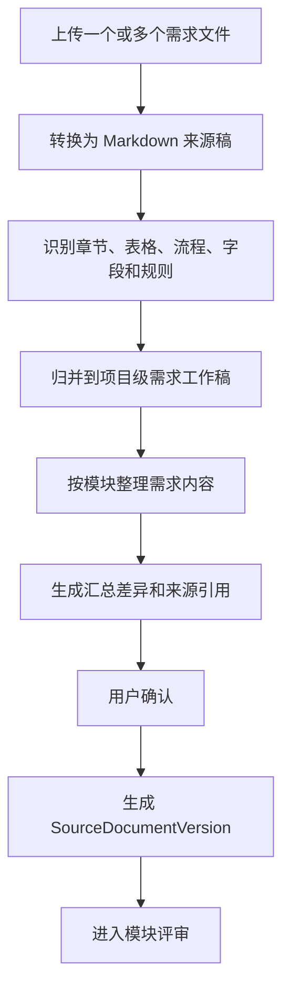
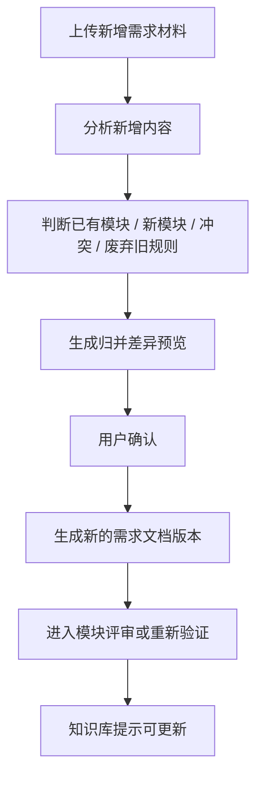
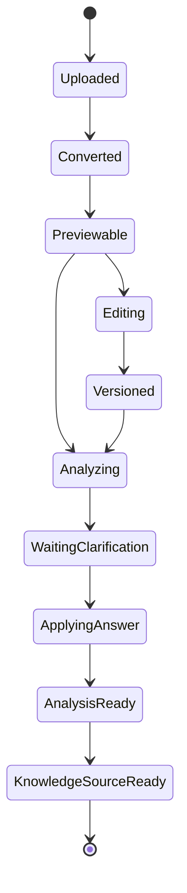

# 00-03 AI测试系统 - 需求文档、分析与版本管理 PRD

## 1. 这份文档解决什么问题

本文细化需求文档从上传到分析、编辑、澄清、版本记录的完整流程。

核心规则：

- 上传文档后不直接进入正式知识库。
- 用户可以上传多个需求文件；多个文件先作为来源材料，系统汇总归并成一份项目级 Markdown 需求工作稿。
- 后续新增需求材料走增量归并流程，生成差异预览并由用户确认后，形成新的需求文档版本。
- Word、PDF 等原始需求文档保存在文件系统；SQLite 保存文档元数据、版本、Markdown 正文或路径、覆盖矩阵、评审状态和来源引用。
- 需求分析不是摘要生成，必须覆盖原始文档的章节、段落、表格、图片说明、流程和字段。
- 系统必须生成原文覆盖矩阵，证明原始文档每块内容已被纳入模块、标记待澄清、标记无需测试或标记废弃。
- 需求文档不按文件拆分，评审时按模块对同一份需求文档进行分段评审。
- 需求评审负责发现问题和提出澄清；澄清负责回答问题并写回需求文档新版本，二者构成闭环而不是互斥流程。
- 当前确认流程为：先按模块评审发现问题，再进入澄清；澄清答案写回需求文档新版本后，受影响模块必须重新评审或重新验证。
- 新增需求材料由系统先自动建议归属已有模块、新模块、冲突修改、废弃旧规则或待澄清内容，用户在归并差异预览中确认后才写入新版本。
- 每个模块独立评审，评审完成后模块状态变为“已完成”；所有模块完成且无关键待澄清问题后，整份需求才算评审完成。
- 项目没有需求文档时，可以基于站点探索文档生成“候选需求文档”，候选需求文档必须评审确认后才能作为正式需求来源。
- Markdown 工作稿支持预览、源码查看和在线编辑。
- 需求文档详情提供 AI 对话修改入口，用户可以用自然语言提出修改要求，系统生成 Markdown diff，人工确认后才写入新版本。
- 每次上传、转换、编辑、澄清写回、候选需求生成都生成版本记录。
- 每个需求文档版本变化都必须生成版本变化日志，供知识库判断是否需要增量更新。
- 澄清内容必须写回 Markdown 工作稿的新版本；原始上传文件不被覆盖。
- 需求分析、探索文档和澄清应用记录只是知识库生成/更新的来源证据，不直接进入正式知识库。

---

## 2. 业务边界

### 2.1 本模块负责

- 上传需求文档和相关文件
- 转换为 Markdown 工作稿
- 将多个需求文件归并为一份项目级需求工作稿
- 将新增需求材料归并到已有需求工作稿并生成差异预览
- 预览 Markdown 渲染结果
- 在线编辑 Markdown
- 通过 AI 对话生成 Markdown 修改建议
- 保存文档版本和差异记录
- 保存版本变化日志，供知识库更新判断
- 发起需求/功能分析
- 生成原文覆盖矩阵
- 按模块生成需求评审清单
- 生成澄清问题
- 生成澄清表单并支持用户补充
- 应用澄清答案到需求文档 Markdown 工作稿
- 在没有需求文档时，基于探索文档生成候选需求文档
- 按模块组织需求评审结果和待确认问题

### 2.2 本模块不负责

- 不直接生成正式知识库
- 不直接生成测试用例
- 不直接生成自动化测试代码
- 不直接修改已发布知识库

---

## 3. 文档类型

| 类型 | 说明 | 第一版处理方式 |
| --- | --- | --- |
| Markdown | 直接作为工作稿 | 保留原文，支持在线编辑 |
| Word | PRD、BRD、FSD 等 | 转换为 Markdown 工作稿，保留原文件 |
| PDF | 需求说明、接口说明 | 转换为 Markdown 或文本化 Markdown，保留原文件 |
| 站点探索 Markdown | 探索 Agent 输出 | 可作为候选需求文档生成来源，不直接入知识库 |
| OpenAPI/接口文档 | API 说明 | 第一版仅可上传和预览，不进入需求分析和知识库；后续单独规划分析能力 |

---

## 4. 核心对象

### 4.1 SourceDocument

表示一个原始文档对象。

| 字段 | 说明 |
| --- | --- |
| 项目 ID | 归属项目 |
| 文档名称 | 用户上传或手工命名 |
| 文档类型 | PRD、FSD、BRD、探索文档、接口文档、其他 |
| 原始文件路径 | 本地文件系统路径 |
| 当前版本 ID | 当前工作稿版本 |
| 状态 | 草稿、分析中、待澄清、已确认、已归档 |
| 创建人 | 上传人 |
| 创建时间 | 系统生成 |

### 4.2 SourceDocumentVersion

表示每次上传、转换、编辑、澄清应用后的文档版本。

| 字段 | 说明 |
| --- | --- |
| 文档 ID | 所属 SourceDocument |
| 版本号 | v1、v2、v3 |
| Markdown 内容 | 当前版本 Markdown |
| 来源动作 | 上传、转换、多文件汇总、增量需求归并、在线编辑、澄清写回、候选需求生成、人工补充 |
| 变更摘要 | 用户或系统生成的简要说明 |
| 差异摘要 | 与上一版本的差异 |
| 输入来源清单 | 本版本归并了哪些上传文件、补充材料或澄清记录 |
| 创建人 | 操作人 |
| 创建时间 | 系统生成 |

### 4.3 DocumentChatEditSession

表示一次围绕需求文档的 AI 对话修改会话。

| 字段 | 说明 |
| --- | --- |
| 会话 ID | 系统唯一 |
| 文档版本 ID | 当前编辑基于哪个 SourceDocumentVersion |
| 会话类型 | 需求文档修改、候选需求修改、探索补充写回 |
| 用户指令 | 用户提出的修改要求 |
| Agent 输出 | 修改建议摘要 |
| Diff 路径 | 生成的 Markdown diff 文件路径 |
| 状态 | 草稿、待确认、已应用、已取消、失败 |
| 创建人 | 操作人 |
| 创建时间 | 系统生成 |

### 4.4 DocumentChatEditPatch

表示 AI 对话生成的一次修改补丁。

| 字段 | 说明 |
| --- | --- |
| 补丁 ID | 系统唯一 |
| 会话 ID | 所属对话会话 |
| 目标标题 | Markdown 中的目标章节 |
| 修改类型 | 新增、修改、删除、移动、重写 |
| 修改原因 | 用户要求或系统解释 |
| 原文片段 | 修改前内容 |
| 建议片段 | 修改后内容 |
| 来源引用 | 需求原文、探索文档、澄清记录或人工输入 |
| 状态 | 待确认、已接受、已拒绝 |

### 4.5 RequirementAnalysis

表示一次需求分析结果。

| 字段 | 说明 |
| --- | --- |
| 分析版本 | 需求分析版本号 |
| 输入文档版本 | 关联 SourceDocumentVersion |
| 分析状态 | 排队中、运行中、待澄清、已完成、失败 |
| 分析摘要 | 模块、功能点、风险摘要 |
| 输出路径 | 分析 Markdown 或结构化 JSON 路径 |

### 4.6 DocumentVersionChangeLog

表示需求文档版本变化日志，供知识库更新判断。

| 字段 | 说明 |
| --- | --- |
| 变化 ID | 系统唯一 |
| 文档 ID | 所属 SourceDocument |
| 旧版本号 | 变化前版本 |
| 新版本号 | 变化后版本 |
| 变化类型 | 上传、转换、多文件汇总、增量需求归并、在线编辑、澄清写回、AI 对话修改、候选需求生成 |
| 变化原因 | 用户操作或系统处理原因 |
| 影响模块 | 一个或多个模块 key |
| 影响范围 | 规则、流程、字段、状态、权限、风险 |
| 是否触发知识库更新 | 是或否 |
| 变更摘要 | 简要说明 |
| 创建时间 | 系统生成 |

### 4.7 DocumentConversionJob

表示 Word/PDF 到 Markdown 工作稿的转换任务。

| 字段 | 说明 |
| --- | --- |
| 转换任务 ID | 系统唯一 |
| 文档 ID | 所属 SourceDocument |
| 输入文件路径 | 原始 Word/PDF 文件路径 |
| 输出 Markdown 路径 | 转换后的 Markdown 工作稿路径 |
| 转换状态 | 排队中、运行中、成功、失败、需人工处理 |
| 质量检查状态 | 通过、有警告、失败 |
| 无法识别项数量 | 表格、图片、扫描页、流程图等问题数量 |
| 转换摘要 | 标题、表格、图片、页数等转换摘要 |

### 4.8 SourceCoverageItem

表示原始文档内容到分析结果的覆盖关系。

| 字段 | 说明 |
| --- | --- |
| 覆盖项 ID | 系统唯一 |
| 文档版本 ID | 关联 SourceDocumentVersion |
| 原文位置 | 章节、段落、表格、图片、流程图、附录等位置 |
| 原文摘要 | 原始内容简要摘要 |
| 原文类型 | 标题、段落、表格、图片说明、流程、字段、规则、附录 |
| 归属模块 | 已归属的需求模块，可为空 |
| 分析结果引用 | 对应模块、功能点、规则、流程或字段 |
| 覆盖状态 | 已覆盖、待归类、待澄清、无需测试、已废弃 |
| 处理说明 | 为什么这样处理 |

### 4.9 RequirementReviewModule

表示模块评审状态。

| 字段 | 说明 |
| --- | --- |
| 模块 ID | 系统唯一 |
| 文档版本 ID | 所属需求文档版本 |
| 模块名称 | 例如登录、项目管理、知识库 |
| 模块范围 | 来源章节、页面或业务范围 |
| 原文覆盖数 | 该模块覆盖的原文项数量 |
| 待澄清数 | 该模块未处理澄清问题数量 |
| 评审状态 | 待评审、评审中、有澄清、已完成、已废弃 |
| 评审人 | 操作人 |
| 完成时间 | 模块完成时间 |

### 4.10 RequirementReviewVerification

表示需求评审验证结果，防止模块或原文内容漏评。

| 字段 | 说明 |
| --- | --- |
| 验证 ID | 系统唯一 |
| 文档版本 ID | 所属需求文档版本 |
| 模块总数 | 系统识别出的模块数量 |
| 已完成模块数 | 状态为已完成或已废弃的模块数量 |
| 未完成模块数 | 仍需评审的模块数量 |
| 原文覆盖总数 | SourceCoverageItem 总数 |
| 未处理覆盖项数 | 待归类、关键待澄清数量 |
| 关键澄清未处理数 | 待回答或待写回的关键澄清数量 |
| 验证状态 | 通过、不通过 |
| 验证说明 | 未通过原因 |

---

## 5. 页面与交互

### 5.1 文档列表

字段：

- 文档名称
- 文档类型
- 来源文件数量
- 当前版本
- 状态
- 最近更新时间
- 最近操作人
- 是否影响知识库
- 操作：预览、编辑、分析、查看版本、归档

### 5.2 文档详情

布局建议：

- 顶部：文档名称、类型、状态、当前版本、操作按钮
- 左侧：Markdown 目录
- 中间：Markdown 预览
- 右侧：来源文件、版本、分析结果、澄清问题、AI 对话修改、知识库影响提示

### 5.3 来源文件与增量需求入口

需求文档详情页必须展示当前需求工作稿的来源文件清单。

来源文件清单展示：

- 文件名称、类型、上传人、上传时间。
- 是否已归并到当前需求工作稿版本。
- 归并影响模块。
- 转换质量状态和无法识别项。
- 操作：预览原文件、查看转换稿、发起归并、查看归并差异。

增量需求入口：

- 用户可以在已有需求文档下继续上传新需求材料，例如补充 PRD、会议纪要、截图说明、变更单或接口补充说明。
- 新材料上传后先进入来源材料区，不直接修改当前需求工作稿，也不直接进入知识库。
- 系统分析新材料与当前需求工作稿的关系，判断属于已有模块、新模块、冲突修改、废弃旧规则或待澄清内容。
- 系统必须生成归并差异预览，用户确认后才生成新的 `SourceDocumentVersion`。
- 新版本来源动作记录为“增量需求归并”。

### 5.4 在线编辑

编辑规则：

- 编辑 Markdown 源码。
- 保存时必须填写或自动生成变更摘要。
- 保存后生成新版本，旧版本不可覆盖。
- 保存后标记“存在可用于知识库更新的来源变化”。

### 5.5 AI 对话修改

需求文档详情页提供 AI 对话区域，用户可以用自然语言要求系统修改当前 Markdown 工作稿。

示例指令：

- “把登录失败的错误提示补充到登录模块。”
- “根据刚才澄清的内容，补充项目归档后的限制。”
- “把这个表格整理成字段、校验、提示语三列。”
- “把探索文档中发现的新增按钮作为待确认点加入需求评审。”

处理规则：

- AI 对话修改不能直接覆盖当前文档。
- Agent 必须生成修改建议、目标章节、修改原因和 Markdown diff。
- 用户必须在 diff 预览中逐项接受或拒绝。
- 接受后生成新的 `SourceDocumentVersion`。
- 新版本来源动作记录为“AI 对话修改”。
- 修改必须保留来源引用，说明来自用户指令、原始文档、探索文档、澄清记录或人工补充。
- 如果用户要求删除内容，系统必须提示影响范围，并保留被删除内容的历史版本。
- AI 对话修改完成后，必须标记知识库存在可更新来源。

### 5.6 版本对比

必须支持：

- 查看历史版本列表
- 查看某一版本 Markdown
- 对比任意两个版本
- 查看变更摘要和编辑人
- 查看该版本是否已参与知识库生成

---

## 6. 需求分析

### 6.1 需求文档来源路径

| 场景 | 处理方式 | 结果状态 |
| --- | --- | --- |
| 有单个需求文档 | 上传或转换为 Markdown 工作稿后进入需求分析和模块评审 | 待评审或已确认 |
| 有多个需求文档 | 多个文件先转换为来源稿，再汇总归并为一份项目级 Markdown 需求工作稿 | 待评审或已确认 |
| 已有需求文档后新增需求材料 | 先进入来源材料区，系统生成增量归并差异预览，用户确认后形成新版本 | 待评审或待澄清 |
| 没有需求文档，有探索文档 | 基于探索文档生成候选需求文档，再进入需求分析和模块评审 | 候选待确认 |
| 没有需求文档，也没有探索文档 | 不能生成正式需求分析，只能提示先上传文档或发起站点探索 | 缺少来源 |

### 6.2 多文件汇总规则

用户可以在同一项目下上传多个需求文件。系统不把每个文件当成一份独立正式需求，而是将它们作为来源材料，汇总为一份项目级 Markdown 需求工作稿。

汇总流程：

汇总规则：

- 多个上传文件必须保留原始文件和转换稿，不能被合并过程覆盖。
- 项目级需求工作稿按模块组织，不按上传文件拆分。
- 系统必须记录每个模块、规则、字段和流程来自哪些源文件、章节、段落、表格或图片说明。
- 多文件之间存在重复内容时，系统生成重复项提示，由用户确认保留口径。
- 多文件之间存在冲突时，系统生成冲突项或澄清问题，不能自动选择其中一个作为正式结论。
- 多文件中存在无法归属模块的内容时，进入原文覆盖矩阵的“待归类”状态。
- 汇总后的需求工作稿必须进入同一套模块评审流程。

候选需求文档生成规则：

- 候选需求文档是一份完整 Markdown 工作稿，不拆成多个需求文件。
- 候选需求文档按模块组织内容，模块来自探索文档中的菜单、页面、业务操作和状态流转。
- 候选需求文档必须明确标记“由探索结果反推”，不能声称是业务方原始需求。
- 每条候选需求必须带探索来源引用，例如探索任务、页面、操作、截图或字段。
- 系统必须区分“明确观察”“流程推断”“待确认”三类内容。
- 候选需求文档进入同一套需求评审流程，评审确认后才能作为正式需求文档版本。
- 未评审确认的候选需求文档不能用于生成正式知识库，只能用于草稿分析和待确认问题整理。

### 6.3 输入

- 当前文档版本
- 可选：已有探索文档
- 可选：已有澄清答案
- 可选：人工补充说明
- 可选：新增需求材料
- 可选：多个来源文件转换稿

### 6.4 文档转换

Word、PDF、扫描 PDF 不能直接进入需求分析，必须先转换为 Markdown 工作稿。

转换规则：

- 原始 Word/PDF 文件保存在文件系统，不覆盖、不改写。
- 转换后的 Markdown 工作稿生成 `SourceDocumentVersion`。
- SQLite 保存文档元数据、版本、Markdown 正文或文件路径、转换状态和质量检查结果。
- 大文件、图片、附件、扫描页截图保存在文件系统，SQLite 只保存路径和索引。
- 转换 Agent 不生成业务结论，只负责高保真转换和质量检查。

转换质量检查：

| 检查项 | 说明 |
| --- | --- |
| 标题层级 | Word/PDF 标题是否正确转为 Markdown 标题 |
| 段落完整性 | 是否存在丢段、乱码、空段 |
| 表格完整性 | 表格行列、合并单元格、表头是否保留 |
| 图片和流程图 | 是否提取图片说明或保存附件路径 |
| 编号和列表 | 编号、项目符号、层级是否保留 |
| 页眉页脚 | 是否清理无业务意义的页眉页脚 |
| 无法识别项 | 扫描页、复杂图表、损坏表格是否生成待处理项 |

转换结果状态：

| 状态 | 说明 |
| --- | --- |
| 转换成功 | 可直接预览和进入需求分析 |
| 有警告 | 可进入预览，但需用户检查无法识别项 |
| 需人工处理 | 存在关键无法识别内容，不能进入正式需求分析 |
| 转换失败 | 无 Markdown 工作稿，需要重新上传或人工处理 |

### 6.5 输出

- 模块列表
- 功能点列表
- 业务对象和字段
- 主流程、分支流程、异常流程
- 状态流转
- 依赖关系
- 权限差异
- 数据前置
- 测试关注点
- 澄清问题
- 原文覆盖矩阵

### 6.6 原文覆盖矩阵

需求分析必须先证明“没有漏读原始文档”。系统需要把原始文档中的章节、段落、表格、图片说明、流程图、字段规则、附录逐项映射到分析结果。

覆盖状态：

| 状态 | 说明 |
| --- | --- |
| 已覆盖 | 原文内容已进入模块、功能点、规则、流程、字段或测试关注点 |
| 待归类 | 原文存在，但暂时无法判断归属模块 |
| 待澄清 | 原文含义不清或影响测试结论 |
| 无需测试 | 用户确认该内容不进入测试范围 |
| 已废弃 | 用户确认该内容不适用 |

覆盖矩阵字段：

| 字段 | 说明 |
| --- | --- |
| 原文位置 | 章节号、段落号、表格、图片、附录 |
| 来源文件 | 该覆盖项来自哪个上传文件或补充材料 |
| 原文摘要 | 原始内容简述 |
| 原文类型 | 标题、段落、表格、图片说明、流程、字段、规则 |
| 归属模块 | 对应评审模块 |
| 分析结果 | 对应功能点、规则、流程、字段或测试关注点 |
| 覆盖状态 | 已覆盖、待归类、待澄清、无需测试、已废弃 |
| 处理说明 | 系统或用户的处理原因 |

覆盖规则：

- 不允许只输出摘要后跳过原文覆盖矩阵。
- 原文表格必须按行或按规则项进入覆盖矩阵。
- 原文图片、流程图无法结构化时，必须形成图片说明项，并标记是否需要人工补充。
- 覆盖状态为“待归类”或“待澄清”的内容，不能被静默忽略。
- 覆盖状态为“无需测试”或“已废弃”的内容必须有用户确认记录。

### 6.7 按模块评审

需求文档不拆分为多个独立文件。系统在评审时按模块切分视图，帮助用户逐模块确认同一份需求文档中的内容。

需求评审和澄清不是两个互斥入口。模块评审负责发现疑问、冲突和缺口；澄清流程负责回答这些问题并写回需求文档新版本。写回后，对应模块必须重新进入评审或至少重新验证。

模块评审内容：

- 模块范围是否准确。
- 原文覆盖项是否完整，没有漏掉归属本模块的章节、段落、表格和规则。
- 功能点是否完整。
- 主流程、分支流程、异常流程是否清楚。
- 字段、状态、权限、依赖是否有缺口。
- 探索文档补充的页面事实是否需要写回需求文档。
- 候选需求文档中的推断内容是否可以转为正式需求。
- 新增需求材料是否已正确归并到已有模块或新模块。

评审状态：

| 状态 | 说明 |
| --- | --- |
| 待评审 | 模块尚未确认 |
| 评审中 | 用户正在处理澄清或差异 |
| 有澄清 | 模块存在待回答或待写回澄清问题 |
| 已完成 | 模块内容已确认，可作为知识库来源 |
| 已废弃 | 模块不再适用 |

模块完成条件：

- 模块内所有原文覆盖项状态为已覆盖、无需测试或已废弃。
- 模块内不存在关键待归类内容。
- 模块内不存在未回答的关键澄清问题。
- 模块内已回答的澄清问题已经写回需求文档或明确标记无需写回。
- 模块的功能点、流程、字段、状态、权限、依赖和测试关注点已完成确认。

整份需求完成条件：

- 所有模块状态均为已完成或已废弃。
- 文档级原文覆盖矩阵中不存在待归类、关键待澄清项。
- 所有必须写回的澄清内容已生成新的需求文档版本。
- 用户确认当前需求版本可进入知识库生成。

### 6.8 需求评审验证

需求评审必须有验证步骤，防止漏掉模块或原文内容。

验证规则：

- 系统必须统计模块总数、已完成模块数、未完成模块数。
- 每个模块必须有评审状态，不能存在无状态模块。
- 每个原文覆盖项必须有处理状态，不能存在未处理状态。
- 待归类、关键待澄清、关键冲突未处理时，验证不通过。
- 验证不通过时，系统必须列出未完成模块、未处理原文位置和待处理澄清问题。
- 只有验证通过后，需求文档版本才能标记为已确认。

验证输出：

| 输出 | 说明 |
| --- | --- |
| 模块完成清单 | 每个模块的状态、评审人、完成时间 |
| 未完成模块清单 | 未完成原因和跳转入口 |
| 原文覆盖验证 | 已覆盖、待归类、待澄清、无需测试、已废弃统计 |
| 关键澄清清单 | 待回答、待写回问题 |
| 是否可确认 | 通过或不通过 |

### 6.9 澄清问题与表单

澄清问题不应只是一段聊天记录。系统需要生成结构化澄清表单，方便测试工程师补充，也方便后续写回需求文档。

| 字段 | 说明 |
| --- | --- |
| 所属模块 | 关联评审模块 |
| 问题标题 | 简短问题 |
| 问题说明 | 为什么要问 |
| 原文引用 | 来源章节、段落、表格、图片或流程 |
| 影响范围 | 规则、流程、字段、权限、状态、测试用例、自动化 |
| 当前假设 | 系统当前理解，可为“无” |
| 问题类型 | 缺规则、冲突、边界不清、异常不清、权限不清、数据不清、提示语不清 |
| 测试影响 | 不确认会漏掉或误判哪些测试 |
| 建议回答格式 | 文本、单选、多选、表格、字段补充、状态流转补充 |
| 用户回答 | 用户填写 |
| 写回位置 | 写回需求文档的模块和标题 |
| 写回建议 | 系统生成的 Markdown 变更建议 |
| 状态 | 待回答、已回答、已应用、无需确认、已废弃 |

澄清来源：

- 需求分析自动发现的不清楚点。
- 模块评审中用户提出的问题。
- 多文件汇总时发现的冲突或重复口径。
- 新增需求归并时发现的变更影响或不兼容规则。
- 探索补充与需求描述不一致时产生的差异项。

澄清表单类型：

| 类型 | 适用场景 |
| --- | --- |
| 文本补充 | 规则说明、业务背景、异常说明 |
| 单选确认 | 多个理解中选择一个 |
| 多选确认 | 多个适用条件同时存在 |
| 表格补充 | 字段规则、权限矩阵、错误码、状态列表 |
| 状态流转补充 | 状态、动作、前置条件、目标状态 |
| 用例影响确认 | 确认是否纳入测试范围或风险路径 |

### 6.10 评审策略

系统在需求评审时必须按以下策略检查模块质量：

| 策略 | 检查内容 |
| --- | --- |
| 完整性评审 | 原始文档每一段、表格、流程图是否都有归属或处理结论 |
| 可测试性评审 | 每个规则是否能生成明确步骤和预期结果 |
| 边界值评审 | 字段长度、必填、格式、上下限、重复值、空值是否清楚 |
| 异常路径评审 | 校验失败、无权限、依赖缺失、网络失败、数据不存在是否清楚 |
| 状态流转评审 | 每个状态来源、触发动作、目标状态、是否可回退是否清楚 |
| 权限评审 | 不同角色能看什么、能操作什么、禁止后如何提示 |
| 数据依赖评审 | 前置数据、测试数据构造、清理规则是否明确 |
| 冲突评审 | 同一规则在不同段落是否矛盾 |
| 探索补充评审 | 已有探索文档时，用页面字段、按钮、提示语、真实流转补充测试视角 |
| 风险评审 | 核心业务路径、高风险路径、不可自动化路径是否标记 |

评审输出：

- 模块评审结论。
- 澄清问题清单。
- 原文覆盖矩阵更新。
- 测试关注点。
- 风险点。
- 是否可进入知识库的判断。

### 6.11 澄清写回

应用规则：

- 回答不会覆盖原始上传文件。
- 用户可先预览澄清内容写回后的 Markdown diff。
- 应用澄清后，系统必须把确认内容写回需求文档 Markdown 工作稿，并生成新的 `SourceDocumentVersion`。
- 新版本来源动作记录为“澄清写回”，并记录关联澄清问题、目标模块、目标标题、写入方式和变更摘要。
- 澄清答案记录保留为审计证据，最终业务口径以写回后的需求文档版本为准。
- 应用后生成新的分析版本，分析输入指向写回后的需求文档版本。
- 应用后可标记知识库存在可更新来源。
- 应用后仍需在知识库界面手动点击生成或更新知识库。

### 6.12 新增需求归并

后续添加新需求时，不直接覆盖当前需求文档，也不直接进入知识库。新增材料必须先作为来源材料进入项目，再通过增量归并生成新的需求文档版本。

新增需求归并流程：

归并差异预览必须包含：

- 新增了哪些需求点。
- 修改了哪些已有规则、流程、字段、权限或状态。
- 是否建议创建新模块。
- 是否与已有需求冲突。
- 是否废弃或替换旧规则。
- 影响哪些模块。
- 是否影响已有测试用例和 UI 自动化。
- 需要澄清的问题。

归并规则：

- 属于已有模块的新增内容，写入对应模块并保留来源引用。
- 不属于已有模块的新增内容，生成新模块建议，用户确认后创建模块。
- 与已有规则冲突的内容，进入冲突项或澄清问题，不能直接覆盖旧规则。
- 归并确认后生成新的 `SourceDocumentVersion`，来源动作记录为“增量需求归并”。
- 新版本生成后，对受影响模块进入待评审或重新验证状态。
- 模块评审完成后，知识库界面提示存在可更新来源，由用户点击“更新知识库”。

---

## 7. 状态流转

说明：

- `KnowledgeSourceReady` 只表示可作为知识库来源。
- 不代表已经进入正式知识库。

---

## 8. SQLite 存储策略

第一版使用 SQLite。

数据库保存：

- 文档元数据
- 文档版本元数据
- Markdown 内容
- Markdown 文件路径
- 文档转换任务和质量检查结果
- 版本变化日志
- 分析状态
- 原文覆盖矩阵
- 模块评审状态
- 需求评审验证结果
- 澄清问题和回答
- 澄清写回记录
- AI 对话修改会话和补丁
- 候选需求生成记录
- 模块评审状态
- 知识库来源引用

文件系统保存：

- 原始上传文件
- 大型转换产物
- Markdown 工作稿文件
- 图片、流程图、扫描页截图和转换附件
- 分析输出 Markdown
- 差异报告附件
- AI 对话修改 diff

---

## 9. 验收标准

- 上传 Markdown 后能直接预览。
- 上传 Word/PDF 后能生成 Markdown 工作稿。
- Word/PDF/PDF 扫描件转换后必须生成转换质量检查结果。
- 转换存在关键无法识别内容时，不能直接进入正式需求分析。
- 每个版本变化必须有日志，清楚说明是否触发知识库更新。
- 文档详情支持 Markdown 预览和源码查看。
- 在线编辑保存后生成新版本，不覆盖旧版本。
- AI 对话修改必须先生成 diff，用户确认后才能写入新版本。
- AI 对话修改必须记录用户指令、修改原因、来源引用和版本记录。
- 每个版本能看到来源动作、编辑人、时间和变更摘要。
- 发起需求分析后能生成分析结果和澄清问题。
- 需求分析必须生成原文覆盖矩阵，覆盖章节、段落、表格、图片说明、流程和字段。
- 原文覆盖矩阵中每项必须有覆盖状态和处理说明。
- 需求评审必须按模块进行，每个模块能独立标记待评审、评审中、有澄清、已完成或已废弃。
- 所有模块完成且无关键待澄清问题后，整份需求才能标记已确认。
- 澄清问题必须以结构化表单展示，包含原文引用、影响范围、当前假设、测试影响、写回位置和状态。
- 澄清答案应用后写回需求文档 Markdown 工作稿，并生成新的文档版本和分析记录。
- 没有需求文档但已有探索文档时，能生成候选需求文档，并要求评审确认。
- 需求文档不拆分为多个需求文件，但评审界面必须支持按模块评审。
- 需求评审必须有验证结果，未完成模块、待归类原文、关键待澄清项未处理时不能标记整份需求已确认。
- 文档、分析、澄清写回记录、探索文档都只作为知识库来源证据，不直接写入正式知识库。
- 知识库界面能识别该文档是否有未更新到知识库的变更。
