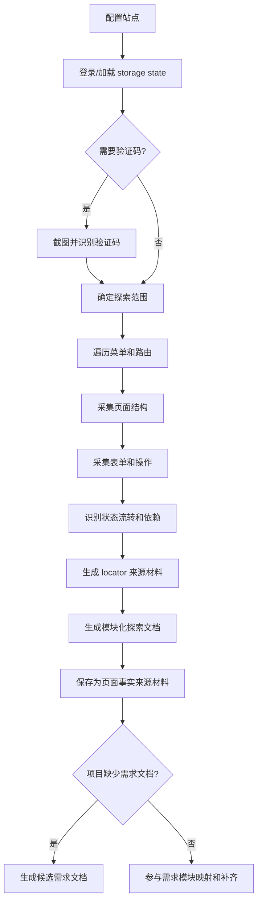

# 00-04 AI测试系统 - 站点探索 PRD

## 1. 这份文档解决什么问题

本文细化站点探索能力。站点探索用于把真实 Web 系统的页面结构、表单字段、操作路径、状态流转、依赖关系和定位信息沉淀为来源材料。

核心规则：

- 站点探索基于 Playwright CLI、`playwright-cli` skill、探索 skill 和探索 Agent。
- 探索 Agent 登录并遍历站点，按模块生成探索文档。
- 站点探索支持验证码登录。Playwright CLI 探索时可以对验证码区域截图，调用识别能力得到验证码文本，再完成登录并保存登录态。
- 探索文档先作为来源材料，不自动进入正式知识库。
- 探索文档 Markdown、截图、trace、video 和页面快照保存在文件系统；SQLite 保存探索任务、模块覆盖、页面、字段、操作、状态流转、locator、失败原因和附件路径。
- 探索文档详情提供 AI 对话修改入口，用户可以要求补充说明、调整模块归类、补充失败说明、生成候选需求片段或整理页面事实。
- AI 对话修改探索文档必须生成 diff，经人工确认后才产生新的探索文档版本或人工补充记录。
- 站点探索必须生成模块探索覆盖矩阵，每个模块都有完成标记；不能漏掉任何一个在探索范围内的模块。
- 遇到无法探索的模块，必须记录原因、证据和后续处理建议，不能静默跳过。
- 每个探索文档版本变化都必须生成版本变化日志，供知识库判断是否需要增量更新。
- 没有需求文档时，探索文档先生成“候选需求文档”，候选需求文档评审确认后才能作为知识库业务来源。
- 有需求文档时，探索文档作为需求评审和用例生成的页面事实补充，必须和需求分析结果进行映射、补齐和冲突识别。

---

## 2. 业务边界

### 2.1 本模块负责

- 维护被测站点配置
- 保存登录态
- 发起站点探索任务
- 调用浏览器工具执行探索
- 生成模块化探索文档
- 通过 AI 对话修改探索文档草稿或补充说明
- 生成页面事实、状态流转、依赖关系和 locator 来源材料
- 支持由 UI 自动化生成任务自动触发定向探索定位，补齐缺失页面、步骤和元素 locator
- 在没有需求文档时，为候选需求文档生成提供页面事实输入
- 记录探索失败、截图、trace、风险点

### 2.2 本模块不负责

- 不直接生成正式知识库
- 不直接修改需求文档
- 不直接把探索结论提升为正式业务需求
- 不直接生成测试用例
- 不直接修改自动化代码

---

## 3. 工具链

| 工具/能力 | 作用 |
| --- | --- |
| Playwright CLI | 浏览器启动、页面交互、截图、trace、storage state |
| `playwright-cli` skill | 标准化 Playwright CLI 操作方式和命令能力 |
| 探索 skill | 定义探索流程、模块识别、页面文档输出规范 |
| 探索 Agent | 读取站点配置，调用工具遍历页面并生成探索结果 |
| Agent Browser | 可作为浏览器自动化补充能力，用于交互式探索和调试 |

---

## 4. 站点配置

| 字段 | 说明 |
| --- | --- |
| 项目 ID | 所属项目 |
| 站点名称 | 例如“后台管理系统测试环境” |
| 站点 URL | 起始地址 |
| 环境 | local、test、pre、prod 等 |
| 登录方式 | 手动登录保存状态、账号密码、跳过登录 |
| 验证码处理方式 | 无验证码、人工输入、自动截图识别 |
| 账号说明 | 第一版可存说明，不强制保存明文密码 |
| 探索范围 | 菜单范围、URL 白名单、URL 黑名单 |
| 禁止路径 | 不允许探索的危险路径，如删除、支付、外发 |
| 默认角色 | 当前探索使用的业务角色 |

---

## 5. 探索流程

---

## 6. 探索文档内容

探索功能产物分为两类正式资产：探索文档和元素定位信息。每个模块至少输出一份探索文档，并同步沉淀可被 Playwright UI 自动化引用的元素定位信息。

| 产物 | 内容 | 主要用途 |
| --- | --- | --- |
| 探索文档 | 页面、模块、业务路径、字段、按钮、弹窗、状态流转、真实操作路径 | 补齐页面事实，参与知识库构建、需求评审补充和测试用例生成 |
| 元素定位信息 | 关键元素 locator、备用 locator、稳定性说明、页面截图、trace、页面快照、可访问名称和来源引用 | 支撑 Playwright UI 自动化代码生成，减少代码生成阶段重复探索页面和因元素不足导致的生成失败 |

Playwright UI 自动化代码生成时，系统优先复用探索文档和元素定位信息；只有缺失关键 locator 或页面事实不足时，才触发定向探索定位补充。

探索文档内容如下：

| 内容 | 说明 |
| --- | --- |
| 模块名称 | 菜单或业务模块名称 |
| 页面清单 | 路由、页面标题、入口路径 |
| 页面结构 | 列表、表单、详情、弹窗、Tab、筛选、分页 |
| 字段清单 | 字段名、输入控件、必填、校验、默认值、展示格式 |
| 操作清单 | 新增、编辑、删除、查询、导入、导出、启用、禁用等 |
| 状态流转 | 状态值、触发动作、前置条件、结果状态 |
| 依赖关系 | 登录态、角色、前置数据、接口、外部服务 |
| locator 来源 | 语义名称、推荐 locator、备用 locator、稳定性说明 |
| 风险点 | 不可访问、无权限、接口错误、弹窗异常、空状态 |
| 截图/trace | 可选附件路径 |

---

## 7. 探索文档 AI 对话修改

探索文档详情页提供 AI 对话区域，用于对探索结果进行人工引导式修订。

适用场景：

- 用户要求补充某个页面的业务说明。
- 用户要求把某个页面重新归类到其他模块。
- 用户补充无法探索模块的原因。
- 用户要求根据截图或 trace 总结页面风险点。
- 用户要求把探索发现转成候选需求文档片段。
- 用户要求整理表单字段、按钮、提示语、状态流转。

处理规则：

- AI 对话修改不能直接覆盖探索文档。
- 系统必须生成 Markdown diff 或结构化补丁。
- 用户确认后，生成新的探索文档版本或人工补充记录。
- 修改必须记录用户指令、修改原因、来源引用和影响模块。
- 如果修改会影响候选需求、知识库、用例或自动化，系统必须标记“页面来源有更新”。
- AI 修改不得把页面事实直接提升为业务需求，只能形成页面事实、候选需求片段、待确认点或冲突项。
- 探索文档每次 AI 对话修改、手工补充、重新探索、合并模块或补充说明，都必须写入版本变化日志。

补丁字段：

| 字段 | 说明 |
| --- | --- |
| 目标模块 | 被修改的探索模块 |
| 目标页面 | 被修改的页面或操作 |
| 修改类型 | 新增、修改、删除、重归类、补充说明 |
| 修改原因 | 用户指令或 Agent 说明 |
| 原内容 | 修改前内容 |
| 建议内容 | 修改后内容 |
| 来源引用 | 用户输入、截图、trace、页面快照、探索记录 |
| 影响范围 | 候选需求、知识库、用例、自动化 |
| 状态 | 待确认、已接受、已拒绝 |

---

## 8. 探索覆盖与完成验证

站点探索必须按模块验证，防止漏掉菜单、页面或关键操作。

### 8.1 ExplorationModuleCoverage

| 字段 | 说明 |
| --- | --- |
| 模块 ID | 系统唯一 |
| 探索任务 ID | 所属 ExplorationRun |
| 模块名称 | 菜单或业务模块名称 |
| 入口路径 | 菜单路径、URL、按钮入口 |
| 计划探索页面数 | 根据菜单、路由或用户配置识别 |
| 已探索页面数 | 成功采集页面数量 |
| 未探索页面数 | 未能进入或未能采集的页面数量 |
| 操作覆盖数 | 已识别操作数量 |
| 字段覆盖数 | 已识别字段数量 |
| 状态流转覆盖数 | 已识别状态流转数量 |
| 完成状态 | 待探索、探索中、已完成、部分完成、无法探索、已跳过 |
| 完成说明 | 完成或未完成原因 |

### 8.2 完成状态规则

| 状态 | 说明 |
| --- | --- |
| 待探索 | 已识别模块但尚未开始 |
| 探索中 | 正在探索 |
| 已完成 | 模块入口、页面、表单、操作、状态和依赖已完成采集 |
| 部分完成 | 部分页面或操作无法采集，但已有有效结果 |
| 无法探索 | 权限、验证码、环境、路由错误、页面异常等导致无法探索 |
| 已跳过 | 用户配置排除或禁止路径 |

### 8.3 无法探索说明

无法探索或部分完成时必须记录：

| 字段 | 说明 |
| --- | --- |
| 失败模块 | 模块名称 |
| 失败页面 | URL、菜单路径或操作入口 |
| 失败原因 | 无权限、登录失败、验证码失败、页面报错、接口失败、禁止路径、超时、元素不可达 |
| 失败证据 | 截图、trace、video、console、network 摘要 |
| 影响范围 | 候选需求、知识库、用例、自动化 |
| 建议动作 | 人工补充、调整权限、保存登录态、缩小范围、重试 |
| 是否阻塞探索完成 | 是或否 |

### 8.4 探索任务完成条件

- 探索范围内所有模块都有 `ExplorationModuleCoverage` 记录。
- 每个模块状态为已完成、部分完成、无法探索或已跳过，不能仍是待探索或探索中。
- 部分完成和无法探索必须有情况说明和证据附件。
- 禁止路径必须标记已跳过，不能算失败。
- 系统必须生成探索覆盖汇总，展示模块总数、已完成数、部分完成数、无法探索数、已跳过数。
- 如果存在无法探索模块，探索任务可以结束，但状态必须是“完成但有阻塞”或“部分完成”，不能标记为完全成功。

### 8.5 部分完成对下游的影响

| 探索结果 | 是否允许进入知识库 | 是否允许生成测试用例 | 是否允许生成自动化代码 | 处理规则 |
| --- | --- | --- | --- | --- |
| 全部核心模块已完成 | 是 | 是 | 是 | 可作为正式来源进入知识库 |
| 非核心页面部分完成 | 是，但标 warning | 是，但用例标记低置信来源 | 视 locator 是否完整 | 知识库记录探索缺口和风险说明 |
| 核心页面可访问，但部分字段或按钮 locator 缺失 | 是 | 是 | 否，直到补齐 locator | 生成 locator 补充任务或人工补充入口 |
| 核心流程无法完成 | 否 | 否 | 否 | 知识库构建应阻塞，必须补充探索或人工确认 |
| 登录、权限或验证码导致核心模块无法进入 | 否 | 否 | 否 | 任务进入等待人工或探索阻塞 |
| 只缺少截图、video 等辅助证据 | 是 | 是 | 是 | 不阻塞下游，但报告质量检查 warning |
| 用户明确跳过非测试范围模块 | 是 | 是 | 不适用 | 必须记录跳过原因，不计入探索失败 |

核心模块判断规则：

- 用户在探索范围中明确标记为核心模块的模块，必须按核心模块处理。
- 需求文档中出现主流程、关键状态流转、权限控制、资金/订单/审批/发布等关键业务的模块，默认视为核心模块。
- 如果系统无法判断模块是否核心，应标记为待确认，而不是默认当成非核心模块。

---

### 8.6 定向探索定位任务

UI 自动化生成任务发现关键 locator 缺失时，可以自动触发定向探索定位任务。

定向探索定位任务输入：

| 输入 | 说明 |
| --- | --- |
| 关联用例 | 触发探索定位的已采纳测试用例 |
| 缺失步骤 | 缺少 locator 的测试步骤或断言目标 |
| 目标页面 | URL、菜单路径、页面名称或已有探索页面引用 |
| 目标元素 | 字段、按钮、链接、表格行、弹窗、提示语等 |
| 期望操作 | 点击、输入、选择、上传、断言、等待状态变化等 |

输出要求：

- 推荐 locator、备用 locator 和稳定性说明。
- 页面快照、截图、trace 或操作记录来源。
- 元素可访问名称、role、label、placeholder、test id、稳定文本或稳定属性。
- 如果元素存在歧义，必须列出候选元素和差异说明，进入人工确认。
- 如果页面无法进入、权限不足、验证码阻塞、元素不存在或命中禁止路径，必须记录失败原因和建议动作。

定向探索定位只补充页面事实和 locator 来源，不直接修改测试用例和自动化代码。补充结果写回探索文档版本或 locator 元数据后，由 UI 自动化生成任务重新执行 locator 准入检查。

---

## 9. 验证码登录

第一版需要支持常见图片验证码登录，但不把验证码识别做成独立通用 OCR 平台。

处理流程：

1. 探索 Agent 打开登录页并定位账号、密码、验证码输入框和验证码图片区域。
2. Playwright CLI 对验证码图片或指定区域截图。
3. 系统调用配置好的验证码识别能力，返回验证码文本和置信度。
4. Agent 填写账号、密码、验证码并提交登录。
5. 登录成功后保存 `storage state`，后续探索优先复用登录态。
6. 如果识别失败或置信度过低，任务进入“等待人工输入验证码”状态，不应反复失败重试。

记录要求：

- 保存验证码截图路径、识别结果、置信度、登录结果和失败原因。
- 不在日志中明文展示密码。
- 验证码截图只作为登录证据和失败排查附件，不进入正式知识库。
- 如果验证码有频率限制或滑块/短信/二次验证，第一版可标记为“需要人工登录保存状态”。

---

## 10. 与需求文档的关系

### 10.1 没有需求文档

如果项目没有上传需求文档：

- 探索文档不能直接生成正式知识库。
- 系统可以基于探索文档生成“候选需求文档”。
- 候选需求文档是一份完整 Markdown 工作稿，不按探索模块拆成多个需求文件。
- 候选需求文档按模块组织内容，模块来自菜单、页面、业务操作、表单和状态流转。
- 候选需求文档必须进入需求评审流程，评审确认后才能成为正式需求文档版本。
- 所有反推内容必须标记来源和置信类型：明确观察、流程推断、待确认。
- 未探索到的业务规则不能由系统编造。
- 候选需求未确认前，测试用例只能生成草稿，不能进入正式用例采纳和自动化生成。

候选需求文档建议结构：

| 章节 | 内容 |
| --- | --- |
| 模块说明 | 从菜单、页面标题和操作聚合出的模块描述 |
| 页面清单 | 路由、页面标题、入口路径、角色可见性 |
| 业务流程 | 从页面跳转、操作前后状态推断出的流程 |
| 表单与字段 | 字段名、控件类型、必填、默认值、校验提示 |
| 操作与提示 | 按钮、弹窗、Toast、确认框、错误提示 |
| 状态流转 | 状态值、触发动作、前置条件、结果状态 |
| 权限表现 | 不同角色可见、可操作、禁止访问的差异 |
| 待确认问题 | 探索无法判断的业务规则、边界和例外 |
| 推断依据 | 对应探索文档、页面、截图、trace 或操作记录 |

### 10.2 有需求文档

如果项目已有需求文档：

- 需求文档负责业务意图、业务规则、流程预期、验收口径。
- 探索文档负责页面结构、真实字段、交互路径、状态回显、locator。
- 探索文档不能直接覆盖需求规则。
- 系统必须生成模块映射和冲突清单。
- 需求评审以需求文档为主，按模块评审同一份需求文档；探索文档只作为页面事实补充和差异证据。
- 探索文档发现的新页面、新按钮、新字段或新提示语，不直接变成需求结论，必须转成补齐项、冲突项或澄清问题。

融合步骤：

1. 将探索模块映射到需求模块。
2. 用探索结果补齐页面、字段、按钮、locator、真实状态回显。
3. 对需求中存在但探索未发现的功能标记为“待探索”。
4. 对探索中存在但需求未描述的功能标记为“需求缺口”。
5. 对两者不一致的字段、状态、流程和权限生成冲突项。
6. 用户确认冲突项后，结论通过澄清写回或在线编辑写回需求文档新版本。
7. 写回后的需求文档版本再进入知识库更新。

---

## 11. 冲突项

| 字段 | 说明 |
| --- | --- |
| 冲突编号 | 项目内唯一 |
| 所属模块 | 影响模块 |
| 需求来源 | 文档版本、段落、标题 |
| 探索来源 | 探索任务、页面、操作 |
| 冲突类型 | 字段不一致、状态不一致、流程不一致、权限不一致、页面缺失、需求缺口 |
| 冲突说明 | 具体差异 |
| 影响范围 | 知识库、用例、自动化、缺陷判断 |
| 建议问题 | 给业务或测试确认的问题 |
| 状态 | 待确认、已确认需求为准、已确认页面为准、已废弃 |

---

## 12. 更新规则

### 12.1 探索结果更新

当重新探索站点后：

- 新探索结果形成新的 `ExplorationRun`。
- 系统对比上一次探索结果。
- 知识库界面提示“页面来源有更新”。
- 更新计划展示新增页面、删除页面、字段变化、操作变化、locator 变化、状态变化。

### 12.2 对测试资产的影响

如果探索更新影响测试资产：

- 影响字段或按钮：标记相关测试用例需要复核。
- locator 变化：标记相关自动化脚本需要检查。
- 状态流转变化：标记相关断言和用例路径需要更新。
- 页面不存在：标记相关用例和自动化为风险状态。

### 12.3 版本变化日志

探索文档版本变化日志用于让知识库判断是否需要更新。

字段至少包含：

- 旧版本号
- 新版本号
- 变化类型：重新探索、AI 对话修改、人工补充、模块重归类、失败说明补充
- 变化原因
- 影响模块
- 影响页面
- 影响范围：页面事实、字段、按钮、提示语、状态流转、locator、风险点
- 是否触发知识库更新
- 变更摘要
- 创建时间

---

## 13. SQLite 存储策略

SQLite 保存：

- 站点配置
- 探索任务状态
- 探索模块覆盖矩阵
- 验证码登录配置、识别状态和截图路径
- 页面、字段、操作、状态流转结构化索引
- locator 元数据
- 无法探索说明
- AI 对话修改会话和补丁
- 版本变化日志
- 冲突项
- 附件路径

文件系统保存：

- 探索 Markdown 文档
- 截图
- trace
- video
- 原始快照
- AI 对话修改 diff
- 版本变化日志

---

## 14. 验收标准

- 能配置站点 URL 和探索范围。
- 能通过 Playwright CLI 或探索 Agent 发起探索。
- 能保存登录态并复用。
- 能在图片验证码场景下截图识别并尝试登录；识别失败时能转为人工输入或人工登录保存状态。
- 能按模块生成探索文档。
- 探索文档详情支持 AI 对话修改。
- AI 对话修改必须生成 diff 或结构化补丁，用户确认后才能生成新版本或补充记录。
- AI 对话修改不能直接把页面事实提升为正式业务需求。
- 能生成模块探索覆盖矩阵。
- 每个探索范围内模块都有完成标记。
- 无法探索的模块必须有情况说明、失败证据和建议动作。
- 探索文档版本必须有变化日志，明确知道哪些探索变化会触发知识库更新。
- 存在无法探索模块时，任务不能标记为完全成功，只能标记为部分完成或完成但有阻塞。
- 探索文档包含页面、表单、操作、状态流转、依赖关系、风险点。
- 探索文档不会自动进入正式知识库。
- 没有需求文档时，可基于探索文档生成候选需求文档，候选需求文档必须评审确认后才能作为知识库来源。
- 有需求文档时，探索文档必须生成模块映射、补齐项和冲突项，作为需求评审补充和用例生成补充。
- 冲突项未确认前，不能作为已确认知识写入正式知识库。
- 探索更新后能提示知识库和测试资产受影响范围。
