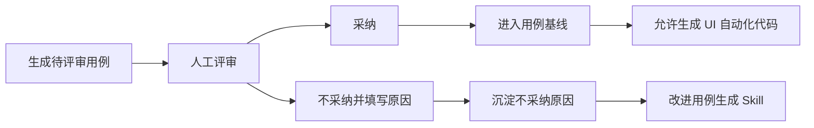

# 00-08 AI测试系统 - 测试用例生成 PRD

## 1. 这份文档解决什么问题

本文细化测试用例生成、评审、采纳、版本和覆盖率管理。

核心规则：

- 测试用例必须基于项目知识库生成，不能直接只拿上传文档或探索文档生成正式用例。
- 知识库未生成时，不生成正式评审用例；如需要试算，只能生成临时预览结果，不进入用例资产。
- 测试用例必须带来源引用、覆盖对象、风险等级和评审状态。
- 测试用例生成后支持人工编辑，也支持 AI 辅助修改，但所有修改都必须保留版本和来源变化记录。
- 第一期 UI 自动化测试代码只能从已采纳的测试用例生成；接口自动化不进入第一期生成范围。
- 测试用例生成不强制依赖 locator；locator 是 UI 自动化生成的准入条件。

---

## 2. 业务边界

### 2.1 本模块负责

- 从知识库生成测试用例。
- 支持按模块、按变更、按风险、按全项目生成用例。
- 维护用例版本、评审状态、采纳状态。
- 生成覆盖矩阵。
- 标记受需求文档、探索文档、知识库更新影响的用例。

### 2.2 本模块不负责

- 不负责生成正式知识库。
- 不负责执行自动化测试。
- 不负责生成自动化代码。
- 不负责接口自动化用例或 pytest + requests 代码生成。
- 不负责连接缺陷管理系统。

---

## 3. 用例来源

| 来源 | 作用 | 是否必需 |
| --- | --- | --- |
| 项目知识库 | 业务规则、流程、页面事实、状态流转 | 是 |
| 来源引用矩阵 | 追溯到需求、探索、澄清、人工补充 | 是 |

说明：

- 测试用例生成不直接读取失败诊断结果。
- 如果失败诊断暴露出需求不清或页面事实变化，必须先回到需求或探索模块形成新的确认来源，再通过知识库更新影响后续用例生成。

---

## 4. 用例生成方式

| 方式 | 说明 | 典型场景 |
| --- | --- | --- |
| 按模块生成 | 选择知识库模块生成用例 | 新模块上线 |
| 按变更生成 | 基于知识库更新计划生成增量用例 | 需求变更 |
| 按风险生成 | 选择高风险点生成重点用例 | 回归前补充 |
| 全量生成 | 基于整个知识库生成用例集 | 项目首次建库 |

生成前置检查：

- 知识库必须存在当前版本。
- 知识库版本必须是可用于正式用例生成的已发布版本。
- 如果存在关键冲突项、待确认问题或构建阻塞项，不能生成正式用例，只能返回阻塞说明。
- 如果没有页面探索来源，自动化可行性必须标记为“待探索”。
- 如果测试步骤涉及 UI 操作但缺少关键页面、操作路径或 locator，仍可生成业务测试用例，但自动化可行性必须标记为“待探索”或“需补充 locator”。
- “待探索”或“需补充 locator”的用例可以进入评审和采纳，但不能直接生成 UI 自动化代码；触发 UI 自动化生成时由自动化模块先执行 locator 准入检查，并可自动发起定向探索定位。
- 自动化可行性为“待探索”或“需补充 locator”的用例不能作为可执行自动化基线，只有补齐 locator 并重新准入后才可进入可执行状态。

---

## 5. 用例结构

| 字段 | 说明 |
| --- | --- |
| 用例编号 | 项目内唯一，例如 TC-LOGIN-001 |
| 用例标题 | 使用业务行为命名，不使用泛化标题 |
| 所属模块 | 对应知识库模块 |
| 场景类型 | 主流程、异常流程、权限、状态流转、边界、数据依赖、回归 |
| 优先级 | P0、P1、P2 |
| 风险等级 | 高、中、低 |
| 前置条件 | 数据、角色、状态、环境 |
| 测试步骤 | 用户操作或系统动作 |
| 预期结果 | 可验证的业务结果 |
| 来源引用 | 知识库文档、需求段落、探索页面 |
| 自动化可行性 | 可自动化、待探索、需补充 locator、需人工判断、不建议自动化 |
| 评审状态 | 待评审、已采纳、不采纳 |
| 不采纳原因 | 结构化记录不采纳原因，用于改进后续用例生成 Skill |
| 版本 | 用例版本号 |

---

## 6. 覆盖矩阵

覆盖矩阵不是只统计数量，必须能追溯到具体知识条目。

| 维度 | 说明 |
| --- | --- |
| 需求点覆盖 | 每个需求事实是否有用例覆盖 |
| 页面覆盖 | 每个核心页面是否有用例覆盖 |
| 操作覆盖 | 新增、编辑、删除、查询、导入、导出等操作 |
| 状态覆盖 | 每个状态值和状态流转 |
| 权限覆盖 | 管理员、测试工程师、访客等角色差异 |
| 异常覆盖 | 校验失败、无权限、依赖缺失、网络失败 |
| UI 自动化覆盖 | 已 UI 自动化用例占已采纳用例比例 |

---

## 7. 评审与采纳

流程：

规则：

- AI 生成后进入“待评审”，等待人工确认。
- 已采纳用例进入用例基线，必须保留版本。
- 不采纳用例必须填写原因，不进入覆盖率统计和自动化生成。
- 不采纳原因必须结构化保存，可用于分析 AI 用例生成质量，并在人工确认后更新用例生成 Skill、提示词或规则。
- 知识库更新影响已采纳用例时，不直接修改原用例状态；系统生成“受影响提示”或“复核任务”，由人工决定是否编辑并生成新版本。
- 已采纳用例可以在人工确认后重新编辑，但必须生成新版本；新版本保存后重新进入“待评审”，评审通过后替换当前基线版本。
- 第一版不设置“草稿、已退回、已废弃”作为正式评审状态；编辑中内容作为临时 UI 状态或版本草稿处理，不进入正式状态枚举。

不采纳原因建议分类：

| 原因类型 | 说明 | 是否可反哺 Skill |
| --- | --- | --- |
| 重复用例 | 与已有用例覆盖点重复 | 是 |
| 偏离需求 | 与知识库或需求事实不一致 | 是 |
| 步骤不可执行 | 操作步骤缺少页面、数据或前置条件 | 是 |
| 断言不可验证 | 预期结果无法通过页面或数据判断 | 是 |
| 场景价值低 | 对当前测试范围价值不高 | 是 |
| 来源不足 | 来源引用不完整或知识库内容不足 | 否，应先补知识库 |
| 其他 | 人工填写说明 | 视情况 |

---

## 8. 页面设计

### 8.1 用例列表

展示：

- 用例编号、标题、模块、优先级、风险等级、评审状态、自动化状态、更新时间。
- 筛选：项目、模块、状态、优先级、风险、自动化可行性。
- 操作：生成用例、批量采纳、批量不采纳、导出、查看覆盖矩阵。

### 8.2 用例详情

展示：

- 用例正文。
- 来源引用。
- 覆盖对象。
- 版本历史。
- 自动化生成记录。
- 受影响提示。

操作：

- 手工编辑用例正文、前置条件、步骤、预期结果、优先级、风险等级和自动化可行性。
- AI 辅助修改用例，例如“补充异常场景”“把步骤拆得更细”“补充断言”“根据最新知识库更新预期结果”。
- AI 修改必须先生成差异预览，用户确认后才保存为新版本。
- 在已采纳用例上点击“生成 UI 自动化”，创建单条 UI 自动化代码生成任务。
- 批量选择已采纳用例后点击“批量生成 UI 自动化”，创建批量 UI 自动化代码生成任务。
- 如果已采纳用例的自动化可行性为“待探索”或“需补充 locator”，点击生成 UI 自动化后不能直接生成代码，必须进入 UI 自动化 locator 准入检查和自动探索定位流程。
- 对待评审用例点击“不采纳”时必须填写原因；系统保存原因分类和补充说明。

### 8.3 覆盖矩阵

展示：

- 知识条目到用例的映射。
- 未覆盖知识条目。
- 低质量覆盖提示，例如只有正向场景、缺少权限差异、缺少异常路径。

---

## 9. SQLite 存储策略

SQLite 保存：

- 用例主表。
- 用例版本。
- 用例步骤。
- 来源引用关系。
- 覆盖矩阵。
- 评审记录。
- 不采纳原因和生成改进反馈。
- 自动化关联关系。

文件系统保存：

- 用例导出文件。
- 大批量生成过程日志。

---

## 10. 验收标准

- 能从知识库按模块生成测试用例。
- 每条用例必须有来源引用。
- 用例覆盖矩阵能定位未覆盖知识条目。
- 已采纳用例才能进入自动化生成。
- 测试用例生成不要求 locator 完整，但必须正确标记自动化可行性。
- 自动化可行性为“待探索”或“需补充 locator”的用例，不能绕过探索定位直接生成 UI 自动化代码。
- 用例支持人工编辑和 AI 辅助修改，修改后必须生成新版本。
- 用例详情页和用例列表批量操作都能触发 UI 自动化生成。
- 知识库更新后能标记受影响用例。
- 访客只能查看，不能生成、编辑、评审或采纳用例。
