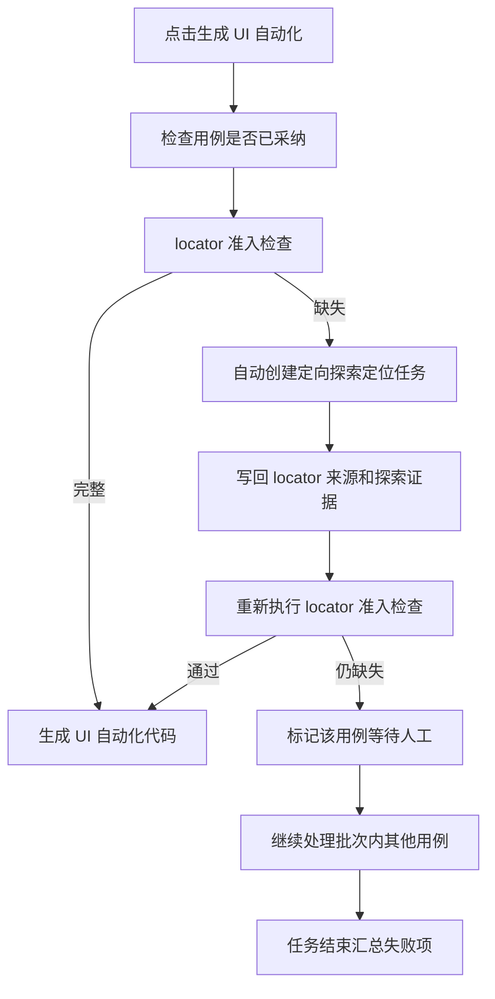
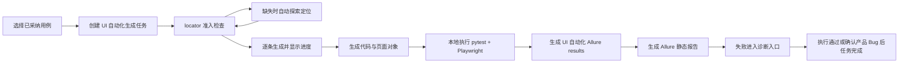

# 00-09 AI测试系统 - UI 自动化测试与 Allure 报告 PRD

## 1. 这份文档解决什么问题

本文细化第一期 UI 自动化测试代码生成、本地执行、Allure 报告归档和报告跳转。

核心规则：

- 第一版自动化只支持本地运行。
- 第一版只做 UI 自动化，技术栈为 pytest + Playwright + Allure。
- 接口自动化后续预留，技术栈为 pytest + requests + Allure；第一期只在导航中展示 Soon，不可选择、不可创建、不可执行。
- 自动化代码基于已采纳测试用例生成。
- UI 自动化生成支持两种入口：单条用例详情页点击“UI 自动化”，或在用例列表批量选择后批量生成。
- UI 自动化生成可以自动触发探索定位补充，但不能绕过 locator 准入，也不能凭空编造 locator。
- 批量 UI 自动化生成时，单条用例 locator 自动补齐失败不阻塞整个批次；系统继续处理其他可生成用例，最后汇总失败用例和缺失定位给人工处理。
- 报告执行详情使用 Allure。
- 系统自建报告中心只做业务视角汇总、运行记录、跳转和诊断入口，不重复实现 Allure 的步骤、截图、trace 展示能力。
- 第一版不连接 Git 仓库管理生成代码。
- 自动化代码是系统内可查看、可执行的产物，不提供 zip 下载，也不作为用户二次开发代码包外发。

---

## 2. 业务边界

### 2.1 本模块负责

- 从已采纳测试用例生成 pytest + Playwright UI 自动化代码。
- 生成页面对象、测试数据、断言、Allure 标注和运行配置。
- 在本地 Runner 执行自动化测试。
- 归档 Allure 原始结果和静态报告路径。
- 将运行结果回写到测试用例、项目、控制台和失败诊断。
- 跟踪每条用例的 UI 自动化生成进度、执行进度和结果状态。

### 2.2 本模块不负责

- 不负责需求分析。
- 不负责生成知识库。
- 不负责外部 CI/CD 调度。
- 不负责 Git 提交、分支、PR。
- 不负责外部缺陷系统对接。
- 不负责接口自动化用例生成、pytest + requests 代码生成和接口自动化执行。

---

## 3. 自动化类型边界

| 类型 | 第一期状态 | 技术栈 | 导航状态 | 说明 |
| --- | --- | --- | --- | --- |
| UI 自动化 | 可用 | pytest + Playwright + Allure | 可选择 | 生成、查看、执行、报告、失败诊断、自愈 |
| 接口自动化 | Soon | pytest + requests + Allure | 展示但不可选择 | 只预留入口、路由和数据模型扩展点 |

接口自动化预留要求：

- 项目导航中必须与 UI 自动化区分展示。
- 接口自动化菜单显示 `Soon` 标识。
- 点击接口自动化时，不进入编辑或执行页面，只展示“接口自动化暂未开放，后续支持 pytest + requests + Allure”。
- 后端接口如果收到 `automation_type = api` 的创建、生成或执行请求，第一期必须返回明确的未开放错误，而不是静默创建。
- UI 自动化代码目录由系统管理，支持页面内查看、覆盖生成和本地执行，不支持下载 zip。

---

## 4. UI 自动化生成输入

| 输入 | 说明 |
| --- | --- |
| 已采纳测试用例 | 自动化生成的主输入 |
| 项目知识库 | 提供业务规则、页面事实、状态流转 |
| 站点探索文档 | 提供页面结构、locator、真实操作路径 |
| 项目环境配置 | URL、登录方式、账号说明、storage state |
| 模型配置 | 测试代码生成使用 coding 能力强的模型 |

前置限制：

- 用例未采纳时不能生成正式自动化代码。
- 生成任务必须先完成 locator 准入检查；关键操作路径、断言目标和页面元素 locator 满足准入后，才允许生成正式可执行代码。
- 缺少 locator 时，系统应自动创建定向探索定位补充任务，由探索 Agent 针对缺失页面、步骤和元素补充定位来源。
- 自动探索成功后，必须将 locator、页面快照、截图、trace、操作路径或可访问名称等证据写回探索结果，并记录来源引用。
- 自动探索完成后，系统必须重新执行 locator 准入检查；通过后继续生成 UI 自动化代码。
- 单条用例自动探索失败时，该用例进入等待人工处理状态，展示失败原因和建议动作，例如等待登录、验证码、权限处理、页面不可达、元素歧义确认或禁止路径确认。
- 批量生成场景下，失败用例不应中断批次；任务继续处理其他已采纳且通过 locator 准入的用例，并在任务结束时输出失败用例清单、缺失 locator、失败原因、候选元素、来源证据和建议动作。
- 含待确认业务规则的用例生成代码前必须提示风险。
- 生成任务必须先完成用例评审通过检查，再允许创建 UI 自动化生成任务。

locator 准入规则：

- 页面入口、前置操作、关键输入控件、提交/确认按钮、结果断言目标必须存在稳定 locator 或可替代定位策略。
- 推荐优先级为 role/name、label、placeholder、test id、稳定文本、稳定 CSS 属性；不得优先使用易变化的绝对 XPath 或纯 nth-child。
- 每个自动生成 locator 必须能追溯到探索任务、探索页面、操作记录、截图、trace 或页面快照。
- 对于非关键辅助元素 locator 缺失，可以生成自动化草稿，但必须标记“需人工复核”，不能进入可执行基线。
- 如果关键 locator 缺失且自动探索无法补齐，不得生成可执行自动化代码。

自动探索定位流程：



---

## 5. UI 自动化代码产物

建议目录结构：

```text
automation/
  projects/
    <project_key>/
      ui/
        tests/
          test_login.py
        pages/
          login_page.py
        data/
          login_data.py
        conftest.py
        pytest.ini
        README.md
      api/
        README.md  # Soon，占位说明，不生成可执行代码
```

代码要求：

- 使用 pytest。
- 使用 Playwright。
- 使用 Page Object 或等价分层方式，避免所有逻辑堆在测试函数中。
- Allure 必须标注 feature、story、title、step。
- 失败时附加截图、trace 路径、预期和实际。
- 不把业务 Bug 兼容进断言。
- 不生成依赖远程 Git 的代码路径。
- 第一版不得生成 requests 接口自动化代码。
- 不提供代码 zip 下载或导出为二次开发包的能力。

---

## 6. UI 自动化本地执行

执行流程：



运行参数：

| 参数 | 说明 |
| --- | --- |
| 项目 | 运行所属项目 |
| 套件 | 选择用例集合 |
| 环境 | 本地、测试、预发等文本配置 |
| 浏览器 | chromium、firefox、webkit，第一版默认 chromium |
| headed | 是否有头运行 |
| 重试次数 | pytest 重试策略，第一版可选 |
| Allure 输出目录 | 系统生成并归档 |

---

## 7. Allure 打开方式

Allure 报告打开方式参考 Jenkins 集成 Allure 的体验：

- pytest 执行完成后生成 Allure results。
- 系统调用 Allure CLI 生成静态 Allure report。
- 报告中心保存 Allure results 路径、Allure report 路径和可访问入口。
- 用户在系统中点击 Allure 报告入口后，打开对应静态报告页面。
- 第一版不在系统页面内重写 Allure 的步骤、附件、趋势和详情展示。
- 如果报告未生成，提示用户重新生成报告。
- 如果报告路径不可访问，提示检查本地 Runner、Allure CLI 和报告目录配置。

---

## 8. Allure 与系统报告中心关系

| 能力 | Allure | 系统报告中心 |
| --- | --- | --- |
| 步骤详情 | 是 | 跳转 Allure |
| 截图/trace 附件 | 是 | 保存路径并跳转 |
| 用例执行趋势 | 可选 | 是 |
| 项目维度汇总 | 不作为主入口 | 是 |
| 失败诊断入口 | 否 | 是 |
| 与知识库/用例映射 | 否 | 是 |

设计结论：

- 第一版不自研完整自动化报告页面。
- Allure 负责 UI 自动化执行细节。接口自动化后续也复用 Allure，但第一期不生成接口自动化报告。
- 系统负责“项目、用例、知识库、失败诊断”之间的业务关联。

---

## 9. 失败记录

每个失败用例必须记录：

- 运行 ID。
- 用例 ID。
- 自动化脚本路径。
- 错误类型。
- 错误堆栈摘要。
- 截图路径。
- trace 路径。
- Allure 报告 URL 或本地路径。
- 初步分类：产品 Bug、代码问题、数据问题、环境问题、需求不清楚、未知。
- 是否已启用自愈。

失败后不自动改代码。用户在失败详情中点击“启用自愈”后，才进入失败诊断与自愈模块。

---

## 10. 页面设计

### 10.1 自动化导航

项目内“自动化”下分两个入口：

| 入口 | 路由 | 状态 | 行为 |
| --- | --- | --- | --- |
| UI 自动化 | `/projects/:projectId/automation/ui` | 可用 | 进入套件、代码、生成进度、执行、报告页面 |
| 接口自动化 | `/projects/:projectId/automation/api` | Soon，不可选择 | 展示占位说明，不允许创建和执行 |

### 10.2 UI 自动化套件页

展示：

- 套件名称、关联用例数、UI 自动化用例数、最近运行结果、通过率。
- locator 准入状态：已通过、自动探索中、等待人工、需复核。
- 缺失 locator 清单和关联用例。
- 操作：生成代码、查看代码、执行、查看运行记录、重新生成失败用例。
- 对缺失 locator 的用例，提供“自动探索定位”“查看探索证据”“人工补充说明”操作。

### 10.3 代码查看页

展示：

- 文件树。
- 代码预览。
- 来源用例。
- 来源知识库。
- 生成记录。

第一版只支持本地文件查看、覆盖生成和执行，不做 Git diff、提交、PR，也不提供 zip 下载。

### 10.4 运行记录页

展示：

- 运行状态、开始时间、结束时间、耗时、通过数、失败数、跳过数。
- 每条用例的生成进度、执行进度、当前步骤和失败原因。
- Allure 报告跳转。
- 失败诊断入口。

---

## 11. SQLite 存储策略

SQLite 保存：

- 自动化套件。
- 自动化类型，第一期只允许 `ui`，预留 `api`。
- 用例到脚本映射。
- 代码生成记录。
- 执行记录。
- Allure 结果路径。
- 失败摘要。

文件系统保存：

- 自动化代码。
- pytest 日志。
- Allure results。
- Allure report。
- 截图、trace、video。

---

## 12. 验收标准

- 能从已采纳测试用例生成 pytest + Playwright UI 自动化代码。
- UI 自动化代码能在本地 Runner 执行。
- 执行后能生成 UI 自动化 Allure 报告并在系统中跳转。
- 失败记录能关联到测试用例、脚本、Allure 报告和知识库来源。
- 自动化生成任务必须显示逐条用例进度。
- UI 自动化生成必须先执行 locator 准入检查。
- locator 缺失时，系统能自动触发定向探索定位，并在补齐后继续生成。
- 自动探索补充的 locator 必须记录来源引用，不能凭空生成。
- 关键 locator 自动探索失败时，单条用例必须进入等待人工处理，不能生成可执行代码。
- 批量生成时，单条用例等待人工不阻塞整批；系统必须继续生成其他可通过准入的用例，并在批次结束时汇总失败项供人工统一处理。
- 只有执行通过，或者失败后确认是产品 Bug 并完成诊断，自动化任务才算完成。
- 导航中 UI 自动化和接口自动化必须区分展示。
- 接口自动化显示 Soon，不可选择，不允许创建、生成、执行。
- 第一版不要求 Git 管理、CI 执行和外部缺陷系统对接。
- 自动化代码只能在系统内查看和执行，不提供 zip 下载。
