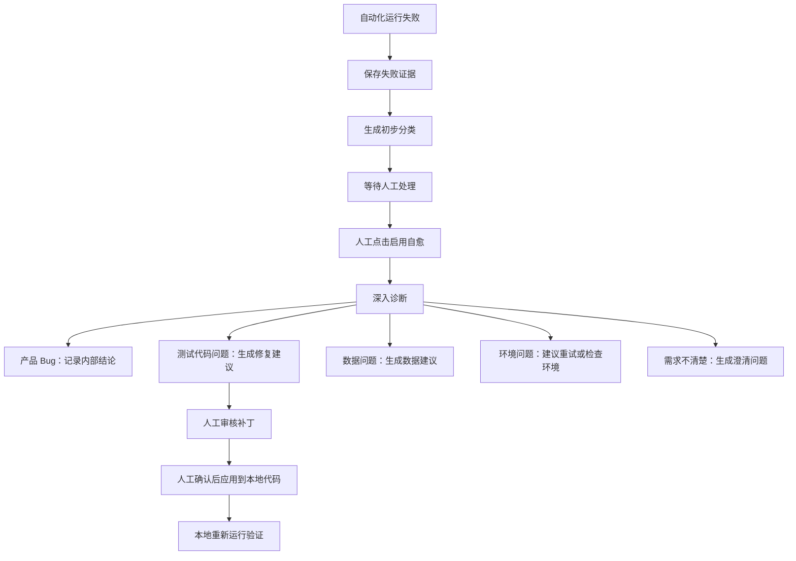

# 00-10 AI测试系统 - 失败诊断与自愈 PRD

## 1. 这份文档解决什么问题

本文细化自动化执行失败后的诊断、自愈触发、修复建议和人工确认流程。

核心规则：

- 自动化失败后不自动自愈。
- 用户必须对具体失败功能、失败用例或失败运行手动点击“启用自愈”。
- 自愈首先判断失败是产品 Bug、测试代码问题、测试数据问题、环境问题、需求不清楚还是未知。
- 只有明确属于测试代码、定位策略、等待策略或测试数据准备逻辑的问题，才允许生成修复建议。
- 失败诊断结果不写入项目知识库，也不作为知识库更新来源。
- 如果失败暴露出需求不清、页面事实不一致或 locator 变化，必须回到需求澄清、探索补充或定位来源更新流程。
- 第一版不自动应用补丁，不连接 Git，不创建外部缺陷。

---

## 2. 业务边界

### 2.1 本模块负责

- 展示失败证据。
- 由人工触发深入诊断。
- 分类失败原因。
- 对测试代码问题生成修复建议。
- 对产品 Bug 记录内部缺陷结论和证据。
- 对环境、数据、需求不清楚问题给出下一步动作。

### 2.2 本模块不负责

- 不负责自动化测试执行。
- 不负责直接修改生产系统。
- 不负责自动提交 Git。
- 不负责对接 Jira、禅道等缺陷系统。
- 不负责更新项目知识库。

---

## 3. 失败分类

| 分类 | 判断依据 | 允许动作 |
| --- | --- | --- |
| 产品 Bug | 页面行为与知识库、需求、断言预期不一致 | 记录内部 Bug 结论，不能自愈通过 |
| 测试代码问题 | locator 失效、等待条件错误、步骤实现偏离用例 | 生成修复建议 |
| 测试数据问题 | 前置数据缺失、重复、状态不满足 | 给出数据修复建议 |
| 环境问题 | 服务不可用、网络错误、登录失败、权限异常 | 标记环境失败，建议重试或检查环境 |
| 需求不清楚 | 知识库无法判断预期和实际谁正确 | 生成澄清问题，回到需求模块处理 |
| 未知 | 证据不足 | 保留证据，等待人工判断 |

失败诊断回流规则：

- 产品 Bug 只进入内部 Bug 记录，不进入知识库。
- 测试代码问题只生成修复建议和自愈补丁，不进入知识库。
- 测试数据问题和环境问题只保存在运行记录、报告中心和诊断详情中，不进入知识库。
- 需求不清楚时生成澄清问题，用户确认并写回需求文档新版本后，知识库才可通过正常更新流程读取该新版本。
- 页面事实或 locator 变化时，必须重新探索或补充探索文档，知识库只读取确认后的探索来源，不读取诊断结论。

---

## 4. 自愈触发流程

关键规则：

- 失败记录创建后，系统可以生成初步分类，但不能自动修改代码。
- “启用自愈”必须记录操作人、操作时间、触发范围。
- 同一次失败只能有一个当前自愈任务，避免并发修改同一代码。
- 自愈任务必须可取消。

---

## 5. 诊断证据

诊断必须读取：

- pytest 错误堆栈。
- Playwright trace。
- 截图。
- Allure steps。
- 失败用例。
- 关联知识库模块。
- 关联站点探索 locator。
- 最近一次代码生成记录。

禁止行为：

- 不能只根据错误文本直接改断言。
- 不能把产品返回错误文案兼容成通过。
- 不能跳过失败步骤。
- 不能删除断言让测试通过。

---

## 6. 修复建议

修复建议字段：

| 字段 | 说明 |
| --- | --- |
| 建议编号 | 项目内唯一 |
| 失败 ID | 关联失败记录 |
| 诊断分类 | 必须是测试代码问题才可生成代码补丁 |
| 修改文件 | 本地自动化代码路径 |
| 修改原因 | 为什么判断为代码问题 |
| diff | 修改前后差异 |
| 风险说明 | 可能影响哪些用例 |
| 验证命令 | 本地 pytest 命令 |
| 验证结果 | 待验证、通过、失败 |
| 审核状态 | 待审核、已应用、已拒绝、已废弃 |

允许修复范围：

- locator。
- 等待条件。
- 页面对象步骤。
- 测试数据准备。
- 清理逻辑。
- Allure 附件补充。

不允许修复范围：

- 业务预期。
- 需求规则。
- 产品代码。
- 跳过失败用例。
- 放宽断言。

---

## 7. 补丁应用、快照和回滚

自愈补丁即使经过人工确认，也只能修改系统生成或系统管理的自动化测试代码。应用补丁前必须创建快照，保证可以审计和回滚。

### 7.1 应用前快照

应用补丁前必须保存：

| 字段 | 说明 |
| --- | --- |
| 补丁 ID | 对应 SelfHealingRecord |
| 修改文件路径 | 所有将被修改的本地自动化代码文件 |
| 原文件 hash | 应用前文件内容 hash |
| 原文件快照路径 | 应用前完整文件备份路径 |
| patch 内容 | 结构化 diff 或 unified diff |
| patch_base_file_hash | 补丁生成时基于的文件 hash |
| 应用人 | 人工确认应用的用户 |
| 应用时间 | 系统记录 |
| 验证命令 | 应用后要执行的 pytest 命令 |

### 7.2 应用前校验

| 校验项 | 失败时处理 |
| --- | --- |
| 当前文件 hash 与 patch_base_file_hash 一致 | 阻止应用，提示代码已变化，需要重新生成补丁 |
| 修改路径位于允许写目录和自动化代码目录内 | 阻止应用，记录越权路径 |
| patch 不修改业务预期、需求规则、产品代码、跳过用例或放宽断言 | 阻止应用，标记高风险补丁 |
| 同一失败没有其他运行中的自愈任务 | 阻止应用，提示并发冲突 |
| 已成功创建原文件快照 | 阻止应用，不能在无快照情况下修改文件 |

### 7.3 回滚规则

- 验证失败不会自动回滚；系统必须提示用户选择保留补丁、回滚或重新生成补丁。
- 用户点击回滚时，系统使用应用前快照恢复文件，并再次计算 hash。
- 回滚必须记录回滚人、回滚时间、回滚原因、恢复文件和恢复结果。
- 如果回滚失败，SelfHealingRecord 状态必须标记为“回滚失败”或“人工介入”，并保留当前文件和快照路径。
- 已回滚补丁不能再次应用，只能基于当前文件重新生成新补丁版本。

---

## 8. 产品 Bug 内部记录

第一版不对接缺陷管理系统，但系统内部需要记录产品 Bug 诊断结论。

记录字段：

- Bug 编号。
- 项目。
- 关联运行。
- 关联用例。
- 关联知识库来源。
- 实际结果。
- 预期结果。
- 证据附件。
- 影响范围。
- 状态：待确认、已确认、非 Bug、已关闭。

---

## 9. 页面设计

### 9.1 失败列表

展示：

- 运行 ID、用例、失败摘要、初步分类、是否启用自愈、处理状态。
- 筛选：项目、模块、分类、处理状态、时间。

### 9.2 失败详情

展示：

- 错误堆栈摘要。
- Allure 跳转。
- 截图和 trace 路径。
- 关联用例和知识库。
- 操作：启用自愈、标记产品 Bug、标记环境问题、生成澄清问题。

### 9.3 自愈任务详情

展示：

- 诊断过程。
- 分类结论。
- 修复建议。
- diff。
- 应用前快照和文件 hash。
- 验证命令和结果。
- 操作：应用补丁、拒绝、重新诊断、回滚补丁。

---

## 10. SQLite 存储策略

SQLite 保存：

- 失败记录。
- 诊断任务。
- 诊断证据索引。
- 自愈任务。
- 修复建议和审核状态。
- 补丁应用记录、文件 hash、快照索引和回滚记录。
- 内部 Bug 记录。

文件系统保存：

- trace、截图、video。
- pytest 日志。
- diff 文件。
- 应用前文件快照。
- 验证运行日志。

---

## 11. 验收标准

- 自动化失败后不会自动修改代码。
- 用户能对具体失败手动启用自愈。
- 自愈前必须给出失败分类和证据。
- 产品 Bug 不能通过自愈改成通过。
- 测试代码问题能生成可审核 diff。
- 应用补丁前必须人工确认。
- 应用补丁前必须保存原文件 hash 和快照。
- 当前文件 hash 与补丁基线不一致时必须阻止应用。
- 用户能对已应用补丁执行回滚，且回滚记录可追溯。
- 第一版不要求 Git 提交和外部缺陷系统对接。
