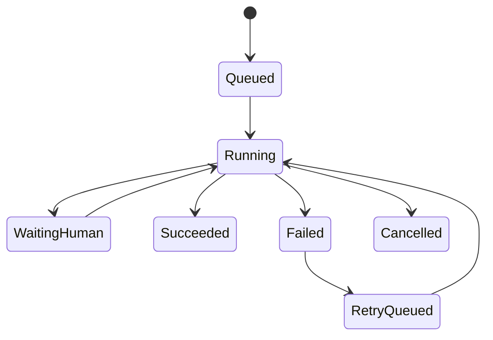

# 00-11 AI测试系统 - 模型配置与 Agent Runtime PRD

## 1. 这份文档解决什么问题

本文细化模型配置、Agent 编排、Skill 接入和任务运行时。

核心规则：

- 管理员统一配置模型。
- 系统支持配置多个 Provider、Base URL、API Key 和模型名。
- 不内置默认模型，所有 Agent 都必须显式选择模型或继承项目/任务级策略。
- 不同 Agent 可以选择不同模型。
- 测试代码生成和自愈建议优先使用 coding 能力强的模型。
- Agent 框架优先使用 OpenAI Agents SDK。
- 第一版采用“统一 Agent Runtime + 模块专用 Agent + Skill”的组合架构。
- Agent Runtime 负责通用编排、模型调用、权限、审计、任务状态和人工确认点。
- 模块专用 Agent 负责具体业务目标，例如需求评审、站点探索、用例生成、代码生成、失败诊断。
- Skill 作为可复用能力边界，接入需求分析、站点探索、Playwright CLI、知识库生成、测试用例生成、代码生成和自愈诊断。

---

## 2. 业务边界

### 2.1 本模块负责

- 配置模型 Provider。
- 配置模型用途。
- 管理 Agent 类型。
- 管理 Skill 能力开关。
- 记录 Agent 任务输入、输出、状态和日志。
- 控制任务超时、重试、人工确认点。

### 2.2 本模块不负责

- 不负责具体业务文档内容。
- 不负责直接执行浏览器动作，浏览器动作由 Playwright CLI 或相关 Skill 执行。
- 不负责存储大文件产物，只保存引用路径。

---

## 3. 模型配置

### 3.1 ModelProvider

| 字段 | 说明 |
| --- | --- |
| Provider 名称 | OpenAI、兼容 OpenAI API 的服务、本地模型服务 |
| Base URL | API 地址 |
| API Key | 加密存储 |
| 模型名 | 一个 Provider 可配置多个模型名 |
| 状态 | 启用、禁用 |
| 创建人 | 管理员 |

### 3.2 ModelProfile

| 用途 | 推荐模型特征 |
| --- | --- |
| 需求分析 | 长上下文、结构化输出稳定 |
| 站点探索总结 | 多模态或强页面理解能力 |
| 知识库生成 | 长文档组织、来源追踪稳定 |
| 测试用例生成 | 业务理解和覆盖思维强 |
| UI 自动化代码生成 | coding 能力强、Python/pytest/Playwright 能力强 |
| 接口自动化代码生成 | 预留，后续需要 Python/pytest/requests/Allure 能力；第一期不启用 |
| 失败诊断 | 代码理解、日志分析、严谨分类 |
| 自愈建议 | coding 能力强、保守修复、不放宽断言 |

### 3.3 多模型配置规则

- 一个 Provider 可以绑定多个模型。
- 一个 Agent Profile 可以指定一个首选模型和一个备选模型列表。
- 任务创建时如果没有显式选择模型，系统按项目默认策略、任务类型和 Agent Profile 依次回退。
- 不同 Agent 可以使用不同模型，不要求全局统一。
- 第一版不内置默认模型；至少需要管理员手工配置可用模型后系统才能发起 AI 任务。
- 验证码补充登录可以通过 Playwright CLI 流程配合模型识别或人工输入完成，不要求单独人工 OCR 服务。

---

## 4. Agent 类型

### 4.1 架构选择

不建议第一版只做一个“通用智能体”。原因是需求评审、站点探索、用例生成、代码生成和失败诊断的输入、输出、风险边界和人工确认点完全不同，如果全部塞进一个通用 Agent，会导致提示词复杂、输出不稳定、权限不好控、审计困难。

也不建议每个模块都实现一套独立运行时。运行时能力如模型调用、Skill 调度、任务状态、日志、trace、权限、安全策略和人工确认点应该复用，否则后续维护成本高。

第一版采用：

```text
统一 Agent Runtime
  -> 模块专用 Agent
      -> 一个或多个 Skill
          -> 工具、模型、文件、浏览器、代码生成
```

职责边界：

| 层级 | 职责 | 不负责 |
| --- | --- | --- |
| Agent Runtime | 任务编排、模型选择、Skill 调用、日志、审计、权限、人工确认点 | 不写具体业务规则 |
| 模块专用 Agent | 明确业务目标、输入输出 Schema、调用哪些 Skill、生成结构化结果 | 不直接绕过后端修改业务状态 |
| Skill | 封装稳定能力，如 Playwright 探索、需求覆盖分析、llm-wiki 生成、pytest 代码生成 | 不决定最终业务状态 |
| 后端领域服务 | 校验、落库、版本化、状态流转、权限控制 | 不直接生成大段 AI 内容 |

### 4.2 Agent 清单

| Agent | 职责 | 主要输入 | 主要输出 |
| --- | --- | --- | --- |
| 文档转换 Agent | 将 Word/PDF 转换为 Markdown 工作稿，并进行转换质量检查 | 原始 Word/PDF 文件 | Markdown 工作稿、转换质量报告、无法识别项 |
| 需求分析 Agent | 分析文档、生成原文覆盖矩阵、模块树和初始疑点 | 需求文档版本 | 分析结果、原文覆盖矩阵、模块清单 |
| 需求评审 Agent | 按模块检查完整性、可测试性、边界、异常、权限、状态流转和风险 | 需求分析结果、原文覆盖矩阵、探索补充 | 模块评审建议、澄清表单、风险项 |
| 文档对话修改 Agent | 根据用户自然语言要求生成需求文档或探索文档的 Markdown diff | 文档版本、用户指令、来源引用 | 修改建议、diff、影响范围 |
| 澄清写回 Agent | 将用户回答转换为 Markdown 变更建议 | 澄清表单、用户回答、需求文档版本 | 写回 diff、变更摘要 |
| 候选需求 Agent | 没有需求文档时，从探索文档反推候选需求文档 | 探索文档、页面事实 | 候选需求文档、待确认问题 |
| 站点探索 Agent | 登录站点并遍历页面 | 站点配置、登录态 | 探索文档、locator、截图 |
| 知识库 Agent | 生成或更新 llm-wiki 知识库 | 已确认来源材料 | 模块化 Markdown |
| 用例生成 Agent | 生成测试用例和覆盖矩阵 | 项目知识库 | 测试用例草稿 |
| 代码生成 Agent | 第一期生成 pytest + Playwright UI 自动化代码；后续预留 pytest + requests 接口自动化 | 已采纳用例、探索 locator | UI 自动化代码 |
| 诊断 Agent | 判断失败原因 | 失败证据、知识库、代码 | 失败分类 |
| 自愈 Agent | 生成保守修复建议 | 诊断结论、代码 | diff、验证命令 |

### 4.3 Agent 与 Skill 的关系

| Agent | 可调用 Skill |
| --- | --- |
| 文档转换 Agent | docx-to-markdown skill、PDF 解析 skill、转换质量检查 skill |
| 需求分析 Agent | 需求分析 skill、原文覆盖矩阵 skill、文档结构解析 skill |
| 需求评审 Agent | 需求评审 skill、澄清问题生成 skill、测试策略评审 skill |
| 文档对话修改 Agent | Markdown diff skill、来源引用检查 skill、影响范围分析 skill |
| 澄清写回 Agent | 澄清写回 skill、Markdown diff skill |
| 候选需求 Agent | 探索文档理解 skill、候选需求生成 skill |
| 站点探索 Agent | `playwright-cli`、探索 skill、验证码识别 skill |
| 知识库 Agent | llm-wiki 生成 skill、来源融合 skill、冲突识别 skill |
| 用例生成 Agent | 测试用例生成 skill、覆盖矩阵 skill |
| 代码生成 Agent | UI 自动化代码生成 skill、Playwright 最佳实践 skill |
| 诊断 Agent | 失败分类 skill、日志分析 skill、Allure 结果分析 skill |
| 自愈 Agent | 自愈诊断 skill、代码补丁生成 skill、验证计划 skill |

规则：

- Agent 决定“做什么”和“产出什么结构”。
- Skill 决定“怎么做某类稳定能力”。
- 后端领域服务决定“是否接受结果并改变业务状态”。
- 一个 Agent 可以调用多个 Skill，一个 Skill 可以被多个 Agent 复用。
- 高风险动作必须由后端创建人工确认任务，Agent 不能自行落库为最终状态。

---

## 5. Skill 接入

第一版建议接入：

| Skill | 用途 |
| --- | --- |
| `playwright-cli` | 浏览器探索、截图、trace、登录态保存 |
| 探索 skill | 标准化站点探索流程和探索文档格式 |
| 需求分析 skill | 标准化需求拆解、疑点识别、澄清问题 |
| 知识库 skill | 标准化 llm-wiki 目录和模块文档生成 |
| 测试用例 skill | 标准化用例结构、覆盖矩阵和评审字段 |
| UI 自动化代码生成 skill | 标准化 pytest + Playwright 代码结构 |
| 接口自动化代码生成 skill | Soon，后续标准化 pytest + requests + Allure 代码结构，第一期不启用 |
| 自愈诊断 skill | 标准化失败分类和补丁边界 |

规则：

- Skill 输出必须结构化，不能只返回自然语言大段文本。
- 关键任务输出必须记录 prompt、模型、输入来源、输出文件和状态。
- 高风险任务必须有人工作业点，例如知识库确认、用例采纳、自愈应用。

---

## 6. Agent 任务状态



状态说明：

| 状态 | 说明 |
| --- | --- |
| 排队中 | 等待执行 |
| 运行中 | Agent 正在处理 |
| 等待人工 | 等待验证码、澄清、确认、审核 |
| 成功 | 已生成目标产物 |
| 失败 | 执行失败并有错误原因 |
| 已取消 | 用户取消 |
| 待重试 | 用户或系统准备重试 |

---

## 7. 安全与审计

- API Key 必须加密存储。
- 访客不能查看密钥明文或修改模型配置。
- 测试工程师不能修改全局模型配置。
- Agent 任务必须记录操作人。
- 自动化自愈应用、知识库覆盖更新等高风险动作必须记录确认人。
- 日志不得输出密码、API Key、验证码明文长期留存内容。
- Agent 的验证码识别、探索总结和写回建议可以通过配置的模型或工具链完成，不要求单独人工 OCR 服务。

---

## 8. SQLite 存储策略

SQLite 保存：

- Provider 配置。
- 模型用途配置。
- Agent 任务。
- Agent 日志摘要。
- Skill 调用记录。
- 输入输出引用关系。

文件系统保存：

- Agent 输出 Markdown。
- 长日志。
- 浏览器截图、trace。
- 自动化代码和 diff。

---

## 9. 验收标准

- 管理员能配置模型 Provider 和不同用途模型。
- 测试代码生成能单独选择 coding 能力强的模型。
- Agent 任务有状态、输入、输出和日志记录。
- Skill 调用结果可追踪到具体任务。
- 高风险动作有人工确认点。
- 访客不能修改任何模型或 Agent 配置。
