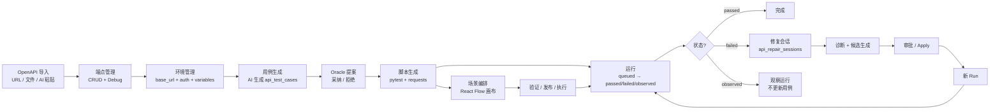

# 00-16 AI测试系统 - 接口自动化 PRD

> **文件名说明**：文件名含"预留"为历史遗留；正文内容为 2026-07-26 已实现的接口自动化功能，本次不对文件名作重命名。
>
> **实现基线**：`apps/backend/app/api/v1/api_automation.py`、`apps/backend/app/services/api_automation/{service.py,self_healing.py,runner.py}`、`apps/backend/app/repositories/api_automation_repo.py`、`apps/backend/app/schemas/api_automation.py`、`apps/frontend/src/app/(main)/automation/api/page.tsx`、`apps/frontend/src/app/(main)/projects/[projectId]/automation/api/page.tsx`、`apps/frontend/src/lib/api-client.ts:1724-2105`、`apps/backend/app/seed/schema.py`
>
> **更新日期**：2026-07-26

---

## 1. 范围与目标

### 1.1 适用范围

接口自动化模块通过导入 OpenAPI/Swagger 文档，管理系统级 API 端点与环境，AI 生成接口测试用例与断言，基于 pytest + requests 生成可执行脚本，支持场景编排与失败自愈，覆盖 HTTP REST 接口的完整测试生命周期。

### 1.2 核心目标

- **导入**：支持 OpenAPI 文档 URL 导入、文件导入、AI 粘贴解析三种模式；
- **管理**：按 method/path/tag 检索 API 端点，分组展示，支持 Debug 调试验证；
- **环境**：统一管理 base_url、鉴权方式（三选一：无需鉴权/账号密码/塞伯坦智能体）、Headers、变量；
- **用例生成**：按端点或测试目标驱动 AI 生成测试用例（`api_test_cases`），支持重试与 partial_success 状态；
- **Oracle 断言**：AI 基于实际运行结果生成断言提案（`api_oracle_proposals`），支持人工采纳/拒绝；
- **脚本生成**：将用例编译为 pytest + requests 脚本（`api_test_scripts`）；
- **运行**：在沙盒中执行 pytest，产出报告、日志、场景级结果；
- **场景编排**：基于 React Flow 的画布编辑器编排 API 调用链（`api_scenarios` / `api_scenario_steps` / `api_scenario_revisions` / `api_scenario_ai_plans`）；
- **自愈**：运行失败时自动发起诊断 + 修复会话（`api_repair_sessions` / `api_repair_attempts`），状态机驱动审批流程。

### 1.3 本模块不覆盖

- UI 自动化（00-09）；性能测试（00-17）；报告中心聚合（00-13）。
- 测试用例集（`test_case_sets`）与通用测试用例（`test_cases`）的跨链路联动。

---

## 2. 角色与权限矩阵

| 操作 | 管理员（require_admin） | 普通用户（current_user） |
| --- | --- | --- |
| OpenAPI 文档导入 | ✅ 创建 | ❌ |
| 端点 CRUD | ✅ PATCH / DELETE | GET / POST |
| 环境 CRUD | ✅ | GET |
| 用例生成 | ✅ 创建 | GET |
| 用例 / Oracle 提案评审 | ✅ 采纳 / 拒绝 | GET |
| 脚本生成 | ✅ | GET |
| 脚本 CRUD | ✅ PATCH / DELETE | GET |
| 运行触发 | ✅ | ❌ |
| 运行查看 | ✅ | ✅ |
| 修复会话 / Attempt | ✅ 全部操作 | GET |
| 场景 CRUD | ✅ | GET / POST（部分） |
| 场景执行 | ✅ | ❌ |
| AI Plan 提交 / 应用 | ✅ | ❌ |

---

## 3. 接口文档导入

### 3.1 三种导入模式

| 模式 | `source_type` | 说明 |
| --- | --- | --- |
| 文件导入 | `file` | 上传本地 OpenAPI/Swagger JSON 或 YAML 文件 |
| URL 导入 | `url` | 指定 URL，`service.import_openapi_url` 异步抓取并解析 |
| AI 导入（粘贴） | `raw`（等价处理） | 直接粘贴 OpenAPI JSON/YAML 文本内容，由 `service.import_openapi_text` 解析 |

### 3.2 导入流程

1. 前端选择导入模式，填写内容（文件 / URL / 文本）；
2. `POST /api-documents/import`，body：`OpenAPIImportIn（source_type, url?, content?, name?）`；
3. 后端按 `source_type` 分发至 `import_openapi_url` 或 `import_openapi_text`；
4. 解析成功：写入 `api_documents`（`status=parsed`）与 `api_endpoints` 行；解析失败：`status=failed`，返回 `422 OPENAPI_INVALID`；
5. `ApiDocumentOut` 返回文档 ID、名称、source_type、endpoint_count。

> **入口路由**：`apps/frontend/src/app/(main)/projects/[projectId]/automation/api/page.tsx` Tab 1（接口资产）。

---

## 4. 接口端点管理

### 4.1 端点列表与检索

- `GET /api-endpoints?method=&tag=&search=`：按 HTTP 方法、所属 tag、path/summary/description 全文搜索过滤；
- `api_endpoints` 表 `tags_json` 字段支持同一端点归入多个 tag；
- 端点按 path ASC → method ASC 排序返回。

### 4.2 端点 CRUD

| 操作 | 路由 | 鉴权 |
| --- | --- | --- |
| 列表 | GET /api-endpoints | current_user |
| 创建 | POST /api-endpoints | require_admin |
| 详情 | GET /api-endpoints/{id} | current_user |
| 更新 | PATCH /api-endpoints/{id} | require_admin |
| 删除 | DELETE /api-endpoints/{id} | require_admin |

### 4.3 Debug 调试

- `POST /api-endpoints/{id}/debug`；
- 支持 `application/json` 和 `multipart/form-data` 两种请求体格式；
- `multipart/form-data` 场景：`payload` 字段传 JSON 序列化字符串，文件字段以 `file::<field_name>` 为 key 上传；
- `parse_api_endpoint_debug_form` 自动关闭所有临时文件；
- 返回 `ApiEndpointDebugOut`：request / status_code / elapsed_ms / headers / body_text / body_json。

---

## 5. 接口测试环境

### 5.1 环境定义

`api_test_environments` 表字段：

| 字段 | 类型 | 说明 |
| --- | --- | --- |
| `api_base_url` | string | 测试环境 base URL |
| `auth_type` | enum | `none` / `account_password` / `cybertron_agent`（三选一，互斥） |
| `username` / `password_encrypted` | string | 账号密码模式 |
| `auth_config_json` | object | 塞伯坦智能体模式（cybertron_robot_key / token / username） |
| `variables_json` | object | 环境变量，运行时注入 |
| `default_headers_json` | object | 默认请求头 |
| `timeout_seconds` | int | 默认 30s，范围 1~600s |
| `verify_ssl` | bool | SSL 验证开关，默认 true |
| `auth_state_ttl_seconds` | int | 认证状态 TTL，默认 86400s |
| `linked_ui_environment_id` | string? | 可关联 UI 测试环境 |

### 5.2 环境 CRUD

| 操作 | 路由 | 鉴权 |
| --- | --- | --- |
| 列表 | GET /api-environments | current_user |
| 创建 | POST /api-environments | require_admin |
| 更新 | PATCH /api-environments/{id} | require_admin |
| 删除 | DELETE /api-environments/{id} | require_admin |

---

## 6. 测试用例生成

### 6.1 生成触发

- `POST /api-test-cases/generate`，body `ApiAutomationGenerateIn`：
  - `endpoint_ids`：指定端点列表（最多 100 个）；
  - `api_environment_id`：关联运行环境；
  - `generation_goal`：生成目标描述（可选）；
  - `force`：是否强制覆盖已有用例。

### 6.2 生成粒度

- 后端创建 `api_generation_runs` 主记录（status=queued），每个 endpoint 对应一条 `api_generation_items`；
- 每个 item 可有多次 attempt（`api_generation_item_attempts`），`attempt_count` 累计；
- 状态机：`queued → running → {completed | partial_success | failed}`；
- 失败项可重试：`POST /api-automation/generation-runs/{run_id}/retry-failed`。

### 6.3 用例表 `api_test_cases` 关键字段

- `title` / `test_point_key`：用例标题与测试点标识；
- `oracle_status`：枚举 `confirmed`（已确认）/ `inferred`（AI 推断）/ `needs_confirmation`（需人工确认）；
- `assertions_json`：断言列表；
- `preconditions_json` / `request_json` / `test_data_json` / `expected_json` / `variables_json` / `data_origin_json`：完整用例结构；
- `source`：枚举 `ai_generated` / `manual` / `approved_test_case`；
- 版本历史：`api_test_case_versions` 表记录每次变更快照（含 `change_source` 字段）。

### 6.4 用例集

- `GET /api-case-sets`：列表；`POST /api-case-sets` 创建；`PATCH /api-case-sets/{id}` 更新；
- 用例集（`api_test_case_sets`）不直接包含用例，仅作为分组标签存在。

---

## 7. 测试用例评审

### 7.1 Oracle 断言提案

运行后用例实际响应与期望不一致时，AI 可提出断言修正提案：

- `POST /api-test-cases/{case_id}/oracle-proposals`：基于指定 run_id 的实际响应创建提案；
- `api_oracle_proposals` 表：proposal_id / endpoint_id / case_id / run_id / test_point_key / current_snapshot / proposed_snapshot / reasoning / confidence / status（pending / approved / rejected / superseded）；
- `confidence`：0~1，AI 对提案的置信度。

### 7.2 提案评审

| 操作 | 路由 | 说明 |
| --- | --- | --- |
| 列表 | GET /oracle-proposals?status= | 支持按状态过滤 |
| 采纳 | POST /oracle-proposals/{id}/approve | body 含 scope（case_only / case_and_endpoint_asset）/ review_comment / assertions |
| 拒绝 | POST /oracle-proposals/{id}/reject | body 含 review_comment |

采纳后：更新 `api_test_cases.assertions` 与 `oracle_status=confirmed`，同步更新 `api_endpoint_oracle_facts`。

---

## 8. 脚本生成

### 8.1 生成流程

1. `POST /api-automation/scripts/generate`，body：`ApiScriptGenerateIn（endpoint_ids, api_environment_id, force）`；
2. 创建 `api_script_generation_runs` 行（status=queued），BackgroundTasks 调度 `execute_script_generation_run`；
3. AI 基于端点信息与关联用例生成 pytest + requests 脚本；
4. 脚本写入 `api_test_scripts`（content / notes）与套件目录（`cases.yaml` / `conftest.py` / `test_*.py`）。

### 8.2 脚本表 `api_test_scripts`

- `status`：枚举 `draft` / `ready` / `needs_input` / `failed`；
- `language=python` / `framework=pytest_requests`；
- `source_hash`：用于 force 覆盖判断；
- `last_run_status`：最近一次运行结果。

### 8.3 脚本管理

| 操作 | 路由 | 鉴权 |
| --- | --- | --- |
| 列表 | GET /api-scripts | current_user |
| 详情 | GET /api-scripts/{id} | current_user |
| 更新内容 | PATCH /api-scripts/{id} | require_admin |
| 删除 | DELETE /api-scripts/{id} | require_admin |
| 生成运行详情 | GET /api-automation/scripts/generation-runs/{run_id} | current_user |

---

## 9. 场景编排

### 9.1 数据模型

| 表 | 用途 |
| --- | --- |
| `api_scenarios` | 场景元数据（name / description / status=draft\|ready\|archived / variables / revision） |
| `api_scenario_steps` | 单步定义（step_type / endpoint_id / request_overrides / bindings / extractors / assertions / on_failure / enabled） |
| `api_scenario_revisions` | 发布快照（snapshot_json / published_hash），支持 rollback |
| `api_scenario_ai_plans` | AI 编排计划（goal / plan_json / validation / status=preview\|applied\|discarded\|expired / expected_revision） |

### 9.2 场景 Step 类型

`step_type` 枚举：`api_request` / `condition` / `wait` / `poll` / `assign`。

每步可配置：
- `request_overrides`：请求参数覆盖；
- `bindings`：变量绑定（将上一步响应字段绑定为后续请求参数）；
- `extractors`：变量提取（从响应中提取值）；
- `assertions`：单步断言；
- `on_failure`：失败策略 `stop` / `continue` / `always_run`。

### 9.3 场景 CRUD 与操作

| 操作 | 路由 | 鉴权 |
| --- | --- | --- |
| 列表 | GET /api-scenarios | current_user |
| 创建 | POST /api-scenarios | require_admin |
| 详情 | GET /api-scenarios/{id} | current_user |
| 更新 | PATCH /api-scenarios/{id} | require_admin |
| 删除 | DELETE /api-scenarios/{id} | require_admin |
| 新增单步 | POST /api-scenarios/{id}/steps | require_admin |
| 批量替换步骤 | PUT /api-scenarios/{id}/steps | require_admin |
| 验证 | POST /api-scenarios/{id}/validate | current_user |
| 发布 | POST /api-scenarios/{id}/publish?confirm_asset_changes=true | require_admin |
| 版本历史 | GET /api-scenarios/{id}/revisions | current_user |
| 恢复旧版 | POST /api-scenarios/{id}/revisions/{revision}/restore | require_admin |
| 执行 | POST /api-scenarios/{id}/execute（body: api_environment_id / source=published\|draft） | require_admin |

### 9.4 AI Plan

- `POST /api-scenarios/ai-plan`：提交 goal（目标描述）+ source_scope（endpoint_ids / tags）+ constraints（max_steps / allow_write / require_cleanup），返回 `plan_id` + `expected_revision`；
- `POST /api-scenarios/ai-plans/{plan_id}/apply`：需提供 `expected_revision` 与 `confirmation` 短语，避免误覆盖；apply 后场景 steps 由 plan 落地。

### 9.5 React Flow 编辑器

前端 `apps/frontend/src/app/(main)/projects/[projectId]/automation/api/scenarios/` 为场景编辑器路由，使用 React Flow 渲染步骤节点与连线（`packages.json` 确认依赖）。

---

## 10. 脚本执行与运行记录

### 10.1 运行触发

- `POST /api-runs`，body `ApiRunCreateIn（script_ids, api_environment_id?）`；
- `target_type=scripts`：按脚本执行（默认）；`target_type=scenario`：场景执行。

### 10.2 运行状态

| 状态 | 说明 |
| --- | --- |
| `queued` | 已创建，等待调度 |
| `running` | 执行中 |
| `passed` | 全部用例通过 |
| `failed` | 存在失败用例 |
| `observed` | 观察运行（不更新 case 数据） |
| `cancelled` | 用户取消 |
| `interrupted` | 进程中断 |

### 10.3 运行产物

- `stdout.txt` / `stderr.txt`：pytest 输出；
- `report.json`：pytest-json-report 报告；
- `scenario-result.json`：场景级步骤结果；
- `observations.json`：观察运行产物。

产物目录：`apps/backend/data/projects/<project_id>/api_automation/runs/<run_id>/`。

### 10.4 运行路由

| 操作 | 路由 | 说明 |
| --- | --- | --- |
| 触发 | POST /api-runs | admin，bg |
| 列表 | GET /api-runs（page / page_size / status / environment_id / keyword） | 分页过滤 |
| 详情 | GET /api-runs/{id} | |
| 删除 | DELETE /api-runs/{id} | admin |
| 日志 | GET /api-runs/{id}/logs | |
| pytest 报告 | GET /api-runs/{id}/report | |
| 场景结果 | GET /api-runs/{id}/scenario-result | |

### 10.5 重启恢复

`recover_interrupted_api_automation_tasks` 在进程启动时将所有 `pending/running` 状态任务收敛为 `failed`，防止僵尸任务残留。

---

## 11. 失败自愈

### 11.1 触发条件

仅当运行状态为 `failed` 或 `observed`，且 `target_type=scripts` 时可发起修复会话。

### 11.2 数据模型

**`api_repair_sessions`**：会话元数据（source_run_id / current_run_id / status=active|passed|closed|failed / current_revision）。

**`api_repair_attempts`**：修复轮次（attempt_number / base_run_id / base_revision / status / diagnosis_json / validation_json / decision / applied_run_id）。

### 11.3 Attempt 状态机

```
queued → collecting_context → diagnosing
  → waiting_approval（需人工审批脚本修改）
  → candidate_generating → candidate_validating → ready_to_apply
  → completed（apply 成功后）
  → proposal_rejected / rejected / failed / superseded
```

- `waiting_approval`：AI 建议可修改脚本，需管理员审批后才生成候选；
- `ready_to_apply`：候选修复已通过验证，可 apply / discard；
- `superseded`：正式测试项目在修复过程中发生变化，该 attempt 失效。

### 11.4 修复操作

| 操作 | 路由 | 说明 |
| --- | --- | --- |
| 发起会话 | POST /api-runs/{id}/repair-session | 仅 failed/observed 状态，admin |
| 会话详情 | GET /api-repair-sessions/{id} | 含 attempts 列表 |
| 新增 attempt | POST /api-repair-sessions/{id}/attempts | 触发重新分析 |
| Attempt 详情 | GET /api-repair-attempts/{id} | 含 diagnosis / validation |
| Diff | GET /api-repair-attempts/{id}/diff | |
| 日志 | GET /api-repair-attempts/{id}/logs | |
| 报告 | GET /api-repair-attempts/{id}/report | |
| 审批（脚本修改） | POST /api-repair-attempts/{id}/approve | admin，触发候选生成 |
| 应用 | POST /api-repair-attempts/{id}/apply | admin，应用修复，产生新 run |
| 放弃候选 | POST /api-repair-attempts/{id}/discard | admin |
| 拒绝 | POST /api-repair-attempts/{id}/reject | admin |
| 回滚 | POST /api-repair-sessions/{id}/rollback | admin，指定 revision 回退 |

apply 成功后：
- `api_repair_attempts.applied_run_id` 写入新 run_id；
- `api_repair_session.current_revision` 自增；
- 通过 `_load_case_updates` 同步用例版本历史（`api_test_case_versions`）。

---

## 12. 数据模型（19 张表）

| # | 表名 | 主键 | 关键字段 | 主要外键 |
| --- | --- | --- | --- | --- |
| 1 | `api_documents` | id | source_type / name / version / status / endpoint_count | project_id |
| 2 | `api_endpoints` | id | method / path / normalized_path / tags_json / parameters_json / responses_json | project_id / document_id |
| 3 | `api_test_environments` | id | api_base_url / auth_type / variables_json / default_headers_json / timeout_seconds / verify_ssl | project_id / linked_ui_environment_id |
| 4 | `api_generation_runs` | id | status / generation_goal / result_summary_json | project_id / api_environment_id |
| 5 | `api_generation_items` | id | status / attempt_count / generated_case_count | generation_run_id / endpoint_id |
| 6 | `api_generation_item_attempts` | id | attempt_no / status / generated_case_count / error_message | generation_item_id |
| 7 | `api_test_case_sets` | id | name / status / case_count | project_id / latest_generation_run_id |
| 8 | `api_test_cases` | id | title / test_point_key / oracle_status / priority / coverage / assertions_json | project_id / endpoint_id / generation_run_id / generation_item_id / generation_attempt_id |
| 9 | `api_test_case_versions` | id | case_id / version / snapshot_json / change_source | case_id |
| 10 | `api_endpoint_oracle_facts` | id | endpoint_id / test_point_key / assertions_json / evidence_run_ids_json | endpoint_id |
| 11 | `api_oracle_proposals` | id | endpoint_id / case_id / run_id / status / confidence / reasoning | project_id / endpoint_id / case_id / run_id |
| 12 | `api_test_scripts` | id | name / status / suite_path / test_file_path / source_hash / case_count / last_run_status | project_id / endpoint_id / api_test_case_id / generation_run_id |
| 13 | `api_automation_runs` | id | task_id / status / target_type / execution_snapshot_json / summary_json / json_report_path | project_id / api_environment_id |
| 14 | `api_repair_sessions` | id | source_run_id / current_run_id / status / current_revision | project_id / source_run_id / current_run_id |
| 15 | `api_repair_attempts` | id | session_id / attempt_number / base_run_id / base_revision / status / diagnosis_json / validation_json / applied_run_id | session_id / base_run_id / applied_run_id |
| 16 | `api_scenarios` | id | name / description / status / variables_json / revision | project_id |
| 17 | `api_scenario_steps` | id | scenario_id / step_type / endpoint_id / request_overrides_json / bindings_json / extractors_json / assertions_json / on_failure / enabled | scenario_id / project_id / endpoint_id / api_test_case_id |
| 18 | `api_scenario_revisions` | id | scenario_id / revision / snapshot_json / published_hash | scenario_id / project_id |
| 19 | `api_scenario_ai_plans` | id | scenario_id / goal / plan_json / status / expected_revision / confirmation | project_id / scenario_id |

> **说明**：`api_script_generation_runs` 表用于脚本生成运行管理，未列入上表但属于本模块范畴。

---

## 13. API 路由清单

### 13.1 OpenAPI 文档

| 方法 | 路径 | 鉴权 | 背景任务 |
| --- | --- | --- | --- |
| POST | `/api-documents/import` | require_admin | |

### 13.2 端点

| 方法 | 路径 | 鉴权 |
| --- | --- | --- |
| GET | `/api-endpoints` | current_user |
| POST | `/api-endpoints` | require_admin |
| GET | `/api-endpoints/{endpoint_id}` | current_user |
| PATCH | `/api-endpoints/{endpoint_id}` | require_admin |
| DELETE | `/api-endpoints/{endpoint_id}` | require_admin |
| POST | `/api-endpoints/{endpoint_id}/debug` | current_user |

### 13.3 环境

| 方法 | 路径 | 鉴权 |
| --- | --- | --- |
| GET | `/api-environments` | current_user |
| POST | `/api-environments` | require_admin |
| PATCH | `/api-environments/{environment_id}` | require_admin |
| DELETE | `/api-environments/{environment_id}` | require_admin |

### 13.4 用例生成

| 方法 | 路径 | 鉴权 | 背景任务 |
| --- | --- | --- | --- |
| POST | `/api-test-cases/generate` | require_admin | execute_generation_run |
| GET | `/api-automation/generation-runs` | current_user | |
| GET | `/api-automation/generation-runs/{run_id}` | current_user | |
| POST | `/api-automation/generation-runs/{run_id}/retry-failed` | require_admin | execute_generation_run |

### 13.5 用例与用例集

| 方法 | 路径 | 鉴权 |
| --- | --- | --- |
| GET | `/api-test-cases` | current_user |
| GET | `/api-test-cases/{case_id}` | current_user |
| DELETE | `/api-test-cases/{case_id}` | require_admin |
| GET | `/api-case-sets` | current_user |
| POST | `/api-case-sets` | require_admin |
| PATCH | `/api-case-sets/{set_id}` | require_admin |

### 13.6 Oracle 提案

| 方法 | 路径 | 鉴权 |
| --- | --- | --- |
| POST | `/api-test-cases/{case_id}/oracle-proposals` | require_admin |
| GET | `/oracle-proposals` | current_user |
| POST | `/oracle-proposals/{proposal_id}/approve` | require_admin |
| POST | `/oracle-proposals/{proposal_id}/reject` | require_admin |

### 13.7 脚本生成

| 方法 | 路径 | 鉴权 | 背景任务 |
| --- | --- | --- | --- |
| POST | `/api-automation/scripts/generate` | require_admin | execute_script_generation_run |
| GET | `/api-automation/scripts/generation-runs/{run_id}` | current_user | |

### 13.8 脚本管理

| 方法 | 路径 | 鉴权 |
| --- | --- | --- |
| GET | `/api-scripts` | current_user |
| GET | `/api-scripts/{script_id}` | current_user |
| PATCH | `/api-scripts/{script_id}` | require_admin |
| DELETE | `/api-scripts/{script_id}` | require_admin |

### 13.9 运行

| 方法 | 路径 | 鉴权 | 背景任务 |
| --- | --- | --- | --- |
| POST | `/api-runs` | require_admin | execute_api_run |
| GET | `/api-runs` | current_user | |
| GET | `/api-runs/{run_id}` | current_user | |
| DELETE | `/api-runs/{run_id}` | require_admin | |
| GET | `/api-runs/{run_id}/logs` | current_user | |
| GET | `/api-runs/{run_id}/report` | current_user | |
| GET | `/api-runs/{run_id}/scenario-result` | current_user | |

### 13.10 修复

| 方法 | 路径 | 鉴权 | 背景任务 |
| --- | --- | --- | --- |
| POST | `/api-runs/{run_id}/repair-session` | require_admin | execute_repair_attempt（首次） |
| GET | `/api-repair-sessions/{session_id}` | current_user | |
| POST | `/api-repair-sessions/{session_id}/attempts` | require_admin | execute_repair_attempt |
| GET | `/api-repair-attempts/{attempt_id}` | current_user | |
| GET | `/api-repair-attempts/{attempt_id}/diff` | current_user | |
| GET | `/api-repair-attempts/{attempt_id}/logs` | current_user | |
| GET | `/api-repair-attempts/{attempt_id}/report` | current_user | |
| POST | `/api-repair-attempts/{attempt_id}/approve` | require_admin | execute_candidate_repair |
| POST | `/api-repair-attempts/{attempt_id}/apply` | require_admin | execute_api_run |
| POST | `/api-repair-attempts/{attempt_id}/discard` | require_admin | |
| POST | `/api-repair-attempts/{attempt_id}/reject` | require_admin | |
| POST | `/api-repair-sessions/{session_id}/rollback` | require_admin | execute_api_run |

### 13.11 场景

| 方法 | 路径 | 鉴权 | 背景任务 |
| --- | --- | --- | --- |
| GET | `/api-scenarios` | current_user | |
| POST | `/api-scenarios` | require_admin | |
| GET | `/api-scenarios/{scenario_id}` | current_user | |
| PATCH | `/api-scenarios/{scenario_id}` | require_admin | |
| DELETE | `/api-scenarios/{scenario_id}` | require_admin | |
| POST | `/api-scenarios/{scenario_id}/steps` | require_admin | |
| PUT | `/api-scenarios/{scenario_id}/steps` | require_admin | |
| POST | `/api-scenarios/{scenario_id}/validate` | current_user | |
| POST | `/api-scenarios/{scenario_id}/publish` | require_admin | |
| GET | `/api-scenarios/{scenario_id}/revisions` | current_user | |
| POST | `/api-scenarios/{scenario_id}/revisions/{revision}/restore` | require_admin | |
| POST | `/api-scenarios/{scenario_id}/execute` | require_admin | execute_api_run |

### 13.12 AI Plan

| 方法 | 路径 | 鉴权 |
| --- | --- | --- |
| POST | `/api-scenarios/ai-plan` | require_admin |
| POST | `/api-scenarios/ai-plans/{plan_id}/apply` | require_admin |

### 13.13 错误码

`OPENAPI_INVALID` / `API_ENDPOINT_NOT_FOUND` / `API_ENVIRONMENT_NOT_FOUND` / `API_TEST_CASE_NOT_FOUND` / `API_RUN_NOT_FOUND` / `API_ORACLE_PROPOSAL_NOT_FOUND` / `API_SCRIPT_NOT_FOUND` / `API_SCRIPT_GENERATION_RUN_NOT_FOUND` / `API_REPAIR_*` / `API_SCENARIO_NOT_FOUND` / `API_SCENARIO_STEP_NOT_FOUND` / `API_REVISION_NOT_FOUND` / `API_AI_PLAN_NOT_FOUND` / `API_AI_PLAN_APPLY_REVISION_MISMATCH` / `API_DEBUG_PAYLOAD_INVALID` / `PERMISSION_DENIED` / `API_REPAIR_RUN_NOT_FAILED` / `API_REPAIR_TARGET_UNSUPPORTED`。

---

## 14. 前端工作台

### 14.1 工作台入口

- 全局入口：`/automation/api`
- 项目内入口：`/projects/{project_id}/automation/api`

### 14.2 6 个 Tab

| Tab 序号 | 名称 | 功能 |
| --- | --- | --- |
| 1 | **接口资产** | OpenAPI 导入（文件/URL/AI粘贴）；端点列表（method/tag/search 过滤）；端点 CRUD；Debug 调试 |
| 2 | **接口环境** | 环境列表；环境 CRUD；auth_type 三选一配置（无需鉴权/账号密码/塞伯坦智能体）；Headers/变量编辑 |
| 3 | **接口用例** | 用例生成触发；用例列表（按 endpoint_id 过滤）；Oracle 提案评审（采纳/拒绝）；用例集管理 |
| 4 | **测试脚本** | 脚本生成；脚本列表；内容预览；生成运行历史 |
| 5 | **运行记录** | 运行列表（分页/状态过滤）；详情/日志/pytest报告/场景结果；修复入口 |
| 6 | **场景编排** | 场景列表；React Flow 编辑器（`/scenarios/new`、`/scenarios/{scenarioId}`）；版本管理；发布/执行；AI Plan |

---

## 15. 已知实现边界

以下内容在 2026-07-26 源码中与完整 PRD 描述存在差异，记录如下：

1. **侧边栏无 `comingSoon: true`**：接口自动化已是正式入口，非预留；
2. **`auth_type` 已重构为三选一**：schema 中为 `CHECK(auth_type IN ('none','account_password','cybertron_agent'))`，不再支持其他枚举值；
3. **`api_test_cases.status` / `tags_json` 字段已退役**：表定义中已无 `status` 列；`tags_json` 存在于 `api_endpoints` 但不在 `api_test_cases`；
4. **导出验证规则尚未完整**：场景发布（`/publish`）参数 `confirm_asset_changes` 已实现但部分导出验证逻辑仍在完善中；
5. **AI Plan apply 的 `confirmation` 短语校验**：当前校验 exact match，区分大小写，输入错误返回 `409 API_AI_PLAN_APPLY_REVISION_MISMATCH`；
6. **观察运行（`target_type=observation`）**：不写用例更新，仅记录 `observations.json`；
7. **`api_scenario_steps` 的 step_type `condition` / `wait` / `poll` / `assign`**：表和 schema 已支持，但前端 React Flow 编辑器的完整渲染逻辑仍在完善中；
8. **套件目录结构**：pytest 文件写入 `apps/backend/data/projects/<project_id>/api_automation/` 目录，包含 `cases.yaml` / `conftest.py` / `test_*.py`，前端暂无文件下载 UI。

---

## 16. 验收规则

| 规则 | 核对依据路径 |
| --- | --- |
| 标题不含"预留"，日期为 2026-07-26 | `00-16-AI测试系统-接口自动化预留PRD.md` 文件头 |
| 无"未来能力"/"Soon"/"占位"等措辞 | 全文件文本扫描 |
| 19 张表全部列出且关键字段/外键正确 | `apps/backend/app/seed/schema.py:420-1126` |
| API 路由清单与 `api_automation.py` 顺序一致 | `apps/backend/app/api/v1/api_automation.py` |
| 前端 6 Tab 名称与 page.tsx 第 89 行一致 | `apps/frontend/src/app/(main)/projects/[projectId]/automation/api/page.tsx:89` |
| auth_type 为三选一（none/account_password/cybertron_agent） | `apps/backend/app/seed/schema.py:475` |
| `source_type` 枚举为 `url` / `file`（不含 `raw` 独立枚举值） | `apps/backend/app/seed/schema.py:424` / `apps/backend/app/schemas/api_automation.py:25` |
| `api_test_cases` 无 `status` 列 | `apps/backend/app/seed/schema.py:592-625` |
| 修复 attempt 状态机 7 个状态均列出 | `apps/backend/app/services/api_automation/self_healing.py:30-56` |
| Oracle 提案状态：pending / approved / rejected / superseded | `apps/backend/app/seed/schema.py:773` |
| 运行状态含 `observed` | `apps/backend/app/seed/schema.py:698` |
| 场景状态：draft / ready / archived | `apps/backend/app/seed/schema.py:1051` |

---

## 附录：端到端流程图



---

> **维护约定**：本 PRD 随源码变更更新，核对路径以事实源文件为准。每次更新在文档头 `> **更新日期**` 处标注新日期。
