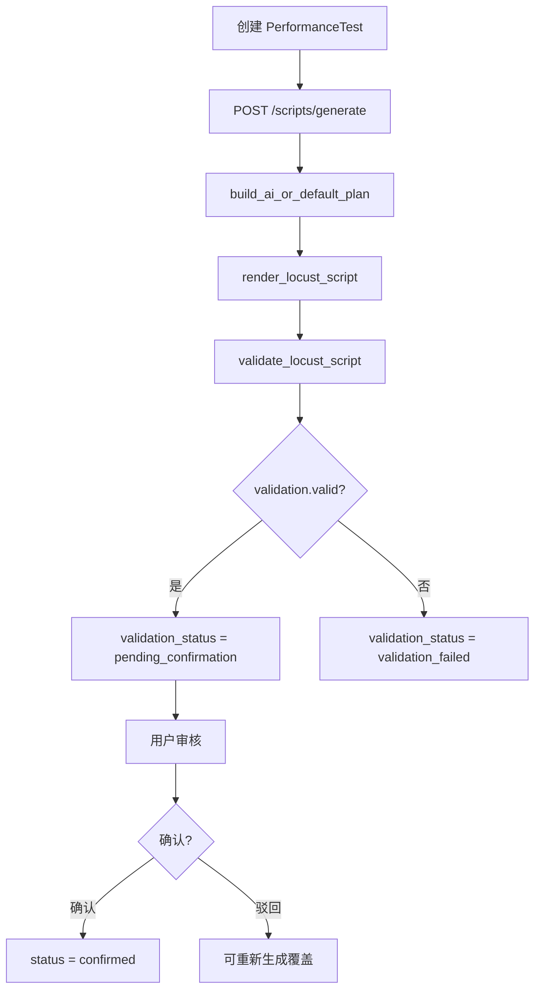

# 00-17 AI测试系统 - 性能测试 PRD

> **历史命名说明**：原文件名"非功能需求测试分析"为历史遗留命名，当前文件实际承担性能测试（Performance Testing）产品需求文档职责，特此说明。
>
> **基线日期**：2026-07-26
>
> **事实源**：当前工作区源码，以下列文件为准：
> - 后端 API：`apps/backend/app/api/v1/performance_tests.py`、`apps/backend/app/api/v1/performance_runs.py`
> - 后端服务：`apps/backend/app/services/performance_testing/{service.py,script_service.py,analysis_service.py,headless_worker.py,repair_service.py,locust_runtime.py,metric_snapshot_service.py,run_repo.py}`
> - 后端仓储：`apps/backend/app/repositories/{performance_test_repo.py,performance_script_repo.py}`
> - 后端 Agent：`apps/backend/app/agents/performance_testing/{script_generation/service.py,diagnosis/agent.py,diagnosis/service.py}`
> - 数据库：`apps/backend/app/seed/schema.py`（含 8 张性能测试相关表）
> - 前端：`apps/frontend/src/components/ai-testing/performance-testing/`（含 performance-test-form、script-review、locust-console、performance-ai-analysis-drawer、performance-analysis-report 等组件）
> - 前端 API 客户端：`apps/frontend/src/lib/api-client.ts:1486-1735`
>
> **状态标签**：已实现 / 未实现 / 占位说明。
>
> **关键结论**：
> - 性能测试已实现"单接口任务 + Locust 脚本生成/审核 + 运行 + 实时监控 + 停止/重置/重跑 + AI 诊断（含证据/配置建议/应用并重跑）"完整闭环；
> - 泛化的非功能测试（容量、可靠性、安全性、混沌等）当前 **未实现**。

---

## 1. 范围与目标

### 1.1 本 PRD 覆盖范围

本 PRD 覆盖以下完整功能：

- **性能任务（Performance Test）**：单接口性能任务，关联接口环境、目标端点、请求配置、负载配置、成功规则、质量目标。
- **脚本生命周期**：Locust 脚本 AI 生成 → 校验 → 审核（确认/驳回/重新生成）→ 确认。
- **运行与监控**：`performance_test_runs` 运行 + SSE 实时流 + 报告下载。
- **性能 AI 分析**：`performance_analysis_sessions` 会话管理 + 诊断证据 + 配置建议 + 修复复测。
- **性能指标快照服务**：`metric_snapshot_service.py` 提供 `build_metric_snapshot` / `build_report_snapshot`。
- **修复复测**：`repair_service.apply_and_rerun` 包含预检（preflight）、配置更新、自动重跑。

### 1.2 当前架构

性能测试采用单轨模型：`performance_tests` 保存单接口任务配置，`performance_test_scripts` 保存 Locust 脚本版本，`performance_test_runs` 及其统计、失败、异常和事件子表保存运行事实。多阶段负载由任务的 `load_config_json` 表达，不再维护独立的性能场景与场景运行模型。

### 1.3 本 PRD 不覆盖

- 接口/UI 自动化（00-16 / 00-09）；
- 泛化非功能测试（容量、可靠性、安全性、混沌等）—— **未实现**；
- Allure 报告（性能测试不接入 Allure）；
- 报告中心聚合（00-13 占位）。

---

## 2. 性能任务（Performance Test）子模块

### 2.1 概述

性能任务是针对单个 API 接口的性能验证单元。一个任务绑定一个 `endpoint_id` 和一个 `api_environment_id`，配置负载参数和成功判定规则，生成 Locust 脚本后运行。

### 2.2 核心字段

| 字段 | 类型 | 说明 |
| --- | --- | --- |
| `id` | TEXT | 主键，格式 `perftest-<hex8>` |
| `project_id` | TEXT | 所属项目 |
| `name` | TEXT | 任务名称，同项目内唯一 |
| `description` | TEXT | 描述 |
| `target_type` | TEXT | 目前固定为 `endpoint` |
| `endpoint_id` | TEXT | 关联接口 ID（必须属于同一项目） |
| `api_environment_id` | TEXT | 关联环境 ID（必须属于同一项目） |
| `request_config_json` | TEXT | 请求配置，含 method/path/headers/body/params 等 |
| `load_config_json` | TEXT | 负载配置，含 mode/users/spawn_rate/duration 等 |
| `data_config_json` | TEXT | 数据源配置，含 source/csv_file_name/json_rows 等 |
| `circuit_breaker_json` | TEXT | 熔断器配置（JSON 字段，非独立模块） |
| `performance_goal_json` | TEXT | 性能目标，含 max_fail_ratio/max_p95_rt 等 |
| `success_rules_json` | TEXT | 成功规则列表，含 kind/status_codes/json_path 等 |
| `created_by` | TEXT | 创建者 ID |

### 2.3 负载配置（PerformanceLoadConfig）

```json
{
  "mode": "fixed",          // fixed | gradient | stress | spike | endurance
  "users": 10,
  "spawn_rate": 1,
  "measurement_duration_seconds": 60,
  "request_timeout_seconds": 30,
  "wait_time_min_seconds": 0,
  "wait_time_max_seconds": 1,
  "stages": []              // gradient/stress/spike/endurance 模式时使用
}
```

### 2.4 成功规则（PerformanceSuccessRule）

```json
[
  {"kind": "status_code", "status_codes": [200]},
  {"kind": "jsonpath_equals", "json_path": "$.code", "expected": 0}
]
```

### 2.5 熔断器（circuit_breaker_json）

当前为 JSON 配置字段，不作为独立模块实现。字段记录熔断相关配置，供 AI 诊断时参考。

---

## 3. 架构收敛说明

性能测试当前仅保留单接口任务模型。多阶段、压力、峰值和耐久负载统一由 `PerformanceLoadConfig` 与 Locust 脚本表达，运行事实统一写入 `performance_test_runs` 及其统计子表。

---

## 4. 接口编辑与脚本生命周期

### 4.1 性能任务 CRUD

| 方法 | 路径 | 说明 |
| --- | --- | --- |
| GET | `/projects/{project_id}/performance-tests` | 列表 |
| POST | `/projects/{project_id}/performance-tests` | 创建（需 admin） |
| GET | `/projects/{project_id}/performance-tests/{test_id}` | 详情 |
| PATCH | `/projects/{project_id}/performance-tests/{test_id}` | 更新（需 admin） |
| DELETE | `/projects/{project_id}/performance-tests/{test_id}` | 删除（需 active 运行停止后） |
| POST | `/projects/{project_id}/performance-tests/request-preview` | 请求预览（从 endpoint + environment 构造） |

### 4.2 脚本生成（AI 计划 + 脚本渲染）

| 方法 | 路径 | 说明 |
| --- | --- | --- |
| POST | `/projects/{project_id}/performance-tests/{test_id}/scripts/generate` | 生成脚本 |
| GET | `/projects/{project_id}/performance-tests/{test_id}/scripts` | 列表脚本 |
| GET | `/projects/{project_id}/performance-tests/{test_id}/scripts/{script_id}` | 详情 |
| PATCH | `/projects/{project_id}/performance-tests/{test_id}/scripts/{script_id}/configuration` | 修改脚本配置（仅 pending 状态） |
| POST | `/projects/{project_id}/performance-tests/{test_id}/scripts/{script_id}/confirm` | 确认脚本 |

**脚本状态**：`pending_confirmation`（待确认）→ `confirmed`（已确认）→ `superseded`（被取代）

**确认条件**：脚本校验必须 `validation_result.valid == true`，否则返回 `409 PERFORMANCE_SCRIPT_NOT_CONFIRMABLE`。

### 4.3 脚本生成流程



---

## 5. 运行与生命周期

### 5.1 性能任务运行（performance_test_runs）

**创建运行**：

```
POST /projects/{project_id}/performance-tests/{test_id}/runs
Body: { "script_id": "<script_id>" }
```

- 必须传入 `script_id`，且该脚本 `validation_status == 'confirmed'`
- 校验 endpoint / environment 属于同一项目
- 创建 `performance_test_runs` 记录，状态 `created`

**启动运行**：

```
POST /projects/{project_id}/performance-tests/{test_id}/runs/{run_id}/start
Body（可选）: { "users": 10, "spawn_rate": 1, "run_time": 60, "host": "http://..." }
```

**状态机（run_repo.py:7-16）**：

```
created → starting → running → { completed | stopped | failed | cancelled }
                     ↓
              stopping → stopped
```

**终止条件**：

| 终止方式 | 状态 |
| --- | --- |
| Locust 自然结束（return_code=0） | `completed` |
| 用户主动停止（`stop_headless_run`） | `stopped` |
| Locust 异常退出（return_code≠0） | `failed` |
| 进程未响应被 kill | `failed` |
| 用户在 created 状态取消 | `cancelled` |

**运行控制**：

| 方法 | 路径 | 说明 |
| --- | --- | --- |
| POST | `/projects/{project_id}/performance-test-runs/{run_id}/stop` | 停止运行 |
| POST | `/projects/{project_id}/performance-test-runs/{run_id}/reset-stats` | 重置统计（拒绝 created/stopping 状态） |
| GET | `/projects/{project_id}/performance-test-runs/{run_id}/state` | 当前状态 |
| GET | `/projects/{project_id}/performance-tests/{test_id}/runs/history` | 最近 10 次运行记录 |

### 5.2 运行统计与事件

| 方法 | 路径 | 说明 |
| --- | --- | --- |
| GET | `/projects/{project_id}/performance-test-runs/{run_id}/stats` | 完整统计（含 run + stats + failures + exceptions + events） |
| GET | `/projects/{project_id}/performance-test-runs/{run_id}/charts` | 直方图/历史曲线（优先从 result_stats_history.csv 读取） |
| GET | `/projects/{project_id}/performance-test-runs/{run_id}/failures` | 失败请求列表 |
| GET | `/projects/{project_id}/performance-test-runs/{run_id}/exceptions` | 异常事件列表 |

---

## 6. 子进程执行（headless_worker）

### 6.1 Locust 进程管理

`headless_worker` 负责启动和管理 Locust 子进程：

```python
def build_headless_command(*, run_dir, users, spawn_rate, duration_seconds):
    return [
        sys.executable, "-m", "locust", "-f", "locustfile.py",
        "--headless", "--users", str(users), "--spawn-rate", str(spawn_rate),
        "--run-time", f"{duration_seconds}s",
        "--csv", str(run_dir / "result"),
        "--csv-full-history", "--html", str(run_dir / "result.html")
    ]
```

### 6.2 运行产物目录

```
apps/backend/data/projects/<project_id>/performance_testing/runs/<run_id>/
├── locustfile.py          # 固定 Locust 运行时模板（locust_runtime.py 生成）
├── generated_locustfile.py # AI 生成的 Locust 脚本
├── runtime.json           # 运行时环境配置（API base URL + headers + variables）
├── result.html            # Locust HTML 报告
├── result_stats.csv       # 请求统计
├── result_stats_history.csv # 时序统计（--csv-full-history）
├── result_failures.csv    # 失败请求详情
├── result_exceptions.csv  # 异常事件
├── stdout.log             # 标准输出
├── stderr.log             # 标准错误
└── locust-events.jsonl    # 实时事件流
```

### 6.3 最近 10 次运行保留

`headless_worker._prune_run_history` 在每次 `create_run_session` 和 Locust 结束后，保留同一 `performance_test_id` 下最近 10 次非 active 运行的产物目录，其余删除。

---

## 7. 实时监控（SSE 流）

### 7.1 SSE 端点

```
GET /projects/{project_id}/performance-test-runs/{run_id}/stream
```

### 7.2 事件类型

| 事件类型 | 触发条件 | 说明 |
| --- | --- | --- |
| `run` | run 状态/时间戳/错误信息变化 | 推送完整 run payload |
| `stats` | 新 stat 采样到达 | 推送 run + latest stat + failures + exceptions |
| `log` | 新事件记录到达 | 推送事件行 |
| `done` | 状态进入 `completed/stopped/failed/cancelled` | SSE 断开 |

### 7.3 前端对接

前端 `api-client.ts` 中 `streamPerformanceRun()` 函数消费该 SSE 流，驱动 `locust-console.tsx` 组件实时展示控制台输出和统计数据。

---

## 8. Locust 报告下载白名单

### 8.1 支持下载的文件（REPORT_FILES）

| 文件名 | 内容说明 |
| --- | --- |
| `result.html` | Locust HTML 报告 |
| `result_stats.csv` | 请求统计 CSV |
| `result_stats_history.csv` | 时序统计 CSV |
| `result_failures.csv` | 失败请求 CSV |
| `result_exceptions.csv` | 异常事件 CSV |
| `result_tasks.csv` | 任务统计 CSV |
| `stdout.log` | 标准输出日志 |
| `stderr.log` | 标准错误日志 |

### 8.2 安全约束

- 文件名必须在 `REPORT_FILES` 白名单内；
- 使用 `Path(filename).name != filename` 防止路径穿越；
- 校验 `directory not in report.parents` 防止目录遍历；
- 任意违规返回 `400 PERFORMANCE_REPORT_INVALID` 或 `404 PERFORMANCE_REPORT_NOT_FOUND`。

---

## 9. 性能 AI 分析

### 9.1 分析能力

`agents/performance_testing/diagnosis/service.py`：

- **CAPABILITY_ID**：`performance_report_analysis`
- **PROMPT_VERSION**：`"v2-zh"`
- **Agent**：通过 `performance_diagnosis_agent(model)` 创建，仅使用工具，无自定义工具
- **输出类型**：`PerformanceDiagnosis`（含 category/direct_cause/root_cause/confidence/evidence/findings/recommendations/proposed_changes）

### 9.2 分析流程

```mermaid
flowchart TD
    A[POST /performance-test-runs/{run_id}/ai-analysis] --> B[create_analysis: status=collecting]
    B --> C[BackgroundTasks: execute_analysis]
    C --> D[collect_performance_evidence]
    D --> E[build_metric_snapshot]
    E --> F[diagnose_performance with PROMPT_VERSION=v2-zh]
    F --> G[build_report_snapshot]
    G --> H[update: status=waiting_approval, repair_status=available]
```

### 9.3 证据收集（analysis_evidence）

分析前收集：run 元数据 + performance_test 配置 + stats + failures + exceptions + latest_summary，构成 `evidence` 字典传入 Agent。

### 9.4 性能指标快照服务（metric_snapshot_service.py）

- **CALCULATOR_VERSION**：`"performance-metrics-v1"`
- `build_metric_snapshot(evidence)`：构建完整快照，含 schema_version/quality/aggregate/capacity/objectives/verdict/series/evidence_index
- `build_report_snapshot(metric_snapshot, diagnosis)`：将 AI 诊断结果结构化为报告快照，含 executive_summary/capacity_summary/findings/recommendations

---

## 10. 性能分析会话状态机

### 10.1 分析状态（analysis_session.status）

```
collecting → analyzing → waiting_approval
                ↓              ↓
             failed         failed / rejected
```

| 状态 | 说明 |
| --- | --- |
| `collecting` | 刚创建，等待证据收集 |
| `analyzing` | 正在执行 AI 诊断 |
| `waiting_approval` | 诊断完成，等待用户审核 |
| `failed` | 分析执行失败 |
| `rejected` | 用户主动驳回 |

### 10.2 分析子状态（analysis_status / analysis_stage）

| analysis_status | analysis_stage | 说明 |
| --- | --- | --- |
| `collecting` | - | 证据收集中 |
| `analyzing` | `ai_diagnosis` | AI 诊断执行中 |
| `analyzing` | `report_ready` | 诊断完成，报告就绪 |
| `completed` | `report_ready` | 用户已审核（apply 或 reject） |
| `failed` | `failed` | 分析失败 |

### 10.3 修复状态（repair_status）

| repair_status | 说明 |
| --- | --- |
| `not_applicable` | 无可应用修改 |
| `available` | 有可应用修改，等待审核 |
| `preflighting` | 预检中 |
| `rerunning` | 重跑中 |
| `completed` | 已完成修复 |
| `rejected` | 用户驳回 |

### 10.4 应用状态（application_status）

```
not_requested → preflighting → preflight_failed
                   ↓
               rerunning → completed / apply_failed
```

| 状态 | 说明 |
| --- | --- |
| `not_requested` | 未发起应用 |
| `preflighting` | 正在预检（单请求验证） |
| `preflight_failed` | 预检失败，未修改配置 |
| `rerunning` | 预检通过，正在创建新脚本和重跑 |
| `completed` | 完成修复复测 |
| `apply_failed` | 重跑启动失败 |
| `superseded` | 被新的分析取代 |

---

## 11. 修复复测（repair_service）

### 11.1 流程

```
POST /performance-analysis/{analysis_id}/apply-and-rerun
Body: { "change_ids": ["<change_id_1>", "<change_id_2>"] }
```

1. **校验**：`change_ids` 中的 `ProposedChange` 必须存在于分析的 `proposal.changes` 中，且 `target_type != 'platform_code'`
2. **预检**：`_send_preflight` 发送单次请求验证修改后配置是否可正常工作
3. **预检失败**：更新 `application_status=preflight_failed`，不修改原配置
4. **预检通过**：更新原 `performance_test` 的 request_config/load_config/data_config/success_rules
5. **生成新脚本**：基于修改后配置生成新脚本并自动确认
6. **启动重跑**：创建新 run 并启动 `headless_worker`
7. **记录**：更新 `applied_run_id` / `applied_script_id` / `applied_at`

### 11.2 支持的修改目标（ALLOWED_TARGETS）

```
request_config.path_parameters
request_config.query_parameters
request_config.headers
request_config.body
request_config.random_seed
load_config.request_timeout_seconds
load_config.wait_time_min_seconds
load_config.wait_time_max_seconds
data_config
data_config.json_rows
success_rules
```

---

## 12. 数据模型

### 12.1 概览（8 张表）

| 序号 | 表名 | 用途 |
| --- | --- | --- |
| 1 | `performance_tests` | 性能任务主记录 |
| 2 | `performance_test_scripts` | 脚本版本记录 |
| 3 | `performance_test_runs` | 性能任务运行记录 |
| 4 | `performance_test_run_stats` | 运行统计时序采样 |
| 5 | `performance_test_run_failures` | 运行失败请求记录 |
| 6 | `performance_test_run_exceptions` | 运行异常事件记录 |
| 7 | `performance_test_run_events` | 运行事件日志 |
| 8 | `performance_analysis_sessions` | AI 分析会话 |

### 12.2 `performance_tests`

```sql
CREATE TABLE IF NOT EXISTS performance_tests (
  id TEXT PRIMARY KEY,
  project_id TEXT NOT NULL,
  name TEXT NOT NULL,
  description TEXT NOT NULL DEFAULT '',
  target_type TEXT NOT NULL CHECK(target_type IN ('endpoint')) DEFAULT 'endpoint',
  endpoint_id TEXT NOT NULL,
  api_environment_id TEXT NOT NULL,
  request_config_json TEXT NOT NULL DEFAULT '{}',
  load_config_json TEXT NOT NULL DEFAULT '{}',
  data_config_json TEXT NOT NULL DEFAULT '{}',
  circuit_breaker_json TEXT NOT NULL DEFAULT '{}',
  performance_goal_json TEXT NOT NULL DEFAULT '{}',
  success_rules_json TEXT NOT NULL DEFAULT '[]',
  created_by TEXT NOT NULL,
  created_at TEXT NOT NULL DEFAULT CURRENT_TIMESTAMP,
  updated_at TEXT NOT NULL DEFAULT CURRENT_TIMESTAMP
);
-- 索引：project_id 上的查询（隐含主键）
-- UNIQUE(project_id, name)
```

### 12.3 `performance_test_scripts`

```sql
CREATE TABLE IF NOT EXISTS performance_test_scripts (
  id TEXT PRIMARY KEY,
  performance_test_id TEXT NOT NULL,
  project_id TEXT NOT NULL,
  version INTEGER NOT NULL,
  generation_source TEXT NOT NULL CHECK(generation_source IN ('ai_plan', 'default_plan', 'user_edited')),
  model_id TEXT,
  prompt_version TEXT,
  template_version TEXT,
  input_hash TEXT NOT NULL,
  plan_json TEXT NOT NULL DEFAULT '{}',
  code TEXT NOT NULL DEFAULT '',
  assumptions_json TEXT NOT NULL DEFAULT '[]',
  required_runtime_variables_json TEXT NOT NULL DEFAULT '[]',
  validation_status TEXT NOT NULL CHECK(validation_status IN ('pending_confirmation', 'confirmed', 'validation_failed', 'superseded')),
  validation_result_json TEXT NOT NULL DEFAULT '{}',
  confirmed_by TEXT,
  confirmed_at TEXT,
  created_at TEXT NOT NULL DEFAULT CURRENT_TIMESTAMP,
  FOREIGN KEY(performance_test_id) REFERENCES performance_tests(id) ON DELETE CASCADE
);
-- 索引：performance_test_id + version
-- 索引：project_id
```

### 12.4 `performance_test_runs`

```sql
CREATE TABLE IF NOT EXISTS performance_test_runs (
  id TEXT PRIMARY KEY,
  project_id TEXT NOT NULL,
  performance_test_id TEXT NOT NULL,
  script_id TEXT NOT NULL,
  status TEXT NOT NULL CHECK(status IN ('created', 'starting', 'running', 'stopping', 'completed', 'stopped', 'failed', 'cancelled')),
  load_config_json TEXT NOT NULL DEFAULT '{}',
  runtime_config_json TEXT NOT NULL DEFAULT '{}',
  latest_summary_json TEXT NOT NULL DEFAULT '{}',
  report_directory TEXT,
  error_code TEXT,
  error_message TEXT,
  trace_id TEXT,
  created_by TEXT NOT NULL,
  created_at TEXT NOT NULL DEFAULT CURRENT_TIMESTAMP,
  started_at TEXT,
  finished_at TEXT,
  updated_at TEXT NOT NULL DEFAULT CURRENT_TIMESTAMP,
  FOREIGN KEY(performance_test_id) REFERENCES performance_tests(id) ON DELETE CASCADE,
  FOREIGN KEY(script_id) REFERENCES performance_test_scripts(id)
);
-- 索引：project_id + performance_test_id + status（用于历史查询和清理）
```

### 12.5 `performance_test_run_stats`

```sql
CREATE TABLE IF NOT EXISTS performance_test_run_stats (
  id TEXT PRIMARY KEY,
  run_id TEXT NOT NULL,
  sampled_at TEXT NOT NULL DEFAULT CURRENT_TIMESTAMP,
  user_count INTEGER NOT NULL DEFAULT 0,
  request_count INTEGER NOT NULL DEFAULT 0,
  failure_count INTEGER NOT NULL DEFAULT 0,
  requests_per_second REAL NOT NULL DEFAULT 0.0,
  failures_per_second REAL NOT NULL DEFAULT 0.0,
  failure_rate REAL NOT NULL DEFAULT 0.0,
  average_response_time_ms REAL NOT NULL DEFAULT 0.0,
  p50_response_time_ms REAL NOT NULL DEFAULT 0.0,
  p95_response_time_ms REAL NOT NULL DEFAULT 0.0,
  p99_response_time_ms REAL NOT NULL DEFAULT 0.0,
  min_response_time_ms REAL NOT NULL DEFAULT 0.0,
  max_response_time_ms REAL NOT NULL DEFAULT 0.0,
  stats_json TEXT NOT NULL DEFAULT '{}',
  FOREIGN KEY(run_id) REFERENCES performance_test_runs(id) ON DELETE CASCADE
);
-- 索引：run_id + sampled_at（时序查询）
```

### 12.6 `performance_test_run_failures`

```sql
CREATE TABLE IF NOT EXISTS performance_test_run_failures (
  id TEXT PRIMARY KEY,
  run_id TEXT NOT NULL,
  request_name TEXT NOT NULL,
  method TEXT NOT NULL DEFAULT '',
  reason TEXT NOT NULL,
  count INTEGER NOT NULL DEFAULT 1,
  status_code INTEGER,
  response_excerpt TEXT NOT NULL DEFAULT '',
  FOREIGN KEY(run_id) REFERENCES performance_test_runs(id) ON DELETE CASCADE
);
```

### 12.7 `performance_test_run_exceptions`

```sql
CREATE TABLE IF NOT EXISTS performance_test_run_exceptions (
  id TEXT PRIMARY KEY,
  run_id TEXT NOT NULL,
  request_name TEXT NOT NULL DEFAULT '',
  exception_type TEXT NOT NULL,
  message TEXT NOT NULL,
  count INTEGER NOT NULL DEFAULT 1,
  FOREIGN KEY(run_id) REFERENCES performance_test_runs(id) ON DELETE CASCADE
);
```

### 12.8 `performance_test_run_events`

```sql
CREATE TABLE IF NOT EXISTS performance_test_run_events (
  id TEXT PRIMARY KEY,
  run_id TEXT NOT NULL,
  event_type TEXT NOT NULL,
  level TEXT NOT NULL DEFAULT 'info',
  message TEXT NOT NULL DEFAULT '',
  detail_json TEXT NOT NULL DEFAULT '{}',
  occurred_at TEXT NOT NULL DEFAULT CURRENT_TIMESTAMP,
  FOREIGN KEY(run_id) REFERENCES performance_test_runs(id) ON DELETE CASCADE
);
-- 索引：run_id + occurred_at
```

### 12.9 `performance_analysis_sessions`

```sql
CREATE TABLE IF NOT EXISTS performance_analysis_sessions (
  id TEXT PRIMARY KEY,
  project_id TEXT NOT NULL,
  run_id TEXT NOT NULL,
  status TEXT NOT NULL CHECK(status IN ('collecting', 'analyzing', 'waiting_approval', 'failed', 'rejected')),
  analysis_status TEXT NOT NULL DEFAULT 'collecting',
  analysis_stage TEXT NOT NULL DEFAULT '',
  repair_status TEXT NOT NULL DEFAULT 'not_applicable',
  analysis_version INTEGER NOT NULL DEFAULT 1,
  category TEXT NOT NULL DEFAULT '',
  summary TEXT NOT NULL DEFAULT '',
  direct_cause TEXT NOT NULL DEFAULT '',
  root_cause TEXT NOT NULL DEFAULT '',
  confidence REAL NOT NULL DEFAULT 0.0,
  evidence_json TEXT NOT NULL DEFAULT '[]',
  missing_evidence_json TEXT NOT NULL DEFAULT '[]',
  proposal_json TEXT NOT NULL DEFAULT '{"changes":[]}',
  metric_snapshot_json TEXT NOT NULL DEFAULT '{}',
  report_snapshot_json TEXT NOT NULL DEFAULT '{}',
  calculator_version TEXT NOT NULL DEFAULT '',
  prompt_version TEXT NOT NULL DEFAULT '',
  source_fingerprint TEXT NOT NULL DEFAULT '',
  audience TEXT NOT NULL DEFAULT 'engineer',
  model_name TEXT NOT NULL DEFAULT '',
  error_message TEXT NOT NULL DEFAULT '',
  created_by TEXT NOT NULL,
  created_at TEXT NOT NULL DEFAULT CURRENT_TIMESTAMP,
  finished_at TEXT,
  updated_at TEXT NOT NULL DEFAULT CURRENT_TIMESTAMP,
  application_status TEXT NOT NULL DEFAULT 'not_requested',
  applicable_change_ids_json TEXT NOT NULL DEFAULT '[]',
  selected_change_ids_json TEXT NOT NULL DEFAULT '[]',
  preflight_json TEXT NOT NULL DEFAULT '{}',
  applied_script_id TEXT,
  applied_run_id TEXT,
  applied_by TEXT,
  applied_at TEXT,
  FOREIGN KEY(run_id) REFERENCES performance_test_runs(id) ON DELETE CASCADE
);
-- 索引：project_id + run_id + status（查询活跃分析）
```

## 13. API 路由清单

### 13.1 performance_tests.py（test_router）

前缀：`/projects/{project_id}/performance-tests`

| 方法 | 路径 | 认证 | 说明 |
| --- | --- | --- | --- |
| POST | `/request-preview` | current_user | 请求预览 |
| POST | `` | require_admin | 创建测试 |
| GET | `` | current_user | 列表 |
| POST | `/{test_id}/scripts/generate` | require_admin | 生成脚本 |
| GET | `/{test_id}/scripts` | current_user | 脚本列表 |
| GET | `/{test_id}/scripts/{script_id}` | current_user | 脚本详情 |
| PATCH | `/{test_id}/scripts/{script_id}/configuration` | require_admin | 修改脚本配置 |
| POST | `/{test_id}/scripts/{script_id}/confirm` | require_admin | 确认脚本 |
| GET | `/{test_id}` | current_user | 测试详情 |
| PATCH | `/{test_id}` | require_admin | 更新测试 |
| DELETE | `/{test_id}` | current_user | 删除测试 |

### 13.2 performance_runs.py

**test_router**：前缀 `/projects/{project_id}/performance-tests/{test_id}`

| 方法 | 路径 | 认证 | 说明 |
| --- | --- | --- | --- |
| POST | `/runs` | current_user | 创建运行 |
| POST | `/runs/{run_id}/start` | current_user | 启动运行 |
| GET | `/runs/history` | current_user | 最近 10 次历史 |

**run_router**：前缀 `/projects/{project_id}/performance-test-runs`

| 方法 | 路径 | 认证 | 说明 |
| --- | --- | --- | --- |
| GET | `/{run_id}` | current_user | 运行详情 |
| DELETE | `/{run_id}` | current_user | 删除（仅非 active） |
| POST | `/{run_id}/ai-analysis` | current_user | 创建 AI 分析 |
| GET | `/{run_id}/ai-analysis` | current_user | 分析列表 |
| GET | `/{run_id}/stats` | current_user | 完整统计 |
| GET | `/{run_id}/state` | current_user | 运行状态 |
| GET | `/{run_id}/charts` | current_user | 图表数据 |
| GET | `/{run_id}/failures` | current_user | 失败请求 |
| GET | `/{run_id}/exceptions` | current_user | 异常事件 |
| POST | `/{run_id}/stop` | current_user | 停止运行 |
| POST | `/{run_id}/reset-stats` | current_user | 重置统计 |
| GET | `/{run_id}/reports` | current_user | 报告列表 |
| GET | `/{run_id}/reports/{filename}` | current_user | 下载报告 |
| GET | `/{run_id}/stream` | current_user | SSE 实时流 |

**analysis_router**：前缀 `/projects/{project_id}/performance-analysis`

| 方法 | 路径 | 认证 | 说明 |
| --- | --- | --- | --- |
| GET | `/{analysis_id}` | current_user | 分析详情 |
| POST | `/{analysis_id}/reject` | current_user | 驳回分析 |
| POST | `/{analysis_id}/apply-and-rerun` | current_user | 应用并重跑 |

---

## 14. 前端页面清单

| 页面路径 | 组件 | 说明 |
| --- | --- | --- |
| `/performance-tests` | `all-performance-test-list.tsx` | 跨项目性能测试列表 |
| `/projects/:projectId/performance-tests` | 同上（项目级） | 项目内性能测试列表 |
| `/performance-tests/new` | `performance-test-form.tsx` | 新建性能测试 |
| `/projects/:projectId/performance-tests/new` | 同上 | 项目级新建 |
| `/projects/:projectId/performance-tests/:testId` | - | 性能测试详情 |
| `/projects/:projectId/performance-tests/:testId/scripts/:scriptId` | `script-review.tsx` | 脚本审核页面 |
| `/projects/:projectId/performance-tests/:testId/runs/:runId` | `locust-console.tsx` + `locust-statistics-table.tsx` | 运行详情 + 实时控制台 |
| - | `performance-ai-analysis-drawer.tsx` | AI 分析抽屉 |
| - | `performance-analysis-report.tsx` | 性能分析报告展示 |

---

## 15. 验收规则

### 15.1 脚本审核

| 验收项 | 核对依据 |
| --- | --- |
| 未确认脚本不能启动运行 | `performance_runs.py:_script_lookup` 中 `validation_status != 'confirmed'` → `409 PERFORMANCE_SCRIPT_NOT_CONFIRMED` |
| 确认前脚本校验必须通过 | `script_service.py:confirm_script` 检查 `validation_result.valid` |

### 15.2 运行控制

| 验收项 | 核对依据 |
| --- | --- |
| created/stopping 状态拒绝 reset-stats | `performance_runs.py:reset_performance_run_stats` 中状态校验 |
| active 状态运行拒绝删除 | `performance_runs.py:delete_performance_run` 中 `ACTIVE_STATUSES` 校验 |
| 启动后状态推进 `starting → running` | `headless_worker.py:_monitor_run` 状态更新 |
| 终端状态推送 `done` 事件后 SSE 断开 | `performance_runs.py:stream_performance_run` 中 `TERMINAL_STATUSES` 判断 |

### 15.3 报告下载

| 验收项 | 核对依据 |
| --- | --- |
| 仅白名单文件可下载 | `performance_runs.py:download_performance_run_report` 中 `filename in REPORT_FILES` |
| 路径穿越防护 | `Path(filename).name != filename` + `directory not in report.parents` |

### 15.4 AI 分析与修复

| 验收项 | 核对依据 |
| --- | --- |
| 仅终端运行（completed/stopped/failed/cancelled）可启动分析 | `analysis_service.py:create_analysis` 中 `TERMINAL_RUN_STATUSES` 校验 |
| 已有活跃分析时拒绝新建 | `performance_analysis_repo.find_active_analysis_for_run` |
| apply-and-rerun 必须传入 change_ids | `repair_service.py:apply_and_rerun` 中 `selected_ids` 非空校验 |
| platform_code 类型修改不可直接应用 | `repair_service.py:is_supported_change` 返回 False |
| 预检失败不修改原配置 | `repair_service.py:apply_and_rerun` 中 `preflight_failed` 分支 |

## 16. 完整用户流程图

```mermaid
flowchart TD
    subgraph 创建阶段
        A[用户在 UI 填写 PerformanceTestCreateIn] --> B[POST /performance-tests 创建任务]
        B --> C[关联 endpoint + environment]
        C --> D[POST /scripts/generate 生成草稿脚本]
        D --> E[validate_locust_script 校验]
        E --> F{valid?}
        F -- 否 --> G[validation_status = validation_failed]
        F -- 是 --> H[validation_status = pending_confirmation]
        H --> I[用户在 script-review.tsx 审核]
        I --> J{确认?}
        J -- 确认 --> K[POST /scripts/{id}/confirm]
        K --> L[status = confirmed]
        J -- 驳回 --> M[可重新生成覆盖]
    end

    subgraph 运行阶段
        L --> N[POST /performance-tests/{test_id}/runs 创建运行]
        N --> O[headless_worker 创建 session]
        O --> P[写入 performance_test_runs, status=created]
        P --> Q[POST /runs/{run_id}/start 启动]
        Q --> R[headless_worker 启动 Locust 子进程]
        R --> S[状态: starting → running]
        S --> T[SSE /performance-test-runs/{run_id}/stream 实时推送]
        T --> U[前端 locust-console.tsx 展示实时数据]
        U --> V[Locust 运行结束]
        V --> W{return_code?}
        W -- 0 --> X[状态: completed]
        W -- 非0 --> Y[状态: failed]
        X --> Z[自动调度 AI 分析]
        Z --> AA[execute_analysis 收集证据 + 诊断]
    end

    subgraph AI 分析阶段
        AA --> AB[build_metric_snapshot 构建快照]
        AB --> AC[diagnose_performance PROMPT_VERSION=v2-zh]
        AC --> AD[build_report_snapshot 生成报告]
        AD --> AE[状态: waiting_approval, repair_status=available]
        AE --> AF[performance-analysis-report.tsx 展示报告]
        AF --> AG{用户操作?}
        AG -- 驳回 --> AH[status=rejected]
        AG -- 应用部分修改 --> AI[POST /analysis/{id}/apply-and-rerun]
        AI --> AJ[_send_preflight 预检]
        AJ --> AK{preflight passed?}
        AK -- 否 --> AL[application_status=preflight_failed]
        AK -- 是 --> AM[更新 performance_test 配置]
        AM --> AN[生成新脚本 + 自动确认]
        AN --> AO[创建新 run 并启动]
        AO --> AP[application_status=completed]
    end

    style A fill:#e1f5fe
    style L fill:#c8e6c9
    style X fill:#c8e6c9
    style AE fill:#fff9c4
    style AP fill:#c8e6c9
```

---

## 17. 错误码参考

| 错误码 | HTTP 状态 | 说明 |
| --- | --- | --- |
| `PERFORMANCE_TEST_NOT_FOUND` | 404 | 性能测试不存在 |
| `PERFORMANCE_SCRIPT_NOT_FOUND` | 404 | 脚本不存在 |
| `PERFORMANCE_SCRIPT_NOT_CONFIRMED` | 409 | 脚本未确认，不能启动运行 |
| `PERFORMANCE_SCRIPT_NOT_CONFIRMABLE` | 409 | 脚本校验未通过，不能确认 |
| `PERFORMANCE_SCRIPT_IMMUTABLE` | 409 | 已确认脚本不可修改 |
| `PERFORMANCE_RUN_NOT_FOUND` | 404 | 性能运行不存在 |
| `PERFORMANCE_RUN_ACTIVE` | 409 | 运行中的压测不能删除 |
| `PERFORMANCE_RUN_START_INVALID` | 409 | 运行启动参数无效 |
| `PERFORMANCE_STATS_RESET_INVALID` | 409 | 当前状态不支持重置统计 |
| `PERFORMANCE_REPORT_INVALID` | 400 | 不支持的报告文件 |
| `PERFORMANCE_REPORT_NOT_FOUND` | 404 | 报告文件不存在 |
| `PERFORMANCE_ENDPOINT_INVALID` | 400/409 | 接口引用无效 |
| `PERFORMANCE_ENVIRONMENT_INVALID` | 400/409 | 环境引用无效 |
| `PERFORMANCE_TEST_NAME_CONFLICT` | 409 | 同项目内名称冲突 |
| `PERFORMANCE_ANALYSIS_NOT_FOUND` | 404 | 分析会话不存在 |
| `PERFORMANCE_ANALYSIS_RUN_ACTIVE` | 409 | 运行未结束不能启动分析 |
| `PERFORMANCE_ANALYSIS_ALREADY_RUNNING` | 409 | 该运行已有活跃分析 |
| `PERFORMANCE_ANALYSIS_NO_EVIDENCE` | 400 | 没有可供分析的证据 |
| `PERFORMANCE_ANALYSIS_REVIEW_INVALID` | 409 | 当前状态不能驳回 |
| `PERFORMANCE_REPAIR_CHANGES_REQUIRED` | 422 | 必须选择修复建议 |
| `PERFORMANCE_REPAIR_NOT_APPROVABLE` | 409 | 当前状态不能应用修复 |
| `PERFORMANCE_REPAIR_ALREADY_APPLIED` | 409 | 已在修复中或已完成 |
| `PERFORMANCE_REPAIR_CHANGE_UNSUPPORTED` | 422 | 选中的修复建议不支持 |
| `PERFORMANCE_REPAIR_BASELINE_CHANGED` | 409 | 配置已变化，需重新分析 |
| `PERFORMANCE_REPAIR_SCRIPT_INVALID` | 422 | 修复后脚本校验失败 |
| `PERFORMANCE_REPAIR_RERUN_FAILED` | 500 | 修复应用但重跑启动失败 |
| `PERMISSION_DENIED` | 403 | 无权访问 |
| `NOT_FOUND` | 404 | 资源不存在 |
