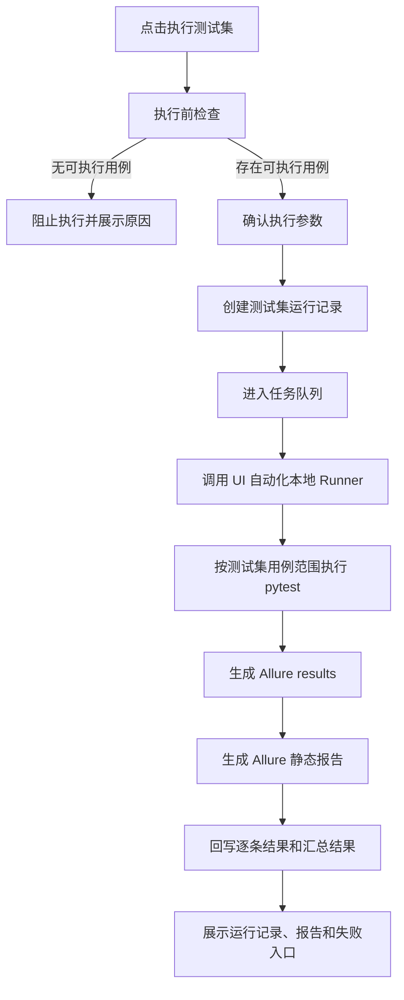

# 00-20 AI测试系统 - 测试集管理 PRD

## 1. 这份文档解决什么问题

本文定义 UI 自动化下的“用例测试集”能力。用例测试集不作为左侧一级导航入口，而是放在“UI 自动化”页面内，与“自动化用例”并列为页面内 Tab。UI 自动化只有一个前端页面 `/automation/ui`，通过项目切换器显示全部项目或指定项目的数据。用例测试集用于把多条可执行的 UI 自动化用例组合成可复用的执行集合，并支持一键批量执行、运行记录追踪和报告跳转。

核心规则：

- 测试集是项目内资产，必须归属单个项目。
- 用例测试集不进入左侧导航，只在 UI 自动化页面内展示。
- UI 自动化不拆分全局页面和项目内页面；同一页面通过项目切换器显示“全部项目”或“指定项目”。
- 第一阶段测试集 Tab 状态为 Soon，只展示占位说明，不允许创建、编辑或执行。
- 测试集只组合 UI 自动化测试用例，不直接组合尚未生成自动化代码的业务测试用例。
- 测试集只负责组合、编排、批量执行和结果聚合，不负责生成测试用例，也不负责生成 UI 自动化代码。
- 测试集执行复用现有 UI 自动化本地 Runner、pytest + Playwright + Allure 报告链路。
- 第一版测试集不支持接口自动化用例；接口自动化仍保持 Soon。
- 测试集允许重复执行，每次执行都生成独立运行记录。
- 测试集内单条用例失败不影响其他用例继续执行，最终以整批运行结果汇总展示。

---

## 2. 业务边界

### 2.1 本模块负责

- 创建、编辑、复制、归档测试集。
- 从当前项目的 UI 自动化可执行用例中选择多条用例加入测试集。
- 支持按模块、标签、优先级、最近结果、用例名称筛选可选用例。
- 维护测试集内用例顺序、启用状态和备注。
- 批量执行测试集内已启用的 UI 自动化用例。
- 展示测试集最近运行结果、历史运行记录、通过率和失败摘要。
- 从测试集运行记录跳转到 Allure 报告、失败诊断和单条自动化用例详情。

### 2.2 本模块不负责

- 不负责生成业务测试用例。
- 不负责评审或采纳测试用例。
- 不负责生成 UI 自动化代码。
- 不负责补充 locator 或执行定向探索。
- 不负责接口自动化用例、接口自动化测试集或 pytest + requests 执行。
- 不负责外部 CI/CD 调度。
- 不负责外部缺陷系统对接。

---

## 3. 核心对象

### 3.1 测试集

| 字段 | 说明 |
| --- | --- |
| 测试集 ID | 系统生成，项目内唯一 |
| 测试集名称 | 必填，项目内建议唯一 |
| 所属项目 | 必填，测试集不能跨项目 |
| 描述 | 可选，说明测试范围或用途 |
| 标签 | 可选，例如冒烟、回归、主流程、权限 |
| 状态 | 启用、归档 |
| 用例数量 | 测试集内已选择的 UI 自动化用例数量 |
| 启用用例数量 | 本次默认参与执行的用例数量 |
| 最近运行结果 | 未运行、执行中、通过、失败、部分失败、取消、执行错误 |
| 最近通过率 | 最近一次运行的通过用例占比 |
| 创建人 | 创建测试集的用户 |
| 更新时间 | 测试集配置最后更新时间 |

### 3.2 测试集用例

| 字段 | 说明 |
| --- | --- |
| 测试集 ID | 所属测试集 |
| 自动化用例 ID | 关联 UI 自动化用例 |
| 来源测试用例 ID | UI 自动化用例对应的业务测试用例 |
| 顺序 | 执行顺序，第一版按列表顺序执行 |
| 是否启用 | 禁用后保留在测试集中，但默认不执行 |
| 最近结果 | 该用例在当前测试集最近一次执行中的结果 |
| 备注 | 可记录数据准备、注意事项或临时说明 |

### 3.3 测试集运行

| 字段 | 说明 |
| --- | --- |
| 运行 ID | 每次执行生成 |
| 测试集 ID | 被执行的测试集 |
| 所属项目 | 运行所属项目 |
| 触发人 | 发起执行的用户 |
| 环境 | 本地、测试、预发等文本配置 |
| 浏览器 | chromium、firefox、webkit，第一版默认 chromium |
| headed | 是否有头运行 |
| 重试次数 | pytest 重试策略 |
| 总数 | 本次实际执行的用例数量 |
| 通过数 | 执行通过的用例数量 |
| 失败数 | 执行失败的用例数量 |
| 跳过数 | 被 pytest 跳过或运行前被系统跳过的数量 |
| 状态 | 排队中、执行中、通过、部分失败、失败、执行错误、取消 |
| Allure 报告路径 | 复用 UI 自动化报告归档 |
| 开始时间 | 执行开始时间 |
| 结束时间 | 执行结束时间 |

---

## 4. 用例选择规则

测试集只能选择满足以下条件的 UI 自动化测试用例：

- 与当前测试集属于同一个项目。
- 已生成 UI 自动化代码。
- 自动化套件或自动化用例状态为可执行。
- 不处于代码生成中、执行中、等待 locator 人工处理、生成失败或已归档状态。
- 对应业务测试用例仍为已采纳状态。

选择列表展示：

- 用例编号、用例标题、所属模块、优先级、风险等级。
- 自动化状态、最近执行结果、最近执行时间。
- 所属自动化套件、脚本路径摘要。
- locator 准入状态。

筛选能力：

- 模块。
- 标签。
- 优先级。
- 风险等级。
- 最近运行结果。
- 自动化状态。
- 关键字。

规则说明：

- 一个测试集可以包含多条 UI 自动化用例。
- 同一个 UI 自动化用例在同一个测试集中只能出现一次。
- 测试集不能选择其他项目的自动化用例。
- 归档测试集不能新增、移除或执行用例。
- UI 自动化用例被归档或变为不可执行后，测试集详情必须展示风险提示，并在执行前跳过或阻止，具体由执行前检查结果决定。

---

## 5. 测试集执行流程

执行前检查：

- 当前项目必须有效，不能在“全部项目”分区执行。
- 测试集状态必须为启用。
- 测试集内至少存在一条启用的 UI 自动化可执行用例。
- 本测试集不能已有运行中的执行任务。
- 本次选择的浏览器、headed、重试次数、环境配置必须满足 UI 自动化 Runner 要求。
- 如果部分用例不可执行，系统在确认弹窗展示不可执行清单，允许用户只执行剩余可执行用例。
- 如果全部用例不可执行，系统阻止执行并展示原因。

执行规则：

- 第一版按测试集内顺序执行。
- 单条用例失败不终止整批执行。
- 用户取消运行时，系统尽量安全终止本地 pytest 进程，并保存已产生的日志和半成品报告路径。
- 测试集运行结果不修改业务测试用例的评审状态。
- 运行失败后，用户可以从失败用例进入既有失败诊断流程。

---

## 6. 页面设计

### 6.1 UI 自动化页内入口

入口位置：

- 左侧导航不展示“测试集”。
- 用户进入左侧“UI 自动化”后，在页面内看到两个 Tab：`自动化用例`、`用例测试集`。
- `自动化用例` 为 UI 自动化主工作区，用于查看自动化任务、可执行自动化用例、代码、运行和报告相关信息。
- `用例测试集` 第一阶段为 Soon 状态，只展示占位说明。
- 用例测试集后续开放时，仍归属于 UI 自动化页面，不新增左侧一级入口。
- 推荐路由：`/automation/ui`，Tab 可由前端状态或查询参数管理；不单独设计左侧入口路由。

### 6.2 测试集列表

展示：

- 测试集名称、标签、用例数量、最近运行结果、最近通过率、最近运行时间、更新时间。
- 筛选：状态、标签、最近结果、关键字。
- 操作：新建测试集、复制、编辑、执行、查看运行记录、归档。

列表规则：

- 测试集 Tab 必须使用指定项目分区。
- 没有当前项目时展示项目选择空状态。
- 访客可以查看列表和详情，但不能新建、编辑、执行或归档。
- 第一阶段 Soon 状态下不展示真实列表，只展示“测试集暂未开放”的占位说明。

### 6.3 新建和编辑测试集

表单内容：

- 测试集名称。
- 描述。
- 标签。
- 用例选择区。
- 已选用例区。

用例选择交互：

- 左侧或上方展示可选 UI 自动化用例列表。
- 支持多选后加入测试集。
- 已选用例支持移除、调整顺序、启用或禁用。
- 保存前校验测试集名称和至少一条已选用例。

### 6.4 测试集详情

展示：

- 基本信息。
- 用例清单。
- 最近运行摘要。
- 历史运行记录。
- 不可执行用例提示。

操作：

- 编辑测试集。
- 执行测试集。
- 复制测试集。
- 归档测试集。
- 查看 Allure 报告。
- 查看失败诊断。
- 跳转到单条 UI 自动化用例。

### 6.5 执行确认弹窗

展示：

- 当前项目名称。
- 测试集名称。
- 本次执行用例数量。
- 将被跳过或不可执行的用例清单。
- 环境、浏览器、headed、重试次数。

确认后：

- 创建测试集运行任务。
- 页面进入运行进度或运行记录视图。

### 6.6 运行记录

展示：

- 运行状态、触发人、开始时间、结束时间、耗时。
- 总数、通过数、失败数、跳过数、通过率。
- Allure 报告入口。
- 每条用例结果、失败摘要、截图/trace 路径摘要、诊断入口。

---

## 7. 与现有模块关系

| 模块 | 关系 |
| --- | --- |
| 测试用例 | 测试集不直接选择未自动化的业务测试用例，但展示来源测试用例信息 |
| UI 自动化 | 测试集作为 UI 自动化页面内 Tab，选择 UI 自动化可执行用例，并复用执行、报告、失败诊断链路 |
| 任务中心 | 测试集执行创建异步任务，任务中心展示运行状态和跳转入口 |
| 报告中心 | 测试集运行结果进入报告中心，可按测试集筛选 |
| 失败诊断 | 测试集内失败用例复用既有失败诊断与自愈入口 |
| 控制台 | 可增加测试集数量、最近测试集通过率等项目维度指标 |

---

## 8. 权限规则

| 角色 | 权限 |
| --- | --- |
| 管理员 | 可创建、编辑、复制、归档、执行所有可见项目的测试集 |
| 测试工程师 | 可创建、编辑、复制、归档、执行分配项目内的测试集 |
| 访客 | 只读查看测试集、用例清单、运行记录和报告入口 |

高风险动作：

- 执行测试集必须展示当前项目名称和本次执行用例数量。
- 归档测试集必须二次确认。
- 批量移除已选用例必须二次确认或明确展示影响数量。

---

## 9. SQLite 存储策略

SQLite 保存：

- 测试集主表。
- 测试集与 UI 自动化用例关联表。
- 测试集运行记录。
- 测试集运行逐条用例结果。
- 执行参数、汇总状态、报告路径和失败摘要。

文件系统保存：

- pytest 日志。
- Allure results。
- Allure report。
- 截图、trace、video。

---

## 10. 验收标准

- 左侧导航不展示“测试集”入口。
- UI 自动化页面内必须展示 `自动化用例` 和 `用例测试集` 两个 Tab。
- 第一阶段 `用例测试集` Tab 显示 Soon 状态，不允许创建、编辑或执行测试集。
- 测试集正式开放后只能在指定项目下使用，不能在“全部项目”分区执行写操作。
- 测试集正式开放后，用户可以创建测试集并选择多条 UI 自动化可执行用例。
- 测试集正式开放后，测试集不能选择未生成 UI 自动化代码的业务测试用例。
- 测试集正式开放后，测试集不能选择其他项目的 UI 自动化用例。
- 测试集正式开放后，测试集可以调整用例顺序、启用或禁用单条用例。
- 测试集正式开放后，测试集可以一键批量执行已启用且可执行的 UI 自动化用例。
- 测试集正式开放后，部分用例不可执行时，执行确认弹窗必须展示不可执行原因，并允许只执行剩余可执行用例。
- 测试集正式开放后，全部用例不可执行时，系统必须阻止执行。
- 测试集正式开放后，测试集执行必须生成独立运行记录。
- 测试集正式开放后，执行完成后必须能查看逐条用例结果、汇总结果和 Allure 报告入口。
- 测试集正式开放后，失败用例必须能跳转到既有失败诊断流程。
- 测试集正式开放后，测试集执行任务必须进入任务中心。
- 测试集正式开放后，报告中心必须能按测试集查看或筛选测试集运行结果。
- 测试集正式开放后，访客只能查看，不能创建、编辑、执行或归档测试集。
