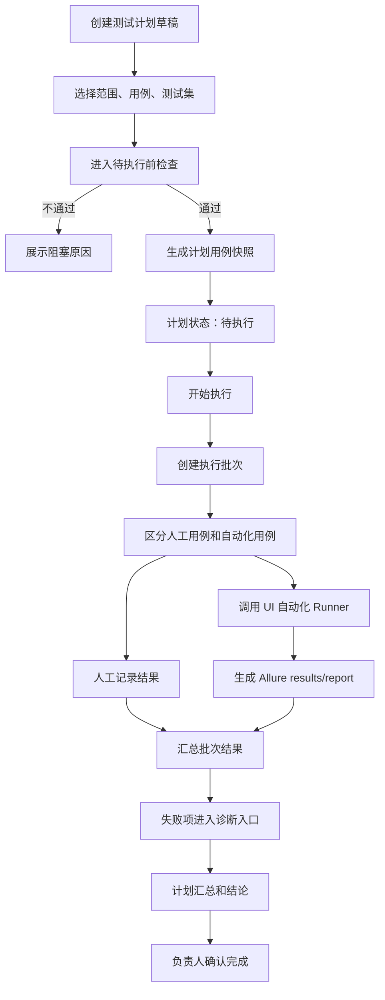

# 00-21 AI测试系统 - 测试计划 PRD

## 1. 这份文档解决什么问题

本文定义“测试计划”模块。测试计划用于围绕一次版本、迭代、变更、回归或上线前验证，组织测试范围、测试资产、执行配置、负责人、计划时间、执行批次和结果汇总。

核心规则：

- 测试计划是项目内的一次测试活动，必须归属单个项目。
- 测试计划可以引用已采纳的业务测试用例，也可以引用已存在的测试集。
- 测试计划不负责生成测试用例，不负责生成 UI 自动化代码，也不直接替代测试集。
- 测试计划用于回答“本次测什么、谁来测、在哪个环境测、什么时候测、执行到什么结果”。
- 测试集用于维护可复用的自动化执行集合；测试计划用于把一个或多个范围、测试集和手工检查项组织成一次可跟踪活动。
- 第一版测试计划以 UI 自动化和人工执行记录为主；接口自动化只保留 Soon 说明。
- 测试计划执行复用现有任务中心、UI 自动化本地 Runner、pytest + Playwright + Allure 报告链路。
- 计划内自动化执行失败后，失败诊断和自愈仍复用既有模块，不在测试计划内重新实现。

---

## 2. 业务边界

### 2.1 本模块负责

- 创建、编辑、复制、归档测试计划。
- 按项目、版本、迭代、变更范围、模块、风险、标签组织测试范围。
- 从已采纳业务测试用例中选择本次计划覆盖的用例。
- 引用已有测试集作为自动化执行集合。
- 维护计划负责人、参与人、计划开始时间、计划结束时间、测试环境和执行策略。
- 生成计划用例清单、执行批次、执行进度和计划结果。
- 记录人工执行结果、自动化执行结果、阻塞原因和风险结论。
- 从计划跳转到测试用例、测试集、UI 自动化运行、Allure 报告、失败诊断和报告中心。

### 2.2 本模块不负责

- 不负责生成业务测试用例。
- 不负责评审或采纳测试用例。
- 不负责生成 UI 自动化代码。
- 不负责补充 locator 或执行定向探索。
- 不负责维护可复用测试集内的用例顺序和启用状态。
- 不负责替代 Allure 展示执行步骤、截图、trace 和附件。
- 不负责外部 CI/CD 调度。
- 不负责外部缺陷系统对接。
- 不负责接口自动化计划执行，第一版只保留扩展字段和 Soon 说明。

---

## 3. 与测试用例、测试集、UI 自动化的关系

| 模块 | 定位 | 与测试计划关系 |
| --- | --- | --- |
| 测试用例 | 项目测试资产，回答“应该测什么” | 测试计划从已采纳用例中选择本次覆盖范围 |
| 测试集 | 可复用的 UI 自动化执行集合，回答“一组自动化用例如何重复跑” | 测试计划可以引用一个或多个测试集作为自动化批次来源 |
| UI 自动化 | 可执行代码、Runner 和 Allure 报告链路 | 测试计划调用既有 UI 自动化执行能力并汇总结果 |
| 报告中心 | 业务视角报告聚合 | 测试计划完成后向报告中心提供计划维度汇总和跳转 |
| 任务中心 | 异步任务状态与跳转 | 测试计划生成、执行和批次运行进入任务中心 |

说明：

- 测试计划不是测试集的重命名。
- 测试计划可以只包含人工测试用例，也可以只包含自动化测试集，也可以混合二者。
- 测试计划中引用测试集时，默认继承测试集当前启用用例；执行前必须生成本次计划快照，避免测试集后续编辑影响历史计划结果。
- 测试计划中的业务测试用例必须是“已采纳”状态；未采纳或待评审用例不能进入正式计划范围。
- 如果已采纳业务测试用例还没有 UI 自动化代码，可以进入计划的人工执行清单，但不能进入自动化执行批次。

---

## 4. 核心对象

### 4.1 测试计划

| 字段 | 说明 |
| --- | --- |
| 测试计划 ID | 系统生成，项目内唯一 |
| 测试计划名称 | 必填，例如“v1.2 登录与权限回归测试计划” |
| 所属项目 | 必填，测试计划不能跨项目 |
| 计划类型 | 冒烟、回归、版本验证、变更验证、上线前验证、专项测试 |
| 关联版本/迭代 | 可选，文本或后续版本对象 |
| 测试目标 | 本次计划要验证的业务目标 |
| 测试范围 | 模块、需求、变更、风险、标签等范围说明 |
| 不测范围 | 明确排除项 |
| 负责人 | 测试计划负责人 |
| 参与人 | 参与执行或评审的用户 |
| 环境 | 本地、测试、预发等文本配置 |
| 状态 | 草稿、待执行、执行中、已完成、已归档、已取消 |
| 风险等级 | 高、中、低 |
| 计划开始时间 | 可选 |
| 计划结束时间 | 可选 |
| 实际开始时间 | 首次执行或手动开始时记录 |
| 实际结束时间 | 计划完成时记录 |
| 用例总数 | 本计划快照中的用例数量 |
| 自动化用例数 | 可通过 UI 自动化执行的用例数量 |
| 人工用例数 | 需要人工记录结果的用例数量 |
| 最近结果 | 未执行、执行中、通过、部分失败、失败、阻塞、取消 |
| 创建人 | 创建测试计划的用户 |
| 更新时间 | 最近一次编辑时间 |

状态说明：

| 状态 | 说明 |
| --- | --- |
| 草稿 | 可编辑范围、人员、环境和用例，不允许生成正式结果 |
| 待执行 | 范围已确认，可开始执行 |
| 执行中 | 已存在进行中的人工或自动化执行批次 |
| 已完成 | 计划负责人确认本次测试结束并形成结果 |
| 已取消 | 计划不再执行，但保留历史记录 |
| 已归档 | 历史计划只读，不再编辑或执行 |

### 4.2 测试计划范围

| 字段 | 说明 |
| --- | --- |
| 范围 ID | 系统生成 |
| 测试计划 ID | 所属测试计划 |
| 范围类型 | 模块、需求、变更、标签、风险、测试集、手工补充 |
| 范围名称 | 展示名称 |
| 来源对象 ID | 可选，关联需求、模块、测试集或标签 |
| 范围说明 | 人工补充描述 |
| 是否纳入自动化 | 标记该范围是否期望自动化执行 |

### 4.3 测试计划用例快照

| 字段 | 说明 |
| --- | --- |
| 快照 ID | 系统生成 |
| 测试计划 ID | 所属测试计划 |
| 来源类型 | 业务测试用例、测试集用例、人工补充 |
| 来源用例 ID | 关联业务测试用例或 UI 自动化用例 |
| 来源测试集 ID | 如果来自测试集则记录 |
| 用例编号 | 创建快照时复制 |
| 用例标题 | 创建快照时复制 |
| 所属模块 | 创建快照时复制 |
| 优先级 | 创建快照时复制 |
| 风险等级 | 创建快照时复制 |
| 执行方式 | 人工、自动化、人工或自动化 |
| 是否本次执行 | 支持计划内临时排除 |
| 当前结果 | 未执行、通过、失败、阻塞、跳过 |
| 失败分类 | 产品 Bug、自动化代码问题、测试数据问题、环境问题、需求不清楚、未诊断 |
| 备注 | 执行说明、阻塞说明或人工记录 |

快照规则：

- 测试计划进入“待执行”前必须生成计划用例快照。
- 快照保存当时的用例标题、模块、优先级、风险等级和执行方式。
- 后续业务测试用例或测试集变更不直接改写历史计划快照。
- 如果计划仍处于草稿，用户可以刷新快照；刷新前必须展示新增、移除和变更差异。
- 已执行过的计划不允许静默刷新快照，只能追加补充批次或复制为新计划。

### 4.4 测试计划执行批次

| 字段 | 说明 |
| --- | --- |
| 批次 ID | 每次执行生成 |
| 测试计划 ID | 所属测试计划 |
| 批次名称 | 例如“第一轮回归”“修复后复测” |
| 执行类型 | 人工记录、自动化执行、混合执行 |
| 触发人 | 发起执行的用户 |
| 执行环境 | 本次执行环境 |
| 浏览器 | chromium、firefox、webkit，第一版默认 chromium |
| headed | 是否有头运行 |
| 重试次数 | pytest 重试策略 |
| 状态 | 排队中、执行中、通过、部分失败、失败、阻塞、执行错误、取消 |
| 总数 | 本批次实际执行用例数量 |
| 通过数 | 通过用例数 |
| 失败数 | 失败用例数 |
| 阻塞数 | 阻塞用例数 |
| 跳过数 | 跳过用例数 |
| Allure 报告路径 | 自动化批次生成后写入 |
| 开始时间 | 执行开始时间 |
| 结束时间 | 执行结束时间 |

---

## 5. 测试计划创建方式

### 5.1 手动创建

用户填写计划基本信息，并手动选择范围、测试用例或测试集。

适用场景：

- 新版本上线前回归。
- 指定模块专项测试。
- 临时验证一组高风险用例。
- 测试负责人需要精确控制计划内容。

### 5.2 从测试用例创建

用户在测试用例列表按模块、标签、风险、优先级或搜索结果筛选后，选择多条已采纳用例并点击“创建测试计划”。

规则：

- 只能选择当前项目下已采纳用例。
- 如果包含未自动化用例，默认进入人工执行清单。
- 如果包含已生成 UI 自动化代码的用例，可选择是否加入自动化批次。

### 5.3 从测试集创建

用户在测试集详情页点击“创建测试计划”，系统以该测试集当前启用用例生成计划草稿。

规则：

- 测试计划记录来源测试集。
- 创建计划时生成计划草稿，不立即执行。
- 执行前生成测试集用例快照。
- 测试集后续变更不影响已进入待执行或已执行的测试计划。

### 5.4 从变更影响范围创建

当知识库更新、需求版本变更或用例影响分析完成后，系统可以提供“创建回归测试计划”入口。

规则：

- 系统基于受影响模块、受影响需求点、受影响用例和风险等级生成建议范围。
- AI 只能生成计划草稿和建议原因，不能自动进入待执行。
- 用户必须确认范围、用例、环境和负责人后，计划才能进入待执行。

---

## 6. 测试计划生成输入

| 输入 | 说明 |
| --- | --- |
| 项目 | 测试计划所属业务边界 |
| 已采纳测试用例 | 正式计划范围的主输入 |
| 测试集 | 可复用的 UI 自动化执行集合 |
| 知识库版本 | 用于说明本次计划基于哪个项目知识版本 |
| 需求版本 | 用于说明本次计划覆盖哪个需求工作稿版本 |
| 变更影响分析 | 用于生成回归测试建议范围 |
| 项目环境配置 | URL、登录方式、账号说明、storage state |
| 历史运行结果 | 用于推荐高风险、最近失败或长期未执行用例 |

前置检查：

- 必须选择具体项目，不能在“全部项目”分区创建或执行计划。
- 正式计划至少包含一条本次执行用例或一个有效测试集。
- 进入待执行前，所有业务测试用例必须仍为已采纳状态。
- 自动化批次中的用例必须具备可执行 UI 自动化代码。
- 引用测试集时，测试集必须启用且至少存在一条启用的可执行用例。
- 如果计划范围包含已归档、不可执行或跨项目资产，系统必须阻止并展示原因。
- 如果计划时间缺失，可以保存草稿，但进入待执行时必须确认负责人和执行环境。

---

## 7. 执行流程

执行规则：

- 测试计划允许多轮执行批次，例如首轮回归、修复后复测、上线前冒烟。
- 每个批次必须保存独立结果，不覆盖历史批次。
- 自动化用例失败不终止整批执行。
- 人工用例可以逐条记录通过、失败、阻塞、跳过和备注。
- 混合执行时，人工结果和自动化结果在批次维度合并汇总。
- 计划结果由计划负责人确认完成，不因某个批次结束自动完成。
- 已完成计划可以复制为新计划，不能直接重新打开修改历史结果。

---

## 8. 页面设计

### 8.1 测试计划列表

入口位置：

- 左侧导航“测试资产”分组中，作为独立一级入口展示。
- 位置位于“测试用例”和“UI 自动化”之间。
- 第一版导航状态为 `Soon`，展示但不可进入正式功能。
- 路由预留：`/projects/:projectId/test-plans`。

展示：

- 测试计划名称。
- 计划类型。
- 关联版本/迭代。
- 状态。
- 负责人。
- 用例总数、自动化用例数、人工用例数。
- 最近结果。
- 计划开始时间、计划结束时间。
- 更新时间。

筛选：

- 状态。
- 计划类型。
- 负责人。
- 最近结果。
- 风险等级。
- 关键字。

操作：

- 新建测试计划。
- 复制测试计划。
- 编辑计划。
- 进入执行。
- 查看批次。
- 归档。

列表规则：

- 测试计划页面必须使用指定项目分区。
- 没有当前项目时展示项目选择空状态。
- 访客可以查看列表和详情，但不能新建、编辑、执行、归档或确认完成。

### 8.2 新建和编辑测试计划

表单内容：

- 测试计划名称。
- 计划类型。
- 关联版本/迭代。
- 测试目标。
- 测试范围。
- 不测范围。
- 负责人。
- 参与人。
- 计划开始时间。
- 计划结束时间。
- 执行环境。
- 风险等级。

范围选择：

- 按模块选择。
- 按需求或变更选择。
- 按标签选择。
- 按风险等级选择。
- 从测试用例列表选择。
- 从测试集选择。

保存规则：

- 草稿状态允许暂时缺少用例。
- 进入待执行前必须完成范围、用例、负责人和环境检查。
- 编辑已执行计划时，只允许修改说明、负责人、参与人和计划备注，不允许静默修改历史快照。

### 8.3 测试计划详情

展示：

- 基本信息。
- 测试目标和范围。
- 不测范围。
- 用例快照清单。
- 自动化批次入口。
- 人工执行清单。
- 执行批次历史。
- 最近结果摘要。
- 风险和阻塞项。
- Allure 报告入口。
- 失败诊断入口。

操作：

- 编辑计划。
- 生成或刷新快照。
- 进入待执行。
- 开始执行。
- 新增执行批次。
- 确认完成。
- 复制为新计划。
- 归档。

### 8.4 执行确认弹窗

展示：

- 当前项目名称。
- 测试计划名称。
- 本次执行批次名称。
- 执行类型。
- 本次执行用例数量。
- 自动化用例数量。
- 人工用例数量。
- 将被跳过或不可执行的用例清单。
- 环境、浏览器、headed、重试次数。

确认后：

- 创建测试计划执行批次。
- 自动化部分进入任务中心。
- 人工部分进入批次执行页面。

### 8.5 执行批次详情

展示：

- 批次状态、触发人、开始时间、结束时间、耗时。
- 总数、通过数、失败数、阻塞数、跳过数、通过率。
- 自动化运行记录。
- Allure 报告入口。
- 人工执行结果列表。
- 失败摘要和诊断入口。
- 阻塞说明。

人工记录规则：

- 人工执行结果必须逐条记录。
- 失败或阻塞必须填写原因。
- 可选上传截图或补充说明，第一版文件上传可以复用现有文件存储策略。
- 人工记录不修改业务测试用例评审状态。

---

## 9. 结果与报告

测试计划结果分为批次结果和计划结论。

批次结果：

- 每次执行批次生成独立结果。
- 自动化批次保存 Allure results、Allure report、截图、trace、video 路径。
- 人工批次保存逐条结果、备注和附件索引。
- 批次结果进入报告中心，可按测试计划筛选。

计划结论：

- 计划负责人在确认完成时填写结论。
- 结论应包含通过情况、主要失败、阻塞风险、建议动作和是否可发布。
- 计划完成不代表失败已修复，只代表本次测试活动已结束并形成结论。

计划结论建议字段：

| 字段 | 说明 |
| --- | --- |
| 是否通过 | 通过、不通过、有条件通过 |
| 质量结论 | 本次测试结论 |
| 主要风险 | 未关闭风险或阻塞项 |
| 发布建议 | 可发布、暂缓发布、需复测 |
| 后续动作 | 补充测试、修复 Bug、补充需求、更新知识库、更新用例 |

---

## 10. 权限规则

| 角色 | 权限 |
| --- | --- |
| 管理员 | 可创建、编辑、复制、归档、执行、确认完成所有可见项目的测试计划 |
| 测试工程师 | 可创建、编辑、复制、归档、执行、确认完成分配项目内的测试计划 |
| 访客 | 只读查看测试计划、用例快照、执行批次、计划结论和报告入口 |

高风险动作：

- 进入待执行前必须展示测试计划范围、用例数量和环境。
- 刷新用例快照必须展示新增、移除和变更差异。
- 归档测试计划必须二次确认。
- 取消执行中的批次必须二次确认，并保留已产生结果。
- 确认完成计划必须展示失败、阻塞和未执行用例数量。

---

## 11. SQLite 存储策略

SQLite 保存：

- 测试计划主表。
- 测试计划范围表。
- 测试计划用例快照表。
- 测试计划执行批次表。
- 测试计划批次逐条结果表。
- 计划结论、执行参数、汇总状态、报告路径和失败摘要。

文件系统保存：

- pytest 日志。
- Allure results。
- Allure report。
- 截图、trace、video。
- 人工执行附件。

说明：

- 测试计划快照、批次结果和计划结论必须入库，不能只依赖文件系统。
- 大文件、报告目录和附件按既有文件存储策略保存路径和元数据。

---

## 12. 验收标准

- 左侧导航“测试资产”分组中，“测试计划”作为一级入口位于“测试用例”和“UI 自动化”之间，状态为 `Soon`。
- 测试计划页面只能在指定项目下使用，不能在“全部项目”分区执行写操作。
- 用户可以创建测试计划草稿，并填写目标、范围、负责人、时间和环境。
- 用户可以从已采纳测试用例创建测试计划。
- 用户可以从测试集创建测试计划。
- 用户可以从变更影响范围创建回归测试计划草稿。
- 待评审和不采纳测试用例不能进入正式测试计划范围。
- 未生成 UI 自动化代码的已采纳用例可以进入人工执行清单，但不能进入自动化批次。
- 测试计划进入待执行前必须生成用例快照。
- 测试计划快照必须保留创建时的用例编号、标题、模块、优先级、风险等级和执行方式。
- 测试计划可以创建多轮执行批次。
- 自动化批次必须复用 UI 自动化 Runner 和 Allure 报告链路。
- 人工执行结果必须支持逐条记录通过、失败、阻塞、跳过和备注。
- 失败或阻塞的人工结果必须填写原因。
- 自动化用例失败不终止整个批次。
- 执行完成后必须能查看批次汇总、逐条结果、Allure 报告入口和失败诊断入口。
- 测试计划完成必须由负责人手动确认，并填写计划结论。
- 报告中心必须支持按测试计划筛选或查看计划相关运行结果。
- 任务中心必须展示测试计划执行批次任务和跳转入口。
- 访客只能查看，不能创建、编辑、执行、归档、取消批次或确认完成测试计划。
