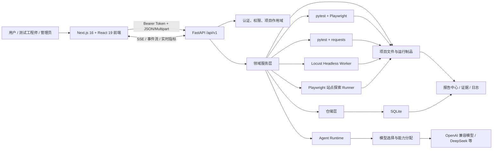
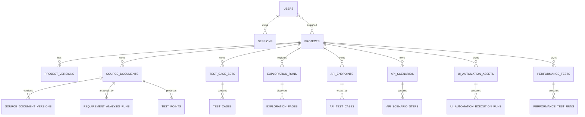

# AI 测试平台——面试介绍与模块实现详解

> 文档用途：用于技术面试、项目答辩、系统演示和架构复盘。  
> 事实基线：以 2026-08-06 仓库源码为准，重点核对 `apps/frontend/src/`、`apps/backend/app/`、`apps/backend/app/seed/schema.py`。  
> 平台规模：前端约 63 个页面路由；后端 `/api/v1` 下约 257 个 HTTP 接口；SQLite 主模式与 UI 自动化仓储共覆盖约 70 余张业务表；AI 能力注册表包含 12 类能力。

---

## 1. 面试开场：先用一句话说清楚平台

这是一个以“项目”为业务隔离单元、以“需求”为测试输入、以 AI Agent 为智能生产力、以 Playwright、pytest、requests 和 Locust 为执行引擎的全流程 AI 测试平台。

它不是单点的“AI 生成用例工具”，而是把下面这条质量链路串成一个闭环：

```text
项目与环境配置
  → 需求文档上传、转换、版本化
  → AI 需求理解、澄清、标准化
  → 站点探索与页面资产沉淀
  → 测试点和手工用例生成、评审
  → API/UI 自动化资产生成
  → 自动化与性能测试执行
  → 报告、失败诊断、自愈修复
  → 任务、日志、知识库持续沉淀
```

如果面试官只给 30 秒，可以这样介绍：

> 我负责的是一个 AI 驱动的测试全生命周期平台。前端使用 Next.js 和 React，后端使用 FastAPI、SQLite 和本地制品存储。平台从需求文档和被测站点出发，先完成需求分析、页面探索和知识沉淀，再生成测试点、手工用例、API/UI 自动化代码，并用 pytest、Playwright、requests、Locust 执行。执行结果进入统一任务中心和报告中心，失败后还能通过 Agent 做证据驱动的诊断和候选修复。系统重点解决的不是单次生成，而是资产版本化、任务可恢复、结果可审计和人机协同评审。

---

## 2. 平台解决了什么问题

### 2.1 传统测试流程的痛点

1. 需求文档格式杂乱，需求理解依赖个人经验，容易漏测。
2. 测试点、手工用例、自动化脚本之间重复录入，资产无法追溯。
3. UI 自动化依赖页面元素和登录态，生成脚本很容易脱离真实站点。
4. 接口文档、接口用例、自动化脚本、业务场景通常分散在不同工具中。
5. 自动化失败后，定位是数据问题、环境问题、脚本问题还是产品问题成本很高。
6. AI 生成内容如果直接覆盖正式资产，缺少版本、评审和回滚机制，风险较大。
7. 长任务中断后如果没有状态恢复，用户会看到任务永久卡在“运行中”。

### 2.2 平台的核心设计目标

- **统一输入**：需求文档、站点探索结果、接口文档、项目知识库都进入同一项目上下文。
- **统一资产**：需求版本、测试点、测试用例、自动化脚本、场景、报告均可追踪。
- **统一智能能力**：通过 capability 到模型的分配，而不是在每个业务模块中硬编码模型。
- **统一执行**：后端负责调度，pytest/Playwright/requests/Locust 负责实际执行。
- **统一任务视图**：不同模块的运行记录投影为同一种任务模型。
- **统一审计**：接口访问、业务操作、前端错误和清理策略进入日志体系。
- **人机协同**：AI 输出先成为草稿、建议、差异或候选方案，再由用户确认应用。

---

## 3. 总体架构



### 3.1 前端层

- 使用 Next.js App Router 管理页面路由和布局。
- React 负责交互，Zustand 管理登录态、项目上下文和用户偏好。
- `api-client.ts` 统一封装请求、鉴权、错误处理和部分 SSE 连接。
- 页面不是纯表格 CRUD，还包含需求 Markdown 预览、AI 评审抽屉、自动化运行详情、性能图表、差异确认、实时日志等复杂交互。
- 前端通过项目切换器维护 `all` 或具体 `projectId` 作用域，项目型模块使用 `/projects/{projectId}/...` 路由。

### 3.2 后端接口层

- `app/main.py` 创建 FastAPI 应用，注册 CORS、统一响应和异常中间件。
- `app/api/v1/__init__.py` 聚合认证、项目、需求、探索、知识库、用例、API/UI 自动化、性能、任务、报告、日志、模型和 Agent 等路由。
- 路由层主要做参数接收、依赖注入、权限校验和服务调用，不承载复杂业务算法。

### 3.3 领域服务层

- `app/services/` 按业务域组织，是主要业务编排位置。
- 服务层负责状态机、事务边界、文件处理、Agent 调用、Runner 调度、任务恢复和结果聚合。
- 对复杂模块进一步拆分，例如接口自动化包含导入解析、用例生成、场景编译、执行、报告、Oracle、自愈等子模块。

### 3.4 仓储和数据层

- 使用 Python 原生 `sqlite3`，通过 `app/repositories/` 封装 SQL。
- SQLite 保存结构化元数据、状态、关联关系和统计结果。
- 大文件、Markdown、自动化工程、日志、截图、报告等存储在本地文件系统。
- 这种“数据库 + 文件制品”的混合模式避免把大量执行产物塞进数据库，同时保留可查询的元数据。

### 3.5 Agent Runtime

- `app/agents/capabilities.py` 注册 12 类 AI 能力。
- `app/agents/model_selection.py` 根据 capability 查询模型分配，构建 OpenAI 兼容或 DeepSeek 模型客户端。
- 各业务 Agent 只声明自己的任务、结构化输出和技能，不直接关心模型供应商。
- `app/agents/shared/skill_runtime.py` 加载 `SKILL.md` 及引用资料，形成可执行技能。
- 结构化输出、工具调用修复、thinking 开关兼容等横切能力集中在共享模块中。

### 3.6 执行器层

- UI 自动化：pytest + Playwright。
- API 自动化：pytest + requests + pytest-json-report。
- 性能测试：Locust headless 子进程。
- 页面探索：Playwright Runner 与浏览器会话脚本。
- 执行器产生的代码、事件、截图、JSON 报告、统计和日志统一落到项目制品目录。

---

## 4. 技术栈与选型理由

| 层次 | 技术 | 在系统中的作用 | 面试时可强调的选型理由 |
| --- | --- | --- | --- |
| 前端框架 | Next.js 16、React 19、TypeScript | 页面、路由、交互 | App Router 适合复杂后台系统，TypeScript 保证接口契约可维护 |
| UI 与样式 | Tailwind CSS 4、shadcn、Radix UI | 管理后台组件体系 | 可访问性和组合能力好，便于统一设计语言 |
| 状态管理 | Zustand | 登录态、项目上下文、偏好 | 轻量，避免为少量全局状态引入重型框架 |
| 表单与校验 | React Hook Form、Zod | 表单状态和前端校验 | 高性能表单与类型化校验 |
| 图表与流程 | Recharts、XYFlow、Dagre、Mermaid | 性能图表、场景编排和流程展示 | 适合测试平台中的时间序列、拓扑和可视化编排 |
| 后端框架 | Python 3.12、FastAPI、Pydantic | HTTP 接口、参数校验 | AI、自动化测试生态集中在 Python，FastAPI 对异步和类型支持较好 |
| 数据库 | SQLite + 仓储层 | 元数据和任务状态 | 当前是单机/内网平台，部署简单；仓储层为未来替换数据库保留 seam |
| AI 编排 | LangChain、deepagents | Agent、工具、结构化输出 | 便于组合模型、工具和技能，并与业务状态机解耦 |
| 文档解析 | PyMuPDF、python-docx | PDF/Word 转换 | 将需求统一转换为 Markdown，降低后续 Agent 输入差异 |
| UI 执行 | pytest-playwright | 页面自动化 | pytest 生态成熟，Playwright 等待、隔离和浏览器能力更强 |
| API 执行 | pytest、requests、pytest-json-report | 接口脚本执行和报告 | 生成代码可读、可维护，也可脱离平台运行 |
| 性能执行 | Locust | 并发与负载测试 | Python DSL 易于由 Agent 生成，支持 headless 和事件钩子 |
| 日志 | Loguru | 应用、任务和访问日志 | 配置简洁，便于结构化记录和敏感字段脱敏 |

---

## 5. 仓库结构怎么讲

```text
apps/
├─ frontend/                 Next.js 前端
│  ├─ src/app/               页面路由与布局
│  ├─ src/components/        通用 UI 与 AI 测试业务组件
│  ├─ src/lib/api-client.ts  后端请求入口
│  ├─ src/stores/            登录、项目上下文、偏好
│  └─ tests/                 前端契约测试
├─ backend/                  FastAPI 后端
│  ├─ app/api/v1/            HTTP 路由
│  ├─ app/services/          领域业务编排
│  ├─ app/repositories/      SQLite 数据访问
│  ├─ app/agents/            Agent、技能和模型选择
│  ├─ app/schemas/           Pydantic 输入输出模型
│  ├─ app/core/              配置、数据库、安全、响应、存储、日志
│  ├─ app/seed/              数据库建表和初始化
│  ├─ runners/               Node/浏览器辅助 Runner
│  └─ tests/                 后端测试
├─ start/                    Windows/macOS 启停脚本
docs/                        产品、架构、前端、计划与规格文档
docker/                      Dockerfile、Compose、入口脚本
openspec/                    历史和在途变更设计
```

面试时可以强调：系统按业务域拆分，但没有为了“微服务”而微服务。当前用单体部署保持开发效率，同时通过路由、领域服务、仓储、Agent、Runner 等 seam 控制模块耦合，未来某个执行域需要独立扩容时可单独拆出。

---

## 6. 横切机制：这是系统技术含量最高的部分

### 6.1 统一响应与异常处理

`app/core/response.py` 中间件负责：

1. 捕获未处理异常，避免直接返回框架默认错误页面。
2. 将普通 JSON 响应包装为统一业务响应。
3. 对 SSE、文件下载等流式响应做透传，不能把事件流包装成普通 JSON。
4. 记录 trace、请求路径、查询参数、状态码和耗时。
5. 统一返回 trace header，方便前端报错与后端日志关联。

这部分的关键点是：统一响应不能破坏流式接口和二进制下载，所以中间件必须根据内容类型和响应类型判断是否透传。

### 6.2 认证与权限

- 登录后生成随机会话 token，写入 `sessions` 表；实现不是无状态 JWT。
- 前端通过 `Authorization: Bearer <token>` 调用接口。
- 后端依赖从 token 查询有效会话和用户，并校验账号是否启用。
- 管理功能通过 `require_admin` 限制。
- 项目型业务还会在服务层检查用户是否拥有该项目的可见或可写权限。
- Locust Web UI 的特殊访问场景支持通过 Cookie 复用会话，但仍进入同一用户校验逻辑。

### 6.3 项目作用域

- 项目是需求、探索、环境、知识、用例、自动化和性能测试的聚合根。
- 前端 `project-context-store.ts` 管理当前项目，并将项目型导航解析为 `/projects/{projectId}`。
- 后端多数业务接口以 `/projects/{project_id}/...` 作为路径前缀。
- 控制台、任务和报告允许全局聚合；具体资产创建和编辑必须落到确定项目。

### 6.4 数据库与文件制品的双存储

数据库适合保存：

- 实体 ID、名称、状态、创建人、时间戳。
- 项目、版本、环境和资产关联。
- 任务运行状态、统计数据、报告索引。
- Agent 运行状态、评审结果和修复状态机。

文件系统适合保存：

- 原始需求文件和转换后的 Markdown。
- 页面探索快照、YAML/JSON 资产和截图。
- pytest 工程、Locust 脚本和数据文件。
- 执行日志、JSON 报告、差异、截图和视频证据。

`app/core/storage.py` 将数据库中的存储路径尽量保存为相对项目根目录的路径，并兼容历史绝对路径和 Windows 路径迁移。

### 6.5 长任务状态机

长任务一般遵循以下模式：

```text
创建运行记录 pending
  → 后台线程/BackgroundTask 接管
  → running
  → 持续写事件、日志和中间制品
  → succeeded / failed / stopped / interrupted
  → 任务中心和报告中心聚合展示
```

这样做的好处：

- HTTP 请求不需要一直阻塞。
- 用户刷新页面后仍能查询任务。
- 服务重启后可根据数据库状态做恢复或标记中断。
- 每个步骤都有证据，便于诊断和审计。

### 6.6 启动恢复与资源清理

`app/main.py` 的启动阶段会：

1. 初始化数据库。
2. 恢复陈旧性能运行。
3. 恢复或终止异常中断的页面探索任务。
4. 恢复需求分析、测试点、测试用例生成任务。
5. 恢复 API/UI 自动化任务。
6. 准备 UI 自动化后台任务。
7. 调度保留策略清理。

关闭阶段会关闭探索事件总线、停止清理线程、终止 UI 自动化后台资源，并兜底清理遗留浏览器会话子进程。

这是面试中很值得讲的点：AI 和自动化平台的任务通常运行很久，必须把“进程生命周期”和“业务任务生命周期”分开设计。

### 6.7 SSE 与实时事件

平台在页面探索、UI 自动化和性能测试等场景使用 SSE 或事件流：

- 后端不断写入状态、步骤、日志、指标或浏览器画面信息。
- 前端订阅事件后增量更新，而不是高频全量轮询。
- 断线后前端可以重新查询运行详情，以数据库和落盘事件作为最终事实源。
- SSE 是用户体验通道，不应成为唯一持久化通道。

### 6.8 AI 能力与模型解耦

当前注册的 AI capability 包括：

1. `document_editor`
2. `requirement_standardization`
3. `requirement_analysis`
4. `knowledge_query`
5. `test_case_generation`
6. `test_point_generation`
7. `api_test_generation`
8. `api_scenario_orchestration`
9. `ui_test_generation`
10. `page_exploration`
11. `performance_script_generation`
12. `performance_report_analysis`

模型配置模块维护 provider 和 capability 分配。业务模块通过 capability 获取模型，不直接写死模型名、Base URL 或 API Key。这使同一个平台可以让需求分析使用推理能力更强的模型，让普通文本整理使用成本更低的模型。

### 6.9 Skill 驱动的 Agent

Agent 不是只靠一段超长 Prompt：

- 每个 Agent 可以绑定自己的 `SKILL.md`。
- Skill 再按需引用生成规则、断言指南、项目结构、诊断证据优先级等资料。
- Agent 输出使用 Pydantic/结构化模型约束。
- 业务服务负责校验、持久化和状态推进，不能把数据库写入完全交给模型自由决定。

这形成三层责任：

```text
Skill：告诉模型怎样完成专业任务
Agent：组织模型、工具和结构化输出
Service：控制业务状态、权限、事务、校验和持久化
```

---

## 7. 模块一：用户、认证与权限

### 7.1 功能

- 登录、退出、查询当前用户。
- 用户创建、编辑、禁用和删除。
- 角色：admin、tester、guest。
- 用户与项目分配。

### 7.2 实现链路

```text
登录页
  → POST /api/v1/auth/login
  → auth_service 校验用户名和密码哈希
  → 创建 sessions 记录和随机 token
  → 前端 auth-store 持久化 token、用户信息
  → api-client 自动追加 Bearer Token
  → current_user 依赖查询有效会话
```

### 7.3 关键设计

- 密码通过 PBKDF2 类哈希逻辑处理，数据库不保存明文。
- token 是服务端会话凭证，可以主动退出和失效。
- 用户禁用后，即使旧 token 仍存在，也会在当前用户依赖中被拒绝。
- 管理权限和项目权限分层：管理员权限由依赖控制，项目权限由业务服务控制。

### 7.4 主要表

- `users`
- `sessions`

### 7.5 面试亮点

不要只说“做了登录”。要强调服务端会话、账号状态二次校验、项目级授权和前端 401 清理逻辑共同构成完整认证闭环。

---

## 8. 模块二：项目、项目版本与环境管理

### 8.1 项目管理

项目模块负责：

- 项目 CRUD。
- 项目成员/测试人员分配。
- 项目状态管理。
- 当前版本摘要。
- 页面探索目标的 AI 优化。

项目是平台中最重要的业务隔离维度，绝大多数测试资产必须属于项目。

### 8.2 项目版本

项目版本用于把需求、测试资产和发布批次建立关系。一个项目可以有多个语义版本，需求文档可绑定项目版本，便于回答：某一版需求对应哪些测试点、用例和自动化结果。

主要表：

- `projects`
- `project_versions`

### 8.3 环境管理

环境记录被测系统的基础地址、认证模式、账号配置和可复用登录态。

环境服务负责：

- 创建和更新环境。
- 规范化认证配置。
- 触发自动登录。
- 判断配置变化后是否需要清除旧登录态。
- 删除环境时清理认证文件。

登录态不是直接把密码暴露给所有 Runner，而是由环境认证流程生成 Playwright storage state，后续页面探索和 UI 自动化复用。

主要表：

- `project_environments`
- `api_test_environments`

### 8.4 自动认证

自动认证链路大致是：

```text
选择项目环境
  → 分析登录页面/登录表单
  → 根据认证模式填写账号、密码、验证码等
  → 登录成功后保存 cookies、localStorage、IndexedDB 等状态
  → 后续探索/UI 自动化加载 storage state
  → 根据 cookie/JWT 过期时间判断是否仍可复用
```

平台还接入 `ddddocr` 处理部分验证码场景，并保留手动认证入口应对复杂登录。

---

## 9. 模块三：需求文档上传、转换与版本管理

### 9.1 为什么先统一成 Markdown

需求可能来自 Word、PDF 或 Markdown。模型直接处理不同格式会导致解析差异，因此先执行：

```text
原始文件
  → 分片上传
  → 文件校验与落盘
  → PDF/Word/Markdown 解析
  → 统一 Markdown
  → 文档版本
  → 需求分析
```

### 9.2 分片上传

`upload_sessions.py` 实现上传会话：

- 限制文件数量、单文件大小、批次总大小。
- 每个用户限制活跃上传会话数。
- 按 part number 保存分片。
- 完成时检查缺失分片、合并并计算 SHA-256。
- 会话有 TTL，可取消和定期清理。

这比直接上传大文件更可靠，前端可以显示进度，也能为重试和断点续传保留空间。

### 9.3 文档和文件映射

一个需求文档可以关联多个源文件，并指定主需求文件。数据库主要保存：

- `source_documents`
- `source_document_versions`
- `source_document_file_mappings`
- `document_version_change_logs`

文件本体和 Markdown 落在项目需求目录，数据库保存路径、版本和元数据。

### 9.4 版本管理

- 每次内容变化可形成文档版本。
- 支持查看版本详情、切换当前版本。
- 文档可绑定项目版本。
- 删除和更新需要同时处理数据库映射与文件制品。

### 9.5 面试亮点

需求模块不是“上传后调用一次 LLM”，而是把输入治理、可追溯版本、原文/Markdown 双视图、文件校验和后续分析触发组合成稳定流水线。

---

## 10. 模块四：需求分析、澄清与标准化

### 10.1 目标

把非结构化需求转化为可测试、可评审、可继续生成测试资产的标准化需求知识。

### 10.2 分阶段处理

```text
Markdown 原文
  → 初步理解
  → 发现歧义、缺失约束和不可测试描述
  → 生成澄清问题
  → 用户回答
  → 将答案合并回分析 Markdown
  → 最终化/标准化
  → 生成可供测试点和用例使用的稳定版本
```

### 10.3 业务实现

- `requirement_analysis` Agent 负责理解和提出澄清。
- `requirement_standardization` Agent 负责标准化表达。
- `requirement_finalization` Agent 负责将用户确认内容整合为最终稿。
- 服务层维护分析运行、澄清答案和最终化运行。
- 澄清答案不会只存在对话里，而是结构化保存并写回分析 Markdown 的对应位置。

### 10.4 主要表

- `requirement_analyses`
- `requirement_analysis_runs`
- `requirement_clarification_answers`
- `requirement_finalization_runs`

### 10.5 状态与恢复

运行状态会进入任务中心。服务启动时会扫描异常停留在运行态的记录，根据超时和中断规则恢复或标记失败，避免永久卡住。

### 10.6 面试亮点

需求分析强调“人机协同闭环”：AI 负责发现问题，用户负责确认业务事实，服务层负责把确认结果稳定写回，而不是让模型猜业务。

---

## 11. 模块五：站点探索

### 11.1 目标

站点探索不是简单爬虫，而是为测试生成建立真实页面知识：页面、元素、操作、模块、跳转、阻塞项、截图和覆盖状态。

### 11.2 探索链路

```text
选择项目与环境
  → 加载认证状态
  → 打开起始 URL
  → 获取页面快照和可交互元素
  → Agent/决策器选择下一动作
  → 点击、填写、跳转或返回
  → 保存页面、元素、动作和证据
  → 计算模块与动作覆盖
  → 形成探索报告和可复用页面资产
```

### 11.3 Loop 探索实现

`page_exploration/loop/service.py` 维护循环状态：

- 读取断点状态，支持 resume。
- 将快照中的元素转成候选动作。
- 对集合型元素选择代表候选，避免列表中每一行都重复点击。
- 过滤禁止路径和高风险动作。
- 执行决策并写入时间线事件。
- 持久化页面快照和已验证动作覆盖。
- 根据页面身份和稳定 key 合并制品，降低动态 DOM 造成的重复。

### 11.4 抗卡死策略

- 最大步骤和时间限制。
- 重复页面/重复动作检测。
- forbidden path。
- blocker 记录。
- 浏览器命令超时。
- 中断恢复和 resume。

### 11.5 主要表

- `exploration_runs`
- `exploration_module_coverages`
- `exploration_pages`
- `exploration_blockers`
- `exploration_artifacts`
- `exploration_document_versions`

### 11.6 输出价值

探索结果会被知识问答、手工用例生成和 UI 自动化生成复用。因此它是“真实系统状态”与“AI 生成测试资产”之间的证据层。

---

## 12. 模块六：项目知识库与全局知识库

### 12.1 两类知识

- **项目知识**：需求、探索页面、测试用例、接口信息等项目内资产的聚合检索。
- **全局知识**：公司规范、测试规范、公共业务知识和共享文件。

### 12.2 全局知识库

支持知识库、文件夹和文件管理：

- 创建、重命名、删除知识库。
- 创建文件夹。
- 上传和更新 Markdown 文件。
- 建立树结构。
- 写文件时使用临时文件和锁，失败时恢复，避免产生半写入文件。

主要表：

- `global_knowledge_bases`
- `global_knowledge_folders`
- `global_knowledge_vault_files`

### 12.3 项目知识问答

查询时服务层根据知识源设置收集上下文：

- 需求文档与分析结果。
- 页面探索资产。
- 测试用例。
- API 信息。
- 选定的公司知识库。

然后调用 knowledge Agent，并通过 SSE 返回增量内容。对话和消息持久化到：

- `knowledge_conversations`
- `knowledge_conversation_messages`

### 12.4 设计重点

平台当前更接近“受控上下文组装 + Agent 问答”，而不是完全依赖独立向量数据库。优点是来源透明、容易审计；代价是上下文规模需要控制，因此提供知识源开关和项目范围设置。

---

## 13. 模块七：测试点生成

### 13.1 测试点的定位

测试点处于需求和测试用例之间，用来回答“要测什么”，而测试用例回答“具体怎么测”。

### 13.2 生成流程

```text
需求当前版本
  → 提取 requirement obligations
  → Agent 生成测试点
  → 结构化校验
  → 写入测试点和覆盖义务关系
  → Markdown 总览
  → 用户编辑、删除或补充
```

### 13.3 主要表

- `test_point_generation_runs`
- `test_points`
- `test_point_requirement_obligations`
- `test_point_obligations`

### 13.4 关键设计

- 先提取需求义务，再生成测试点，便于做覆盖追踪。
- 测试点既有结构化记录，也有 Markdown 视图。
- 支持单点修改、删除和整体 Markdown 保存。
- 运行状态进入任务中心并支持中断恢复。

### 13.5 面试亮点

不是让模型“一次生成一堆条目”，而是通过 requirement obligation 建立测试点与需求约束的可解释关联。

---

## 14. 模块八：测试用例管理与 AI 生成

### 14.1 用例类型

- AI 生成的测试用例集。
- 手工维护的测试用例。
- 用例评审状态：采纳、拒绝等。
- XMind 导出。

### 14.2 AI 生成链路

```text
选择需求/测试点/探索上下文
  → 创建 test case set 和 generation run
  → Agent 分批生成结构化用例
  → 冲突与重复检查
  → 校验步骤、预期结果、优先级
  → 持久化
  → 用户评审
```

Agent 生成失败或结构不合规时，服务会进行有限重试，而不是无限调用模型。

### 14.3 探索上下文增强

手工用例 AI 生成模块会构造 exploration context，把真实页面、模块和操作加入提示，使步骤更接近可执行系统，而不是只依据需求编造页面元素。

### 14.4 主要表

- `test_case_sets`
- `test_case_generation_runs`
- `test_cases`
- `manual_test_cases`

### 14.5 被拒绝用例知识

平台还设计了 rejected case knowledge：被拒绝的用例及原因可以沉淀为知识，在未来生成时检索，减少重复犯错。这体现了从“生成工具”到“反馈学习系统”的演进方向。

---

## 15. 模块九：UI 自动化

### 15.1 目标

将页面探索、测试用例和环境认证状态转成可运行、可维护、可修订的 pytest + Playwright 工程。

### 15.2 资产模型

- generation run：一次生成任务。
- asset：生成后的 UI 自动化资产。
- revision run：对已有资产的修订。
- execution run：一次真实执行。

主要表：

- `ui_automation_generation_runs`
- `ui_automation_assets`
- `ui_automation_execution_runs`

### 15.3 生成链路

```text
选择项目、环境、测试用例/探索资产
  → UI Agent 规划测试套件
  → pytest-playwright Skill 约束项目结构和代码规则
  → renderer 生成工程文件
  → collection 校验测试收集
  → 保存为可版本化资产
```

### 15.4 执行链路

```text
创建 execution run
  → 复制/定位自动化资产工作区
  → 注入环境地址和认证状态
  → 启动 pytest
  → 插件捕获测试步骤和事件
  → 保存日志、截图、JSON 结果
  → 更新 run 状态和统计
```

### 15.5 实时能力

- 运行日志。
- 步骤事件。
- 步骤截图和制品。
- live view 元数据和流。
- 停止运行。

### 15.6 设计重点

- 自动化代码是正式资产，不是一次性字符串。
- 生成和执行分离，同一资产可以多次运行。
- 修订生成新 revision，而不是静默覆盖。
- 执行结果保留证据，便于人工判断是脚本失败还是产品失败。

---

## 16. 模块十：接口自动化

这是当前平台功能最密集的模块之一，可分为六层。

### 16.1 接口资产导入

支持从接口文档导入端点，解析器包括：

- OpenAPI。
- AsyncAPI。
- 通用接口文档解析。
- 多协议接口资产的扩展解析。

导入后保存文档与端点：

- `api_documents`
- `api_endpoints`

端点包含 method、path、请求参数、请求体、响应 Schema、示例等信息。

### 16.2 接口调试

用户可选择环境，填写路径参数、查询参数、Header 和 Body，后端组装真实 HTTP 请求并返回响应。该能力同时用于验证接口资产是否可执行，并为后续生成提供真实样例。

### 16.3 AI 测试用例生成

```text
接口定义 + 请求示例 + 环境信息 + Oracle facts
  → case generation planner
  → Agent 生成正向、边界、异常、安全等用例
  → response contract 校验
  → generation item 逐项记录成功/失败和重试
  → 保存 case set、case、case version
```

主要表：

- `api_generation_runs`
- `api_generation_items`
- `api_generation_item_attempts`
- `api_test_case_sets`
- `api_test_cases`
- `api_test_case_versions`

### 16.4 Oracle 与人工确认

接口断言不能完全由模型猜，因此平台维护：

- `api_endpoint_oracle_facts`：已确认的接口事实。
- `api_oracle_proposals`：Agent 建议的新事实。

Proposal 需要用户 approve 或 reject，再进入正式 Oracle。这是避免 AI 把偶然响应当成稳定业务规则的重要机制。

### 16.5 pytest + requests 脚本生成与执行

```text
API cases
  → pytest-requests Skill
  → renderer 生成项目结构、fixtures、数据和测试文件
  → collection 验证 pytest 可收集
  → 创建 api_test_scripts
  → 执行 pytest + pytest-json-report
  → 解析日志、用例结果、报告和场景结果
```

主要表：

- `api_script_generation_runs`
- `api_test_scripts`
- `api_automation_runs`

### 16.6 场景编排

接口场景把多个接口步骤组合为业务链路，例如“登录 → 创建订单 → 查询订单 → 删除订单”。

平台支持：

- 场景和步骤 CRUD。
- 前置参数绑定。
- 响应提取器。
- 变量传递。
- 条件和断言。
- 场景校验。
- revision 和 restore。
- AI plan → review → apply。
- 单场景执行。
- 场景套件和批量运行。

主要表：

- `api_scenarios`
- `api_scenario_steps`
- `api_scenario_revisions`
- `api_scenario_ai_plans`
- `api_scenario_suites`
- `api_scenario_suite_items`
- `api_batch_runs`

### 16.7 编译与运行

`orchestration_compiler.py` 将可视化场景编译成可执行请求计划：

- 解析步骤依赖。
- 从环境、固定值、前序响应中解析变量。
- 校准提取器。
- 处理 Header、Query、Path、Body 的绑定。
- 校验目标字段 Schema。
- 生成最终请求和断言。

这个编译层非常重要：前端编排模型不能直接等同于 HTTP 请求，必须经过确定性编译和校验，避免把全部执行逻辑交给 Agent。

---

## 17. 模块十一：接口失败诊断与自愈

### 17.1 为什么需要独立状态机

自动化失败并不等于脚本错误，可能是：

- 产品缺陷。
- 环境不可用。
- 认证过期。
- 测试数据失效。
- 接口契约变化。
- 断言过时。
- 脚本实现错误。

因此不能看到失败就自动改代码。

### 17.2 自愈流程

```text
失败的 api run
  → 创建 repair session
  → 收集日志、报告、请求响应、代码和环境证据
  → diagnosis Agent 分类根因
  → repair Agent 生成候选补丁
  → 创建 repair attempt
  → 在隔离 revision/workspace 验证
  → 展示 diff、日志和报告
  → 用户 approve/apply 或 reject/discard
  → 必要时 rollback
```

主要表：

- `api_repair_sessions`
- `api_repair_attempts`

### 17.3 安全边界

- 修复先在隔离工作区进行。
- 用户可以查看 diff。
- 候选修复和正式应用分离。
- 支持丢弃、拒绝和回滚。
- 诊断 Skill 定义证据优先级和分类规则，防止仅凭一条错误文本下结论。

### 17.4 面试亮点

真正的“自愈”不是模型直接改生产脚本，而是证据收集、原因分类、候选修复、隔离验证、人工确认、应用与回滚组成的受控状态机。

---

## 18. 模块十二：性能测试

### 18.1 性能测试资产

- performance test：场景配置、并发、持续时间、目标接口和阈值。
- performance script：生成的 Locust 脚本。
- performance run：一次负载执行。
- analysis session：一次 AI 分析。

主要表：

- `performance_tests`
- `performance_test_scripts`
- `performance_test_runs`
- `performance_test_run_stats`
- `performance_test_run_failures`
- `performance_test_run_exceptions`
- `performance_test_run_events`
- `performance_analysis_sessions`

### 18.2 配置与校验

创建性能测试时会校验：

- 最大用户数、spawn rate 和持续时间。
- 项目、接口、场景、环境等引用是否有效。
- 正向用例和成功状态规则。
- 环境管理 Header 与请求参数冲突。
- SSE 指标和终止规则。

### 18.3 脚本生成

性能脚本 Agent 根据接口/场景和负载配置生成 Locust 代码。Skill 规定项目结构、Locust 编码模式和执行指南。生成后先保存脚本资产，再由运行模块执行。

### 18.4 Headless 执行

```text
创建 run
  → 检查并发运行上限
  → 生成运行时 locustfile
  → 启动独立 Locust 子进程
  → 事件钩子采集 request/user_error
  → 周期写入统计和 SSE 事件
  → 达到时长或停止条件
  → 写最终统计并更新状态
```

独立子进程可以隔离负载运行，避免阻塞 FastAPI 进程。

### 18.5 SSE 性能指标

对于流式接口，普通的“响应完成耗时”不足以评价体验，因此平台扩展：

- 首事件时间。
- 事件间隔。
- 事件数量。
- 指定字段指标。
- 明确的流结束和超时语义。

`locust_runtime.py` 通过事件钩子写请求统计、SSE measurement、异常和最终数据。

### 18.6 AI 智能分析

运行结束后可自动或手动创建分析：

- 汇总吞吐、响应时间分位数、错误率和失败样本。
- 构造 evidence bundle。
- Agent 生成瓶颈判断、风险和建议。
- 分析结果保存为独立 session，可查看、拒绝或重新分析。

### 18.7 面试亮点

性能模块不仅“调用 Locust”，而是把测试资产、运行隔离、实时指标、SSE 专项度量、证据快照和 AI 分析组合起来。

---

## 19. 模块十三：任务中心

### 19.1 为什么采用聚合而不是单独 tasks 表

不同模块已经有自己的运行表，例如需求分析运行、探索运行、API 运行、UI 运行和性能运行。任务中心通过 `task_service.py` 从这些来源统一投影任务，而不是要求所有业务先写一张通用 tasks 表。

### 19.2 聚合内容

- 需求文件转换。
- 需求分析和最终化。
- 测试点生成。
- 测试用例生成。
- 页面探索。
- API 用例、脚本、场景计划和运行。
- UI 自动化生成和运行。

### 19.3 统一字段

任务投影通常包含：

- task id 和 source id。
- 项目和模块。
- 任务类型。
- 状态和进度。
- 创建时间、开始时间、结束时间。
- 错误信息。
- 可用操作和详情链接。

### 19.4 优点

- 各业务模块可以保留自己的专业状态。
- 任务中心不成为所有模块的强耦合写入点。
- 新模块只需增加一个投影适配器即可进入统一任务视图。

---

## 20. 模块十四：报告中心

### 20.1 报告来源

- API 自动化报告。
- 性能测试报告。
- 其他运行详情通过对应资产页展示。

### 20.2 报告聚合

`report_center_service.py` 将不同来源序列化为统一列表项，包括项目、类型、状态、执行时间、通过/失败数量、结论和详情入口。

API 报告详情会进一步加载：

- 运行记录。
- pytest JSON 报告。
- 日志。
- 用例计数和 verdict。
- 场景结果。

性能报告会聚合运行指标和分析状态。

### 20.3 设计重点

报告中心保存的是“索引和聚合视图”，原始报告和证据仍属于具体运行资产。这样既能统一检索，又不会丢失专业报告细节。

---

## 21. 模块十五：操作日志、系统设置与模型配置

### 21.1 操作日志

操作日志支持：

- 全局查询和项目内查询。
- 过滤条件和详情。
- 导出。
- 前端错误上报。
- 保留策略读取和修改。
- 手动清理。

主要表：

- `operation_logs`
- `operation_log_retention_policy`
- `retention_cleanup_state`

### 21.2 日志设计

- 访问日志记录 trace、路径、状态和耗时。
- 业务操作记录 actor、项目、模块、资源和动作。
- 敏感字段在日志层脱敏。
- 前端错误可携带 trace/client 信息上报，关联后端请求。

### 21.3 模型配置

管理员可以配置模型 Provider 和 capability 分配：

- Base URL。
- 模型名称。
- API Key 等凭据。
- 健康状态。
- capability → provider/model 映射。

主要表：

- `model_providers`
- `model_assignments`

### 21.4 “硅基员工”视图

`employee_registry.py` 将不同 Agent 能力投影为员工元数据，前端提供 office/dashboard 展示。它本质上是 Agent 能力的产品化视图，底层仍复用 capability、模型分配和真实运行记录，不是另起一套执行系统。

---

## 22. 前端实现思路

### 22.1 路由组织

- `(auth)`：登录等认证页面。
- `(main)`：登录后的主工作区。
- `/projects/[projectId]/...`：项目作用域资产。
- `/settings/...`：用户、模型、日志和系统设置。
- `/reports/...`、`/tasks`：全局聚合页面。

### 22.2 应用壳

主布局一般包含：

- 侧边栏。
- 顶部 Header。
- 项目切换器。
- 面包屑。
- 主题和偏好设置。
- 当前用户菜单。

### 22.3 状态管理

- `auth-store.ts`：token、当前用户、hydrate 和退出。
- `project-context-store.ts`：全部项目/指定项目、当前项目和项目路由解析。
- preferences store：主题、布局等用户偏好。

### 22.4 API Client

统一客户端负责：

1. 拼接后端 Base URL。
2. 加 Bearer token。
3. 处理 JSON、Multipart 和文件响应。
4. 解析统一错误结构。
5. 401 时清理登录态并跳转。
6. 为 SSE 或流式请求提供专用方法。

### 22.5 复杂交互组件

- API 自动化：批量运行、场景步骤配置、AI 评审、修复差异。
- 性能测试：负载阶段编辑、Locust 控制台、统计表和图表、AI 分析抽屉。
- UI 自动化：资产详情、运行详情、实时步骤和证据。
- 需求模块：上传、Markdown 预览、分析和版本切换。

### 22.6 前端契约测试

`apps/frontend/tests/` 中存在大量 Node 契约测试，重点验证：

- 页面是否存在指定能力和文案。
- 路由、API 调用和字段是否保持一致。
- 复杂交互的状态边界。
- 修复、分析、探索等新能力是否正确接入。

这种测试比纯截图更适合快速约束管理后台的接口契约和关键 DOM 结构。

---

## 23. 四条最适合面试演示的端到端链路

### 23.1 需求到手工用例

```text
创建项目
  → 上传 Word/PDF
  → 分片合并并转换 Markdown
  → AI 分析需求
  → 用户回答澄清问题
  → 最终化需求
  → 提取 obligations
  → 生成测试点
  → 生成测试用例
  → 人工采纳/拒绝
  → 导出 XMind
```

### 23.2 真实站点到 UI 自动化

```text
创建环境并完成认证
  → 站点探索
  → 沉淀页面、元素、动作和截图
  → 生成带探索上下文的测试用例
  → UI Agent 生成 pytest-playwright 工程
  → collection 校验
  → 执行
  → 实时日志、步骤、截图、live view
  → 运行详情和制品归档
```

### 23.3 接口文档到场景自动化与自愈

```text
导入 OpenAPI/接口文档
  → 端点调试
  → AI 生成接口用例
  → 人工确认 Oracle
  → 生成 pytest-requests 脚本
  → AI 编排多接口场景
  → review/apply
  → 执行场景或批量套件
  → 失败后创建 repair session
  → 诊断、候选修复、隔离验证
  → 查看 diff 后应用或回滚
```

### 23.4 接口场景到性能分析

```text
选择接口或 API 场景
  → 配置用户数、spawn rate、时长和阈值
  → AI 生成 Locust 脚本
  → 独立子进程执行
  → SSE 实时展示 RPS、分位数和错误
  → 保存统计、失败、异常和事件
  → 自动创建 AI 分析
  → 输出瓶颈、风险和优化建议
```

---

## 24. 核心数据模型怎么讲

可以把 70 余张表归纳为 10 个业务域，而不是逐表背诵。



归纳方式：

1. 用户与会话域。
2. 模型配置域。
3. 项目、版本和环境域。
4. 需求文档、分析与澄清域。
5. 测试点和测试用例域。
6. 页面探索域。
7. 知识库与对话域。
8. API/UI 自动化域。
9. 性能测试域。
10. 日志、任务投影和报告域。

---

## 25. 可靠性设计

### 25.1 幂等与状态校验

- 创建、执行、停止和应用修复前检查当前状态。
- 已结束任务不能重复停止。
- revision restore 和 repair apply 具有明确状态前置条件。
- 文件写入采用临时文件、锁或原子替换思路。

### 25.2 超时与并发限制

- Playwright 打开、跳转、快照、点击和填写都有超时配置。
- 性能测试限制用户数、spawn rate、时长和并发运行数。
- 上传限制批次大小、单文件大小、并发和会话数量。

### 25.3 中断恢复

- 启动扫描处于运行态但实际已无执行器的任务。
- 可恢复任务读取断点继续执行。
- 不可安全恢复的任务标记 interrupted/failed，并给用户明确原因。

### 25.4 制品优先

运行过程持续写事件、日志和中间结果。即使最终任务失败，也尽量保留已获得的证据，而不是只留下一个错误字符串。

---

## 26. 安全设计

1. 密码哈希存储，不保存明文密码。
2. API Key、密码、Cookie、Authorization 等敏感字段在日志和报告中脱敏。
3. 项目文件路径通过统一存储函数解析，避免任意路径直接暴露。
4. 自动化修复先在隔离工作区产生候选 diff，再由用户决定是否应用。
5. 页面探索支持禁止路径，防止误触删除、支付等高风险操作。
6. 管理接口使用 admin 依赖，项目资产使用项目可见/可写检查。
7. CORS 默认只允许本机前端，可通过环境变量显式扩展。
8. 登录态文件按环境隔离，并根据过期信息判断复用状态。

---

## 27. 测试与验证策略

### 27.1 后端

- pytest 测试接口、服务、仓储和复杂状态机。
- 对 API 自动化、UI 自动化、探索、性能和 Agent 输出有专项测试。
- 测试环境通过临时数据库和临时制品目录隔离。

### 27.2 前端

- TypeScript 类型检查。
- Biome lint/format/check。
- 大量 `.test.mjs` 契约测试覆盖路由、组件、字段和交互边界。
- 关键页面可通过 Playwright 做浏览器级烟测。

### 27.3 生成代码验证

- API/UI Agent 输出不是直接视为成功。
- renderer 落盘后执行 collection 或静态校验。
- 执行后解析 JSON 报告和日志。
- 自愈候选在隔离工作区重新运行验证。

---

## 28. 部署与运行

### 28.1 本地开发

后端：

```powershell
cd apps/backend
uv sync
uv run python -m app.server
```

默认监听 `127.0.0.1:18000`。

前端：

```powershell
cd apps/frontend
npm install
npm run dev
```

默认监听 `localhost:3000`。

### 28.2 一键脚本与 Docker

- `apps/start/windows/` 和 `apps/start/macos/` 提供启停脚本。
- `docker/` 提供 Dockerfile、Compose 和入口脚本。
- 数据库、项目制品和日志目录应做持久化挂载。

### 28.3 当前架构适用范围

当前 SQLite + 本地文件系统架构适合单机、团队内网和中小规模并发。如果扩展到多实例，需要进一步处理：

- SQLite 替换为 PostgreSQL 等服务型数据库。
- 本地文件替换为对象存储。
- 后台线程任务迁移到队列系统。
- SSE 事件和任务锁迁移到共享基础设施。
- Runner 独立成可扩容执行节点。

---

## 29. 设计取舍与不足：面试时要诚实

### 29.1 为什么不是微服务

当前业务仍在快速演进，模块之间共享项目、环境、需求和资产模型。单体可以降低分布式事务和部署成本。代码通过明确 seam 保持模块化，为未来拆分 Runner 或性能执行域留出空间。

### 29.2 SQLite 的限制

SQLite 部署简单，但高写并发和多实例能力有限。当前通过任务并发限制、短事务和文件制品分流降低压力。规模扩大后应迁移数据库。

### 29.3 本地文件系统的限制

单机路径清晰、调试方便，但多节点共享和备份能力不足。未来需要对象存储、制品服务和生命周期策略。

### 29.4 后台线程的限制

后台线程实现成本低，但进程崩溃时无法像消息队列一样可靠续跑。当前通过数据库状态、断点制品和启动恢复补偿；更大规模应迁移到专用任务队列。

### 29.5 AI 的不确定性

平台通过结构化输出、确定性编译、业务校验、人工评审、Oracle proposal、revision 和 repair diff 降低风险，但不能宣称 AI 输出绝对正确。

### 29.6 自动化无法覆盖所有场景

复杂验证码、硬件交互、第三方不可控系统和强风控页面仍可能需要人工介入。平台保留手动认证、手工用例和停止/修订入口。

---

## 30. 面试官常见追问与回答

### Q1：为什么要先做页面探索，再生成 UI 自动化？

因为只根据需求生成 UI 脚本会虚构元素和页面路径。探索先提供真实页面、元素、动作、跳转和截图，生成时有可验证的上下文，定位器和步骤更可靠。

### Q2：为什么 AI 输出不能直接写数据库？

模型输出具有不确定性。平台先用结构化 Schema 约束，再由服务层做业务校验、权限校验和状态推进，最后持久化。复杂变更还会经过 review/apply。

### Q3：任务为什么不用统一 tasks 表？

各运行域有大量专业字段和不同状态机。统一任务中心采用投影模式，保留领域表的表达能力，同时向前端提供一致视图，降低强耦合。

### Q4：SSE 断开后会不会丢任务？

不会把 SSE 当唯一事实源。任务状态和事件会写数据库或文件，SSE 只提供实时体验；重连后先查询运行详情，再继续订阅。

### Q5：如何防止服务重启后任务一直 running？

启动阶段扫描各业务运行表，根据更新时间、执行器状态和断点文件判断恢复、标记 interrupted 或 failed。UI/API 自动化、需求生成、探索和性能运行都有对应恢复逻辑。

### Q6：自愈怎么避免越修越错？

先诊断分类，再生成候选补丁；补丁在隔离工作区验证，用户查看 diff 和新报告后才能应用，并保留 rollback。不是直接覆盖正式代码。

### Q7：模型如何切换？

业务通过 capability 获取模型分配。管理员修改 capability 到 provider/model 的映射即可，不需要修改需求分析、用例生成等业务代码。

### Q8：为什么生成 pytest 项目而不是平台内部直接执行步骤？

pytest 项目可读、可调试、可版本化，也能脱离平台运行。平台负责编排和资产管理，pytest 负责成熟的测试发现、fixture、断言和报告生态。

### Q9：接口场景变量是怎么传递的？

前序步骤配置响应提取器，将值写入场景变量；后续步骤通过绑定规则把变量注入 path、query、header 或 body。执行前由 compiler 做依赖和 Schema 校验。

### Q10：性能测试为什么用子进程？

Locust 负载循环不应和 Web API 主进程共享事件循环和资源。子进程隔离后可以独立停止、采集日志，并减少负载执行对 FastAPI 稳定性的影响。

### Q11：如何保证需求到用例的可追溯？

通过文档版本、requirement obligation、测试点、用例集和项目版本建立关联。不是只保存生成文本，而是保存版本和结构化关系。

### Q12：如果未来要支持多租户怎么改？

在项目之上增加 tenant 聚合根，所有核心表增加 tenant_id 并进入唯一索引和权限查询；文件存储增加租户前缀；模型、知识库、日志和任务按租户隔离；后台执行资源增加租户配额。

---

## 31. 3 分钟完整介绍模板

> 这个项目是一个 AI 驱动的测试全生命周期平台，目标是把需求理解、测试设计、自动化生成、执行、报告和失败修复串成闭环。前端使用 Next.js、React 和 Zustand，后端使用 FastAPI、SQLite 和本地文件制品存储。  
>  
> 系统以项目为隔离单元。用户先上传 Word、PDF 或 Markdown 需求，后端通过分片上传和文档转换统一成 Markdown，并建立文档版本。需求分析 Agent 会发现歧义和缺失约束，用户回答澄清问题后再生成最终标准化需求。之后平台提取 requirement obligations，生成测试点和测试用例，并支持人工评审和 XMind 导出。  
>  
> 为了避免 AI 凭空生成 UI 步骤，平台还有 Playwright 站点探索模块，会复用项目环境的认证状态，真实遍历页面，沉淀页面、元素、动作、截图和覆盖信息。UI Agent 再基于这些证据生成 pytest-playwright 工程，执行时持续记录步骤、日志、截图和实时画面。  
>  
> 接口自动化支持导入 OpenAPI 等接口文档、端点调试、AI 用例生成、Oracle 人工确认、pytest-requests 脚本生成、多接口场景编排和批量运行。失败后不是直接让 AI 改代码，而是建立 repair session，收集日志、请求响应和报告做根因分类，在隔离工作区生成和验证补丁，用户确认 diff 后才应用，并支持回滚。  
>  
> 性能模块使用 Locust 子进程运行，SSE 实时返回 RPS、响应时间、错误率和流式接口指标，结束后 Agent 根据证据生成性能分析。所有长任务都有持久化状态、任务中心投影、启动恢复和制品留存。模型通过 capability 分配解耦，业务模块不写死具体模型。  
>  
> 这个系统最核心的技术点不是简单调用大模型，而是用结构化输出、确定性编译、状态机、版本、评审、隔离验证和可恢复任务，把不确定的 AI 能力纳入可审计的软件工程流程。

---

## 32. 10 分钟介绍顺序建议

1. 用一句话说明平台定位。
2. 展示从需求到报告的全链路。
3. 解释前后端、Agent、Runner、数据库和文件制品架构。
4. 重点讲需求分析的人机协同。
5. 重点讲站点探索如何提高 UI 生成可靠性。
6. 重点讲接口场景 compiler 和 Oracle proposal。
7. 重点讲自愈状态机与隔离验证。
8. 重点讲长任务、SSE、启动恢复和任务投影。
9. 说明 SQLite/本地存储的取舍和未来演进。
10. 用“AI 不直接掌控业务状态”总结工程理念。

---

## 33. 源码阅读导航

| 想讲的内容 | 优先阅读路径 |
| --- | --- |
| 应用启动、恢复、关闭 | `apps/backend/app/main.py` |
| 全部后端模块入口 | `apps/backend/app/api/v1/__init__.py` |
| 数据库建表 | `apps/backend/app/seed/schema.py` |
| 统一响应和 trace | `apps/backend/app/core/response.py` |
| 认证依赖 | `apps/backend/app/dependencies/auth.py` |
| 模型能力与选择 | `apps/backend/app/agents/capabilities.py`、`apps/backend/app/agents/model_selection.py` |
| Skill Runtime | `apps/backend/app/agents/shared/skill_runtime.py` |
| 需求文档 | `apps/backend/app/services/document/` |
| 需求 Agent | `apps/backend/app/agents/requirement_analysis/`、`requirement_finalization/` |
| 页面探索 | `apps/backend/app/services/page_exploration/`、`apps/backend/app/agents/page_exploration_loop/` |
| 知识库 | `apps/backend/app/services/knowledge/` |
| 测试点和用例 | `apps/backend/app/services/test_point_service.py`、`test_case_service.py` |
| UI 自动化 | `apps/backend/app/services/ui_automation/`、`apps/backend/app/agents/ui_automation/` |
| API 自动化 | `apps/backend/app/services/api_automation/`、`apps/backend/app/agents/api_automation/` |
| 性能测试 | `apps/backend/app/services/performance_testing/`、`apps/backend/app/agents/performance_testing/` |
| 任务中心 | `apps/backend/app/services/task_service.py` |
| 报告中心 | `apps/backend/app/services/report_center_service.py` |
| 前端路由 | `apps/frontend/src/app/` |
| 前端 API | `apps/frontend/src/lib/api-client.ts` |
| 登录和项目状态 | `apps/frontend/src/stores/auth-store.ts`、`project-context-store.ts` |
| 业务组件 | `apps/frontend/src/components/ai-testing/` |

---

## 34. 最后总结

这个平台可以用四个关键词总结：

1. **全链路**：需求、探索、知识、用例、自动化、性能、报告和修复形成闭环。
2. **证据驱动**：AI 生成和诊断尽量基于需求、真实页面、接口契约、请求响应、日志和报告，而不是盲猜。
3. **受控智能**：模型输出经过 Schema、校验、编译、评审、版本和隔离验证后才能进入正式资产。
4. **工程可靠性**：长任务持久化、SSE 实时反馈、启动恢复、状态机、制品留存和审计日志保证平台可用。

面试时最重要的一句话是：

> 这个系统的价值不是“接了很多大模型接口”，而是把 AI 的不确定能力放进一个有状态、有证据、有评审、有回滚、可恢复的测试工程体系中。
