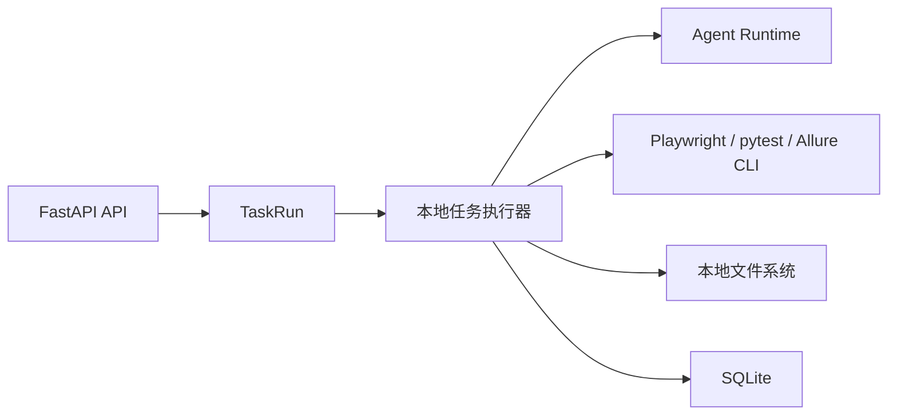

# 03-01 AI测试系统 - 后端架构 PRD

## 1. 这份文档解决什么问题

本文定义 AI 测试系统第一版后端架构。后端使用 Python + FastAPI + SQLite + 本地文件系统，支撑文档管理、任务运行、Agent 编排、站点探索、知识库生成、测试用例生成、UI 自动化执行和报告索引。

---

## 2. 技术栈

| 技术 | 用途 |
| --- | --- |
| Python | 后端语言 |
| FastAPI | HTTP API |
| SQLite | 第一版数据库 |
| SQLAlchemy 或 SQLModel | ORM |
| Pydantic | 请求响应模型 |
| BackgroundTasks/任务队列封装 | 异步任务调度，第一版本地进程 |
| OpenAI Agents SDK | Agent 编排 |
| Playwright CLI | 站点探索 |
| pytest + Playwright | UI 自动化执行 |
| Allure | 自动化报告 |
| 本地文件系统 | 文件、Markdown、知识库、代码、报告 |

---

## 3. 模块边界

| 模块 | 职责 |
| --- | --- |
| auth | 登录、会话、当前用户 |
| users | 用户、角色、项目分配 |
| projects | 项目管理 |
| documents | 源文档、版本、Markdown |
| requirements | 需求分析、评审、澄清写回、候选需求 |
| exploration | 站点配置、探索任务、探索文档、页面事实 |
| knowledge | llm-wiki 生成、更新、来源引用 |
| test_cases | 测试用例生成、评审、覆盖矩阵 |
| automation | UI 自动化代码、套件、本地执行 |
| reports | Allure 报告索引、运行摘要、内部 Bug |
| diagnosis | 失败诊断、自愈建议、补丁确认 |
| models | Provider、模型配置、模型用途 |
| agents | Agent Runtime、Skill 调用、安全策略 |
| tasks | 统一任务中心、任务事件、日志 |
| settings | 系统设置 |

---

## 4. API 设计原则

- REST 风格。
- 所有项目内资源必须带 project_id。
- 长耗时操作返回 task_id。
- 文件上传先生成 SourceDocument，再异步转换。
- 知识库生成、自动化执行、自愈诊断必须异步。
- API 返回必须包含权限判断后的可操作动作。
- 错误响应包含 code、message、detail、trace_id。

---

## 5. 任务运行架构

第一版使用本地任务运行：



规则：

- 创建任务后立即写入 TaskRun。
- 任务执行过程写 TaskEvent。
- 日志写本地文件，数据库保存路径和摘要。
- 失败必须保存错误信息。
- 可重试任务必须记录重试来源。

---

## 6. 文件系统布局

建议：

```text
data/
  uploads/
  markdown/
  exploration/
  knowledge/
  automation/
    ui/
    api-soon/
  allure/
    results/
    reports/
  logs/
  traces/
  screenshots/
```

---

## 7. 安全边界

- 登录后才能访问系统。
- 不开放注册，账号由管理员创建。
- 所有 API 根据角色和项目分配鉴权。
- 文件路径必须限制在系统配置的根目录内。
- Agent 只能读取和写入允许目录。
- 密码、token、验证码不写明文日志。
- 自愈补丁必须人工确认后才能应用。

---

## 8. 验收标准

- FastAPI 能提供核心模块 API。
- SQLite 能保存核心元数据和索引。
- 长耗时任务能进入任务中心。
- 文件产物能按项目和模块保存。
- UI 自动化能通过本地 Runner 执行。
- Allure 报告能被报告中心索引。
- API 能按管理员、测试工程师、访客控制权限。
