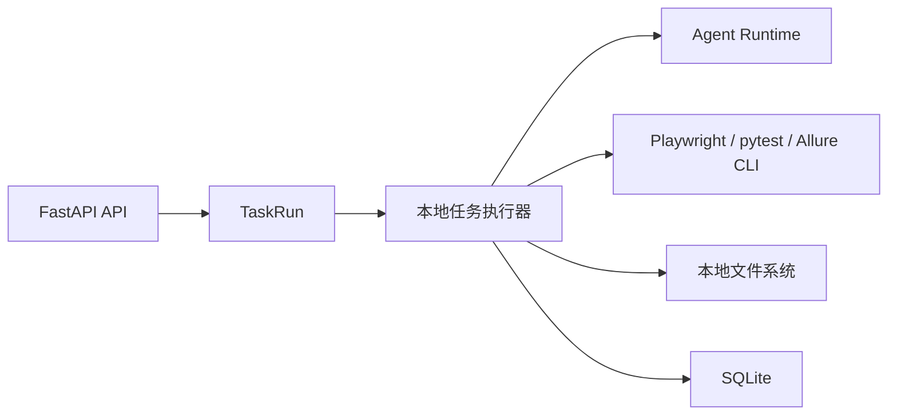

# 03-01 AI测试系统 - 后端架构 PRD

## 1. 这份文档解决什么问题

本文定义 AI 测试系统第一版后端架构。后端使用 Python + FastAPI + SQLite + 本地文件系统，支撑文档管理、任务运行、Agent 编排、站点探索、知识库生成、测试用例生成、UI 自动化执行和报告索引。

---

## 2. 技术栈

| 技术 | 用途 |
| --- | --- |
| Python | 后端语言 |
| FastAPI | HTTP API |
| SQLite | 第一版数据库 |
| SQLAlchemy 或 SQLModel | ORM |
| Pydantic | 请求响应模型 |
| BackgroundTasks/任务队列封装 | 异步任务调度，第一版本地进程 |
| OpenAI Agents SDK | Agent 编排 |
| Playwright CLI | 站点探索 |
| pytest + Playwright | UI 自动化执行 |
| Allure | 自动化报告 |
| 本地文件系统 | 文件、Markdown、知识库、代码、报告 |

---

## 3. 模块边界

| 模块 | 职责 |
| --- | --- |
| auth | 登录、会话、当前用户 |
| users | 用户、角色、项目分配 |
| projects | 项目管理 |
| documents | 源文档、版本、Markdown |
| requirements | 需求分析、评审、澄清写回、候选需求 |
| exploration | 站点配置、探索任务、探索文档、页面事实 |
| knowledge | llm-wiki 生成、更新、来源引用 |
| test_cases | 测试用例生成、评审、覆盖矩阵 |
| automation | UI 自动化代码、套件、本地执行 |
| reports | Allure 报告索引、运行摘要、内部 Bug |
| diagnosis | 失败诊断、自愈建议、补丁确认 |
| models | Provider、模型配置、模型用途 |
| agents | Agent Runtime、Skill 调用、安全策略 |
| tasks | 统一任务中心、任务事件、日志 |
| settings | 系统设置 |

---

## 4. API 设计原则

- REST 风格。
- 所有项目内资源必须带 project_id。
- 长耗时操作返回 task_id。
- 文件上传先生成 SourceDocument，再异步转换。
- 知识库生成、自动化执行、自愈诊断必须异步。
- API 返回必须包含权限判断后的可操作动作。
- 错误响应包含 code、message、detail、trace_id。

### 4.1 后端详细设计统一规范

后端实现必须保持统一设计风格，不能每个模块各自定义不同的返回结构、状态流转、任务模式、文件路径和错误码。

统一规范：

- 所有接口统一使用 `/api/v1` 前缀。
- 所有响应必须包含 `trace_id`。
- 列表接口统一返回 `items`、`pagination`、`filters` 可选项。
- 详情接口统一返回业务对象、来源引用、关联任务、`available_actions`。
- 写操作必须在 Service 层完成权限校验、状态门禁和事务控制。
- 异步操作必须创建 `TaskRun`，不能在 HTTP 请求中直接长时间执行。
- 文件产物必须通过 Storage 层读写，禁止业务模块直接拼接本地路径。
- 状态枚举后端可使用英文，前端展示必须通过映射转中文。
- 所有高风险动作必须写审计日志，包括发布知识库、采纳用例、批量生成、执行自动化、应用补丁、回滚、归档和废弃。

### 4.2 统一 API 响应规范

成功响应：

```json
{
  "data": {},
  "trace_id": "trace_xxx"
}
```

列表响应：

```json
{
  "data": {
    "items": [],
    "pagination": {
      "page": 1,
      "page_size": 20,
      "total": 0
    },
    "filters": {}
  },
  "trace_id": "trace_xxx"
}
```

详情响应建议：

```json
{
  "data": {
    "item": {},
    "source_refs": [],
    "related_tasks": [],
    "available_actions": []
  },
  "trace_id": "trace_xxx"
}
```

错误响应：

```json
{
  "error": {
    "code": "KNOWLEDGE_BUILD_BLOCKED",
    "message": "知识库存在阻塞项，不能发布",
    "detail": {},
    "trace_id": "trace_xxx"
  }
}
```

长任务创建响应：

```json
{
  "data": {
    "task_id": "task_xxx",
    "status": "queued",
    "result_url": "/tasks/task_xxx"
  },
  "trace_id": "trace_xxx"
}
```

### 4.3 available_actions 规范

后端必须返回当前用户、当前项目、当前对象状态下允许执行的动作，前端只负责展示，不自行推断核心权限。

`available_actions` 字段建议：

| 字段 | 说明 |
| --- | --- |
| key | 操作标识，如 generate_knowledge、adopt_case、run_automation |
| label | 中文操作名称 |
| enabled | 是否可点击 |
| disabled_reason | 禁用原因 |
| risk_level | normal、warning、danger |
| confirm_required | 是否需要二次确认 |
| target_url | 可选跳转地址 |

规则：

- 访客写操作必须返回 `enabled = false` 和禁用原因。
- 项目上下文不满足时，写操作必须禁用。
- 状态门禁不满足时，必须返回明确原因，如“知识库未发布”“用例未采纳”“locator 未补齐”。

### 4.4 错误码规范

错误码使用大写下划线，按业务域分组。

| 错误域 | 示例 | 说明 |
| --- | --- | --- |
| AUTH | AUTH_REQUIRED、PERMISSION_DENIED | 登录和权限 |
| PROJECT | PROJECT_NOT_FOUND、PROJECT_CONTEXT_REQUIRED | 项目上下文 |
| DOCUMENT | DOCUMENT_VERSION_DEPRECATED、DOCUMENT_CONVERSION_FAILED | 文档和版本 |
| REQUIREMENT | REQUIREMENT_REVIEW_BLOCKED、CLARIFICATION_NOT_APPLIED | 需求评审和澄清 |
| EXPLORATION | EXPLORATION_WAITING_HUMAN、LOCATOR_NOT_FOUND | 探索和定位 |
| KNOWLEDGE | KNOWLEDGE_BUILD_BLOCKED、KNOWLEDGE_NOT_PUBLISHED | 知识库 |
| TEST_CASE | TEST_CASE_NOT_ADOPTED、CASE_GENERATION_BLOCKED | 测试用例 |
| AUTOMATION | AUTOMATION_LOCATOR_BLOCKED、AUTOMATION_RUN_FAILED | UI 自动化 |
| DIAGNOSIS | DIAGNOSIS_EVIDENCE_MISSING、PATCH_REVIEW_REQUIRED | 失败诊断和自愈 |
| TASK | TASK_NOT_RETRYABLE、TASK_ALREADY_RUNNING | 任务中心 |

规则：

- 错误 `message` 面向用户，必须是中文。
- `detail` 面向前端和排查，可包含字段错误、阻塞项 ID、处理入口。
- 后端日志必须记录完整异常，前端响应不能暴露 API Key、密码、token、验证码明文和本地敏感路径。

### 4.5 状态流转与事务规范

- 所有核心对象状态变更必须通过 Service 层方法完成。
- 状态变更必须校验来源版本是否有效、当前状态是否允许跳转、当前用户是否有权限。
- 状态变更必须写入业务对象状态字段、TaskEvent 或审计日志。
- 任务状态和业务对象状态不能互相替代；任务成功不等于业务对象可发布，业务对象发布也不等于任务仍存在。
- 已发布、已采纳、已应用、已归档等状态不可原地覆盖，只能通过新版本、新任务或补充记录继续演进。
- 批量任务允许部分成功、部分等待人工，TaskRun 保存汇总，单条结果保存在业务明细对象中。

### 4.6 任务执行规范

- 所有长耗时操作必须走 `TaskRun -> TaskEvent -> Worker -> Service 回写`。
- Worker 可以调用 Agent、CLI、Storage、Repository，但业务状态最终必须由 Service 层确认。
- TaskEvent 只记录阶段摘要，高频日志写入日志文件。
- 任务失败必须记录错误码、错误摘要、日志路径和建议动作。
- 重试任务必须创建新 TaskRun，并记录 `retry_from_task_id`。
- 取消任务不能删除已经生成的业务产物，必须把产物标记为草稿、失败或已取消。
- 等待人工任务必须有处理入口、等待原因和可继续动作。

### 4.7 文件与产物访问规范

- 文件系统路径必须限制在系统配置的存储根目录内。
- 所有文件读取必须通过授权接口，前端不能直接拼接本地文件路径。
- Markdown、截图、trace、video、Allure、自动化代码、补丁 diff 必须按项目和对象归档。
- 文件产物必须记录对象 ID、版本号或运行 ID，保证可追溯。
- 删除只允许清理临时产物，不删除历史版本、审计证据和已发布知识库。

### 4.8 数据访问与事务规范

- Repository 层只负责 SQLite 读写，不做业务判断。
- Service 层负责事务边界，跨表状态更新必须在同一事务或可补偿流程中完成。
- 任何下游引用必须保存具体来源版本 ID，不能只引用项目最新版本。
- 列表查询必须带项目范围过滤，测试工程师只能查询分配项目，访客只读。
- 大文本和大文件优先存文件系统，SQLite 保存路径、索引、摘要和状态。

---

## 5. 任务运行架构

第一版使用本地任务运行：



规则：

- 创建任务后立即写入 TaskRun。
- 任务执行过程写 TaskEvent。
- 日志写本地文件，数据库保存路径和摘要。
- 失败必须保存错误信息。
- 可重试任务必须记录重试来源。

### 5.1 后端分层实现

第一版后端建议按以下层次实现，避免路由、业务和文件操作耦合在一起：

| 层级 | 职责 | 说明 |
| --- | --- | --- |
| API 层 | 路由、参数校验、权限判断、返回值包装 | 只处理 HTTP 交互，不写业务规则 |
| Service 层 | 业务编排、状态流转、跨模块校验 | 负责“能不能做、做完更新什么状态” |
| Domain 层 | 核心实体、状态枚举、领域规则 | 负责状态门禁、版本约束、引用有效性 |
| Worker 层 | 异步任务执行、Agent 调用、CLI 调用 | 负责实际运行分析、探索、执行和诊断 |
| Repository 层 | SQLite 读写 | 只做数据访问，不混入业务判断 |
| Storage 层 | 文件系统读写 | 负责 Markdown、代码、报告、截图、trace、video |

### 5.2 推荐实现模式

- 路由按模块拆分，保持 `documents`、`exploration`、`knowledge`、`test_cases`、`automation`、`diagnosis`、`tasks`、`settings` 独立。
- 异步任务统一走 `TaskRun` 创建 -> Worker 执行 -> 结果回写 -> 事件记录。
- 业务对象状态更新必须通过 Service 层，不能在 Worker 里直接改表。
- 所有文件路径由统一的 storage helper 生成，禁止在各模块中手写散落路径。
- 所有模型调用和外部 CLI 调用必须包裹为可审计的 adapter，便于替换和测试。

### 5.3 典型接口分组

| 模块 | 典型接口 |
| --- | --- |
| projects | 项目列表、项目创建、项目详情、成员分配、项目设置 |
| documents | 上传、转换、预览、版本、diff、AI 对话修改 |
| requirements | 发起分析、生成澄清、应用澄清、模块评审、覆盖矩阵 |
| exploration | 站点配置、开始探索、探索结果、模块覆盖、冲突项 |
| knowledge | 生成知识库、更新知识库、预览、历史版本、来源引用 |
| test_cases | 生成用例、评审、采纳、不采纳、复核、覆盖矩阵 |
| automation | 生成代码、查看代码、执行套件、运行记录、报告跳转 |
| reports | 报告列表、报告详情、失败记录、内部 Bug |
| diagnosis | 启用诊断、生成补丁、应用补丁、回滚、再验证 |
| tasks | 任务列表、任务详情、重试、取消、等待人工处理 |
| settings | 文件存储、Runner、Playwright、Allure、Agent 安全策略 |

### 5.4 第一版 API 清单

接口路径以 `/api/v1` 为前缀。表中只列核心接口，导出、批量操作和高级筛选可后续扩展。

| 模块 | 方法 | 路径 | 用途 | 返回重点 |
| --- | --- | --- | --- | --- |
| auth | POST | `/auth/login` | 登录 | access_token、current_user |
| auth | POST | `/auth/logout` | 退出登录 | success |
| auth | GET | `/auth/me` | 当前用户和权限 | user、roles、project_permissions |
| projects | GET | `/projects` | 项目列表 | items、pagination、available_actions |
| projects | POST | `/projects` | 创建项目 | project |
| projects | GET | `/projects/{project_id}` | 项目详情 | project、stats、available_actions |
| projects | PATCH | `/projects/{project_id}` | 更新项目 | project |
| projects | GET | `/projects/{project_id}/members` | 项目成员 | members |
| projects | PUT | `/projects/{project_id}/members` | 保存项目成员 | members |
| documents | POST | `/projects/{project_id}/documents` | 上传需求文档 | document、conversion_task_id |
| documents | GET | `/projects/{project_id}/documents` | 文档列表 | items |
| documents | GET | `/projects/{project_id}/documents/{document_id}` | 文档详情 | document、versions |
| documents | GET | `/projects/{project_id}/documents/{document_id}/versions/{version_id}` | 文档版本内容 | markdown、metadata、available_actions |
| documents | POST | `/projects/{project_id}/documents/{document_id}/chat-edits` | 发起 AI 对话修改 | edit_session、task_id |
| documents | POST | `/projects/{project_id}/documents/{document_id}/chat-edits/{session_id}/apply` | 应用文档补丁 | new_version |
| requirements | POST | `/projects/{project_id}/requirements/analyze` | 发起需求分析 | task_id |
| requirements | GET | `/projects/{project_id}/requirements/analysis/{analysis_id}` | 分析结果 | modules、coverage、clarifications |
| requirements | GET | `/projects/{project_id}/requirements/review-modules` | 模块评审列表 | items |
| requirements | PATCH | `/projects/{project_id}/requirements/review-modules/{module_id}` | 更新模块评审 | module |
| requirements | GET | `/projects/{project_id}/requirements/clarifications` | 澄清问题列表 | items |
| requirements | POST | `/projects/{project_id}/requirements/clarifications/{question_id}/answer` | 回答澄清问题 | question |
| requirements | POST | `/projects/{project_id}/requirements/clarifications/apply` | 应用澄清写回 | task_id |
| exploration | GET | `/projects/{project_id}/exploration/runs` | 探索任务列表 | items |
| exploration | POST | `/projects/{project_id}/exploration/runs` | 创建探索任务 | task_id、exploration_run |
| exploration | GET | `/projects/{project_id}/exploration/runs/{run_id}` | 探索详情 | run、coverage、pages、blockers |
| exploration | POST | `/projects/{project_id}/exploration/runs/{run_id}/continue` | 处理等待人工后继续 | task_id |
| exploration | GET | `/projects/{project_id}/exploration/conflicts` | 来源冲突项 | items |
| exploration | PATCH | `/projects/{project_id}/exploration/conflicts/{conflict_id}` | 确认冲突处理结论 | conflict |
| knowledge | GET | `/projects/{project_id}/knowledge/builds` | 知识库版本列表 | items |
| knowledge | POST | `/projects/{project_id}/knowledge/builds` | 生成知识库 | task_id、build |
| knowledge | POST | `/projects/{project_id}/knowledge/builds/{build_id}/update` | 更新知识库 | task_id、build |
| knowledge | GET | `/projects/{project_id}/knowledge/builds/{build_id}` | 知识库详情 | build、pages、lint |
| knowledge | POST | `/projects/{project_id}/knowledge/builds/{build_id}/publish` | 发布知识库 | build |
| knowledge | GET | `/projects/{project_id}/knowledge/builds/{build_id}/pages/{page_id}` | Wiki 页面 | markdown、source_refs |
| test_cases | GET | `/projects/{project_id}/test-cases` | 用例列表 | items、coverage_summary |
| test_cases | POST | `/projects/{project_id}/test-cases/generate` | 生成测试用例 | task_id |
| test_cases | GET | `/projects/{project_id}/test-cases/{case_id}` | 用例详情 | case、versions、source_refs |
| test_cases | PATCH | `/projects/{project_id}/test-cases/{case_id}` | 编辑用例 | case_version |
| test_cases | POST | `/projects/{project_id}/test-cases/{case_id}/adopt` | 采纳用例 | case |
| test_cases | POST | `/projects/{project_id}/test-cases/{case_id}/reject` | 不采纳用例 | case |
| automation | GET | `/projects/{project_id}/automation/ui/suites` | UI 自动化套件 | items |
| automation | POST | `/projects/{project_id}/automation/ui/generate` | 生成 UI 自动化代码 | task_id |
| automation | GET | `/projects/{project_id}/automation/ui/suites/{suite_id}` | 套件详情 | suite、cases、files |
| automation | GET | `/projects/{project_id}/automation/ui/files/{file_id}` | 代码文件内容 | file、content |
| automation | POST | `/projects/{project_id}/automation/ui/suites/{suite_id}/runs` | 执行套件 | task_id、run |
| automation | GET | `/projects/{project_id}/automation/ui/runs/{run_id}` | 执行详情 | run、cases、report、failures |
| reports | GET | `/reports/runs` | 运行报告列表 | items |
| reports | GET | `/reports/runs/{run_id}` | 运行报告详情 | run、summary、links |
| reports | GET | `/reports/bugs` | 内部 Bug 列表 | items |
| reports | PATCH | `/reports/bugs/{bug_id}` | 更新内部 Bug 状态 | bug |
| diagnosis | POST | `/projects/{project_id}/diagnosis/failures/{failure_id}/diagnose` | 启用失败诊断 | task_id |
| diagnosis | GET | `/projects/{project_id}/diagnosis/{diagnosis_id}` | 诊断详情 | diagnosis、evidence、actions |
| diagnosis | POST | `/projects/{project_id}/diagnosis/{diagnosis_id}/patches` | 生成自愈补丁 | task_id |
| diagnosis | POST | `/projects/{project_id}/diagnosis/patches/{patch_id}/apply` | 应用补丁 | task_id |
| diagnosis | POST | `/projects/{project_id}/diagnosis/patches/{patch_id}/rollback` | 回滚补丁 | task_id |
| tasks | GET | `/tasks` | 任务列表 | items、filters |
| tasks | GET | `/tasks/{task_id}` | 任务详情 | task、events、logs、outputs |
| tasks | POST | `/tasks/{task_id}/retry` | 重试任务 | new_task_id |
| tasks | POST | `/tasks/{task_id}/cancel` | 取消任务 | task |
| settings | GET | `/settings/system` | 系统设置 | settings、checks |
| settings | PATCH | `/settings/system` | 更新系统设置 | settings |
| settings | POST | `/settings/system/check` | 连通性检查 | check_result、task_id |

### 5.5 API 返回结构

普通成功响应：

```json
{
  "data": {},
  "trace_id": "trace_xxx"
}
```

列表响应：

```json
{
  "data": {
    "items": [],
    "pagination": {
      "page": 1,
      "page_size": 20,
      "total": 0
    }
  },
  "trace_id": "trace_xxx"
}
```

错误响应：

```json
{
  "error": {
    "code": "KNOWLEDGE_BUILD_BLOCKED",
    "message": "知识库存在阻塞项，不能发布",
    "detail": {},
    "trace_id": "trace_xxx"
  }
}
```

长任务创建响应：

```json
{
  "data": {
    "task_id": "task_xxx",
    "status": "queued",
    "result_url": "/tasks/task_xxx"
  },
  "trace_id": "trace_xxx"
}
```

---

## 6. 文件系统布局

建议：

```text
data/
  uploads/
  markdown/
  exploration/
  knowledge/
  automation/
    ui/
    api-soon/
  allure/
    results/
    reports/
  logs/
  traces/
  screenshots/
```

实现规则：

- 每个项目单独保存业务产物子目录，避免混淆。
- 原始输入、转换结果、可执行代码、报告和诊断证据必须分开存放。
- 文件名应包含项目、对象类型、版本号或 run id，便于人工检索。
- 删除动作只删除明确标记为可清理的临时产物，不删除历史版本和审计证据。

### 6.1 建议目录映射

| 目录 | 内容 |
| --- | --- |
| uploads | 原始上传文件 |
| markdown | 需求、探索、候选需求的 Markdown 工作稿 |
| exploration | 探索文档、页面快照、模块证据 |
| knowledge | llm-wiki 产物、发布版本、检索索引 |
| automation/ui | pytest + Playwright UI 自动化代码 |
| automation/api-soon | 接口自动化占位目录 |
| allure/results | pytest 输出结果 |
| allure/reports | Allure 静态报告 |
| logs | 后端、任务、模型、CLI 运行日志 |
| traces | Playwright trace |
| screenshots | 失败截图 |
| snapshots | 自愈补丁应用前快照 |

---

## 7. 安全边界

- 登录后才能访问系统。
- 不开放注册，账号由管理员创建。
- 所有 API 根据角色和项目分配鉴权。
- 文件路径必须限制在系统配置的根目录内。
- Agent 只能读取和写入允许目录。
- 密码、token、验证码不写明文日志。
- 自愈补丁必须人工确认后才能应用。

### 7.1 接口安全约束

- 读取接口必须根据项目分配和角色做行级过滤。
- 写入接口必须再次校验项目上下文，不能只依赖前端传参。
- 下载类接口必须先校验权限，再返回临时访问路径或流式响应。
- 任务查询接口必须只暴露当前用户可见的任务和产物。
- 所有高风险操作都必须写审计日志，包括发布、应用补丁、废弃版本、回滚和取消运行。

---

## 8. 验收标准

- FastAPI 能提供核心模块 API。
- SQLite 能保存核心元数据和索引。
- 长耗时任务能进入任务中心。
- 文件产物能按项目和模块保存。
- UI 自动化能通过本地 Runner 执行。
- Allure 报告能被报告中心索引。
- API 能按管理员、测试工程师、访客控制权限。
- 后端模块按分层实现，路由不直接操作文件和状态机。
- 所有异步任务都通过统一 TaskRun 流转。
