# 03-02 AI测试系统 - 数据模型 PRD

> **实现基线**:
> - `apps/backend/app/seed/schema.py`（SQLite DDL 完整定义，1432 行）
> - `apps/backend/app/seed/seeds.py`（种子数据 + 迁移函数，961 行）
> - `apps/backend/app/seed/init_db.py`（数据库初始化入口）
>
> **更新日期**: 2026-07-26

---

## 1. 范围与原则

SQLite 保存结构化元数据、状态、索引和引用关系；Markdown 正文、自动化代码、Locust 报告、截图和 trace 等大文件保存在本地文件系统（`data/projects/`）。

**核心原则**:
- SQLite 不保存大型二进制文件。
- 核心产物可追溯到来源版本（保存具体 `*_version_id` 而非仅项目 ID）。
- 所有业务域按项目隔离。
- 可变产物必须版本化。

---

## 2. 业务域划分与核心表

### 2.1 用户与认证域

| 表 | 说明 | 关键字段 |
| --- | --- | --- |
| `users` | 用户账号（admin/tester/guest） | username, email, password_hash, role, status, project_scope |
| `sessions` | 登录会话（JWT token） | token, user_id, expires_at |

### 2.2 模型配置域

| 表 | 说明 | 关键字段 |
| --- | --- | --- |
| `model_providers` | 模型 Provider（provider/model/base_url/api_key） | provider, model, base_url, api_key, status, health_status |
| `model_assignments` | 模型能力分配（capability_id → model_provider_id） | capability_id, model_provider_id |

### 2.3 项目域

| 表 | 说明 | 关键字段 |
| --- | --- | --- |
| `projects` | 项目 | name, code, status, default_site_url |

**说明**: `__all_projects__` 是系统保留虚拟项目（id = `__all_projects__`，name = "全部项目知识库"，status = archived），用于跨项目知识库对话历史，由 `seeds.py:_ensure_all_projects_conversation_scope()` 在初始化时自动创建（seeds.py:907-916）。正常业务项目不得使用此 ID。

### 2.4 需求文档域

| 表 | 说明 | 关键字段 |
| --- | --- | --- |
| `source_documents` | 需求原始文档 | project_id, name, document_type, current_version_id, status |
| `source_document_versions` | 文档版本（包含 Markdown 正文和文件路径） | document_id, version_no, markdown_content, file_path, source_action, change_summary, diff_summary |
| `source_document_file_mappings` | 原始文件与 Markdown 映射 | document_id, version_id, source_file_path, markdown_file_path, conversion_status, mapping_status |
| `document_version_change_logs` | 版本变化日志 | document_id, version_id, source_action, change_summary, diff_summary |

### 2.5 需求分析域

| 表 | 说明 | 关键字段 |
| --- | --- | --- |
| `requirement_analyses` | 需求分析结果 | document_id, status, analysis_summary, output_json, quality_result, testability_score, draft_content_hash, finalized_version_id |
| `requirement_analysis_runs` | 需求分析运行（任务） | project_id, document_id, analysis_id, status, summary, failure_reason |
| `requirement_clarification_answers` | 澄清问答记录 | document_id, analysis_id, question_id, answer_type, selected_option_id, answer_markdown, apply_status |
| `requirement_finalization_runs` | 需求定稿运行 | document_id, analysis_id, status, summary, failure_reason |

### 2.6 测试用例域

| 表 | 说明 | 关键字段 |
| --- | --- | --- |
| `test_case_sets` | 用例集（关联需求文档） | project_id, requirement_doc_id, generation_scope_type, status, case_count |
| `test_point_generation_runs` | 测试点生成运行 | document_id, requirement_version_id, task_id, status, coverage_status, obligation_count, covered_obligation_count, supplement_round |
| `test_points` | 测试点 | document_id, requirement_version_id, generation_run_id, point_key, title, module, category, priority, description |
| `test_point_requirement_obligations` | 需求义务（可测试条款） | requirement_version_id, obligation_key, source_section, statement, obligation_type, test_required, explicit |
| `test_point_obligations` | 测试点 ↔ 义务关联 | test_point_id, obligation_id, requirement_version_id |
| `test_case_generation_runs` | 测试用例生成运行 | test_case_set_id, task_id, status |
| `test_cases` | 测试用例 | test_case_set_id, project_id, title, module, priority, status, display_order, review_feedback, reviewed_by |
| `manual_test_cases` | 手动测试用例 | project_id, title, preconditions, steps_json, notes |

### 2.7 站点探索域

| 表 | 说明 | 关键字段 |
| --- | --- | --- |
| `exploration_runs` | 探索任务 | project_id, environment_id, requirement_doc_id, status, exploration_mode, scope, goal, max_pages, max_actions, forbidden_paths |
| `exploration_module_coverages` | 模块覆盖 | exploration_run_id, module_key, module_name, explored_page_count, action_count, completion_status |
| `exploration_pages` | 探索页面 | exploration_run_id, url, title, module_key, screenshot_path, snapshot_path, trace_path |
| `exploration_blockers` | 探索障碍 | exploration_run_id, module_key, reason_type, reason, impact_scope, suggested_action, is_blocking |
| `exploration_artifacts` | 探索产物 | exploration_run_id, artifact_type, file_path, title, summary |
| `exploration_document_versions` | 探索文档版本 | exploration_run_id, version_no, markdown_path, change_summary |

### 2.8 知识库域

| 表 | 说明 | 关键字段 |
| --- | --- | --- |
| `knowledge_conversations` | 知识对话会话 | project_id, title, created_by |
| `knowledge_conversation_messages` | 对话消息 | conversation_id, role (user/assistant), content, used_requirement_versions_json |
| `knowledge_search_source_settings` | 知识库检索来源配置 | scope_key, source_type, enabled, created_by, updated_by |
| `global_knowledge_bases` | 全局知识库（独立于项目） | name, status, root_folder_id |
| `global_knowledge_folders` | 全局知识文件夹 | knowledge_base_id, parent_id, name, sort_order |
| `global_knowledge_vault_files` | 全局知识文件 | knowledge_base_id, folder_id, display_name, file_type, raw_path, markdown_path, markdown_content, conversion_status |

**说明**: 当前代码中知识库（llm-wiki）产物主要通过文件系统保存，SQLite 侧重会话管理和对话消息。

### 2.9 UI 自动化域

| 表 | 说明 | 关键字段 |
| --- | --- | --- |
| `project_environments` | 项目环境配置（URL/登录策略） | project_id, name, site_url, login_strategy, captcha_strategy, reuse_auth_state |
| `ui_automation_generation_runs` | UI 自动化代码生成运行 | project_id, test_case_id/manual_test_case_id (互斥), environment_id, status, suite_path |
| `ui_automation_assets` | UI 自动化资产（代码套件） | project_id, test_case_id/manual_test_case_id (互斥), pytest_node_id, suite_path, test_file_path, data_file_path, plan_file_path, status, source_hash |
| `ui_automation_execution_runs` | UI 自动化执行运行 | asset_id, environment_id, status, run_dir, stdout_path, stderr_path, trace_path, video_path, screenshot_paths_json |

**说明**: `ui_automation_generation_runs` 和 `ui_automation_assets` 通过 CHECK 约束 `((test_case_id IS NOT NULL) != (manual_test_case_id IS NOT NULL))` 确保 test_case_id 与 manual_test_case_id 互斥。

### 2.10 接口自动化域

| 表 | 说明 | 关键字段 |
| --- | --- | --- |
| `api_documents` | OpenAPI 文档导入 | project_id, name, source_type (url/file), source_url, file_path, status, endpoint_count |
| `api_endpoints` | API 端点（解析自文档） | project_id, document_id, method, path, normalized_path, summary, tags_json, parameters_json, request_body_json, responses_json |
| `api_test_environments` | API 测试环境 | project_id, api_base_url, auth_type (none/account_password/cybertron_agent), auth_config_json, variables_json, linked_ui_environment_id |
| `api_generation_runs` | API 用例生成运行 | project_id, task_id, status, endpoint_ids_json, source_test_case_ids_json |
| `api_generation_items` | 单端点用例生成项 | generation_run_id, endpoint_id, status, attempt_count, generated_case_count |
| `api_generation_item_attempts` | 生成重试记录 | generation_item_id, attempt_no, status, generated_case_count |
| `api_script_generation_runs` | API 脚本生成运行 | project_id, task_id, status, endpoint_ids_json, suite_path, changed_files_json |
| `api_test_case_sets` | API 用例集 | project_id, name, status, case_count, latest_generation_run_id |
| `api_test_cases` | API 自动化用例 | project_id, endpoint_id, title, test_point_key, oracle_status, priority, coverage, source, preconditions_json, request_json, test_data_json, expected_json, assertions_json, variables_json, data_file_path |
| `api_test_case_versions` | API 用例版本快照 | case_id, version, snapshot_json, change_source |
| `api_endpoint_oracle_facts` | 端点 Oracle 断言事实 | endpoint_id, test_point_key, assertions_json, evidence_run_ids_json, approved_by |
| `api_test_scripts` | API 自动化测试脚本（pytest） | project_id, endpoint_id, name, status, suite_path, test_file_path, data_file_path, source_hash, case_count, manual_modified, last_run_status |
| `api_automation_runs` | API 自动化执行运行 | project_id, task_id, status (passed/observed/failed), script_ids_json, target_type, target_ids_json, stdout_path, stderr_path, json_report_path, scenario_result_path, observation_result_path, parent_run_id, source_repair_attempt_id |
| `api_repair_sessions` | 自愈会话 | project_id, source_run_id, current_run_id, status, current_revision |
| `api_repair_attempts` | 自愈尝试 | session_id, base_run_id, base_revision, status, diagnosis_json, validation_json, decision, applied_run_id |
| `api_oracle_proposals` | Oracle 断言提案 | endpoint_id, case_id, run_id, test_point_key, status, current_snapshot_json, proposed_snapshot_json, reasoning, confidence, review_comment |

### 2.11 接口自动化场景域

| 表 | 说明 | 关键字段 |
| --- | --- | --- |
| `api_scenarios` | API 场景 | project_id, name, status, variables_json, revision, published_snapshot_json, published_hash |
| `api_scenario_steps` | 场景步骤 | scenario_id, project_id, step_type (api_request/condition/wait/poll/assign), endpoint_id, api_test_case_id, step_order, bindings_json, extractors_json, assertions_json, control_config_json, on_failure, enabled |
| `api_scenario_revisions` | 场景版本历史 | scenario_id, project_id, revision, snapshot_json, published_hash |
| `api_scenario_ai_plans` | AI 生成的场景执行计划 | scenario_id, expected_revision, goal, plan_json, validation_json, status (preview/applied/discarded/expired), model_provider, expires_at |

### 2.12 性能测试域

| 表 | 说明 | 关键字段 |
| --- | --- | --- |
| `performance_tests` | 性能测试定义 | project_id, name, target_type (endpoint), endpoint_id, request_config_json, load_config_json, data_config_json, circuit_breaker_json, performance_goal_json, success_rules_json |
| `performance_test_scripts` | Locust 脚本 | performance_test_id, version, generation_source (ai_plan/default_plan/user_edited), plan_json, code, validation_status, confirmed_by |
| `performance_test_runs` | 性能测试运行 | performance_test_id, script_id, status (created/starting/running/completed/etc.), worker_id, load_config_json, runtime_config_json, report_directory |
| `performance_test_run_stats` | 运行采样统计 | run_id, sampled_at, user_count, requests_per_second, failure_rate, average_response_time_ms, p50/p95/p99_response_time_ms |
| `performance_test_run_failures` | 失败记录 | run_id, request_name, method, reason, count, sample_status_code, sample_response_excerpt |
| `performance_test_run_exceptions` | 异常记录 | run_id, request_name, exception_type, message, count |
| `performance_test_run_events` | 运行事件 | run_id, event_type, level, message, payload_json |
| `performance_analysis_sessions` | 智能分析会话 | run_id, status, analysis_status, analysis_stage, repair_status, analysis_version, category, summary, direct_cause, root_cause, evidence_json, proposal_json, metric_snapshot_json, report_snapshot_json, calculator_version, prompt_version, audience, application_status, selected_change_ids_json, preflight_json, applied_script_id, applied_run_id |
| `performance_scenarios` | 性能测试场景 | project_id, api_environment_id, name, description, scenario_definition_json, load_profile_json, data_source_json, quality_gate_json, safety_policy_json |
| `performance_runs` | 性能场景运行（独立运行） | scenario_id, process_status (created/validating/starting/warming_up/measuring/stopping/finished), quality_status, run_snapshot_json, latest_summary_json, report_directory, locust_version |
| `performance_run_gate_results` | 质量门结果 | run_id, metric, operator, threshold, actual, status, reason |

### 2.13 任务中心域

> **说明**: 当前代码中任务信息主要通过 `api_automation_runs`、`ui_automation_execution_runs`、`exploration_runs` 等各自的运行表管理，`task_service.py` 提供统一查询服务，未使用独立的 `task_runs` 表。任务按 source_type/source_id 聚合展示。

### 2.14 系统日志域

| 表 | 说明 | 关键字段 |
| --- | --- | --- |
| `operation_logs` | 操作审计日志 | log_type (audit/config/task/agent), module, action, object_type, object_id, result, summary, before_json, after_json, task_id, artifact_path, request_id, ip_address |
| `operation_log_retention_policy` | 日志保留策略 | retention_days, max_rows, protect_high_risk |
| `retention_cleanup_state` | 清理状态记录 | job_name, last_success_at |

### 2.15 控制台域

| 表 | 说明 | 关键字段 |
| --- | --- | --- |
| `dashboard_daily_stats` | 每日汇总统计 | project_id, stat_date, case_assets, adopted_cases, automation_cases, generated_cases |

---

## 3. 关键关系 ER 图

```mermaid
erDiagram
    Project ||--o{ SourceDocument : "source_documents"
    SourceDocument ||--o{ SourceDocumentVersion : "versions"
    SourceDocument ||--o{ ExplorationRun : "exploration_runs"
    SourceDocument ||--o{ TestPointGenerationRun : "test_point_generation"
    Project ||--o{ ExplorationRun : "exploration"
    Project ||--o{ TestCaseSet : "test_case_sets"
    TestCaseSet ||--o{ TestCase : "test_cases"
    Project ||--o{ ManualTestCase : "manual_test_cases"
    Project ||--o{ ProjectEnvironment : "environments"
    Project ||--o{ UiAutomationGenerationRun : "ui_generation"
    UiAutomationGenerationRun ||--o{ UiAutomationAsset : "assets"
    UiAutomationAsset ||--o{ UiAutomationExecutionRun : "executions"
    Project ||--o{ ApiDocument : "api_documents"
    ApiDocument ||--o{ ApiEndpoint : "endpoints"
    Project ||--o{ ApiTestEnvironment : "api_environments"
    ApiTestEnvironment ||--o{ PerformanceTest : "perf_tests"
    ApiTestEnvironment }o--o| ProjectEnvironment : "linked_ui_environment"
    Project ||--o{ ApiScript : "api_scripts"
    ApiScript ||--o{ ApiAutomationRun : "runs"
    ApiAutomationRun ||--o{ ApiRepairSession : "repair_sessions"
    ApiRepairSession ||--o{ ApiRepairAttempt : "attempts"
    Project ||--o{ PerformanceTest : "perf_tests"
    PerformanceTest ||--o{ PerformanceTestScript : "scripts"
    PerformanceTest ||--o{ PerformanceTestRun : "runs"
    PerformanceTestRun ||--o{ PerformanceAnalysisSession : "analyses"
    Project ||--o{ PerformanceScenario : "perf_scenarios"
    PerformanceScenario ||--o{ PerformanceRun : "runs"
    PerformanceRun ||--o{ PerformanceRunGateResult : "gate_results"
    Project ||--o{ KnowledgeConversation : "knowledge_conversations"
    KnowledgeConversation ||--o{ KnowledgeConversationMessage : "messages"
    User ||--o{ Session : "sessions"
    ModelProvider ||--o{ ModelAssignment : "assignments"
    GlobalKnowledgeBase ||--o{ GlobalKnowledgeFolder : "folders"
    GlobalKnowledgeFolder ||--o{ GlobalKnowledgeVaultFile : "files"
    Project ||--o{ RequirementAnalysis : "analyses"
    RequirementAnalysis ||--o{ RequirementAnalysisRun : "runs"
    RequirementAnalysis ||--o{ RequirementClarificationAnswer : "clarifications"
    RequirementAnalysis ||--o{ RequirementFinalizationRun : "finalizations"
    Project ||--o{ TestPointGenerationRun : "test_point_generation"
    TestPointGenerationRun ||--o{ TestPoint : "test_points"
    TestPointGenerationRun ||--o{ TestPointRequirementObligation : "obligations"
    TestPoint ||--o{ TestPointObligation : "point_obligations"
    Project ||--o{ ApiScenario : "api_scenarios"
    ApiScenario ||--o{ ApiScenarioStep : "steps"
    ApiScenario ||--o{ ApiScenarioRevision : "revisions"
    ApiScenario ||--o{ ApiScenarioAiPlan : "ai_plans"
```

---

## 4. 状态枚举（CHECK 约束）完整列表

### 4.1 通用状态

| 枚举值 | 含义 |
| --- | --- |
| enabled / disabled | 启用/禁用（用户、模型等） |
| active / archived | 活跃/归档（项目） |
| queued / running / completed / failed / cancelled / interrupted | 任务运行状态（生成运行、执行运行） |
| passed / failed / observed | 通过/失败/观察（API 自动化运行结果） |
| creating / ready / failed | 创建/就绪/失败（脚本、资产） |

### 4.2 模型健康状态

| 枚举值 | 含义 |
| --- | --- |
| unknown / healthy / unhealthy / timeout / testing | 模型 Provider 健康状态 |

### 4.3 需求文档状态

| 枚举值 | 含义 |
| --- | --- |
| collecting / analyzing / waiting_clarification / clarification_pending_apply / pending_review / ready_for_knowledge / deprecated | 需求文档版本在分析链路中的状态 |

### 4.4 需求分析运行状态

| 枚举值 | 含义 |
| --- | --- |
| queued / running / stopping / cancelled / completed / needs_clarification / blocked / failed | 需求分析运行状态 |

### 4.5 澄清问答状态

| 枚举值 | 含义 |
| --- | --- |
| recommended_option / custom / defer | 回答类型 |
| not_applicable / applied / failed | 应用状态 |

### 4.6 定稿运行状态

| 枚举值 | 含义 |
| --- | --- |
| running / completed / failed | 定稿运行状态 |

### 4.7 用例集状态

| 枚举值 | 含义 |
| --- | --- |
| generating / ready_for_review / review_completed / failed / archived | 用例集状态 |
| draft / ready / failed / archived | API 用例集状态 |

### 4.8 用例状态

| 枚举值 | 含义 |
| --- | --- |
| draft / ready_for_review / approved / rejected | 用例评审状态 |

### 4.9 文档转换状态

| 枚举值 | 含义 |
| --- | --- |
| pending / queued / running / success / failed | 转换状态（source_document_file_mappings, global_knowledge_vault_files） |
| pending_merge / merged / conflict | 映射状态 |

### 4.10 探索状态

| 枚举值 | 含义 |
| --- | --- |
| pending / queued / running / stopping / cancelled / interrupted / completed / blocked / failed | 探索任务状态 |
| goal / autonomous | 探索模式 |

### 4.11 测试点生成运行状态

| 枚举值 | 含义 |
| --- | --- |
| queued / running / completed / failed | 测试点生成运行状态 |
| pending / in_progress / completed | 覆盖状态 |

### 4.12 环境登录策略

| 枚举值 | 含义 |
| --- | --- |
| skip_login / auto_login / manual | 登录策略（project_environments） |
| none / auto_captcha / manual_captcha | 验证码策略 |

### 4.13 API 文档状态

| 枚举值 | 含义 |
| --- | --- |
| url / file | 文档来源类型 |
| parsed / failed | 解析状态 |

### 4.14 API 环境认证类型

| 枚举值 | 含义 |
| --- | --- |
| none / account_password / cybertron_agent | 认证类型 |

### 4.15 API 用例生成项状态

| 枚举值 | 含义 |
| --- | --- |
| queued / running / completed / failed | 生成项状态 |
| running / completed / failed | 生成重试状态 |

### 4.16 API 用例来源与 Oracle 状态

| 枚举值 | 含义 |
| --- | --- |
| ai_generated / manual / approved_test_case | 来源 |
| confirmed / inferred / needs_confirmation | Oracle 状态 |
| draft / ready / needs_input / failed | 脚本状态 |

### 4.17 Oracle 提案状态

| 枚举值 | 含义 |
| --- | --- |
| pending / approved / rejected / superseded | 提案状态 |

### 4.18 自愈会话状态

| 枚举值 | 含义 |
| --- | --- |
| active / passed / closed / failed | 会话状态 |

### 4.19 场景步骤类型与失败处理

| 枚举值 | 含义 |
| --- | --- |
| api_request / condition / wait / poll / assign | 步骤类型 |
| stop / continue / always_run | 失败处理 |

### 4.20 AI 计划状态

| 枚举值 | 含义 |
| --- | --- |
| preview / applied / discarded / expired | 场景 AI 计划状态 |

### 4.21 性能测试状态

| 枚举值 | 含义 |
| --- | --- |
| created / starting / running / stopping / completed / stopped / failed / cancelled | 性能测试运行状态 |
| creating / validating / starting / warming_up / measuring / stopping / finished | 性能场景运行进程状态 |
| passed / failed / not_configured / not_evaluated | 质量门结果 |

### 4.22 脚本生成来源

| 枚举值 | 含义 |
| --- | --- |
| ai_plan / default_plan / user_edited | 脚本生成来源 |
| generating / validation_failed / pending_confirmation / confirmed / superseded | 验证状态 |

### 4.23 智能分析状态

| 枚举值 | 含义 |
| --- | --- |
| collecting / analyzing / waiting_approval / failed / rejected | 分析会话状态（旧） |
| collecting / analyzing / failed | 分析状态（新，seeds.py 迁移后） |
| not_applicable / available / rejected | 修复状态（新，seeds.py 迁移后） |
| not_requested / preflighting / preflight_failed / rerunning / completed / apply_failed / superseded | 应用状态 |

### 4.24 操作日志类型

| 枚举值 | 含义 |
| --- | --- |
| audit / config / task / agent | 日志类型 |
| web / api / agent / runner / system | 日志来源 |
| success / failed / partial_success / cancelled | 操作结果 |

### 4.25 全局知识库状态

| 枚举值 | 含义 |
| --- | --- |
| processing / available / conversion_failed | 知识库状态 |

---

## 5. 关键索引（来自 schema.py）

| 表 | 索引 |
| --- | --- |
| `test_case_sets` | idx_test_case_sets_project_updated, idx_test_case_sets_requirement |
| `test_point_generation_runs` | uq_test_point_generation_version (unique: document_id+requirement_version_id) |
| `test_points` | idx_test_points_document_version |
| `test_point_requirement_obligations` | idx_test_point_obligations_document_version |
| `test_point_obligations` | 无额外索引（主键复合约束） |
| `test_case_generation_runs` | idx_test_case_generation_runs_set |
| `test_cases` | idx_test_cases_set_display_order |
| `manual_test_cases` | idx_manual_test_cases_project_updated |
| `api_documents` | idx_api_documents_project_created |
| `api_endpoints` | idx_api_endpoints_project_method |
| `api_test_environments` | project_id+name unique |
| `api_generation_runs` | idx_api_generation_runs_project_created |
| `api_script_generation_runs` | idx_api_script_generation_runs_project_created |
| `api_generation_items` | idx_api_generation_items_run_status, generation_run_id+endpoint_id unique |
| `api_generation_item_attempts` | idx_api_generation_item_attempts_item |
| `api_test_case_sets` | idx_api_test_case_sets_project_updated |
| `api_test_cases` | idx_api_test_cases_project_endpoint |
| `api_test_case_versions` | idx_api_test_case_versions_case |
| `api_endpoint_oracle_facts` | endpoint_id+test_point_key unique |
| `api_test_scripts` | idx_api_scripts_project_updated |
| `api_automation_runs` | idx_api_runs_project_created |
| `api_repair_sessions` | idx_api_repair_sessions_project_updated |
| `api_repair_attempts` | idx_api_repair_attempts_session_number |
| `api_oracle_proposals` | idx_api_oracle_proposals_project_status, run_id+case_id unique |
| `api_scenarios` | 无额外索引（主键、project_id 外键） |
| `api_scenario_steps` | 无额外索引（主键、scenario_id/project_id 外键） |
| `api_scenario_revisions` | idx_api_scenario_revisions_scenario_revision |
| `api_scenario_ai_plans` | idx_api_scenario_ai_plans_project_created |
| `performance_tests` | idx_performance_tests_project_updated |
| `performance_test_scripts` | idx_performance_test_scripts_test_version |
| `performance_test_runs` | idx_performance_test_runs_project_created |
| `performance_analysis_sessions` | idx_performance_analysis_run_status, idx_performance_analysis_project_created, run_id+analysis_version unique |
| `performance_test_run_stats` | idx_performance_test_run_stats_run_sampled |
| `performance_test_run_failures` | run_id+request_name+method+reason unique |
| `performance_test_run_exceptions` | run_id+request_name+exception_type+message unique |
| `performance_test_run_events` | idx_performance_test_run_events_run_created |
| `performance_scenarios` | idx_performance_scenarios_project_updated |
| `performance_runs` | 无额外索引（主键、project_id/scenario_id 外键） |
| `performance_run_gate_results` | 无额外索引（主键） |
| `exploration_runs` | 无额外索引（主键、project_id 外键） |
| `exploration_module_coverages` | exploration_run_id+module_key unique |
| `exploration_pages` | 无额外索引（主键、exploration_run_id 外键） |
| `exploration_blockers` | 无额外索引（主键、exploration_run_id 外键） |
| `exploration_artifacts` | 无额外索引（主键、exploration_run_id 外键） |
| `exploration_document_versions` | exploration_run_id+version_no unique |
| `ui_automation_generation_runs` | idx_ui_generation_project_created |
| `ui_automation_assets` | idx_ui_assets_project_updated, uq_ui_assets_generated_case (partial), uq_ui_assets_manual_case (partial) |
| `ui_automation_execution_runs` | idx_ui_execution_project_created |
| `requirement_analysis_runs` | idx_requirement_analysis_runs_project_created, idx_requirement_analysis_runs_document_created, idx_requirement_analysis_runs_status |
| `requirement_clarification_answers` | idx_requirement_clarification_answers_current (unique: analysis_id+question_id), idx_requirement_clarification_answers_document |
| `requirement_finalization_runs` | 无额外索引（主键、project_id/document_id/analysis_id 外键） |
| `source_documents` | 无额外索引（主键、project_id 外键） |
| `source_document_versions` | 无额外索引（主键、document_id 外键） |
| `source_document_file_mappings` | 无额外索引（主键、document_id/version_id 外键） |
| `document_version_change_logs` | 无额外索引（主键、document_id/version_id 外键） |
| `requirement_analyses` | 无额外索引（主键、document_id 外键） |
| `global_knowledge_bases` | idx_global_knowledge_bases_updated |
| `global_knowledge_folders` | idx_global_knowledge_root_folder_name (unique where parent_id is null), idx_global_knowledge_folders_base_parent |
| `global_knowledge_vault_files` | folder_id+display_name unique, idx_global_knowledge_vault_files_folder |
| `knowledge_conversations` | idx_knowledge_conversations_project_updated |
| `knowledge_conversation_messages` | idx_knowledge_conversation_messages_conversation_created |
| `knowledge_search_source_settings` | 无额外索引（主键复合约束 scope_key+source_type） |
| `project_environments` | project_id+name unique |
| `operation_logs` | idx_operation_logs_created_at, idx_operation_logs_project_id_created_at, idx_operation_logs_actor_id_created_at, idx_operation_logs_module_action, idx_operation_logs_object, idx_operation_logs_result |
| `operation_log_retention_policy` | 无额外索引（主键） |
| `retention_cleanup_state` | 无额外索引（主键） |
| `dashboard_daily_stats` | project_id+stat_date unique |

---

## 6. SQLite 与文件系统边界

| 内容 | 存储位置 |
| --- | --- |
| 需求文档 Markdown 正文 | `source_document_versions.markdown_content`（SQLite） + `source_document_versions.file_path`（文件系统） |
| 探索产物（screenshot、trace、snapshot） | `exploration_pages.screenshot_path`, `trace_path`, `snapshot_path` → `data/projects/project-{id}/exploration/` |
| UI 自动化代码（pytest） | `ui_automation_assets.suite_path`, `test_file_path`, `data_file_path` → `data/projects/project-{id}/ui-automation/` |
| UI 自动化截图/trace/video | `ui_automation_execution_runs.screenshot_paths_json`, `trace_path`, `video_path` → `data/projects/project-{id}/ui-automation/` |
| API 自动化脚本 | `api_test_scripts.suite_path`, `test_file_path`, `data_file_path` → `data/projects/project-{id}/api-automation/` |
| Locust 脚本 | `performance_test_scripts.code`（SQLite 文本字段） |
| Locust HTML 报告 | `performance_test_runs.report_directory` → `data/projects/project-{id}/performance-tests/` |
| 性能测试采样统计 | `performance_test_run_stats`（SQLite） |
| 全局知识文件 | `global_knowledge_vault_files.raw_path`, `markdown_path` → `data/` |
| Locust 场景运行报告 | `performance_runs.report_directory` → `data/projects/project-{id}/performance_testing/runs/` |

**验收规则**: 大文本（Markdown 长文、脚本代码）可存 SQLite 文本字段；大文件（报告、截图、trace、video）必须存文件系统，SQLite 只保存路径。

---

## 7. 退役 / 已删除的字段与表

### 7.1 已删除的表（旧 PRD 中不存在）

以下旧 PRD 中描述的表现在 **schema.py 中不存在**，不得作为已实现功能引用：

- `knowledge_builds` / `wiki_pages` / `wiki_index_entries` / `wiki_log_entries` / `wiki_lint_issues`（llm-wiki 产物当前通过文件系统管理，未建立独立表）
- `task_runs` / `task_events`（任务通过各运行表管理，`task_service.py` 提供聚合查询）
- `automation_suites` / `automation_case_progress`（UI 自动化当前用 `ui_automation_assets`）
- `model_profiles`（模型用途通过 `model_assignments` 的 capability_id 实现）
- `system_settings`（系统设置通过 `core/settings.py` 环境变量管理）
- `project_members`（项目成员分配通过 `users.project_scope` 实现，无独立关联表）
- `performance_analysis_runs`（seeds.py:_drop_legacy_performance_run_tables() 已删除）

### 7.2 已退役的迁移路径（seeds.py）

以下字段/列通过 `seeds.py` 中的迁移函数在运行时调整，schema.py 中的建表语句反映迁移后状态：

- `api_test_cases.test_point_key`：已从独立字段移除（现已作为 API 用例属性保留在 `api_test_cases.test_point_key`）
- `api_test_cases.assertions_json`：已从主表字段降级（保留在 `api_endpoint_oracle_facts` 和 `api_test_case_versions.snapshot_json`）
- `ui_automation_generation_runs.manual_test_case_id`：`manual_test_case_id` 列在 seeds.py 迁移后拆分为互斥列（与 `test_case_id` 二选一）
- `performance_analysis_sessions.status` 映射：`collecting`→`collecting`，`analyzing`→`analyzing`，`failed`→`failed`，其他→`completed`（seeds.py:270-281）
- `performance_analysis_sessions.repair_status` 映射：`waiting_approval`→`available`，`rejected`→`rejected`，其他→`not_applicable`（seeds.py:282-292）
- `api_automation_runs`：新增 `'observed'` 状态（seeds.py:_rebuild_api_automation_runs_with_observed_status()）

---

## 8. 验收/核对规则

| 规则 | 依据路径 |
| --- | --- |
| 所有表必须有 schema.py 建表语句对应 | `apps/backend/app/seed/schema.py` |
| 迁移函数覆盖所有列级别变更 | `apps/backend/app/seed/seeds.py`（`_ensure_*` 函数） |
| 初始化入口调用完整迁移链 | `apps/backend/app/seed/init_db.py` |
| `__all_projects__` 虚拟项目在初始化时自动创建 | `seeds.py:_ensure_all_projects_conversation_scope()` (lines 907-916) |
| `performance_analysis_runs` 已不存在 | `seeds.py:_drop_legacy_performance_run_tables()` (line 223) |
| 性能测试相关表覆盖完整 | `performance_tests`、`performance_test_scripts`、`performance_test_runs`、`performance_analysis_sessions`、`performance_scenarios`、`performance_runs`、`performance_run_gate_results` |
| 接口自动化场景相关表覆盖完整 | `api_scenarios`、`api_scenario_steps`、`api_scenario_revisions`、`api_scenario_ai_plans` |
| UI 自动化套件/执行表与 `api/v1/ui_automation.py` 接口一致 | `apps/backend/app/api/v1/ui_automation.py` |
| 全局知识库表覆盖完整 | `global_knowledge_bases`、`global_knowledge_folders`、`global_knowledge_vault_files` |
| 知识搜索配置表覆盖完整 | `knowledge_search_source_settings` |
| SQLite 不存大文件，路径存文件系统路径 | `apps/backend/app/seed/schema.py` 各表字段定义 |
| CHECK 约束枚举值与 schema.py 一致 | `apps/backend/app/seed/schema.py` 各表 CHECK 子句 |
| 索引与 schema.py 一致 | `apps/backend/app/seed/schema.py` CREATE INDEX / UNIQUE INDEX 语句 |
