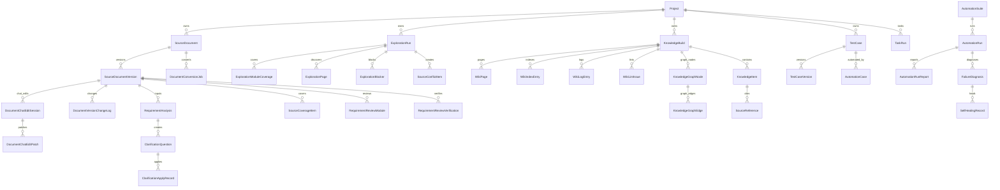

# 03-02 AI测试系统 - 数据模型 PRD

## 1. 这份文档解决什么问题

本文定义 AI 测试系统第一版 SQLite 数据模型。SQLite 保存结构化元数据、状态、索引和引用关系；Markdown、自动化代码、Allure 报告、截图和 trace 等大文件保存在本地文件系统。

---

## 2. 设计原则

- SQLite 不保存大型二进制文件。
- Markdown 可保存正文，也可保存文件路径；第一版建议正文和路径都保留，便于检索和回看。
- 每个核心产物必须可追溯到来源。
- 需求、探索、知识库、用例、自动化、报告必须按项目隔离。
- 所有可变产物必须版本化。

---

## 3. 核心实体

| 实体 | 说明 |
| --- | --- |
| User | 用户账号 |
| Project | 项目 |
| ProjectMember | 项目成员分配 |
| SourceDocument | 原始文档 |
| SourceDocumentVersion | 文档版本 |
| DocumentChatEditSession | 文档 AI 对话修改会话 |
| DocumentChatEditPatch | 文档 AI 对话修改补丁 |
| DocumentConversionJob | 文档转换任务 |
| DocumentVersionChangeLog | 文档版本变化日志 |
| RequirementAnalysis | 需求分析 |
| SourceCoverageItem | 原文覆盖项 |
| ClarificationQuestion | 澄清问题 |
| ClarificationApplyRecord | 澄清写回记录 |
| RequirementReviewModule | 需求模块评审状态 |
| RequirementReviewVerification | 需求评审验证 |
| ExplorationRun | 探索任务 |
| ExplorationModuleCoverage | 探索模块覆盖 |
| ExplorationPage | 探索页面 |
| ExplorationElement | 页面字段、按钮、locator |
| ExplorationBlocker | 无法探索说明 |
| SourceConflictItem | 来源冲突项 |
| KnowledgeBuild | 知识库构建 |
| WikiPage | llm-wiki 页面 |
| WikiIndexEntry | llm-wiki index 结构化索引 |
| WikiLogEntry | llm-wiki log 结构化日志 |
| WikiLintIssue | llm-wiki 健康检查问题 |
| KnowledgeGraphNode | 知识图谱节点 |
| KnowledgeGraphEdge | 知识图谱关系 |
| KnowledgeItem | 知识条目 |
| SourceReference | 来源引用 |
| TestCase | 测试用例 |
| TestCaseVersion | 用例版本 |
| AutomationSuite | 自动化套件 |
| AutomationCase | 自动化用例 |
| AutomationRun | 自动化运行 |
| AutomationRunReport | 自动化报告 |
| FailureDiagnosis | 失败诊断 |
| SelfHealingRecord | 自愈记录 |
| ModelProvider | 模型 Provider |
| ModelProfile | 模型用途配置 |
| TaskRun | 异步任务 |
| TaskEvent | 任务事件 |
| SystemSetting | 系统设置 |

---

## 4. 关键关系

---

### 4.1 状态枚举显示规则

SQLite 中状态字段可以使用英文枚举，便于代码判断和迁移；前端界面必须显示中文文案。

| 存储枚举 | 中文显示 |
| --- | --- |
| confirmed | 已确认 |
| draft | 草稿 |
| pending | 待处理 |
| deprecated | 已废弃 |
| blocked | 阻塞 |
| running | 运行中 |
| success | 成功 |
| failed | 失败 |
| cancelled | 已取消 |

---

## 5. 关键表字段

### 5.1 projects

| 字段 | 说明 |
| --- | --- |
| id | 主键 |
| name | 项目名称 |
| code | 项目编码 |
| description | 描述 |
| status | active、archived |
| default_site_url | 默认站点 |
| created_by | 创建人 |
| created_at | 创建时间 |
| updated_at | 更新时间 |

### 5.2 source_document_versions

| 字段 | 说明 |
| --- | --- |
| id | 主键 |
| document_id | 文档 ID |
| version_no | 版本号 |
| markdown_content | Markdown 内容 |
| file_path | Markdown 文件路径 |
| source_action | upload、convert、edit、clarification_apply、candidate_requirement |
| change_summary | 变更摘要 |
| diff_summary | 差异摘要 |
| created_by | 创建人 |
| created_at | 创建时间 |

### 5.3 document_chat_edit_sessions

| 字段 | 说明 |
| --- | --- |
| id | 主键 |
| document_version_id | 文档版本 ID |
| session_type | requirement_doc、exploration_doc、candidate_requirement |
| user_prompt | 用户修改要求 |
| agent_summary | Agent 修改摘要 |
| diff_path | Markdown diff 文件路径 |
| status | draft、pending_confirm、applied、cancelled、failed |
| created_by | 创建人 |
| created_at | 创建时间 |

### 5.4 document_chat_edit_patches

| 字段 | 说明 |
| --- | --- |
| id | 主键 |
| session_id | 会话 ID |
| target_heading | 目标 Markdown 标题 |
| target_module | 目标模块 |
| patch_type | add、modify、delete、move、rewrite |
| reason | 修改原因 |
| before_text | 原内容 |
| after_text | 建议内容 |
| source_refs | 来源引用 JSON |
| impact_scope | 影响范围 JSON |
| status | pending、accepted、rejected |

### 5.5 document_conversion_jobs

| 字段 | 说明 |
| --- | --- |
| id | 主键 |
| document_id | 文档 ID |
| input_file_path | 原始 Word/PDF 文件路径 |
| output_markdown_path | Markdown 工作稿路径 |
| status | queued、running、success、failed、needs_human |
| quality_status | passed、warning、failed |
| unresolved_item_count | 无法识别项数量 |
| summary | 转换摘要 JSON |
| created_at | 创建时间 |
| finished_at | 完成时间 |

### 5.6 document_version_change_logs

| 字段 | 说明 |
| --- | --- |
| id | 主键 |
| document_id | 文档 ID |
| old_version_no | 旧版本号 |
| new_version_no | 新版本号 |
| change_type | upload、convert、edit、clarification_apply、ai_chat_edit、candidate_requirement、exploration_update |
| change_reason | 变化原因 |
| impacted_modules | 影响模块 JSON |
| impact_scope | 规则、流程、字段、状态、权限、风险、页面事实、locator |
| triggers_knowledge_update | 是否触发知识库更新 |
| change_summary | 变更摘要 |
| created_at | 创建时间 |

### 5.7 source_coverage_items

| 字段 | 说明 |
| --- | --- |
| id | 主键 |
| document_version_id | 文档版本 ID |
| source_location | 原文位置 |
| source_type | 标题、段落、表格、图片、流程、字段、规则 |
| source_summary | 原文摘要 |
| module_key | 归属模块 |
| analysis_ref | 分析结果引用 |
| coverage_status | covered、unclassified、clarification_needed、not_test_scope、deprecated |
| handling_note | 处理说明 |

### 5.8 requirement_review_modules

| 字段 | 说明 |
| --- | --- |
| id | 主键 |
| document_version_id | 文档版本 ID |
| module_key | 模块 key |
| module_name | 模块名称 |
| source_item_count | 原文覆盖项数量 |
| open_clarification_count | 未处理澄清数量 |
| status | pending、reviewing、has_clarification、completed、deprecated |
| reviewer_id | 评审人 |
| completed_at | 完成时间 |

### 5.9 requirement_review_verifications

| 字段 | 说明 |
| --- | --- |
| id | 主键 |
| document_version_id | 文档版本 ID |
| module_total | 模块总数 |
| module_completed | 已完成模块数 |
| module_unfinished | 未完成模块数 |
| source_item_total | 原文覆盖项总数 |
| source_item_unresolved | 未处理覆盖项数 |
| critical_clarification_open | 关键澄清未处理数 |
| status | passed、failed |
| note | 验证说明 |

### 5.10 exploration_runs

| 字段 | 说明 |
| --- | --- |
| id | 主键 |
| project_id | 项目 ID |
| site_url | 站点 URL |
| status | 排队中、运行中、等待人工、成功、失败 |
| scope | 探索范围 JSON |
| output_dir | 探索文档目录 |
| started_at | 开始时间 |
| finished_at | 结束时间 |

### 5.11 exploration_module_coverages

| 字段 | 说明 |
| --- | --- |
| id | 主键 |
| exploration_run_id | 探索任务 ID |
| module_key | 模块 key |
| module_name | 模块名称 |
| entry_path | 菜单路径或 URL |
| planned_page_count | 计划探索页面数 |
| explored_page_count | 已探索页面数 |
| missed_page_count | 未探索页面数 |
| operation_count | 操作覆盖数 |
| field_count | 字段覆盖数 |
| state_flow_count | 状态流转覆盖数 |
| completion_status | pending、running、completed、partial、blocked、skipped |
| completion_note | 完成说明 |

### 5.12 exploration_blockers

| 字段 | 说明 |
| --- | --- |
| id | 主键 |
| exploration_run_id | 探索任务 ID |
| module_key | 模块 key |
| page_or_action | 页面、URL 或操作入口 |
| reason | 无权限、登录失败、页面报错、接口失败、超时、禁止路径等 |
| evidence_paths | 截图、trace、video、日志路径 JSON |
| impact_scope | 候选需求、知识库、用例、自动化 |
| suggested_action | 建议动作 |
| blocking | 是否阻塞完全完成 |

### 5.13 knowledge_builds

| 字段 | 说明 |
| --- | --- |
| id | 主键 |
| project_id | 项目 ID |
| build_no | 构建编号 |
| build_type | initial、incremental、rebuild |
| input_sources | 来源 JSON |
| status | 状态 |
| output_dir | 知识库目录 |
| index_path | index.md 路径 |
| log_path | log.md 路径 |
| schema_path | AGENTS.md 路径 |
| lint_status | passed、warning、blocked |
| change_summary | 变更摘要 |
| created_by | 创建人 |
| created_at | 创建时间 |

### 5.14 wiki_pages

| 字段 | 说明 |
| --- | --- |
| id | 主键 |
| knowledge_build_id | 知识库构建 ID |
| page_path | Markdown 页面路径 |
| page_type | overview、index、module、map、quality、testing、build |
| module_key | 模块 key，可为空 |
| title | 页面标题 |
| summary | 页面摘要 |
| status | confirmed、draft、pending、deprecated；前端显示为已确认、草稿、待处理、已废弃 |
| source_count | 来源数量 |
| updated_at | 更新时间 |

### 5.15 wiki_index_entries

| 字段 | 说明 |
| --- | --- |
| id | 主键 |
| knowledge_build_id | 知识库构建 ID |
| page_id | WikiPage ID |
| module_key | 模块 key |
| title | 标题 |
| keywords | 关键词 JSON |
| business_objects | 业务对象 JSON |
| pages | 页面路径 JSON |
| states | 状态 JSON |
| roles | 角色 JSON |
| operations | 操作 JSON |
| source_count | 来源数量 |
| status | confirmed、draft、pending、deprecated；前端显示为已确认、草稿、待处理、已废弃 |

### 5.16 wiki_log_entries

| 字段 | 说明 |
| --- | --- |
| id | 主键 |
| knowledge_build_id | 知识库构建 ID |
| event_type | ingest、update、query_note、lint、deprecate |
| event_time | 事件时间 |
| input_sources | 输入来源 JSON |
| affected_modules | 影响模块 JSON |
| summary | 事件摘要 |
| output_pages | 输出页面 JSON |

### 5.17 wiki_lint_issues

| 字段 | 说明 |
| --- | --- |
| id | 主键 |
| knowledge_build_id | 知识库构建 ID |
| issue_type | missing_source、pending_as_fact、conflict_open、stale_claim、orphan_page、broken_link |
| severity | blocker、warning、info |
| page_path | 问题页面 |
| anchor | 标题锚点 |
| description | 问题说明 |
| suggested_action | 建议动作 |
| status | open、resolved、ignored |

### 5.18 knowledge_graph_nodes

| 字段 | 说明 |
| --- | --- |
| id | 主键 |
| knowledge_build_id | 知识库构建 ID |
| node_key | 节点稳定 key |
| node_type | module、page、field、state、role、rule、source、clarification、test_case、automation、diagnosis |
| label | 节点名称 |
| module_key | 所属模块，可为空 |
| wiki_page_id | 关联 WikiPage，可为空 |
| source_ref | 来源引用，可为空 |
| meta | 扩展信息 JSON |

### 5.19 knowledge_graph_edges

| 字段 | 说明 |
| --- | --- |
| id | 主键 |
| knowledge_build_id | 知识库构建 ID |
| source_node_id | 源节点 |
| target_node_id | 目标节点 |
| edge_type | belongs_to、references、impacts、depends_on、triggers、conflicts_with、supplements、writes_back |
| label | 关系名称 |
| source_ref | 来源引用 |
| meta | 扩展信息 JSON |

### 5.20 test_cases

| 字段 | 说明 |
| --- | --- |
| id | 主键 |
| project_id | 项目 ID |
| case_no | 用例编号 |
| title | 用例标题 |
| module_key | 模块 |
| priority | P0、P1、P2 |
| risk_level | high、medium、low |
| review_status | pending_review、adopted、not_adopted；前端显示为待评审、已采纳、不采纳 |
| reject_reason_type | 不采纳原因分类，可为空 |
| reject_reason_note | 不采纳补充说明，可为空 |
| feedback_to_skill | 是否可用于改进用例生成 Skill |
| automation_type | none、ui、api |
| automation_status | none、queued、generating、generated、running、passed、failed、bug_confirmed |
| source_refs | 来源引用 JSON |

### 5.21 automation_runs

| 字段 | 说明 |
| --- | --- |
| id | 主键 |
| project_id | 项目 ID |
| suite_id | 套件 ID |
| run_type | ui，api 预留 |
| status | running、success、failed、cancelled |
| pytest_args | 执行参数 |
| results_dir | Allure results |
| report_dir | Allure report |
| started_at | 开始时间 |
| finished_at | 结束时间 |

### 5.22 automation_case_progress

| 字段 | 说明 |
| --- | --- |
| id | 主键 |
| automation_run_id | 自动化运行 ID |
| test_case_id | 测试用例 ID |
| generation_status | queued、generating、generated、failed |
| execution_status | pending、running、passed、failed、bug_confirmed |
| current_step | 当前生成或执行步骤 |
| failure_reason | 失败原因摘要 |
| diagnosis_id | 关联失败诊断，可为空 |
| updated_at | 更新时间 |

### 5.22 task_runs

| 字段 | 说明 |
| --- | --- |
| id | 主键 |
| project_id | 项目 ID，可为空 |
| task_type | 任务类型 |
| status | 任务状态 |
| source_module | 来源模块 |
| source_object_id | 来源对象 |
| input_summary | 输入摘要 JSON |
| output_summary | 输出摘要 JSON |
| log_path | 日志路径 |
| created_by | 创建人 |
| created_at | 创建时间 |

---

## 6. 索引建议

| 表 | 索引 |
| --- | --- |
| projects | code unique |
| project_members | project_id、user_id |
| source_documents | project_id、document_type |
| source_document_versions | document_id、version_no |
| document_chat_edit_sessions | document_version_id、status |
| document_chat_edit_patches | session_id、target_module、status |
| document_conversion_jobs | document_id、status |
| document_version_change_logs | document_id、new_version_no、triggers_knowledge_update |
| source_coverage_items | document_version_id、module_key、coverage_status |
| requirement_review_modules | document_version_id、module_key、status |
| requirement_review_verifications | document_version_id、status |
| exploration_runs | project_id、status |
| exploration_module_coverages | exploration_run_id、module_key、completion_status |
| exploration_blockers | exploration_run_id、module_key、blocking |
| knowledge_builds | project_id、build_no |
| wiki_pages | knowledge_build_id、module_key、page_type、status |
| wiki_index_entries | knowledge_build_id、module_key、status |
| wiki_log_entries | knowledge_build_id、event_type、event_time |
| wiki_lint_issues | knowledge_build_id、severity、status |
| knowledge_graph_nodes | knowledge_build_id、node_type、module_key |
| knowledge_graph_edges | knowledge_build_id、edge_type、source_node_id、target_node_id |
| knowledge_items | build_id、module_key、status |
| test_cases | project_id、module_key、review_status |
| automation_runs | project_id、suite_id、status |
| task_runs | project_id、task_type、status |

---

## 7. 验收标准

- 数据模型能支撑项目隔离。
- 文档、知识库、测试用例、自动化运行均支持版本或历史记录。
- 需求文档原始文件、Markdown 工作稿、转换附件保存在文件系统，SQLite 保存元数据、路径、正文、覆盖矩阵和评审状态。
- 探索文档、截图、trace、video、快照保存在文件系统，SQLite 保存任务、模块覆盖、页面事实、失败原因和附件路径。
- 需求文档和探索文档的 AI 对话修改必须保存会话、补丁、diff 路径、来源引用和确认状态。
- 需求文档和探索文档的版本变化日志必须保存，供知识库判断是否需要增量更新。
- 知识库图谱节点和边必须有 SQLite 索引，支持前端绘制 Obsidian 式知识图谱。
- 来源引用能追踪到需求、探索、澄清写回、知识库条目。
- llm-wiki 的 `AGENTS.md`、`index.md`、`log.md`、模块页、lint 结果都有 SQLite 索引。
- 知识库检索能先通过 `wiki_index_entries` 定位页面，再读取 Markdown 文件。
- 知识库更新能通过 `wiki_log_entries` 追踪每次 ingest、update 和 lint。
- 需求评审能通过数据模型判断是否漏评模块或漏处理原文内容。
- 站点探索能通过数据模型判断是否漏探索模块，并记录无法探索原因。
- 接口自动化相关字段只预留，不产生一期业务数据。
- SQLite 不保存大型报告、截图、trace、video 二进制内容。
