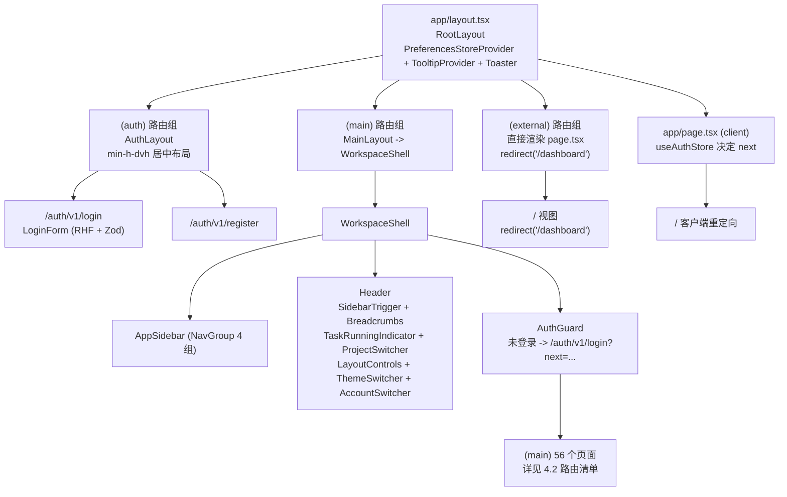

# 05-01 AI测试系统 - 前端总体方案 PRD

> **事实源（2026-07-26）**：
> - `apps/frontend/package.json`（技术栈与版本）
> - `apps/frontend/src/app/**/page.tsx`（56 个 `page.tsx`、55 个唯一 URL 模式）
> - `apps/frontend/src/app/**/layout.tsx`（8 个布局文件）
> - `apps/frontend/src/components/ai-testing/workspace-shell.tsx`（应用壳）
> - `apps/frontend/src/components/ai-testing/auth-guard.tsx`（鉴权门禁）
> - `apps/frontend/src/components/ai-testing/project-switcher.tsx`（项目切换器）
> - `apps/frontend/src/stores/project-context-store.ts`（项目上下文 store）
> - `apps/frontend/src/stores/auth-store.ts`（鉴权 store）
> - `apps/frontend/src/stores/preferences/preferences-store.ts`（偏好 store）
> - `apps/frontend/src/lib/api-client.ts`（统一 API、错误、SSE、流式下载）
> - `apps/frontend/src/navigation/sidebar/sidebar-items.ts`（侧栏一级导航）
> - 领域页面组件：`requirement-upload-page.tsx`、`test-points-panel.tsx`、`exploration-workspace.tsx`、`knowledge-search-settings.tsx`、`performance-testing/locust-console.tsx`、`api-automation/api-run-detail.tsx`、`ui-automation/{ui-automation-asset-detail,ui-automation-run-detail}.tsx`、`reports/page.tsx`
>
> 本版本以 2026-07-26 实际依赖与源码为唯一基线，删除以前 PRD 中“所有表单均使用 react-hook-form + Zod”、“业务列表统一使用 TanStack Table”、“报告中心已对接性能报告 API”等过期描述。

---

## 1. 范围与目标

本文档定义 AI 测试系统前端总体方案，覆盖技术栈、应用壳、路由、主布局、页面分类、组件体系、状态管理、API 契约与已知实现边界。前端基于 Next.js App Router，使用 TypeScript、Tailwind CSS 4、shadcn/ui + radix-ui、Biome（lint + format）、Zustand（状态管理）、Recharts（图表）、React Flow（流程图）、simple-mind-map（思维导图）、mermaid（探索路径流程图）、sonner（全局 Toast）、vaul（抽屉）、next-themes（主题）以及 Office/PDF 预览与 Word/PDF 解析等基础能力，支撑 14 个主业务模块：

- 控制台（资产健康概览 + 趋势）
- 任务中心（异步任务聚合）
- 项目管理（项目级概览、设置、日志）
- 需求文档（上传、版本、测试点）
- 站点探索（探索任务、环境、产物）
- 知识库（对话 + 检索来源设置）
- 测试用例（生成 + 手动 + 评审）
- UI 自动化（资产、生成、执行）
- 接口自动化（端点、脚本、运行、场景）
- 性能测试（脚本、运行、AI 分析、智能报告）
- 报告中心（性能报告聚合）
- 系统设置（模型配置、用户权限、系统日志、系统设置占位）

---

## 2. 技术栈（以 `apps/frontend/package.json` 为唯一基线）

| 技术 | 版本 | 用途 |
| --- | --- | --- |
| **Next.js** | 16.2.6 | 前端框架（App Router，原生支持 `(main)`/`(auth)`/`(external)` 路由组） |
| **React** | 19.2.6 | UI 库 |
| **React DOM** | 19.2.6 | 渲染 |
| **TypeScript** | 5.9.3 | 类型系统 |
| **Tailwind CSS** | 4.1.5 | 样式（CSS-first 配置） |
| **@tailwindcss/postcss** | 4.3.0 | PostCSS 插件 |
| **postcss** | 8.5.14 | 构建管线 |
| **tw-animate-css** | 1.4.0 | Tailwind 动画工具 |
| **shadcn** | 4.7.0 | 组件脚手架（`shadcn` CLI，而非运行时库） |
| **radix-ui** | 1.4.3 | 无头 UI 组件库（`components/ui/*.tsx` 全部基于 radix-ui） |
| **Biome** | 2.4.15 | Linter + Formatter（替代 ESLint/Prettier，`scripts`：`lint` / `format` / `check`） |
| **husky** | 9.1.7 | Git hook |
| **lint-staged** | 16.4.0 | staged 区检查 |
| **Zustand** | 5.0.13 | 轻量状态管理（`auth-store` / `project-context-store` / `preferences-store`） |
| **Recharts** | 3.8.0 | 图表（控制台趋势、性能测试图表、模板仪表板图表） |
| **@xyflow/react** | 12.11.2 | React Flow（接口自动化场景编辑器） |
| **@dagrejs/dagre** | 3.0.0 | 图形布局算法（配合 React Flow） |
| **Lucide React** | 1.14.0 | 图标库（侧栏、按钮、状态徽标统一图标集） |
| **react-hook-form** | 7.75.0 | 表单管理（登录表单） |
| **@hookform/resolvers** | 5.2.2 | 表单校验（配合 Zod） |
| **Zod** | 4.4.3 | Schema 校验（登录表单 Zod schema） |
| **@tanstack/react-table** | 8.21.3 | 高级表格（**仅 Dashboard 模板页使用**：`dashboard/default`、`dashboard/ecommerce`、`dashboard/crm`） |
| **react-markdown** | 10.1.0 + **remark-gfm** | Markdown 渲染（`markdown-preview.tsx`） |
| **date-fns** | 4.1.0 | 日期格式化（`formatDateTime` 等） |
| **docx-preview** | 0.3.7 | Word 文档预览 |
| **pdfjs-dist** | 5.7.284 | PDF 预览（`pdf-canvas-preview.tsx`） |
| **sonner** | 2.0.7 | Toast 通知（`app/layout.tsx` `<Toaster />`） |
| **motion** | 12.39.0 | 动画（Framer Motion） |
| **@fontsource/noto-sans-sc** | 5.2.9 | 中文字体 |
| **vaul** | 1.1.2 | 抽屉组件（`components/ui/drawer.tsx`） |
| **shiki** | 4.3.1 | 代码高亮 |
| **mermaid** | 11.15.0 | 流程图/时序图渲染 |
| **simple-mind-map** | 0.14.0-fix.3 | 思维导图（`test-point-mind-map.tsx` / `test-case-mind-map.tsx`） |
| **@ark-ui/react** | 5.36.2 | Ark UI 组件（按需使用） |
| **next-themes** | 0.4.6 | 主题切换（与 `preferences-store` 协同） |
| **class-variance-authority** | 0.7.1 | 变体管理 |
| **clsx** | 2.1.1 | 条件类名工具 |
| **tailwind-merge** | 3.6.0 | 条件类名合并 |
| **simple-icons** | 16.19.0 | 品牌图标库 |
| **react-day-picker** | 9.14.0 | 日历选择（与 `calendar.tsx` 配套） |
| **react-use-measure** | 2.1.7 | DOM 尺寸测量 |

**验收规则**：`package.json` 中未列的依赖（旧 PRD 中的 React Query / SWR / React Router / Redux / Apollo / Ant Design 等）不得在 PRD 中描述为已使用。

---

## 3. 应用壳（WorkspaceShell）

应用壳由 `apps/frontend/src/components/ai-testing/workspace-shell.tsx` 内的 `WorkspaceShell` 组件统一注入：

```
SidebarProvider（受 cookie `sidebar_state` 与 `sidebar_variant` 偏好控制）
└── AppSidebar（左侧导航，分组：工作台 / 项目工作区 / 测试资产 / 系统管理）
    └── injected by SidebarProvider
SidebarInset（max-w-screen-2xl，自带 backdrop blur，圆角）
└── Header（sticky top-0, h-12, overflow-hidden, backdrop-blur）
    ├── SidebarTrigger（折叠/展开）
    ├── WorkspaceBreadcrumbs（顶部面包屑）
    ├── TaskRunningIndicator（后台任务全局运行指示器）
    ├── ProjectSwitcher（scope="project"，全局项目切换）
    ├── LayoutControls（侧栏/主题布局偏好）
    ├── ThemeSwitcher（next-themes 主题切换）
    └── AccountSwitcher（账号菜单）
└── Content p-4 md:p-6
    └── AuthGuard（未登录跳转 /auth/v1/login?next=...）
        └── {children}
```

**关键事实**

- **AuthGuard**：基于 `useAuthStore` 的 `hasHydrated` 与 `token` 判断；未登录时 `router.replace('/auth/v1/login?next={pathname}')`，渲染期间显示 `正在检查登录状态` 骨架。
- **ProjectSwitcher**：基于 `useProjectContextStore`（`scope` / `currentProjectId`），写 `localStorage`：`ai-testing.project.scope`、`ai-testing.project.current`；打开时拉取 `/projects`，过滤状态非 `archived` 的项目，又称"项目上下文切换"。
- **TaskRunningIndicator**：全局 `ai-testing` run 计数指示器，列表页创建资源后通过 `notifyAiTaskStarted()` 触发。
- **Sidebar**：数据源为 `navigation/sidebar/sidebar-items.ts`，分组与项目上下文（`projectScoped`）受限规则参考 `05-02-AI测试系统-导航与页面映射清单.md`。

---

## 4. 路由清单与主布局

### 4.1 路由组（来自 `app/**/layout.tsx`）

| 路由组 | 布局 | 用途 |
| --- | --- | --- |
| `app/layout.tsx` | RootLayout | 全局 HTML 容器、`<TooltipProvider>`、`<PreferencesStoreProvider>`、`<Toaster />`、`<ThemeBootScript />` |
| `app/(auth)/layout.tsx` | AuthLayout | `min-h-dvh` 居中布局，无侧栏 |
| `app/(main)/layout.tsx` | MainLayout | 直接渲染 `WorkspaceShell`（所有需登录页面） |
| `app/(main)/dashboard/layout.tsx` | DashboardLayout | 仪表板区块内的统一布局（多余层级，目前被 `MainLayout` 覆盖） |
| `app/(main)/projects/layout.tsx` | ProjectsLayout | 项目工作区下的统一容器（目前等价 `MainLayout`） |
| `app/(main)/tasks/layout.tsx` | TasksLayout | 任务中心布局 |
| `app/(main)/reports/layout.tsx` | ReportsLayout | 报告中心布局 |
| `app/(main)/settings/layout.tsx` | SettingsLayout | 系统管理布局 |

### 4.2 页面文件与唯一 URL 模式

> 当前共 **56 个 `app/**/page.tsx`**，去重后映射到 **55 个 URL 模式**（`/dashboard/[...not-found]` 中，`[...not-found]` 本身不计入 URL 模式）。

| # | 路由模式 | 页面文件 | 主布局 | 备注 |
| --- | --- | --- | --- | --- |
| 1 | `/auth/v1/login` | `app/(auth)/auth/v1/login/page.tsx` | (auth) | 登录 |
| 2 | `/auth/v1/register` | `app/(auth)/auth/v1/register/page.tsx` | (auth) | 用户注册 |
| 3 | `/dashboard` | `app/(main)/dashboard/page.tsx` | (main) | 全局控制台 |
| 4 | `/dashboard/default` | `app/(main)/dashboard/default/page.tsx` | (main) | 模板仪表板 |
| 5 | `/dashboard/analytics` | `app/(main)/dashboard/analytics/page.tsx` | (main) | 模板仪表板 |
| 6 | `/dashboard/ecommerce` | `app/(main)/dashboard/ecommerce/page.tsx` | (main) | 模板仪表板 |
| 7 | `/dashboard/finance` | `app/(main)/dashboard/finance/page.tsx` | (main) | 模板仪表板 |
| 8 | `/dashboard/productivity` | `app/(main)/dashboard/productivity/page.tsx` | (main) | 模板仪表板 |
| 9 | `/dashboard/crm` | `app/(main)/dashboard/crm/page.tsx` | (main) | 模板仪表板 |
| 10 | `/dashboard/academy` | `app/(main)/dashboard/academy/page.tsx` | (main) | 模板仪表板 |
| 11 | `/dashboard/coming-soon` | `app/(main)/dashboard/coming-soon/page.tsx` | (main) | 占位页 |
| 12 | `/dashboard/[...not-found]` | `app/(main)/dashboard/[...not-found]/page.tsx` | (main) | 兜底 404 |
| 13 | `/tasks` | `app/(main)/tasks/page.tsx` | (main) | 任务中心 |
| 14 | `/reports` | `app/(main)/reports/page.tsx` | (main) | 报告中心 |
| 15 | `/requirements` | `app/(main)/requirements/page.tsx` | (main) | 需求主入口 |
| 16 | `/requirements/upload` | `app/(main)/requirements/upload/page.tsx` | (main) | 需求上传 |
| 17 | `/exploration` | `app/(main)/exploration/page.tsx` | (main) | 探索主入口 |
| 18 | `/exploration/new` | `app/(main)/exploration/new/page.tsx` | (main) | 探索新建 |
| 19 | `/knowledge` | `app/(main)/knowledge/page.tsx` | (main) | 知识库 |
| 20 | `/test-cases` | `app/(main)/test-cases/page.tsx` | (main) | 测试用例 |
| 21 | `/test-cases/manual/{caseId}` | `app/(main)/test-cases/manual/[caseId]/page.tsx` | (main) | 手动用例详情 |
| 22 | `/test-cases/{setId}/review` | `app/(main)/test-cases/[setId]/review/page.tsx` | (main) | 用例集评审 |
| 23 | `/automation/ui` | `app/(main)/automation/ui/page.tsx` | (main) | UI 自动化主入口 |
| 24 | `/automation/api` | `app/(main)/automation/api/page.tsx` | (main) | 接口自动化主入口 |
| 25 | `/performance-tests` | `app/(main)/performance-tests/page.tsx` | (main) | 性能测试主入口 |
| 26 | `/performance-tests/new` | `app/(main)/performance-tests/new/page.tsx` | (main) | 性能测试新建 |
| 27 | `/projects` | `app/(main)/projects/page.tsx` | (main) | 项目列表 |
| 28 | `/projects/{projectId}` | `app/(main)/projects/[projectId]/page.tsx` | (main) | 项目概览 |
| 29 | `/projects/{projectId}/settings` | `app/(main)/projects/[projectId]/settings/page.tsx` | (main) | 项目设置 |
| 30 | `/projects/{projectId}/logs` | `app/(main)/projects/[projectId]/logs/page.tsx` | (main) | 项目日志 |
| 31 | `/projects/{projectId}/requirements/{documentId}` | `app/(main)/projects/[projectId]/requirements/[documentId]/page.tsx` | (main) | 需求文档详情 |
| 32 | `/projects/{projectId}/requirements/{documentId}/versions` | `app/(main)/projects/[projectId]/requirements/[documentId]/versions/page.tsx` | (main) | 需求版本列表 |
| 33 | `/projects/{projectId}/requirements/{documentId}/versions/{versionId}` | `app/(main)/projects/[projectId]/requirements/[documentId]/versions/[versionId]/page.tsx` | (main) | 需求版本详情 |
| 34 | `/projects/{projectId}/exploration/{runId}` | `app/(main)/projects/[projectId]/exploration/[runId]/page.tsx` | (main) | 探索详情（SSE） |
| 35 | `/projects/{projectId}/exploration/{runId}/edit` | `app/(main)/projects/[projectId]/exploration/[runId]/edit/page.tsx` | (main) | 探索编辑 |
| 36 | `/projects/{projectId}/exploration/new` | `app/(main)/projects/[projectId]/exploration/new/page.tsx` | (main) | 探索新建 |
| 37 | `/projects/{projectId}/automation/ui/assets/{assetId}` | `app/(main)/projects/[projectId]/automation/ui/assets/[assetId]/page.tsx` | (main) | UI 资产详情 |
| 38 | `/projects/{projectId}/automation/ui/assets/{assetId}/runs/{runId}` | `app/(main)/projects/[projectId]/automation/ui/assets/[assetId]/runs/[runId]/page.tsx` | (main) | UI 运行详情 |
| 39 | `/projects/{projectId}/automation/api` | `app/(main)/projects/[projectId]/automation/api/page.tsx` | (main) | 项目级接口自动化 |
| 40 | `/projects/{projectId}/automation/api/cases/{caseId}` | `app/(main)/projects/[projectId]/automation/api/cases/[caseId]/page.tsx` | (main) | 接口用例详情 |
| 41 | `/projects/{projectId}/automation/api/runs/{runId}` | `app/(main)/projects/[projectId]/automation/api/runs/[runId]/page.tsx` | (main) | 接口运行详情 |
| 42 | `/projects/{projectId}/automation/api/scenarios/{scenarioId}` | `app/(main)/projects/[projectId]/automation/api/scenarios/[scenarioId]/page.tsx` | (main) | 接口场景（React Flow） |
| 43 | `/projects/{projectId}/automation/api/scenarios/new` | `app/(main)/projects/[projectId]/automation/api/scenarios/new/page.tsx` | (main) | 接口场景新建 |
| 44 | `/projects/{projectId}/performance-tests` | `app/(main)/projects/[projectId]/performance-tests/page.tsx` | (main) | 项目级性能测试 |
| 45 | `/projects/{projectId}/performance-tests/new` | `app/(main)/projects/[projectId]/performance-tests/new/page.tsx` | (main) | 性能测试新建 |
| 46 | `/projects/{projectId}/performance-tests/{testId}/runs/{runId}` | `app/(main)/projects/[projectId]/performance-tests/[testId]/runs/[runId]/page.tsx` | (main) | 性能运行详情（SSE） |
| 47 | `/projects/{projectId}/performance-tests/{testId}/scripts/{scriptId}` | `app/(main)/projects/[projectId]/performance-tests/[testId]/scripts/[scriptId]/page.tsx` | (main) | 性能脚本 |
| 48 | `/settings/models` | `app/(main)/settings/models/page.tsx` | (main) | 模型配置 |
| 49 | `/settings/models/assignments` | `app/(main)/settings/models/assignments/page.tsx` | (main) | 模型能力分配 |
| 50 | `/settings/users` | `app/(main)/settings/users/page.tsx` | (main) | 用户与权限 |
| 51 | `/settings/logs` | `app/(main)/settings/logs/page.tsx` | (main) | 系统日志 |
| 52 | `/settings/logs/{logId}` | `app/(main)/settings/logs/[logId]/page.tsx` | (main) | 日志详情 |
| 53 | `/settings/system` | `app/(main)/settings/system/page.tsx` | (main) | 系统设置（占位） |
| 54 | `/unauthorized` | `app/(main)/unauthorized/page.tsx` | (main) | 无权限提示 |
| 55 | `/` | `app/(external)/page.tsx` | (external) | 无侧栏登录引导 |
| 56 | `/` | `app/page.tsx` | (root) | 重定向到 `/dashboard` 或 `/auth/v1/login` |

**根路径冲突**：`app/page.tsx` 与 `app/(external)/page.tsx` 同时映射 `/`。Next.js 路由匹配下，`app/(external)/page.tsx` 只在没有其他精确匹配的页面时命中；在生产构建中 `app/page.tsx` 优先匹配（取决于框架行为）。详见 8.2 节。

---

## 5. 页面分类

### 5.1 大页面（SSE / 长连接 / 实时）

| 页面 | 实时技术 | 关键组件 | 降级策略 |
| --- | --- | --- | --- |
| `/projects/{projectId}/performance-tests/{testId}/runs/{runId}` | `streamPerformanceRun`（`text/event-stream`） | `locust-console.tsx` | SSE 失败 → 1s 间隔轮询 stats + charts |
| `/projects/{projectId}/exploration/{runId}` | 自定义 SSE（`fetch` + `ReadableStream`） | `exploration-workspace.tsx` | 自动重连（1.5s）并在 `done` 后 `loadRun({silent:true})` |
| `/projects/{projectId}/automation/ui/assets/{assetId}/runs/{runId}` | 1.5s 轮询 live-view + 2s 轮询运行详情 | `ui-automation-run-detail.tsx` | — |

### 5.2 业务详情页（Tab + 周期轮询）

| 页面 | 关键轮询策略 |
| --- | --- |
| `/projects/{projectId}/requirements/{documentId}` | 测试点任务状态在 `queued`/`running` 时 2.5s 静默轮询 |
| `/projects/{projectId}/automation/api/runs/{runId}` | `queued`/`running` 时 3s 轮询 |
| `/projects/{projectId}/automation/api` | `awaiting_approval` 等状态 2s 轮询 |
| `/projects/{projectId}/automation/ui/assets/{assetId}` | 无轮询，按需 `loadDetail` |
| `/performance-tests`、`/projects/{projectId}/performance-tests` | 列表刷新按需，AI 分析任务状态拉取 |
| `/knowledge` | 会话列表 + 检索设置（无轮询） |
| `/reports` | 仅在切换到"性能"Tab 时调用 `listReportCenterItems()` |

### 5.3 列表页

| 模式 | 来源 | 备注 |
| --- | --- | --- |
| `PageHeader` + `ListToolbar` + `Table/TableRow` | `components/ai-testing/page-shell.tsx` | **不使用** 业务级 TanStack Table，模板仪表板（`dashboard/{default,ecommerce,crm}`）才使用 `useReactTable` |
| 批量操作 | `useLocalTableSelection`（行内 Checkbox） | 用于 `/projects`、`/settings/users` 等 |
| 搜索 | `useState` + `filter`/`useMemo` | 受 `ListToolbar.onSearch` |
| 加载态 | `TableLoadingRow` 替换列；空态用 `IllustratedEmptyState` | — |

### 5.4 模板页（Dashboard，仅英文演示）

| 页面 | 内容 |
| --- | --- |
| `/dashboard/default` | `MetricCards` + `PerformanceOverview` + `SubscriberOverview`（来自 shadcn 模板） |
| `/dashboard/analytics` | Recharts：访问者、渠道、流量质量 |
| `/dashboard/ecommerce` | TanStack Table + Recharts：商品、订单、库存 |
| `/dashboard/finance` | Recharts：余额、交易、退款 |
| `/dashboard/productivity` | 演示用生产力指标 |
| `/dashboard/crm` | TanStack Table：商机、管道 |
| `/dashboard/academy` | 课程、作业、成绩 |
| `/dashboard/coming-soon` | 占位文案 |
| `/dashboard/[...not-found]` | 兜底英文文案 |

**注意**：以上 Dashboard 模板页（4-10、12）**不属于 AI 测试主业务**，仅作为侧栏后续扩展占位。当前侧栏并未挂载这些模板（`sidebar-items.ts` 没有对应项）。

### 5.5 核心页面清单（与 05-02 对齐）

| 页面 | 路由 | 业务备注 |
| --- | --- | --- |
| 登录 | `/auth/v1/login` | RHF + Zod 登录；`useAuthStore.login()` 写 `localStorage`/`sessionStorage` |
| 注册 | `/auth/v1/register` | 管理员可禁用 |
| 控制台 | `/dashboard` | 范围切换（全部/项目）+ 30 天趋势 |
| 任务中心 | `/tasks` | 各模块异步任务聚合 |
| 项目列表 | `/projects` | 列表 + 新建/编辑/删除 |
| 项目概览 | `/projects/{projectId}` | 资产、采纳率、趋势 |
| 项目设置 | `/projects/{projectId}/settings` | **写按钮未连接 API**（只读展示） |
| 项目日志 | `/projects/{projectId}/logs` | 项目操作日志 |
| 需求上传 | `/requirements/upload` | 同时支持新建 / 追加至已有需求 |
| 需求文档 | `/projects/{projectId}/requirements/{documentId}` | 版本列表 + 测试点面板 |
| 需求版本 | `/projects/{projectId}/requirements/{documentId}/versions/{versionId}` | Markdown 内容 + Diff |
| 探索 | `/exploration` | 探索主入口 |
| 探索新建 | `/exploration/new` | 表单 |
| 探索详情 | `/projects/{projectId}/exploration/{runId}` | SSE 实时 + 报告 |
| 探索编辑 | `/projects/{projectId}/exploration/{runId}/edit` | JSON/YAML 工作台 |
| 知识库 | `/knowledge` | 对话 + 检索设置 |
| 测试用例 | `/test-cases` | 用例集列表 + 项目下钻 |
| 手动用例 | `/test-cases/manual/{caseId}` | 详情 |
| 用例评审 | `/test-cases/{setId}/review` | 评审面板 |
| UI 自动化 | `/automation/ui` | 项目聚合 |
| UI 资产 | `/projects/{projectId}/automation/ui/assets/{assetId}` | 概览 + 执行 Tab |
| UI 运行 | `/projects/{projectId}/automation/ui/assets/{assetId}/runs/{runId}` | 实时浏览器回放 |
| 接口自动化 | `/automation/api` | 全局入口 |
| 接口项目 | `/projects/{projectId}/automation/api` | 端点 + 脚本 + 运行 + 场景 |
| 接口用例 | `/projects/{projectId}/automation/api/cases/{caseId}` | 详情 |
| 接口运行 | `/projects/{projectId}/automation/api/runs/{runId}` | 详情 + 修复 |
| 接口场景 | `/projects/{projectId}/automation/api/scenarios/{scenarioId}` | React Flow 编辑 |
| 接口场景新建 | `/projects/{projectId}/automation/api/scenarios/new` | 表单 |
| 性能测试 | `/performance-tests` | 全部项目聚合 |
| 性能测试（项目） | `/projects/{projectId}/performance-tests` | 项目级 |
| 性能测试新建 | `/projects/{projectId}/performance-tests/new` | 表单 |
| 性能运行 | `/projects/{projectId}/performance-tests/{testId}/runs/{runId}` | Locust 控制台 |
| 性能脚本 | `/projects/{projectId}/performance-tests/{testId}/scripts/{scriptId}` | 脚本编辑 |
| 报告中心 | `/reports` | **当前只有"性能"Tab 接通** |
| 模型配置 | `/settings/models` | Provider 列表 |
| 模型分配 | `/settings/models/assignments` | 能力分配 |
| 用户与权限 | `/settings/users` | 用户管理 |
| 系统日志 | `/settings/logs` | 列表 |
| 日志详情 | `/settings/logs/{logId}` | 详情 |
| 系统设置 | `/settings/system` | **占位 SoonPage，未开放** |
| 未授权 | `/unauthorized` | 403 提示 |

---

## 6. 组件体系

### 6.1 基础组件（`components/ui/*.tsx`）

基于 shadcn/ui + radix-ui：

- 表单：`Button`、`Input`、`Textarea`、`Checkbox`、`RadioGroup`、`Select`（含 `Select`、`NativeSelect`、`AnimatedSelect`）、`Slider`、`Switch`、`Calendar`、`Field`（含 `FieldGroup`、`FieldLabel`、`FieldError`）
- 容器：`Card`、`Sheet`、`Dialog`、`Drawer`（vaul）、`Popover`、`HoverCard`、`Tooltip`、`Collapsible`、`Empty`
- 数据展示：`Table`、`Badge`、`Avatar`、`Separator`、`Chart`（Recharts 包装）、`StatusBadge`、`SlidingNumber`
- 反馈：`Sonner`（`Toaster`）、`AlertDialog`、`Pagination`、`Progress`、`Spinner`、`Loader`、`Skeleton`
- AI：`knowledge-chat-input`、`ai-input`、`agent-plan`、`dynamic-island-toc`、`pulsating-loader`
- 其他：`animated-characters-login-page`、`file-upload-1`、`one-clipboard`

### 6.2 状态组件（`components/ai-testing/*` + `components/ui/status-badge.tsx`）

- `StatusBadge` + `chineseCompletionTone`（统一状态展示，中文映射）
- `TaskStatusBadge`（任务中心）
- `RiskBadge` / `CoverageBadge`（按需在测试点/测试用例领域使用）

### 6.3 数据组件

- `DataTable`（基于 `@tanstack/react-table`）—— 仅出现在 Dashboard 模板页（`dashboard/{default,ecommerce,crm}`），**主业务列表未使用**
- 列表基线组件：`PageShell` + `ListToolbar` + `Table/TableBody` + `RowActions` + `TableLoadingRow` + `ProcessingState`
- 空白态：`IllustratedEmptyState`（`/illustrations/api-cases-empty-right.svg`）

### 6.4 领域组件

- `ProjectSwitcher`、`TaskRunningIndicator`、`WorkspaceBreadcrumbs`
- `SourceReference`、`TaskTimeline`、`VersionDiffViewer`
- `MarkdownPreview`（`react-markdown` + `remark-gfm`）、`StandardMarkdownEditor`
- `PdfCanvasPreview`（`pdfjs-dist`）、`OriginalFilePreview`（`docx-preview`）
- `ConfirmRiskDialog`、`EmptyState`

### 6.5 性能测试专用组件

- `LocustConsole`（SSE 控制台 + 指标卡 + 5 个 Tab）
- `LocustChartsPanel`（Recharts 趋势）
- `LocustStatisticsTable` / `LocustGenericTable`（实时统计）
- `PerformanceTestForm` / `PerformanceTestList` / `AllPerformanceTestList`
- `PerformanceAiAnalysisDrawer` / `PerformanceAiAnalysisProgress`
- `PerformanceAiEvidenceList` / `PerformanceAiConfigDiff`
- `PerformanceAnalysisReport`（展示报告快照）
- `PerformanceRunDetail` / `PerformanceTestParamsDialog`
- `LoadStageEditor` / `PerformanceDataEditor`
- `ScriptReview`（Locust 脚本审查）

### 6.6 接口自动化专用组件

- `ApiScenarioEditor` / `ApiScenarioCanvas`（React Flow + Dagre）
- `ApiScenarioStepConfig` / `ApiScenarioVersionPanel` / `ApiScenarioAssetPicker`
- `ApiScenarioRunDrawer` / `ApiScenarioList`
- `ApiRunDetail` / `ApiRepairDrawer` / `ApiRepairProgress` / `ApiRepairDiffDialog`

### 6.7 探索 / 测试点 / 知识库 / UI 自动化专用组件

- 探索：`ExplorationWorkspace`、`ExplorationRunsTable`、`ExplorationEnvironmentsTable`、`ExplorationProjectPagesTree`、`ExplorationTaskInfoPanel`、`ExplorationEnvironmentUtils`
- 测试点：`TestPointsPanel`、`TestPointsList`、`TestPointMindMap`、`TestPointCoverageSummary`、`TestCaseMindMap`、`TestCaseCollectionCard`
- 知识库：`KnowledgeSearchSettings`（全局/项目两级，5 类检索源）
- UI 自动化：`UiAutomationAssetDetail`、`UiAutomationRunDetail`（含 live-view / 浏览器回放 Dialog）
- 需求：`RequirementUploadPage` / `RequirementsPage` / `RequirementVersionDetailContent` / `RequirementFileSwitcher`

### 6.8 操作日志

- `OperationLogView`（列表/详情宏组件）
- `OperationLogDetailContent`

---

## 7. 状态管理

### 7.1 Zustand Store

| Store | 文件 | 作用 |
| --- | --- | --- |
| `useAuthStore` | `stores/auth-store.ts` | 登录 token + 当前用户；`localStorage`/`sessionStorage` 二选一 |
| `useProjectContextStore` | `stores/project-context-store.ts` | 项目范围（`all` / `project`）+ `currentProjectId`，影响项目类 API 请求 |
| `usePreferencesStore` | `stores/preferences/preferences-store.ts` | `themeMode` / `themeScheme` / `sidebarVariant`；通过 `PreferencesStoreProvider` 注入 server 初始值 |

### 7.2 表单

- 仅 **登录表单** 使用 `react-hook-form` + Zod（`app/(main)/auth/_components/login-form.tsx`）。
- 其他业务表单（探索、需求、设置、性能测试）以受控 `useState` + `Field`/`Input`/`Select` 自行校验与上报，**未引入 Zod schema**。

### 7.3 URL 参数与 `useParams`

- `useParams` 取动态段（项目 ID、文档 ID、运行 ID、脚本 ID 等）。
- `useSearchParams` 用于表单预设（`?mode=append&documentId=...`、`?tab=runs`、`?create=exploration`）。
- `router.replace(...?tab=...)` 用于更新当前 Tab（如 `ui-automation-asset-detail`）。

### 7.4 `useEffect` + `apiRequest`

- 业务列表 / 详情页通过 `useEffect` + `useCallback` 调度 `apiRequest`，由 `useState` 维护 `loading` / `error` / `data`。
- **没有引入 SWR / React Query / TanStack Query**。

### 7.5 表选择

- `useLocalTableSelection`（行级 Checkbox + 批量删除）。
- 模板仪表板：`useReactTable`（TanStack Table）。

### 7.6 偏好持久化

- `localStorage` 键：`ai-testing.auth.token`、`ai-testing.auth.user`、`ai-testing.project.scope`、`ai-testing.project.current`、`sidebar_state`（cookie）、`sidebar_variant`（cookie）。
- `sessionStorage` 备份 token/user（当 `remember=false`）。

---

## 8. API 响应与错误处理

### 8.1 统一响应（`lib/api-client.ts`）

- 类型：`ApiEnvelope<T> = { data: T; trace_id: string }`。
- 错误：`{ detail: { code, message, trace_id } }`，类 `ApiRequestError` 暴露 `code` / `status` / `traceId` / `detail`。
- `API_BASE_URL` 来自 `process.env.NEXT_PUBLIC_API_BASE_URL`，默认 `http://localhost:8000/api/v1`。

### 8.2 鉴权失效

- 401 + `code === "AUTH_REQUIRED"` → `redirectToLoginAfterAuthExpired()`：调用 `useAuthStore.logout()` 并跳转 `/auth/v1/login?next={pathname+search}`。
- 跳转前检测 `pathname.startsWith('/auth/')` 避免死循环。

### 8.3 错误上报

- `lib/error-feedback.ts`：`reportError(error, options)`：
  - 脱敏 `token` / `key` / `secret` / `password` / `authorization` / `cookie` / `captcha` / `verification` 等关键字。
  - 异步提交 `/operation-logs/client-errors`（POST），写入系统日志。
  - 使用 `sonner` 弹 `toast.error(title, { description: '追踪 ID：...' })`。
- `persistDisplayedError`：兜底显示错误并上报。

### 8.4 SSE 流（`apiRequest` 之外的两类实现）

| 场景 | 实现 | 错误回退 |
| --- | --- | --- |
| 性能测试运行 | `streamPerformanceRun`（`fetch` + `ReadableStream` + `AbortController`） | 1s 间隔轮询 `getPerformanceRunStats` / `getPerformanceRunCharts` |
| 探索运行 | `apps/frontend/src/app/.../exploration/[runId]/page.tsx` 内置 SSE 解析（`event:` / `data:` 解析，1.5s 重连） | 自动重连；流结束后 `loadRun({silent:true})` |

### 8.5 加载状态

- 表格：`TableLoadingRow`（`components/ai-testing/table-loading-row.tsx`）。
- 详情：`Spinner` / `Loader` + `Loader2` 旋转图标。
- 卡片：`Skeleton`（`components/ui/skeleton.tsx`）。

### 8.6 空状态

- `IllustratedEmptyState`（`/illustrations/api-cases-empty-right.svg`）+ `EmptyState`（`components/ui/empty.tsx`）。
- 报告中心空态：内置文案"暂无性能报告 / 接口/UI 报告尚未接入"。

---

## 9. 已知实现边界

### 9.1 报告中心 `/reports` 是静态空壳（历史口径）

- **历史描述**：将 `reports` 数组硬编码为 `[]`。
- **2026-07-26 现状**：已经接入后端 `/reports` 接口（`listReportCenterItems(projectId, reportType)`），调用 `ReportCenterItem[]`，按"接口 / 性能 / UI"三 Tab 切换。当前仅"性能"Tab 真正拉取数据；其他 Tab 占据 Tab 位但提示"接口/UI 报告尚未接入"。
- 说明此前的"reports 硬编码为 `[]`"已不再准确，但**接口 / UI 报告 Tab 仍为占位**，需在文档中显式标注。

### 9.2 根路径 `/` 路由冲突

- 实际文件：`app/page.tsx`（`router.replace('/dashboard')` 占位返回）和 `app/(external)/page.tsx`（`redirect('/dashboard')`）。
- `app/page.tsx` 是 client component，根据 `useAuthStore` 决定跳到 `/dashboard` 或 `/auth/v1/login`；`app/(external)/page.tsx` 是 server component，直接 `redirect('/dashboard')`。
- Next.js 路由匹配下，`app/page.tsx` 会优先匹配（`/` 是显式路径），应视源为当前生效实现。

### 9.3 隐藏 Dashboard 模板页

- `/dashboard/{default,analytics,finance,productivity,ecommerce,crm,academy}`、`/dashboard/coming-soon`、`/dashboard/[...not-found]` 全部为 shadcn 英文演示模板，**不属于 AI 测试主业务**。
- 侧栏未挂载这些页面（`sidebar-items.ts` 无对应项）；只在用户手工输入 URL 时可访问。
- PRD 中显式标注"非主业务"，避免被误当作正式控制台。

### 9.4 `/settings/system` 占位

- `app/(main)/settings/system/page.tsx` 仅渲染 `<SoonPage description="系统设置将在接入真实存储、Runner、Allure 和安全策略后开放。" />`。
- 侧栏未暴露入口（在 `sidebar-items.ts` 的"系统管理"分组中无 `systemSettings`）；仅允许通过 URL 直接访问。

### 9.5 项目设置页 `/projects/{projectId}/settings` 写按钮未连接 API

- 当前 UI 仅展示 `Project` 概览（项目名 / ID / 状态 / 描述）。
- "保存设置" / "配置成员权限" / "配置环境变量" / "归档项目" 按钮均为 `<Button>` 无 `onClick`，**未连接任何 patch / post / delete 接口**。

### 9.6 模板页与主业务混用组件

- `dashboard/{default,analytics,ecommerce,finance,productivity,crm,academy}` 引用 `PageShell` / `ShellSection` / `StatusBadge` 等共享组件，但内容为英文示例，**不应作为正式控制台功能的来源**。

### 9.7 mermaid / simple-mind-map 输出

- `simple-mind-map` 用于 `test-point-mind-map.tsx` / `test-case-mind-map.tsx` 渲染脑图。
- `mermaid` 在各领域页面中由 `react-markdown` 内的 mermaid 插件按需渲染。
- `package.json` 中 `mermaid` 版本 **11.15.0**；若启用需配合 `useMeasure` 等执行环境。

### 9.8 AI 任务反馈链路

- 业务页面发起 AI 任务后调用 `notifyAiTaskStarted()` 广播事件，触发：
  - `TaskRunningIndicator` 全局指示器 +1；
  - 上跳 `/tasks` 中心列表可见。
- 任务中心页本身无逐项"取消"按钮，依赖各领域页的轮询返回"已生成/失败"。

### 9.9 浏览器侧实时视频流

- UI 自动化运行详情页通过 `getUiAutomationLiveView` 拉取 MJPEG `stream_path`，与认证 `Authorization` 头不兼容，因此直接拼接在 `API_BASE_URL`，使用 `` 渲染（被 `biome-ignore lint/performance/noImgElement` 显式忽略）。

### 9.10 即将转 PRD 评审（性能智能分析报告）

- 工作树中存在 `apps/frontend/src/app/(main)/projects/[projectId]/performance-tests/[testId]/runs/[runId]/analysis/[analysisId]/page.tsx`（**未跟踪**），用于渲染 AI 分析报告。
- 该页面不在 56 个已跟踪 `page.tsx` 计数中，但已经前端存在；如正式版纳入，需要更新 4.2 路由清单与 5.x 页面分类。

---

## 10. AppShell 树形图



---

## 11. 验收 / 核对规则

| 规则 | 依据路径 |
| --- | --- |
| 技术栈与 `package.json` 依赖一致 | `apps/frontend/package.json` |
| 路由与 `app/**/page.tsx` 文件对应（56 个 `page.tsx`、55 个唯一 URL 模式） | `apps/frontend/src/app/`（`git ls-files` 计数） |
| 应用壳由 `WorkspaceShell` 统一注入 | `apps/frontend/src/components/ai-testing/workspace-shell.tsx` |
| 项目上下文通过 `useProjectContextStore` 管理 | `apps/frontend/src/stores/project-context-store.ts` |
| 鉴权状态通过 `useAuthStore` 管理；401 + `AUTH_REQUIRED` 跳登录 | `apps/frontend/src/stores/auth-store.ts` + `api-client.ts` 中 `redirectToLoginAfterAuthExpired` |
| 统一响应 `{ data, trace_id }`、错误 `ApiRequestError` | `apps/frontend/src/lib/api-client.ts:5-44, 706-738` |
| 仅登录表单使用 RHF + Zod；其他业务表单使用受控 `useState` | `apps/frontend/src/app/(main)/auth/_components/login-form.tsx` |
| 业务列表通过 `useEffect` + `apiRequest` 管理加载态；模板仪表板使用 TanStack Table | `apps/frontend/src/app/(main)/**/page.tsx` + `apps/frontend/src/app/(main)/dashboard/{default,ecommerce,crm}/_components/**` |
| SSE 流用于性能测试运行与探索运行 | `apps/frontend/src/lib/api-client.ts:1756-1787` + `apps/frontend/src/app/(main)/projects/[projectId]/exploration/[runId]/page.tsx` |
| React Flow 用于接口自动化场景编辑 | `apps/frontend/src/components/ai-testing/api-automation/api-scenario-canvas.tsx` |
| Recharts 用于控制台、模板仪表板与性能测试图表 | `apps/frontend/src/app/(main)/dashboard/_components/asset-trend-chart.tsx` + `components/ai-testing/performance-testing/locust-charts-panel.tsx` |
| next-themes 配合 `usePreferencesStore` 实现主题切换 | `apps/frontend/src/stores/preferences/preferences-store.ts` + `app/layout.tsx` `<ThemeBootScript />` |
| vaul 抽屉基础组件、Demo 抽屉基于 shadcn | `apps/frontend/src/components/ui/drawer.tsx` |
| 报告中心 `/reports` 仅"性能"Tab 接通 API，"接口"/"UI" Tab 仍为占位 | `apps/frontend/src/app/(main)/reports/page.tsx:14-19, 23-45` |
| 根路径 `/` 存在 `app/page.tsx` 与 `app/(external)/page.tsx` 两处映射 | `apps/frontend/src/app/page.tsx` + `apps/frontend/src/app/(external)/page.tsx` |
| Dashboard 模板页（`/dashboard/{default,analytics,...}`）是英文演示，不属于 AI 测试主业务 | `apps/frontend/src/app/(main)/dashboard/{default,analytics,finance,productivity,ecommerce,crm,academy}/page.tsx` |
| `/settings/system` 渲染 `SoonPage`，未开放 | `apps/frontend/src/app/(main)/settings/system/page.tsx` |
| `/projects/{projectId}/settings` 写按钮未连接 API | `apps/frontend/src/app/(main)/projects/[projectId]/settings/page.tsx:88-98` |
| 客户端错误上报通过 `/operation-logs/client-errors` 后写入系统日志 | `apps/frontend/src/lib/error-feedback.ts:75-95` |
| Sonner 全局 Toaster 注入位置 | `apps/frontend/src/app/layout.tsx:37` |
| 安全字段（token/key/secret/...）在错误上报时会脱敏 | `apps/frontend/src/lib/error-feedback.ts:28, 106-124` |
| `simple-mind-map` 用于测试点/测试用例脑图 | `apps/frontend/src/components/ai-testing/test-point-mind-map.tsx` + `apps/frontend/src/components/ai-testing/test-case-mind-map.tsx` |
