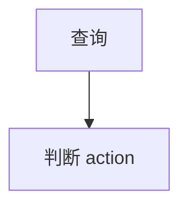

# Requirement Merge Source Block Redesign Implementation Plan

> **For agentic workers:** REQUIRED SUB-SKILL: Use superpowers:subagent-driven-development (recommended) or superpowers:executing-plans to implement this plan task-by-task. Steps use checkbox (`- [ ]`) syntax for tracking.

**Goal:** Replace user-visible requirement merge outputs with source-block based `合并后的文档`、`段落映射`、`明显冲突` while keeping quality checks internal.

**Architecture:** Add a source-block extraction layer that groups standard Markdown by readable requirement blocks instead of tiny Markdown fragments. Keep the current staged merge engine for now, but write machine artifacts for source blocks and render only three public Markdown artifacts. Quality evaluation remains internal and drives status/confirmation only.

**Tech Stack:** Python, Pydantic, pytest/unittest, existing backend services under `apps/backend/app/services`.

---

### Task 1: SourceBlock Extraction

**Files:**
- Modify: `apps/backend/app/schemas/requirement_merge.py`
- Create: `apps/backend/app/services/requirement_source_block_service.py`
- Test: `apps/backend/tests/test_requirement_merge_service.py`

- [ ] **Step 1: Write failing tests**

Add tests that prove:

```python
def test_source_blocks_keep_section_context_and_structures_together(self):
    source = RequirementMergeSourceFile(
        mapping_id="docmap-api",
        original_filename="接口契约.md",
        markdown_content="""# 总标题

## login_ticket 生成接口

产品后端调用认证中心创建登录票据。

请求地址：

POST /api/sso/ticket/create

| 字段 | 类型 | 说明 |
| --- | --- | --- |
| product_code | string | 产品编码 |

```json
{"code": "SUCCESS"}
```

## 查询产品进入状态接口


""",
        conversion_status="success",
        mapping_status="pending_merge",
    )

    blocks = build_source_blocks([source])

    self.assertEqual([block.block_id for block in blocks], ["A-01", "A-02"])
    self.assertIn("| product_code |", blocks[0].markdown)
    self.assertIn("```json", blocks[0].markdown)
    self.assertIn("```mermaid", blocks[1].markdown)
```

- [ ] **Step 2: Run test and verify RED**

Run:

```bash
cd apps/backend
.\.venv\Scripts\python.exe -m pytest tests/test_requirement_merge_service.py -q -k source_blocks
```

Expected: fails because `build_source_blocks` does not exist.

- [ ] **Step 3: Implement source block schema and service**

Add `RequirementSourceBlock` with block id, source code, sequence, mapping id, source file, heading path, markdown, plain text, sub headings, content types, anchors, preserve flag, token estimate, hashes.

- [ ] **Step 4: Run test and verify GREEN**

Run the same targeted test command and expect pass.

### Task 2: Three Public Artifacts

**Files:**
- Modify: `apps/backend/app/services/requirement_merge_artifact_service.py`
- Test: `apps/backend/tests/test_requirement_merge_service.py`

- [ ] **Step 1: Write failing tests**

Add tests that `write_merge_artifacts` and `read_merge_artifact_tabs` return only:

```python
["merged", "mapping", "conflicts"]
```

and never return `report`.

- [ ] **Step 2: Run test and verify RED**

Run:

```bash
cd apps/backend
.\.venv\Scripts\python.exe -m pytest tests/test_requirement_merge_service.py -q -k "artifact or report"
```

- [ ] **Step 3: Update artifact rendering**

Render `merged.md`, `mapping.md`, `conflicts.md` as public tabs. Keep `quality_result` in returned metadata and JSON, not as a Markdown tab.

- [ ] **Step 4: Run test and verify GREEN**

Run targeted artifact tests.

### Task 3: Wire Source Blocks Into Orchestrator Artifacts

**Files:**
- Modify: `apps/backend/app/services/document_merge_orchestrator.py`
- Modify: `apps/backend/app/services/requirement_merge_artifact_service.py`
- Test: `apps/backend/tests/test_requirement_merge_service.py`

- [ ] **Step 1: Write failing tests**

Assert machine artifacts include `source-blocks.json` and old `fragments.json` is no longer the primary artifact key.

- [ ] **Step 2: Run test and verify RED**

Run targeted machine artifact tests.

- [ ] **Step 3: Implement wiring**

Build source blocks beside legacy fragments, pass blocks to artifact writer, and write `source-blocks.json` plus compatibility `fragments.json` if needed.

- [ ] **Step 4: Run targeted tests**

Run source block and artifact tests.

### Task 3.5: Use Source Blocks As V2 Merge Units

**Files:**
- Modify: `apps/backend/app/services/document_merge_orchestrator.py`
- Modify: `apps/backend/app/services/requirement_source_block_service.py`
- Test: `apps/backend/tests/test_document_service.py`

- [x] **Step 1: Assert v2 receives source-block ids**

`test_merge_document_markdown_deduplicates_and_creates_initial_version` verifies the merge agent receives `A-01` and `B-01` instead of legacy `frag-*` ids.

- [x] **Step 2: Add compatibility adapter**

`source_blocks_to_fragments()` adapts `RequirementSourceBlock` into the existing `RequirementSourceFragment` shape so the staged v2 engine can run without a broad schema rewrite.

- [x] **Step 3: Wire orchestrator**

The orchestrator now builds source blocks, passes adapted source-block fragments to v2, and writes both `source-blocks.json` and legacy `fragments.json` for audit compatibility.

- [x] **Step 4: Stabilize source document ordering**

Merge input files are sorted by `created_at` then `id`, so source codes are assigned deterministically as `A/B/C/...`.

### Task 4: Regression Verification

**Files:**
- Existing backend tests only.

- [ ] **Step 1: Run requirement merge tests**

```bash
cd apps/backend
.\.venv\Scripts\python.exe -m pytest tests/test_requirement_merge_service.py -q
```

- [ ] **Step 2: Run document merge tests**

```bash
cd apps/backend
.\.venv\Scripts\python.exe -m pytest tests/test_document_service.py -q -k merge
```

- [ ] **Step 3: Review git diff**

Ensure only requirement merge implementation, tests, and plan/spec docs changed.
