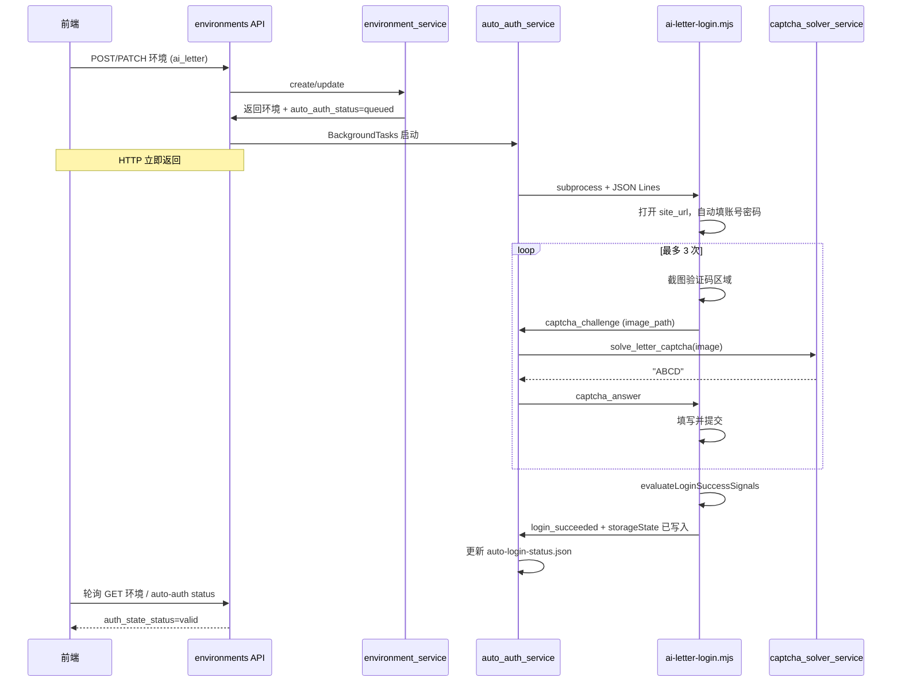

# 环境保存触发字母 AI 自动登录 Implementation Plan

> **For agentic workers:** REQUIRED SUB-SKILL: Use superpowers:subagent-driven-development (recommended) or superpowers:executing-plans to implement this plan task-by-task. Steps use checkbox (`- [ ]`) syntax for tracking.

**Goal:** 当探索环境保存为「账号密码 + 字母 AI 校验 + 复用登录态」时，后端异步用 Playwright CLI 自动登录（验证码截图 → 多模态识别 → 最多 3 次重试），成功后写入 `storage-state.json`；后续探索任务若已有有效登录态则直接复用，不再重复登录。

**Architecture:** 在现有 `manual-auth-session.mjs` 凭据填充与登录成功检测能力之上，新增一次性 headless runner `ai-letter-login.mjs`，通过 JSON Lines 与 Python 编排器通信；Python 侧 `auto_auth_service` 负责启动 runner、调用 `captcha_solver_service`（独立 AI 能力，不进入探索 Agent 上下文），并将任务状态写入环境目录下的受控状态文件。`environment_service` 在 create/update 成功后按条件投递后台任务。探索侧沿用已有 `_stored_auth_state_path_for_run`，仅补回归测试。

**Tech Stack:** FastAPI `BackgroundTasks`、Playwright Node runner、LangChain `ChatOpenAI` 多模态、`manual-auth-session.mjs` 可复用导出、pytest、`exploration-workspace.tsx` 轮询状态。

**依赖规格:** [2026-06-06-exploration-captcha-auth-state-design.md](../specs/2026-06-06-exploration-captcha-auth-state-design.md)（阶段 4/5 中与本需求重叠部分）

**非目标（本计划不做）:**
- `captcha_strategy=none` 的纯账号密码自动登录（可后续单独开计划）
- 滑块/短信/点选验证码
- 保存环境时同步阻塞等待登录完成（一律异步）
- 探索运行中登录失败后的现场重试 UI

---

## 文件结构

| 文件 | 职责 |
|------|------|
| `apps/backend/runners/playwright/ai-letter-login.mjs` | Headless 登录：填表、定位验证码、截图、提交、保存 storageState |
| `apps/backend/runners/playwright/ai-letter-login.test.mjs` | Runner 单元测试（验证码定位、重试、成功检测） |
| `apps/backend/app/services/captcha_solver_service.py` | 读取验证码截图，调用多模态模型，返回字母串 |
| `apps/backend/app/services/auto_auth_service.py` | 编排 runner ↔ solver，管理任务状态与重试 |
| `apps/backend/app/services/environment_service.py` | create/update 后触发 `schedule_ai_letter_auto_auth` |
| `apps/backend/app/api/v1/environments.py` | `BackgroundTasks` + 可选 status 查询端点 |
| `apps/backend/app/agents/capabilities.py` | 新增 `letter_captcha_recognition` 能力 |
| `apps/backend/app/schemas/environment.py` | 响应增加 `auto_auth_status` / `auto_auth_message`（派生字段） |
| `apps/backend/tests/test_auto_auth_service.py` | 编排与状态机测试 |
| `apps/backend/tests/test_captcha_solver_service.py` | Solver 契约测试（mock LLM） |
| `apps/frontend/src/components/ai-testing/exploration-workspace.tsx` | 保存后提示 + 轮询登录态 |

探索复用（已存在，仅验证）:
- `apps/backend/app/services/exploration/site_orchestrator.py` → `_stored_auth_state_path_for_run`
- `apps/backend/app/services/exploration/service.py` → `_stored_auth_state_path_for_run`

---

## 端到端流程



---

### Task 1: AI 能力与验证码识别服务

**Files:**
- Modify: `apps/backend/app/agents/capabilities.py`
- Create: `apps/backend/app/services/captcha_solver_service.py`
- Test: `apps/backend/tests/test_captcha_solver_service.py`

- [ ] **Step 1: 写失败测试**

```python
def test_solve_letter_captcha_returns_normalized_uppercase(monkeypatch):
    # mock build_agent_model + ainvoke，返回 "ab12"
    assert solve_letter_captcha(path) == "AB12"

def test_solve_letter_captcha_rejects_empty_model_output(monkeypatch):
    # 空/非字母 → CaptchaSolverError
```

- [ ] **Step 2: 运行测试确认 RED**

```powershell
cd apps/backend
.\.venv\Scripts\python.exe -m pytest tests/test_captcha_solver_service.py -q
```

- [ ] **Step 3: 实现 `captcha_solver_service`**

要点:
- 新增能力 ID：`letter_captcha_recognition`（设置页可分配视觉模型）
- 输入：PNG 文件路径（runner 写入 `auth/captcha-attempt-{n}.png`）
- Prompt：只输出 4–6 位字母数字，无解释
- 输出：`.upper()` 并 `re.sub(r'[^A-Z0-9]', '', ...)`
- 日志/异常：**不得**包含识别结果明文（仅 "captcha solve failed"）
- 设置页种子数据：在 `init_db.py` 或能力列表中注册（无需默认模型，未配置时 auto_auth 返回明确失败）

- [ ] **Step 4: 测试 GREEN**

---

### Task 2: Playwright Runner `ai-letter-login.mjs`

**Files:**
- Create: `apps/backend/runners/playwright/ai-letter-login.mjs`
- Create: `apps/backend/runners/playwright/ai-letter-login.test.mjs`
- Modify: `apps/backend/runners/playwright/manual-auth-session.mjs`（如需导出 `captchaInputSelector` 等，保持向后兼容）

- [ ] **Step 1: 写 runner 测试（Node test）**

覆盖:
- `locateCaptchaImage()` 在常见 DOM 结构下返回 element
- 收到 `captcha_answer` 后填入验证码输入框
- 超过 `maxAttempts` 后 exit code 非 0
- 登录成功信号命中后调用 `storageState({ path })`

```powershell
cd apps/backend/runners/playwright
npm test -- ai-letter-login.test.mjs
```

- [ ] **Step 2: 实现 runner 协议**

**启动参数:**

```text
node ai-letter-login.mjs <siteUrl> <storageStatePath> [channel]
```

**环境变量（与规格一致）:**

```text
AI_TESTING_LOGIN_USERNAME
AI_TESTING_LOGIN_PASSWORD
AI_TESTING_CAPTCHA_MAX_ATTEMPTS=3
```

**stdout 事件（JSON Lines，kind 字段）:**

```json
{ "kind": "session_started", "url": "..." }
{ "kind": "captcha_challenge", "attempt": 1, "image_path": "/abs/path.png" }
{ "kind": "login_attempt", "attempt": 1, "result": "captcha_rejected" }
{ "kind": "login_succeeded", "reasons": ["logged_in_ui_signal"] }
{ "kind": "login_failed", "reason": "captcha_exhausted" }
```

**stdin 命令:**

```json
{ "type": "captcha_answer", "attempt": 1, "value": "ABCD" }
{ "type": "abort" }
```

**实现要点:**
- `headless: true`（与 manual 区分）
- 复用 `autofillCredentials`、`evaluateLoginSuccessSignals`、`startCredentialAutofill`（来自 `manual-auth-session.mjs`）
- 验证码定位启发式（按优先级）:
  1. `img` 且 `src` 含 `captcha|verify|code|kaptcha`
  2. 紧邻 `input`（placeholder/name 含验证码）的 `img`/`canvas`
  3. `canvas` 在登录表单内
- 截图：element screenshot → `auth/captcha-attempt-{n}.png`（目录与 `storage-state.json` 同级）
- 每次提交后等待 1–2s，检测失败文案（复用 `LOGIN_FAILURE_PATTERN`）则进入下一轮
- 成功：`context.storageState({ path: storageStatePath })` 后 exit 0
- stderr/stdout **禁止**打印密码与验证码明文

- [ ] **Step 3: Node 测试 GREEN**

---

### Task 3: Python 编排 `auto_auth_service`

**Files:**
- Create: `apps/backend/app/services/auto_auth_service.py`
- Create: `apps/backend/tests/test_auto_auth_service.py`

- [ ] **Step 1: 写失败测试**

```python
def test_should_schedule_when_ai_letter_and_reuse_auth_state()
def test_should_not_schedule_for_manual_or_none_captcha()
def test_run_auto_auth_writes_storage_state_on_success(monkeypatch, tmp_path)
def test_run_auto_auth_marks_failed_when_solver_unavailable(monkeypatch)
def test_concurrent_schedule_skips_if_already_running(monkeypatch)
```

- [ ] **Step 2: RED → 实现**

核心 API:

```python
def should_schedule_ai_letter_auto_auth(environment: dict) -> bool: ...
def schedule_ai_letter_auto_auth(project_id: str, environment_id: str) -> None: ...
def get_auto_auth_status(project_id: str, environment_id: str) -> dict: ...
def _run_ai_letter_auto_auth(project_id: str, environment_id: str) -> None: ...
```

状态文件 `auth/auto-login-status.json`:

```json
{
  "status": "queued|running|succeeded|failed",
  "message": "正在识别验证码（第 2/3 次）",
  "updated_at": "ISO8601",
  "last_error_code": "CAPTCHA_SOLVE_FAILED"
}
```

编排逻辑:
1. 加载环境 + `load_credentials`
2. 写 `running`，启动 `subprocess.Popen` runner
3. 读 stdout 行：遇 `captcha_challenge` → `solve_letter_captcha` → stdin 写 answer
4. 成功：删临时 captcha 图（可选保留最后一次失败证据到 `auth/` 受控目录），写 `succeeded`
5. 失败：写 `failed`，**不**写 storage state
6. 进程锁：同环境同时只允许一个 auto auth（内存 set + 状态文件 `running`）

线程模型：与 `exploration.py` 一致，用 `threading.Thread(daemon=True)` 或 API 层 `BackgroundTasks` 调用 `schedule_*`。

- [ ] **Step 3: pytest GREEN**

---

### Task 4: 挂接到环境保存

**Files:**
- Modify: `apps/backend/app/services/environment_service.py`
- Modify: `apps/backend/app/api/v1/environments.py`
- Modify: `apps/backend/app/presentation/serializers.py`
- Modify: `apps/backend/app/schemas/environment.py`
- Test: `apps/backend/tests/test_environment_service.py`

- [ ] **Step 1: 写失败测试**

```python
def test_create_ai_letter_schedules_auto_auth(monkeypatch):
    # monkeypatch schedule_ai_letter_auto_auth
    create(..., captcha_strategy="ai_letter", reuse_auth_state=True)
    assert scheduled

def test_create_ai_letter_without_reuse_auth_state_does_not_schedule(...)
def test_update_sensitive_fields_clears_auth_then_reschedules(...)
```

- [ ] **Step 2: 实现触发条件**

在 `create_project_environment` / `update_project_environment` **return 之前**:

```python
if should_schedule_ai_letter_auto_auth(result):
    schedule_ai_letter_auto_auth(project_id, environment_id)
```

触发条件（全部满足）:
- `login_strategy == "account_password"`
- `captcha_strategy == "ai_letter"`
- `reuse_auth_state is True`
- `has_saved_credentials is True`

更新场景：`_should_clear_auth_state` 已删除旧登录态后，若仍满足上述条件则重新调度。

- [ ] **Step 3: API 与序列化**

`ProjectEnvironmentOut` 增加（只读派生）:

```python
auto_auth_status: str = "idle"  # idle|queued|running|succeeded|failed
auto_auth_message: str = ""
```

`serializers.serialize_project_environment` 合并 `get_auto_auth_status()`。

可选端点（推荐，便于轮询）:

```http
GET /projects/{project_id}/environments/{environment_id}/auto-auth/status
```

- [ ] **Step 4: `environments.py` 注入 BackgroundTasks**

```python
def create_project_environment(..., background_tasks: BackgroundTasks):
    result = environment_service.create_project_environment(...)
    if should_schedule_ai_letter_auto_auth(result):
        background_tasks.add_task(run_ai_letter_auto_auth_task, project_id, environment_id)
    return result
```

> 若已在 service 内 `schedule_*` 启线程，API 层二选一，避免重复调度。

- [ ] **Step 5: pytest GREEN**

---

### Task 5: 前端保存后反馈与轮询

**Files:**
- Modify: `apps/frontend/src/components/ai-testing/exploration-workspace.tsx`

- [ ] **Step 1: 扩展类型**

```typescript
auto_auth_status?: "idle" | "queued" | "running" | "succeeded" | "failed";
auto_auth_message?: string;
```

- [ ] **Step 2: 保存成功分支**

当 `captchaStrategy === "ai_letter" && reuseAuthState`:

- Toast：`环境已保存，正在后台自动登录并保存登录态…`
- **保持**编辑弹窗打开（与 manual 策略类似），展示 `auto_auth_message`
- 启动 `setInterval` 每 2s `GET` 环境详情或 auto-auth status
- `auto_auth_status === "succeeded"` 且 `auth_state_status === "valid"` → Toast 成功，停止轮询
- `failed` → Toast 错误 + 展示 `auto_auth_message`，停止轮询

- [ ] **Step 3: 登录态区域文案**

`ai_letter` 时显示：
- 进行中：`正在通过 Playwright 自动登录（验证码 AI 识别，最多 3 次）…`
- 成功：`登录态已自动保存，探索任务将直接复用。`
- 失败：`自动登录失败，请检查账号密码或模型配置后重新保存环境。`

- [ ] **Step 4: `pnpm biome check` 通过**

---

### Task 6: 探索复用登录态（验证，无新逻辑）

**Files:**
- Test: `apps/backend/tests/test_site_exploration_agent_integration.py`

- [ ] **Step 1: 补测试**

```python
def test_exploration_passes_existing_storage_state_without_login_step(...):
    # 预置 valid storage-state.json
    # 断言 _stored_auth_state_path_for_run 非 None
    # 断言启动 runner 的 command 含 storageStatePath
```

- [ ] **Step 2: 确认探索启动时不再触发 auto_auth**

`captcha_strategy=ai_letter` 且已有 valid 登录态 → 探索 orchestrator **仅加载** storageState，不调用 `auto_auth_service`。

- [ ] **Step 3: pytest GREEN**

---

### Task 7: 设置页与文档

**Files:**
- Modify: `apps/backend/app/agents/capabilities.py`（已在 Task 1）
- Modify: `apps/frontend` 模型分配页（若能力列表硬编码需同步）
- Modify: `docs/superpowers/specs/2026-06-06-exploration-captcha-auth-state-design.md`（补充「保存时触发」段落）

- [ ] 设置 → 模型分配 出现「字母验证码识别」
- [ ] 规格文档「字母 AI 校验」增加：**环境保存成功后异步触发自动登录**；探索阶段只复用

---

### Task 8: 回归与手工验收

- [ ] **Backend**

```powershell
cd apps/backend
.\.venv\Scripts\python.exe -m pytest tests/test_auto_auth_service.py tests/test_captcha_solver_service.py tests/test_environment_service.py tests/test_site_exploration_agent_integration.py -q
```

- [ ] **Runner**

```powershell
cd apps/backend/runners/playwright
npm test
```

- [ ] **手工验收清单**

1. 配置 `letter_captcha_recognition` 视觉模型
2. 新建环境：账号密码 + 字母 AI 校验 + 复用登录态 → 保存
3. 观察 `auth/auto-login-status.json` 与 `storage-state.json`
4. 环境列表 `auth_state_status` 变为 `valid`
5. 创建探索任务 → 日志显示加载 storageState，无二次登录
6. 修改密码保存 → 旧登录态清除 → 自动重新登录
7. 验证码识别失败 3 次 → `auto_auth_status=failed`，探索无有效登录态

---

## 风险与决策

| 项 | 决策 |
|----|------|
| 同步 vs 异步 | **异步**；保存 API 不阻塞 30s+ |
| Runner 形态 | 新脚本 `ai-letter-login.mjs`，不复用 `browser-session` 交互协议 |
| 模型未配置 | 快速失败，`auto_auth_message` 提示去设置页分配模型 |
| 验证码 DOM 差异大 | v1 用启发式；失败时保留截图供运维排查（不含明文答案） |
| 与 manual 共存 | `manual` 仍走 `manual_auth_service`；`ai_letter` 走 `auto_auth_service` |
| 安全 | 验证码图、storageState 仅在 `PROJECT_FILE_STORAGE_ROOT` 内；日志脱敏 |

---

## 预估工作量

| Task | 预估 |
|------|------|
| Task 1 Captcha Solver | 0.5d |
| Task 2 Runner | 1d |
| Task 3 Auto Auth Service | 1d |
| Task 4 环境挂接 | 0.5d |
| Task 5 前端 | 0.5d |
| Task 6–8 验证 | 0.5d |
| **合计** | **~4d** |

---

## 与既有计划关系

- [2026-06-06-exploration-captcha-auth-state.md](./2026-06-06-exploration-captcha-auth-state.md) Task 1–3 已完成（环境字段 + UI）
- 本计划 = 上述规格 **阶段 5**，并明确触发点为 **环境保存**，而非探索启动
- `captcha_strategy=none` 自动登录（阶段 4）仍可作为后续独立计划
