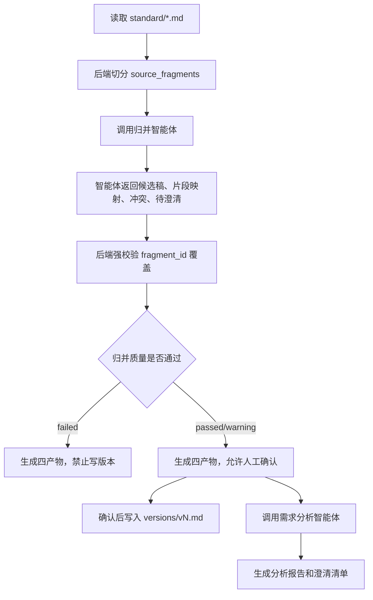

# 需求归并片段审计与后续分析设计

## 背景

当前需求归并已经生成四类产物：

```text
previews/mergerun-xxx.md       合并候选稿
mappings/mergerun-xxx.md       段落映射
conflicts/mergerun-xxx.md      明显冲突
reports/mergerun-xxx.md        归并质量报告
```

但现有实现仍有一个核心风险：`mappings` 依赖智能体返回的 `coverage_items`，后端没有在调用智能体前生成稳定的来源片段清单，因此无法严格证明“每个来源段落都被处理过”。

这会导致三个问题：

- 合并候选稿可能遗漏来源内容，但后端无法可靠发现。
- 段落映射更像“智能体自述的覆盖说明”，不是严格的逐段对账结果。
- 质量报告主要是后端模板化检查，不能替代智能体对需求质量、范围、可测试性的分析。

本设计用于下一阶段改造：先做可审计归并，再做需求分析与澄清，避免把“资料汇总”误当成“需求归并完成”。

## 目标

- 后端在归并前生成稳定的 `source_fragments`，每个片段有唯一 `fragment_id`。
- 智能体必须基于 `fragment_id` 做归并、映射、冲突识别和待澄清标记。
- 后端强校验所有 `fragment_id` 都有处理结果，缺失即失败。
- 合并候选稿仍然不展示源文档结构，来源追溯只出现在映射、冲突、报告中。
- 归并完成后，再进入独立的需求分析阶段，识别不合理、不确认、不可测试和范围不清的需求。

## 非目标

- 不把源文件名、`docmap-*` 或来源文档分组写入合并候选稿正文。
- 不让智能体直接绕过质量检查写入 `versions/vN.md`。
- 不在归并阶段强行补充未确认业务规则。
- 不把所有质量问题都塞进冲突文档；冲突只处理互斥或不能同时成立的问题。

## 总体流程



## 目录结构

需求目录保持以 `doc_id` 为根：

```text
requirements/
  {doc_id}/
    raw/
    standard/
    versions/
    previews/
    mappings/
    conflicts/
    reports/
    analyses/
    clarifications/
```

新增目录：

| 目录 | 职责 |
| --- | --- |
| `analyses/` | 保存需求分析报告 |
| `clarifications/` | 保存待澄清问题清单和确认记录 |

## 阶段一：来源片段切分

后端在调用归并智能体前，将每个 `standard/*.md` 切成来源片段。

### 片段对象

```json
{
  "fragment_id": "frag-9f4edfb5-00012",
  "mapping_id": "docmap-9f4edfb55707e6fa",
  "source_filename": "百融统一登录认证授权中心产品需求说明书.pdf",
  "heading_path": ["统一登录", "登录态", "SSO"],
  "text": "用户在官网完成登录后，应携带统一登录态进入产品侧。",
  "content_hash": "sha256:...",
  "fragment_type": "requirement"
}
```

### 切分规则

- 优先按 Markdown 标题层级切分。
- 标题下内容过长时，按列表项、表格行或自然段继续切分。
- 表格必须保留表头上下文，不能只切单元格。
- 图片、附件、阅读建议、目录页也要形成片段，但 `fragment_type` 标记为 `non_requirement`。
- 每个片段必须保留 `mapping_id` 和 `heading_path`，用于审计，不进入候选稿正文。

### 片段类型

| 类型 | 含义 |
| --- | --- |
| `requirement` | 可作为需求处理 |
| `constraint` | 约束、规则、范围边界 |
| `acceptance` | 验收标准 |
| `background` | 背景说明 |
| `attachment` | 附件、链接、图片提示 |
| `non_requirement` | 阅读建议、目录、说明性文本 |

## 阶段二：归并智能体契约

归并智能体输入不再只给整篇 Markdown，而是同时给：

- `source_files`
- `source_fragments`
- `base_version`
- `resolved_conflicts`
- `merge_mode`

智能体必须返回结构化 JSON。

### 输出字段

```json
{
  "status": "preview",
  "markdown_preview": "# 合并候选稿...",
  "merge_summary": "合入 82 条，去重 13 条，待澄清 5 条，冲突 2 处。",
  "diff_summary": "按统一身份、SSO、账号映射、安全要求重组。",
  "affected_modules": ["统一身份", "SSO", "账号映射"],
  "source_file_ids": ["docmap-a", "docmap-b"],
  "fragment_mappings": [],
  "conflicts": [],
  "clarification_items": []
}
```

### fragment_mappings

每个 `source_fragments.fragment_id` 必须有一条且只能有一条映射。

```json
{
  "fragment_id": "frag-9f4edfb5-00012",
  "mapping_id": "docmap-9f4edfb55707e6fa",
  "coverage_status": "merged",
  "target_module": "统一身份",
  "target_heading": "登录态承接",
  "merged_requirement_id": "REQ-LOGIN-003",
  "related_conflict_id": "",
  "related_clarification_id": "",
  "reason": "合入官网登录态进入产品侧的规则。"
}
```

状态枚举：

| 状态 | 含义 | 强规则 |
| --- | --- | --- |
| `merged` | 已合入候选稿 | 必须有 `target_module` 和 `target_heading` |
| `duplicate` | 与其他片段重复 | 必须说明被哪个需求覆盖 |
| `conflict` | 进入明显冲突 | 必须关联 `conflict_id` |
| `pending_clarification` | 需要澄清 | 必须关联 `clarification_id` |
| `not_testable` | 不可测试说明 | 必须说明原因 |
| `discarded` | 明确丢弃 | 必须说明丢弃原因 |

## 阶段三：后端强校验

后端不能只相信智能体总结，必须做机械校验。

### 必须校验

- 输入片段数等于映射项数。
- 每个输入 `fragment_id` 都出现在 `fragment_mappings`。
- 不允许出现输入不存在的 `fragment_id`。
- 不允许一个 `fragment_id` 被映射多次。
- `merged` 必须有目标章节。
- `conflict` 必须关联冲突编号。
- `pending_clarification` 必须关联澄清编号。
- 合并候选稿不得包含源文件名、`docmap-*`、`mapping_id`、来源文档分组。
- `merge_summary` 中的数量必须与映射统计一致。
- 四个归并产物必须全部写入成功。

### 质量结论

| 结论 | 进入条件 |
| --- | --- |
| `passed` | 无缺失、无明显冲突、无源文档结构污染 |
| `warning` | 有待澄清、不可测试、摘要轻微不一致，但不影响候选稿阅读 |
| `failed` | 有缺失映射、明显冲突、源文档结构污染、文件写入失败 |

`failed` 时不允许写入 `versions/vN.md`。

## 阶段四：四个归并产物规则

### 合并候选稿

路径：

```text
previews/{merge_run_id}.md
```

内容规则：

- 按业务模块组织。
- 不显示源文档。
- 不写未确认事实。
- 冲突内容只能进入“待确认范围”或不进入正文。
- 不可测试背景材料不进入正文。

### 段落映射

路径：

```text
mappings/{merge_run_id}.md
```

内容必须来自 `source_fragments + fragment_mappings` 的对账结果，不再只展示智能体自述。

必须包含：

- 来源片段总数。
- 各状态数量。
- 缺失片段数量。
- 每个 `fragment_id` 的处理结果。
- 目标章节或关联冲突/澄清编号。

### 明显冲突

路径：

```text
conflicts/{merge_run_id}.md
```

只记录不能同时成立的问题，例如：

- 范围互斥。
- 规则互斥。
- 新旧规则冲突。
- 验收标准与非建设范围冲突。

不应放入：

- 普通待确认问题。
- 缺少验收标准的问题。
- 描述不够清楚但不互斥的问题。

### 归并质量报告

路径：

```text
reports/{merge_run_id}.md
```

质量报告由后端校验结果和智能体归并摘要共同组成。

必须包含：

- 质量结论。
- 片段覆盖统计。
- 后端强校验结果。
- 阻塞问题。
- 非阻塞问题。
- 是否允许写入版本。
- 是否建议进入需求分析。

## 阶段五：需求分析与澄清

需求分析不建议和归并混在同一个智能体调用里。

原因：

- 归并目标是“来源内容完整、去重、重组、可追溯”。
- 分析目标是“判断需求是否合理、清楚、可测试、范围明确”。
- 混在一起会让智能体既要合并又要批判，容易遗漏来源或擅自改写业务。

建议在归并产物生成后，单独调用需求分析智能体。

### 需求分析输入

- 合并候选稿。
- 段落映射。
- 明显冲突。
- 归并质量报告。
- 项目背景和当前版本范围。

### 需求分析输出

```text
analyses/{merge_run_id}.md
clarifications/{merge_run_id}.md
```

### analyses 内容

需求分析报告关注质量问题，不再重复来源映射。

必须包含：

- 不可测试需求。
- 范围不清需求。
- 角色或权限不清需求。
- 前后依赖不清需求。
- 验收标准缺失。
- 非功能要求缺失。
- V1 范围建议。
- 后续版本建议。

### clarifications 内容

澄清清单只放需要人确认的问题。

每条问题包含：

- `clarification_id`
- 问题标题
- 涉及候选稿章节
- 触发原因
- 可选决策项
- 推荐决策
- 影响范围
- 状态：`open`、`answered`、`deferred`

## 前端展示建议

顶部一级 Tab：

```text
归并产物 | 需求分析
```

归并产物下保留现有四个 Tab：

```text
合并候选稿 | 段落映射 | 明显冲突 | 质量报告
```

需求分析下增加：

```text
分析报告 | 澄清问题
```

按钮规则：

- `quality_result = failed`：禁用“确认写入版本”，允许重新归并。
- `quality_result = warning`：允许进入需求分析，写版本需要人工确认。
- `quality_result = passed`：允许进入需求分析，也允许人工确认写版本。
- 有 `open` 澄清问题时，建议按钮文案显示“仍有待澄清”。

## 数据模型建议

新增或扩展以下数据表。

### requirement_source_fragments

保存后端切分出的来源片段。

字段建议：

- `id`
- `document_id`
- `mapping_id`
- `fragment_id`
- `heading_path`
- `text`
- `content_hash`
- `fragment_type`
- `created_at`

### requirement_fragment_mappings

保存每次归并运行的片段处理结果。

字段建议：

- `id`
- `run_id`
- `document_id`
- `fragment_id`
- `coverage_status`
- `target_module`
- `target_heading`
- `merged_requirement_id`
- `related_conflict_id`
- `related_clarification_id`
- `reason`

### requirement_clarification_items

保存待澄清问题。

字段建议：

- `id`
- `run_id`
- `document_id`
- `title`
- `question`
- `context_heading`
- `options_json`
- `recommendation`
- `impact`
- `status`
- `answer`
- `answered_by`
- `answered_at`

## 接口建议

### 执行归并

继续复用现有需求归并接口，不新增无必要入口。

返回增加：

```json
{
  "fragment_total": 120,
  "fragment_mapped": 120,
  "missing_fragments": 0,
  "quality_result": "warning",
  "artifact_tabs": []
}
```

### 获取归并产物

需要支持页面刷新后重新读取最近一次归并产物。

建议接口返回：

```json
{
  "latest_merge_run_id": "mergerun-xxx",
  "quality_result": "warning",
  "artifact_tabs": []
}
```

### 执行需求分析

复用现有智能体运行机制，输入为某次 `merge_run_id`。

返回：

```json
{
  "analysis_id": "analysis-xxx",
  "analysis_path": "analyses/mergerun-xxx.md",
  "clarification_path": "clarifications/mergerun-xxx.md",
  "open_clarification_count": 5
}
```

## 验收标准

- 后端能为每个 `standard/*.md` 生成稳定 `source_fragments`。
- 同一标准文件内容不变时，多次切分得到的 `fragment_id` 稳定。
- 智能体输出缺少任何 `fragment_id` 时，归并质量为 `failed`。
- 段落映射显示真实片段总数，不再只依赖智能体自述。
- 合并候选稿不出现源文件名、`docmap-*`、来源文档分组。
- 明显冲突未解决时，不允许写入 `versions/vN.md`。
- 质量报告能明确说明失败原因和是否允许写版本。
- 需求分析报告与归并质量报告分离。
- 澄清问题可以单独查看和后续确认。
- 页面刷新后仍能查看最近一次归并产物。

## 分阶段实施建议

### P1：片段切分与强校验

- 增加 `source_fragments` 生成逻辑。
- 扩展归并智能体输入输出契约。
- 增加 `fragment_id` 完整性校验。
- 改造 `mappings` 为真实片段对账。

### P2：质量报告增强

- 将缺失片段、重复映射、非法片段、摘要不一致纳入报告。
- 明确 `passed`、`warning`、`failed` 的写版本规则。
- 页面展示阻塞问题和非阻塞问题。

### P3：需求分析与澄清

- 新增需求分析智能体调用。
- 生成 `analyses` 和 `clarifications`。
- 前端增加“需求分析”区域。
- 支持澄清问题状态流转。

### P4：版本确认闭环

- 写入版本前检查归并质量和澄清状态。
- 记录确认人、确认时间、确认依据。
- 将最终版本与归并运行、分析报告建立追溯关系。
