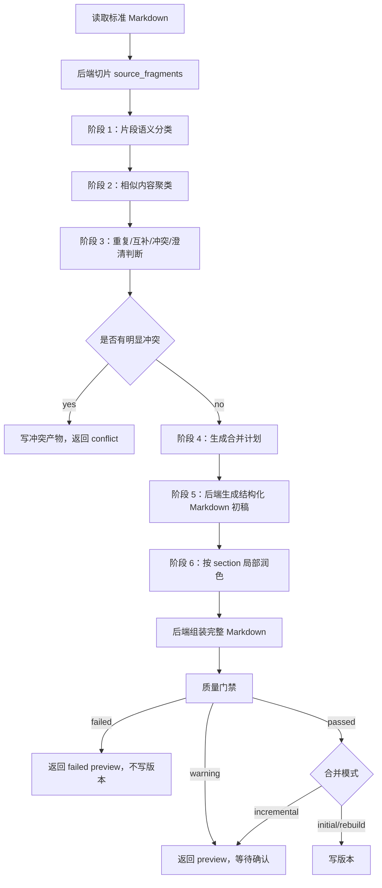

# 需求归并分层语义流水线规范

## 背景

当前需求归并失败的直接表现是：

```text
需求归并智能体运行失败：需求归并智能体未返回合法 JSON。
```

根因不是单纯 JSON 解析器不够强，而是合并链路把过多职责压在一次智能体输出上：

- 让智能体一次性阅读多份长 Markdown。
- 让智能体一次性判断重复、互补、冲突和待澄清。
- 让智能体一次性生成完整合并稿。
- 让智能体把完整 Markdown 正文塞进 JSON 的 `markdown_content` 或 `markdown_preview` 字段。
- 让后端依赖这个巨大 JSON 决定是否写版本。

这种设计天然脆弱。Markdown 表格、代码块、Mermaid、HTTP/JSON 示例、引号和长数组都会增加非法 JSON、截断和丢字段概率。

本规范定义最终推荐方案：把需求归并改成“分层语义流水线”。智能体负责理解、分类、聚类判断和局部表达，后端负责切片、编排、结构、降级、质量门禁和版本写入。

## 目标

- 永久消除“完整合并稿作为巨大 JSON 字符串返回”的主链路。
- 避免模型 JSON 失败导致 `/merge` 直接 502。
- 支持相似内容自动聚合到同一业务段落。
- 支持互补内容合并成完整需求。
- 支持明显矛盾内容进入冲突处理，不写入正式稿。
- 输出文档从概述、业务模块、流程、接口、规则、安全、错误码到验收标准层层递进。
- 所有来源片段都有可审计处理结果。
- 模型失败时有确定性降级 preview，不中断用户流程。

## 非目标

- 不重做上传、文件转换和 Markdown 标准化。
- 不在归并阶段创造未确认业务规则。
- 不让智能体绕过人工确认解决冲突。
- 不把源文件名、`docmap-*` 或来源文档结构写入正式合并稿正文。
- 不继续扩大旧 `_parse_agent_output()` 的复杂修补逻辑作为主方案。

## 总体原则

### 智能体做判断，后端做编排

智能体适合做：

- 片段语义理解。
- 业务模块分类。
- 相似度和等价关系判断。
- 冲突、待澄清判断。
- 局部段落归并表达。

后端必须负责：

- 来源 Markdown 切片。
- `fragment_id` 生成。
- 片段覆盖校验。
- 业务文档全局结构。
- Markdown 文件写入。
- 质量门禁。
- 失败降级。
- 版本写入。

### JSON 只承载小型决策

任何智能体 JSON 输出都不得包含完整合并稿正文。

允许输出：

- 分类结果。
- 聚类键。
- 片段决策。
- 合并计划。
- 局部 section blocks。
- 冲突和澄清引用。

禁止输出：

- `markdown_content` 大字段。
- `markdown_preview` 大字段。
- 整篇 Markdown 字符串。

### 合并按钮不能因模型输出坏掉而流程失败

模型失败时，系统最多返回：

```json
{
  "status": "preview",
  "quality_result": "failed"
}
```

不得直接让用户只看到 502 错误。

## 分层流水线



## 阶段 0：来源切片

后端读取可合并的标准 Markdown，生成 `source_fragments`。

### SourceFragment

```json
{
  "fragment_id": "frag-docmap001-00012",
  "mapping_id": "docmap-001",
  "source_filename": "统一登录需求.docx",
  "heading_path": ["统一登录", "SSO 票据"],
  "fragment_type": "interface",
  "content_hash": "sha256:...",
  "text": "login_ticket 有效期为 5 分钟，过期后需重新登录。",
  "markdown_block": "- login_ticket 有效期为 5 分钟，过期后需重新登录。"
}
```

切片规则：

- 标题只进入 `heading_path`，不单独作为需求片段。
- 普通段落独立成片段。
- 列表项独立成片段。
- 表格默认整体成片段；大表可按行组切片，但每个片段必须带表头。
- fenced code block 整体成片段。
- Mermaid 整体成片段。
- 图片、附件、阅读建议、目录页也形成片段，但类型标为 `attachment` 或 `non_requirement`。

## 阶段 1：片段语义分类

智能体输入为小批量 `source_fragments`。每批建议 20-40 个片段，避免上下文过大。

### 输入

```json
{
  "batch_id": "batch-001",
  "document_name": "统一登录需求",
  "fragments": []
}
```

### 输出

```json
{
  "batch_id": "batch-001",
  "classifications": [
    {
      "fragment_id": "frag-docmap001-00012",
      "business_module": "SSO 票据",
      "semantic_key": "login_ticket_validity",
      "fragment_role": "constraint",
      "summary": "login_ticket 有效期为 5 分钟",
      "confidence": 0.91
    }
  ]
}
```

字段说明：

| 字段 | 说明 |
| --- | --- |
| `business_module` | 业务模块，如统一登录、SSO 票据、账号映射 |
| `semantic_key` | 语义聚类键，用于合并相似内容 |
| `fragment_role` | requirement、interface、state_flow、security、error_code、acceptance、background |
| `summary` | 简短摘要，不是合并正文 |
| `confidence` | 分类置信度 |

后端校验：

- 每个输入片段必须有分类结果。
- 不允许未知 `fragment_id`。
- 不允许重复分类。
- `semantic_key` 为空时后端根据 `business_module + heading_path + summary` 生成兜底 key。

## 阶段 2：相似内容聚类

后端基于阶段 1 输出形成候选聚类。

聚类依据：

- `business_module`
- `semantic_key`
- `fragment_role`
- 标题路径相似度
- 摘要相似度
- 结构类型一致性

示例：

```text
SSO 票据 / login_ticket_validity
  - login_ticket 有效期为 5 分钟
  - 票据 5 分钟后失效
  - 统一登录票据过期时间为 300 秒
```

聚类产物：

```json
{
  "cluster_id": "cluster-sso-ticket-validity",
  "business_module": "SSO 票据",
  "semantic_key": "login_ticket_validity",
  "fragment_ids": ["frag-001", "frag-008", "frag-021"],
  "cluster_role": "constraint"
}
```

## 阶段 3：重复、互补、冲突、澄清判断

智能体以 cluster 为单位判断片段关系。

### 输入

```json
{
  "cluster_id": "cluster-sso-ticket-validity",
  "business_module": "SSO 票据",
  "semantic_key": "login_ticket_validity",
  "fragments": []
}
```

### 输出

```json
{
  "cluster_id": "cluster-sso-ticket-validity",
  "decision": "merge",
  "canonical_meaning": "login_ticket 有效期为 5 分钟，过期后需重新登录。",
  "fragment_decisions": [
    {
      "fragment_id": "frag-001",
      "coverage_status": "merged",
      "reason": "作为票据有效期主规则。"
    },
    {
      "fragment_id": "frag-008",
      "coverage_status": "duplicate",
      "covered_by_fragment_id": "frag-001",
      "reason": "与主规则等价。"
    }
  ],
  "conflicts": [],
  "clarification_items": []
}
```

`decision` 枚举：

| 决策 | 含义 |
| --- | --- |
| `merge` | 片段互补或可合并 |
| `duplicate` | 片段表达等价，保留一处 |
| `conflict` | 不能同时成立 |
| `pending_clarification` | 不矛盾但需要业务确认 |
| `discard` | 非需求材料 |

冲突示例：

```json
{
  "decision": "conflict",
  "conflicts": [
    {
      "conflict_key": "conflict-ticket-validity",
      "title": "login_ticket 有效期不一致",
      "severity": "high",
      "fragment_ids": ["frag-001", "frag-021"],
      "fragment_a": "有效期为 5 分钟",
      "fragment_b": "有效期为 10 分钟",
      "agent_suggestion": "两处阈值互斥，需要业务确认最终有效期。"
    }
  ]
}
```

后端规则：

- 只要存在 `conflict`，不得生成正式合并稿。
- 冲突进入 `conflicts/{run_id}.md` 和冲突表。
- 非冲突的模糊内容进入 `pending_clarification`。
- 所有片段必须有最终 `coverage_status`。

## 阶段 4：生成合并计划

后端根据分类、聚类和决策生成全局合并计划。

模型可以参与排序建议，但最终结构由后端控制。

### MergePlan

```json
{
  "document_title": "统一登录需求",
  "modules": [
    {
      "module_key": "identity_login",
      "title": "统一登录",
      "order": 10,
      "sections": [
        {
          "section_key": "login_state_handoff",
          "title": "登录态承接",
          "order": 10,
          "cluster_ids": ["cluster-login-state-handoff"]
        }
      ]
    }
  ]
}
```

默认模块顺序：

1. 需求概述
2. 业务范围与术语
3. 核心业务流程
4. 业务模块能力
5. 接口契约
6. 状态流转
7. 数据与账号映射
8. 权限与安全要求
9. 错误码与异常处理
10. 运营与配置
11. 验收标准
12. 待澄清问题

这保证最终文档从头到尾层层递进。

## 阶段 5：后端生成结构化 Markdown 初稿

后端根据 `MergePlan` 生成初稿骨架。

示例：

```markdown
# 统一登录需求

## 需求概述

## 业务范围与术语

## 核心业务流程

## 统一登录

### 登录态承接

## SSO 票据

### 票据生成

### 票据校验

### 票据有效期

## 接口契约

## 错误码与异常处理

## 验收标准
```

初稿原则：

- 后端控制标题层级。
- 后端控制模块顺序。
- 后端插入结构化块占位。
- 不展示来源文件名。
- 不展示 `fragment_id`。

## 阶段 6：按 section 局部润色

智能体只处理一个 section 的相关片段，不处理整篇文档。

### 输入

```json
{
  "section_key": "sso_ticket_validity",
  "section_title": "票据有效期",
  "business_module": "SSO 票据",
  "clusters": [],
  "style_rules": {
    "do_not_invent": true,
    "preserve_tables": true,
    "preserve_code_blocks": true,
    "preserve_mermaid": true
  }
}
```

### 输出

```json
{
  "section_key": "sso_ticket_validity",
  "blocks": [
    {
      "type": "paragraph",
      "content": "login_ticket 有效期为 5 分钟，过期后产品侧必须重新发起统一登录流程。"
    },
    {
      "type": "source_block_ref",
      "fragment_id": "frag-docmap001-00018"
    }
  ],
  "covered_fragment_ids": ["frag-001", "frag-008", "frag-018"]
}
```

允许 block 类型：

| 类型 | 含义 |
| --- | --- |
| `paragraph` | 普通需求表述 |
| `bullet_list` | 列表 |
| `table` | 小型模型生成表格 |
| `source_block_ref` | 复用来源表格、代码块或 Mermaid |
| `pending_clarification_ref` | 待澄清引用 |

后端组装规则：

- `source_block_ref` 直接插入原始 `markdown_block`。
- 表格、代码块、Mermaid 优先复用来源结构。
- 局部 JSON 解析失败时，该 section 降级为后端模板生成。
- 单个 section 失败不得导致整个合并失败。

## 三层降级机制

### 一级：智能体正常

输出高质量合并稿：

- 语义聚类。
- 相似内容去重。
- 互补内容合并。
- 局部段落自然表达。
- 结构化块保留。

### 二级：智能体部分失败

如果某批分类、某个 cluster 判断或某个 section 润色失败：

- 后端使用规则兜底。
- 按 `heading_path` 和 `business_module` 分组。
- 保留原始 Markdown 片段。
- 标记 `quality_result = warning` 或 `failed`。
- 返回 preview，不直接报错。

### 三级：智能体完全失败

如果智能体完全不可用或持续返回非法 JSON：

- 后端生成确定性合并候选稿。
- 不做语义去重。
- 按标准模块和来源 heading_path 组织。
- 写入 `reports/{run_id}.md` 说明智能体失败。
- 返回：

```json
{
  "status": "preview",
  "quality_result": "failed",
  "merge_summary": "智能体归并失败，已生成本地确定性候选稿供人工排查。"
}
```

不得返回 502 作为用户最终结果。

## 质量门禁

写版本前必须执行质量门禁。

### 覆盖校验

- 每个 `source_fragment.fragment_id` 必须有处理结果。
- 不允许未知片段。
- 不允许重复片段。
- `merged` 必须出现在合并稿或被 section 覆盖。
- `duplicate` 必须指向已合入片段或需求。
- `conflict` 不得进入正式合并稿。
- `pending_clarification` 必须进入待澄清清单。
- `discarded` 必须有原因。

### 结构校验

- 合并稿只能有一个一级标题。
- 不得包含源文件名、`docmap-*`、`mapping_id`、来源文档分组。
- Mermaid、代码围栏、接口表格、错误码表不得异常缩水。
- 候选稿有效内容长度不得异常低于来源有效内容。

### 语义校验

- 相同 `semantic_key` 的内容不得重复出现在多个章节，除非有合理原因。
- 同一业务规则的不同阈值必须进入冲突。
- 模糊但不冲突的内容必须进入待澄清。
- 摘要统计必须和片段决策统计一致。

质量结果：

| 结果 | 含义 | 行为 |
| --- | --- | --- |
| `passed` | 可写版本 | 初始/重建可直接写，增量仍建议 preview |
| `warning` | 有非阻塞问题 | 返回 preview，用户确认后写 |
| `failed` | 有阻塞问题或智能体降级 | 返回 preview，不允许写版本 |

## 产物

保留人读产物：

```text
previews/{run_id}.md
mappings/{run_id}.md
conflicts/{run_id}.md
reports/{run_id}.md
```

新增机器可读产物：

```text
artifacts/{run_id}-fragments.json
artifacts/{run_id}-classifications.json
artifacts/{run_id}-clusters.json
artifacts/{run_id}-cluster-decisions.json
artifacts/{run_id}-merge-plan.json
artifacts/{run_id}-section-blocks.json
artifacts/{run_id}-quality.json
```

这些产物用于：

- 复盘为什么某段被合并、去重、冲突或丢弃。
- 重跑某个阶段。
- 回归测试。
- 定位模型输出质量问题。

## API 行为

现有接口路径不变：

```text
POST /projects/{project_id}/requirements/{document_id}/merge
```

返回兼容现有前端：

```json
{
  "status": "preview",
  "preview_id": "mergerun-xxx",
  "markdown_preview": "# ...",
  "merge_summary": "...",
  "diff_summary": "...",
  "affected_modules": [],
  "source_file_ids": [],
  "quality_result": "failed",
  "artifact_tabs": [],
  "machine_artifacts": {}
}
```

关键规则：

- `markdown_preview` 来自 `previews/{run_id}.md`，不来自智能体 JSON。
- 智能体失败时仍返回 `preview`。
- 只有质量门禁通过时才写版本。
- `conflict` 只表示需要人工决策的明显冲突，不表示系统异常。

## 实施顺序

### 第一步：止血

- 在编排层捕获 `需求归并智能体未返回合法 JSON`。
- 改为生成 failed preview 和质量报告。
- 不再让 502 直接冒泡到前端。

验收：

- 模型返回非法 JSON 时，接口返回 `status=preview`、`quality_result=failed`。
- 不写版本。
- 前端能看到失败报告。

### 第二步：小 JSON 分类

- 新增分类 agent 方法。
- 输入 `source_fragments` 批次。
- 输出 `classifications`。
- 后端校验覆盖。

验收：

- 分类结果缺片段会失败。
- 分类 JSON 不包含 Markdown 正文。

### 第三步：聚类和 cluster 决策

- 后端生成 clusters。
- 智能体按 cluster 判断重复、互补、冲突和澄清。
- 后端生成 fragment decisions。

验收：

- 相似表达归到同一 cluster。
- 阈值矛盾进入 conflict。
- 等价表达标 duplicate。

### 第四步：合并计划和文档结构

- 后端生成 `MergePlan`。
- 固定全局模块顺序。
- 支持不同业务模块映射到标准章节。

验收：

- 文档从概述到验收层层递进。
- 不按来源文件拼接。

### 第五步：section 局部润色

- 智能体每次只处理一个 section。
- 后端组装完整 Markdown。
- 单 section 失败时局部降级。

验收：

- 不再出现整篇 Markdown JSON。
- 局部失败不影响整次合并返回 preview。

### 第六步：质量门禁和版本写入

- 接入覆盖、结构、语义校验。
- passed 才允许写版本。
- warning/failed 返回 preview。

验收：

- 丢片段不写版本。
- 源文件名污染不写版本。
- 结构化 Markdown 丢失不写版本。
- 冲突不写版本。

## 测试策略

### 单元测试

- Markdown 切片稳定性。
- 分类输出覆盖校验。
- 聚类规则。
- cluster 决策校验。
- MergePlan 排序。
- section block 渲染。
- 质量门禁。

### 集成测试

- 模型返回非法 JSON 时返回 failed preview。
- 多文件相似内容合并。
- 互补内容合并。
- 阈值冲突拦截。
- 大表格保留。
- Mermaid 保留。
- JSON/HTTP/curl 代码块保留。
- 增量合并返回 preview。

### 回归样例

必须构造以下样例：

- `login_ticket` 有效期多种等价表达。
- `login_ticket` 有效期 5 分钟 vs 10 分钟冲突。
- 产品进入状态查询接口字段表。
- 产品进入状态确认接口字段表。
- 错误码表。
- 统一登录 Mermaid 流程图。
- curl/HTTP 请求示例。
- 长需求文档防摘要缩水。

## 最终验收标准

- 点击“合并全部需求文档”不会因为模型非法 JSON 直接失败。
- 智能体输出中不再包含完整 `markdown_content` 或 `markdown_preview`。
- 相似内容聚合到同一业务段落。
- 互补内容合并成完整需求。
- 冲突内容进入冲突清单，不进入正式稿。
- 每个来源片段都有处理结果。
- 合并稿按业务阅读顺序层层递进。
- 质量失败返回 preview 和报告，不写版本。
- 质量通过才写版本。

## 结论

最优方案不是继续修补 JSON，而是改变职责边界：

```text
模型负责语义判断和局部表达。
后端负责结构、覆盖、降级、校验和版本。
```

这样既能解决“未返回合法 JSON”的稳定性问题，也能让相似内容真正合并到一起，最终文档具备清晰递进结构。
