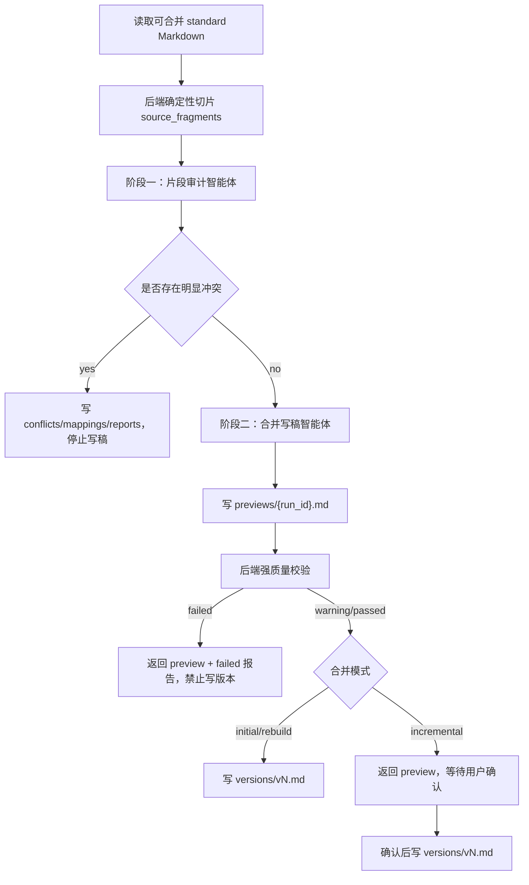

# 需求归并稳定流水线规范

## 背景

当前需求归并链路已经具备智能体归并、四类产物、质量报告和冲突处理能力，但核心输出仍依赖智能体一次性返回完整 JSON。该 JSON 同时包含大段 Markdown 正文、段落映射、冲突、摘要和影响模块。

这导致归并长文档时存在结构性脆弱点：

- Markdown 正文需要作为 JSON 字符串转义，表格、代码围栏、HTTP 示例、JSON 示例和引号容易破坏 JSON。
- 来源文件越多，`coverage_items` 越长，越容易出现输出截断或字段不完整。
- 后端当前只能修补智能体输出，不能从根上保证完整性。
- 覆盖矩阵主要来自智能体自述，后端无法证明每个来源片段都被处理。
- 一个智能体调用同时负责冲突识别、归并写稿、覆盖证明和质量总结，失败面过大。

本规范定义下一阶段稳定改造：把需求归并从“一次大 JSON 输出”升级为“后端确定性切片 + 智能体小 JSON 决策 + Markdown 独立产物 + 强质量门禁”的可审计流水线。

## 目标

- 彻底移除大 Markdown 正文作为智能体 JSON 字段返回的设计。
- 后端在归并前生成稳定来源片段清单，每个片段有唯一 `fragment_id`。
- 智能体只返回小型结构化 JSON，用于表达片段处理决策、冲突、待澄清和产物引用。
- 合并候选稿以独立 Markdown 文件保存，不嵌入 JSON。
- 后端强校验所有输入片段都有且只有一个处理结果。
- 质量校验失败时只生成 preview 和报告，不写入正式版本。
- 保留现有 `/merge`、`/conflicts`、`resolve conflict` 用户流程。
- 支持初始合并、增量合并和重建合并。

## 非目标

- 不重做上传、DOCX/PDF 转 Markdown 和标准化流程。
- 不在归并阶段生成测试用例或知识库。
- 不让智能体替代用户确认冲突或待澄清事项。
- 不把源文件名、`docmap-*`、来源文档分组写入正式合并稿。
- 不为了兼容坏输出继续扩大 JSON 修补器能力。

## 现状问题定位

当前主要风险点集中在：

- `apps/backend/app/services/requirement_merge_service.py`
  - `_build_agent_prompt` 要求智能体返回 `markdown_content` / `markdown_preview` 大字段。
  - `_parse_agent_output` 需要修复 fenced JSON、未转义引号、截断 JSON 和缺失字段。
  - `_complete_source_file_coverage` 只能按文件补齐覆盖，不能按真实片段证明覆盖。
- `apps/backend/app/services/requirement_merge_artifact_service.py`
  - 已有质量检查，但输入仍依赖智能体返回的覆盖项。
  - 结构保留、长度缩水和源文档污染检查应升级为写版本前硬门禁。

这些修补是必要兜底，但不能作为长期稳定架构。

## 总体方案



## 核心设计原则

### Markdown 不进 JSON

智能体输出 JSON 中不得包含完整合并稿正文。

允许字段：

- `draft_artifact_path`
- `draft_artifact_key`
- `draft_summary`
- `fragment_mappings`
- `conflicts`
- `clarification_items`
- `affected_modules`

不允许字段：

- `markdown_content`
- `markdown_preview`

后端通过 artifact 路径读取 Markdown 文件内容，再进入质量校验和接口返回。

### 服务端先切片

后端必须在调用智能体前把所有标准 Markdown 切成 `source_fragments`。智能体只能基于 `fragment_id` 做处理结果声明。

切片结果是归并审计的事实源，不依赖智能体自由生成。

### 冲突先行

明显冲突是版本写入阻塞项。只要阶段一发现无法同时成立的冲突：

- 不生成正式合并稿。
- 不写 `versions/vN.md`。
- 写入冲突产物和冲突表。
- 返回 `status = "conflict"`。

### 质量门禁后置但强制

即使智能体成功生成候选稿，后端也必须执行机械质量门禁。门禁失败时：

- 保存候选稿用于排查。
- 保存映射和报告。
- 返回 `status = "preview"` 和 `quality_result = "failed"`。
- 禁止创建正式版本。

## 数据契约

### SourceFragment

新增内部模型 `RequirementSourceFragment`。

```json
{
  "fragment_id": "frag-docmap001-00012",
  "mapping_id": "docmap-001",
  "source_filename": "统一登录需求.docx",
  "heading_path": ["统一登录", "SSO 票据"],
  "fragment_type": "requirement",
  "content_hash": "sha256:...",
  "text": "login_ticket 有效期为 5 分钟，过期后需重新登录。",
  "markdown_block": "- login_ticket 有效期为 5 分钟，过期后需重新登录。"
}
```

字段说明：

| 字段 | 说明 |
| --- | --- |
| `fragment_id` | 后端生成的稳定片段 ID |
| `mapping_id` | 来源标准文件映射 ID |
| `source_filename` | 原始文件名，仅用于审计产物 |
| `heading_path` | 来源 Markdown 标题路径 |
| `fragment_type` | 片段类型 |
| `content_hash` | 片段内容哈希 |
| `text` | 供智能体理解的纯文本 |
| `markdown_block` | 原始 Markdown 块，保留表格、代码围栏和 Mermaid |

`fragment_type` 枚举：

| 类型 | 含义 |
| --- | --- |
| `requirement` | 需求陈述 |
| `constraint` | 业务、技术、安全或合规约束 |
| `interface` | 接口、字段、错误码、请求响应 |
| `state_flow` | 状态流转、流程图、时序图 |
| `acceptance` | 验收标准 |
| `background` | 背景说明 |
| `attachment` | 附件、图片、链接提示 |
| `non_requirement` | 目录、阅读建议、转换说明等 |

### FragmentDecision

智能体阶段一必须返回每个片段的处理决策。

```json
{
  "fragment_id": "frag-docmap001-00012",
  "mapping_id": "docmap-001",
  "coverage_status": "merged",
  "target_module": "SSO 票据",
  "target_heading": "票据有效期",
  "merged_requirement_key": "REQ-SSO-004",
  "related_conflict_key": "",
  "related_clarification_key": "",
  "reason": "合入 SSO 票据有效期规则。"
}
```

`coverage_status` 枚举：

| 状态 | 含义 | 强规则 |
| --- | --- | --- |
| `merged` | 已合入候选稿 | 必须有目标模块和目标标题 |
| `duplicate` | 与其他片段等价 | 必须说明被哪个需求覆盖 |
| `conflict` | 与其他片段明显冲突 | 必须关联冲突 |
| `pending_clarification` | 含义不清或缺少业务确认 | 必须关联澄清项 |
| `discarded` | 明确不进入需求稿 | 必须有丢弃原因 |

### MergeAuditOutput

阶段一智能体输出。

```json
{
  "status": "ready_for_draft",
  "merge_summary": "识别 82 个来源片段，合入 61 个，重复 12 个，待澄清 4 个，丢弃 5 个。",
  "affected_modules": ["统一登录", "SSO 票据", "账号映射"],
  "fragment_decisions": [],
  "conflicts": [],
  "clarification_items": []
}
```

`status` 枚举：

| 状态 | 含义 |
| --- | --- |
| `ready_for_draft` | 无明显冲突，可进入写稿阶段 |
| `conflict` | 存在明显冲突，停止写稿 |
| `failed` | 智能体无法完成审计 |

### DraftWriteOutput

阶段二智能体输出。

```json
{
  "status": "draft_written",
  "draft_artifact_path": "previews/mergerun-abc.md",
  "draft_summary": "已按统一登录、SSO 票据、账号映射、安全要求重组候选稿。",
  "diff_summary": "新增 SSO 票据有效期、产品进入状态确认和登出联动规则。",
  "affected_modules": ["统一登录", "SSO 票据", "账号映射", "安全要求"]
}
```

阶段二 JSON 必须很小，不承载 Markdown 正文。

## 片段切分规则

后端新增 `requirement_fragment_service.py`，负责从标准 Markdown 生成片段。

规则：

- 保留 Markdown 标题层级作为 `heading_path`。
- 列表项可独立成片段。
- 普通段落可独立成片段。
- 表格必须整体成片段，不拆成单元格；必要时可按行组切片，但每个片段必须包含表头。
- fenced code block 必须整体成片段，并保留语言标签。
- Mermaid 流程图和时序图必须整体成片段。
- 图片、附件、目录、阅读说明也必须形成片段，但类型可标为 `attachment` 或 `non_requirement`。
- 空白、纯分隔线和无意义格式行不生成片段。

片段 ID 生成规则：

```text
frag-{mapping_id_without_prefix}-{sequence}
```

同一个标准文件内按出现顺序生成递增序号。`content_hash` 用于后续判断内容是否变化，不作为片段主键。

## 后端强校验

新增 `requirement_merge_validation_service.py`。

### 审计输出校验

必须校验：

- `fragment_decisions` 数量等于输入片段数量。
- 每个输入 `fragment_id` 都出现一次。
- 不允许出现未知 `fragment_id`。
- 不允许重复 `fragment_id`。
- `merged` 必须有 `target_module` 和 `target_heading`。
- `duplicate` 必须有覆盖说明。
- `conflict` 必须关联存在的冲突。
- `pending_clarification` 必须关联存在的澄清项。
- `discarded` 必须有明确原因。
- `merge_summary` 中数量必须与状态统计一致。

### 候选稿校验

必须校验：

- 候选稿文件存在且非空。
- 候选稿只有一个一级标题。
- 候选稿不得包含 `docmap-`、`mapping_id`、源文件名、`来源文档`、`源文档`、`原始文件`、`标准文件` 等来源组织痕迹。
- 来源中的 Mermaid、代码围栏、接口表格、错误码表、字段表在候选稿中不能异常缩水。
- 候选稿有效内容长度不能低于来源有效需求内容的合理阈值。
- 存在 `conflict` 状态时不得写正式版本。
- 存在 `pending_clarification` 时最高质量结果为 `warning`。

质量结果：

| 结果 | 含义 | 是否允许写版本 |
| --- | --- | --- |
| `passed` | 机械校验通过，无阻塞问题 | 允许 |
| `warning` | 有待澄清或非阻塞问题 | 增量需人工确认，初始可按配置决定 |
| `failed` | 有缺失、冲突、污染、缩水或产物缺失 | 禁止 |

## 产物规则

继续保留四类归并产物：

```text
previews/{run_id}.md
mappings/{run_id}.md
conflicts/{run_id}.md
reports/{run_id}.md
```

新增可选机器可读产物：

```text
artifacts/{run_id}-fragments.json
artifacts/{run_id}-decisions.json
```

用途：

- `fragments.json` 保存后端切片事实源。
- `decisions.json` 保存智能体审计决策。
- Markdown 报告用于人读。
- JSON artifact 用于回归测试和后续重跑。

## 服务职责调整

### document_merge_orchestrator

保留编排入口：

- 读取需求文档和可合并标准文件。
- 创建 merge run。
- 调用片段切分服务。
- 调用归并审计智能体。
- 调用写稿智能体。
- 调用质量校验。
- 写入产物、版本、覆盖项和变更日志。

不再负责：

- 修补智能体返回的大 Markdown JSON。
- 根据文件级覆盖补齐片段覆盖。

### requirement_merge_service

调整为智能体适配层：

- 构建阶段一审计 prompt。
- 解析小 JSON 审计结果。
- 构建阶段二写稿 prompt。
- 解析小 JSON 写稿结果。

应逐步删除或降级为兼容兜底：

- `_repair_markdown_json_string_fields`
- `_complete_truncated_merge_json`
- `_complete_partial_merge_payload`

这些函数不再服务主链路。

### requirement_merge_artifact_service

继续负责：

- 生成 mappings/conflicts/reports。
- 读取历史 artifact tabs。

增强：

- 支持 fragment 级映射报告。
- 报告中展示后端校验结果。
- 报告中区分阻塞问题和非阻塞问题。

## API 兼容

现有接口路径不变：

```text
POST /projects/{project_id}/requirements/{document_id}/merge
GET /projects/{project_id}/requirements/{document_id}/conflicts
PUT /projects/{project_id}/requirements/{document_id}/conflicts/{conflict_id}
```

`/merge` 返回字段兼容现有前端：

```json
{
  "status": "preview",
  "preview_id": "mergerun-abc",
  "markdown_preview": "# ...",
  "merge_summary": "...",
  "diff_summary": "...",
  "affected_modules": [],
  "source_file_ids": [],
  "quality_result": "passed",
  "artifact_tabs": []
}
```

说明：

- 后端返回 `markdown_preview` 是为了兼容前端展示，但该内容必须来自 preview artifact 文件，不来自智能体 JSON。
- 初始合并和重建合并在 `quality_result = passed` 时仍可直接返回 `status = "merged"`。
- 增量合并默认返回 `preview`，由用户确认后写版本。

## 数据迁移

建议新增或扩展：

### requirement_source_fragments

可选持久化表。若短期不建表，可先只保存到 `artifacts/{run_id}-fragments.json`。

| 字段 | 说明 |
| --- | --- |
| id | `fragment_id` |
| run_id | 合并运行 ID |
| document_id | 需求文档 ID |
| mapping_id | 来源文件 ID |
| heading_path | JSON |
| fragment_type | 片段类型 |
| content_hash | 内容哈希 |
| text | 纯文本 |
| markdown_block | 原始 Markdown 块 |

### requirement_source_coverage_items

现有覆盖项应升级支持：

| 字段 | 说明 |
| --- | --- |
| fragment_id | 来源片段 ID |
| merged_requirement_key | 合并稿需求键 |
| related_conflict_id | 关联冲突 |
| related_clarification_id | 关联澄清 |

迁移策略：

- 旧数据没有 `fragment_id` 时允许为空。
- 新链路写入时 `fragment_id` 必填。
- 查询历史映射时兼容旧字段。

## 实施步骤

### 第一步：片段切分服务

- 新增 Markdown 片段切分器。
- 为标题、段落、列表、表格、代码围栏、Mermaid 写单元测试。
- 输出 `fragments.json` artifact。

验收：

- 每个标准 Markdown 都能生成稳定片段。
- 表格、代码围栏、Mermaid 不被破坏。
- 同一输入多次运行片段 ID 顺序稳定。

### 第二步：审计小 JSON 契约

- 新增 `MergeAuditOutput` schema。
- 阶段一智能体只返回片段决策、冲突和澄清。
- 后端强校验 `fragment_id` 覆盖。

验收：

- 少一个片段决策会失败。
- 多一个未知片段决策会失败。
- 重复片段决策会失败。
- 冲突状态不会生成候选稿。

### 第三步：Markdown artifact 写稿

- 阶段二智能体写入 `previews/{run_id}.md`。
- JSON 只返回 artifact 路径和摘要。
- 后端从文件读取 preview。

验收：

- 智能体 JSON 中不再出现完整 Markdown 正文。
- preview 文件不存在时质量结果为 `failed`。
- 前端仍能拿到 `markdown_preview`。

### 第四步：质量门禁升级

- 把现有质量检查接入新片段事实源。
- 将源文档结构污染、明显冲突、片段缺失、结构化 Markdown 丢失设为阻塞。
- 写版本前统一调用门禁。

验收：

- `failed` 不写 `versions/vN.md`。
- `passed` 才可自动写初始/重建版本。
- `warning` 必须在返回中清晰展示问题。

### 第五步：兼容和清理

- 保留旧链路作为短期 fallback，默认关闭。
- 加配置开关：

```text
REQUIREMENT_MERGE_PIPELINE=v2
```

- v2 稳定后移除主链路对大 JSON 修补器的依赖。

验收：

- 现有接口测试通过。
- 新增长文档回归测试通过。
- 已有历史 artifact tabs 仍可读取。

## 测试策略

### 单元测试

- `test_requirement_fragment_service.py`
  - 标题层级切片。
  - 列表项切片。
  - 表格整体保留。
  - fenced code block 整体保留。
  - Mermaid 整体保留。
  - 片段 ID 稳定。

- `test_requirement_merge_validation_service.py`
  - 缺失片段失败。
  - 未知片段失败。
  - 重复片段失败。
  - `merged` 缺目标章节失败。
  - `conflict` 缺关联冲突失败。
  - 摘要统计不一致 warning 或 failed。

### 服务测试

- 初始合并成功写版本。
- 增量合并只返回 preview。
- 明显冲突返回 conflict，不写版本。
- 质量失败返回 preview，不写版本。
- 人工确认 preview 后写新版本。

### 回归样例

必须包含：

- 多文件重复需求。
- 数值阈值冲突。
- 接口字段表。
- 错误码表。
- Mermaid 流程图。
- JSON/HTTP/curl fenced block。
- 大文档内容缩水场景。
- 源文件名污染场景。

## 验收标准

- 主链路中智能体不再返回大段 Markdown JSON 字段。
- 任意一次归并都有 `fragments.json` 和 `decisions.json` 可审计。
- 每个来源片段都有且只有一个处理决策。
- 质量失败不会写入正式版本。
- 冲突不会被自动合入正式稿。
- 增量合并默认需要预览确认。
- 合并候选稿不展示源文件名、`docmap-*` 或来源文档结构。
- 长文档、多表格、多代码块输入不会因为 JSON 转义或截断导致归并失败。

## 风险和取舍

### 风险：实现量增加

切片、两阶段智能体和校验服务会增加实现成本。

取舍：这是用工程确定性换取长期稳定性，避免继续在 JSON 修补器上叠加复杂度。

### 风险：智能体不能直接写本地文件

如果当前 `run_agent` 不支持工具写文件，阶段二可以先让智能体返回小 JSON 中的章节数组，由后端渲染 Markdown 文件。但该数组仍不得包含整篇 Markdown 大字符串。

可接受过渡契约：

```json
{
  "sections": [
    {
      "heading": "SSO 票据",
      "blocks": [
        {"type": "paragraph", "text": "login_ticket 有效期为 5 分钟。"},
        {"type": "table_ref", "source_fragment_ids": ["frag-docmap001-00018"]}
      ]
    }
  ]
}
```

后端根据片段引用和结构化块渲染 Markdown。

### 风险：旧数据没有 fragment_id

旧 merge run 的映射只能保持文件级或智能体自述级追溯。

取舍：不回填旧数据；新链路开始保证片段级审计。

## 最终结论

永久解决需求归并报错的关键不是继续修复坏 JSON，而是改变输出边界：

- Markdown 作为文件产物。
- JSON 只做小型决策和引用。
- 来源覆盖由后端片段事实源保证。
- 写版本由质量门禁控制。

这条路线符合现有架构，也符合“不猜接口、认真查阅、主动验证、谨慎重构”的项目规则。
