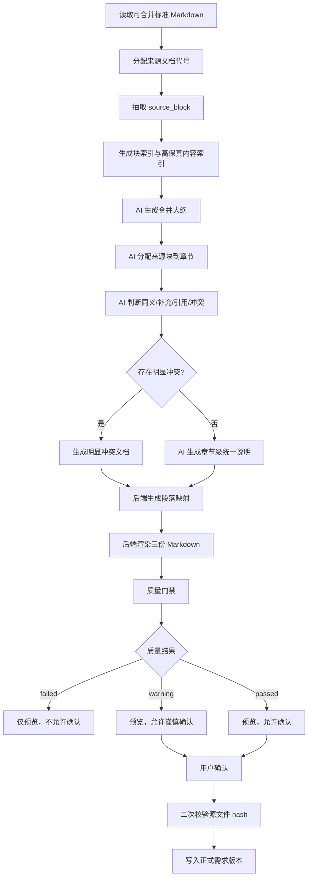

# 需求合并 Source Block 改版规范

## 背景

当前需求合并链路已经做过多轮修复，但仍然反复出现两个核心问题：

1. 智能体输出 JSON 不稳定，长 Markdown、表格、代码块、示例和 Mermaid 一起塞进 JSON 时容易解析失败。
2. 旧版分层流水线把标准 Markdown 切成过细的 `source_fragments`，例如普通段落、列表项、表格、代码块分别成为片段。这个粒度不符合需求文档的阅读和合并方式，后续很难重新拼回一个完整业务语义。

因此，本次改版不再继续沿用“Markdown 小片段归并”的主路径，而是把合并对象升级为 `source_block`：

```text
source_block = 一个可独立阅读、可追踪、可分配去向的来源需求块
```

默认以二级标题作为来源块边界，不再按三级标题细分。三级及更深标题只作为块内内容索引，帮助后续智能体理解该二级块覆盖了哪些子主题。表格、代码块、接口示例、Mermaid、图片说明必须绑定在其上下文内，不能脱离说明文字单独漂浮。

## 目标

- 用 `source_block` 替代机械 `source_fragment` 作为需求合并主单位。
- 保证每个来源块都有稳定编号、原文、来源文档、原始标题和处理去向。
- 支持按业务语义和测试覆盖视角生成新的合并大纲，而不是按原文档顺序拼接。
- 支持同义内容归并，同时保留来源块编号。
- 接口路径、请求字段、响应字段、错误码、状态枚举、表格、代码示例和 Mermaid 不被摘要吞掉。
- 冲突或口径不清内容进入“明显冲突”文档，不由智能体自行裁决。
- 生成段落映射文档，作为来源块覆盖、处理去向和人工审计依据。
- 降低 JSON 失败影响：智能体只输出小型结构化决策，最终 Markdown 由后端确定性渲染。
- 所有合并先生成预览，用户确认后才写入正式需求版本。

## 非目标

- 不重做需求上传、DOCX/PDF 转 Markdown、标准 Markdown 编辑能力。
- 不让后端根据业务含义私自创造需求规则。
- 不让智能体直接决定冲突的正确口径。
- 不把完整合并稿正文作为一个巨大 JSON 字段返回。
- 不继续把段落、列表项、表格、代码块当作默认独立合并单元。
- 不要求本期一次性重做所有前端页面，只要求前端能承接新版三份用户可见文档和确认入库语义。

## 核心原则

### 合并最小业务单位是来源块，不是 Markdown 块

错误粒度：

```text
段落
单个列表项
单个表格
单个代码块
单个 Mermaid
```

正确粒度：

```text
一个二级标题下的完整需求主题
一个流程说明及其 Mermaid
一个规则说明及其枚举表
一个接口说明及其请求/响应/错误码/示例
```

### 后端负责可追踪结构，智能体负责语义判断

后端负责：

- 分配来源文档代号。
- 抽取 `source_block`。
- 生成 `block_id`。
- 保存原文块和结构化索引。
- 校验来源块覆盖率。
- 渲染最终 Markdown。
- 记录内部质量门禁结果和阶段错误。
- 控制预览与确认入库。

智能体负责：

- 根据标题、摘要、关键词和原文判断业务主题。
- 建议合并大纲。
- 判断来源块归属章节。
- 判断同义、补充、引用、冲突、待确认。
- 为每个章节生成统一说明和差异说明。

智能体不得负责：

- 直接写数据库。
- 直接创建版本。
- 跳过段落映射。
- 把冲突内容写成确定结论。
- 输出整篇合并稿 Markdown 作为 JSON 字符串。

### 接口和结构化证据优先保原文

以下内容默认属于高保真内容，不允许仅摘要：

- 接口路径和 HTTP 方法。
- 请求字段、响应字段、Header、Cookie、Token。
- 错误码、错误信息、状态码。
- 状态枚举、接入模式枚举、业务动作枚举。
- 表格。
- JSON、curl、SQL、HTTP 示例。
- Mermaid 流程图。
- 图片说明和附件引用。

可以在章节中生成统一说明，但必须保留对应来源块引用；必要时完整插入原文块。

## 术语

| 术语 | 含义 |
| --- | --- |
| 标准 Markdown | 上传/转换/编辑后可参与合并的 Markdown 文件 |
| 来源文档代号 | 每个源文档在一次合并运行中的短代号，如 `A`、`B`、`C`、`D` |
| `source_block` | 按需求语义抽取的来源块，默认二级标题块 |
| `block_id` | 来源块唯一编号，如 `A-01`、`B-07` |
| 合并大纲 | 面向最终合并稿的新章节结构 |
| 块归属 | 每个来源块被分配到一个或多个合并章节 |
| 段落映射 | 记录每个来源块去向、处理方式、是否保留原文 |
| 明显冲突 | 来源之间存在冲突、口径不清或需要人工决策的内容 |
| 高保真内容 | 接口、字段、错误码、枚举、示例、表格、代码块、Mermaid 等不可摘要吞掉的内容 |

## 总体流程

```text
多个标准 Markdown
→ 后端分配来源文档代号
→ 后端按 source_block 抽取来源块
→ 后端给每个来源块编号
→ 后端提取标题、三级标题、关键词、高保真内容索引
→ 智能体生成合并大纲
→ 智能体分配来源块到合并章节
→ 智能体识别同义、补充、引用、冲突、待确认
→ 后端校验来源块覆盖率
→ 智能体按章节生成统一说明和差异说明
→ 后端插入或引用高保真原文内容
→ 后端生成合并后的文档、段落映射文档、明显冲突文档
→ 后端质量门禁
→ 用户确认
→ 后端二次校验源文件未变化
→ 写入正式需求版本
```



## 来源文档代号规则

一次合并运行内，后端按照参与合并的标准 Markdown 排序分配代号。

排序建议：

1. 用户在前端选择顺序。
2. 如果没有选择顺序，按标准文件创建时间。
3. 如果创建时间相同，按文件名自然排序。

代号规则：

```text
A, B, C, ... Z, AA, AB ...
```

对于用户给出的典型场景，可以得到：

| 代号 | 源文档 |
| --- | --- |
| A | 百融统一登录认证授权中心产品需求说明书.md |
| B | 百系产品接入官网统一认证中心接口契约 v1.2.md |
| C | 百系产品接入官网统一认证中心总说明v1.0.md |
| D | SSO 产品进入状态接口 v1.0.md |

来源文档代号只保证本次合并运行内稳定。正式审计仍以 `mapping_id`、文件 hash 和 `block_id` 共同定位。

## SourceBlock 数据模型

```json
{
  "block_id": "B-07",
  "source_code": "B",
  "sequence": 7,
  "mapping_id": "docmap-xxx",
  "source_file": "百系产品接入官网统一认证中心接口契约 v1.2.md",
  "source_file_hash": "sha256:...",
  "original_heading": "login_ticket 生成接口",
  "heading_level": 2,
  "heading_path": ["login_ticket 生成接口"],
  "markdown": "## login_ticket 生成接口\n\n...",
  "plain_text": "login_ticket 生成接口 ...",
  "sub_headings": ["请求地址", "请求参数", "响应参数", "错误码"],
  "content_types": ["interface", "table", "json_example", "error_code"],
  "anchors": ["/api/sso/ticket/create", "login_ticket", "expires_at"],
  "must_preserve_original": true,
  "token_estimate": 1800,
  "content_hash": "sha256:..."
}
```

字段说明：

| 字段 | 说明 |
| --- | --- |
| `block_id` | 来源块编号，格式为 `来源代号-两位序号` |
| `source_code` | 来源文档代号 |
| `sequence` | 来源文档内的块序号 |
| `mapping_id` | 标准文件映射 ID |
| `source_file` | 标准 Markdown 文件名 |
| `source_file_hash` | 标准文件整体 hash |
| `original_heading` | 原二级或三级标题 |
| `heading_path` | 标题路径，用于上下文和回溯 |
| `markdown` | 完整来源块 Markdown |
| `plain_text` | 纯文本索引，不作为最终渲染来源 |
| `sub_headings` | 块内三级/四级标题 |
| `content_types` | 内容类型标签 |
| `anchors` | 接口路径、字段、枚举、状态等锚点 |
| `must_preserve_original` | 是否需要保留原文或高保真引用 |
| `token_estimate` | 用于批量调用智能体时控量 |
| `content_hash` | 来源块内容 hash |

## SourceBlock 抽取规则

### 默认规则

- 一级标题只作为文档标题，不单独形成来源块。
- 二级标题默认形成一个 `source_block`。
- 二级标题下的正文、列表、表格、代码块、Mermaid、图片说明全部保留在同一个块内。
- 短目录、分割线、纯导航内容不形成需求块，可标记为 `non_requirement`。
- 空二级标题不形成来源块，但其标题路径可传递给子标题。

### 大块处理规则

即使一个二级标题块较大，也不按三级标题拆成多个 `source_block`。三级标题列表写入 `sub_headings`，只作为块内内容索引和大纲归并提示。

大块处理必须满足：

- 二级标题下的正文、列表、表格、代码块、Mermaid、图片说明保留在同一个来源块内。
- 不能把表格从其说明文字里拆出去。
- 不能把接口路径、请求参数、响应参数、错误码、示例拆成多个互相失去上下文的块。
- 不能把 Mermaid 从流程说明里拆出去。
- 不能把图片说明和图片引用拆开。
- 如果单个二级块超过模型上下文，后续“模块正文生成”阶段可以对该块做只读摘要或分批读取，但 `source_block` 编号和归属仍保持二级块粒度。

### 高保真绑定规则

以下结构必须和上下文绑定：

| 结构 | 绑定方式 |
| --- | --- |
| 表格 | 与前置说明、后续补充说明同块 |
| fenced code block | 与代码示例说明同块 |
| Mermaid | 与流程说明同块，内容类型标为 `state_flow` |
| 接口路径 | 与接口说明、请求/响应字段、错误码、示例同块 |
| 图片 | 与图片说明同块，或生成 attachment/source_block_ref |
| 连续列表 | 作为同一规则组，不按一行一个块拆 |

### 编号规则

每个来源文档内按实际抽取顺序编号：

```text
来源代号-两位序号
```

示例：

```text
A-01 项目背景
A-02 项目目标
B-07 login_ticket 生成接口
C-09 产品接入模式分类
D-02 查询产品进入状态接口
```

如果单文档来源块超过 99 个，序号自动扩展为三位：

```text
B-100
```

## SourceBlock 原文标记

每个来源块在段落映射文档、调试产物或附录原文中应保留注释：

```md
<!-- source_block: B-07 -->
<!-- source_file: 百系产品接入官网统一认证中心接口契约 v1.2.md -->
<!-- original_heading: login_ticket 生成接口 -->
```

正式合并后的文档正文不要求在每段都显示 HTML 注释，但必须在段落映射文档和章节来源块列表中可见。

## 合并大纲策略

合并大纲由智能体建议，后端校验结构合法性。

默认推荐大纲：

```md
# 统一认证测试需求合并稿

## 1. 背景与目标
## 2. 建设范围与职责边界
## 3. 用户模型与产品接入模式
## 4. 核心登录与跳转链路
## 5. 产品进入状态与邀请码逻辑
## 6. 接口契约
## 7. 用户信息与业务上下文
## 8. 本地账号映射与首次进入
## 9. 异常场景与错误码
## 10. 安全要求
## 11. 联调流程
## 12. 验收标准
## 13. 二期 / 可选能力
## 14. 待确认差异
```

智能体可以根据来源块标题和内容调整章节，但必须满足：

- 章节按业务语义和测试覆盖视角组织。
- 不简单按源文档顺序拼接。
- 合并后的文档中可以包含“待确认差异”章节摘要。
- 完整待确认差异必须进入“明显冲突”文档。
- 完整来源块覆盖关系必须进入“段落映射”文档。
- 不得删除无处安放的来源块；只能标记为附录保留、引用或待确认。

## 每个主题章节固定结构

业务主题章节建议使用固定结构：

```md
## 5. 产品进入状态与邀请码逻辑

### 5.1 统一说明

这里写归并后的清晰表述。

### 5.2 来源块

- D-02 查询产品进入状态接口
- B-17 邀请码 / 推荐码处理规则
- C-09 INVITE_ONLY 接入模式

### 5.3 原文要点

保留关键规则、状态、字段、流程、错误码。

### 5.4 差异与待确认

如果来源块之间存在口径差异，放这里，不自行裁决。
```

允许根据章节类型微调：

- 接口章节可以增加“接口原文”。
- 流程章节可以增加“流程图”。
- 验收章节可以增加“验收条件”。
- 安全章节可以增加“安全约束”。

但每个章节必须至少保留：

- 统一说明。
- 来源块。
- 原文要点或高保真引用。
- 差异与待确认。

## 处理方式枚举

段落映射中的处理方式固定为：

| 处理方式 | 含义 |
| --- | --- |
| 合并 | 已融入统一说明 |
| 原文保留 | 接口、字段、错误码、示例等完整保留 |
| 合并+原文保留 | 有统一说明，也保留关键原文 |
| 合并+引用 | 已融入一个主章节，同时被其他章节引用 |
| 引用 | 当前章节引用该块，但主内容在其他章节 |
| 放入待确认 | 存在冲突或口径不清 |
| 放入附录 | 相关性弱，但不能删除 |
| 非需求忽略 | 目录、分割线、纯阅读提示等不构成需求，需有原因 |

除 `非需求忽略` 外，所有处理方式都必须有合并后位置。

## 智能体阶段与 JSON 契约

### 阶段 1：生成合并大纲

输入：

```json
{
  "merge_run_id": "mergerun-xxx",
  "source_documents": [
    {
      "source_code": "B",
      "source_file": "百系产品接入官网统一认证中心接口契约 v1.2.md"
    }
  ],
  "block_index": [
    {
      "block_id": "B-07",
      "original_heading": "login_ticket 生成接口",
      "sub_headings": ["请求地址", "请求参数", "响应参数"],
      "content_types": ["interface", "table"],
      "anchors": ["/api/sso/ticket/create", "login_ticket"]
    }
  ]
}
```

输出：

```json
{
  "outline": [
    {
      "section_id": "6",
      "title": "接口契约",
      "reason": "集中承载登录票据、用户信息、产品状态等接口说明"
    }
  ]
}
```

约束：

- 只输出大纲，不输出正文。
- `section_id` 在本次输出内唯一。
- 必须能支撑待确认差异摘要。
- 不要求合并后的文档包含完整来源块覆盖表，完整覆盖关系由段落映射文档承载。

### 阶段 2：来源块归属

输入为 `outline` 和 `block_index`。

输出：

```json
{
  "assignments": [
    {
      "block_id": "B-07",
      "targets": [
        {
          "section_id": "6",
          "handling": "合并+原文保留",
          "preserve_original": true,
          "reason": "接口字段不可摘要"
        }
      ]
    }
  ]
}
```

约束：

- 每个 `block_id` 必须至少出现一次。
- 一个来源块可以分配到多个章节。
- 多章节分配时必须有一个主章节，其余为引用。
- 高保真内容默认 `preserve_original=true`。

### 阶段 3：关系与差异判断

输入为同一章节下的来源块摘要和必要原文片段。

输出：

```json
{
  "section_id": "5",
  "relations": [
    {
      "block_ids": ["C-09", "D-02"],
      "relation": "complementary",
      "summary": "C-09 描述 INVITE_ONLY 接入模式，D-02 描述进入状态接口返回状态"
    }
  ],
  "pending_differences": [
    {
      "difference_id": "diff-001",
      "block_ids": ["B-17", "C-09"],
      "topic": "邀请码触发条件",
      "description": "两个来源对无邀请码用户的前端动作描述不完全一致",
      "required_decision": "确认应以接口状态还是产品接入模式作为优先判断依据"
    }
  ]
}
```

关系枚举：

| 关系 | 含义 |
| --- | --- |
| equivalent | 同义或重复 |
| complementary | 互补 |
| reference | 引用关系 |
| conflict | 明显冲突 |
| unclear | 口径不清，需要确认 |
| independent | 同章节下独立内容 |

### 阶段 4：章节统一说明

输入为章节内来源块、关系判断和待确认差异。

输出：

```json
{
  "section_id": "5",
  "unified_summary": "产品进入状态用于判断用户进入产品时的账号映射、邀请码和可访问状态。",
  "key_points": [
    {
      "text": "INVITE_ONLY 模式下，未满足进入条件的用户应进入邀请码处理流程。",
      "source_blocks": ["C-09", "D-02"]
    }
  ],
  "preserve_refs": [
    {
      "block_id": "D-02",
      "reason": "状态枚举和接口字段必须保留原文"
    }
  ]
}
```

约束：

- 不输出完整 Markdown。
- 不复制大段原文进 JSON。
- 每个关键点必须带 `source_blocks`。
- 涉及待确认差异时，表述必须保守，不写成已确认结论。

## 后端渲染规则

一次合并运行只生成三份用户可见 Markdown 文档：

| 文档 | 文件建议 | 用途 |
| --- | --- | --- |
| 合并后的文档 | `merged.md` 或当前已有合并稿文件路径 | 面向后续测试设计阅读的统一需求稿 |
| 段落映射 | `mapping.md` | 说明每个来源块去了哪里、如何处理、是否保留原文 |
| 明显冲突 | `conflicts.md` | 记录冲突、口径不清、未覆盖、需要人工确认的内容 |

不再生成独立的“质量报告 Markdown 文档”。质量结果只作为内部 JSON、状态字段和确认按钮门禁存在。

### 合并后的文档

合并后的文档包含：

1. 文档标题。
2. 合并大纲章节。
3. 每章节统一说明。
4. 每章节来源块列表。
5. 每章节原文要点或高保真原文引用。
6. 每章节差异与待确认摘要。

### 段落映射文档

段落映射文档包含：

1. 来源文档代号表。
2. 来源块清单。
3. 来源块覆盖表。
4. 未覆盖来源块清单。
5. 高保真内容保留清单。

### 明显冲突文档

明显冲突文档包含：

1. 明显冲突表。
2. 待确认差异表。
3. 因质量门禁失败而不能确认的原因。
4. 阶段失败或降级摘要。

高保真内容插入策略：

- `preserve_original=true` 且块长度适中：插入完整来源块。
- 块过长：插入关键原文子段，并在段落映射标记“部分”。
- 接口章节：优先完整保留接口路径、请求参数、响应参数、错误码、示例。
- 表格：优先原表渲染，不转换成自然语言。
- Mermaid：原 fenced block 渲染。

## 段落映射文档模板

段落映射文档必须包含：

```md
# 段落映射

## 来源文档

| 代号 | 源文档 |
| --- | --- |
| A | 百融统一登录认证授权中心产品需求说明书.md |
| B | 百系产品接入官网统一认证中心接口契约 v1.2.md |

## 来源块覆盖表

| 来源块ID | 源文档 | 原二级标题 | 合并后位置 | 处理方式 | 是否保留原文 | 备注 |
| --- | --- | --- | --- | --- | --- | --- |
| A-01 | 产品需求说明书 | 项目背景 | 1. 背景与目标 | 合并 | 否 | - |
| B-07 | 接口契约 v1.2 | login_ticket 生成接口 | 6. 接口契约 | 原文保留 | 是 | 接口字段不可摘要 |
| C-09 | 总说明 v1.0 | 产品接入模式分类 | 3. 用户模型与产品接入模式 / 5. 邀请码逻辑 | 合并+引用 | 部分 | INVITE_ONLY 同时关联邀请码 |
| D-02 | 产品进入状态接口 | 查询产品进入状态接口 | 5. 产品进入状态与邀请码逻辑 | 合并+原文保留 | 是 | 状态枚举必须保留 |

## 未覆盖来源块清单

无
```

段落映射文档由后端根据 `source_blocks`、`assignments`、`preserve_refs` 和内部质量检查结果生成，不由智能体自由生成。

## 明显冲突文档模板

```md
# 明显冲突

## 冲突与待确认差异

| 差异ID | 主题 | 涉及来源块 | 差异描述 | 需要确认的问题 | 当前处理 |
| --- | --- | --- | --- | --- | --- |
| diff-001 | 邀请码触发条件 | B-17, C-09 | 两个来源对无邀请码用户的前端动作描述不完全一致 | 确认应以接口状态还是产品接入模式作为优先判断依据 | 暂不合并为确定结论 |

## 阻断原因

无
```

如果没有差异，写：

```text
无
```

## 未覆盖来源块清单

质量门禁前，后端必须计算：

```text
all_source_blocks - covered_source_blocks
```

如果不为空：

- 合并质量结果必须为 `failed`。
- 只允许生成预览。
- 不允许用户确认入库。
- 未覆盖清单必须显示在段落映射文档和明显冲突文档中。

如果为空：

```md
## 未覆盖来源块清单

无
```

## 质量门禁

质量结果分为：

| 结果 | 含义 | 是否允许确认 |
| --- | --- | --- |
| `passed` | 覆盖完整，无阻断问题 | 是 |
| `warning` | 覆盖完整，但存在待确认、低置信度或部分原文保留 | 可以，但前端应提示 |
| `failed` | 存在未覆盖来源块、结构缺失、关键证据丢失或阶段失败 | 否 |
| `blocked` | 存在真实业务冲突，需要先解决冲突 | 否 |

质量检查项：

- 每个 `source_block` 都出现在段落映射文档中。
- 每个 `source_block` 都有明确处理方式。
- 每个非忽略块都有合并后位置。
- 高保真内容没有被摘要吞掉。
- 待确认差异没有被写成确定结论。
- `preserve_original=true` 的块在正文或附录中有原文保留。
- 智能体输出不存在未知 `block_id`、未知 `section_id`。
- 所有 JSON 阶段失败都有 `stage_errors` 记录。

## 状态语义

### merge 请求

首次点击合并只生成预览，不直接写正式版本。

可能返回：

| 状态 | 含义 |
| --- | --- |
| `preview` | 冲突、失败或质量阻断时生成的排查稿 |
| `conflict` | 存在需要先处理的明显冲突 |
| `failed` | 无法生成有效预览或质量门禁失败 |

质量通过的合并必须直接返回 `merged` 并写入最终需求版本；不再提供确认预览后写版本的二次请求。
6. 标记 merge run 为 confirmed。

如果标准文件已变化，确认失败并提示用户重新合并。

## 产物

每次 merge run 的用户可见产物固定为三份 Markdown：

```text
merged.md
mapping.md
conflicts.md
```

其中：

| 产物 | 用户可见名称 | 用途 |
| --- | --- | --- |
| `merged.md` | 合并后的文档 | 统一需求稿 |
| `mapping.md` | 段落映射 | 来源块覆盖、处理去向、原文保留说明 |
| `conflicts.md` | 明显冲突 | 冲突、待确认差异、阻断原因 |

调试和审计产物可以保留为内部 JSON：

```text
source-documents.json
source-blocks.json
block-index.json
outline.json
block-assignments.json
section-relations.json
section-summaries.json
pending-differences.json
coverage-table.json
quality.json
stage-errors.json
```

说明：

| 产物 | 用途 |
| --- | --- |
| `source-documents.json` | 来源文档代号、文件名、hash |
| `source-blocks.json` | 完整来源块 |
| `block-index.json` | 智能体使用的轻量索引 |
| `outline.json` | 智能体建议大纲 |
| `block-assignments.json` | 块归属决策 |
| `section-relations.json` | 同义、互补、冲突关系 |
| `section-summaries.json` | 章节统一说明和关键点 |
| `pending-differences.json` | 待确认差异 |
| `coverage-table.json` | 段落映射结构化数据 |
| `quality.json` | 内部质量门禁结果，不生成独立质量报告文档 |
| `stage-errors.json` | 阶段错误和降级记录 |

## 失败与降级

智能体任一阶段 JSON 失败时，不允许整次请求直接变成 502。

降级规则：

- 大纲阶段失败：使用默认推荐大纲。
- 块归属阶段失败：按标题关键词和内容类型做保守归属，质量结果为 `failed` 或 `warning`。
- 关系判断阶段失败：不做同义裁决，按来源块独立保留，记录阶段错误。
- 章节说明阶段失败：使用来源块标题和原文要点生成保守预览。
- 高保真内容渲染不依赖智能体，后端仍可保留原文。

降级结果必须：

- 设置 `fallback_used=true` 或记录在 `stage_errors.json`。
- 不伪装成完整智能归并成功。
- 不自动写正式版本。

## 与旧 Fragment 方案的关系

旧方案中的 `source_fragment` 可以保留为内部低层解析能力，但不得作为合并主单位。

允许保留的用途：

- 从 `source_block` 内提取索引。
- 识别高保真内容位置。
- 生成搜索锚点。
- 计算 token 和内容类型。

禁止用途：

- 默认把段落、列表项、表格、代码块作为独立合并项。
- 用小片段覆盖表替代来源块段落映射。
- 让智能体基于碎片直接生成最终业务章节。

## 服务边界建议

建议拆分或重命名为以下服务边界：

```text
document_merge_orchestrator.py
requirement_source_block_service.py
requirement_merge_outline_service.py
requirement_block_assignment_service.py
requirement_merge_decision_service.py
requirement_merge_render_service.py
requirement_merge_quality_service.py
requirement_merge_artifact_service.py
```

职责：

| 服务 | 职责 |
| --- | --- |
| `document_merge_orchestrator` | 串联合并运行、状态流转、确认入库 |
| `requirement_source_block_service` | 抽取来源块、编号、索引 |
| `requirement_merge_outline_service` | 生成或兜底合并大纲 |
| `requirement_block_assignment_service` | 来源块归属章节 |
| `requirement_merge_decision_service` | 同义、互补、冲突、待确认判断 |
| `requirement_merge_render_service` | 确定性渲染 Markdown |
| `requirement_merge_quality_service` | 覆盖率和高保真内容检查 |
| `requirement_merge_artifact_service` | 写入 JSON 调试产物和三份用户可见 Markdown |

## 测试要求

### SourceBlock 抽取测试

- 二级标题形成一个完整来源块。
- 二级标题下的表格不被拆出去。
- 二级标题下的代码块不被拆出去。
- Mermaid 与流程说明保留在同一个块。
- 连续列表作为同一块内容，不按一行一个块。
- 超大二级标题也不按三级标题拆，三级标题只进入 `sub_headings`。
- 空标题、目录、分割线可标记为非需求。

### 编号测试

- 多文档按稳定顺序分配 `A/B/C/D`。
- 同一文档内按实际块顺序生成 `A-01`、`A-02`。
- 超过 99 个块时序号扩展。
- 同一 merge run 内 `block_id` 唯一。

### 智能体 JSON 契约测试

- 大纲输出不允许包含正文。
- 块归属必须覆盖所有来源块。
- 未知 `block_id` 被拒绝。
- 未知 `section_id` 被拒绝。
- 高保真块默认要求原文保留。
- JSON 失败进入阶段降级，不导致 502。

### 渲染测试

- 合并稿包含固定章节。
- 每个主题章节包含来源块列表。
- 段落映射文档包含所有来源块。
- 明显冲突文档存在；无冲突时正文写“无”。
- 未覆盖清单为空时显示“无”。
- 表格、代码块、Mermaid 原样渲染。

### 质量门禁测试

- 有未覆盖来源块时 `quality_result=failed`。
- 高保真块未保留原文时 `quality_result=failed` 或 `warning`。
- 有明显冲突时不允许确认。
- 源文件 hash 变化时确认失败。
- `passed` 和 `warning` 的确认行为符合前端语义。

## 验收标准

1. 每个来源块 ID 都出现在段落映射文档中。
2. 每个来源块都有明确处理方式。
3. 接口、字段、错误码、状态枚举、代码示例、表格、Mermaid 没有被摘要吞掉。
4. 同义内容有统一表述，但保留来源编号。
5. 冲突内容进入待确认，不由智能体私自裁决。
6. 未覆盖来源块清单为空；如果不为空，合并不能确认入库。
7. 合并稿能按业务链路阅读，也能支撑后续测试用例设计。
8. 智能体 JSON 失败不会导致用户只看到 502。
9. 首次合并只生成预览，确认后才写正式需求版本。
10. 所有阶段产物可审计，能定位每个来源块的去向。

## 实施迁移建议

建议分阶段实施：

### 阶段 1：SourceBlock 抽取与产物

- 新增 `requirement_source_block_service`。
- 保留旧 fragment 服务，但不作为主合并输入。
- 生成 `source-blocks.json`、`block-index.json`。
- 增加抽取和编号测试。

### 阶段 2：小 JSON 智能体决策

- 拆分大纲、块归属、关系判断、章节说明四个 JSON 阶段。
- 每个阶段独立校验和降级。
- 记录 `stage-errors.json`。

### 阶段 3：后端确定性渲染

- 后端基于阶段产物渲染 `merged.md`、`mapping.md`、`conflicts.md`。
- 段落映射、明显冲突、未覆盖清单由后端生成。
- 高保真内容由后端插入或引用。

### 阶段 4：质量门禁与确认入库

- 首次 merge 只返回 preview/conflict/failed。
- confirm 时校验质量和源文件 hash。
- 通过后写需求版本。

### 阶段 5：前端适配

- 合并结果页显示合并后的文档、段落映射、明显冲突三份文档。
- `failed/blocked` 禁止确认。
- `warning` 显示谨慎确认提示。
- 文件变化时提示重新合并。

## 设计结论

本次改版的关键不是继续修 JSON 解析，而是改掉合并对象粒度。

旧逻辑把 Markdown 拆成很多小 fragment，导致上下文丢失，后续只能依赖智能体重新拼回完整语义；这既脆弱，也容易丢内容。

新逻辑以 `source_block` 为主单位，先保证来源完整、编号稳定、去向可审计，再让智能体做小范围语义判断，最后由后端确定性渲染和质量门禁。这样既保留智能归并能力，也能把 JSON 错误、内容遗漏和冲突误判控制在可审计、可降级、可确认的范围内。
