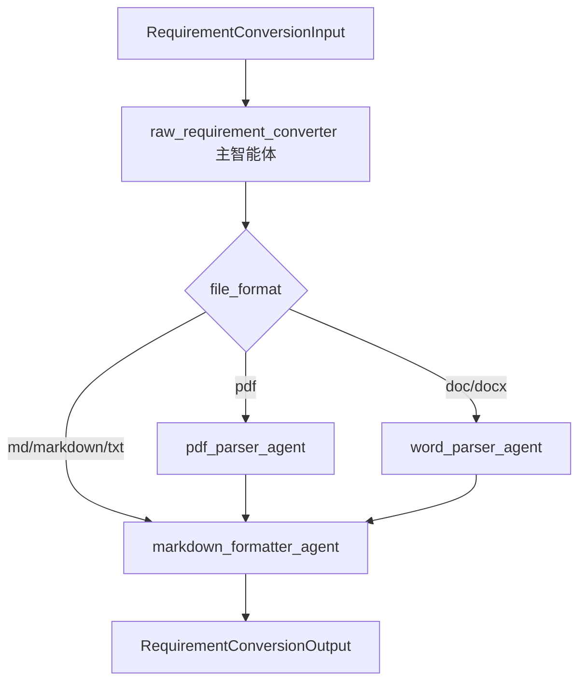

# 原始需求文件 Markdown 转换智能体改造 Spec

## 背景

当前需求文件上传后，后端会先保存原始文件，再将原始文件转换为标准 Markdown，供后续需求归并、需求分析和人工编辑使用。

现有转换链路中，本地解析器已经承担了 PDF、Word、Markdown、TXT 的基础解析工作，但格式转换智能体仍处于旧目录和旧调用方式中。新的 agents 架构已经建立，文档修改智能体已迁移到 `apps/backend/app/agents`，原始需求文件转换智能体也需要迁入新结构。

本次改造采用 DeepAgents，不再使用单个普通 LangChain agent。原因是原始文件转换天然包含两个阶段：

1. 按文件类型进行解析整理。
2. 将候选内容统一标准化为 Markdown。

因此 PDF 和 Word 文档至少经过两个子智能体，而不是按文件类型调用一个智能体后直接结束。Markdown 和 TXT 原始文档已经由本地解析器解码为文本候选内容，可以直接进入 Markdown 标准化子智能体。

## 目标

- 在 `apps/backend/app/agents` 下新增原始需求文件转换智能体。
- 使用 DeepAgents 主智能体编排多个子智能体。
- PDF 和 Word 文件固定经过“类型解析子智能体”和“Markdown 标准化子智能体”两个阶段。
- Markdown 和 TXT 文件直接进入 Markdown 标准化子智能体。
- 使用 skills 存放各阶段的转换规则。
- 保留当前本地解析器作为确定性解析层，不让 LLM 直接解析二进制文件。
- 删除当前转换输出中没有真实业务价值的质量字段。
- 保持现有上传、转换、标准文件预览和保存流程可用。

## 非目标

- 不新增独立质量校验智能体。
- 不新增质量评分体系。
- 不设计 `conversion_quality_agent`。
- 不保留 `quality_score` 和 `warnings` 作为转换输出字段。
- 不引入 OCR 能力。
- 不重构前端页面。
- 不改造需求归并、需求分析、知识库构建等其他智能体。

## 目录结构

新增目录：

```text
apps/backend/app/agents/
  raw_requirement_converter/
    __init__.py
    agent.py
    schemas.py
    tools.py
    skills/
      pdf_parse/
        SKILL.md
      word_parse/
        SKILL.md
      markdown_format/
        SKILL.md
```

文件职责：

- `agent.py`：创建 DeepAgents 主智能体，声明子智能体、skills、系统指令。
- `schemas.py`：承载或复用转换输入输出 schema。
- `tools.py`：提供本智能体可调用的轻量工具。第一版不让 LLM 直接读取文件，只接收 service 传入的候选 Markdown。
- `skills/pdf_parse/SKILL.md`：PDF 候选内容整理规则。
- `skills/word_parse/SKILL.md`：Word 候选内容整理规则。
- `skills/markdown_format/SKILL.md`：统一 Markdown 标准化规则。

## 智能体设计

### 主智能体

`raw_requirement_converter_agent`

职责：

- 接收 `RequirementConversionInput`。
- 根据 `file_format` 选择执行路径。
- PDF 文件先调用 `pdf_parser_agent`，再交给 `markdown_formatter_agent`。
- Word 文件先调用 `word_parser_agent`，再交给 `markdown_formatter_agent`。
- Markdown 和 TXT 文件直接交给 `markdown_formatter_agent`。
- 返回最终 `RequirementConversionOutput`。

主智能体只负责调度和汇总，不直接做文件类型细节处理。

### 子智能体

`pdf_parser_agent`

- 处理 PDF 本地解析器生成的候选 Markdown。
- 清理页眉、页脚、页码、重复噪声。
- 修复 PDF 抽取导致的异常断行。
- 不补写原文不存在的需求事实。

`word_parser_agent`

- 处理 Word 本地解析器生成的候选 Markdown。
- 保留标题、表格、列表、链接、图片引用和代码块。
- 修正 Word 样式导致的 Markdown 层级问题。
- 不改写业务语义。

`markdown_formatter_agent`

- 所有文件类型都必须经过。
- 对 PDF 和 Word，接收类型解析子智能体输出的候选 Markdown。
- 对 Markdown 和 TXT，直接接收本地解析器输出的候选内容。
- 统一标题、空行、列表、表格、代码块格式。
- 输出最终 `RequirementConversionOutput`。
- `conversion_summary` 中说明完成的转换动作和明确遇到的问题。

## 执行流程



## Schema 调整

当前输出：

```python
class RequirementConversionOutput(BaseModel):
    markdown_content: str = ""
    conversion_summary: str = ""
    quality_score: int = Field(default=100, ge=0, le=100)
    warnings: list[str] = Field(default_factory=list)
```

调整为：

```python
class RequirementConversionOutput(BaseModel):
    markdown_content: str
    conversion_summary: str = ""
```

字段说明：

- `markdown_content`：转换后的标准 Markdown，核心输出。
- `conversion_summary`：转换摘要，以及扫描件、乱码、表格无法完整保留等明确问题。

移除字段：

- `quality_score`：当前没有真实质量判断，旧逻辑基本写死为 100。
- `warnings`：当前没有独立消费，只会被拼进 `conversion_summary`，因此第一版直接由 `conversion_summary` 承载。

数据库中的 `conversion_quality` 字段不作为本次智能体输出使用。若后续做数据库清理，可再单独删除字段和迁移逻辑。

## Service 调用边界

保留现有文件上传和本地解析流程：

```text
source file bytes
  -> convert_requirement_file_to_markdown()
  -> normalize_requirement_markdown()
  -> RequirementConversionInput
  -> raw_requirement_converter_service
  -> DeepAgents 主智能体
  -> RequirementConversionOutput
```

`apps/backend/app/services/document_file_service.py` 中的 `convert_to_markdown()` 继续作为上传转换链路入口。

需要将旧服务：

```text
apps/backend/app/services/raw_requirement_format_converter_service.py
```

改为调用新目录下的 DeepAgents 智能体，不再引用旧的：

```text
app.agents.raw_requirement_format_converter.runner
```

## 模型配置

继续使用现有 capability：

```text
raw_requirement_format_converter
```

原因：

- 该 id 已在 `apps/backend/app/agents/capabilities.py` 中存在。
- 前端模型配置和后端模型选择应继续按 capability id 关联。
- Python 包名可以使用更短的 `raw_requirement_converter`，但 capability id 不需要改。

模型构建继续复用：

```text
apps/backend/app/agents/model_selection.py
apps/backend/app/agents/model_factory.py
```

## Skills 设计

DeepAgents 中通过 `skills` 参数注册 skill 目录。

第一版注册三个 skills：

```text
pdf_parse
word_parse
markdown_format
```

每个 `SKILL.md` 只写该阶段规则，不写调用代码。

核心约束：

- 不编造需求事实。
- 不删除原文中的需求点、表格、字段、枚举、流程。
- 不把完整正文包在代码块中。
- 代码、接口示例、JSON、SQL 等原有代码块需要保留。
- 明确问题写入 `conversion_summary`，不单独输出 warnings。

## 测试要求

新增或更新后端测试：

- 验证新目录存在：`apps/backend/app/agents/raw_requirement_converter/agent.py`。
- 验证旧服务不再引用 `app.agents.raw_requirement_format_converter.runner`。
- 验证 `RequirementConversionOutput` 只包含 `markdown_content` 和 `conversion_summary`。
- 验证 PDF 输入会经过 PDF 子智能体和 Markdown 标准化子智能体。
- 验证 Word 输入会经过 Word 子智能体和 Markdown 标准化子智能体。
- 验证 Markdown/TXT 输入会直接进入 Markdown 标准化子智能体。
- 验证 service 能从 DeepAgents 返回结果中取到结构化输出。
- 验证智能体失败时仍使用本地候选 Markdown 兜底。

## 验收标准

- 原始需求文件上传后仍能生成标准 Markdown。
- PDF、Word、Markdown/TXT 三类文件都有明确的子智能体路径。
- PDF 和 Word 文件至少经过两个子智能体。
- Markdown 和 TXT 文件直接经过 Markdown 标准化子智能体。
- `quality_score` 和 `warnings` 不再出现在转换输出 schema 中。
- 旧 `ai_agents` / `llm_tasks` / 旧 runner 路径不再参与该能力调用。
- 后端测试通过。
