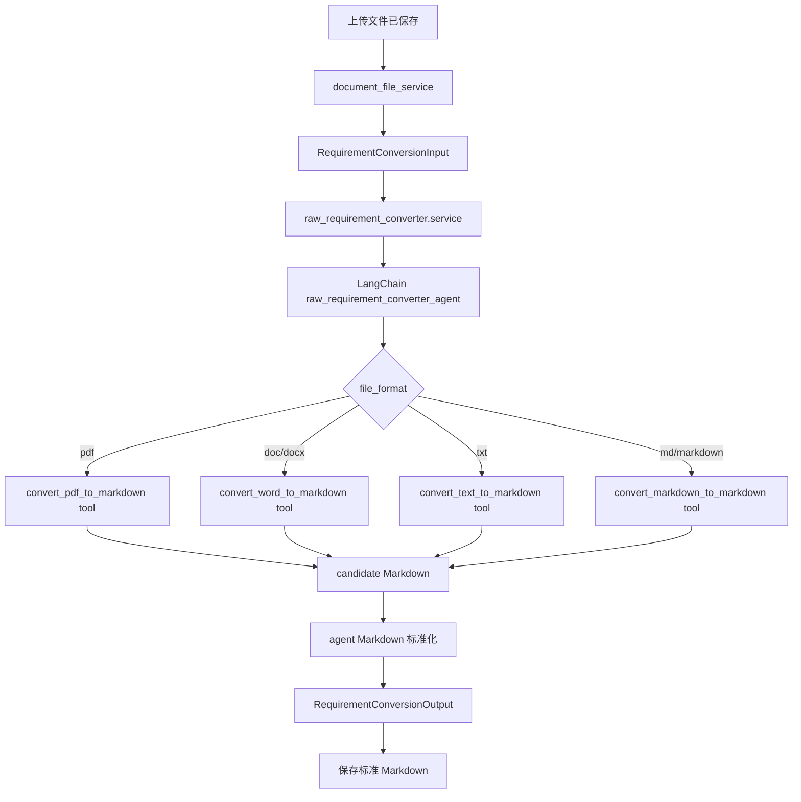

# 原始需求文件转换智能体 LangChain 单 Agent 改造 Spec

## 背景

当前原始需求文件转换智能体经历了多轮局部调整，现状已经出现职责混乱：

- `raw_requirement_converter/agent.py` 仍保留 `pdf_parser_agent`、`word_parser_agent`、`markdown_formatter_agent` 三个 DeepAgents 子智能体。
- PDF/Word/TXT/Markdown 的确定性转换实现已迁到 `agents/raw_requirement_converter/converters.py`，但上传转换链路仍由 `document_file_service.convert_to_markdown()` 先生成 `candidate_markdown`，再调用智能体做后处理。
- `tools.py` 中已有转换工具，但真实上传流程没有让单个 agent 负责完整转换目标。
- `skills/` 目录只承载很少的 Markdown 格式化规则，引入 DeepAgents skills 体系收益不高，反而增加目录和运行时复杂度。

本次改造目标是将原始需求文件转换能力收敛为一个清晰的 LangChain 单 agent：PDF/Word/Text/Markdown 是工具和 converter，不是子智能体；格式化规则直接写入 agent prompt，不再保留独立 skills 目录。

## 目标

- 使用 LangChain `create_agent` 构建一个 `raw_requirement_converter_agent`。
- 删除 DeepAgents 依赖、`FilesystemBackend`、自定义 subagents 和 `skills/` 目录。
- 保留一个业务智能体，代表“原始需求文件转换为标准 Markdown”完整能力。
- 将 PDF、Word、TXT、Markdown 转换能力作为 tools 暴露给 agent。
- 将确定性解析实现放在 agent 包内的 `converters/` 下。
- service 只负责编排上传流程、保存文件、调用 agent service、保存转换结果。
- 保持 `RequirementConversionOutput` 简洁，只包含最终 Markdown 和转换摘要。

## 非目标

- 不新增 PDF 智能体、Word 智能体或 Markdown 智能体。
- 不引入 DeepAgents skills。
- 不新增质量评分智能体。
- 不新增 OCR 能力。
- 不重构需求归并、需求分析、知识库构建等其他智能体。
- 不改造前端页面。

## 目标目录结构

```text
apps/backend/app/agents/raw_requirement_converter/
  __init__.py
  agent.py
  service.py
  schemas.py
  tools.py
  converters/
    __init__.py
    pdf.py
    word.py
    text.py
    markdown.py
```

删除目录：

```text
apps/backend/app/agents/raw_requirement_converter/skills/
```

## 组件职责

### agent.py

负责创建唯一的 LangChain agent。

要求：

- 使用 `from langchain.agents import create_agent`。
- 不 import `deepagents`。
- 不定义 `SUBAGENTS`。
- 不定义 `pdf_parser_agent`、`word_parser_agent`、`markdown_formatter_agent`。
- 直接在 `SYSTEM_PROMPT` 中写入 Markdown 标准化规则。
- 使用 `response_format=RequirementConversionOutput` 获取结构化输出。

示意：

```python
from langchain.agents import create_agent

from app.agents.raw_requirement_converter.schemas import RequirementConversionOutput
from app.agents.raw_requirement_converter.tools import tools


SYSTEM_PROMPT = """
你是 AI 测试系统中的原始需求文件 Markdown 转换智能体。
你负责把 PDF、Word、TXT、Markdown 原始需求文件转换为标准 Markdown。
你必须根据 file_format 调用合适的转换工具。
你不能编造原文没有的需求事实。
你必须保留标题、列表、表格、代码块、接口字段、枚举值和流程步骤。
你需要统一 Markdown 标题、空行、列表、表格和代码块格式。
最终返回 RequirementConversionOutput。
""".strip()


def raw_requirement_converter_agent(model):
    return create_agent(
        model=model,
        tools=tools,
        system_prompt=SYSTEM_PROMPT,
        response_format=RequirementConversionOutput,
    )
```

### tools.py

负责声明 agent 可调用工具。

目标工具：

```text
convert_pdf_to_markdown
convert_word_to_markdown
convert_text_to_markdown
convert_markdown_to_markdown
normalize_markdown_content
```

工具职责：

- 接收本地文件路径或 Markdown 文本。
- 调用 `converters/` 中的确定性实现。
- 返回结构化字典，例如：

```python
{
    "markdown": "...",
    "summary": "..."
}
```

工具不负责调用模型，不负责写数据库。

### converters/

负责确定性文件解析。

```text
converters/pdf.py
```

- 使用 PyMuPDF 提取 PDF 文本。
- 清理页码、重复页眉页脚等基础噪声。
- 不做 LLM 语义扩写。

```text
converters/word.py
```

- 使用 python-docx 提取 Word 段落、标题、表格、列表、链接和图片。
- 图片写入传入的 assets 目录。

```text
converters/text.py
```

- 解码 TXT。
- 处理编码兼容，例如 `utf-8`、`utf-8-sig`、`gb18030`。

```text
converters/markdown.py
```

- Markdown 文件 pass-through。
- 保留原有 Markdown 结构。
- 可调用 normalizer 做最小清理。

```text
converters/__init__.py
```

- 暴露统一入口：

```python
convert_requirement_file_to_markdown(
    filename: str,
    raw_bytes: bytes,
    *,
    assets_dir: Path | None = None,
) -> tuple[str, str]
```

### service.py

负责 agent 包内部的一次完整转换流程。

职责：

1. 接收 `RequirementConversionInput`。
2. 创建 LangChain agent。
3. 将 `filename`、`file_format`、`source_file_path`、`assets_dir_path` 传给 agent。
4. 调用 `agent.ainvoke(...)`。
5. 读取 `result["structured_response"]`。
6. 缺失结构化结果或结果为空时抛出明确错误。
7. 由上层 `document_file_service` 决定 fallback 和 DB 状态更新。

### schemas.py

复用或承载转换输入输出 schema。

输入调整为：

```python
class RequirementConversionInput(BaseModel):
    filename: str
    file_format: str
    source_file_path: str
    assets_dir_path: str | None = None
```

输出保持：

```python
class RequirementConversionOutput(BaseModel):
    markdown_content: str
    conversion_summary: str = ""
```

## Service 调用边界

`document_file_service.py` 只负责上传转换业务流程：

```text
保存原始文件
  -> 构造 RequirementConversionInput
  -> 调用 raw_requirement_converter.service.convert_requirement_file(...)
  -> 保存标准 Markdown
  -> 更新文件 mapping 状态
```

`document_file_service.py` 不再直接调用：

```python
convert_requirement_file_to_markdown(...)
normalize_requirement_markdown(...)
```

如果 agent 运行失败，fallback 可以保留，但 fallback 也必须调用 agent 包内的 deterministic converter，而不是 service 自己拥有 converter 实现。

## 执行流程



## Prompt 规则

格式化规则直接写入 `SYSTEM_PROMPT`。

核心约束：

- 不得编造原文没有的需求事实。
- 不删除原文中的需求点、表格、字段、枚举、流程、限制条件和异常规则。
- PDF 解析出的纯文本需要尽量恢复标题、列表、段落结构。
- Word 中的标题、表格、列表、链接、图片引用和代码块需要保留。
- Markdown 输入不得大幅改写原文结构，只做必要清理。
- TXT 输入可以整理为 Markdown 段落和列表，但不得扩写。
- 输出必须是 `RequirementConversionOutput`。
- `conversion_summary` 简要说明使用的工具、完成的转换动作和明确遇到的问题。

## 需要删除的旧结构

删除或改写：

```text
apps/backend/app/agents/raw_requirement_converter/skills/
apps/backend/app/agents/raw_requirement_converter/agent.py 中的 SUBAGENTS
apps/backend/app/agents/raw_requirement_converter/agent.py 中的 PDF_PARSER_PROMPT
apps/backend/app/agents/raw_requirement_converter/agent.py 中的 WORD_PARSER_PROMPT
apps/backend/app/agents/raw_requirement_converter/agent.py 中的 MARKDOWN_FORMATTER_PROMPT
deepagents.create_deep_agent
deepagents.backends.filesystem.FilesystemBackend
```

## 测试要求

新增或更新测试：

- `agent.py` 使用 `langchain.agents.create_agent`。
- `agent.py` 不再 import `deepagents`。
- `agent.py` 不再存在 `SUBAGENTS`。
- `raw_requirement_converter/skills` 目录不存在。
- `tools.py` 暴露 PDF、Word、TXT、Markdown、normalize 五个工具。
- `converters/` 下存在 `pdf.py`、`word.py`、`text.py`、`markdown.py`。
- `RequirementConversionInput` 不再包含 `candidate_markdown`、`candidate_summary`。
- `RequirementConversionInput` 包含 `source_file_path`、`assets_dir_path`。
- `document_file_service.py` 不再直接调用 service-owned converter。
- `raw_requirement_converter.service` 能读取 `structured_response`。
- agent 失败时上传转换链路可以 fallback 到 agent 包内 deterministic converter。

## 验收标准

- 原始需求文件上传后仍能生成标准 Markdown。
- PDF、Word、TXT、Markdown 都有对应 tool。
- 代码中不存在 PDF/Word/Markdown 三个子智能体。
- 代码中不存在 DeepAgents 依赖。
- `skills/` 目录已删除。
- service 层不再拥有文件解析实现。
- 后端相关测试通过。

## 风险与处理

### 风险：agent 未按预期调用正确工具

处理：

- tool 名称和描述必须明确。
- prompt 中明确 file_format 到 tool 的映射。
- service 保留 fallback，fallback 调用 agent 包内 converters。

### 风险：LangChain structured output 在不同 provider 表现不一致

处理：

- 继续通过 `build_agent_model(selection)` 构建模型。
- 保留缺失 `structured_response` 的明确错误。
- fallback 不阻断上传流程。

### 风险：迁移 converters 时破坏现有 PDF/Word 行为

处理：

- 先复制现有测试或新增最小样例测试。
- 保持原有 `convert_requirement_file_to_markdown` 统一入口。
- 只改变所有权和调用路径，不主动重写解析算法。
