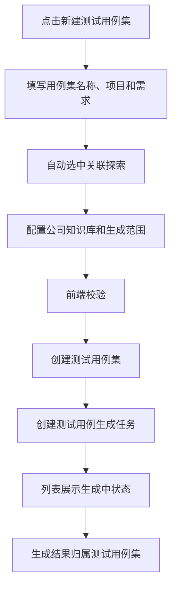

# 测试用例集生成弹窗设计 Spec

## 背景

当前 `测试用例` 页面仍是空列表壳子，右上角已有“新建用例”式入口但没有真实生成能力。用户希望在测试用例模块新增一个“新建测试用例集”的能力：用户选择一个需求后，系统基于该需求生成测试用例；如果已有探索任务关联该需求，弹窗自动选中关联探索；公司知识库作为默认开启的补充查询来源，用于处理测试设计中的不确定内容。

本设计只覆盖测试用例模块内的“测试用例集生成”。不涉及 UI 自动化模块，也不复用或修改 `00-20 AI测试系统 - 测试集管理 PRD` 中的 UI 自动化用例测试集。

## 目标

- 在 `测试用例` 页面右上角提供 `新建测试用例集` 入口。
- 新建弹窗参考现有 `新建探索任务` 弹窗结构和交互风格。
- 创建测试用例集时只能选择一个需求。
- 选择需求后，若存在关联探索任务，自动选中该探索，但允许用户手动调整或取消。
- 公司知识库作为生成上下文选项默认开启。
- 支持生成整个需求的测试用例，也支持只生成需求内指定范围的测试用例。
- 指定范围模式下展示输入框，允许用户输入自然语言范围，例如“这个需求中登录部分的测试用例”。
- 提交后创建测试用例集和生成任务，生成出的测试用例归属该测试用例集。

## 非目标

- 不设计 UI 自动化用例测试集。
- 不生成 UI 自动化代码。
- 不执行自动化测试。
- 不改动探索任务的创建流程。
- 不把公司知识库作为业务事实来源来补齐需求中没有确认的规则。
- 不支持一次选择多个需求。
- 不做跨项目测试用例集。

## 命名边界

### 测试用例集

测试用例模块内的业务测试用例生成容器。它记录一次生成所依赖的需求、探索、公司知识库开关、生成范围和生成结果。

### UI 自动化用例测试集

UI 自动化模块内的执行集合。它组合已生成 UI 自动化代码的用例，用于批量执行和报告聚合。本次不处理。

前端文案优先使用 `测试用例集`，避免简称 `测试集` 与 UI 自动化语义混淆。

## 页面入口

位置：

- 页面：`/test-cases`
- 位置：测试用例列表右上角主按钮
- 文案：`新建测试用例集`

列表空态建议同步调整为：

```text
暂无测试用例。可新建测试用例集，选择需求后生成测试用例。
```

## 弹窗结构

弹窗参考 `apps/frontend/src/components/ai-testing/exploration-workspace.tsx` 中的新建探索任务弹窗。

结构：

```text
DialogContent sm:max-w-3xl
  DialogHeader
    DialogTitle: 新建测试用例集
    DialogDescription: 选择一个需求，配置探索、公司知识库和生成范围后生成测试用例。
  FieldGroup
    两列基础字段
    长文本字段横跨两列
  DialogFooter
    取消
    生成测试用例
```

弹窗需要保持：

- 最大高度不超过视口。
- 表单区域可滚动。
- 底部按钮固定。
- 字段排列、间距和输入控件风格与新建探索任务一致。

## 表单字段

| 字段 | 必填 | 控件 | 规则 |
| --- | --- | --- | --- |
| 用例集名称 | 是 | Input | 默认可根据需求名称生成，例如 `{需求名称} 测试用例集`，允许修改 |
| 项目 | 是 | Select | 如果当前处于指定项目分区，则锁定为当前项目；否则必须选择项目 |
| 需求 | 是 | Select | 只能选择一个需求；切换项目后清空需求和关联探索 |
| 关联探索 | 否 | Select 或 Combobox | 选择需求后自动选中关联探索；用户可改选其他探索或选择不使用探索 |
| 使用公司知识库 | 否 | Switch 或 Checkbox | 默认开启 |
| 生成范围 | 是 | RadioGroup 或 Segmented Control | `全部需求内容` / `指定范围` |
| 指定范围说明 | 条件必填 | Textarea | 仅在选择 `指定范围` 时展示 |
| 备注 | 否 | Textarea | 仅记录人工说明，不作为硬性生成范围 |

### 关联探索字段

需求变化后，前端请求或使用已加载数据查找关联探索：

- 如果存在一个或多个关联探索，默认选中最新的已完成或部分完成探索。
- 字段下方展示说明：`已根据所选需求自动选择关联探索，可手动调整。`
- 如果没有关联探索，字段展示 `不使用探索`，并提示：`未找到关联探索，仍可基于需求和公司知识库生成。`
- 用户可以选择 `不使用探索`。

### 公司知识库字段

默认开启。

语义：

- 用于查询通用测试规范、用例模板、术语、测试方法、质量规则。
- 用于辅助处理生成测试用例中“不确定怎么测”的内容。
- 不用于编造需求或探索中没有确认的业务事实。
- 如果需求和探索都无法确认业务结论，生成结果应标记为待确认，或输出补充问题。

建议字段说明：

```text
用于查询通用测试规范、模板和术语。不确定的业务规则仍会标记为待确认。
```

### 生成范围字段

范围模式：

| 模式 | 说明 |
| --- | --- |
| 全部需求内容 | 基于所选需求生成完整测试用例 |
| 指定范围 | 只针对用户输入的需求片段、功能点或场景生成测试用例 |

指定范围输入框 placeholder：

```text
例如：这个需求中登录部分的测试用例
```

选择 `指定范围` 后，输入框必填。提交时去除首尾空格。为空时阻止提交并提示：

```text
请填写要生成的需求范围
```

## 提交流程



提交校验：

- 必须有有效项目。
- 必须填写用例集名称。
- 必须选择一个需求。
- `指定范围` 模式必须填写范围说明。

提交成功：

- 关闭弹窗。
- 列表新增一条测试用例集或生成批次记录。
- 展示 `生成中` 状态。
- 任务进入任务中心。

提交失败：

- 保持弹窗打开。
- 使用既有 `reportError` 风格展示错误。
- 不清空用户已填内容。

## 生成上下文

后端生成请求需要包含：

| 字段 | 说明 |
| --- | --- |
| project_id | 所属项目 |
| name | 测试用例集名称 |
| requirement_doc_id | 唯一需求 |
| exploration_run_id | 可为空 |
| include_company_knowledge | 默认 true |
| generation_scope_type | `all` 或 `specified` |
| generation_scope_text | 指定范围文本，`all` 时为空 |
| notes | 可选备注 |

生成 Agent 的上下文边界：

- 需求是主要业务事实来源。
- 探索是页面事实和操作路径来源。
- 公司知识库是通用测试知识来源。
- 当三者无法确认业务事实时，不能直接生成确定结论；应在用例中标记待确认，或形成待确认问题。

## 数据模型建议

### TestCaseSet

| 字段 | 说明 |
| --- | --- |
| id | 测试用例集 ID |
| project_id | 所属项目 |
| name | 用例集名称 |
| requirement_doc_id | 关联需求 |
| exploration_run_id | 关联探索，可为空 |
| include_company_knowledge | 是否启用公司知识库 |
| generation_scope_type | `all` / `specified` |
| generation_scope_text | 指定范围说明 |
| status | 生成中、待评审、生成失败、已归档 |
| case_count | 当前用例数量 |
| created_by | 创建人 |
| created_at | 创建时间 |
| updated_at | 更新时间 |

### TestCaseGenerationRun

| 字段 | 说明 |
| --- | --- |
| id | 生成任务 ID |
| test_case_set_id | 所属测试用例集 |
| task_id | 任务中心任务 ID |
| input_json | 生成输入快照 |
| status | 排队中、生成中、完成、失败 |
| error_message | 失败原因 |
| created_at | 创建时间 |
| finished_at | 完成时间 |

### TestCase

生成出的测试用例需要归属 `test_case_set_id`，并继续保留 PRD 已定义字段：用例编号、标题、模块、场景类型、优先级、风险等级、前置条件、步骤、预期结果、来源引用、自动化可行性、评审状态和版本。

## API 设计建议

第一版可新增测试用例模块接口：

```http
POST /api/v1/projects/{project_id}/test-case-sets
```

请求：

```json
{
  "name": "登录需求测试用例集",
  "requirement_doc_id": "doc-001",
  "exploration_run_id": "explore-001",
  "include_company_knowledge": true,
  "generation_scope_type": "specified",
  "generation_scope_text": "这个需求中登录部分的测试用例",
  "notes": ""
}
```

响应：

```json
{
  "id": "tcs-001",
  "project_id": "project-001",
  "name": "登录需求测试用例集",
  "status": "generating",
  "case_count": 0,
  "generation_task_id": "task-001"
}
```

可配套查询：

```http
GET /api/v1/projects/{project_id}/test-case-sets
GET /api/v1/projects/{project_id}/test-case-sets/{set_id}
GET /api/v1/projects/{project_id}/test-case-sets/{set_id}/cases
```

## 前端实现建议

建议在测试用例页或同目录组件中新增：

```text
TestCaseSetDialog
TestCaseSetList
TestCaseGenerationStatusBadge
```

表单状态参考探索任务：

```ts
type TestCaseSetForm = {
  name: string;
  projectId: string;
  requirementDocId: string;
  explorationRunId: string;
  includeCompanyKnowledge: boolean;
  generationScopeType: "all" | "specified";
  generationScopeText: string;
  notes: string;
};
```

打开弹窗时：

- 根据当前项目分区填充 `projectId`。
- `includeCompanyKnowledge` 默认为 `true`。
- `generationScopeType` 默认为 `all`。
- 如果已在需求详情或带参数入口打开，可预填需求。

选择需求时：

- 自动填充默认名称。
- 自动选中关联探索。
- 清空旧的指定范围文本不强制，避免用户误切换时丢内容；提交时按当前模式决定是否使用。

## 权限

沿用测试用例模块权限：

| 角色 | 权限 |
| --- | --- |
| 管理员 | 可创建测试用例集并生成测试用例 |
| 测试工程师 | 可在分配项目内创建测试用例集并生成测试用例 |
| 访客 | 只能查看，不能创建或生成 |

在全部项目分区下，如果没有选定项目，创建按钮可以打开弹窗，但弹窗内必须选择项目后才能提交。

## 验收标准

1. 测试用例页右上角显示 `新建测试用例集`。
2. 点击后打开与新建探索任务风格一致的宽弹窗。
3. 弹窗中项目、需求、关联探索、公司知识库、生成范围、备注字段可见。
4. 需求只能选择一个。
5. 选择需求后，存在关联探索时自动选中关联探索。
6. 自动选中的关联探索允许用户手动修改或取消。
7. 公司知识库选项默认开启。
8. 生成范围默认选择 `全部需求内容`。
9. 选择 `指定范围` 后显示范围输入框。
10. 指定范围输入框 placeholder 包含示例：`这个需求中登录部分的测试用例`。
11. 指定范围模式下未填写范围说明时不能提交。
12. 提交后创建测试用例集和生成任务。
13. 生成出的测试用例归属该测试用例集。
14. 公司知识库只作为通用测试知识来源，不替代需求业务事实。
15. 访客不能创建测试用例集。
16. 本次改造不改变 UI 自动化页面和 UI 自动化用例测试集。

## 风险与处理

### 风险：测试用例集与 UI 自动化测试集混淆

处理：

- 文案使用 `测试用例集`。
- 不在 UI 自动化页面增加入口。
- API、模型和文档避免使用裸 `test_set` 表达。

### 风险：公司知识库被误用为业务事实来源

处理：

- Agent prompt 明确公司知识库只提供通用规范和模板。
- 输出中对无法确认的业务规则标记待确认。
- 来源引用区分需求、探索和公司知识库。

### 风险：指定范围表达过宽或过窄

处理：

- 保留用户原始范围文本。
- 生成任务输入快照记录范围。
- 生成结果可展示范围摘要和覆盖对象，便于人工评审。

## 实施顺序

1. 后端新增测试用例集和生成任务 schema、repository、service。
2. 后端新增创建和查询测试用例集 API。
3. 后端实现需求、探索、公司知识库上下文组装。
4. 前端测试用例页新增测试用例集列表基础展示。
5. 前端新增参考探索任务样式的 `新建测试用例集` 弹窗。
6. 前端实现需求选择后自动带出关联探索。
7. 前端接入创建接口和生成中状态。
8. 补充后端和前端契约测试。
