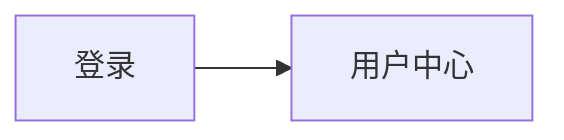
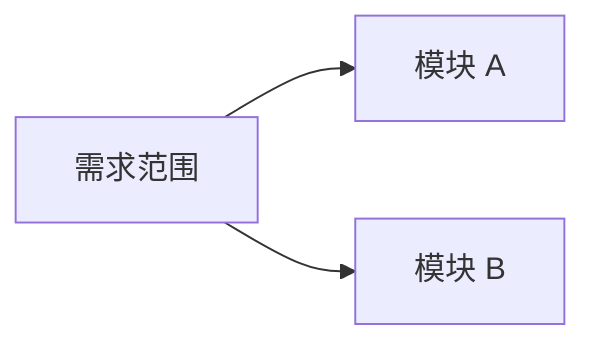
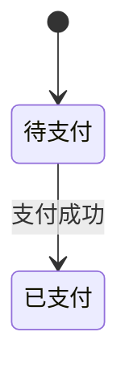
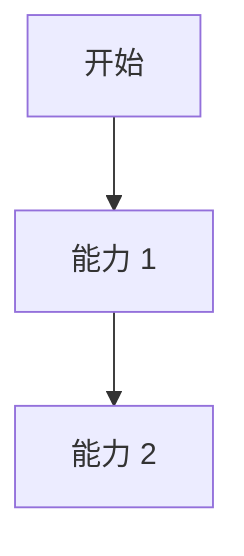

# 需求分析 LangGraph 三 Tab 产物边界改造规范

## 背景

当前需求分析主流程已经切换为 v3 LangGraph 架构：

```text
understand_node
  -> quality_node
  -> clarify_node / prepare_empty_clarification
  -> enhance_node
```

三类核心结果在 Agent 层已经拆分为：

- `understanding`：需求理解结果。
- `quality_assessment`：质量评估结果。
- `clarification`：待澄清内容。

但最终 Markdown 产物仍存在旧综合报告遗留问题：`analysis_report_markdown` 由 `generate_analysis_report(understanding, quality, clarification)` 生成，包含执行摘要、质量评分、质量评估、待澄清统计和待澄清问题列表。前端同时又有独立的“质量保证”Tab 和“待澄清”Tab，导致：

1. “需求分析”Tab 混入质量评估章节。
2. “需求分析”Tab 混入待澄清内容章节。
3. “质量保证”Tab 与“需求分析”Tab 重复展示质量结论。
4. 用户难以区分“已理解的需求事实”“质量评估发现”和“需要人工确认的问题”。

本次改造目标是让 v3 LangGraph 的三块核心输出在用户可见三 Tab 中严格各司其职。

## 目标

- 将“需求分析”Tab 收敛为纯需求理解报告。
- 将质量评估、质量评分、质量门禁、NFR、覆盖审计全部放入“质量保证”Tab。
- 将需要人工回答或裁决的问题全部放入“待澄清”Tab。
- 在“需求分析”Tab 中增加 Mermaid 理解图，帮助用户理解业务流程、状态流转、模块关系和角色交互。
- 保持当前 LangGraph 节点架构不变，不恢复旧 v2 skill 入口。
- 复用现有 schema 和结构化输出，不新增不必要接口。
- 用测试锁定三 Tab 边界，防止后续再次混排。

## 非目标

- 不恢复已废弃的 Codex 版需求分析 skill 入口。
- 不新增独立 Skill Runtime，不让 LangGraph 节点运行时读取 `SKILL.md`。
- 不重做需求上传、主需求选择、标准 Markdown 转换或任务生命周期。
- 不重做前端 Tab 布局，只调整后端输出内容和必要 fallback。
- 不改变待澄清问题的人工回答和写回流程。
- 不在本次改造中引入新的数据库表。

## 当前问题定位

### 主流程入口

当前服务入口在：

```text
apps/backend/app/services/document/service.py
```

运行时调用：

```python
from app.agents.requirement_analysis.workflow import run_requirement_analysis
```

LangGraph 编排在：

```text
apps/backend/app/agents/requirement_analysis/workflow.py
```

节点顺序为：

```text
understand -> assess_quality -> clarify/enhance -> enhance
```

### 混排发生点

混排发生在：

```text
apps/backend/app/agents/requirement_analysis/utils/report_generator.py
```

当前 `generate_analysis_report()` 接收三个结果：

```python
def generate_analysis_report(
    understanding: RequirementUnderstandingOutput,
    quality: QualityAssessmentOutput,
    clarification: ClarificationOutput,
) -> str:
```

并组合：

```text
# 需求分析报告
## 执行摘要
## 1. 需求理解
## 2. 质量评估
## 3. 待澄清内容
## 4. 下一步建议
```

这导致 `analysis_report_markdown` 同时承担三 Tab 内容。

### 已有独立质量 Tab

`service.py` 已经为 LangGraph 输出单独生成质量报告：

```python
quality_assurance_report = generate_quality_assurance_report(analysis_output.quality_assessment)
```

并写入：

```python
"quality_assurance_report_markdown": quality_assurance_report
```

因此质量评估内容不应继续写入 `analysis_report_markdown`。

## 目标产物边界

### 需求分析 Tab

运行时字段：

```text
analysis_report_markdown
```

唯一职责：展示需求理解结果。

应包含：

- 分析摘要。
- 模块与能力。
- 业务对象与字段。
- 业务规则。
- 状态流转。
- 依赖与集成点。
- 风险与假设。
- Mermaid 理解图。

不得包含：

- 质量评分。
- 质量门禁。
- 质量评估章节。
- 可测试性评分。
- 覆盖审计。
- NFR 缺口评分。
- 待澄清问题统计。
- 待澄清问题列表。
- 推荐答案选项。

### 质量保证 Tab

运行时字段：

```text
quality_assurance_report_markdown
quality_gate
maturity_assessment
```

唯一职责：展示需求质量评估与验证风险。

应包含：

- 质量摘要。
- 质量分数。
- 质量决策。
- 完整性评估。
- 清晰度评估。
- 可测试性评估。
- 一致性评估。
- NFR 缺口评估。
- 阻塞问题。
- 建议行动。
- 覆盖风险摘要。

不得包含：

- 完整待澄清问题清单。
- 推荐答案选项列表。
- 业务需求正文重写。
- 需求理解章节的长篇重复。

### 待澄清 Tab

运行时字段：

```text
clarification_questions
conflicts
clarification_report_markdown
```

唯一职责：承载需要人工回答或裁决的事项。

应包含：

- 待澄清项统计。
- 每个待澄清项的问题、影响、严重级别、来源维度。
- 当前文本。
- 建议修正。
- 最多两个推荐选项。
- 辅助文档证据。

不得包含：

- 质量评分。
- 质量门禁。
- 需求理解完整报告。

## 后端改造设计

### 1. 改造 `report_generator.py`

文件：

```text
apps/backend/app/agents/requirement_analysis/utils/report_generator.py
```

#### 1.1 调整公开函数

目标函数：

```python
def generate_analysis_report(
    understanding: RequirementUnderstandingOutput,
) -> str:
    """生成需求分析 Tab 的需求理解报告。"""
```

保留并增强：

```python
def generate_quality_assurance_report(
    quality: QualityAssessmentOutput,
    clarification: ClarificationOutput | None = None,
) -> str:
    """生成质量保证 Tab 的质量评估报告。"""
```

新增：

```python
def generate_clarification_report(
    clarification: ClarificationOutput,
) -> str:
    """生成待澄清 Tab 的 Markdown 报告。"""
```

`__all__` 应导出三者：

```python
__all__ = [
    "generate_analysis_report",
    "generate_quality_assurance_report",
    "generate_clarification_report",
]
```

#### 1.2 删除综合报告混排

删除或不再由 `generate_analysis_report()` 调用：

```python
_generate_summary(quality, clarification)
_generate_quality_section(quality)
_generate_clarification_section(clarification)
_generate_next_steps(quality)
```

这些内容迁移到：

- `_generate_quality_section()`：只由 `generate_quality_assurance_report()` 使用。
- `_generate_clarification_section()`：只由 `generate_clarification_report()` 使用。

#### 1.3 需求分析报告结构

目标 Markdown：

```markdown
# 需求分析报告

## 分析摘要

## 模块与能力

## 业务对象与字段

## 业务规则

## 状态流转

## 依赖与集成点

## 风险与假设

## Mermaid 理解图
```

### 2. Mermaid 生成规则

Mermaid 推荐由代码基于结构化 schema 生成，不依赖模型直接写 Markdown 图。

原因：

- 当前 `RequirementUnderstandingOutput` 已包含足够结构化信息。
- 代码生成更稳定。
- 可以避免模型把待澄清问题画成已确认流程。

#### 2.1 模块关系图

数据来源：

```python
understanding.modules[*].dependencies
understanding.dependencies
```

生成：

````markdown
### 模块关系图


````

如果没有依赖，但有多个模块，可生成模块清单式关系：



#### 2.2 状态流转图

数据来源：

```python
module.state_flows[*].states
module.state_flows[*].transitions
```

生成：

````markdown
### 状态流转图：订单


````

如果没有状态流转，展示：

```text
当前主需求未明确描述状态流转。
```

#### 2.3 业务流程图

数据来源：

```python
understanding.modules[*].capabilities
```

生成保守流程：



要求：

- 只使用已识别模块和能力。
- 不补充模型未确认的异常分支。
- 不把质量缺口或待澄清问题作为流程节点。

#### 2.4 Mermaid 安全处理

需要对节点文本做转义或清洗：

- 替换双引号。
- 去除换行。
- 限制节点 ID 为字母、数字、下划线。
- 空文本使用模块 key 或默认标签。

### 3. 改造 `enhance_node.py`

文件：

```text
apps/backend/app/agents/requirement_analysis/nodes/enhance_node.py
```

当前：

```python
analysis_report = generate_analysis_report(
    state["understanding"],
    state["quality"],
    state["clarification"]
)
```

改为：

```python
analysis_report = generate_analysis_report(state["understanding"])
```

`enhance_node` 不应再把质量和待澄清传给需求分析报告生成器。

### 4. 改造 `service.py`

文件：

```text
apps/backend/app/services/document/service.py
```

当前：

```python
quality_assurance_report = generate_quality_assurance_report(analysis_output.quality_assessment)
```

改为：

```python
quality_assurance_report = generate_quality_assurance_report(
    analysis_output.quality_assessment,
    analysis_output.clarification,
)
```

新增：

```python
clarification_report = generate_clarification_report(analysis_output.clarification)
```

并写入 `output_data`：

```python
"clarification_report_markdown": clarification_report,
```

### 5. 质量结果枚举兼容

当前 v3 schema 使用：

```python
QualityDecision.result: "approved" | "conditional" | "rejected"
```

前端 legacy 输出期望：

```text
passed | warning | blocked
```

当前 `_legacy_output_from_langgraph_result()` 直接写入：

```python
"result": analysis_output.quality_assessment.decision.result
```

这会把 `approved/conditional/rejected` 透传给前端的 `quality_result` 字段，和前端类型不一致。

本次建议同步修正映射：

```python
def _map_quality_result(result: str) -> str:
    if result == "approved":
        return "passed"
    if result == "conditional":
        return "warning"
    return "blocked"
```

写入：

```python
"quality_gate": {
    "result": _map_quality_result(analysis_output.quality_assessment.decision.result),
    ...
}
```

同时 `status` 仍由 LangGraph 现有逻辑决定：

```text
rejected -> blocked
needs_manual > 0 -> needs_clarification
else -> completed
```

## Agent Prompt 调整

### 需求理解 Agent

文件：

```text
apps/backend/app/agents/requirement_analysis/agent.py
```

`UNDERSTANDING_SYSTEM_PROMPT` 已明确：

```text
- 不评估质量（由质量评估 Agent 负责）
- 不识别问题或缺口（由质量评估 Agent 负责）
```

建议补充：

```text
- 为后续 Mermaid 理解图提供足够结构化信息：模块能力、状态流转、模块依赖和业务对象关系应尽量完整提取。
- 不要为了画图补充原文没有确认的节点、分支或状态。
```

### 质量评估 Agent

`QUALITY_ASSESSMENT_SYSTEM_PROMPT` 已包含 v2 skill 的核心质量能力：

- 完整性。
- NFR。
- 清晰度。
- 可测试性。
- 一致性。

本次不建议大改。仅建议补充：

```text
- 质量评估发现应进入 quality_assessment，不要要求需求分析报告承载质量章节。
- 需要人工确认的问题由 Clarification Agent 转换，质量评估只保留质量事实和影响。
```

### 待澄清 Agent

`CLARIFICATION_SYSTEM_PROMPT` 已负责从质量评估转换待澄清项。

建议补充：

```text
- 不要把质量评分、质量门禁或完整质量报告写入待澄清总结。
- 每个待澄清项必须面向人工回答或裁决。
```

## 前端影响

文件：

```text
apps/frontend/src/app/(main)/projects/[projectId]/requirements/[documentId]/page.tsx
```

当前前端有 fallback：

```ts
const qualityAssuranceMarkdown =
  analysisResult?.output.quality_assurance_report_markdown?.trim() ||
  extractMarkdownSection(analysisReportMarkdown, "质量评估");
```

改造后后端应稳定提供 `quality_assurance_report_markdown`，该 fallback 理论上不再触发。

建议保留 fallback 一段时间以兼容历史 run，但新增运行结果不应依赖从 `analysis_report_markdown` 提取质量章节。

待澄清 Tab 当前主要使用结构化 `clarification_questions` 和 `conflicts`。新增 `clarification_report_markdown` 后，可作为 Markdown 预览或空态详情，不强制本期 UI 使用。

## 测试方案

### 后端单元测试

优先修改或新增：

```text
apps/backend/tests/test_workflow_v3.py
apps/backend/tests/test_requirement_primary_file_service.py
apps/backend/tests/agents/requirement_analysis/test_integration_v2.py
```

### 必测断言

#### 需求分析报告边界

```python
assert "## 2. 质量评估" not in result.analysis_report_markdown
assert "## 3. 待澄清内容" not in result.analysis_report_markdown
assert "质量分数" not in result.analysis_report_markdown
assert "待澄清问题" not in result.analysis_report_markdown
assert "```mermaid" in result.analysis_report_markdown
```

#### 质量保证报告内容

```python
assert "质量评估" in output_data["quality_assurance_report_markdown"]
assert "完整性" in output_data["quality_assurance_report_markdown"]
assert "清晰度" in output_data["quality_assurance_report_markdown"]
assert "可测试性" in output_data["quality_assurance_report_markdown"]
assert "一致性" in output_data["quality_assurance_report_markdown"]
assert "非功能需求" in output_data["quality_assurance_report_markdown"]
```

#### 待澄清报告内容

```python
assert output_data["clarification_report_markdown"].startswith("# 待澄清")
assert "质量分数" not in output_data["clarification_report_markdown"]
```

#### 质量枚举映射

```python
assert output_data["quality_gate"]["result"] in {"passed", "warning", "blocked"}
```

### 前端回归

手动验证：

1. 执行一次需求分析。
2. 打开“需求分析”Tab：
   - 只看到需求理解。
   - 能看到 Mermaid 图。
   - 看不到质量评估和待澄清列表。
3. 打开“质量保证”Tab：
   - 看到质量分数、评估维度、NFR、阻塞问题和建议行动。
4. 打开“待澄清”Tab：
   - 看到待澄清卡片或待澄清 Markdown。
   - 质量评分不出现在此 Tab。

## 迁移策略

### 历史运行结果

历史 run 的 `analysis_report_markdown` 可能已经包含质量评估和待澄清内容。本次改造不回写历史数据。

前端 fallback 保留后，历史结果仍可显示质量报告。

### 新运行结果

新运行结果必须符合三 Tab 边界：

```text
analysis_report_markdown              -> 需求理解
quality_assurance_report_markdown     -> 质量评估
clarification_report_markdown         -> 待澄清报告
clarification_questions/conflicts     -> 待澄清结构化数据
```

## 实施顺序

1. 改造 `report_generator.py`：
   - 拆分 `generate_analysis_report()`。
   - 增强 `generate_quality_assurance_report()`。
   - 新增 `generate_clarification_report()`。
   - 新增 Mermaid 生成 helper。
2. 改造 `enhance_node.py`：
   - 只传 `understanding` 给 `generate_analysis_report()`。
3. 改造 `service.py`：
   - 生成质量报告时传入 `clarification`。
   - 写入 `clarification_report_markdown`。
   - 增加质量枚举映射。
4. 轻量调整 `agent.py` prompt：
   - 强化需求理解 Agent 的结构化图谱提取要求。
   - 强化质量和待澄清边界。
5. 补测试。
6. 跑后端测试。
7. 启动前端和后端，手动验证三 Tab。

## 验收标准

- 新需求分析运行后，“需求分析”Tab 不再包含质量评估章节。
- 新需求分析运行后，“需求分析”Tab 不再包含待澄清内容章节。
- 新需求分析运行后，“需求分析”Tab 包含至少一个 Mermaid 图。
- “质量保证”Tab 独立展示质量评估内容。
- “待澄清”Tab 独立展示人工待确认事项。
- `quality_gate.result` 对外只输出 `passed/warning/blocked`。
- 现有 LangGraph 节点顺序和状态流转不变。
- 不引入新的 Skill Runtime。
- 所有相关后端测试通过。

## 风险与注意事项

- Mermaid 节点名称需要转义，避免需求文本中的特殊字符破坏图。
- 如果需求文档极短，Mermaid 只能生成模块概览图，不应臆造流程。
- 历史 run 不回写，前端需兼容旧数据。
- 质量评估报告不要复制完整待澄清清单，只说明质量影响；否则又会与待澄清 Tab 重复。
- 待澄清报告不要复制完整质量评估报告，只保留人工确认项。

## 推荐最终结构

```text
apps/backend/app/agents/requirement_analysis/
  agent.py                         # 三个 Agent prompt，负责结构化理解/评估/澄清
  workflow.py                      # LangGraph 编排，不改主流程
  nodes/
    enhance_node.py                # 调用纯需求分析报告生成器
  utils/
    report_generator.py            # 三 Tab Markdown 产物边界
```

核心原则：

```text
Agent 负责理解和判断。
代码负责产物边界和稳定渲染。
需求分析 Tab 不承载质量评估。
质量保证 Tab 不承载待澄清问题清单。
待澄清 Tab 不承载质量评分。
```
